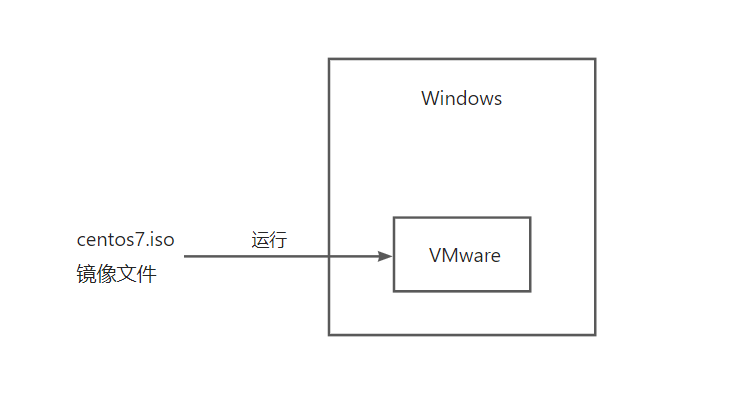
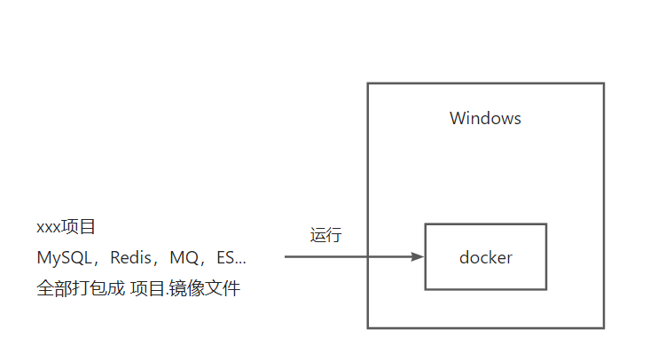
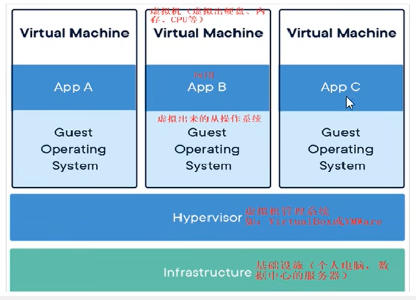
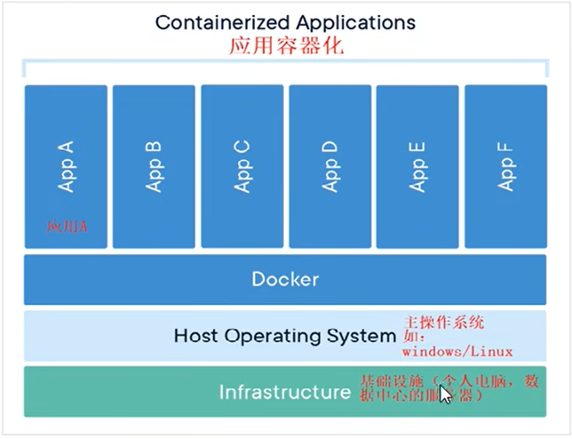
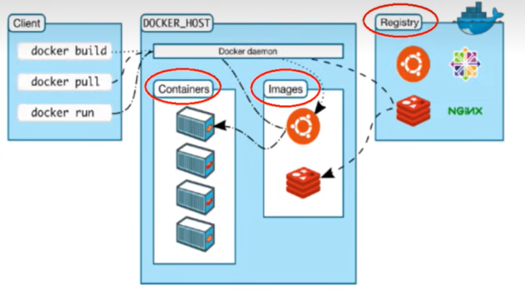
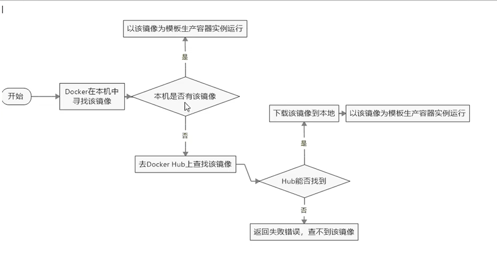

# Docker

## 一、Docker简介

### 1.1 为什么会出现Docker

当开发人员单独开发一种应用时，依据自己的开发环境（比如自己的笔记本电脑）进行配置，每种开发环境具有特定的配置，当现在进行合作开发时，其他开发人员的环境配置各有不同，现在需要合作运行，如何确应用在不同的环境中运行？并且在部署过程中不出现令人头疼的版本和配置问题，也无需编写代码进行故障修复？

答案就是使用容器，Docker之所以发展的如此迅速，也是因为它对此给出了一个标准化的解决方案 --- **系统平滑移植，容器虚拟化技术**

软件的环境配置相当复杂，换一台机器就需要重新来一次，所以衍生出了这样的问题：**软件是否可以带环境安装？**也就是说安装的时候，把原始环境一模一样复制过来，利用Docker就可以消除协作编码时在一台机器上可以正常工作，但在另一台机器上跑不起来的问题

Docker包含两方面的技术：

+ 镜像技术：打破代码即应用的概念，从系统环境开始，自底至上打包应用

  

  

Docker的出现使得Docker得以打破过去`程序即应用的观念`，透过镜像将作业系统核心除外，运作应用程式所需要的系统环境由下而上打包，达到应用程式跨平台间的无缝接轨运作

### 1.2 Docker的理念

Docker的理念有点像虚拟机，当我们需要在自己的电脑上使用Linux系统的相关功能时，会需要装一个虚拟机，VMware或者VirtualBox，然后在上面运行一个Linux的镜像文件，将整个Linux环境打包，放在虚拟机上运行，这就避免了环境冲突的问题

镜像文件保证了环境迁移的一致性



Docker也是类似的思想，只不过是将开发出来的项目的源码 + 运行环境打包成一个镜像文件，比如商城项目，里面的运行环境MySQL、Redis、MQ、ES等等



### 1.3 Docker是什么

Docker是基于Go语言实现的云开源项目

Docker的主要目标是"Build, Ship and Run Any App Anywhere"，也就是通过对应用组件的封装、分发、部署、运行等生命周期的管理，使用户的APP及其运行环境能够做到**"一次镜像，处处运行"**，将应用打成镜像，通过镜像成为运行在Docker容器上的实例，而Docker容器在任何操作系统上都是一致的，这就实现了跨平台、跨服务器，只需要一次配置好环境，换到其他地方就可以一键部署好，大大简化了操作

**容器和虚拟机的区别**

+ 虚拟机就是带环境安装的一种解决方案，它可以在一种操作系统里运行另一种操作系统；对于底层来说，虚拟机就是一个普通文件，不需要了就删掉，对其他部分毫无影响；传统虚拟机技术基于安装在主操作系统上的虚拟机管理系统（Vmware，VirtualBox等）创建虚拟机，在虚拟机上安装操作系统，再从操作系统中安装部署各种应用

  

+ Linux容器是与系统其他部分隔离开的一系列进程，从另一个镜像运行，并由该镜像提供支持进程所需的全部文件；容器提供的镜像包含了应用的所有依赖项，因而在从开发到测试再到生产的整个过程中，它都具有可移植性和一致性；容器技术并不是模拟一个完整的操作系统，而是**对进程进行隔离**，只对软件工作所需的库资源和设置，系统因此而变得高效轻量并保证部署在任何环境中的软件都能始终如一地运行

  

总结来说，Docker和虚拟机的区别就是：

+ 传统虚拟机技术是虚拟出一套硬件后，在其上运行一个完整的操作系统，在该系统上再运行所需应用进程
+ 容器内的应用进程直接运行于宿主的内核，容器内没有自己的内核且也没有进行硬件虚拟（复用本机的操作系统和硬件资源），因此容器要比传统虚拟机更为轻便
+ 每个容器之间相互隔离，每个容器有自己的文件系统，容器之间进程不会相互影响，能区分计算资源

### 1.4 Docker三要素

**镜像**

Docker镜像就是一个只读的模板，镜像可以用来创建Docker容器，**一个镜像可以创建很多容器**

镜像就相当于容器的"源代码"，docker镜像文件类似于Java中的类模板，就是`public class xxx{}`

**容器**

容器就是用镜像创建的运行实例，Docker利用容器独立运行的一个或者一组应用，容器就类似于一个虚拟化的运行环境

就像是Java中的类和实例对象一样，镜像是静态的定义，容器是镜像运行时的实体

容器为镜像提供了一个标准的和隔离的运行环境，它可以被启动、开始、停止和删除

> 对比Java来说：
>
> ```java
> public class Book {
>     //...
> }
> 
> Book b1 = new Book();
> Book b2 = new Book();
> Book b3 = new Book();
> //上面的代码中，Book是类模板，就相当于Docker中的镜像
> //b1,b2,b3是实例对象，就相当于Docker中的容器
> //将上面的代码转换到Docker中就是（假设要启动几个Redis的实例）
> Redis r1 = docker.run redis.镜像文件
> Redis r1 = docker.run redis.镜像文件
> Redis r1 = docker.run redis.镜像文件
> ```

**仓库**

仓库就是集中存放镜像文件的场所，类似于：Maven仓库是存放各种jar包的地方、Github仓库是存放各种git项目的地方

Docker公司提供的官方register被称为Docker hub，存放各种镜像模板的地方

仓库分为公开仓库和私有仓库两种，最大的公开仓库是Docker hub（https://hub.docker.com/）

存放了数量庞大的镜像，国内的公开仓库包括阿里云，网易云等


Docker本身是一个容器运行载体或者说是一个管理引擎，开发人员将应用程序和配置依赖打包好形成一个可交付的运行环境，这个打包好的运行环境就是image镜像文件，只有通过这个镜像文件才能生成Docker容器实例

image镜像文件可以看作是容器的模板，Docker根据image文件生成容器的实例，同一个image文件可以生成多个同时运行的容器实例


**Docker的工作过程**

+ Docker是一个CS结构的系统，Docker的守护进程运行在主机上（本地计算机）
+ 通过Socket连接从客户端访问本机的Docker服务器，守护进程从客户端接收命令并管理运行在主机上的容器
+ 如果本地有需要运行的镜像文件，则可以直接创建容器并运行；如果没有，则需要从远程仓库下载（`docker pull`）到本地之后再启动容器



## 二、Docker操作

### 2.1 Docker的安装


**docker run hello-world干了什么**



### 2.2 Docker的常用命令

#### 2.2.1 帮助启动类命令

```shell
#启动docker
systemctl start docker

#停止docker
systemctl stop docker

#重启docker
systemctl restart docker

#查看docker的状态
systemctl status docker

#开机启动docker
systemctl enable docker

#查看docker的概要信息
docker info

#查看docker的总体帮助文档
docker --help

#查看docker某个具体命令的帮助文档
docker 具体命令 --help
```

#### 2.2.2 镜像命令

（1）`docker images`：列出本地主机上的镜像

```
[root@ ~]# docker images
REPOSITORY    TAG       IMAGE ID       CREATED         SIZE
hello-world   latest    feb5d9fea6a5   12 months ago   13.3kB
```

+ `REPOSITORY`：表示镜像的仓库源
+ `TAG`：镜像的标签版本号（比如MySQL 5.6 5.7 8.0.26）
+ `IMAGE ID`：镜像的ID，相当于数据库中的主键，唯一
+ `CREATED`：镜像创建的时间
+ `SIZE`：镜像文件的大小

> 同一个仓库员可以有多个`TAG`版本，代表这个仓库源的不同版本，比如有MySQL的仓库，可以同时有5.7和8.0.26的版本
>
> 在定义的时候使用`REPOSITORY:TAG`来定义不同的镜像，默认使用最新版本的镜像

常用参数：

+ `-a`：列出本地所有的镜像（含历史映像层）
+ `-q`：只显示镜像ID

（2）`docker search`：去仓库中查找某个镜像

```
[root@ ~]# docker search redis
NAME                                        DESCRIPTION                                     STARS     OFFICIAL   AUTOMATED
redis                                       Redis is an open source key-value store that…   11397     [OK]       
bitnami/redis                               Bitnami Redis Docker Image                      229                  [OK]
bitnami/redis-sentinel                      Bitnami Docker Image for Redis Sentinel         39                   [OK]
bitnami/redis-cluster                                                                       34                   
```

+ `NAME`：镜像名称
+ `DESCRIPTION`：镜像的说明
+ `STARS`：镜像被点赞的数量
+ `OFFICIAL`：镜像是否是官方提供的
+ `AUTOMATED`：是否是自动构建的

常用参数：

+ `--limit N`：只列出N个查找到的镜像，默认是25个

（3）`docker pull`：去仓库中拉取某个镜像

```
[root@ ~]# docker pull redis:6.0.8
6.0.8: Pulling from library/redis
bb79b6b2107f: Pull complete 
1ed3521a5dcb: Pull complete 
5999b99cee8f: Pull complete 
3f806f5245c9: Pull complete 
f8a4497572b2: Pull complete 
eafe3b6b8d06: Pull complete 
Digest: sha256:21db12e5ab3cc343e9376d655e8eabbdbe5516801373e95a8a9e66010c5b8819
Status: Downloaded newer image for redis:6.0.8
docker.io/library/redis:6.0.8
```

常用的写法就是：`docker pull repository`默认拉去某个镜像的最新版，相当于`docker pull repository:latest`

如果想要特定的版本，就加上版本号，比如上例`docker pull redis:6.0.8`，拉取完成之后，使用`docker images`查看本地镜像

```
[root@ ~]# docker images
REPOSITORY    TAG       IMAGE ID       CREATED         SIZE
hello-world   latest    feb5d9fea6a5   12 months ago   13.3kB
redis         6.0.8     16ecd2772934   23 months ago   104MB
```

（4）`docker system df`：查看镜像、容器、数据卷所占的空间

```
[root@ ~]# docker system df
TYPE            TOTAL     ACTIVE    SIZE      RECLAIMABLE
Images          2         1         104.2MB   104.2MB (99%)
Containers      2         0         0B        0B
Local Volumes   0         0         0B        0B
Build Cache     0         0         0B        0B
```

（5）`docker rmi`：删除本地镜像

```
[root@ ~]# docker rmi -f feb5d9fea6a5
Untagged: hello-world:latest
Untagged: hello-world@sha256:62af9efd515a25f84961b70f973a798d2eca956b1b2b026d0a4a63a3b0b6a3f2
Deleted: sha256:feb5d9fea6a5e9606aa995e879d862b825965ba48de054caab5ef356dc6b3412
```

+ 删除单个镜像：`docker rmi 镜像ID`
+ 删除多个镜像：`docker rmi 镜像名1:TAG 镜像名2:TAG`
+ 删除全部镜像：`docker rmi $(docker images -qa)`

常用参数：

+ `-f`：强制删除

> Docker的虚悬镜像
>
> + 虚悬镜像：仓库名、标签都是<none>的镜像，俗称虚悬镜像（`dangling image`）

#### 2.2.3 容器命令

（1）`docker run [options] image [command][arg..]` 启动容器

启动一个容器运行指定的镜像文件，比如最简单的`docker run hello-world`

`options`说明：

+ `--name="容器名称"`：为启动的容器指定一个名称，如果不写，用默认的
+ `-d`：容器在后台运行，并返回容器ID
+ `-i`：**以交互模式运行容器**，通常与`-t`配合使用
+ `-t`：**为容器重新分配一个伪输入终端**，相当于linux中的shell，`-it`也就是启动交互式容器的命令
+ `-P`：随机端口映射
+ `-p`：指定端口映射

```
#####以交互式的方式启动ubuntu容器，并在前台显示终端
[root@ ~]# docker run -it ubuntu /bin/bash    
#####出现这个表明已经启动ubuntu，在其中可以自由使用linux的命令
root@0e66022be853:/# ls
bin   dev  home  lib32  libx32  mnt  proc  run   srv  tmp  var
boot  etc  lib   lib64  media   opt  root  sbin  sys  usr
root@0e66022be853:/# ps -ef
UID          PID    PPID  C STIME TTY          TIME CMD
root           1       0  0 00:36 pts/0    00:00:00 /bin/bash
root          10       1  0 00:36 pts/0    00:00:00 ps -ef
root@0e66022be853:/# 
```

（2）`docker ps`查看docker上运行的所有容器实例

```
[root@ ~]# docker ps
CONTAINER ID   IMAGE     COMMAND       CREATED          STATUS         PORTS     NAMES
7b34265f299a   ubuntu    "/bin/bash"   10 seconds ago   Up 9 seconds             myubuntu1
0e66022be853   ubuntu    "/bin/bash"   5 minutes ago    Up 5 minutes             peaceful_blackwell
```

+ `CONTAINER ID`：容器实例的唯一ID
+ `IMAGE`：容器实例使用的镜像
+ `COMMAND`：启动时附带的命令参数
+ `NAMES`：容器的名称，可以在启动容器时指定

常用参数：

+ `-a`：列出当前所有正在运行的容器 + 历史上运行过的容器
+ `-l`：显示最近创建的容器
+ `-n`：显示最近n个创建的容器
+ `-q`：只显示容器的编号

（3）容器退出命令

一般有两种容器退出命令：

+ `exit`：在正在运行的容器中的交互式终端中输入，会直接停止正在运行的容器

  ```
  [root@ ~]# docker run -it ubuntu /bin/bash
  root@0e66022be853:/# ls
  bin   dev  home  lib32  libx32  mnt  proc  run   srv  tmp  var
  boot  etc  lib   lib64  media   opt  root  sbin  sys  usr
  root@0e66022be853:/# ps -ef
  UID          PID    PPID  C STIME TTY          TIME CMD
  root           1       0  0 00:36 pts/0    00:00:00 /bin/bash
  root          10       1  0 00:36 pts/0    00:00:00 ps -ef
  root@0e66022be853:/# exit
  exit
  
  ####可以看到启动的ubuntu容器已经停止了
  
  [root@ ~]# docker ps
  CONTAINER ID   IMAGE     COMMAND   CREATED   STATUS    PORTS     NAMES
  ```

+ `ctrl + p + q`：在正在运行的容器中按快捷键，会退出容器，但不会终止容器的运行

  ```
  [root@ ~]# docker run -it --name=myubuntu ubuntu bash
  root@7afc9f8cd15a:/# ls
  bin   dev  home  lib32  libx32  mnt  proc  run   srv  tmp  var
  boot  etc  lib   lib64  media   opt  root  sbin  sys  usr
  root@7afc9f8cd15a:/# 
  
  ####容器并没有被终止
  
  [root@ ~]# docker ps
  CONTAINER ID   IMAGE     COMMAND   CREATED          STATUS          PORTS     NAMES
  7afc9f8cd15a   ubuntu    "bash"    15 seconds ago   Up 15 seconds             myubuntu
  ```

（4）其余操作容器的命令（重启、停止、强制停止、删除）

+ `docker restart 容器ID或者容器名称`：重启已经停止的容器
+ `docker stop 容器ID或者容器名称`：停止容器
+ `docker kill 容器ID或者容器名称`：强制停止容器
+ `docker rm 容器ID或者容器名称`：删除**已经停止**的容器，如果试图删除正在运行的容器会报错

**（5）常用的操作容器的准则**

在大部分场景下，都希望docker的服务是在后台运行的，在使用`docker run`命令的时候，可以通过`-d`参数指定容器的后台运行模式

但在使用`docker run -d ubuntu`之后查看容器进程，会发现容器会直接退出

```
[root@ ~]# docker run -d ubuntu
f3742ada8bd8a7b05f48501412112951dc0f9a2cc362948318e04dd735f4fb97
[root@ ~]# docker ps
CONTAINER ID   IMAGE     COMMAND   CREATED   STATUS    PORTS     NAMES
```

这是因为Docker容器如果想要在后台运行，就必须有一个前台进程，容器运行的命令如果不是那些一直挂起的命令，就会自动退出，所以最佳的解决方案就是将运行的程序以前台进程的形式运行，常见的就是命令行模式

所以一般后台守护式启动不适用于像Ubuntu这种常需要交互的容器，而是适用于像Redis、MySQL，MQ这种长时间运行的容器，以Redis为例

```
[root@ ~]# docker run -d redis:6.0.8
3a969aa94855fb39373756df183114dc0d86a655935ab28fa582d5ad2edb38d0
[root@ ~]# docker ps
CONTAINER ID   IMAGE         COMMAND                  CREATED          STATUS          PORTS      NAMES
3a969aa94855   redis:6.0.8   "docker-entrypoint.s…"   14 seconds ago   Up 13 seconds   6379/tcp   elegant_black
```

后台启动之后，可以通过一些命令来查看容器运行的情况

```
####使用docker logs来查看某个容器的运行情况
[root@ ~]# docker logs 3a969aa94855
1:C 14 Oct 2022 01:14:57.368 # oO0OoO0OoO0Oo Redis is starting oO0OoO0OoO0Oo
1:C 14 Oct 2022 01:14:57.368 # Redis version=6.0.8, bits=64, commit=00000000, modified=0, pid=1, just started
1:C 14 Oct 2022 01:14:57.368 # Warning: no config file specified, using the default config. In order to specify a config file use redis-server /path/to/redis.conf
1:M 14 Oct 2022 01:14:57.369 * Running mode=standalone, port=6379.

####查看容器内进程运行的详细信息
[root@iZ0jlh6etolgnm8tzsg4rxZ ~]# docker top 3a969aa94855
UID                 PID                 PPID                C                   STIME               TTY                 TIME                CMD
systemd+            26421               26400               0                   09:14               ?                   00:00:00            redis-server *:6379

####查看容器内部的一些细节，使用json的格式显示
[root@ ~]# docker inspect 3a969aa94855
[
    {
        "Id": "3a969aa94855fb39373756df183114dc0d86a655935ab28fa582d5ad2edb38d0",
        "Created": "2022-10-14T01:14:57.145669665Z",
        "Path": "docker-entrypoint.sh",
        "Args": [
            "redis-server"
        ],
......
]
```

如果一个容器是后台启动的，在一定情况下需要再次进入容器，对容器进行一点处理，所以会有一些重新进入容器的命令：

+ `docker exec -it 容器ID`：在容器中打开新的终端，并且可以启动新的进程，如果用exit命令退出，不会导致容器停止

  ```
  [root@iZ0jlh6etolgnm8tzsg4rxZ ~]# docker exec -it 3a77782fc3d3 bash
  root@3a77782fc3d3:/# exit
  exit
  
  ####可以看到ubuntu容器并没有停止运行
  
  [root@iZ0jlh6etolgnm8tzsg4rxZ ~]# docker ps
  CONTAINER ID   IMAGE         COMMAND                  CREATED              STATUS              PORTS      NAMES
  3a77782fc3d3   ubuntu        "bash"                   About a minute ago   Up About a minute              upbeat_payne
  3a969aa94855   redis:6.0.8   "docker-entrypoint.s…"   25 minutes ago       Up 25 minutes       6379/tcp   elegant_black
  ```

+ `docker attach 容器ID`：直接进入容器启动命令的终端，不会启动新的进程，如果用exit退出，会导致容器停止

  ```
  [root@iZ0jlh6etolgnm8tzsg4rxZ ~]# docker attach 3a77782fc3d3
  root@3a77782fc3d3:/# exit
  exit
  
  ####ubuntu容器已经停止运行了
  
  [root@iZ0jlh6etolgnm8tzsg4rxZ ~]# docker ps
  CONTAINER ID   IMAGE         COMMAND                  CREATED          STATUS          PORTS      NAMES
  3a969aa94855   redis:6.0.8   "docker-entrypoint.s…"   26 minutes ago   Up 26 minutes   6379/tcp   elegant_black
  ```

> 所以，一般都会使用`docker exec`，因为退出容器终端，不会导致容器停止

**（6）容器“保护”命令**

有时候在操作容器的时候，可能会遭到一定的外部因素导致容器直接停止运行，此时，正在操作的容器内的文件就有可能丢失，所以，需要采取一定的措施，保存正在使用的容器内的文件

+ `docker cp 容器ID:容器内文件路径 主机内目的文件路径`：将容器内的某个文件的内容拷贝到主机中的某个文件中

  ```
  [root@ ~]# docker cp 3a77782fc3d3:/tmp/a.txt ubuntu.txt
  [root@ ~]# ls
  ubuntu.txt
  [root@ ~]# cat ubuntu.txt
  a.txt
  ```

+ `docker export 容器ID > 文件名.tar`：将容器的内容导出为归档文件

  `cat 文件名.tar | docker import - 镜像用户/镜像名:镜像版本号`：将之前保存的容器内容导入到一个新的镜像中

  ```
  [root@ ~]# docker export 3a77782fc3d3 > ub.tar
  [root@ ~]# ls
  ub.tar
  
  [root@ ~]# cat ub.tar | docker import - test/ubuntu:3.7
  sha256:70bfedd1d1605f35ddd2203f51b5121561feaf31c87a04825bd147d51d56fb43
  [root@ ~]# docker images
  REPOSITORY    TAG       IMAGE ID       CREATED         SIZE
  test/ubuntu   3.7       70bfedd1d160   4 seconds ago   72.8MB
  ubuntu        latest    ba6acccedd29   12 months ago   72.8MB
  redis         6.0.8     16ecd2772934   23 months ago   104MB
  [root@ ~]# docker run -it test/ubuntu:3.7 bash
  root@54a591a78696:/# cd /tmp
  root@54a591a78696:/tmp# ls
  a.txt
  root@54a591a78696:/tmp# cat a.txt
  a.txt
  ```

  