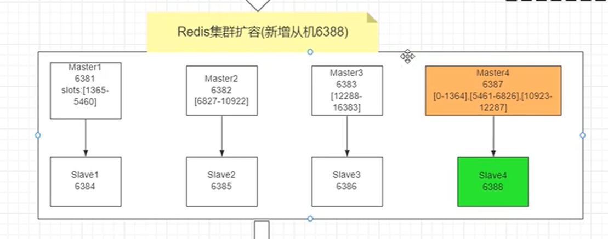
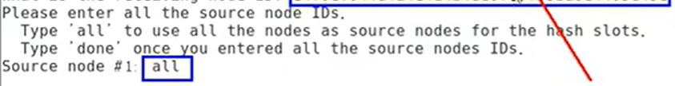

# Docker

## 一、Docker简介

### 1.1 为什么会出现Docker

当开发人员单独开发一种应用时，依据自己的开发环境（比如自己的笔记本电脑）进行配置，每种开发环境具有特定的配置，当现在进行合作开发时，其他开发人员的环境配置各有不同，现在需要合作运行，如何确应用在不同的环境中运行？并且在部署过程中不出现令人头疼的版本和配置问题，也无需编写代码进行故障修复？

答案就是使用容器，Docker之所以发展的如此迅速，也是因为它对此给出了一个标准化的解决方案 --- **系统平滑移植，容器虚拟化技术**

软件的环境配置相当复杂，换一台机器就需要重新来一次，所以衍生出了这样的问题：**软件是否可以带环境安装？**也就是说安装的时候，把原始环境一模一样复制过来，利用Docker就可以消除协作编码时在一台机器上可以正常工作，但在另一台机器上跑不起来的问题

Docker包含两方面的技术：

+ 镜像技术：打破代码即应用的概念，从系统环境开始，自底至上打包应用

  

  

Docker的出现使得Docker得以打破过去`程序即应用的观念`，透过镜像将作业系统核心除外，运作应用程式所需要的系统环境由下而上打包，达到应用程式跨平台间的无缝接轨运作

### 1.2 Docker的理念

Docker的理念有点像虚拟机，当我们需要在自己的电脑上使用Linux系统的相关功能时，会需要装一个虚拟机，VMware或者VirtualBox，然后在上面运行一个Linux的镜像文件，将整个Linux环境打包，放在虚拟机上运行，这就避免了环境冲突的问题

镜像文件保证了环境迁移的一致性


Docker也是类似的思想，只不过是将开发出来的项目的源码 + 运行环境打包成一个镜像文件，比如商城项目，里面的运行环境MySQL、Redis、MQ、ES等等


### 1.3 Docker是什么

Docker是基于Go语言实现的云开源项目

Docker的主要目标是"Build, Ship and Run Any App Anywhere"，也就是通过对应用组件的封装、分发、部署、运行等生命周期的管理，使用户的APP及其运行环境能够做到**"一次镜像，处处运行"**，将应用打成镜像，通过镜像成为运行在Docker容器上的实例，而Docker容器在任何操作系统上都是一致的，这就实现了跨平台、跨服务器，只需要一次配置好环境，换到其他地方就可以一键部署好，大大简化了操作

总结起来就是，docker是为了解决运行环境和配置问题的软件容器，方便做持续集成并有助于整体发布的容器虚拟化技术

**容器和虚拟机的区别**

+ 虚拟机就是带环境安装的一种解决方案，它可以在一种操作系统里运行另一种操作系统；对于底层来说，虚拟机就是一个普通文件，不需要了就删掉，对其他部分毫无影响；传统虚拟机技术基于安装在主操作系统上的虚拟机管理系统（Vmware，VirtualBox等）创建虚拟机，在虚拟机上安装操作系统，再从操作系统中安装部署各种应用

  

+ Linux容器是与系统其他部分隔离开的一系列进程，从另一个镜像运行，并由该镜像提供支持进程所需的全部文件；容器提供的镜像包含了应用的所有依赖项，因而在从开发到测试再到生产的整个过程中，它都具有可移植性和一致性；容器技术并不是模拟一个完整的操作系统，而是**对进程进行隔离**，只对软件工作所需的库资源和设置，系统因此而变得高效轻量并保证部署在任何环境中的软件都能始终如一地运行

  

总结来说，Docker和虚拟机的区别就是：

+ 传统虚拟机技术是虚拟出一套硬件后，在其上运行一个完整的操作系统，在该系统上再运行所需应用进程
+ 容器内的应用进程直接运行于宿主的内核，容器内没有自己的内核且也没有进行硬件虚拟（复用本机的操作系统和硬件资源），因此容器要比传统虚拟机更为轻便
+ 每个容器之间相互隔离，每个容器有自己的文件系统，容器之间进程不会相互影响，能区分计算资源

### 1.4 Docker三要素

**镜像**

Docker镜像就是一个只读的模板，镜像可以用来创建Docker容器，**一个镜像可以创建很多容器**

镜像就相当于容器的"源代码"，docker镜像文件类似于Java中的类模板，就是`public class xxx{}`

**容器**

容器就是用镜像创建的运行实例，Docker利用容器独立运行的一个或者一组应用，容器就类似于一个虚拟化的运行环境

就像是Java中的类和实例对象一样，镜像是静态的定义，容器是镜像运行时的实体

容器为镜像提供了一个标准的和隔离的运行环境，它可以被启动、开始、停止和删除

> 对比Java来说：
>
> ```java
> public class Book {
>     //...
> }
> 
> Book b1 = new Book();
> Book b2 = new Book();
> Book b3 = new Book();
> //上面的代码中，Book是类模板，就相当于Docker中的镜像
> //b1,b2,b3是实例对象，就相当于Docker中的容器
> //将上面的代码转换到Docker中就是（假设要启动几个Redis的实例）
> Redis r1 = docker.run redis.镜像文件
> Redis r1 = docker.run redis.镜像文件
> Redis r1 = docker.run redis.镜像文件
> ```

**仓库**

仓库就是集中存放镜像文件的场所，类似于：Maven仓库是存放各种jar包的地方、Github仓库是存放各种git项目的地方

Docker公司提供的官方register被称为Docker hub，存放各种镜像模板的地方

仓库分为公开仓库和私有仓库两种，最大的公开仓库是Docker hub（https://hub.docker.com/）

存放了数量庞大的镜像，国内的公开仓库包括阿里云，网易云等


Docker本身是一个容器运行载体或者说是一个管理引擎，开发人员将应用程序和配置依赖打包好形成一个可交付的运行环境，这个打包好的运行环境就是image镜像文件，只有通过这个镜像文件才能生成Docker容器实例

image镜像文件可以看作是容器的模板，Docker根据image文件生成容器的实例，同一个image文件可以生成多个同时运行的容器实例


**Docker的工作过程**

+ Docker是一个CS结构的系统，Docker的守护进程运行在主机上（本地计算机）
+ 通过Socket连接从客户端访问本机的Docker服务器，守护进程从客户端接收命令并管理运行在主机上的容器
+ 如果本地有需要运行的镜像文件，则可以直接创建容器并运行；如果没有，则需要从远程仓库下载（`docker pull`）到本地之后再启动容器


## 二、Docker的基本操作

### 2.1 Docker的安装


**docker run hello-world干了什么**


### 2.2 Docker的常用命令

#### 2.2.1 帮助启动类命令

```shell
#启动docker
systemctl start docker

#停止docker
systemctl stop docker

#重启docker
systemctl restart docker

#查看docker的状态
systemctl status docker

#开机启动docker
systemctl enable docker

#查看docker的概要信息
docker info

#查看docker的总体帮助文档
docker --help

#查看docker某个具体命令的帮助文档
docker 具体命令 --help
```

#### 2.2.2 镜像命令

（1）`docker images`：列出本地主机上的镜像

```
[root@ ~]# docker images
REPOSITORY    TAG       IMAGE ID       CREATED         SIZE
hello-world   latest    feb5d9fea6a5   12 months ago   13.3kB
```

+ `REPOSITORY`：表示镜像的仓库源
+ `TAG`：镜像的标签版本号（比如MySQL 5.6 5.7 8.0.26）
+ `IMAGE ID`：镜像的ID，相当于数据库中的主键，唯一
+ `CREATED`：镜像创建的时间
+ `SIZE`：镜像文件的大小

> 同一个仓库员可以有多个`TAG`版本，代表这个仓库源的不同版本，比如有MySQL的仓库，可以同时有5.7和8.0.26的版本
>
> 在定义的时候使用`REPOSITORY:TAG`来定义不同的镜像，默认使用最新版本的镜像（latest）

常用参数：

+ `-a`：列出本地所有的镜像（含历史映像层）
+ `-q`：只显示镜像ID

（2）`docker search`：去仓库中查找某个镜像

```
[root@ ~]# docker search redis
NAME                                        DESCRIPTION                                     STARS     OFFICIAL   AUTOMATED
redis                                       Redis is an open source key-value store that…   11397     [OK]       
bitnami/redis                               Bitnami Redis Docker Image                      229                  [OK]
bitnami/redis-sentinel                      Bitnami Docker Image for Redis Sentinel         39                   [OK]
bitnami/redis-cluster                                                                       34                   
```

+ `NAME`：镜像名称
+ `DESCRIPTION`：镜像的说明
+ `STARS`：镜像被点赞的数量
+ `OFFICIAL`：镜像是否是官方提供的
+ `AUTOMATED`：是否是自动构建的

常用参数：

+ `--limit N`：只列出N个查找到的镜像，默认是25个

（3）`docker pull`：去仓库中拉取某个镜像

```
[root@ ~]# docker pull redis:6.0.8
6.0.8: Pulling from library/redis
bb79b6b2107f: Pull complete 
1ed3521a5dcb: Pull complete 
5999b99cee8f: Pull complete 
3f806f5245c9: Pull complete 
f8a4497572b2: Pull complete 
eafe3b6b8d06: Pull complete 
Digest: sha256:21db12e5ab3cc343e9376d655e8eabbdbe5516801373e95a8a9e66010c5b8819
Status: Downloaded newer image for redis:6.0.8
docker.io/library/redis:6.0.8
```

常用的写法就是：`docker pull repository`默认拉去某个镜像的最新版，相当于`docker pull repository:latest`

如果想要特定的版本，就加上版本号，比如上例`docker pull redis:6.0.8`，拉取完成之后，使用`docker images`查看本地镜像

```
[root@ ~]# docker images
REPOSITORY    TAG       IMAGE ID       CREATED         SIZE
hello-world   latest    feb5d9fea6a5   12 months ago   13.3kB
redis         6.0.8     16ecd2772934   23 months ago   104MB
```

（4）`docker system df`：查看镜像、容器、数据卷所占的空间

```
[root@ ~]# docker system df
TYPE            TOTAL     ACTIVE    SIZE      RECLAIMABLE
Images          2         1         104.2MB   104.2MB (99%)
Containers      2         0         0B        0B
Local Volumes   0         0         0B        0B
Build Cache     0         0         0B        0B
```

（5）`docker rmi`：删除本地镜像

```
[root@ ~]# docker rmi -f feb5d9fea6a5
Untagged: hello-world:latest
Untagged: hello-world@sha256:62af9efd515a25f84961b70f973a798d2eca956b1b2b026d0a4a63a3b0b6a3f2
Deleted: sha256:feb5d9fea6a5e9606aa995e879d862b825965ba48de054caab5ef356dc6b3412
```

+ 删除单个镜像：`docker rmi 镜像ID`
+ 删除多个镜像：`docker rmi 镜像名1:TAG 镜像名2:TAG`
+ 删除全部镜像（慎用）：`docker rmi $(docker images -qa)`

常用参数：

+ `-f`：强制删除

> Docker的虚悬镜像
>
> + 虚悬镜像：仓库名、标签都是<none>的镜像，俗称虚悬镜像（`dangling image`）

#### 2.2.3 容器命令

（1）`docker run [options] image [command][arg..]` 启动容器

启动一个容器运行指定的镜像文件，比如最简单的`docker run hello-world`

`options`说明：

+ `--name="容器名称"`：为启动的容器指定一个名称，如果不写，用默认的
+ `-d`：容器在后台运行，并返回容器ID
+ `-i`：**以交互模式运行容器**，通常与`-t`配合使用
+ `-t`：**为容器重新分配一个伪输入终端**，相当于linux中的shell，`-it`也就是启动交互式容器的命令
+ `-P`：随机端口映射
+ `-p`：指定端口映射

```
#####以交互式的方式启动ubuntu容器，并在前台显示终端
[root@ ~]# docker run -it ubuntu /bin/bash    
#####出现这个表明已经启动ubuntu，在其中可以自由使用linux的命令
root@0e66022be853:/# ls
bin   dev  home  lib32  libx32  mnt  proc  run   srv  tmp  var
boot  etc  lib   lib64  media   opt  root  sbin  sys  usr
root@0e66022be853:/# ps -ef
UID          PID    PPID  C STIME TTY          TIME CMD
root           1       0  0 00:36 pts/0    00:00:00 /bin/bash
root          10       1  0 00:36 pts/0    00:00:00 ps -ef
root@0e66022be853:/# 
```

（2）`docker ps`查看docker上运行的所有正在运行的容器实例

```
[root@ ~]# docker ps
CONTAINER ID   IMAGE     COMMAND       CREATED          STATUS         PORTS     NAMES
7b34265f299a   ubuntu    "/bin/bash"   10 seconds ago   Up 9 seconds             myubuntu1
0e66022be853   ubuntu    "/bin/bash"   5 minutes ago    Up 5 minutes             peaceful_blackwell
```

+ `CONTAINER ID`：容器实例的唯一ID
+ `IMAGE`：容器实例使用的镜像
+ `COMMAND`：启动时附带的命令参数
+ `NAMES`：容器的名称，可以在启动容器时指定

常用参数：

+ `-a`：列出当前所有正在运行的容器 + 历史上运行过的容器
+ `-l`：显示最近创建的容器
+ `-n`：显示最近n个创建的容器
+ `-q`：只显示容器的编号

（3）容器退出命令

一般有两种容器退出命令：

+ `exit`：在正在运行的容器中的交互式终端中输入，会直接停止正在运行的容器

  ```
  [root@ ~]# docker run -it ubuntu /bin/bash
  root@0e66022be853:/# ls
  bin   dev  home  lib32  libx32  mnt  proc  run   srv  tmp  var
  boot  etc  lib   lib64  media   opt  root  sbin  sys  usr
  root@0e66022be853:/# ps -ef
  UID          PID    PPID  C STIME TTY          TIME CMD
  root           1       0  0 00:36 pts/0    00:00:00 /bin/bash
  root          10       1  0 00:36 pts/0    00:00:00 ps -ef
  root@0e66022be853:/# exit
  exit
  
  ####可以看到启动的ubuntu容器已经停止了
  
  [root@ ~]# docker ps
  CONTAINER ID   IMAGE     COMMAND   CREATED   STATUS    PORTS     NAMES
  ```

+ `ctrl + p + q`：在正在运行的容器中按快捷键，会退出容器，但不会终止容器的运行

  ```
  [root@ ~]# docker run -it --name=myubuntu ubuntu bash
  root@7afc9f8cd15a:/# ls
  bin   dev  home  lib32  libx32  mnt  proc  run   srv  tmp  var
  boot  etc  lib   lib64  media   opt  root  sbin  sys  usr
  root@7afc9f8cd15a:/# 
  
  ####容器并没有被终止
  
  [root@ ~]# docker ps
  CONTAINER ID   IMAGE     COMMAND   CREATED          STATUS          PORTS     NAMES
  7afc9f8cd15a   ubuntu    "bash"    15 seconds ago   Up 15 seconds             myubuntu
  ```

（4）其余操作容器的命令（重启、停止、强制停止、删除）

+ `docker restart 容器ID或者容器名称`：重启已经停止的容器
+ `docker stop 容器ID或者容器名称`：停止容器
+ `docker kill 容器ID或者容器名称`：强制停止容器
+ `docker rm 容器ID或者容器名称`：删除**已经停止**的容器，如果试图删除正在运行的容器会报错

**（5）常用的操作容器的准则**

在大部分场景下，都希望docker的服务是在后台运行的，在使用`docker run`命令的时候，可以通过`-d`参数指定容器的后台运行模式

但在使用`docker run -d ubuntu`之后查看容器进程，会发现容器会直接退出

```
[root@ ~]# docker run -d ubuntu
f3742ada8bd8a7b05f48501412112951dc0f9a2cc362948318e04dd735f4fb97
[root@ ~]# docker ps
CONTAINER ID   IMAGE     COMMAND   CREATED   STATUS    PORTS     NAMES
```

这是因为Docker容器如果想要在后台运行，就必须有一个前台进程，容器运行的命令如果不是那些一直挂起的命令，就会自动退出，所以最佳的解决方案就是将运行的程序以前台进程的形式运行，常见的就是命令行模式

所以一般后台守护式启动不适用于像Ubuntu这种常需要交互的容器，而是适用于像Redis、MySQL，MQ这种长时间运行的容器，以Redis为例

```
[root@ ~]# docker run -d redis:6.0.8
3a969aa94855fb39373756df183114dc0d86a655935ab28fa582d5ad2edb38d0
[root@ ~]# docker ps
CONTAINER ID   IMAGE         COMMAND                  CREATED          STATUS          PORTS      NAMES
3a969aa94855   redis:6.0.8   "docker-entrypoint.s…"   14 seconds ago   Up 13 seconds   6379/tcp   elegant_black
```

后台启动之后，可以通过一些命令来查看容器运行的情况

```
####使用docker logs来查看某个容器的运行情况
[root@ ~]# docker logs 3a969aa94855
1:C 14 Oct 2022 01:14:57.368 # oO0OoO0OoO0Oo Redis is starting oO0OoO0OoO0Oo
1:C 14 Oct 2022 01:14:57.368 # Redis version=6.0.8, bits=64, commit=00000000, modified=0, pid=1, just started
1:C 14 Oct 2022 01:14:57.368 # Warning: no config file specified, using the default config. In order to specify a config file use redis-server /path/to/redis.conf
1:M 14 Oct 2022 01:14:57.369 * Running mode=standalone, port=6379.

####查看容器内进程运行的详细信息
[root@iZ0jlh6etolgnm8tzsg4rxZ ~]# docker top 3a969aa94855
UID                 PID                 PPID                C                   STIME               TTY                 TIME                CMD
systemd+            26421               26400               0                   09:14               ?                   00:00:00            redis-server *:6379

####查看容器内部的一些细节，使用json的格式显示
[root@ ~]# docker inspect 3a969aa94855
[
    {
        "Id": "3a969aa94855fb39373756df183114dc0d86a655935ab28fa582d5ad2edb38d0",
        "Created": "2022-10-14T01:14:57.145669665Z",
        "Path": "docker-entrypoint.sh",
        "Args": [
            "redis-server"
        ],
......
]
```

如果一个容器是后台启动的，在一定情况下需要再次进入容器，对容器进行一点处理，所以会有一些重新进入容器的命令：

+ `docker exec -it 容器ID`：在容器中打开新的终端，并且可以启动新的进程，如果用exit命令退出，不会导致容器停止

  ```
  [root@iZ0jlh6etolgnm8tzsg4rxZ ~]# docker exec -it 3a77782fc3d3 bash
  root@3a77782fc3d3:/# exit
  exit
  
  ####可以看到ubuntu容器并没有停止运行
  
  [root@iZ0jlh6etolgnm8tzsg4rxZ ~]# docker ps
  CONTAINER ID   IMAGE         COMMAND                  CREATED              STATUS              PORTS      NAMES
  3a77782fc3d3   ubuntu        "bash"                   About a minute ago   Up About a minute              upbeat_payne
  3a969aa94855   redis:6.0.8   "docker-entrypoint.s…"   25 minutes ago       Up 25 minutes       6379/tcp   elegant_black
  ```

+ `docker attach 容器ID`：直接进入容器启动命令的终端，不会启动新的进程，如果用exit退出，会导致容器停止

  ```
  [root@iZ0jlh6etolgnm8tzsg4rxZ ~]# docker attach 3a77782fc3d3
  root@3a77782fc3d3:/# exit
  exit
  
  ####ubuntu容器已经停止运行了
  
  [root@iZ0jlh6etolgnm8tzsg4rxZ ~]# docker ps
  CONTAINER ID   IMAGE         COMMAND                  CREATED          STATUS          PORTS      NAMES
  3a969aa94855   redis:6.0.8   "docker-entrypoint.s…"   26 minutes ago   Up 26 minutes   6379/tcp   elegant_black
  ```

> 所以，一般都会使用`docker exec`，因为退出容器终端，不会导致容器停止

**（6）容器“保护”命令**

有时候在操作容器的时候，可能会遭到一定的外部因素导致容器直接停止运行，此时，正在操作的容器内的文件就有可能丢失，所以，需要采取一定的措施，保存正在使用的容器内的文件

+ `docker cp 容器ID:容器内文件路径 主机内目的文件路径`：将容器内的某个文件的内容拷贝到主机中的某个文件中

  ```
  [root@ ~]# docker cp 3a77782fc3d3:/tmp/a.txt ubuntu.txt
  [root@ ~]# ls
  ubuntu.txt
  [root@ ~]# cat ubuntu.txt
  a.txt
  ```

+ `docker export 容器ID > 文件名.tar`：将容器的内容导出为归档文件

  `cat 文件名.tar | docker import - 镜像用户/镜像名:镜像版本号`：将之前保存的容器内容导入到一个新的镜像中

  ```
  [root@ ~]# docker export 3a77782fc3d3 > ub.tar
  [root@ ~]# ls
  ub.tar
  
  [root@ ~]# cat ub.tar | docker import - test/ubuntu:3.7
  sha256:70bfedd1d1605f35ddd2203f51b5121561feaf31c87a04825bd147d51d56fb43
  [root@ ~]# docker images
  REPOSITORY    TAG       IMAGE ID       CREATED         SIZE
  test/ubuntu   3.7       70bfedd1d160   4 seconds ago   72.8MB
  ubuntu        latest    ba6acccedd29   12 months ago   72.8MB
  redis         6.0.8     16ecd2772934   23 months ago   104MB
  [root@ ~]# docker run -it test/ubuntu:3.7 bash
  root@54a591a78696:/# cd /tmp
  root@54a591a78696:/tmp# ls
  a.txt
  root@54a591a78696:/tmp# cat a.txt
  a.txt
  ```


### 2.3 Docker镜像

docker中的**镜像**是一种**轻量级、可执行的独立软件包**，它包含运行某个软件所需的所有内容，将应用程序和配置依赖打包好形成一个可交付的运行环境（包括代码，运行时需要的程序库，环境变量和配置文件等），这个打包好的运行环境就是image镜像文件，只有通过这个镜像文件才能生成docker容器实例

#### 2.3.1 联合文件系统

联合文件系统（`UnionFS`）：联合文件系统是一种分层、轻量级并且高性能的文件系统，它支持将对文件系统的修改作为一次提交来一层层地叠加，同时可以将不同目录挂载到同一个虚拟文件系统下，以拉取tomcat镜像为例

可以看到，在拉取tomcat镜像的时候，拉取了其他镜像，比如0e29546d541c，cb5b7ae36172等等，说明，tomcat结合了其他文件镜像，来实现一整个tomcat系统的功能

```
[root@ ~]# docker pull tomcat
Using default tag: latest
latest: Pulling from library/tomcat
0e29546d541c: Pull complete 
9b829c73b52b: Pull complete 
cb5b7ae36172: Pull complete 
6494e4811622: Pull complete 
668f6fcc5fa5: Pull complete 
dc120c3e0290: Pull complete 
8f7c0eebb7b1: Pull complete 
77b694f83996: Pull complete 
0f611256ec3a: Pull complete 
4f25def12f23: Pull complete 
```

Union文件系统是docker镜像的基础，*镜像可以通过分层来进行继承，基于基础镜像可以制作各种具体的应用镜像*

联合文件系统的特性就是一次同时会加载多个文件系统，但从结果来看，只能看到一个文件系统，联合加载会把各层文件系统叠加起来，这样最终的文件系统会包含所有底层的文件和目录


#### 2.3.2 Docker镜像加载原理

docker的镜像实际上由一层一层的文件系统组成

docker镜像的最底层是引导文件系统bootfs（主要包含bootloader和kernel，bootloader主要是引导加载kernel），这一层与典型的linux系统是一样的，包含boot加载器和内核，当boot加载完成之后整个内核就都在内存中了，此时内存的使用权已由bootfs转交给内核

rootfs在bootfs之上，包含的就是典型linux系统中的/dev，/proc等标准目录和文件，rootfs就是不同操作系统发行版，比如ubuntu，centos等


对于一个精简的OS，rootfs可以很小，只需要包括最基本的命令、工具和程序库就可以了，因为底层直接用host和kernel，自己只需要提供rootfs就行了，对于不同的linux发行版本，bootfs基本是一致的，rootfs会有差别，因此不同的发行版可以公用bootfs


> **为什么Docker要使用镜像分层**
>
> 镜像分层最大的一个好处就是共享资源，方便复制迁移，就是为了复用
>
> 比如有多个镜像都需要使用一个相同的功能，那么docker host只需要在磁盘上保存一份base镜像，同时内存中也只需要加载一份base镜像，就可以为所有容器服务了，而且镜像的每一层都可以被共享
>
> 有点类似于Java中的继承，父类提供后续子类共有的功能，子类只需要继承父类，之后再做一些属于自己的扩展即可

#### 2.3.3 Docker commit操作

`docker commit`提交容器副本使之称为一个新的镜像

示例：在最基本的ubuntu镜像中，添加vim命令，并提交成一个新镜像

```
####首先需要运行最基本的一个ubuntu镜像
[root@ ~]# docker run -it ubuntu /bin/bash
root@c13e21caa045:/# ls
bin  boot  dev  etc  home  lib  lib32  lib64  libx32  media  mnt  opt  proc  root  run  sbin  srv  sys  tmp  usr  var
root@c13e21caa045:/# touch a.txt
####最基本的ubuntu镜像并不支持vim命令
root@c13e21caa045:/# vim a.txt
bash: vim: command not found

####在当前容器中，为ubuntu添加vim命令
root@c13e21caa045:/# apt-get update
Get:1 http://archive.ubuntu.com/ubuntu focal InRelease [265 kB]          
Get:2 http://security.ubuntu.com/ubuntu focal-security InRelease [114 kB]            
Get:3 http://archive.ubuntu.com/ubuntu focal-updates InRelease [114 kB]
Get:4 http://archive.ubuntu.com/ubuntu focal-backports InRelease [108 kB]
......

root@c13e21caa045:/# apt-get -y install vim
Reading package lists... Done
Building dependency tree       
Reading state information... Done
......

####经过上述操作之后，当前容器已经支持vim命令了，然后，通过docker commit命令将这个镜像提交
[root@ ~]# docker commit -m="vim add successfully" -a="progZhou" c13e21caa045 test/ubuntu:1.1
sha256:306750a9136ee3f99d560a3216d4ad73fc8661d96badccd13402165c81a5654c
####查看刚刚提交的镜像
[root@ ~]# docker images
REPOSITORY    TAG       IMAGE ID       CREATED         SIZE
test/ubuntu   1.1       306750a9136e   3 minutes ago   180MB
tomcat        latest    fb5657adc892   9 months ago    680MB
ubuntu        latest    ba6acccedd29   12 months ago   72.8MB
redis         6.0.8     16ecd2772934   23 months ago   104MB
```

docker commit的完整命令：

+ `docker commit -m="描述信息" -a="作者ID" 容器ID 镜像名称:版本号`

Docker中的镜像分层，支持通过扩展现有镜像，创建新的镜像，类似Java继承于一个base基础类，自己在按需扩展

新镜像是从base镜像一层一层叠加生成的，每安装一个软件，就在现有镜像的基础上增加一层


#### 2.3.4 本地镜像推送到阿里云

使用`docker commit`命令提交的镜像文件只存储在本机中，如果想要共享出去，就可以使用阿里云的镜像仓库

打开阿里云网页 -> 控制台 -> 容器镜像服务 -> 创建个人 / 企业实例


个人实例创建完成之后，首先创建命名空间，再创建镜像仓库


然后根据操作指南输入相应的命令，主要是**3. 将镜像推送到Registry**，前两步是从阿里云镜像仓库中拉取


案例：将之前带有vim功能的ubuntu镜像推送到阿里云仓库

```
####首先登录到阿里云账户
[root@ ~]# docker login --username=**** registry.cn-wulanchabu.aliyuncs.com
Password: 
WARNING! Your password will be stored unencrypted in /root/.docker/config.json.
Configure a credential helper to remove this warning. See
https://docs.docker.com/engine/reference/commandline/login/#credentials-store

Login Succeeded
####将想要推送的镜像推送出去
[root@ ~]# docker tag 306750a9136e registry.cn-wulanchabu.aliyuncs.com/test-respository/ubuntu-vim:1.1
[root@ ~]# docker push registry.cn-wulanchabu.aliyuncs.com/test-respository/ubuntu-vim:1.1
The push refers to repository [registry.cn-wulanchabu.aliyuncs.com/test-respository/ubuntu-vim]
7bb12b8eda27: Pushed 
9f54eef41275: Pushed 
1.1: digest: sha256:bb57314b8b035b8daa2a9a598217325f4fb757665744b0c6aeb7fd8563c34a0c size: 741
```

### 2.4 Docker容器数据卷

docker容器数据卷简单来说就是一种持久化的方式，就像平常用的笔记本电脑，如果有一些比较重要的数据，一般就会将这些数据保存到一个外置硬盘或者保存到云盘里去

类似的，docker容器在运行的过程中也会产生一些重要的数据，所以，docker采用容器数据卷的方式完成数据的持久化


**Docker容器数据卷是什么**

卷就是目录或者文件，存在于一个或多个容器中，由docker挂载到容器，但不属于联合文件系统，因此能够绕过联合文件系统，提供一些用于持续存储或共享数据的特性

卷的设计目的就是数据持久化，完全独立于容器的生存周期，因此docker不会在容器删除时删除其挂载的数据卷

> 这个容器数据卷有点类似于redis中的rdb和aof文件，就是将docker容器内的数据保存到本机的磁盘上，在容器启动的时候再从磁盘中把这些数据读到容器内运行

**Docker容器卷命令**

`docker run -it --privileged=true -v /本机绝对路径目录:/容器内目录 镜像名`

```
[root@ docker]# docker run -it --privileged=true -v /usr/local/docker/host_data:/tmp/docker_data --name=u1 306750a9136e
root@3100803e2ef4:/# cd tmp
root@3100803e2ef4:/tmp# ls
docker_data
root@3100803e2ef4:/tmp# cd docker_data
root@3100803e2ef4:/tmp/docker_data# ls
####在容器内创建docker_data.txt文件，查看主机下是否同步创建了这个文件
root@3100803e2ef4:/tmp/docker_data# touch docker_data.txt
root@3100803e2ef4:/tmp/docker_data# ls
docker_data.txt

[root@ ~]# cd /usr/local/docker
[root@ docker]# ls
host_data
[root@ docker]# cd host_data/
####主机内确实同步创建了docker_data.txt
[root@ host_data]# ls
docker_data.txt
[root@ host_data]# touch host_data.txt

```

> docker容器挂载到主机之后，数据的同步是双向的，也就是说在容器内的操作会同步到本机被挂载的目录中；同样的，在主机中目录的操作也会同步到容器内，即使容器宕机了，之后容器重启的时候，主机内的操作仍然会同步到容器内
>
> **为什么要加 --privileged=true参数**
>
> 在centos版本加强了安全控制之后，docker的容器目录挂载的操作会被判定为不安全操作，所以如果直接使用挂载命令，会出现`cannot open directory .: Permission denied`报错信息，解决办法就是在之后加一个`--privileged=true`参数

**Docker容器数据卷的特点**

+ 数据卷可在容器之间共享或重用数据
+ 卷中的更改可以直接实时生效
+ 数据卷中的更改不会包含在镜像的更新中
+ 数据卷的生命周期一直持续到没有容器使用它为止

> 容器数据卷可以限定读写权限，默认就是可读可写，当然也可以设置为只读的，也就是容器只能读取主机目录下的内容，而不能同步去写


### 2.5 Docker上安装软件

总体上在docker上安装软件的步骤：

+ 搜索镜像
+ 拉取镜像
+ 查看镜像
+ 启动镜像
+ 停止容器
+ 移除容器

#### 2.5.1 安装tomcat

根据上面的步骤，首先去镜像仓库中搜索镜像

```
#### 选择一个适合自己的拉取即可
[root@ ~]# docker search tomcat
NAME                                  DESCRIPTION                                     STARS     OFFICIAL   AUTOMATED
tomcat                                Apache Tomcat is an open source implementati…   3399      [OK]       
tomee                                 Apache TomEE is an all-Apache Java EE certif…   98        [OK]       
bitnami/tomcat                        Bitnami Tomcat Docker Image                     47                   [OK]

#### 使用命令拉取镜像
[root@ ~]# docker pull tomcat

#### 查看拉取的镜像
[root@ ~]# docker images
REPOSITORY                                                        TAG       IMAGE ID       CREATED         SIZE
tomcat                                                            latest    fb5657adc892   9 months ago    680MB

#### 启动容器运行tomcat镜像，并指定端口映射  -p 8080:8080来指定本机到容器的端口映射
[root@ ~]# docker run -d -p 8080:8080 --name t1 tomcat
22f7978d2e10311b44df16540034922293b42f7465053552a5c31ede7118e2ac
[root@ ~]# docker ps
CONTAINER ID   IMAGE     COMMAND             CREATED         STATUS         PORTS                                       NAMES
22f7978d2e10   tomcat    "catalina.sh run"   3 seconds ago   Up 2 seconds   0.0.0.0:8080->8080/tcp, :::8080->8080/tcp   t1

#### 通过浏览器访问tomcat首页，如果访问成功，则说明启动成功
#### 如果需要正常启动还需要进行一些修改操作，这是最新版tomcat需要做的修改
[root@iZ0jlh6etolgnm8tzsg4rxZ ~]# docker exec -it 22f7978d2e10 /bin/bash
root@22f7978d2e10:/usr/local/tomcat# rm -r webapps
root@22f7978d2e10:/usr/local/tomcat# mv webapps.dist webapps

```

#### 2.5.2 安装mysql

仍然是几个步骤

```
#### 先搜索mysql的镜像
[root@ ~]# docker search mysql
NAME                            DESCRIPTION                                     STARS     OFFICIAL   AUTOMATED
mysql                           MySQL is a widely used, open-source relation…   13234     [OK]       
mariadb                         MariaDB Server is a high performing open sou…   5062      [OK]       
phpmyadmin                      phpMyAdmin - A web interface for MySQL and M…   640       [OK]       
percona                         Percona Server is a fork of the MySQL relati…   588       [OK]     

#### 拉取mysql镜像，查看是否拉取成功
[root@ ~]# docker pull mysql:8.0.26
8.0.26: Pulling from library/mysql
b380bbd43752: Pull complete 
f23cbf2ecc5d: Pull complete 
30cfc6c29c0a: Pull complete 
......
[root@ ~]# docker images
REPOSITORY   TAG       IMAGE ID       CREATED         SIZE
tomcat       latest    fb5657adc892   9 months ago    680MB
ubuntu       latest    ba6acccedd29   12 months ago   72.8MB
mysql        8.0.26    9da615fced53   12 months ago   514MB

#### 运行mysql镜像，如果本机上已经有mysql启动着，就需要先关闭本机上的mysql，否则会有端口冲突，或者端口映射的时候换一个端口
[root@ ~]# docker run -p 3306:3306 --name some-mysql -e MYSQL_ROOT_PASSWORD=docker123456 -d mysql:8.0.26
7c9b91943d417ffa0545b7934189ec1abe7a20169329247c4c58842be9e589fd
[root@ ~]# docker ps
CONTAINER ID   IMAGE          COMMAND                  CREATED         STATUS         PORTS                                                  NAMES
7c9b91943d41   mysql:8.0.26   "docker-entrypoint.s…"   2 seconds ago   Up 2 seconds   0.0.0.0:3306->3306/tcp, :::3306->3306/tcp, 33060/tcp   some-mysql

#### 启动成功之后可以尝试进入mysql中进行一些简单地操作
[root@ ~]# docker exec -it 7c9b91943d41 /bin/bash
root@7c9b91943d41:/# mysql -uroot -p
Enter password: 
Welcome to the MySQL monitor.  Commands end with ; or \g.
Your MySQL connection id is 8
Server version: 8.0.26 MySQL Community Server - GPL

Copyright (c) 2000, 2021, Oracle and/or its affiliates.

Oracle is a registered trademark of Oracle Corporation and/or its
affiliates. Other names may be trademarks of their respective
owners.

Type 'help;' or '\h' for help. Type '\c' to clear the current input statement.

mysql> 
```

在虚拟机上完成操作之后，可以使用win10中的sqlyog进行连接


使用docker中的mysql需要有很多的注意事项：

+ 在外部使用mysql工具进行连接的时候，如果向表中插入中文，会有中文乱码报错

+ 需要对mysql的数据进行数据备份（容器数据卷）

  在第一次运行mysql容器的时候，使用的是`docker run -p 3306:3306 --name some-mysql -e MYSQL_ROOT_PASSWORD=docker123456 -d mysql:8.0.26`，并没有指定容器数据卷，所以向这条命令中添加一些参数

  ```
  docker run -d -p 3306:3306 --privileged=true 
  -v /usr/local/docker/mysql/log:/var/log/mysql   
  -v /usr/local/docker/mysql/data:/var/lib/mysql  
  -v /usr/local/docker/mysql/conf:/etc/mysql/conf.d   
  --name some-mysql -e MYSQL_ROOT_PASSWORD=docker123456 mysql:8.0.26
  ```

  同时在主机对应的目录中，编写配置文件，确保在mysql容器启动的时候能够使用utf8字符集

  ```
  [client]
  default_character_set=utf8
  [mysqld]
  collation_server=utf8_general_ci
  character_set_server=utf8
  ```

> 这种方式既能够解决mysql中文字符乱码的问题，也能够解决容器删除数据无法恢复的问题，所以在安装这类数据存储类的软件时，**务必要加上docker的容器数据卷来进行数据的备份**

#### 2.5.3 安装redis

步骤跟之前的一样，在启动容器的时候也需要容器数据卷的映射

```
#### 首先，使用redis的话一定会修改它的配置文件，所以在本机的目录中需要粘贴一份干净的redis.conf，并作一定的修改
[root@ redis]# cp redis.conf.copy /usr/local/docker/redis/redis.conf
[root@ redis]# cd /usr/local/docker/redis
[root@ redis]# ll
total 92
-rw-r--r-- 1 root root 93849 Oct 17 14:12 redis.conf

#### 把/usr/local/docker/redis作为本机的数据卷与docker中的数据卷做映射
docker run -p 6379:6379 --name some-redis --privileged=true 
-v /usr/local/docker/redis/redis.conf:/etc/redis/redis.conf
-v /usr/local/docker/redis/data:/data
-d redis:6.2.4 redis-server /etc/redis/redis.conf  #读取配置文件，相当于本机下的redis-server xxx/redis.conf

#### 最后可以修改本机中redis的配置文件来验证本机是否与docker中容器形成了映射
```

## 三、Docker高级篇

### 3.1 Docker中软件的复杂安装

#### 3.1.1 MySQL主从搭建

在基础操作中，docker上安装的软件都是个体的，现如今大流量的前提下，集群配置是必不可少的，以mysql主从复制为例

基本的步骤：

+ 先启动一个mysql容器作为主机，以3307为外部端口，启动命令：

  ```
  docker run -p 3307:3306 --name mysql-master --privileged=true \
  -v /usr/local/docker/mysql/mysql-master/log:/var/log/mysql \    
  -v /usr/local/docker/mysql/mysql-master/data:/var/lib/mysql \
  -v /usr/local/docker/mysql/mysql-master/conf:/etc/mysql \
  -v /usr/local/docker/mysql/mysql-master/mysql-files:/var/lib/mysql-files \  #这个挂载如果是mysql8.0版本一定要加上
  -e MYSQL_ROOT_PASSWORD=123456 -d mysql:8.0.26
  ```
  
+ 在主机的映射目录conf下编写my.cnf配置文件

  ```
  [mysqld]
  ## 设置server_id  同一局域网中唯一
  server_id=101
  ## 指定不需要同步的数据库名称
  binlog-ignore-db=mysql
  ## 开启二进制日志功能
  log-bin=mall-mysql-bin
  ## 设置二进制日志使用内存大小
  binlog_cache_size=1M
  ## 设置使用的二进制日志格式
  binlog_format=mixed
  ## 二进制日志过期清理时间，默认为0
  expire_logs_days=7
  ## 跳过主从复制中遇到的所有错误或指定类型的错误，避免slave端复制中断
  slave_skip_errors=1062
  ```

+ 重启mysql-master容器，使配置文件生效，之后进入mysql-master主机，创建相应的用户，并查看主机的状态

  ```mysql
  mysql> CREATE USER 'slave1'@'%' IDENTIFIED BY 'Root@123456';
  mysql> GRANT REPLICATION SLAVE ON *.* TO 'slave1'@'%';  #授予slave用户主从复制的权限
  mysql> ALTER USER 'slave1'@'%' IDENTIFIED WITH mysql_native_password BY 'Root@123456';  #在mysql8.0版本下必须执行这个语句
  mysql> flush privileges;
  
  mysql> show master status;
  +-----------------------+----------+--------------+------------------+-------------------+
  | File                  | Position | Binlog_Do_DB | Binlog_Ignore_DB | Executed_Gtid_Set |
  +-----------------------+----------+--------------+------------------+-------------------+
  | mall-mysql-bin.000004 |     1142 |              | mysql            |                   |
  +-----------------------+----------+--------------+------------------+-------------------+
  ```

+ 使用同样的方式创建从机

  ```
  #配置文件：
  [mysqld]
  ## 设置server_id 同一局域网需要唯一
  server_id=102
  ## 指定不需要同步的数据库名称
  binlog-ignore-db=mysql
  ## 开启二进制日志功能，以slave作为其他数据库实例的master时使用
  log-bin=mall-mysql-slave.bin
  ## 设置二进制日志使用内存大小
  binlog_cache_size=1M
  ## 设置使用的二进制日志格式
  binlog_format=mixed
  ## 二进制日志过期清理时间
  expire_logs_days=7
  slave_skip_errors=1062
  ## relay_log中配置中继日志
  relay_log=mall-mysql-relay-bin
  ## log_slave_updates表示slave将复制事件写进自己的二进制日志
  log_slave_updates=1
  ## slave设置为只读
  read_only=1
  
  ##启动命令
  docker run -p 3308:3306 --name mysql-slave --privileged=true \
  -v /usr/local/docker/mysql/mysql-slave/log:/var/log/mysql \    
  -v /usr/local/docker/mysql/mysql-slave/data:/var/lib/mysql \
  -v /usr/local/docker/mysql/mysql-slave/conf:/etc/mysql \
  -v /usr/local/docker/mysql/mysql-slave/mysql-files:/var/lib/mysql-files \  #这个挂载如果是mysql8.0版本一定要加上
  -e MYSQL_ROOT_PASSWORD=123456 -d mysql:8.0.26
  ```

+ 在从机中配置主从复制，登录到从机中，输入命令：

  ```mysql
  mysql> change master to master_host='172.17.0.2', master_user='slave', master_password='123456', master_log_file='mall-mysql-bin.000004', master_log_pos=1142;
  
  mysql> start slave;   ##开启主从同步
  mysql> show slave status\G;
  ##如果以下两项配置均为yes，即表示主从同步成功
  Slave_IO_Running: Yes
  Slave_SQL_Running: Yes
  /*
  说明：在docker中主机的ip可由命令docker inspect 查看
  docker inspect --format='{{.NetworkSettings.IPAddress}}' mysql-master
  172.17.0.2
  master_log_file与master_log_pos需要与主机中查出来的结果一致
  */
  ```

通过在主机中建库，建表插入数据来测试主从同步是否成功

#### 3.1.2 Redis主从搭建

3主3从redis集群扩缩容配置案例：


首先启动一台redis主机，命令：

```
[root@ docker]# docker run -d --name redis-node-1 --net host --privileged=true \
-v /usr/local/docker/redis-cluster/redis-node-1:/data redis:6.2.4 \
--cluster-enabled yes --appendonly yes --port 6381
## 之后以相同的形式按照结构图启动另外五台redis容器
docker run -d --name redis-node-2 --net host --privileged=true \
-v /usr/local/docker/redis-cluster/redis-node-2:/data redis:6.2.4 \
--cluster-enabled yes --appendonly yes --port 6382

docker run -d --name redis-node-3 --net host --privileged=true \
-v /usr/local/docker/redis-cluster/redis-node-3:/data redis:6.2.4 \
--cluster-enabled yes --appendonly yes --port 6383

docker run -d --name redis-node-4 --net host --privileged=true \
-v /usr/local/docker/redis-cluster/redis-node-4:/data redis:6.2.4 \
--cluster-enabled yes --appendonly yes --port 6384

docker run -d --name redis-node-5 --net host --privileged=true \
-v /usr/local/docker/redis-cluster/redis-node-5:/data redis:6.2.4 \
--cluster-enabled yes --appendonly yes --port 6385

docker run -d --name redis-node-6 --net host --privileged=true \
-v /usr/local/docker/redis-cluster/redis-node-6:/data redis:6.2.4 \
--cluster-enabled yes --appendonly yes --port 6386
```

启动完成之后，利用`docker ps`命令查看启动情况：此时，这六台redis是完全平等的，没有主从之分

```
[root@ docker]# docker ps
CONTAINER ID   IMAGE         COMMAND                  CREATED          STATUS          PORTS     NAMES
dd68fa1b03fe   redis:6.2.4   "docker-entrypoint.s…"   3 seconds ago    Up 2 seconds              redis-node-6
a91e27066b9e   redis:6.2.4   "docker-entrypoint.s…"   11 seconds ago   Up 10 seconds             redis-node-5
38438c580ed2   redis:6.2.4   "docker-entrypoint.s…"   20 seconds ago   Up 19 seconds             redis-node-4
7bc5b97bcf2b   redis:6.2.4   "docker-entrypoint.s…"   30 seconds ago   Up 29 seconds             redis-node-3
e1c7076c4ef0   redis:6.2.4   "docker-entrypoint.s…"   39 seconds ago   Up 39 seconds             redis-node-2
c3a83c3130ab   redis:6.2.4   "docker-entrypoint.s…"   2 minutes ago    Up 2 minutes              redis-node-1
```

进入其中一台redis容器（任意一台），并执行以下命令：

```
redis-cli --cluster create 172.31.89.115:6381 172.31.89.115:6382 172.31.89.115:6383 172.31.89.115:6384 172.31.89.115:6385 172.31.89.115:6386 --cluster-replicas 1  ##这条命令的意思是为每一个master创建一个slave节点
#####执行结果：
>>> Performing hash slots allocation on 6 nodes...   ##为每一台redis主机分配hash槽
Master[0] -> Slots 0 - 5460
Master[1] -> Slots 5461 - 10922
Master[2] -> Slots 10923 - 16383
Adding replica 172.31.89.115:6385 to 172.31.89.115:6381
Adding replica 172.31.89.115:6386 to 172.31.89.115:6382
Adding replica 172.31.89.115:6384 to 172.31.89.115:6383
>>> Trying to optimize slaves allocation for anti-affinity
[WARNING] Some slaves are in the same host as their master
M: 3a9e0846e1412c9fe8d236bf7fd74685f1036f4c 172.31.89.115:6381
   slots:[0-5460] (5461 slots) master
M: 93bcb14aff0e102ef8af398e61a418e725d5265b 172.31.89.115:6382
   slots:[5461-10922] (5462 slots) master
M: d85d82d7b206c9e8ef8d9b45486dfd5bb5ef1bc8 172.31.89.115:6383
   slots:[10923-16383] (5461 slots) master
S: 34f75d78581c8a4040a04cac648a8b66b4f87d09 172.31.89.115:6384
   replicates d85d82d7b206c9e8ef8d9b45486dfd5bb5ef1bc8
S: 731ff8ff84c134783cae59d0102b29a9da666d9c 172.31.89.115:6385
   replicates 3a9e0846e1412c9fe8d236bf7fd74685f1036f4c
S: 4e3f9269723b022fed7a906785461283baede22f 172.31.89.115:6386
   replicates 93bcb14aff0e102ef8af398e61a418e725d5265b
Can I set the above configuration? (type 'yes' to accept): yes   ##输入yes
>>> Nodes configuration updated
>>> Assign a different config epoch to each node
>>> Sending CLUSTER MEET messages to join the cluster
Waiting for the cluster to join
.
>>> Performing Cluster Check (using node 172.31.89.115:6381)
M: 3a9e0846e1412c9fe8d236bf7fd74685f1036f4c 172.31.89.115:6381
   slots:[0-5460] (5461 slots) master
   1 additional replica(s)
M: 93bcb14aff0e102ef8af398e61a418e725d5265b 172.31.89.115:6382
   slots:[5461-10922] (5462 slots) master
   1 additional replica(s)
S: 4e3f9269723b022fed7a906785461283baede22f 172.31.89.115:6386
   slots: (0 slots) slave
   replicates 93bcb14aff0e102ef8af398e61a418e725d5265b
S: 34f75d78581c8a4040a04cac648a8b66b4f87d09 172.31.89.115:6384
   slots: (0 slots) slave
   replicates d85d82d7b206c9e8ef8d9b45486dfd5bb5ef1bc8
M: d85d82d7b206c9e8ef8d9b45486dfd5bb5ef1bc8 172.31.89.115:6383
   slots:[10923-16383] (5461 slots) master
   1 additional replica(s)
S: 731ff8ff84c134783cae59d0102b29a9da666d9c 172.31.89.115:6385
   slots: (0 slots) slave
   replicates 3a9e0846e1412c9fe8d236bf7fd74685f1036f4c
[OK] All nodes agree about slots configuration.
>>> Check for open slots...
>>> Check slots coverage... 
[OK] All 16384 slots covered.    ##出现这句话表明分配完成

```

至此，基本的redis三主三从集群搭建完毕，可以进入redis-node-1节点，使用`cluster info`命令查看集群状态，也可以使用`cluster node`查询集群主从机：

```
root@ :/data# redis-cli -p 6381
127.0.0.1:6381> cluster info
cluster_state:ok
cluster_slots_assigned:16384
cluster_slots_ok:16384
cluster_slots_pfail:0
cluster_slots_fail:0
cluster_known_nodes:6
cluster_size:3
cluster_current_epoch:6
cluster_my_epoch:1
cluster_stats_messages_ping_sent:169
cluster_stats_messages_pong_sent:161
cluster_stats_messages_sent:330
cluster_stats_messages_ping_received:156
cluster_stats_messages_pong_received:169
cluster_stats_messages_meet_received:5
cluster_stats_messages_received:330
127.0.0.1:6381> cluster nodes    ##下面显示了每一台容器的基本角色，master or slave 通过容器的id可以对主从机进行一一配对
93bcb14aff0e102ef8af398e61a418e725d5265b 172.31.89.115:6382@16382 master - 0 1679622207000 2 connected 5461-10922
4e3f9269723b022fed7a906785461283baede22f 172.31.89.115:6386@16386 slave 93bcb14aff0e102ef8af398e61a418e725d5265b 0 1679622208425 2 connected
34f75d78581c8a4040a04cac648a8b66b4f87d09 172.31.89.115:6384@16384 slave d85d82d7b206c9e8ef8d9b45486dfd5bb5ef1bc8 0 1679622208000 3 connected
d85d82d7b206c9e8ef8d9b45486dfd5bb5ef1bc8 172.31.89.115:6383@16383 master - 0 1679622209427 3 connected 10923-16383
3a9e0846e1412c9fe8d236bf7fd74685f1036f4c 172.31.89.115:6381@16381 myself,master - 0 1679622206000 1 connected 0-5460
731ff8ff84c134783cae59d0102b29a9da666d9c 172.31.89.115:6385@16385 slave 3a9e0846e1412c9fe8d236bf7fd74685f1036f4c 0 1679622207422 1 connected

Master     Slave
 6381       6385
 6382       6386
 6383       6384 

```

> redis集群读写error：在当前的集群环境下，如果使用`redis-cli -p 6381`进入某一个节点进行set值操作有可能会操作失败
>
> ```
> 127.0.0.1:6381> set k1 v1
> (error) MOVED 12706 172.31.89.115:6383
> ```
>
> 这是由于在集群环境下，redis使用hash槽算法进行值的分配，通过错误提示，发现k1的hash值为12706超过了6381所在机器的hash槽的值，所以会出现错误
>
> 解决方案，在进入容器时添加-c参数，使用集群环境进入
>
> ```
> root@:/data# redis-cli -p 6381 -c
> 127.0.0.1:6381> set k1 v1
> -> Redirected to slot [12706] located at 172.31.89.115:6383
> OK
> ```

在使用redis集群的过程中可以通过`redis-cli --cluster check ip:port`查看集群的信息

```
root@:/data# redis-cli --cluster check 172.31.89.115:6381   ##显示每台集群中每台redis主机存储的key情况
172.31.89.115:6381 (3a9e0846...) -> 2 keys | 5461 slots | 1 slaves.
172.31.89.115:6382 (93bcb14a...) -> 1 keys | 5462 slots | 1 slaves.
172.31.89.115:6383 (d85d82d7...) -> 1 keys | 5461 slots | 1 slaves.
[OK] 4 keys in 3 masters.
0.00 keys per slot on average.
```


### 3.2 分布式存储

**问题提出：1 ~ 2亿条数据需要缓存，如何设计存储案例**

这种大数据的存储，单机肯定是不可能的，所以需要使用集群式的分布式存储；以redis为例，现在的问题就是，如何将这些数据存储在多台redis中

这就涉及数据分配的问题：一条数据是放在集群中的1号机还是2号机，如果放在2号机，之后怎么定位这条数据？

#### 3.2.1 哈希取余分区

最简单的方法就是参考hashmap的做法，假设现在是3台redis构成的集群：


2亿条数据就是2亿个<k, v>键值对，如果是在一开始便确定好集群数量的情况下，就可以通过`hash(key) % 3`来确定某条数据是存放在哪号机器上的，之后取数据时，也可以通过hash的方法确定数据在哪台机器上

+ 直接hash分区的方法的优点就是简单，直接有效，只需要提前确定好结点的数目，就能保证一段时间的数据支撑，整体起到负载均衡的作用
+ 但缺点也很明显，容灾和扩展能力不强，如果集群中有一台机器宕机，或者需要增加一台机器以应对更多的数据，由于集群中机器数目发生了变化，所有数据的映射关系就需要重新计算

#### 3.2.2 一致性哈希算法

一致性hash算法的设计目标就是为了解决分布式缓存数据变动和映射问题，当服务器个数发生变动时，尽量减少影响客户端到服务器的映射关系

简单来讲，一致性hash有三大步骤：

+ 算法构建一致性哈希环

  一致性哈希环：hash函数会计算目标的hash值，这个hash值必然有一个上限，可以根据一定的规则，将hash函数的值域固定在`[0, 2^32 - 1]`上，一致性hash算法仍然是用取模的方式，只是取模的基数变为2^32，将整个hash函数的值域在逻辑上形成一个圆环，起点是0，按照顺时针方向递增，直到2^32-1，最后一个数字的右边即是0，把由这2^32个数构成的圆环叫做一致性哈希环

  

+ 服务器ip结点映射：将集群中每台机器根据一定的规则映射到哈希环中的某一个位置

  将各个服务器使用hash算法进行一个哈希计算，可以以服务器的ip或者主机名作为key，对2^32取模，这样就能确定某台服务器在环上的位置，比如有4台服务器，以服务器的ip为key做hash运算：

  

+ key落到服务器的落键规则

  当需要存储或者访问某个数据时，首先需要计算出key的hash值，确定key在哈希环上的位置`hash(key) % 2^32`，从当前位置**沿着环顺时针行走，遇到的第一台服务器就是数据存储的服务器**，比如说有四份数据需要存储：A，B，C，D

  

一致性哈市算法相对于直接使用hash分区多了些**容错性**和**扩展性**：

+ 如果有一台服务器宕机了，比如上例中的C服务器，那么影响的数据也仅仅是hash计算后落在BC之间的数据，因为如果后续数据仍然落在BC之间，数据会存储到D服务器，之后C恢复，可能就查不到这些数据，影响的数据量比较小，而不再是全局数据
+ 如果现在需要重新添加一台服务器，假设是E，结点落在CD之间，那么只需要将CE之间的数据重新录到E服务器中即可

当然，一致性hash算法也有它的缺点，就是数据倾斜问题，如果两台服务器挨得过近：这样会导致大部分数据会落在A结点上，只有AB之间的数据会在B中


#### 3.2.3 哈希槽算法

哈希槽实质上就是一个数组，由2^14个元素组成

为了解决数据均匀分配的问题，需要在数据和redis结点之间再加入一层，一般把这层成为哈希槽，用于管理数据和结点之间的关系，现在就相当于结点上放的是槽，槽里放的是数据：


槽的出现解决的是粒度问题，相当于把粒度变大了，这样便于数据移动，总体流程就变成了，使用哈希计算数据所在的槽，再看这个槽存储在哪台redis机器上

那么redis有多少个槽呢？一个集群固定有16384个槽（2^14）编号0 - 2^14-1，这些槽会分配给集群中的所有主节点，分配策略没有要求，可以指定哪些编号的槽分配给哪个主节点，集群会记录结点和槽的对应关系

接下来就需要对数据进行哈希计算，然后对16384取余，余数假设是a，那么数据就落在编号为a的槽中，一般使用的是CRC校验码的方式：`slot = crc16(key) % 16384`之后如果要进行数据移动，则以槽为单位移动由于哈希槽的数目是固定的，处理起来比较容易，数据移动的问题就有了妥善的解决

> 具体一点：redis集群中内置了16384个槽，redis会根据结点数量大致均等的将哈希槽映射到集群中的不同结点，之后要做的就是对数据进行crc16计算，并计算出数据所在槽的编号，比如现在要放数据A，计算出来槽的编号是6373，则这条数据就会落在第二台redis上；再比如数据B，计算出来槽的编号是14503，则它会落在第三胎redis中
>
> 

### 3.3 Redis主从集群

#### 3.3.1 主从容错迁移

之前已经在docker中搭建了最基本的redis三主三从的集群，此时，需要测试以下redis集群的主从迁移


（1）首先尝试主机和从机的切换，停止主机6381

```
[root@iZ0jlh6etolgnm8tzsg4rxZ redis-cluster]# docker stop redis-node-1
redis-node-1
[root@iZ0jlh6etolgnm8tzsg4rxZ redis-cluster]# docker ps
CONTAINER ID   IMAGE         COMMAND                  CREATED          STATUS          PORTS     NAMES
dd68fa1b03fe   redis:6.2.4   "docker-entrypoint.s…"   43 minutes ago   Up 43 minutes             redis-node-6
a91e27066b9e   redis:6.2.4   "docker-entrypoint.s…"   43 minutes ago   Up 43 minutes             redis-node-5
38438c580ed2   redis:6.2.4   "docker-entrypoint.s…"   43 minutes ago   Up 43 minutes             redis-node-4
7bc5b97bcf2b   redis:6.2.4   "docker-entrypoint.s…"   43 minutes ago   Up 43 minutes             redis-node-3
e1c7076c4ef0   redis:6.2.4   "docker-entrypoint.s…"   43 minutes ago   Up 43 minutes             redis-node-2
```

进入其中一台剩余的容器查看集群情况，发现总共集群中有六个节点，但只存活了五个，其中6381节点的状态是fail，6385容器成了新的master，但是之前set的key仍然能够取出来：

```
[root@ redis-cluster]# docker exec -it redis-node-2 /bin/bash
root@:/data# redis-cli -p 6382 -c
127.0.0.1:6382> cluster nodes
34f75d78581c8a4040a04cac648a8b66b4f87d09 172.31.89.115:6384@16384 slave d85d82d7b206c9e8ef8d9b45486dfd5bb5ef1bc8 0 1679623873000 3 connected
731ff8ff84c134783cae59d0102b29a9da666d9c 172.31.89.115:6385@16385 master - 0 1679623873468 7 connected 0-5460
d85d82d7b206c9e8ef8d9b45486dfd5bb5ef1bc8 172.31.89.115:6383@16383 master - 0 1679623874472 3 connected 10923-16383
3a9e0846e1412c9fe8d236bf7fd74685f1036f4c 172.31.89.115:6381@16381 master,fail - 1679623815145 1679623812128 1 disconnected
4e3f9269723b022fed7a906785461283baede22f 172.31.89.115:6386@16386 slave 93bcb14aff0e102ef8af398e61a418e725d5265b 0 1679623873000 2 connected
93bcb14aff0e102ef8af398e61a418e725d5265b 172.31.89.115:6382@16382 myself,master - 0 1679623871000 2 connected 5461-10922
#################################################
127.0.0.1:6382> get k1
-> Redirected to slot [12706] located at 172.31.89.115:6383
"v1"
172.31.89.115:6383> get k2
-> Redirected to slot [449] located at 172.31.89.115:6385
"v2"
172.31.89.115:6385> get k3
"v3"
172.31.89.115:6385> get k4
-> Redirected to slot [8455] located at 172.31.89.115:6382
"v4"
```

（2）在6381容器停止之后，6385容器成了新的master，现在重新启动6381容器，再次查看集群信息，6381已经成为slave：

```
[root@ docker]# docker start redis-node-1
redis-node-1
[root@ docker]# docker ps
CONTAINER ID   IMAGE         COMMAND                  CREATED          STATUS          PORTS     NAMES
dd68fa1b03fe   redis:6.2.4   "docker-entrypoint.s…"   48 minutes ago   Up 48 minutes             redis-node-6
a91e27066b9e   redis:6.2.4   "docker-entrypoint.s…"   48 minutes ago   Up 48 minutes             redis-node-5
38438c580ed2   redis:6.2.4   "docker-entrypoint.s…"   48 minutes ago   Up 48 minutes             redis-node-4
7bc5b97bcf2b   redis:6.2.4   "docker-entrypoint.s…"   48 minutes ago   Up 48 minutes             redis-node-3
e1c7076c4ef0   redis:6.2.4   "docker-entrypoint.s…"   48 minutes ago   Up 48 minutes             redis-node-2
c3a83c3130ab   redis:6.2.4   "docker-entrypoint.s…"   50 minutes ago   Up 2 seconds              redis-node-1

172.31.89.115:6382> cluster nodes
34f75d78581c8a4040a04cac648a8b66b4f87d09 172.31.89.115:6384@16384 slave d85d82d7b206c9e8ef8d9b45486dfd5bb5ef1bc8 0 1679624237354 3 connected
731ff8ff84c134783cae59d0102b29a9da666d9c 172.31.89.115:6385@16385 master - 0 1679624238000 7 connected 0-5460
d85d82d7b206c9e8ef8d9b45486dfd5bb5ef1bc8 172.31.89.115:6383@16383 master - 0 1679624238356 3 connected 10923-16383
3a9e0846e1412c9fe8d236bf7fd74685f1036f4c 172.31.89.115:6381@16381 [slave] 731ff8ff84c134783cae59d0102b29a9da666d9c 0 1679624236000 7 connected
4e3f9269723b022fed7a906785461283baede22f 172.31.89.115:6386@16386 slave 93bcb14aff0e102ef8af398e61a418e725d5265b 0 1679624239360 2 connected
93bcb14aff0e102ef8af398e61a418e725d5265b 172.31.89.115:6382@16382 myself,master - 0 1679624237000 2 connected 5461-10922
```

#### 3.3.2 集群扩容

现在需要将集群的规模扩展至四主四从，新增6387和6388，并且6388是6387的从机：


增加机器之后，首先需要考虑到的问题就是hash槽的重新分配，如何在原有分配的基础上再次进行hash槽分配，最终形成一个稳定的集群



步骤：

（1）新建6387和6388两个节点，并启动

```
docker run -d --name redis-node-7 --net host --privileged=true \
-v /usr/local/docker/redis-cluster/redis-node-7:/data redis:6.2.4 \
--cluster-enabled yes --appendonly yes --port 6387

docker run -d --name redis-node-8 --net host --privileged=true \
-v /usr/local/docker/redis-cluster/redis-node-8:/data redis:6.2.4 \
--cluster-enabled yes --appendonly yes --port 6388
```

（2）进入6387内部，将6387节点作为master节点加入集群中

```
[root@ docker]# docker exec -it redis-node-7 /bin/bash
root@:/data# redis-cli --cluster add-node 172.31.89.115:6387 172.31.89.115:6381
### 6387是将要作为naster的新增节点，6381是原来集群中的master节点，相当于6387通过6381从而找到集群并加入
>>> Adding node 172.31.89.115:6387 to cluster 172.31.89.115:6381
>>> Performing Cluster Check (using node 172.31.89.115:6381)
.....
[OK] All nodes agree about slots configuration.
>>> Check for open slots...
>>> Check slots coverage...
[OK] All 16384 slots covered.
>>> Send CLUSTER MEET to node 172.31.89.115:6387 to make it join the cluster.
[OK] New node added correctly.
```

（3）查询6387加入后的集群信息，但此时6387并没有被分配到任何hash槽：

```
root@:/data# redis-cli --cluster check 172.31.89.115:6381
172.31.89.115:6381 (3a9e0846...) -> 2 keys | 5461 slots | 1 slaves.
172.31.89.115:6382 (93bcb14a...) -> 1 keys | 5462 slots | 1 slaves.
172.31.89.115:6387 (ef99c165...) -> 0 keys | [0 slots] | 0 slaves.
172.31.89.115:6383 (d85d82d7...) -> 1 keys | 5461 slots | 1 slaves.
[OK] 4 keys in 4 masters.
0.00 keys per slot on average.
>>> Performing Cluster Check (using node 172.31.89.115:6381)
M: 3a9e0846e1412c9fe8d236bf7fd74685f1036f4c 172.31.89.115:6381
   slots:[0-5460] (5461 slots) master
   1 additional replica(s)
M: 93bcb14aff0e102ef8af398e61a418e725d5265b 172.31.89.115:6382
   slots:[5461-10922] (5462 slots) master
   1 additional replica(s)
S: 4e3f9269723b022fed7a906785461283baede22f 172.31.89.115:6386
   slots: (0 slots) slave
   replicates 93bcb14aff0e102ef8af398e61a418e725d5265b
S: 34f75d78581c8a4040a04cac648a8b66b4f87d09 172.31.89.115:6384
   slots: (0 slots) slave
   replicates d85d82d7b206c9e8ef8d9b45486dfd5bb5ef1bc8
M: ef99c1652778222dabe28591189402b3a413ded2 172.31.89.115:6387
   slots: (0 slots) master
S: 731ff8ff84c134783cae59d0102b29a9da666d9c 172.31.89.115:6385
   slots: (0 slots) slave
   replicates 3a9e0846e1412c9fe8d236bf7fd74685f1036f4c
M: d85d82d7b206c9e8ef8d9b45486dfd5bb5ef1bc8 172.31.89.115:6383
   slots:[10923-16383] (5461 slots) master
   1 additional replica(s)
```

**（4）重新对集群中的master节点分配槽号**

```
redis-cli --cluster reshard 172.31.89.115:6381
```




（5）在分配完成之后，再次查看集群的信息，观察每个master的槽信息

对于新分配的槽，是**从原来6381、6382、6383的槽中抽取前1365个槽分配给6387**，并不是重新按照数量分配

```
root@:/data# redis-cli --cluster check 172.31.89.115:6381
172.31.89.115:6381 (3a9e0846...) -> 1 keys | 4096 slots | 1 slaves.
172.31.89.115:6382 (93bcb14a...) -> 1 keys | 4096 slots | 1 slaves.
172.31.89.115:6387 (ef99c165...) -> 1 keys | 4096 slots | 0 slaves.
172.31.89.115:6383 (d85d82d7...) -> 1 keys | 4096 slots | 1 slaves.
[OK] 4 keys in 4 masters.
0.00 keys per slot on average.
>>> Performing Cluster Check (using node 172.31.89.115:6381)
M: 3a9e0846e1412c9fe8d236bf7fd74685f1036f4c 172.31.89.115:6381
   slots:[1365-5460] (4096 slots) master   ######原来的6381的槽0 - 5460
   1 additional replica(s)
M: 93bcb14aff0e102ef8af398e61a418e725d5265b 172.31.89.115:6382
   slots:[6827-10922] (4096 slots) master  #######原来的6382的槽 5461 - 10922
   1 additional replica(s)
S: 4e3f9269723b022fed7a906785461283baede22f 172.31.89.115:6386
   slots: (0 slots) slave
   replicates 93bcb14aff0e102ef8af398e61a418e725d5265b
S: 34f75d78581c8a4040a04cac648a8b66b4f87d09 172.31.89.115:6384
   slots: (0 slots) slave
   replicates d85d82d7b206c9e8ef8d9b45486dfd5bb5ef1bc8
M: ef99c1652778222dabe28591189402b3a413ded2 172.31.89.115:6387
   slots:[0-1364],[5461-6826],[10923-12287] (4096 slots) master   ####新分配的槽从原来的三个master中抽取一点分配给新来的主机
S: 731ff8ff84c134783cae59d0102b29a9da666d9c 172.31.89.115:6385
   slots: (0 slots) slave
   replicates 3a9e0846e1412c9fe8d236bf7fd74685f1036f4c
M: d85d82d7b206c9e8ef8d9b45486dfd5bb5ef1bc8 172.31.89.115:6383
   slots:[12288-16383] (4096 slots) master  #######原来的6383的槽 10923 - 16383
   1 additional replica(s)
[OK] All nodes agree about slots configuration.
>>> Check for open slots...
>>> Check slots coverage...
[OK] All 16384 slots covered.
```

（6）为主节点6387分配一个从机节点6388，添加完成之后再次查看集群信息

```
redis-cli --cluster add-node 172.31.89.115:6388 172.31.89.115:6387 --cluster-slave --cluster-master-id ef99c1652778222dabe28591189402b3a413ded2   ###主机的容器id

root@:/data# redis-cli --cluster check 172.31.89.115:6381
172.31.89.115:6381 (3a9e0846...) -> 1 keys | 4096 slots | 1 slaves.
172.31.89.115:6382 (93bcb14a...) -> 1 keys | 4096 slots | 1 slaves.
172.31.89.115:6387 (ef99c165...) -> 1 keys | 4096 slots | 1 slaves.
172.31.89.115:6383 (d85d82d7...) -> 1 keys | 4096 slots | 1 slaves.
[OK] 4 keys in 4 masters.
0.00 keys per slot on average.
>>> Performing Cluster Check (using node 172.31.89.115:6381)
M: 3a9e0846e1412c9fe8d236bf7fd74685f1036f4c 172.31.89.115:6381
   slots:[1365-5460] (4096 slots) master
   1 additional replica(s)
M: 93bcb14aff0e102ef8af398e61a418e725d5265b 172.31.89.115:6382
   slots:[6827-10922] (4096 slots) master
   1 additional replica(s)
S: 4e3f9269723b022fed7a906785461283baede22f 172.31.89.115:6386
   slots: (0 slots) slave
   replicates 93bcb14aff0e102ef8af398e61a418e725d5265b
S: fe6d3f1de1d62614bc2eec6e0f72921e0f8c7fc2 172.31.89.115:6388  【新加入的slave】
   slots: (0 slots) slave                                     
   replicates ef99c1652778222dabe28591189402b3a413ded2
S: 34f75d78581c8a4040a04cac648a8b66b4f87d09 172.31.89.115:6384
   slots: (0 slots) slave
   replicates d85d82d7b206c9e8ef8d9b45486dfd5bb5ef1bc8
M: ef99c1652778222dabe28591189402b3a413ded2 172.31.89.115:6387
   slots:[0-1364],[5461-6826],[10923-12287] (4096 slots) master
   1 additional replica(s)
S: 731ff8ff84c134783cae59d0102b29a9da666d9c 172.31.89.115:6385
   slots: (0 slots) slave
   replicates 3a9e0846e1412c9fe8d236bf7fd74685f1036f4c
M: d85d82d7b206c9e8ef8d9b45486dfd5bb5ef1bc8 172.31.89.115:6383
   slots:[12288-16383] (4096 slots) master
   1 additional replica(s)
[OK] All nodes agree about slots configuration.
>>> Check for open slots...
>>> Check slots coverage...
[OK] All 16384 slots covered.
```

