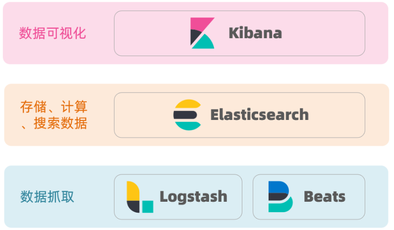
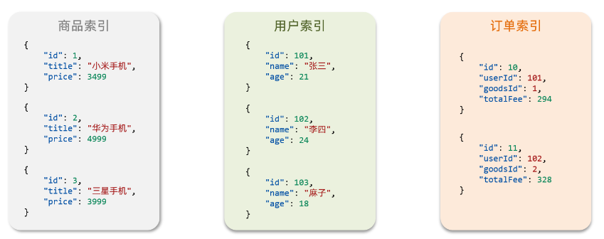
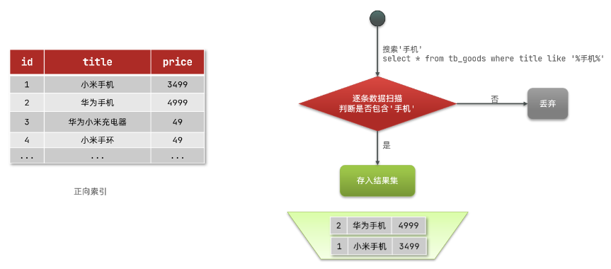
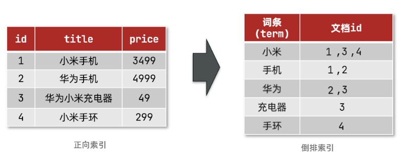

# ElasticSearch

## 一、ES简介

### 1.1 基本介绍

Elasticsearch是一个分布式、RESTful 风格的搜索和数据分析引擎，可以用来实现搜索、日志统计、分析、系统监控等功能

> Elasticsearch是基于Apache Lucene的搜索服务器。它由Shay Banon开发并于2010年出版。现在由Elasticsearch BV维护。
>
> Elasticsearch是一个实时的分布式开放源代码全文本搜索和分析引擎。可从RESTful Web服务界面访问它，并使用无模式的JSON（JavaScript对象表示法）文档存储数据。它基于Java编程语言构建，因此Elasticsearch可以在不同平台上运行。它使用户能够以很高的速度浏览大量的数据

**特点**

+ Elasticsearch最多可扩展至PB级的结构化和非结构化数据
+ Elasticsearch可以代替MongoDB和RavenDB等文档存储
+ Elasticsearch使用非规范化来提高搜索性能

### 1.2 ELK技术栈

ELK是以ElasticSearch为核心的技术栈，包括beats、Logstash、kibana、elasticsearch相关技术，被广泛运用于日志数据分析、实时监控等领域



## 二、基本概念

### 2.1 文档(Document)

ES中文档的概念就是数据库中数据的概念，在ES中文档数据以json格式的形式存储

```json
//一个文档数据
{
    "id": 1,   //字段值
    "name": "zhezhou",
    "age": 23
}
```

文档由多个字段(field)的值组成

### 2.2 索引(Index)

索引(index)类似于传统关系型数据库中的表(table)，是文档数据的集合



**正向索引**

正向索引就是在MySQL中给数据表字段设置的索引，数据顺序存储，如果使用精确匹配，查询速度非常快，但如果使用模糊匹配，尤其是左模糊匹配，就需要全表扫描，查询效率就非常低



- 优点：
  - 可以给多个字段创建索引
  - 根据索引字段搜索、排序速度非常快
- 缺点：
  - 根据非索引字段，或者索引字段模糊查找时，只能全表扫描

**倒排索引**

倒排索引中有两个重要的概念：

+ 文档(document): 即数据，每一条数据就是一个文档
+ 词条(term): 对文档数据或用户搜索数据，利用某种算法分词，得到的具备含义的词语就是词条；例如：我是中国人，就可以分为：我、是、中国人、中国、国人这样的几个词条

倒排索引就是将文档进行分词，形成词条和id的对应关系即为反向索引



创建倒排索引是对正向索引的一种特殊处理

- 将每一个文档的数据利用算法分词，得到一个个词条
- 创建表，每行数据包括词条、词条所在文档id、位置等信息
- 因为词条唯一性，可以给词条创建索引，例如hash表结构索引


- 优点：
  - 根据词条搜索、模糊搜索时，速度非常快
- 缺点：
  - 只能给词条创建索引，而不是字段
  - 无法根据字段做排序

**正向索引与倒排索引的对比**

- **正向索引**是最传统的，根据id索引的方式。但根据词条查询时，必须先逐条获取每个文档，然后判断文档中是否包含所需要的词条，是**根据文档找词条的过程**。
- 而**倒排索引**则相反，是先找到用户要搜索的词条，根据词条得到保护词条的文档的id，然后根据id获取文档。是**根据词条找文档的过程**。

### 2.3 映射(Mapping)

映射(mapping)是文档中字段的约束，类似关系型数据库中表结构的概念

> MySQL与ElasticSearch中的概念对比：
>
> | MySQL  | ElasticSearch | 说明                                                         |
> | ------ | ------------- | ------------------------------------------------------------ |
> | table  | index         | 在es中，索引就是文档的集合                                   |
> | row    | document      | 文档就是一条条数据，以json格式进行存储，在关系型数据库中就是一行数据 |
> | column | field         | 字段就是文档中的字段，在关系型数据库中就是一列字段           |
> | schema | mapping       | 映射是索引中文档的约束，例如字段类型的约束；在关系型数据库中就是表结构，对数据的约束 |
> | sql    | dsl           | dsl是es提供的json风格的请求语句，用来操作es，实现数据的crud  |

**分词器**

在Elasticsearch中，分词器（Tokenizer）是一个用于将文本数据分割成单独词汇单元的组件。分词器的任务是将输入的文本按照一定的规则拆分成一个个词汇单元，以便在建立索引(倒排索引)和执行搜索时能够更精确地匹配和检索文档。

分词器通常包括两个主要组件：分词器（Tokenizer）和过滤器（Filter）。这两个组件的组合定义了文本数据如何被拆分和处理。

+ 分词器（Tokenizer）： 分词器负责将输入文本切分成词汇单元。它的工作是根据一些规则（例如空格、标点符号等）将文本拆分成词汇单元。

+ 过滤器（Filter）： 过滤器负责对分词后的词汇进行进一步的处理，以改变或增强这些词汇。例如，可以使用过滤器进行小写转换、去除停用词、词干提取等操作。

Elasticsearch提供了许多内置的分词器和过滤器，同时也支持用户自定义分词器。这使得用户能够根据其特定的需求选择合适的分词器和过滤器，以确保索引和搜索的准确性和效率。

在中文环境中，由于中文没有空格来分隔单词，所以针对中文文本，通常需要使用专门设计的中文分词器，例如Elasticsearch中的IK Analyzer。这样的分词器能够更好地理解中文文本的语义和结构，提高搜索的准确性。说的简单点分词器就是将一句话中的词语划分出来

## 三、索引基本操作

CRUD的简单描述：

+ 创建索引库：PUT/索引库名
+ 查询索引库：GET/索引库名
+ 删除索引库：DELETE/索引库名
+ 修改索引库：PUT/索引库名

### 3.1 创建索引库和映射

使用postman发送请求：http://ip:port/index_name  

请求方式：put 

请求格式：application/json

请求参数：

```json
{
    "mappings": {
        "properties": {
            //字段名称
            "fieldName1": {
                "type": "",   //字段类型
                "analyzer": ""   //使用的分词器
            },
            "fieldName2": {
                "type": "",
                "index": "false/true"   //是否创建索引
            },
            "fieldName3": {
                //子字段信息
                "properties": {
                    "subFieldName1": {
                        
                    },
                    "subFieldName2": {
                        
                    }
                }
            }
        }
    }
}
```

返回结果：

```json
{
    "acknowledged": true,  //响应结果
    "shards_acknowledge": true,  //分片操作
    "index": "index_name"  //索引名称
}
```

> kibana DSL形式：
>
> 请求参数不变，语句变为: 
>
> PUT /index_name
>
> {
>
> ​	//请求参数
>
> }

### 3.2 查询索引库

**查询所有索引信息**

使用postman发送请求：http://ip:port/_cat/indices?v

请求方式：get

返回结果：

```
health	status	index		uuid	pri		rep		docs.count		docs.deleted		store.size		pri.store.size
yellow  open    index_name  uuid    1       1        0              0                    208b            208b
```

字段含义：

| 字段名称       | 说明                                                         |
| -------------- | ------------------------------------------------------------ |
| health         | 当前服务器的健康状态：green(集群完整)、yellow(单点正常，集群不完整)、red(单点不正常) |
| status         | 索引打开、关闭状态                                           |
| index          | 索引名称                                                     |
| uuid           | 索引统一编号                                                 |
| pri            | 主分片数量                                                   |
| rep            | 副本数量                                                     |
| docs.count     | 索引中可用文档数量                                           |
| docs.deleted   | 文档删除状态                                                 |
| store.size     | 主分片和副本分片整体占空间大小                               |
| pri.store.size | 主分片占空间大小                                             |

**查询单个索引信息**

使用postman发送请求：http://ip:port/index_name

请求方式：get

### 3.3 修改索引库

索引库一旦创建，只能新增字段到mapping中，索引修改索引仅限于新增字段

使用postman发送请求: http://ip:port/index_name

请求方式: put

请求参数: 

```json
{
    "properties": {
        "newFieldName": {
            "type": "" //字段类型
        }
    }
}
```

返回结果：

```json
{
    "acknowledge": true
}
```

### 3.4 删除索引库

请求地址：http://ip:port/index_name

请求方式：delete

请求参数：无

返回结果：

```json
{
    "acknowledge": true
}
```

> kibana格式：
>
> DELETE /index_name

## 四、文档基本操作

### 4.1 创建文档

请求地址：http://ip:port/index_name/_doc/{#id}   请求时可以携带id也可以不带

请求方式：post

请求参数：

```json
{
    "field1": "value1",
    "field2": "value2",
    ...
}
```

返回结果：

```json
{
    "_index": "index_name",   //索引名称
    "_type": "_doc",        //类型-文档
    "_id": "random id",     //标识文档的唯一id，类似于主键
    "_version": 1,          //版本号
    "result": "created",    //created表示创建成功
    "_shards": { 
        "total": 2,         //分片总数
        "successful": 1,     //保存成功的分片数
        "failed": 0          //保存失败的分片数
    },
    "_seq_no": 0,
    "_primary_term": 1
}
```

> kibana dsl：
>
> POST /index_name/_doc/{#id}
>
> {
>
> ​	//请求参数
>
> }
>
> 创建文档的请求方式可以是post也可以是put
>
> `POST index_name/_doc`：
>
> - `POST index_name/_doc`：不指定 ID，总是会插入新的文档，文档数加 1。
> - `POST/PUT index_name/_doc/id`：指定 ID
>   - 当 id 存在时，会覆盖之前的，并且 version 会加 1，文档数不增加。
>   - 当 id 不存在时，会插入新的文档，文档数加 1。
>
> `PUT index_name/_doc`：
>
> - `PUT index_name/_doc`：不指定 ID，**不允许**该操作。
> - `PUT/POST index_name/_doc/id`：指定 ID
>   - 当 id 存在时，会覆盖之前的，并且 version 会加 1，文档数不增加。
>   - 当 id 不存在时，会插入新的文档，文档数加 1

### 4.2 查询文档

常见的ES查询方式：

+ match query：匹配查询，根据字段中的内容进行全文匹配查询，可以使用match、multi_match
+ term query: 精确查询，根据字段中的精确值进行查询，适用于keyword类型或者已经执行过分词器的字段
+ range query: 范围查询，根据字段中的范围值进行查询，可以用来查询数字或日期范围，例如大于、小于、范围内等
+ bool query: 布尔查询，通过逻辑运算符(must、must_not、should)组合多个查询条件，实现更复杂的查询逻辑
+ match phrase query: 短语匹配查询，根据字段中连续的短语进行查询，适用于需要保持短语顺序的查询
+ prefix query: 前缀查询，根据字段中的前缀进行查询，适用于需要按照前缀匹配查询的场景
+ wildcard query: 通配符查询，根据通配符模式进行查询，支持通配符符号(*、?)进行模糊匹配
+ fuzzy query: 模糊查询，根据字段中的模糊匹配进行查询，可以通过设置fuzziness参数来控制模糊程度
+ nested query: 嵌套查询，根据嵌套对象进行查询，以便查询嵌套在文档中的相关信息
+ aggregation query: 聚合查询，用于计算、统计和分析数据，包括求和、平均值、最小值、最大值分组等操作

**全表查询**

请求地址：http://ip:port/index_name/_search

请求方式：get

返回结果：

```json
{
  "took" : 2,
  "timed_out" : false,
  "_shards" : {
    "total" : 1,
    "successful" : 1,
    "skipped" : 0,
    "failed" : 0
  },
  "hits" : {
    "total" : {
      "value" : 67,
      "relation" : "eq"
    },
    "max_score" : 1.0,
    "hits" : [
      {
        "_index" : "index_name",
        "_type" : "_doc",
        "_id" : "jfdGMI0Bi3sfGjuDO-Y3",
        "_score" : 1.0,
        "_source" : {
          //具体数据
        }
      }
}
```

**根据id查询**

请求地址：http://ip:port/index_name/_doc/{id}

请求方式：get

返回结果：

```json
{
  "_index" : "index_name",
  "_type" : "_doc",
  "_id" : "jfdGMI0Bi3sfGjuDO-Y3",
  "_version" : 1,
  "_seq_no" : 0,
  "_primary_term" : 1,
  "found" : true,
  "_source" : {
    	//具体数据
    }
  }
}

```

**基本条件查询**

(1). 条件匹配查询

请求地址：http://ip:port/index_name/_search

请求方式：get

请求参数：

```json
{
    "query": {
        "match": {
            "field": "condition"   //查询条件  查询field字段的值 = condition的文档
        }
    }
}
```

返回结果

```json
{
  "took" : 1,
  "timed_out" : false,
  "_shards" : {
    "total" : 1,
    "successful" : 1,
    "skipped" : 0,
    "failed" : 0
  },
  "hits" : {
    "total" : {
      "value" : 12,
      "relation" : "eq"
    },
    "max_score" : 7.9464316,
    "hits" : [
      {
        "_index" : "index_name",
        "_type" : "_doc",
        "_id" : "jfdGMI0Bi3sfGjuDO-Y3",
        "_score" : 7.9464316,
        "_source" : {
         		//具体字段、具体数据
          }
        }
      }
    ]
}
```

(2). 精确查询

请求参数：

```json
{
    "query": {
        "term": {
            "field": "value"   //精确匹配，查询field = value字段的值
        }
    }
}
```

返回结果：

```json
{
  "took" : 4,
  "timed_out" : false,
  "_shards" : {
    "total" : 1,
    "successful" : 1,
    "skipped" : 0,
    "failed" : 0
  },
  "hits" : {
    "total" : {
      "value" : 8,
      "relation" : "eq"
    },
    "max_score" : 1.0,
    "hits" : [
      {
        "_index" : "index_name",
        "_type" : "_doc",
        "_id" : "jfdGMI0Bi3sfGjuDO-Y3",
        "_score" : 1.0,
        "_source" : {
          //具体数据
          }
        }
      }
    ]
}
```

(3). 多条件布尔查询

请求参数：

```json
{
    "query": {
        "bool": {
            "must": [   //must相当于and，查询结果需要同时满足下面的条件
                {"match": {"field1": "value"}},
                {"term": {"field2": "value2"}}
            ],
            //must_not是同时不满足
            "must_not": [
            	{},  //condition1
        		{}   //condition2
            ],
            //should相当于or，只需要满足一项
            "should": [
                {},  //condition1
                {}   //condition2
            ]
        }
    }
}
```

(4). 前缀查询

请求参数：

```json
{
    "query": {
        "prefix": {
            "field": "value"   //查询field前缀是value的文档
        }
    }
}
```

(5). 模糊查询

```json
{
    "query": {
        "fuzzy": {
            "field": {
                "value": "value",   //查询field字段包含value的文档
                "fuzziness": 2      //相似度为2
            }
        }
    }
}
```

(6). 范围查询

请求参数：

```json
{
    "query": {
        "range": {
            "field": {
                "gte": value1,   //查询field字段的值在value1至value2之间的文档
                "lte": value2
            }
        }
    }
}
```

### 4.3 删除文档

请求地址：http://ip:port/index_name/_doc/{id}

请求方式：delete

根据文档唯一标识删除文档

返回结果：

```json
{
  "_index" : "index_name",
  "_type" : "_doc",
  "_id" : "kPNC7o0Bi3sfGjuDUOnp",
  "_version" : 2,
  "result" : "deleted",   //表示文档已删除
  "_shards" : {
    "total" : 2,
    "successful" : 1,
    "failed" : 0
  },
  "_seq_no" : 68,
  "_primary_term" : 1
}
```

### 4.4 更新文档

