# JUC并发编程

## 一、进程和线程

### 1.1 进程和线程的概念

#### 1.1.1 进程

程序由指令和数据组成，但这些指令要运行，数据要读写，就必须将指令加载至CPU，数据加载至内存，进程就是用来加载指令，管理内存，管理IO的

当一个程序被运行，从磁盘加载这个程序的代码至内存，这时就开启了一个进程

进程可以视为程序的一个实例，大部分程序可以同时运行多个实例进程，例如记事本，浏览器等，也有的程序只能启动一个实例进程，比如音乐播放器等


#### 1.1.2 线程

一个进程之内可以分为一个到多个线程

一个线程就是一个指令流，将指令流中的一条条指令以一定的顺序交给CPU执行

Java中，线程作为最小调度单位，进程作为资源分配的最小单位


#### 1.1.3 进程与线程的对比

进程基本上是相互独立的，而线程存在于进程内，是进程的一个子集

进程拥有共享资源，如内存空间等，仅供其内部的线程共享

进程间通信较为复杂

+ 同一台计算机的进程通信称为IPC
+ 不同计算机之间的进程通信，需要通过网络，并遵守TCP协议

线程通信相对简单，因为它们共享进程内的内存，多个线程可以访问同一个共享变量

线程更轻量级，线程上下文切换成本一般比进程低

### 1.2 并行和并发的概念

并发：指两个或多个事件在同一时间段内发生。 

并行：两个或多个事件在同一时刻发生。

#### 1.2.1 并发

单核CPU线程实际还是串行执行的，操作系统中有任务调度器，将CPU的时间片分给不同的线程，只是由于CPU在线程间的切换非常快

+ 在多道程序环境下，指在一段时间内，宏观上有多个程 序在同时运行。 

+ 但在单处理机系统中，每一时刻仅能有一道程序运行。 

+ 微观上这些程序只能是分时的交替执行。

#### 1.2.2 并行

多核CPU，每个核心都可以运行一个线程，这就是并行


**一个相似的概念 --- 同步和异步**

从方法调用的角度来讲，如果：

+ 需要等待结果返回，才能继续执行就是同步
+ 不需要等待结果返回，就能继续运行就是异步

多线程可以让方法执行变为异步的，比如说在读取磁盘文件时，假设读取操作花费了5s，如果没有线程调度机制，这5s内什么都做不了，效率就比较低

### 1.3 线程的基本应用

#### 1.3.1 创建线程

（1）直接使用Thread

```java
Thread t = new Thread(){
    @Override 
    public void run(){
        //要执行的任务
    }
};  //可以使用匿名类，也可以创建一个类继承Thread类重写run方法
//启动线程
t.start();
```

（2）把线程和线程要执行的任务代码分开

使用一个类实现Runnable接口

```java
//方式二，实现Runnable接口，实现run方法
        Runnable r = () -> {
            log.debug("running");
        }; //lamabda表达式

        Thread t = new Thread(r, "runnable");
        t.start();
```

**Thread与Runnable的关系**

Thread类本身实现了Runnable接口

方式一方式二本质上运行的都是Thread类的run方法


总结：

+ 方式一将线程与任务合并在一起，方式二将线程和任务分开
+ 使用Runnable更容易与线程池等高级API配合
+ 使用Runnable让任务类脱离了Thread继承体系，更灵活


（3）使用FutureTask创建线程

使用构造方法创建FutureTask时需要传入一个Callable接口的实现类

```java
FutureTask<Integer> futureTask = new FutureTask<>(() -> {
    log.debug("running");
    return 100;
});

//借助thread来执行
Thread t = new Thread(futureTask, "futureTask");
t.start();
//当主线程执行到这里时，会等待futureTask执行完毕返回结果
int result = futureTask.get();
log.debug("get:{}", result);
```

#### 1.3.2 查看进程线程的方法

**windows下**

+ 使用任务管理器查看进程线程

+ 在命令行中输入taskList查看 

  ```
  taskList | findstr 进程名  #查看指定字符串的进程
  ```

+ 在命令行中使用taskkill命令杀死进程

**Linux下**

+ 使用ps -ef | grep 进程名   查看指定进程名的进程
+ 使用kill pId    杀死指定进程号的进程
+ 使用top命令查看正在运行的进程，可以动态跟踪进程执行状态
  + 使用top -H -p pId  查看进程号下的线程信息

**Java所支持的命令**

+ 使用jps查看所有Java进程
+ 使用jstack pId查看某个java进程的所有线程状态
+ jconsole查看某个Java进程中线程的运行情况


#### 1.3.3 线程运行原理

java虚拟机内会为每个线程单独分配JVM栈

+ 每个栈由栈帧组成，对应着每次方法调用时所占用的内存
+ 每个线程只能有一个活动栈帧，对应着正在执行的那个方法


**线程上下文切换**

CPU不再执行当前线程，转而执行另一个线程的代码

+ 当线程的CPU时间片用完
+ 垃圾回收
+ 有更高优先级的线程需要运行
+ 线程自己调用了sleep、yield、wait、join、park等方法

当发生上下文切换时，需要由操作系统保存当前现线程的状态，并恢复另一个线程的状态，java中由JVM中的程序计数器来保存


#### 1.3.4 线程常见的方法

**start()与run()**

run()方法并不能完成多线程的任务，只是Thread类中供实例调用的一个方法

```java
Thread thread = new Thread(
                () -> log.debug("running")
        );

//从结果中可以看出是由主线程打印的running，所以这个run方法仍然是由主线程执行到此处使用thread实例对象调用的
thread.run();

输出结果：
20:40:22.602 [main] DEBUG com.concurrent.demo02.thread.ThreadTest3 - running
```

start()方法是启动一个新线程，然后由新线程去调用内部的run方法，start方法只能调用一次，否则会报IllegalThreadStateException异常

线程状态：

```java
Thread thread = new Thread(
        () -> log.debug("running")
);

//从结果中可以看出是由主线程打印的running，所以这个run方法仍然是由主线程执行到此处使用thread实例对象调用的
// thread.run();
log.debug("Thread state: {}", thread.getState());
thread.start();
log.debug("Thread state: {}", thread.getState());

输出结果：
20:46:54.507 [main] DEBUG com.concurrent.demo02.thread.ThreadTest3 - Thread state: NEW
20:46:54.513 [main] DEBUG com.concurrent.demo02.thread.ThreadTest3 - Thread state: RUNNABLE
20:46:54.514 [Thread-0] DEBUG com.concurrent.demo02.thread.ThreadTest3 - running
```


**sleep()方法与yield()方法**

sleep()方法

+ 调用sleep方法会让当前线程从Runnable状态进入Timed Waiting状态
+ 睡眠结束后的线程未必会立即执行
+ 当线程被interrupt方法打断睡眠时，会抛出java.lang.InterruptedException: sleep interrupted异常

```java
Thread thread = new Thread(
                () -> {
                    log.debug("running");
                    try {
                        Thread.sleep(1000);
                    } catch (InterruptedException e) {
                        e.printStackTrace();
                    }
                }
        );

        thread.start();
        log.debug("thread state: {}", thread.getState());

//可能会出现主线程运行快使得thread没有执行sleep方法就打印状态，所以让主线程暂时挂起
        try {
            Thread.sleep(500);
        } catch (InterruptedException e) {
            e.printStackTrace();
        }
//打断睡眠中的线程会抛出java.lang.InterruptedException异常
//thread.interrupt();

        log.debug("thread state: {}", thread.getState());

输出结果：
20:53:49.117 [main] DEBUG com.concurrent.demo02.thread.ThreadTest3 - thread state: RUNNABLE
20:53:49.634 [main] DEBUG com.concurrent.demo02.thread.ThreadTest3 - thread state: TIMED_WAITING
```


yield()方法

+ 调用yield方法会使当前线程从Running状态进入Runnable就绪状态，然后调度执行其他线程（可能仍然会调用此线程）
+ 具体的实现依赖于操作系统的任务调度器

> **线程优先级**
>
> + 线程优先级会提示调度器（CPU）优先调度该程序，但仅仅是一个提示，CPU可以不管
> + 如果CPU比较繁忙，那么优先级高的线程会获得更多的时间片，但CPU空闲时，优先级几乎没作用


sleep方法的小应用：防止死循环完全占用CPU

```java
while(true){
    try{
        //sleep的时间不需要太长，但必须有，目的是为了让线程让出CPU的使用权
    	Thread.sleep(50);
    } catch(InterruptedException e){
        e.printStackTrace();
    }
    
}
```


**join()方法**

join方法等待线程结束，哪个线程调用join，就等待哪个线程运行结束

```java
log.debug("main begin...");

        Thread t = new Thread(() -> {
            log.debug("t1 begin...");
            //线程睡眠1s
            try {
                Thread.sleep(1000);
            } catch (InterruptedException e) {
                e.printStackTrace();
            }

            r = 10;

            log.debug("t1 end...");
        }, "t1");

        t.start();
        log.debug("r = {}", r);
        log.debug("main end...");
输出：
21:25:18.811 [main] DEBUG com.concurrent.demo02.thread.ThreadTest3 - main begin...
21:25:18.815 [t1] DEBUG com.concurrent.demo02.thread.ThreadTest3 - t1 begin...
21:25:18.815 [main] DEBUG com.concurrent.demo02.thread.ThreadTest3 - r = 0  
21:25:18.817 [main] DEBUG com.concurrent.demo02.thread.ThreadTest3 - main end...
```

原因：由于主线程执行的较快，率先执行完成，这时，线程t还在sleep当中，并没有执行到r = 10这一步赋值语句，所以打印出来的r = 0；

如果想让r输出为10，可以使用join方法，另主线程等待线程t执行完毕后再执行

```java
log.debug("main begin...");

Thread t = new Thread(() -> {
    log.debug("t1 begin...");
    //线程睡眠1s
    try {
        Thread.sleep(1000);
    } catch (InterruptedException e) {
        e.printStackTrace();
    }

    r = 10;

    log.debug("t1 end...");
}, "t1");

t.start();
//执行t的join方法另主线程等待线程t执行完毕
try {
    t.join();
} catch (InterruptedException e) {
    e.printStackTrace();
}
log.debug("r = {}", r);
log.debug("main end...");
输出结果：
21:29:26.617 [main] DEBUG com.concurrent.demo02.thread.ThreadTest3 - main begin...
21:29:26.621 [t1] DEBUG com.concurrent.demo02.thread.ThreadTest3 - t1 begin...
21:29:27.624 [t1] DEBUG com.concurrent.demo02.thread.ThreadTest3 - t1 end...
21:29:27.625 [main] DEBUG com.concurrent.demo02.thread.ThreadTest3 - r = 10
21:29:27.626 [main] DEBUG com.concurrent.demo02.thread.ThreadTest3 - main end...
```

join的应用 --- 同步

使用join方法可以达到同步的效果：因为主线程只有等到其他线程执行结束之后才能继续运行，比如上例，主线程需要等待t1执行完毕才能继续运行后面的代码，如果复杂一点，主线程等待多个线程的结果：

```java
private static int r1 = 0;
private static int r2 = 0;

Thread t1 = new Thread(() -> {
            log.debug("t1 begin...");
            TimeUtil.sleep(1);
            r1 = 10;
            log.debug("t1 end...");
        }, "t1");

        Thread t2 = new Thread(() -> {
            log.debug("t2 begin...");
            TimeUtil.sleep(2);
            r2 = 20;
            log.debug("t2 end...");
        }, "t2");

        t1.start();
        t2.start();
        long start = System.currentTimeMillis();
        log.debug("join...");
        t1.join();
        t2.join();
        log.debug("join end...");
        long end = System.currentTimeMillis();
        log.debug("r1: {}, r2: {}, costs: {}", r1, r2, end - start);
//从输出结果也能看出，等待时间是执行时间最长的那个线程，因为当这个线程运行完毕时，也没有必要等待其他线程了，因为其他线程早就运行完毕了
输出结果：
16:39:49.397 [main] DEBUG com.concurrent.demo02.thread.ThreadTest3 - join...
16:39:49.397 [t2] DEBUG com.concurrent.demo02.thread.ThreadTest3 - t2 begin...
16:39:49.397 [t1] DEBUG com.concurrent.demo02.thread.ThreadTest3 - t1 begin...
16:39:50.397 [t1] DEBUG com.concurrent.demo02.thread.ThreadTest3 - t1 end...
16:39:51.397 [t2] DEBUG com.concurrent.demo02.thread.ThreadTest3 - t2 end...
16:39:51.397 [main] DEBUG com.concurrent.demo02.thread.ThreadTest3 - join end...
16:39:51.397 [main] DEBUG com.concurrent.demo02.thread.ThreadTest3 - r1: 10, r2: 20, costs: 2000
```


**interrupt()方法**

线程调用sleep方法，wait方法，join方法都会让线程进入阻塞状态，而调用线程的interrupt方法会清空线程的打断状态（即置为false）

```java
Thread t1 = new Thread(() -> {
            TimeUtil.sleep(3);
        }, "t1");

        t1.start();
        TimeUtil.sleep(1);
//打断t1线程
        t1.interrupt();
        log.debug("t1 interrupt");
        log.debug("isInterrupted: {}", t1.isInterrupted());

//正在sleep，join，wait的线程被打断之后都会抛出异常
输出结果：
java.lang.InterruptedException: sleep interrupted
	at java.base/java.lang.Thread.sleep(Native Method)
	at com.concurrent.demo02.util.TimeUtil.sleep(TimeUtil.java:11)
	at com.concurrent.demo02.thread.ThreadTest3.lambda$test5$5(ThreadTest3.java:125)
	at java.base/java.lang.Thread.run(Thread.java:834)
16:53:11.252 [main] DEBUG com.concurrent.demo02.thread.ThreadTest3 - t1 interrupt
16:53:11.252 [main] DEBUG com.concurrent.demo02.thread.ThreadTest3 - isInterrupted: false
```

如果是打断一个正常执行的线程，并不会终止线程的运行，这个interrupt只是一个打断请求，并不是真正的打断，是否需要停止运行还是取决于线程

打断正常线程会将线程的打断状态置为true

```java
Thread t2 = new Thread(() ->{
            while (true){
                boolean interrupted = Thread.currentThread().isInterrupted();
                if(interrupted){
                    log.debug("Thread is interrupted");
                    break;
                }
            }
        }, "t2");

        t2.start();
        TimeUtil.sleep(1);
        t2.interrupt();
        log.debug("interrupt: {}", t2.isInterrupted());

输出结果：
17:00:01.077 [t2] DEBUG com.concurrent.demo02.thread.ThreadTest3 - Thread is interrupted
17:00:01.077 [main] DEBUG com.concurrent.demo02.thread.ThreadTest3 - interrupt: true
```

> 两阶段终止模式：
>
> 在一个线程中“优雅”地终止另一个线程
>
> “优雅”指的是，线程1想终止线程2，并不是立即终止线程2，而是给线程2一个“料理后事”的机会之后线程2自己终止
>
> ```java
> class TwoPhaseTermination{
> 
>     //模拟监控线程
>     private Thread monitor;
> 
>     //启动监控线程
>     public void start(){
>         monitor = new Thread(() -> {
>             while(true){
>                 Thread currentThread = Thread.currentThread();
>                 if(currentThread.isInterrupted()){
>                     log.debug("处理后事...");
>                     break;
>                 }
> 
>                 //每隔1秒执行一次监控程序
>                 try {
>                     Thread.sleep(2000);
>                     log.debug("执行监控程序...");
>                 } catch (InterruptedException e) {
>                     e.printStackTrace();
>                     //如果在睡眠的时候被打断，那么就不会将打断标志置为true，所以需要在这里重新设置打断标志
>                     currentThread.interrupt();
>                 }
> 
>             }
>         }, "monitor");
> 
>         monitor.start();
>     }
> 
>     public void stop(){
>         monitor.interrupt();
>     }
> }
> 
> TwoPhaseTermination test = new TwoPhaseTermination();
> 
>         test.start();
>         //5s后终止监控程序
>         TimeUtil.sleep(5);
>         test.stop();
> 
> 
> //如果调整一下睡眠时间，就能够在监控程序正常执行的时候打断，这样不会报异常
> 输出结果：
> 17:23:30.399 [monitor] DEBUG com.concurrent.demo02.thread.TwoPhaseTermination - 执行监控程序...
> 17:23:32.399 [monitor] DEBUG com.concurrent.demo02.thread.TwoPhaseTermination - 执行监控程序...
> java.lang.InterruptedException: sleep interrupted
> 	at java.base/java.lang.Thread.sleep(Native Method)
> 	at com.concurrent.demo02.thread.TwoPhaseTermination.lambda$start$0(ThreadTest3.java:182)
> 	at java.base/java.lang.Thread.run(Thread.java:834)
> 17:23:33.399 [monitor] DEBUG com.concurrent.demo02.thread.TwoPhaseTermination - 处理后事...
> ```
>
> 


#### 1.3.5 主线程和守护线程

默认情况下，java进程需要等待所有线程结束之后才会结束，也就是说，即使主线程执行完成，如果还有其他线程没有执行完毕，Java进程仍然存在

有一种特殊的线程叫做**守护线程**，只要其他非守护线程执行完毕，即使守护线程没有执行完成，也会被强制结束

```java
Thread t1 = new Thread(() -> {
    log.debug("t1 begin...");
    while (true){
        Thread currentThread = Thread.currentThread();
        if(currentThread.isInterrupted()){
            log.debug("interrupted");
            break;
        }
    }
    log.debug("t1 end...");
}, "t1");

//设置t1为守护线程
t1.setDaemon(true);
t1.start();

TimeUtil.sleep(2);
log.debug("main thread end...");

//可以看到并没有输出t1 end...说明守护线程被强制停止了
输出结果：
19:16:50.431 [t1] DEBUG com.concurrent.demo02.thread.ThreadTest4 - t1 begin...
19:16:52.423 [main] DEBUG com.concurrent.demo02.thread.ThreadTest4 - main thread end...
```

> + 垃圾回收线程就是一种守护线程
> + Tomcat中的Acceptor和Poller线程都是守护线程，所以Tomcat接收到shutdown命令后，不会等待它们处理完当前请求


#### 1.3.6 线程的状态

**五种线程状态**

线程的五种状态是从**操作系统**的层面上来讲的

分别是：

+ 初始状态，仅是在语言层面创建了线程对象，还没有与操作系统线程关联
+ 可运行状态，也称为就绪状态，指线程已经被创建，可以由CPU调度执行
+ 运行状态，指获取了CPU时间片，开始执行
  + 当线程的CPU时间片使用完毕，会从运行状态切换至可运行状态，这会导致一次上下文切换
+ 阻塞状态
  + 如果调用了阻塞API，如BIO读写文件，这时，线程不会实际使用CPU，会导致上下文切换，进入阻塞状态
  + 等BIO操作完毕，会由操作系统唤醒阻塞线程，转至可运行状态
  + 只要处于阻塞状态的线程不被唤醒，就不会被CPU调度执行
+ 终止状态，表示线程已经执行完毕，生命周期结束


**线程的六种状态**

线程的六种状态是从**Java API**的角度来说的

```java
//在Thread类中有一个内部的枚举类
public enum State {
        NEW,

        RUNNABLE,

        BLOCKED,
    
    	WAITING,

        TIMED_WAITING,
    
        TERMINATED;
    }
```

+ `NEW`是当线程被创建时，但是还没有调用start方法时的状态
+ `RUNNABLE`当线程调用了start方法之后的状态，Java API中的`RUNNABLE`状态涵盖了操作系统中的【可运行状态】、【运行状态】和【阻塞状态】
+ `BLOCKED`，`WAITING`，`TIMED_WAITING`都是Java API层面对【阻塞状态】的细分
+ `TERMINATED`当线程代码运行结束后的状态


```java
//Java六种线程状态的演示

    //线程t1没有start，状态应为NEW
	Thread t1 = new Thread(() -> {
            log.debug("t1 running...");
        }, "t1");

	//线程t2是死循环，状态应为RUNNABLE
	Thread t2 = new Thread(() -> {
            log.debug("t2 running...");
            while (true){
                Thread currentThread = Thread.currentThread();
                if(currentThread.isInterrupted()){
                    log.debug("interrupt");
                    break;
                }
            }
        }, "t2");
        t2.start();
		//线程t3直接执行完毕，状态应为TERMINATED
        Thread t3 = new Thread(() -> {
            log.debug("t3 running...");
        }, "t3");
        t3.start();
		
//线程t4处于sleep，应为TIMED_WAITING状态
        Thread t4 = new Thread(() -> {
            synchronized (ThreadTest4.class){
                TimeUtil.sleep(100);
            }
        }, "t4");
        t4.start();

//线程t5等待t2执行，应为WAITING状态
        Thread t5 = new Thread(() -> {
            try {
                t2.join();
            } catch (InterruptedException e) {
                e.printStackTrace();
            }
        }, "t5");
        t5.start();

//由于t4获取了同步锁，t6被阻塞，处于BLOCKED状态
        Thread t6 = new Thread(() -> {
            synchronized (ThreadTest4.class){
                log.debug("t6 running...");
            }
        }, "t6");
        t6.start();

        log.debug("t1 state: {}", t1.getState());
        log.debug("t2 state: {}", t2.getState());
        log.debug("t3 state: {}", t3.getState());
        log.debug("t4 state: {}", t4.getState());
        log.debug("t5 state: {}", t5.getState());
        log.debug("t6 state: {}", t6.getState());

//WAITING与TIMED_WAITING的区别是TIMED_WAITING是有指定时间的，时间到了之后就会转变为RUNNABLE状态，而WAITING就会一直等待
输出结果：
19:56:06.005 [main] DEBUG com.concurrent.demo02.thread.ThreadTest4 - t1 state: NEW
19:56:06.015 [main] DEBUG com.concurrent.demo02.thread.ThreadTest4 - t2 state: RUNNABLE
19:56:06.015 [main] DEBUG com.concurrent.demo02.thread.ThreadTest4 - t3 state: TERMINATED
19:56:06.015 [main] DEBUG com.concurrent.demo02.thread.ThreadTest4 - t4 state: TIMED_WAITING
19:56:06.015 [main] DEBUG com.concurrent.demo02.thread.ThreadTest4 - t5 state: WAITING
19:56:06.015 [main] DEBUG com.concurrent.demo02.thread.ThreadTest4 - t6 state: BLOCKED
```


## 二、共享模型 -- 管程

### 2.1 资源共享问题

```java
//变量count
private static int count = 0;

//线程1对count变量做5000次++运算
        Thread t1 = new Thread(() -> {
            for (int i = 0; i < 5000; i++) {
                count++;
            }
        }, "t1");

        //线程2对count变量做5000次--运算
        Thread t2 = new Thread(() -> {
            for (int i = 0; i < 5000; i++) {
                count--;
            }
        }, "t2");

        t1.start();
        t2.start();
        try {
            t1.join();
            t2.join();
        } catch (InterruptedException e) {
            e.printStackTrace();
        }

        log.debug("count = {}", count);

输出结果：
20:44:45.958 [main] DEBUG com.concurrent.demo02.thread.ThreadTest5 - count = 1017
或者：
20:45:52.803 [main] DEBUG com.concurrent.demo02.thread.ThreadTest5 - count = 431
...
```

针对于上面的代码，一个线程对count++，一个线程对count--，照道理来说最终结果应该是0，但是每一次运行都会出现不同的结果，这就是资源共享出现的问题

对于count++这段代码而言，编译成字节码后会分成四条指令

```java
getstatic
iconst_1
iadd   //count--这里就是isub
putstatic
```

想要完成静态变量的自增，自减，就需要在主存和工作内存中进行数据交换


时序图：单线程情况下

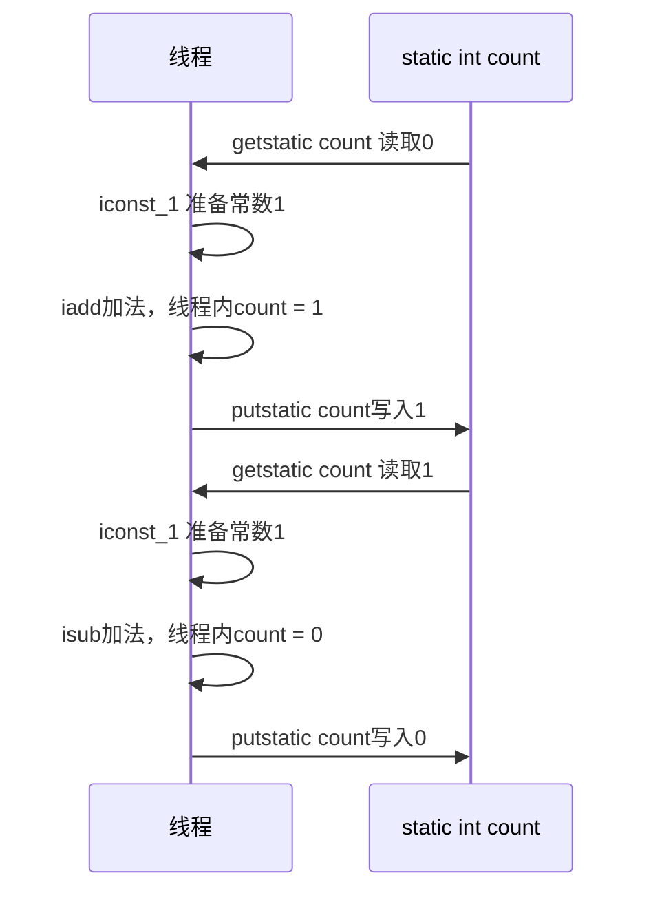

但在多线程的情况下：

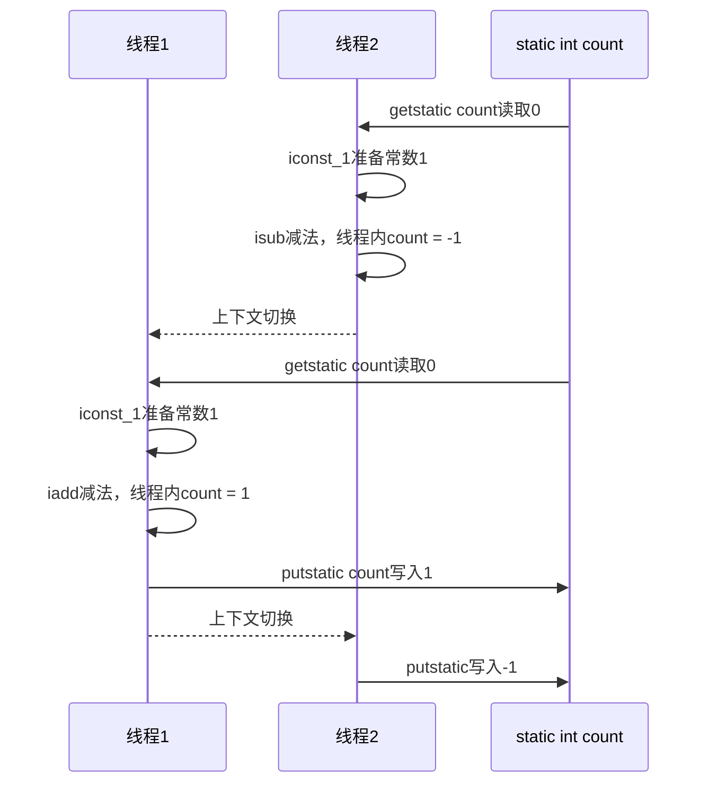

这种情况下就会产生负数，如果是线程1后执行写入操作，那么结果就会出现正数


**临界区**

+ 一段代码块内如果存在对共享资源的多线程读写操作，那么这段代码块就称为临界区

  ```java
  static int count = 0;
  
  static void increment()
  //这段代码块就是临界区
  {
      count++;
  }
  ```

**竞态条件**

多个线程在临界区内执行，由于代码块的执行序列不同而导致结果无法预测，就称为发生了竞态条件

### 2.2 synchronized

为了避免临界区的竞态条件的发生，有多种方式，synchronized就是其中的一中

synchronized是阻塞式的，它采用互斥的方式让同一时刻至多只有一个线程能持有对象锁，当其他线程再想获取这个对象锁时，就会被阻塞，这样就能保证拥有锁的线程可以安全执行临界区中的代码，不用担心上下文切换

synchronized后的锁对象可以是Java中的任何引用类型的变量，但需要确保唯一性

```java
private static int count = 0;

//线程1对count变量做5000次++运算
Thread t1 = new Thread(() -> {
    for (int i = 0; i < 5000; i++) {
        synchronized (ThreadTest5.class){
            count++;
        }
    }
}, "t1");

//线程2对count变量做5000次--运算
Thread t2 = new Thread(() -> {
    for (int i = 0; i < 5000; i++) {
        synchronized (ThreadTest5.class){
            count--;
        }
    }
}, "t2");

t1.start();
t2.start();
try {
    t1.join();
    t2.join();
} catch (InterruptedException e) {
    e.printStackTrace();
}

log.debug("count = {}", count);
//不管执行多少次，结果都是0
输出结果：
21:32:49.740 [main] DEBUG com.concurrent.demo02.thread.ThreadTest5 - count = 0
```

synchronized实际上是用对象锁保证了临界区内代码的原子性，也就是说，临界区代码被锁住之后不可被打断

**面向对象synchronized改进**

在上面加锁的情况中，是将被保护的对象和操作对象的方法放在同一个类中，根据面向对象的思想，可以把被保护的对象和操作这个对象的方法单独拿出来形成一个类

```java
//如上例中的count，封装到一个类中
public class LockObject{
    private int count = 0;
    
    //自增方法
    public void increment(){
        synchronized(LockObject.class){
            count++;
        }
    }
    
    //自减方法
    public void decrement(){
        synchronized(LockObject.class){
            count--;
        }
    }
    
    /* 也可以将synchronized加在方法上，与上面的代码是等价的
    public synchronized void decrement(){
    	count--;
    }
    
    
    */
    
    public int getCount(){
        return count;
    }
}
//根据这样的改进，修改上例中的代码
LockObject lockObject = new LockObject();
//线程1对count变量做5000次++运算
Thread t1 = new Thread(() -> {
    for (int i = 0; i < 5000; i++) {
        lockObject.increment();
    }
}, "t1");

//线程2对count变量做5000次--运算
Thread t2 = new Thread(() -> {
    for (int i = 0; i < 5000; i++) {
        lockObject.decrement();
    }
}, "t2");

t1.start();
t2.start();
//主线程等待t1，t2执行完毕后获取结果
t1.join();
t2.join();
log.debug("count = {}", lockObject.getCount());

输出结果：
15:35:06.851 [main] DEBUG com.concurrent.demo02.thread.ThreadTest5 - count = 0
```


**synchronized修饰方法**

synchronized修饰方法并不是锁住方法，仍然是锁住对象，修饰方法的synchronized会有如下等价：

```java
public class Test{
    public synchronized void increment(){
    	//方法具体实现
	}
}
上面的情况等价于
public class Test{
    public void increment(){
        //实际上锁住的是this对象
        synchronized(this){
            //方法具体实现
        }
    }
}

//对于静态方法来说
public class Test{
    public synchronized static void increment(){
    	//方法具体实现
	}
}

等价于
public class Test{
    public static void increment(){
        //实际上锁住的是类对象
        synchronized(Test.class){
            //方法具体实现
        }
    }
}
```

### 2.3 变量线程安全分析

**成员变量和静态变量是否是线程安全的？**

+ 如果它们没有被共享，言外之意是，在一段时间内只有一个线程去操作它们，那么就是线程安全的
+ 如果它们被共享了，即在同一时间内，有多个线程同时访问
  + 如果多个线程对变量只进行读操作，那么就不会有线程安全问题
  + 如果有写操作（重新赋值，参加运算等），则会出现线程安全问题


**局部变量线程安全分析**

```java
public static void test(){
    int i = 10;
    i++;
}
```

像上面这段代码中，局部变量i不会出现线程安全问题，因为每个线程调用test方法时，都会有一个属于自己的栈帧，栈帧中存放的这个变量i，也就是说，这个局部变量是线程私有的

但引用类型的局部变量就不同了，下面先由一个成员变量的例子来引出：

```java
class ThreadUnsafe{
    ArrayList<Integer> list = new ArrayList<>();

    public void method1(int loop){
        for(int i = 0; i < loop; i++){
            method2();
            method3();
        }
    }

    private void method2(){
        list.add(1);
    }

    private void method3(){
        list.remove(0);
    }
}
ThreadUnsafe test = new ThreadUnsafe();

        Thread t1 = new Thread(() -> {
            test.method1(200);
        }, "t1");

        Thread t2 = new Thread(() -> {
            test.method1(200);
        }, "t2");

        t1.start();
        t2.start();
输出结果：在一定概率下会出现：
Exception in thread "t2" java.lang.IndexOutOfBoundsException: Index 0 out of bounds for length 0

```

这是由于，在创建对象实例ThreadUnsafe时，变量list在堆内分配，是被所有线程共享的


当多个线程去操作这个变量的时候，就会有线程安全问题

现在将这个变量转换为局部变量：

```java
class ThreadSafe{
    ArrayList<Integer> list = new ArrayList<>();

    public void method1(int loop){
        for(int i = 0; i < loop; i++){
            method2(list);
            method3(list);
        }
    }

    private void method2(ArrayList<Integer> list){
        list.add(1);
    }

    private void method3(ArrayList<Integer> list){
        list.remove(0);
    }
}

ThreadSafe test = new ThreadSafe();
        Thread t1 = new Thread(() -> {
            log.debug("t1 begin...");
            test.method1(200);
        }, "t1");

        Thread t2 = new Thread(() -> {
            log.debug("t2 begin...");
            test.method1(200);
        }, "t2");

        log.debug("begin...");
        t1.start();
        t2.start();

输出结果：无论执行多少次都会成功
16:59:50.724 [main] DEBUG com.concurrent.demo02.thread.ThreadTest6 - begin...
16:59:50.734 [t1] DEBUG com.concurrent.demo02.thread.ThreadTest6 - t1 begin...
16:59:50.734 [t2] DEBUG com.concurrent.demo02.thread.ThreadTest6 - t2 begin...
```

上面的例子中，将list这个变量转换为了方法的形参，所以，每个线程在调用的时候，都会拥有自己的list对象


**常用的线程安全类**

+ String
+ Integer
+ StringBuffer
+ Random
+ Vector
+ HashTable
+ java.util.concurrent包下的类

这里说的线程安全指的是，多个线程调用同一个实例的某个方法时，是线程安全的

```java
HashTable table = new HashTable();

new Thread(() -> {
    table.put("key", "value");
}, "t1").start();

new Thread(() -> {
    table.put("key", "value");
}, "t2").start();
当上面的两个线程同时执行时，是不会出现线程安全问题的，因为HashTable上的方法都加了synchronized关键字
```

但多个方法组合在一起使用时，就不一定是线程安全的了

```java
HashTable table = new HashTable();

new Thread(() -> {
    if(table.get("key") == null)
    	table.put("key", "value");
}, "t1").start();

new Thread(() -> {
    if(table.get("key") == null)
    	table.put("key", "value");
}, "t2").start();
```

这里的执行流程可能是这样的：

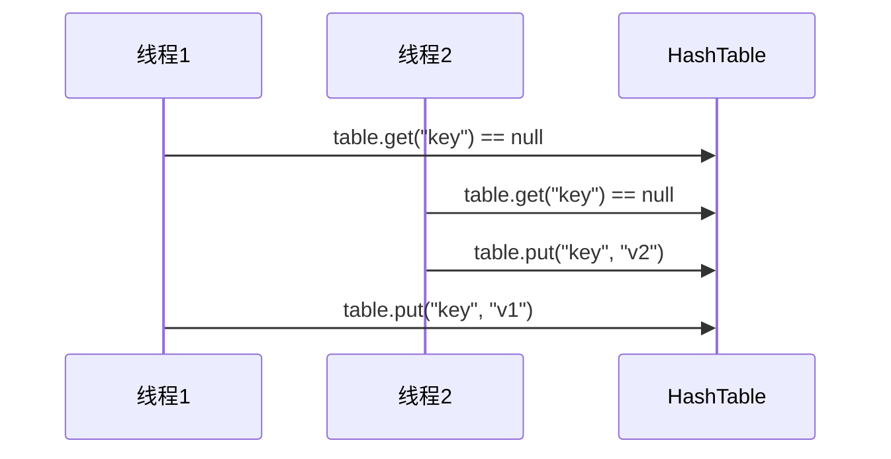

当线程1执行刚执行完table.get("key")后，还没有执行table.put("key")时发生了线程上下文切换，线程2获得了CPU使用权，开始执行table.get("key") == null的判断，由于这时线程1还没有put任何值，所以这里的判断也为true，这样线程2也能够向其中执行table.put("key")的操作，这就产生了线程安全问题


**不可变类的线程安全性**

像String、Integer类都是不可变类，因为其内部的状态都是不可变的，因此它们的方法都是线程安全的

```java
像Integer类中，它的成员变量都是使用final关键字修饰的，并且方法都是静态方法，使用的都是方法中的临时的局部变量，也就没有线程安全问题
    
String类中用于存储字符串的char[]（java9之后为byte[]）使用final修饰，并且是private的，外部不能调用；即使其中有修改字符串的方法，像replace方法，substring方法等，这些方法都是新创建了一个String类，并不是在原来的String上直接做修改
```

**线程安全性判断**

例1：

```java
//Servlet运行在Tomcat环境下，所以是单例的，也就是说堆中只有一个对象，会被所有线程共享
public class MyServlet extends HttpServlet {
 	// 是否安全？  线程不安全
 	Map<String,Object> map = new HashMap<>();
 	// 是否安全？  安全
 	String S1 = "...";
 	// 是否安全？  安全
 	final String S2 = "...";
 	// 是否安全？  不安全
    Date D1 = new Date();
 	// 是否安全？   不安全，即使是final修饰了，也仅仅代表它所引用的地址不变，Date类内部的属性还是可以被修改
 	final Date D2 = new Date();
 
 	public void doGet(HttpServletRequest request, HttpServletResponse response) {
        
    }
}
```

例2：

```java
public class MyServlet extends HttpServlet {
     // 是否安全？  线程不安全
     private UserService userService = new UserServiceImpl();

     public void doGet(HttpServletRequest request, HttpServletResponse response) {
     	userService.update(...);
     }
    }
    public class UserServiceImpl implements UserService {
         // 记录调用次数
         private int count = 0;

         public void update() {
             // ...
             count++;
 	}
}
可以这么理解：由于Servlet只有一份，那么其中的userService成员变量也只有一份，UserServiceImpl中的成员变量int count也只有一份，这些都是被线程共享的
现在多个线程去调用这个UserServiceImpl，对count进行++操作，由于count++不是原子操作，那么就会有线程安全的问题
```

例3：

```java
@Aspect
@Component
public class MyAspect {
     // 是否安全？  线程不安全
     private long start = 0L;

     @Before("execution(* *(..))")
     public void before() {
     	start = System.nanoTime();
     }

     @After("execution(* *(..))")
     public void after() {
         long end = System.nanoTime();
         System.out.println("cost time:" + (end-start));
     }
}
Spring容器中的对象默认都是单例对象，也就是在整个Spring框架中只有一份，被线程共享
并且在方法中对这个变量进行了修改，所以就会出现线程安全问题
解决方法就是用环绕通知，把这个start成员变量改为一个方法中的局部变量
```

例4：

```java
public class MyServlet extends HttpServlet {
     // 是否安全
     private UserService userService = new UserServiceImpl();

     public void doGet(HttpServletRequest request, HttpServletResponse response) {
     	userService.update(...);
     }
    }
    public class UserServiceImpl implements UserService {
     // 是否安全
     private UserDao userDao = new UserDaoImpl();

         public void update() {
         userDao.update();
         }
    }
    public class UserDaoImpl implements UserDao { 
     public void update() {
         String sql = "update user set password = ? where username = ?";
         // 是否安全
         try (Connection conn = DriverManager.getConnection("","","")){
            // ...
         } catch (Exception e) {
            // ...
         }
     }
}
这个示例和例3的区别就是多了一层调用，并且最后一层调用的UserDao中没有成员变量，所以，当多个线程同时进行操作时，没有共享资源，那么就是线程安全的
这种层层调用其实可以看做多个线程共同操作最后一层调用的类，也就是分析调用的最后一层是否有共享资源
```

例5：

```java
public class MyServlet extends HttpServlet {
     // 是否安全
     private UserService userService = new UserServiceImpl();

     public void doGet(HttpServletRequest request, HttpServletResponse response) {
     	userService.update(...);
     }
    }
    public class UserServiceImpl implements UserService {
     // 是否安全
     private UserDao userDao = new UserDaoImpl();

     public void update() {
     	userDao.update();
     }
}
    public class UserDaoImpl implements UserDao {
     // 是否安全
     private Connection conn = null;
     public void update() throws SQLException {
         String sql = "update user set password = ? where username = ?";
         conn = DriverManager.getConnection("","","");
         // ...
         conn.close();
     }
}
这个例子与例4有区别，因为最后一层调用的类UserDao中有一个成员变量Connection，那么这个成员变量会被多个线程共享，也就是一个共享资源，所以是线程不安全的
典型的例子就是一个线程刚刚创建了一个conn，堆中的对象被刷新成线程一创建的这个Connection对象，然后发生了上下文切换，另一个线程在之前的时间片中完成了对数据库的操作，执行了conn.close()操作，由于堆中的对象已经是之前的线程刚创建的对象了，当前线程的一通操作把之前线程刚创建的连接给关了，之后的调用就会有问题
```

例6：

```java
public abstract class Test {
 
     public void bar() {
             // 是否安全  不安全
             SimpleDateFormat sdf = new SimpleDateFormat("yyyy-MM-dd HH:mm:ss");
             foo(sdf);
         }
     public abstract foo(SimpleDateFormat sdf);
     public static void main(String[] args) {
         new Test().bar();
     }
}

虽然sdf是方法内的局部变量，但是这个变量被传递给了另一个方法，也就是发生了逃逸，可以看到foo方法是一个抽象方法，怎么实现由其子类决定，现在如果一个子类对foo的实现是：
public void foo(SimpleDateFormat sdf) {
         String dateStr = "1999-10-11 00:00:00";
         for (int i = 0; i < 20; i++) {
             new Thread(() -> {
             try {
             	sdf.parse(dateStr);
             } catch (ParseException e) {
             	e.printStackTrace();
             }
         }).start();
     }
}
也就是子类中创建了其他的线程对sdf进行了修改，那么子类创建的线程与调用父类bar方法的主线程就是同时访问父类bar方法中创建的sdf这个变量，就会发生线程安全问题
```

### 2.4 线程经典问题之卖票问题

不考虑线程安全时：

```java
TicketWindow ticketWindow = new TicketWindow(2000);
        List<Thread> threadList = new ArrayList<>();

        List<Integer> sellCount = new Vector<>();
        //创建多个线程模拟多人抢票
        for (int i = 0; i < 200; i++) {
            Thread thread = new Thread(() -> {

                try {
                    Thread.sleep(randomCount() * 10L);
                } catch (InterruptedException e) {
                    e.printStackTrace();
                }

                //模拟一个人买票，随机生成这个人想买的票数
                int sell = ticketWindow.sell(randomCount());
                //由于在线程内，需要保证add操作的线程安全，使用Vector
                sellCount.add(sell);
            });

            //因为线程还未启动，所以可以使用ArrayList
            threadList.add(thread);

            thread.start();
        }

        //主线程需要等待上述线程执行完毕
        threadList.forEach((t) -> {
            try {
                t.join();
            } catch (InterruptedException e) {
                e.printStackTrace();
            }
        });

        int sum = sellCount.stream().mapToInt(c -> c).sum();
        //如果是线程安全的，那么被购买的票数与剩余的票数之和应为初始化时的票数
        log.debug("sell count: {}", sum);

        log.debug("remainder count: {}", ticketWindow.getCount());


//卖票窗口
class TicketWindow{
    //总票数
    private int count;


    public TicketWindow(int count) {
        this.count = count;
    }

    //获取余票
    public int getCount() {
        return count;
    }

    //返回每个人买的票数，由于对共享资源count没有加锁操作，导致会出现线程安全问题
    public int sell(int amount) {
        if (this.count >= amount) {
            this.count -= amount;
            return amount;
        } else {
            return 0;
        }
    }

}

输出结果：可以看出余票 + 购票数 > 2000也就是卖票出现了问题
20:24:13.994 [main] DEBUG com.concurrent.demo02.thread.ThreadTest7 - sell count: 594
20:24:13.997 [main] DEBUG com.concurrent.demo02.thread.ThreadTest7 - remainder count: 1427
```

分析一下：首先找出程序中的共享变量，在当前程序中，那就是主线程中的ticketWindow变量，之后多个线程会调用这个对象的sell方法，所以需要对这个变量进行保护

再分析一下对象中的sell方法，它对自己对象中的count变量有读写操作，由于ticketWindow在整个程序中只有一份，所以对count的读写操作会引发线程安全问题

经过上述的分析可以得到解决方案：对sell方法中操作count变量的代码加锁保护，或者直接将sell方法修饰为synchronized的

```java
//返回每个人买的票数
public int sell(int amount) {
    synchronized (this) {
        if (this.count >= amount) {
            this.count -= amount;
            return amount;
        } else {
            return 0;
        }
    }
}

//或者
//返回每个人买的票数
    public synchronized int sell(int amount) {
        if (this.count >= amount) {
            this.count -= amount;
            return amount;
        } else {
            return 0;
        }
    }
```

### 2.5 Monitor

**Java对象头**

如果是32bit的虚拟机：

```
普通对象
|--------------------------------------------------------------|
| 				Object Header (64 bits)                        |
|------------------------------------|-------------------------|
|     Mark Word (32 bits)            |    Klass Word (32 bits) |
|------------------------------------|-------------------------|
```

```
数组对象
|---------------------------------------------------------------------------------|
| 				Object Header (96 bits)                                           |
|--------------------------------|-----------------------|------------------------|
|     Mark Word(32bits)          |   Klass Word(32bits)  |   array length(32bits) |
|--------------------------------|-----------------------|------------------------|
```

```
                                MarkWord
|-------------------------------------------------------|--------------------|
| Mark Word (32 bits)                                   |    State           |
|-------------------------------------------------------|--------------------|
| hashcode:25 | age:4 | biased_lock:0         | 01      |    Normal          |
|-------------------------------------------------------|--------------------|
| thread:23 | epoch:2 | age:4 | biased_lock:1 | 01      |    Biased          |
|-------------------------------------------------------|--------------------|
| ptr_to_lock_record:30                       | 00      | Lightweight Locked |
|-------------------------------------------------------|--------------------|
| ptr_to_heavyweight_monitor:30               | 10      | Heavyweight Locked |
|-------------------------------------------------------|--------------------|
|                                             | 11      | Marked for GC      |
|-------------------------------------------------------|--------------------|
```

#### 2.5.1 Monitor原理

Monitor 被翻译为**监视器或管程** 每个 Java 对象都可以关联一个 Monitor 对象，如果使用 synchronized 给对象上锁（重量级）之后，该对象头的 Mark Word 中的ptr_to_heavyweight_monitor指针就会指向一个Monitor对象


+ 当没有线程执行到同步代码块时，Monitor中Owner属性值为空
+ 现在，当Thread-2执行到这个同步代码块时，会先判断这个Monitor对象的Owner是否有值，如果没有，就会将Monitor的持有者设置为Thread-2，**Monitor只能有一个owner**
+ 当Thread-2持有锁之后，紧接着Thread-1，Thread-3也执行到了同步代码块，这时判断Monitor中的Owner时，发现其中已经有值了，就会将线程的状态置为BLOCKED并且放入EntryList中，相当于一个阻塞队列
+ 当Thread-2执行完同步代码块中的内容，释放锁后，唤醒在EntryList中的所有线程，让出Owner的位置，等待线程竞争（这个竞争是非公平竞争，即线程的阻塞有先后顺序，但并不是先阻塞的线程先获得锁，而是同其他阻塞的线程一同竞争锁的占有权）

> synchronized 必须是进入同一个对象的 monitor 才有上述的效果 ,否则不同的对象关联的就是不同的Monitor，每个Monitor就可以有一个Owner，这个synchronized就不起效果了
>
> 不加 synchronized 的对象不会关联监视器，不遵从以上规则


#### 2.5.2 synchronized原理

从字节码的角度看：

```java
public class SynchronizedTest {
    private static final Object lock = new Object();

    private static int count = 0;

    public static void main(String[] args) {
        synchronized (lock){
            count++;
        }
    }
}
将上面的代码编译后查看字节码文件，通过javap命令解释后：
  public static void main(java.lang.String[]);
    descriptor: ([Ljava/lang/String;)V
    flags: (0x0009) ACC_PUBLIC, ACC_STATIC
    Code:
      stack=2, locals=3, args_size=1
         0: getstatic     #2  //获取lock，synchronized开始的地方           
         3: dup
         4: astore_1        //将lock变量存放在线程的局部变量表中
         5: monitorenter   //将lock对象的MarkWord置为Monitor指针
         6: getstatic     #3    //获取count变量             
         9: iconst_1
        10: iadd               //进行+1操作
        11: putstatic     #3   //将操作结果返回给count变量            
        14: aload_1          //从局部变量表中取出lock对象
        15: monitorexit     //将lock对象的MarkWord重置，并唤醒Monitor中的阻塞线程
        16: goto          24  //结束
//上面部分是程序正常执行的情况
============================================ 
//下面部分是当同步代码块中的程序出现异常时执行       
        19: astore_2     //存放异常类对象e
        20: aload_1    //取出lock对象
        21: monitorexit   //释放锁
        22: aload_2
        23: athrow      //抛出异常信息
        24: return
      Exception table:
         from    to  target type
             6    16    19   any
            19    22    19   any
其实从字节码中也能够看出来，当同步代码块中的程序出现异常时，synchronized会释放锁，并不会因为程序中断而保持锁，这样也一定程度上避免了死锁问题 
```


**轻量级锁**

轻量级锁的应用场景：如果一个锁对象有多个线程要去加锁，但是加锁的时间是错开的，即线程之间没有竞争，那么可以使用轻量级锁代替重量级锁

轻量级锁的语法仍然是synchronized

轻量级锁的加锁，解锁过程

```java
static final Object lock = new Object();
public static void method1(){
    //同步块1
    synchronized(lock){
        method2();
        ...
    }
}

public static void method2(){
    //同步块2
    synchronized(lock){
        ...
    }
}
```

轻量级锁加锁过程：

+ 当线程t1执行到同步块1时，会在自己的栈中创建一个锁记录（Lock Record）对象，锁记录对象由两部分组成：1、锁对象的MarkWord；2、锁对象的引用地址

  

+ 让锁记录对象中的Object Reference去指向锁对象，并且尝试使用锁记录对象中的存储MarkWord的部分去替换锁对象的MarkWord，将锁对象的MarkWord值存入锁记录中（注意锁记录对象中存储MarkWord部分最后的状态值，为00，表示轻量级锁状态）

  

+ 如果替换成功，对象中的MarkWord的锁记录状态就会被置为00，并且锁记录地址会指向线程t1，表示线程t1给对象加锁了

  

+ 当然替换还有失败的情况：

  + 如果线程在替换之前，发现锁对象的MarkWord的锁状态已经被置为00，并且锁记录地址并没有指向当前线程，就说明其他线程已经获取了锁对象并上了轻量级锁，这时锁竞争出现，需要进入锁膨胀的过程

  + 如果线程发现锁对象的MarkWord的锁状态已经被置为00，并且锁记录对象指向了自己，也就是说之前自己已经获取了这个锁，就如刚开始的代码所示，需要获取两次锁对象，那么就再添加一次记录即可

    

轻量级锁解锁过程：

+ 当退出synchronized代码块时，如果锁记录对象记录MarkWord的部分值为null，就说明有锁的重入，这时重置锁记录，表示重入数 -1
+ 如果锁记录对象记录MarkWord的部分值不为null，这时就将这部分内容尝试与锁对象的MarkWord进行替换
  + 如果替换成功，则解锁成功
  + 如果替换失败，则说明在操作同步代码块的过程中发生了锁膨胀，进入重量级锁的解锁过程

**锁膨胀过程**

上面提到过，如果线程t1在执行代码块的时候，有其他线程来尝试获取锁对象，发现锁对象已经是上了轻量级锁的状态，那么就会发生锁膨胀

+ 现在又有一个线程t2，在线程正在执行同步代码块时尝试获取锁对象

  

+ 线程t2获取轻量级锁失败，进入锁膨胀的流程

  + 锁对象Object申请Monitor重量级锁，重置Object的MarkWord，将锁记录地址指向Monitor的地址

  + 然后，线程2进入Monitor的EntryList的阻塞队列中

    

+ 当线程t1退出同步代码块，尝试恢复Object中的MarkWord时，发现恢复失败，这时就会进入重量级锁的解锁流程，即按照 Monitor 地址找到 Monitor 对象，设置 Owner 为 null，唤醒 EntryList 中 BLOCKED 线程


**偏向锁**

轻量级锁在没有竞争时（就自己这个线程），每次重入仍然需要执行 CAS 操作。 Java 6 中引入了**偏向锁**来做进一步优化：只有第一次使用 CAS 将线程 ID 设置到对象的 Mark Word 头，之后发现 这个线程 ID 是自己的就表示没有竞争，不用重新 CAS。以后只要不发生竞争，这个对象就归该线程所有

比如：

```java
static final Object obj = new Object();
public static void m1() {
     synchronized( obj ) {
         // 同步块 A
         m2();
     }
}
public static void m2() {
     synchronized( obj ) {
         // 同步块 B
         m3();
     }
}
public static void m3(){
    synchronized(obj){
        //同步块 C
    }
}
```

偏向锁过程：


一个对象创建时：

+ 如果开启了偏向锁（默认开启），那么对象创建后，markword 值为 0x05 即最后 3 位为 101，这时它的 thread、epoch、age 都为 0 
+ 偏向锁是默认是延迟的，不会在程序启动时立即生效，如果想避免延迟，可以加 VM 参数 - XX:BiasedLockingStartupDelay=0 来禁用延迟 
+ 如果没有开启偏向锁，那么对象创建后，markword 值为 0x01 即最后 3 位为 001，这时它的 hashcode、 age 都为 0，第一次用到 hashcode 时才会赋值

可以使用openjdk提供的jol第三方工具包来查看对象头信息：

```java
public class ThreadTest8 {
    public static void main(String[] args) {
        Dog dog = new Dog();

        String s = ClassLayout.parseInstance(dog).toPrintable();
        log.debug(s);

        synchronized (dog){
            log.debug(ClassLayout.parseInstance(dog).toPrintable());
        }
        log.debug(ClassLayout.parseInstance(dog).toPrintable());
    }
}
class Dog{

}
输出结果：
21:44:45.730 [main] DEBUG com.concurrent.demo02.thread.ThreadTest8 - com.concurrent.demo02.thread.Dog object internals:
OFF  SZ   TYPE DESCRIPTION               VALUE
  0   8        (object header: mark)     0x0000000000000005 (biasable; age: 0)

可以观察以下输出结果，最后一位为0x5 --> 0101，101表示开启了偏向锁状态
21:44:45.740 [main] DEBUG com.concurrent.demo02.thread.ThreadTest8 - com.concurrent.demo02.thread.Dog object internals:
OFF  SZ   TYPE DESCRIPTION               VALUE
  0   8        (object header: mark)     0x000001a125ef0805 (biased: 0x0000000068497bc2; epoch: 0; age: 0)

21:44:45.740 [main] DEBUG com.concurrent.demo02.thread.ThreadTest8 - com.concurrent.demo02.thread.Dog object internals:
OFF  SZ   TYPE DESCRIPTION               VALUE
  0   8        (object header: mark)     0x000001a125ef0805 (biased: 0x0000000068497bc2; epoch: 0; age: 0)
```

这里需要注意一个细节：

如果调用了对象的hashCode方法，会使得程序禁用锁对象的偏向锁状态

```java
Dog dog = new Dog();

dog.hashCode();   //调用对象的hashCode方法会禁用偏向锁

String s = ClassLayout.parseInstance(dog).toPrintable();
log.debug(s);

synchronized (dog){
    log.debug(ClassLayout.parseInstance(dog).toPrintable());
}
log.debug(ClassLayout.parseInstance(dog).toPrintable());

输出结果：可以观察最后一位0x1 --> 0001已经是禁用偏向锁的正常状态，如果启用的话应为0101
21:48:52.971 [main] DEBUG com.concurrent.demo02.thread.ThreadTest8 - com.concurrent.demo02.thread.Dog object internals:
OFF  SZ   TYPE DESCRIPTION               VALUE
  0   8        (object header: mark)     0x0000001b68ddbd01 (hash: 0x1b68ddbd; age: 0)
   
当上锁时，可以发现上的是轻量级锁：0x8 --> 1000
21:48:52.971 [main] DEBUG com.concurrent.demo02.thread.ThreadTest8 - com.concurrent.demo02.thread.Dog object internals:
OFF  SZ   TYPE DESCRIPTION               VALUE
  0   8        (object header: mark)     0x000000c9840ff178 (thin lock: 0x000000c9840ff178)
    
21:48:52.971 [main] DEBUG com.concurrent.demo02.thread.ThreadTest8 - com.concurrent.demo02.thread.Dog object internals:
OFF  SZ   TYPE DESCRIPTION               VALUE
  0   8        (object header: mark)     0x0000001b68ddbd01 (hash: 0x1b68ddbd; age: 0)
```

还有一些其他状况也可能导致偏向锁状态的撤销：

+ 当有其他线程使用偏向锁对象时，会将偏向锁升级为轻量级锁（线程交替访问，也就是说当线程1没有使用同步代码块时，线程2尝试获取锁对象，并且之后访问同步代码块的时机错开）
+ 调用wait/notify方法也会撤销偏向锁的状态


**批量重偏向**

如果对象虽然被多个线程访问，但没有竞争，这时偏向了线程 T1 的对象仍有机会重新偏向 T2，重偏向会重置对象 的 Thread ID 

当撤销偏向锁阈值超过 20 次后，jvm 会这样觉得，我是不是偏向错了呢，于是会在给这些对象加锁时重新偏向至 加锁线程

```java
private static void test3() throws InterruptedException {
     Vector<Dog> list = new Vector<>();
     Thread t1 = new Thread(() -> {
         for (int i = 0; i < 30; i++) {
             Dog d = new Dog();
             list.add(d);
             synchronized (d) {
             	log.debug(i + "\t" + ClassLayout.parseInstance(d).toPrintableSimple(true));
             }
         }
         synchronized (list) {
         	list.notify();
         } 
     }, "t1");
     t1.start();

     Thread t2 = new Thread(() -> {
         synchronized (list) {
             try {
                list.wait();
             } catch (InterruptedException e) {
                e.printStackTrace();
             }
         }
         log.debug("===============> ");
         for (int i = 0; i < 30; i++) {
             Dog d = list.get(i);
             log.debug(i + "\t" + ClassLayout.parseInstance(d).toPrintableSimple(true));
             synchronized (d) {
             	log.debug(i + "\t" + ClassLayout.parseInstance(d).toPrintableSimple(true));
             }
             log.debug(i + "\t" + ClassLayout.parseInstance(d).toPrintableSimple(true));
         }
     }, "t2");
     t2.start();
}
输出结果：
可以看到当线程t1对对象上锁时，都是偏向锁
[t1] - 0 00000000 00000000 00000000 00000000 00011111 11110011 11100000 00000101 
[t1] - 1 00000000 00000000 00000000 00000000 00011111 11110011 11100000 00000101 
[t1] - 2 00000000 00000000 00000000 00000000 00011111 11110011 11100000 00000101 
[t1] - 3 00000000 00000000 00000000 00000000 00011111 11110011 11100000 00000101 
[t1] - 4 00000000 00000000 00000000 00000000 00011111 11110011 11100000 00000101 
[t1] - 5 00000000 00000000 00000000 00000000 00011111 11110011 11100000 00000101 
[t1] - 6 00000000 00000000 00000000 00000000 00011111 11110011 11100000 00000101 
[t1] - 7 00000000 00000000 00000000 00000000 00011111 11110011 11100000 00000101 
[t1] - 8 00000000 00000000 00000000 00000000 00011111 11110011 11100000 00000101 
[t1] - 9 00000000 00000000 00000000 00000000 00011111 11110011 11100000 00000101 
[t1] - 10 00000000 00000000 00000000 00000000 00011111 11110011 11100000 00000101 
[t1] - 11 00000000 00000000 00000000 00000000 00011111 11110011 11100000 00000101 
[t1] - 12 00000000 00000000 00000000 00000000 00011111 11110011 11100000 00000101 
[t1] - 13 00000000 00000000 00000000 00000000 00011111 11110011 11100000 00000101 
[t1] - 14 00000000 00000000 00000000 00000000 00011111 11110011 11100000 00000101 
[t1] - 15 00000000 00000000 00000000 00000000 00011111 11110011 11100000 00000101 
[t1] - 16 00000000 00000000 00000000 00000000 00011111 11110011 11100000 00000101 
[t1] - 17 00000000 00000000 00000000 00000000 00011111 11110011 11100000 00000101 
[t1] - 18 00000000 00000000 00000000 00000000 00011111 11110011 11100000 00000101 
[t1] - 19 00000000 00000000 00000000 00000000 00011111 11110011 11100000 00000101 
[t1] - 20 00000000 00000000 00000000 00000000 00011111 11110011 11100000 00000101 
[t1] - 21 00000000 00000000 00000000 00000000 00011111 11110011 11100000 00000101 
[t1] - 22 00000000 00000000 00000000 00000000 00011111 11110011 11100000 00000101 
[t1] - 23 00000000 00000000 00000000 00000000 00011111 11110011 11100000 00000101 
[t1] - 24 00000000 00000000 00000000 00000000 00011111 11110011 11100000 00000101 
[t1] - 25 00000000 00000000 00000000 00000000 00011111 11110011 11100000 00000101 
[t1] - 26 00000000 00000000 00000000 00000000 00011111 11110011 11100000 00000101 
[t1] - 27 00000000 00000000 00000000 00000000 00011111 11110011 11100000 00000101 
[t1] - 28 00000000 00000000 00000000 00000000 00011111 11110011 11100000 00000101 
[t1] - 29 00000000 00000000 00000000 00000000 00011111 11110011 11100000 00000101 
[t2] - ===============> 
刚开始t2线程上锁时，会撤销锁对象的偏向状态
[t2] - 0 00000000 00000000 00000000 00000000 00011111 11110011 11100000 00000101 
[t2] - 0 00000000 00000000 00000000 00000000 00100000 01011000 11110111 00000000 
[t2] - 0 00000000 00000000 00000000 00000000 00000000 00000000 00000000 00000001 
[t2] - 1 00000000 00000000 00000000 00000000 00011111 11110011 11100000 00000101 
[t2] - 1 00000000 00000000 00000000 00000000 00100000 01011000 11110111 00000000 
[t2] - 1 00000000 00000000 00000000 00000000 00000000 00000000 00000000 00000001 
[t2] - 2 00000000 00000000 00000000 00000000 00011111 11110011 11100000 00000101 
[t2] - 2 00000000 00000000 00000000 00000000 00100000 01011000 11110111 00000000 
[t2] - 2 00000000 00000000 00000000 00000000 00000000 00000000 00000000 00000001 
[t2] - 3 00000000 00000000 00000000 00000000 00011111 11110011 11100000 00000101 
[t2] - 3 00000000 00000000 00000000 00000000 00100000 01011000 11110111 00000000 
[t2] - 3 00000000 00000000 00000000 00000000 00000000 00000000 00000000 00000001 
[t2] - 4 00000000 00000000 00000000 00000000 00011111 11110011 11100000 00000101 
[t2] - 4 00000000 00000000 00000000 00000000 00100000 01011000 11110111 00000000 
[t2] - 4 00000000 00000000 00000000 00000000 00000000 00000000 00000000 00000001 
[t2] - 5 00000000 00000000 00000000 00000000 00011111 11110011 11100000 00000101 
[t2] - 5 00000000 00000000 00000000 00000000 00100000 01011000 11110111 00000000 
[t2] - 5 00000000 00000000 00000000 00000000 00000000 00000000 00000000 00000001 
[t2] - 6 00000000 00000000 00000000 00000000 00011111 11110011 11100000 00000101 
[t2] - 6 00000000 00000000 00000000 00000000 00100000 01011000 11110111 00000000 
[t2] - 6 00000000 00000000 00000000 00000000 00000000 00000000 00000000 00000001 
[t2] - 7 00000000 00000000 00000000 00000000 00011111 11110011 11100000 00000101 
[t2] - 7 00000000 00000000 00000000 00000000 00100000 01011000 11110111 00000000 
[t2] - 7 00000000 00000000 00000000 00000000 00000000 00000000 00000000 00000001 
[t2] - 8 00000000 00000000 00000000 00000000 00011111 11110011 11100000 00000101 
[t2] - 8 00000000 00000000 00000000 00000000 00100000 01011000 11110111 00000000 
[t2] - 8 00000000 00000000 00000000 00000000 00000000 00000000 00000000 00000001 
[t2] - 9 00000000 00000000 00000000 00000000 00011111 11110011 11100000 00000101 
[t2] - 9 00000000 00000000 00000000 00000000 00100000 01011000 11110111 00000000 
[t2] - 9 00000000 00000000 00000000 00000000 00000000 00000000 00000000 00000001 
[t2] - 10 00000000 00000000 00000000 00000000 00011111 11110011 11100000 00000101 
[t2] - 10 00000000 00000000 00000000 00000000 00100000 01011000 11110111 00000000 
[t2] - 10 00000000 00000000 00000000 00000000 00000000 00000000 00000000 00000001 
[t2] - 11 00000000 00000000 00000000 00000000 00011111 11110011 11100000 00000101 
[t2] - 11 00000000 00000000 00000000 00000000 00100000 01011000 11110111 00000000 
[t2] - 11 00000000 00000000 00000000 00000000 00000000 00000000 00000000 00000001 
[t2] - 12 00000000 00000000 00000000 00000000 00011111 11110011 11100000 00000101 
[t2] - 12 00000000 00000000 00000000 00000000 00100000 01011000 11110111 00000000 
[t2] - 12 00000000 00000000 00000000 00000000 00000000 00000000 00000000 00000001 
[t2] - 13 00000000 00000000 00000000 00000000 00011111 11110011 11100000 00000101 
[t2] - 13 00000000 00000000 00000000 00000000 00100000 01011000 11110111 00000000 
[t2] - 13 00000000 00000000 00000000 00000000 00000000 00000000 00000000 00000001 
[t2] - 14 00000000 00000000 00000000 00000000 00011111 11110011 11100000 00000101 
[t2] - 14 00000000 00000000 00000000 00000000 00100000 01011000 11110111 00000000 
[t2] - 14 00000000 00000000 00000000 00000000 00000000 00000000 00000000 00000001 
[t2] - 15 00000000 00000000 00000000 00000000 00011111 11110011 11100000 00000101 
[t2] - 15 00000000 00000000 00000000 00000000 00100000 01011000 11110111 00000000 
[t2] - 15 00000000 00000000 00000000 00000000 00000000 00000000 00000000 00000001 
[t2] - 16 00000000 00000000 00000000 00000000 00011111 11110011 11100000 00000101 
[t2] - 16 00000000 00000000 00000000 00000000 00100000 01011000 11110111 00000000 
[t2] - 16 00000000 00000000 00000000 00000000 00000000 00000000 00000000 00000001 
[t2] - 17 00000000 00000000 00000000 00000000 00011111 11110011 11100000 00000101 
[t2] - 17 00000000 00000000 00000000 00000000 00100000 01011000 11110111 00000000 
[t2] - 17 00000000 00000000 00000000 00000000 00000000 00000000 00000000 00000001 
[t2] - 18 00000000 00000000 00000000 00000000 00011111 11110011 11100000 00000101 
[t2] - 18 00000000 00000000 00000000 00000000 00100000 01011000 11110111 00000000 
[t2] - 18 00000000 00000000 00000000 00000000 00000000 00000000 00000000 00000001 
当到达阈值之后（20），jvm会进行重偏向，也就是说不撤销锁对象的偏向状态，只是将锁对象的偏向Thread Id置为t2的线程Id
[t2] - 19 00000000 00000000 00000000 00000000 00011111 11110011 11100000 00000101 
[t2] - 19 00000000 00000000 00000000 00000000 00011111 11110011 11110001 00000101 
[t2] - 19 00000000 00000000 00000000 00000000 00011111 11110011 11110001 00000101 
[t2] - 20 00000000 00000000 00000000 00000000 00011111 11110011 11100000 00000101 
[t2] - 20 00000000 00000000 00000000 00000000 00011111 11110011 11110001 00000101 
[t2] - 20 00000000 00000000 00000000 00000000 00011111 11110011 11110001 00000101 
[t2] - 21 00000000 00000000 00000000 00000000 00011111 11110011 11100000 00000101 
[t2] - 21 00000000 00000000 00000000 00000000 00011111 11110011 11110001 00000101 
[t2] - 21 00000000 00000000 00000000 00000000 00011111 11110011 11110001 00000101 
[t2] - 22 00000000 00000000 00000000 00000000 00011111 11110011 11100000 00000101 
[t2] - 22 00000000 00000000 00000000 00000000 00011111 11110011 11110001 00000101 
[t2] - 22 00000000 00000000 00000000 00000000 00011111 11110011 11110001 00000101 
[t2] - 23 00000000 00000000 00000000 00000000 00011111 11110011 11100000 00000101 
[t2] - 23 00000000 00000000 00000000 00000000 00011111 11110011 11110001 00000101 
[t2] - 23 00000000 00000000 00000000 00000000 00011111 11110011 11110001 00000101 
[t2] - 24 00000000 00000000 00000000 00000000 00011111 11110011 11100000 00000101 
[t2] - 24 00000000 00000000 00000000 00000000 00011111 11110011 11110001 00000101 
[t2] - 24 00000000 00000000 00000000 00000000 00011111 11110011 11110001 00000101 
[t2] - 25 00000000 00000000 00000000 00000000 00011111 11110011 11100000 00000101 
[t2] - 25 00000000 00000000 00000000 00000000 00011111 11110011 11110001 00000101 
[t2] - 25 00000000 00000000 00000000 00000000 00011111 11110011 11110001 00000101 
[t2] - 26 00000000 00000000 00000000 00000000 00011111 11110011 11100000 00000101 
[t2] - 26 00000000 00000000 00000000 00000000 00011111 11110011 11110001 00000101 
[t2] - 26 00000000 00000000 00000000 00000000 00011111 11110011 11110001 00000101 
[t2] - 27 00000000 00000000 00000000 00000000 00011111 11110011 11100000 00000101 
[t2] - 27 00000000 00000000 00000000 00000000 00011111 11110011 11110001 00000101 
[t2] - 27 00000000 00000000 00000000 00000000 00011111 11110011 11110001 00000101 
[t2] - 28 00000000 00000000 00000000 00000000 00011111 11110011 11100000 00000101 
[t2] - 28 00000000 00000000 00000000 00000000 00011111 11110011 11110001 00000101 
[t2] - 28 00000000 00000000 00000000 00000000 00011111 11110011 11110001 00000101 
[t2] - 29 00000000 00000000 00000000 00000000 00011111 11110011 11100000 00000101 
[t2] - 29 00000000 00000000 00000000 00000000 00011111 11110011 11110001 00000101 
[t2] - 29 00000000 00000000 00000000 00000000 00011111 11110011 11110001 00000101 
```

**锁消除**

锁消除是指虚拟机JIT在运行时，对一些代码要求同步，但是对被检测到不可能存在共享数据竞争的锁进行消除

锁消除的主要判定依据来源于逃逸分析的数据支持，如果判断到一段代码中，在堆上的所有数据都不会逃逸出去被其他线程访问到，那就可以把它们当作栈上数据对待，认为它们是线程私有的

```java
static int x = 0;
public void b(){
    //obj是一个局部变量，是线程私有的，不会被其他线程共享，所以这边的锁会在运行时被消除
    Object obj = new Object();
    synchronized (obj){
        x++;
    }
}
```


### 2.6 wait / notify

#### 2.6.1 wait / notify原理

wait/notify是重量级锁的特性

+ 当持有锁的线程发现当前条件不足以执行完同步代码块中的代码时，可以调用锁对象的wait方法进入等待状态（WAITITNG），当前线程进入Monitor的WaitSet等待
+ 处于WaitSet和EntryList中的线程都处于阻塞状态，不占用CPU时间片
+ 处于WaitSet中的线程会在Owner线程调用notify方法或者notifyAll方法时被唤醒，并且也不是立即就获得锁，而是需要重新竞争


#### 2.6.2 API介绍

+ `obj.wait`：让进入object监视器的线程到waitSet等待
+ `obj.notify`：在 object 上正在 waitSet 等待的线程中挑一个唤醒
+ `obj.notifyAll`：让 object 上正在 waitSet 等待的线程全部唤醒

这些方法都必须获得锁对象之后才能执行，即在同步代码块中才能执行

```java
Thread t1 = new Thread(() -> {
            synchronized (lock){
                log.debug("thread t1 running...");

                try {
                    lock.wait();
                } catch (InterruptedException e) {
                    e.printStackTrace();
                }
                log.debug("thread t1 continue to running...");
            }
        }, "t1");

        Thread t2 = new Thread(() -> {
            log.debug("thread t2 running...");

            synchronized (lock) {
                try {
                    lock.wait();
                } catch (InterruptedException e) {
                    e.printStackTrace();
                }
            }
            log.debug("thread t2 continue to running...");
        }, "t2");

        t1.start();
        t2.start();
        TimeUtil.sleep(2);
        log.debug("wake up other threads...");

        synchronized (lock){
            //唤醒一个线程
            lock.notify();
            //唤醒多个线程
//            lock.notifyAll();
        }
当主线程调用notify时，输出结果：
20:17:30.073 [t1] DEBUG com.concurrent.demo02.thread.ThreadTest9 - thread t1 running...
20:17:30.073 [t2] DEBUG com.concurrent.demo02.thread.ThreadTest9 - thread t2 running...
20:17:32.073 [main] DEBUG com.concurrent.demo02.thread.ThreadTest9 - wake up other threads...
也有一定的概率会唤醒线程t2
20:17:32.073 [t1] DEBUG com.concurrent.demo02.thread.ThreadTest9 - thread t1 continue to running...
    
当主线程调用notifyAll时，输出结果：
20:18:12.798 [t1] DEBUG com.concurrent.demo02.thread.ThreadTest9 - thread t1 running...
20:18:12.798 [t2] DEBUG com.concurrent.demo02.thread.ThreadTest9 - thread t2 running...
20:18:14.808 [main] DEBUG com.concurrent.demo02.thread.ThreadTest9 - wake up other threads...
20:18:14.808 [t1] DEBUG com.concurrent.demo02.thread.ThreadTest9 - thread t1 continue to running...
20:18:14.808 [t2] DEBUG com.concurrent.demo02.thread.ThreadTest9 - thread t2 continue to running...
```

> wait也有带参的方法：wait(long s)，代表等待s毫秒，如果在s毫秒之后仍没有被唤醒，那么会自动唤醒继续执行之后的代码，如果在等待的s毫秒之中被唤醒，则提前结束等待状态
>
> wait()等价于wait(0)代表一直等待下去
>
> **sleep(long n)与wait(long n)的区别**
>
> + sleep是Thread类中的方法，wait是Object类中的方法
> + sleep可以在代码的任何地方使用，wait方法只能配合synchronized在同步代码块中使用
> + 调用sleep方法之后，线程并不会释放所持有的锁对象，wait方法却会令线程释放锁对象


### 2.7 保护暂停模式

保护性暂停模式，Guarded Suspension，在一个线程等待另一个线程的执行结果时使用

简单来说就是用于两个线程交换结果使用

+ 如果有一个结果需要从一个线程传递到另一个线程，让他们关联同一个GuardedObject
+ JDK中，join的实现，FutureTask的实现，采用的就是这个模式
+ 因为需要等待另一方的结果，因此归类到同步模式
+ 如果结果需要不断地从一个线程到另一个线程，那么可以使用消息队列


```java
//监控类
class GuardedObject{
    //因为等待的是任意结果，所以写成Object类
    private Object response;

    //获取结果
    public Object get(){
        synchronized (this){
            //防止虚假唤醒
            while (response == null){
                try {
                    this.wait();
                } catch (InterruptedException e) {
                    e.printStackTrace();
                }
            }
            return response;
        }
    }

    //产生结果
    public void complete(Object o){
        synchronized (this){
            this.response = o;

            //唤醒其他线程
            this.notifyAll();
        }
    }
}

//实际场景：线程t1等待线程t2的执行结果
GuardedObject guardedObject = new GuardedObject();

        Thread t1 = new Thread(() -> {
            //线程1等待结果
            log.debug("waiting...");
            List<String> o = (List<String>) guardedObject.get();
            log.debug("result: {}", o.size());
        }, "t1");

        Thread t2 = new Thread(() -> {
            log.debug("download...");
            try {
                List<String> lines = DownLoader.download();
                guardedObject.complete(lines);
            } catch (Exception e) {
                e.printStackTrace();
            }
        }, "t2");
        t1.start();
        t2.start();
        TimeUtil.sleep(2);

输出结果：
16:46:25.494 [t2] DEBUG com.concurrent.demo02.thread.ThreadTest10 - download...
16:46:25.494 [t1] DEBUG com.concurrent.demo02.thread.ThreadTest10 - waiting...
16:46:27.022 [t1] DEBUG com.concurrent.demo02.thread.ThreadTest10 - result: 3
```

**带超时的GuardedObject**

有些场合下需要在指定时间内把结果返回，如果超时，就返回失败信息

在原版的GuardedObject下做一点改动

```java
class GuardedObject{
    //因为等待的是任意结果，所以写成Object类
    private Object response;

    //获取结果，增加超时时间
    public Object get(long timeout){
        synchronized (this){
            //记录等待的开始时间
            long begin = System.currentTimeMillis();
            //记录等待经历的时间
            long passTime = 0;
            while (response == null){
                long waitTime = timeout - passTime;
                //在每次循环时判断是否超时
                if(waitTime <= 0){
                    //如果超时了，即跳出循环
                    break;
                }
                try {
                    //这里也不能干等着，需要设置一个等待时间，设置这个值的目的是为了防止虚假唤醒
                    this.wait(waitTime);
                } catch (InterruptedException e) {
                    e.printStackTrace();
                }

                //在每一次等待结束后记录等待所经历的时间
                passTime = System.currentTimeMillis() - begin;
            }
            return response;
        }
    }

    //产生结果
    public void complete(Object o){
        synchronized (this){
            this.response = o;

            //唤醒其他线程
            this.notifyAll();
        }
    }
}
```

**join()，join方法的底层就采用了保护性暂停模式**

```java
public final synchronized void join(long millis)
    throws InterruptedException {
        long base = System.currentTimeMillis();
        long now = 0;

        if (millis < 0) {
            throw new IllegalArgumentException("timeout value is negative");
        }

        if (millis == 0) {
            while (isAlive()) {
                wait(0);
            }
        } else {
            //这部分就是保护性暂停，循环等待
            while (isAlive()) {
                //记录延迟时间
                long delay = millis - now;
                if (delay <= 0) {
                    break;
                }
                wait(delay);
                now = System.currentTimeMillis() - base;
            }
        }
    }
```

**多任务版的保护暂停模式**


多任务版本的保护暂停模式就是将一组GuardedObject集成到一个类中，实现线程与GuardedObject的解耦

```java
//对超时版本的GuardedObject做一定的修改
class GuardedObjectTimeout{
    //用一个唯一id来标识GuardedObject
    private int id;

    private Object response;

    public GuardedObjectTimeout(int id) {
        this.id = id;
    }

    public int getId() {
        return id;
    }

    //获取结果，增加超时时间
    public Object get(long timeout){
        synchronized (this){
            //记录等待的开始时间
            long begin = System.currentTimeMillis();
            //记录等待经历的时间
            long passTime = 0;
            while (response == null){
                //假设 millis 是 1000，结果在 400 时被虚假唤醒了，那么还有 600 要等
                long waitTime = timeout - passTime;
                //在每次循环时判断是否超时
                if(waitTime <= 0){
                    //如果超时了，即跳出循环
                    break;
                }
                try {
                    //这里也不能干等着，需要设置一个等待时间
                    this.wait(waitTime);
                } catch (InterruptedException e) {
                    e.printStackTrace();
                }

                //在每一次等待结束后记录等待所经历的时间
                passTime = System.currentTimeMillis() - begin;
            }
            return response;
        }
    }

    //产生结果
    public void complete(Object o){
        synchronized (this){
            this.response = o;

            //唤醒其他线程
            this.notifyAll();
        }
    }
}
```

同时实现一个中间类，集成这些GuardedObject

```java
class MailBox{
    //用于存放每个GuardedObject的map，需要确保线程安全，所以使用HashTable
    private static Map<Integer, GuardedObjectTimeout> boxes = new Hashtable<>();

    //为每个放入boxes的GuardedObject产生一个唯一id
    private static int id = 0;

    //需要确保线程安全
    private synchronized static int getObjectId(){
        id++;
        return id;
    }

    //根据id获取GuardedObject
    public static GuardedObjectTimeout getGuardedObject(int id){
        //在数据量比较大的情况下，推荐使用remove(obj)方法防止内存泄露
        return boxes.get(id);
    }

    public static GuardedObjectTimeout createGuardedObject(){
        //创建一个GuardedObject并为其分配唯一id
        GuardedObjectTimeout got = new GuardedObjectTimeout(getObjectId());
        //存入boxes中
        boxes.put(got.getId(), got);

        return got;
    }

    //获取MailBoxes中的id列表
    public static Set<Integer> getIds(){
        return boxes.keySet();
    }

}
```

测试：现在模拟一个场景，一栋楼中的居民等待收信，由邮递员给居民送信

```java
class People extends Thread {

    public People(){}

    public People(String name) {
        super(name);
    }

    @Override
    public void run() {
        //在居民楼底下的信箱中创建一个属于自己的收信格
        GuardedObjectTimeout guardedObject = MailBox.createGuardedObject();
        log.debug("people: {}", guardedObject.getId());
        //假定只等待5s
        Object mail = guardedObject.get(5000);

        log.debug("people {}, receive mail: {}", guardedObject.getId(), mail);
    }
}
class Postman extends Thread {
    //信件的id和信件内容，id标明需要送给几号居民
    private int id;
    private String mail;

    public Postman(){}

    public Postman(int id, String mail, String name){
        super(name);
        this.id = id;
        this.mail = mail;
    }

    @Override
    public void run() {
        //获取居民创建的收信格
        GuardedObjectTimeout guardedObject = MailBox.getGuardedObject(id);
        log.debug("send mail id: {}, content: {}", guardedObject.getId(), mail);
        //相当于一个投递的过程
        guardedObject.complete(mail);
    }
}

for (int i = 0; i < 3; i++) {
            new People("people" + i).start();
        }
        TimeUtil.sleep(1);
        for (Integer id : MailBox.getIds()) {
            new Postman(id, "内容" + id, "postman").start();
        }

输出结果：可以看到居民都收到了属于自己的信件
19:26:47.506 [people1] DEBUG com.concurrent.demo02.thread.People - people: 2
19:26:47.506 [people0] DEBUG com.concurrent.demo02.thread.People - people: 1
19:26:47.506 [people2] DEBUG com.concurrent.demo02.thread.People - people: 3
19:26:48.519 [postman] DEBUG com.concurrent.demo02.thread.Postman - send mail id: 1, content: 内容1
19:26:48.520 [postman] DEBUG com.concurrent.demo02.thread.Postman - send mail id: 2, content: 内容2
19:26:48.520 [postman] DEBUG com.concurrent.demo02.thread.Postman - send mail id: 3, content: 内容3
19:26:48.521 [people2] DEBUG com.concurrent.demo02.thread.People - people 3, receive mail: 内容3
19:26:48.520 [people0] DEBUG com.concurrent.demo02.thread.People - people 1, receive mail: 内容1
19:26:48.521 [people1] DEBUG com.concurrent.demo02.thread.People - people 2, receive mail: 内容2
```

### 2.8 生产者 - 消费者模式

生产者 -- 消费者是一道经典的线程同步问题


问题描述：多个生产者、多个消费者通过共享含n个缓冲区（消息队列）的缓冲池Buffer协作。其中生产者负责生产数据并投入缓冲池，消费者从缓冲池中 取数据消费，生产者和消费者，每次生产/消费1个数据，要求每 个数据必须且只被消费一次。缓冲池为临界资源

+ 生产者仅负责产生数据，并不关心数据的具体处理；而消费者只关心数据的具体处理，而并不关心数据的具体来源
+ 缓冲区（消息队列）有容量限制，满时不会再向其中加入数据，空时不再消耗数据
+ JDK中各种阻塞队列就是采用这种模式

具体实现：

```java
//消息队列，封装了操作消息的方法
class MessageQueue {

    //存放消息的消息队列
    private final Deque<Message> messageQueue = new LinkedList<>();

    //消息队列的最大容量
    private int capacity;

    public MessageQueue() {
    }

    public MessageQueue(int capacity) {
        this.capacity = capacity;
    }

    //获取消息 -- 消费者对消息队列中的消息进行互斥访问
    public Message take() {
        synchronized (messageQueue){
            //使用之前的循环等待，当队列为空时，不能获取消息，等待生产者线程存入消息
            while (messageQueue.isEmpty()){
                try {
                    log.debug("queue is empty, consumer waiting...");
                    messageQueue.wait();
                } catch (InterruptedException e) {
                    e.printStackTrace();
                }
            }
            //生产者线程存入消息，并唤醒正在等待消费消息的消费者
            Message message = messageQueue.removeFirst();
            log.debug("consumer get message: {}", message.toString());
            messageQueue.notifyAll();
            return message;
        }
    }

    //存入消息 -- 生产者对消息队列中的空缓冲区进行互斥访问
    public void put(Message message){
        synchronized (messageQueue) {
            //当消息队列被占满时，生产者线程不能再向其中加入消息
            while (messageQueue.size() == capacity){
                try {
                    log.debug("queue is full, producer waiting...");
                    messageQueue.wait();
                } catch (InterruptedException e) {
                    e.printStackTrace();
                }
            }

            //生产者将消息放入消息队列
            messageQueue.addLast(message);
            log.debug("producer put message: {}", message.toString());
            //唤醒正在等待消费的消费者线程
            messageQueue.notifyAll();
        }
    }
}
//消息类，消息需要有唯一标识，防止消息被多次消费，final为了保证消息的内容不被修改
final class Message{
    //消息需要有唯一标识
    private int messageTag;

    //消息内容
    private Object content;

    public Message(int messageTag, Object content) {
        this.messageTag = messageTag;
        this.content = content;
    }

    public int getMessageTag() {
        return messageTag;
    }

    public Object getContent() {
        return content;
    }

    @Override
    public String toString() {
        return "Message{" +
                "messageTag=" + messageTag +
                ", content=" + content +
                '}';
    }
}

```

测试：

```java
MessageQueue queue = new MessageQueue(2);

        //创建生产者线程
        for(int i = 0; i < 3; i++){
            int id = i;
            new Thread(() -> {
                queue.put(new Message(id, "message" + id));
            }, "producer " + i).start();
        }

        //创建消费者线程
        new Thread(() -> {
            while (true) {
                //消费者每隔1s或许一次消息
                TimeUtil.sleep(1);
                Message take = queue.take();
            }
        }, "consumer").start();

        TimeUtil.sleep(5);
输出结果：
20:24:50.881 [producer 0] DEBUG com.concurrent.demo02.thread.MessageQueue - producer put message: Message{messageTag=0, content=message0}
20:24:50.886 [producer 2] DEBUG com.concurrent.demo02.thread.MessageQueue - producer put message: Message{messageTag=2, content=message2}
20:24:50.887 [producer 1] DEBUG com.concurrent.demo02.thread.MessageQueue - queue is full, producer waiting...
20:24:51.885 [consumer] DEBUG com.concurrent.demo02.thread.MessageQueue - consumer get message: Message{messageTag=0, content=message0}
20:24:51.885 [producer 1] DEBUG com.concurrent.demo02.thread.MessageQueue - producer put message: Message{messageTag=1, content=message1}
20:24:52.898 [consumer] DEBUG com.concurrent.demo02.thread.MessageQueue - consumer get message: Message{messageTag=2, content=message2}
20:24:53.901 [consumer] DEBUG com.concurrent.demo02.thread.MessageQueue - consumer get message: Message{messageTag=1, content=message1}
20:24:54.915 [consumer] DEBUG com.concurrent.demo02.thread.MessageQueue - queue is empty, consumer waiting...
```

可以对比以下操作系统中，使用信号量解决生产者，消费者问题的模板

生产者进程：空缓冲区资源 

消费者进程：满缓冲区资源

```pascal
VAR mutex, empty, full: semaphore := 1, n, 0 ;
in,out: integer := 0, 0 ;
Buffer: array [0..n-1] of item ;
Parbegin
Producer: 
    begin 
    repeat 
        produce an item in nextp ;
        wait( empty ) ;
        //mutex表示对消息队列的互斥访问
        wait( mutex ) ;
        Buffer(in) := nextp ;
        in := (in + 1 ) mod n ; 
        signal( mutex ) ;
        //唤醒正在等待的消费者进程
        signal( full ) ;
        until false
    end
Consumer:
    begin 
        repeat 
        wait( full ) ;
        wait( mutex ) ;
        nextc = Buffer(out);
        out := (out + 1 ) mod n ; 
        signal( mutex ) ;
        signal( empty ) ;
        consume the item nextc ;
        until false
    end
Parend
```


### 2.9 park / unpark

park()与unpark()方法是java.util.concurrent.locks.LockSupport中的方法

```java
//暂停当前线程
LockSupport.park();
//恢复线程t的执行
LockSupport.unpark(Thread t);
```

可以先park再unpark

```java
Thread t1 = new Thread(() -> {
    log.debug("t1 start...");
    TimeUtil.sleep(1);
    log.debug("t1 park...");
    LockSupport.park();
    log.debug("resume...")
}, "t1");
t1.start();
TimeUtil.sleep(1);
//t1 unpark
log.debug("make t1 unpark...");
LockSupport.unpark(t1);

输出：
14:36:02.080 [t1] DEBUG com.concurrent.demo02.thread.ThreadTest12 - t1 start...
14:36:03.082 [t1] DEBUG com.concurrent.demo02.thread.ThreadTest12 - t1 park...
1s后主线程unpark线程t1
14:36:04.072 [main] DEBUG com.concurrent.demo02.thread.ThreadTest12 - make t1 unpark...
unpark后线程t1线程继续执行
14:36:04.072 [t1] DEBUG com.concurrent.demo02.thread.ThreadTest12 - resume...
```

还能够先unpark再park

```java
Thread t1 = new Thread(() -> {
    log.debug("t1 start...");
    TimeUtil.sleep(2);
    log.debug("t1 park...");
    LockSupport.park();
    log.debug("resume...");
},"t1");
t1.start();
TimeUtil.sleep(1);
//主线程先unpark线程t1
log.debug("make t1 unpark...");
LockSupport.unpark(t1);

输出：
14:40:17.933 [t1] DEBUG com.concurrent.demo02.thread.ThreadTest12 - t1 start...
主线程先park
14:40:18.933 [main] DEBUG com.concurrent.demo02.thread.ThreadTest12 - make t1 unpark...
注意这里的输出时间，虽然输出了t1 park...但并没有真正阻塞t1线程，立即执行了resume...
14:40:19.933 [t1] DEBUG com.concurrent.demo02.thread.ThreadTest12 - t1 park...
14:40:19.933 [t1] DEBUG com.concurrent.demo02.thread.ThreadTest12 - resume...
```

> park()、unpark()与wait()、notify()的比较：
>
> + wait、notify和notifyAll需要与Object Monitor配合使用（也就是需要在synchronized中使用），但park、unpark不需要
> + park、unpark是以线程为单位来阻塞和唤醒线程，具体表现在unpark时，可以指定unpark的线程；但notify只能随机唤醒一个线程，notifyAll只能唤醒所有线程

### 2.10 线程状态转换

Java线程的状态：

```java
public enum State {
        NEW,

        RUNNABLE,

        BLOCKED,
    
    	WAITING,

        TIMED_WAITING,
    
        TERMINATED;
    }
```

**NEW --> RUNNABLE**

当线程被创建，并且调用start方法之后，线程状态就从NEW切换到RUNNABLE

```java
//此时线程状态为NEW
Thread t = new Thread(() -> {
    //具体代码...
    
}, "t1");

//此时线程状态为RUNNABLE
t.start();
```

**RUNNABLE < -- > WAITING**

**情况1：**当线程中调用了锁对象的wait()方法时，线程的状态就从RUNNABLE进入WAITING状态

```java
Thread t = new Thread(() -> {
    synchronized (obj){
        try{
            //此时，线程从RUNNABLE状态转换为WAITING状态
            obj.wait();
        } catch(InterruptedException e){
            e.printStackTrace();
        }
    }
    
}, "t1");
t.start();
```

当其他线程中调用锁对象的notify或者notifyAll方法时：

+ 如果t线程被唤醒，并且竞争锁成功，线程t的状态就从WAITING转换为RUNNABLE状态
+ 如果t线程被唤醒，竞争锁失败，线程t的状态就从WAITING转换为BLOCKED状态
+ 如果t线程没被唤醒，则继续维持WAITING状态

```java
Thread t1 = new Thread(() -> {
    synchronized (obj){
        try{
            //此时，线程从RUNNABLE状态转换为WAITING状态
            obj.wait();
        } catch(InterruptedException e){
            e.printStackTrace();
        }
    }
    
}, "t1");
Thread t2 = new Thread(() -> {
    synchronized (obj){
        try{
            //此时，线程从RUNNABLE状态转换为WAITING状态
            obj.wait();
        } catch(InterruptedException e){
            e.printStackTrace();
        }
    }
    
}, "t2");

synchronized(obj){
    //当主线程调用notifyAll方法之后，线程t1和t2的状态就需要从WAITING状态转转变，具体转变成哪个需要看它们是否竞争到了锁
    obj.notifyAll();
}
```

**情况2：**在当前线程中，调用其他线程的join方法，会使当前线程从RUNNABLE状态转换为WAITING状态

当其他线程运行结束后，当前线程就会从WAITING状态切换为RUNNABLE状态

```java
Thread t1 = new Thread(() -> {
    //具体代码
    
}, "t1");

t1.start();
//在主线程中调用t1线程的join方法，主线程会进入WAITING状态
t1.join();
//当t1线程运行完毕，主线程就从WAITING状态再转换为RUNNABLE状态
```

**情况3：**当前线程调用LockSupport.park()方法就会让当前线程从RUNNABLE转换为WAITING状态

当调用LockSupport.unpark()方法后，线程就会从WAITING状态转换为RUNNABLE状态

```java
Thread t1 = new Thread(() -> {
    //具体代码
    
    //线程t1从RUNNABLE状态转换为WAITING状态
    LockSupport.park();
}, "t1");

t1.start();
//当unpark线程t1之后，t1就从WAITING状态切换为RUNNABLE状态
LockSupport.unpark(t1);
```

**RUNNABLE  < -- > TIMED_WAITING**

**情况1：**当线程调用sleep(long n)方法之后，当前线程从RUNNABLE --> TIMED_WAITING状态

当sleep的时间结束之后，就又转换为RUNNABLE状态

```java
Thread t1 = new Thread(() -> {
    //具体代码
    ...
    try{
        //线程切换为TIMED_WAITING状态，1s之后，再变为RUNNABLE状态
        Thread.sleep(1000);
    } catch(InterruptedException e){
        e.printStackTrace();
    }
}, "t1");
```

**情况2：**当前线程调用 t.join(long n) 方法时，当前线程从 RUNNABLE --> TIMED_WAITING 注

当前线程等待时间超过了 n 毫秒，或t 线程运行结束，或调用了当前线程的 interrupt() 时，当前线程从 TIMED_WAITING --> RUNNABLE

```java
Thread t1 = new Thread(() -> {
    //具体代码
    ...
}, "t1");

t1.start();
//主线程进入TIMED_WAITING状态，至多等待1s之后，主线程会重新进入RUNNABLE状态
t1.join(1000);
```

**情况3：**调用wait(long n)方法也会进入TIMED_WAITING状态


**RUNNABLE < -- > BLOCKED**

t 线程用 synchronized(obj) 获取了对象锁时如果竞争失败，从 RUNNABLE --> BLOCKED 

持 obj 锁线程的同步代码块执行完毕，会唤醒该对象上所有 BLOCKED 的线程重新竞争，如果其中 t 线程竞争 成功，从 BLOCKED --> RUNNABLE ，其它失败的线程仍然 BLOCKED


**RUNNABLE --> TERMINATED**

当前线程所有代码运行完毕，进入 TERMINATED


总结：

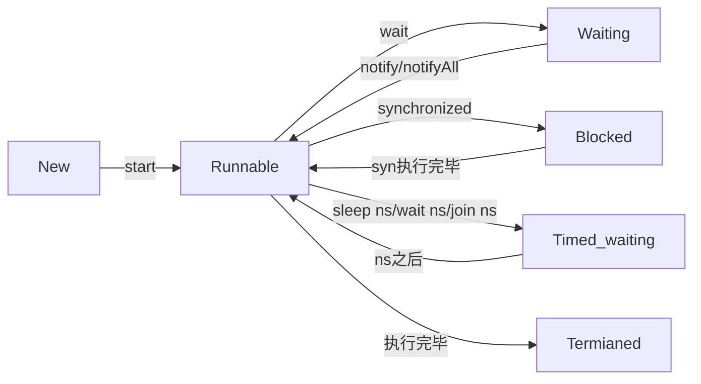

### 2.11 线程活跃性

#### 2.11.1 死锁现象

如果一个线程需要同时获取多把锁，这时就容易发生死锁

```java
Object lockA = new Object();
Object lockB = new Object();

Thread t1 = new Thread(() -> {
    synchronized (lockA){
        log.debug("t1 get lockA");
        TimeUtil.sleep(1);
        synchronized (lockB){
            log.debug("t1 get lockB");
        }
    }
    log.debug("t1 end");
}, "t1");

Thread t2 = new Thread(() -> {
    synchronized (lockB){
        log.debug("t2 get lockB");
        TimeUtil.sleep(1);
        synchronized (lockA){
            log.debug("t2 get lockA");
        }
    }
    log.debug("t2 end");
}, "t2");

t1.start();
t2.start();

输出：两个线程各自占用着自己的锁，同时又想获取对方的锁，就这样陷入僵持状态
15:56:00.659 [t1] DEBUG com.concurrent.demo02.thread.ThreadTest13 - t1 get lockA
15:56:00.659 [t2] DEBUG com.concurrent.demo02.thread.ThreadTest13 - t2 get lockB
```

操作系统中死锁的定义：指多个进程在运行过程中因争夺资源而造成的一种僵局。 当进程处于这种僵局时，**若无外力作用，他们都将无法再向前推进。**

产生死锁的主要原因：

+ 竞争非剥夺性资源，即共享资源
+ 进程推进顺序非法，即进程推进顺序不正确


#### 2.11.2 活锁状态

活锁出现在两个线程互相改变对方的结束条件，导致最后都无法结束一直运行

```java
static volatile int count = 10;
new Thread(() -> {
            // 期望减到 0 退出循环
            while (count > 0) {
                try {
                    Thread.sleep(200);
                } catch (InterruptedException e) {
                    e.printStackTrace();
                }
                count--;
                log.debug("count: {}", count);
            }
        }, "t1").start();
        new Thread(() -> {
            // 期望超过 20 退出循环
            while (count < 20) {
                try {
                    Thread.sleep(200);
                } catch (InterruptedException e) {
                    e.printStackTrace();
                }
                count++;
                log.debug("count: {}", count);
            }
        }, "t2").start();
输出：count的值一直在这几个值中徘徊，导致线程始终停止不了
16:54:29.836 [t2] DEBUG com.concurrent.demo02.thread.ThreadTest13 - count: 10
16:54:29.836 [t1] DEBUG com.concurrent.demo02.thread.ThreadTest13 - count: 9
16:54:30.046 [t1] DEBUG com.concurrent.demo02.thread.ThreadTest13 - count: 9
16:54:30.046 [t2] DEBUG com.concurrent.demo02.thread.ThreadTest13 - count: 10
16:54:30.249 [t2] DEBUG com.concurrent.demo02.thread.ThreadTest13 - count: 11
16:54:30.249 [t1] DEBUG com.concurrent.demo02.thread.ThreadTest13 - count: 10
....
```

> 活锁与死锁的区别：
>
> 死锁是两个线程因为同时等待对方的锁而陷入僵持的状态，线程并不继续运行
>
> 活锁是因为两个线程分别对对方的终止条件进行修改，导致两个线程一直运行而无法停止

#### 2.11.3 线程饥饿

线程饥饿指的是某个线程长时间得不到CPU的使用权，导致线程无法结束的状态


#### 2.11.4 经典问题之哲学家进餐问题

问题描述： 5位哲学家围绕圆桌而坐，反复思考和进餐。但是只有5只碗和筷 子，放置如图所示，只有当哲学家同时拿起碗边的2只筷子时， 才能进餐。


```java
//筷子类
class Chopstick{
    String name;

    public Chopstick(String name){
        this.name = name;
    }

    @Override
    public String toString() {
        return "Chopstick{" +
                "name='" + name + '\'' +
                '}';
    }
}

//哲学家类
@Slf4j
class Philosopher extends Thread {

    //分别代表哲学家左边的筷子和哲学家右边的筷子
    Chopstick left;
    Chopstick right;

    public Philosopher(String name, Chopstick left, Chopstick right){
        super(name);
        this.left = left;
        this.right = right;
    }

    private void eating(){
        log.debug("eating...");
        TimeUtil.sleep(1);
    }

    @Override
    public void run() {
        while (true){
            //获取左手边的筷子
            synchronized (left) {
                //获取右手边的筷子
                synchronized (right){
                    //吃饭
                    eating();
                }
            }
        }
    }
}
//哲学家进餐问题
        Chopstick c1 = new Chopstick("c1");
        Chopstick c2 = new Chopstick("c2");
        Chopstick c3 = new Chopstick("c3");
        Chopstick c4 = new Chopstick("c4");
        Chopstick c5 = new Chopstick("c5");

        new Philosopher("Philosopher1", c1, c2).start();
        new Philosopher("Philosopher2", c2, c3).start();
        new Philosopher("Philosopher3", c3, c4).start();
        new Philosopher("Philosopher4", c4, c5).start();
        new Philosopher("Philosopher5", c5, c1).start();
输出：其实是出现了死锁
17:06:58.222 [Philosopher5] DEBUG com.concurrent.demo02.thread.Philosopher - eating...
17:06:58.212 [Philosopher3] DEBUG com.concurrent.demo02.thread.Philosopher - eating...
17:06:59.222 [Philosopher5] DEBUG com.concurrent.demo02.thread.Philosopher - eating...
```


对于死锁问题的解决可以做一个小改动，令一个哲学家先拿右边的筷子，再拿左边的筷子即可

```java
Chopstick c1 = new Chopstick("c1");
Chopstick c2 = new Chopstick("c2");
Chopstick c3 = new Chopstick("c3");
Chopstick c4 = new Chopstick("c4");
Chopstick c5 = new Chopstick("c5");

new Philosopher("Philosopher1", c1, c2).start();
new Philosopher("Philosopher2", c2, c3).start();
new Philosopher("Philosopher3", c3, c4).start();
new Philosopher("Philosopher4", c4, c5).start();
new Philosopher("Philosopher5", c1, c5).start();

输出：这会一直执行，并且没有出现死锁的问题，但是经过一段时间之后可以发现，Philosopher2几乎得不到执行，这就是线程饥饿
17:10:03.362 [Philosopher4] DEBUG com.concurrent.demo02.thread.Philosopher - eating...
17:10:03.362 [Philosopher1] DEBUG com.concurrent.demo02.thread.Philosopher - eating...
17:10:04.372 [Philosopher5] DEBUG com.concurrent.demo02.thread.Philosopher - eating...
17:10:04.372 [Philosopher3] DEBUG com.concurrent.demo02.thread.Philosopher - eating...
17:10:05.372 [Philosopher4] DEBUG com.concurrent.demo02.thread.Philosopher - eating...
17:10:06.372 [Philosopher4] DEBUG com.concurrent.demo02.thread.Philosopher - eating...
17:10:07.382 [Philosopher3] DEBUG com.concurrent.demo02.thread.Philosopher - eating...
17:10:07.382 [Philosopher5] DEBUG com.concurrent.demo02.thread.Philosopher - eating...
17:10:08.382 [Philosopher4] DEBUG com.concurrent.demo02.thread.Philosopher - eating...
17:10:09.392 [Philosopher5] DEBUG com.concurrent.demo02.thread.Philosopher - eating...
17:10:10.392 [Philosopher4] DEBUG com.concurrent.demo02.thread.Philosopher - eating...
17:10:11.402 [Philosopher4] DEBUG com.concurrent.demo02.thread.Philosopher - eating...
    ....
```


### 2.12 ReentrantLock

ReentrantLock是java.util.concurrent.locks包下提供的一种锁，具有

+ 可中断
+ 可设置超时时间
+ 可以设置为公平锁
+ 支持多个条件变量

与synchronized相同，都可以支持锁重入（指一个线程重复获得同一把锁）

ReentrantLock的使用模板

```java
 private ReentrantLock lock = new ReentrantLock();

lock.lock();
try {
    //临界区
} finally {
    //释放锁
    lock.unlock();
}

```

#### 2.12.1 可重入性

可重入是指同一个线程如果首次获得了这把锁，那么因为它是这把锁的拥有者，因此有权利再次获取这把锁 

如果是不可重入锁，那么第二次获得锁时，自己也会被锁挡住

```java
//创建一个ReentrantLock对象
private ReentrantLock lock = new ReentrantLock();

public void method1(){
    lock.lock();

    try {
        log.debug("method1...");
        method2();
    } finally {
        lock.unlock();
    }
}

public void method2(){
    lock.lock();

    try {
        log.debug("method2...");
    } finally {
        lock.unlock();
    }
}
lock.lock();
try {
    log.debug("main...");
    //在method1方法中再次获得锁
    method1();
} finally {
    lock.unlock();
}

输出：如果是可重入锁的话就能够正常执行；如果是不可重入锁，那么就会阻塞
19:12:02.520 [main] DEBUG com.concurrent.demo02.thread.ThreadTest14 - main...
19:12:02.520 [main] DEBUG com.concurrent.demo02.thread.ThreadTest14 - method1...
19:12:02.520 [main] DEBUG com.concurrent.demo02.thread.ThreadTest14 - method2...
```

#### 2.12.2 可打断

synchronized锁如果获取锁失败会一直阻塞，但ReentrantLock如果获取锁失败，可以被其他线程打断阻塞过程，进入后续的处理

```java
Thread t1 = new Thread(() -> {
    try {
        log.debug("t1 try to get lock...");
        //如果ReentrantLock需要被打断，需要调用lockInterruptibly()方法，普通的lock()方法不能被打断
        lock.lockInterruptibly();
    } catch (InterruptedException e) {
        e.printStackTrace();
        //获取锁失败，在后续处理完成后就不应该进入临界区，需要直接返回
        log.debug("get lock failed, return");
        return;
    }
    try {
        log.debug("get lock successfully");
    } finally {
        lock.unlock();
    }
}, "t1");


lock.lock();
t1.start();
TimeUtil.sleep(2);
//打断t1，防止t1永久等待
t1.interrupt();

输出：
19:33:24.172 [t1] DEBUG com.concurrent.demo02.thread.ThreadTest14 - t1 try to get lock...
只要被打断就会抛出这个异常，但并不影响程序运行
java.lang.InterruptedException
19:33:26.173 [t1] DEBUG com.concurrent.demo02.thread.ThreadTest14 - get lock failed, return
```

这种可打断的锁可以防止死锁现象产生

#### 2.12.3 锁超时

ReentrantLock可以设置一个等待时间，如果在等待时间之内没有获得锁，就退出

```java
Thread t1 = new Thread(() -> {
            log.debug("t1 try to get lock...");
            //如果不带任何参数，就是判断一次，如果这次没获取锁就直接返回
//            if (! lock.tryLock()) {
//                log.debug("t1 get lock failed, return");
//                return;
//            }
            try {
                //表示等待2s，如果在2s之内没有获得锁，就退出
                if (! lock.tryLock(2, TimeUnit.SECONDS)) {
                    log.debug("t1 get lock failed, return");
                    return;
                }
            } catch (InterruptedException e) {
                e.printStackTrace();
                log.debug("t1 is interrupted...");
                return;
            }
            try {
                log.debug("get lock successfully");
            } finally {
                lock.unlock();
            }
        }, "t1");

        log.debug("main get lock");
        lock.lock();
        t1.start();
输出：
19:51:03.807 [main] DEBUG com.concurrent.demo02.thread.ThreadTest14 - main get lock
19:51:03.807 [t1] DEBUG com.concurrent.demo02.thread.ThreadTest14 - t1 try to get lock...
2s后t1线程结束
19:51:05.817 [t1] DEBUG com.concurrent.demo02.thread.ThreadTest14 - t1 get lock failed, return
    
    
如果main线程提前释放了锁，那么t1线程仍然可以获得锁
Thread t1 = new Thread(() -> {
            log.debug("t1 try to get lock...");
            //如果不带任何参数，就是判断一次，如果这次没获取锁就直接返回
//            if (! lock.tryLock()) {
//                log.debug("t1 get lock failed, return");
//                return;
//            }
            try {
                if (! lock.tryLock(2, TimeUnit.SECONDS)) {
                    log.debug("t1 get lock failed, return");
                    return;
                }
            } catch (InterruptedException e) {
                e.printStackTrace();
                log.debug("t1 is interrupted...");
                return;
            }
            try {
                log.debug("get lock successfully");
            } finally {
                lock.unlock();
            }
        }, "t1");

        log.debug("main get lock");
        lock.lock();
        t1.start();
        TimeUtil.sleep(1);
        log.debug("main release lock");
        lock.unlock();
输出：
19:52:33.176 [main] DEBUG com.concurrent.demo02.thread.ThreadTest14 - main get lock
19:52:33.186 [t1] DEBUG com.concurrent.demo02.thread.ThreadTest14 - t1 try to get lock...
19:52:34.186 [main] DEBUG com.concurrent.demo02.thread.ThreadTest14 - main release lock
19:52:34.186 [t1] DEBUG com.concurrent.demo02.thread.ThreadTest14 - get lock successfully
```

使用锁超时的机制解决哲学家进餐的死锁问题

```java
//使用ReentrantLock解决死锁问题
class Chopstick extends ReentrantLock {
    String name;

    public Chopstick(String name){
        this.name = name;
    }

    @Override
    public String toString() {
        return "Chopstick{" +
                "name='" + name + '\'' +
                '}';
    }
}

@Slf4j
class Philosopher extends Thread {

    //分别代表哲学家左边的筷子和哲学家右边的筷子
    Chopstick left;
    Chopstick right;

    public Philosopher(String name, Chopstick left, Chopstick right){
        super(name);
        this.left = left;
        this.right = right;
    }

    private void eating(){
        log.debug("eating...");
        TimeUtil.sleep(new Random().nextInt(3));
    }

    @Override
    public void run() {
        while (true){
            //尝试获得左手的筷子
            if (left.tryLock()) {
                try{
                    //尝试获得右手边的筷子
                    if(right.tryLock()){
                        try {
                            eating();
                        } finally {
                            right.unlock();
                        }
                    }
                } finally {
                    left.unlock();  //这里注意了，如果获取右手边的筷子失败，会释放左手拿到的筷子
                }
            }
        }
    }
}
 //哲学家进餐问题
        Chopstick c1 = new Chopstick("c1");
        Chopstick c2 = new Chopstick("c2");
        Chopstick c3 = new Chopstick("c3");
        Chopstick c4 = new Chopstick("c4");
        Chopstick c5 = new Chopstick("c5");

        new Philosopher("Philosopher1", c1, c2).start();
        new Philosopher("Philosopher2", c2, c3).start();
        new Philosopher("Philosopher3", c3, c4).start();
        new Philosopher("Philosopher4", c4, c5).start();
        new Philosopher("Philosopher5", c5, c1).start();

输出：每个线程都能够获得执行，并且也没有出现明显地饥饿现象
20:04:56.144 [Philosopher1] DEBUG com.concurrent.demo02.thread.Philosopher - eating...
20:04:57.144 [Philosopher3] DEBUG com.concurrent.demo02.thread.Philosopher - eating...
20:04:58.144 [Philosopher4] DEBUG com.concurrent.demo02.thread.Philosopher - eating...
20:04:58.144 [Philosopher2] DEBUG com.concurrent.demo02.thread.Philosopher - eating...
20:04:59.144 [Philosopher3] DEBUG com.concurrent.demo02.thread.Philosopher - eating...
20:04:59.144 [Philosopher1] DEBUG com.concurrent.demo02.thread.Philosopher - eating...
    ......
```

#### 2.12.3 条件变量

synchronized中也有条件变量，只不过每个synchronized只支持一个条件变量即调用锁对象的wait方法，即Monitor对象中的waitSet，当某个线程不满足条件时，进入waitSet中等待

ReentrantLock支持多个条件变量，也就是说ReentrantLock可以划分出多个waitSet，不满足某个条件就进入相应的waitSet中

```java
private ReentrantLock lock = new ReentrantLock();
//创建一个条件
Condition con1 = lock.newCondition();
Condition con2 = lock.newCondition();
//可以创建多个条件
...

//相当于锁对象的wait方法，使不满足con1条件的线程进入相对应的waitSet
con1.await(); 
//从con1所对应的waitSet中随机唤醒一个线程，相当于锁对象的notify()方法
con1.signal();
//将con1对应的waitSet中所有的线程都唤醒，相当于锁对象的notifyAll()方法
con1.signalAll();
```

+ 在调用条件的await()方法之前，需要确保线程已经获得了锁
+ await()方法调用之后会释放锁，与wait方法相似
+ await()方法可以被打断
+ await() 的线程被唤醒（或打断、或超时）取重新竞争 lock 锁

#### 2.12.4 多线程设计模式之顺序控制

示例1：编写两个线程，t1打印1，t2打印2，要求先让t2打印2再让t1打印1

首先使用wait / notify的方法

```java
final Object lock = new Object();
//标记t2线程是否执行
boolean isPrinted = false;

Thread t1 = new Thread(() -> {
    //如果t1先获得锁，就需要判断t2线程是否执行过
    synchronized (lock) {
        //如果没有执行过的话就需要等待t2线程执行完毕后再执行
        while(!isPrinted){
            try {
                lock.wait();
            } catch (InterruptedException e) {
                e.printStackTrace();
            }
        }
        log.debug("t1 print 1");
    }

}, "t1");

Thread t2 = new Thread(() -> {
    synchronized (lock) {
        log.debug("t2 print 2");
        isPrinted = true;
        //如果t2线程后执行，t2执行完毕之后唤醒t1线程
        lock.notify();
    }

}, "t2");

t1.start();
t2.start();

执行结果：
16:36:47.095 [t2] DEBUG com.concurrent.demo02.thread.ThreadTest15 - t2 print 2
16:36:47.099 [t1] DEBUG com.concurrent.demo02.thread.ThreadTest15 - t1 print 1

//还能够使用park方法
Thread t1 = new Thread(() -> {
    //如果t1先执行，那么就先暂停一下
    LockSupport.park();
    log.debug("t1 print 1");
}, "t1");

Thread t2 = new Thread(() -> {
    log.debug("t2 print 2");
    //当t2执行完毕时，唤醒t1，之前也说过了可以先执行unpark方法，也就是说如果是t2先执行的话，t1中的park方法就不会阻塞线程t1的执行
    LockSupport.unpark(t1);

}, "t2");
```

示例2：有三个线程，t1，t2，t3，交替打印abc，t1 -> a t2 -> b t3 -> c

```java
/*
* 分析：有三个线程t1，t2，t3
* t1    a    1 -> 2
* t2    b    2 -> 3
* t3    c    3 -> 1
* 参考之前打印1，2的方法，不难想到需要一个变量去标记之前的线程是否执行完毕
* 但boolean变量只有两个状态，而这里有三个线程，所以可以使用一个整型变量，去规定
* 每个线程执行完成之后的状态，现在假设t1执行时，状态为1，t2为2，t3为3
* 然后从当前状态推导出下一个状态，比如t1执行完毕后，t2执行，那么1状态之后的状态就是2
*
* 运用面向对象的思想，将这个标记做一个封装
* */
class WaitLock {
    //等待标记
    private int flag;
    //循环次数
    private int loopNumber;

    public WaitLock() {
    }

    public WaitLock(int flag, int loopNumber) {
        this.flag = flag;
        this.loopNumber = loopNumber;
    }

    /**
     * 线程运行
     * @param status 当前线程的等待标记
     * @param nextStatus 下一个线程的等待标记
     * @param ch 线程要打印的字符
     */
    public void run(int status, int nextStatus, char ch){
        for (int i = 0; i < loopNumber; i++) {
            synchronized (this) {
                //如果当前标记与线程的标记不同，则需要等待
                while(status != flag){
                    try {
                        this.wait();
                    } catch (InterruptedException e) {
                        e.printStackTrace();
                    }
                }
                log.debug("{}", ch);
                //更新标记
                flag = nextStatus;
                //唤醒其他等待的线程
                this.notifyAll();
            }
        }
    }
}
//测试：
//初始化等待标记，初始标记为1，循环5次，初始标记可以根据需求进行修改
WaitLock lock = new WaitLock(1, 5);
Thread t1 = new Thread(() -> {
    lock.run(1, 2, 'a');
}, "t1");
Thread t2 = new Thread(() -> {
    lock.run(2, 3, 'b');
}, "t2");
Thread t3 = new Thread(() -> {
    lock.run(3, 1, 'c');
}, "t3");
t1.start();
t2.start();
t3.start();

输出结果：
17:04:35.653 [t1] DEBUG com.concurrent.demo02.thread.WaitLock - a
17:04:35.658 [t2] DEBUG com.concurrent.demo02.thread.WaitLock - b
17:04:35.659 [t3] DEBUG com.concurrent.demo02.thread.WaitLock - c
    
17:04:35.659 [t1] DEBUG com.concurrent.demo02.thread.WaitLock - a
17:04:35.659 [t2] DEBUG com.concurrent.demo02.thread.WaitLock - b
17:04:35.659 [t3] DEBUG com.concurrent.demo02.thread.WaitLock - c
    
17:04:35.659 [t1] DEBUG com.concurrent.demo02.thread.WaitLock - a
17:04:35.659 [t2] DEBUG com.concurrent.demo02.thread.WaitLock - b
17:04:35.659 [t3] DEBUG com.concurrent.demo02.thread.WaitLock - c
    
17:04:35.659 [t1] DEBUG com.concurrent.demo02.thread.WaitLock - a
17:04:35.659 [t2] DEBUG com.concurrent.demo02.thread.WaitLock - b
17:04:35.659 [t3] DEBUG com.concurrent.demo02.thread.WaitLock - c
    
17:04:35.659 [t1] DEBUG com.concurrent.demo02.thread.WaitLock - a
17:04:35.659 [t2] DEBUG com.concurrent.demo02.thread.WaitLock - b
17:04:35.659 [t3] DEBUG com.concurrent.demo02.thread.WaitLock - c
```

ReentrantLock版本：

```java
/**
 * 对上面的代码进行改进，使用ReentrantLock来进行
 * 分析：之前使用一个整型变量来标记每个线程的等待状态，当把锁换成ReentrantLock之后
 * 一个ReentrantLock有多个条件变量，所以可以给这三个线程分别分配一个条件变量，比如
 * Thread     Condition
 * t1          a
 * t2          b
 * t3          c
 * 通过唤醒的方式来控制打印的顺序
 */

@Slf4j
class ConditionLock extends ReentrantLock {
    //循环次数
    private int loopNumber;

    public ConditionLock() {
    }

    public ConditionLock(int loopNumber) {
        this.loopNumber = loopNumber;
    }

    /**
     * 打印方法
     * @param ch 线程要打印的字符
     * @param current 当前线程的条件变量
     * @param next 下一个要被唤醒线程的条件变量
     */
    public void print(char ch, Condition current, Condition next){
        for (int i = 0; i < loopNumber; i++) {
            //先获得锁
            this.lock();
            try {
                try {
                    //在打印之前先让线程进入各自的waitSet中等待
                    current.await();
                    log.debug("{}", ch);
                    //唤醒下一个要打印的线程
                    next.signal();
                } catch (InterruptedException e) {
                    e.printStackTrace();
                }
            } finally {
                this.unlock();
            }
        }
    }
}
//测试：
ConditionLock lock = new ConditionLock(5);

        //分别为三个线程分配条件变量
        Condition a = lock.newCondition();
        Condition b = lock.newCondition();
        Condition c = lock.newCondition();

        Thread t1 = new Thread(() -> {
            lock.print('a', a, b);
        }, "t1");
        Thread t2 = new Thread(() -> {
            lock.print('b', b, c);
        }, "t2");
        Thread t3 = new Thread(() -> {
            lock.print('c', c, a);
        }, "t3");
        t1.start();
        t2.start();
        t3.start();

        //由于三个线程在刚要打印的时候都被阻塞，所以需要一个开始的启动
        TimeUtil.sleep(1);
        lock.lock();
        try{
            log.debug("start...");
            a.signal();
        } finally {
            lock.unlock();
        }
        TimeUtil.sleep(2);
输出：
17:34:01.135 [main] DEBUG com.concurrent.demo02.thread.ThreadTest15 - start...
17:34:01.138 [t1] DEBUG com.concurrent.demo02.thread.ConditionLock - a
17:34:01.142 [t2] DEBUG com.concurrent.demo02.thread.ConditionLock - b
17:34:01.142 [t3] DEBUG com.concurrent.demo02.thread.ConditionLock - c
17:34:01.142 [t1] DEBUG com.concurrent.demo02.thread.ConditionLock - a
17:34:01.142 [t2] DEBUG com.concurrent.demo02.thread.ConditionLock - b
17:34:01.143 [t3] DEBUG com.concurrent.demo02.thread.ConditionLock - c
17:34:01.143 [t1] DEBUG com.concurrent.demo02.thread.ConditionLock - a
17:34:01.143 [t2] DEBUG com.concurrent.demo02.thread.ConditionLock - b
17:34:01.143 [t3] DEBUG com.concurrent.demo02.thread.ConditionLock - c
17:34:01.143 [t1] DEBUG com.concurrent.demo02.thread.ConditionLock - a
17:34:01.143 [t2] DEBUG com.concurrent.demo02.thread.ConditionLock - b
17:34:01.143 [t3] DEBUG com.concurrent.demo02.thread.ConditionLock - c
17:34:01.143 [t1] DEBUG com.concurrent.demo02.thread.ConditionLock - a
17:34:01.143 [t2] DEBUG com.concurrent.demo02.thread.ConditionLock - b
17:34:01.143 [t3] DEBUG com.concurrent.demo02.thread.ConditionLock - c
```


## 三、Java内存模型 --- JMM

### 3.1 Java内存模型

JMM即`Java Memory Model`，它定义了主存、工作内存抽象概念，底层对应着CPU寄存器、缓存、硬件内存，CPU指令优化等

Java内存模型的主要目的是定义程序中各种变量的访问规则，即关注在虚拟机中把变量值存储到内存和从内存中取出变量值这样的底层细节；Java内存模型规定了所有变量都存储在主存中，每条线程还有自己的工作内存，线程对变量的所有操作（读取、赋值等）都必须在工作内存中进行，而不能直接读写主存中的数据

JMM体现在：

+ 原子性 - 保证指令不会受到线程上下文切换的影响

  > 基本数据类型的访问、读写都是具备原子性的，以及JVM提供了monitorenter和monitorexit来保证期间的代码执行是原子性的，体现在Java代码的层面上就是synchronized关键字

+ 可见性 - 保证指令不会受CPU缓存的影响

  > 可见性是指当一个线程修改了共享变量的值时，其他线程能够立即得知这个修改
  >
  > Java内存模型是通过在变量修改后将新值同步回主内存，在变量读取前从主内存刷新变量值这种依赖主存作为传递媒介的方式来实现可见性的

+ 有序性 - 保证指令不会受CPU指令并行优化的影响

JMM内存模型：


### 3.2 可见性

可以先来看一个示例：

```java
static boolean run = true;
Thread t1 = new Thread(() -> {
    while (run){

    }
    log.debug("t1 complete...");
}, "t1");
t1.start();

TimeUtil.sleep(1);
log.debug("main stop t1");
//这里对run的修改并不会将线程执行停止
run = false;

输出：
19:22:44.045 [main] DEBUG com.concurrent.demo02.thread.ThreadTest16 - main stop t1
后续并没有输出t1 complete...说明线程t1并没有结束
```

原因：

（1）在初始状态下，t线程刚开始从主内存读取了run的值到工作内存


（2）线程t1执行一段时间之后，JVM中的JIT编译器会将while(true)这段热点代码缓存到线程自己的工作内存中（CPU高速缓存），减少对主存中run的访问以提高效率


（3）1s之后，主线程修改了run的值，并同步至主存中，但线程t1是从自己工作内存中的高速缓存中读取这个变量，在t1的工作内存中没有改变这个变量，所以仍然读取到的是false，所以t1线程并不能跳出while循环（类似于CPU中主存与缓存的数据一致性问题）


**解决方法**：使用volatile关键字

```java
volatile static boolean run = true;
Thread t1 = new Thread(() -> {
    while (run){

    }
    log.debug("t1 complete...");
}, "t1");
t1.start();

TimeUtil.sleep(1);
log.debug("main stop t1");
run = false;

输出：
19:41:01.160 [main] DEBUG com.concurrent.demo02.thread.ThreadTest16 - main stop t1
可以看到线程已经停止了
19:41:01.162 [t1] DEBUG com.concurrent.demo02.thread.ThreadTest16 - t1 complete...
```

volatile关键字可以用来修饰成员变量和静态成员变量，volatile保证不同线程对共享变量操作的可见性，也就是说一个线程修改了volatile修饰的变量，当修改写回主内存时，另外一个线程立即看到最新的值。

#### 3.2.1 可见性与原子性的比较

使用volatile关键字修饰的变量对所有线程是可见的，这就体现了可见性，比如上例中，当主线程修改了run的值之后，从字节码的角度看：

``` 
#每循环一次就需要获取一次run的值
getstatic      run   # run = true
getstatic      run   # run = true
getstatic      run   # run = true
getstatic      run   # run = true
#当主线程对run进行修改，重新放入内存中
putstatic      run   # run = false
#当线程再次去获取run的值时，就获得了false，退出循环
getstatic      run   # run = false
```

volatile关键字只能保证线程能够看到变量的最新值，并不能解决指令交错的问题，比如之前的i++，i--操作

```
// 假设i的初始值为0 
getstatic i // 线程2-获取静态变量i的值 线程内i=0 

getstatic i // 线程1-获取静态变量i的值 线程内i=0 
iconst_1 // 线程1-准备常量1 
iadd // 线程1-自增 线程内i=1 
putstatic i // 线程1-将修改后的值存入静态变量i 静态变量i=1 

iconst_1 // 线程2-准备常量1 
isub // 线程2-自减 线程内i=-1 
putstatic i // 线程2-将修改后的值存入静态变量i 静态变量i=-1 
```

> 注意：synchronized关键字既可以保证代码块的原子性，又能够保证块内变量的可见性，缺点就是性能问题

#### 3.2.2 两阶段终止模式的改进

之前的两阶段终止模式使用的是interrupt()方法，此次使用一个停止标记

```java
class TwoPhaseTermination{

    //模拟监控线程
    private Thread monitor;
    
    //增加一个停止标记，当stop = true时退出，由于主线程的修改需要对其他线程可见，所以使用volatile关键字修饰保证可见性
    private volatile boolean stop = false;

    //启动监控线程
    public void start(){
        monitor = new Thread(() -> {
            while(true){
                Thread currentThread = Thread.currentThread();
                if(stop){
                    log.debug("处理后事...");
                    break;
                }

                //每隔1秒执行一次监控程序
                try {
                    Thread.sleep(2000);
                    log.debug("执行监控程序...");
                } catch (InterruptedException e) {
                    //由于没有采用打断标记对线程停止做判断，所以也没有必要在这里设置打断标记
                    e.printStackTrace();
                }

            }
        }, "monitor");

        monitor.start();
    }

    public void stop(){
        stop = true;
        //如果不想等待线程睡眠结束，可以使用interrupt方法打断
        monitor.interrupt();
    }
}
```

#### 3.2.3 内存屏障

为了保证内存的可见性，Java编译器在生成指令序列的适当位置会插入内存屏障指令来禁止特定类型的处理器重排序，JMM把内存屏障指令分为4类：

| **屏障类型**        | **指令示例**             | **说明**                                                     |
| ------------------- | ------------------------ | ------------------------------------------------------------ |
| LoadLoad Barriers   | Load1;LoadLoad;Load2     | 确保Load1数据的装载先于Load2及有后续装载指令的装载           |
| StoreStore Barriers | Store1;StoreStore;Store2 | 确保Store1数据对其他处理器可见（刷新到内存）先于Store2及后续存储指令的存储 |
| LoadStore Barriers  | Load1;LoadStore;Store2   | 确保Load1数据装载先于Store2及所有后续的存储指令刷新到内存    |
| StoreLoad Barriers  | Store1;StoreLoad;Load2   | 确保Store1数据对其他处理器变得可见先于Load2及后续所有装载指令的装载 |

> StoreLoad Barriers是一个“全能型”屏障，同时具有其他三个屏障的效果，StoreLoad Barriers会使该屏障之前的所有内存访问指令（存储和状态指令）完成之后，才执行该屏障之后的内存访问指令

### 3.3 有序性

Java虚拟机会在不影响程序正确性的前提下，调整语句的执行顺序

```java
static int i, j;
//在某个线程中执行对两个变量的赋值操作
i = ...;
j = ...;
```

其实对于这两个变量谁先赋值和谁后赋值并没有影响

```java
//真正执行的时候可以是
i = ...;
j = ...;
//也可以是
j = ...;
i = ...;
这种调整指令顺序的特性就称为指令重排，但在多线程的情况下，指令重排会影响程序的正确性
```

**指令重排序导致的问题**

```java
int num = 0;
boolean ready = false;
// 线程1 执行此方法
public void actor1(I_Result r) {
     if(ready) {
     	r.r1 = num + num;
     } else {
     	r.r1 = 1;
     }
}
// 线程2 执行此方法
public void actor2(I_Result r) { 
     num = 2;
     ready = true; 
}
```

程序分析：

+ 情况1：当线程1和线程2串行执行，并没有互相交错，如果线程1先执行，进入if语句判断时，ready = false，就执行r.r1 = 1

+ 情况2：如果线程2先执行，那么r.r1 = 2 + 2 = 4

+ **情况3：**这种情况就是JVM底层对指令重排的一种情况

  > JVM会将线程2执行的方法actor2()中的指令调整为ready = true;  num = 2，也就是先将ready置为true，再更新num的值，如果线程2刚执行完ready = true之后发生了上下文切换，那么线程1去执行的时候，就会出现r.r1 = 0 + 0 = 0的情况
  >
  > 需要注意的是，这种情况出现的概率很小，使用压力测试工具测试时，千万次的测试次数中只出现了1000次左右

### 3.4 Volatile原理

#### 3.4.1 如何保证可见性

volatile的底层实现原理是内存屏障 --- Memory Barrier

+ 对volatile关键字修饰的写指令之后加入写屏障
+ 对volatile关键字修饰的读指令之前加入读屏障

写屏障保证在该屏障之前的，对共享变量的改动都会同步到主存中

```java
boolean volatile ready = false;
public void actor_3(){
    num = 2;
    ready = true;
    //添加写屏障，在此屏障之前的操作，也就是num = 2 ready = true的操作都会同步到主存中
}
```

读屏障保证在该屏障之后，对共享变量的读取，加载的是主存中的最新数据

```java
public void actor_1(){
    //读屏障，在此屏障之后的读取操作都是直接读取主存中的最新数据
    if(ready){
        r.r1 = num + num;
    } else{
        r.r1 = 1;
    }
}
```

> volatile写-读的内存语义：
>
> + 当对一个volatile变量进行写操作的时候，JMM会把该线程对应的本地内存中的共享变量的新值**刷新到主内存中**
> + 当对一个volatile变量进行读操作的时候，JMM会把该线程对应的**本地内存置为无效**，线程需要**重新从主存中读取共享变量**

#### 3.4.2 如何保证有序性

写屏障会确保指令重排时，不会将写屏障之前的代码排在写屏障之后

```java
public void actor_3(){
    num = 2;
    ready = true;
    //写屏障，num = 2这条语句在底层指令重排时，不会出现在此之下
}
```

读屏障会确保指令重排时，不会将读屏障之后的代码排在读屏障之前

```java
public void actor_1(){
    //读屏障,确保之后的指令在指令重排之后不会出现在读屏障之前
    if(ready){
        r.r1 = num + num;
    } else{
        r.r1 = 1;
    }
}
```

#### 3.4.3 双重校验锁

先来看单例模式中的懒汉式：

```java
public class Singleton{
    private static Singleton instance = null;
    private Singleton(){}
    public static Singleton getInstance(){
        if(instance == null){
            instance = new Singleton();
        }
        return instance;
    }
}
```

在单线程的模式下使用是没有问题的，但在多线程的情况下会出现下面的情况

```
线程t1第一次想获取这个单例，先进入判断if(instance == null)，刚判断完毕，时间片用完，还没有执行实例变量的创建，发生上下文切换
线程t2获得了时间片，也执行判断if(instance == null)，这时，由于t1还没有创建实例对象，所以这个判断也为true，线程t2也进入了if语句
这时候就有问题了，当两个线程再次获得时间片之后，都会各自创建一个Singleton的实例对象，这时候这个对象就不是单例的了
```

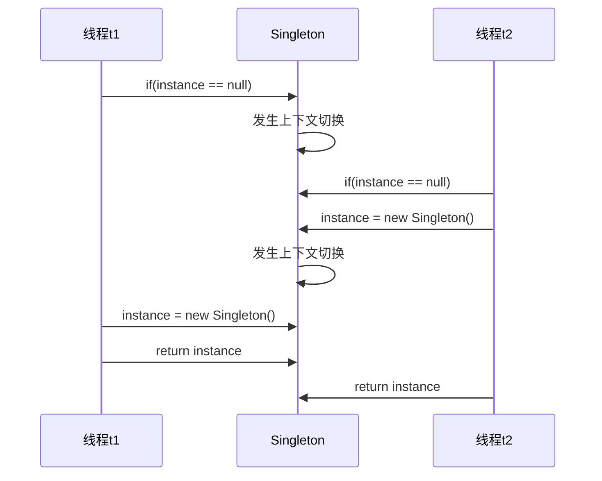

要解决这个问题可以使用synchronized关键字来确保创建时的原子性

```java
public class Singleton{
    private static Singleton instance = null;
    private Singleton(){}
    public static Singleton getInstance(){
        synchronized(Singleton.class){
            if(instance == null){
                instance = new Singleton();
            }
            return instance;
        }
    }
}
```

这样就能保证创建的对象是单例的，但此时，效率就大打折扣，试想一下，其实只需要在**第一次**进行null判断的时候需要加锁，之后的操作if(instance == null)条件都不会成立，会直接返回instance，如果写成上面的代码，那么每一次进行非空判断的时候都需要加锁，很影响系统的性能，所以就引入了这个双重校验：

```java
public class Singleton{
    private static Singleton instance = null;
    private Singleton(){}
    public static Singleton getInstance(){
        //创建完对象之后，这里instance == null始终为false，可以直接返回instance对象，无须再获取锁
        if(instance == null){
            //第一次进入if判断时，会对创建对象的代码进行保护
            synchronized(Singleton.class){
                if(instance == null){
                    instance = new Singleton();
                }
        	}
        }
        return instance;
    }
}
```

这个双重校验的特点就是首次使用getInstance()方法时才会用synchronized进行加锁，后面的使用都不需要加锁

但其实这段代码还是有问题的，因为判断外层判断instance == null并不在同步代码块内部，所以有可能会发生指令重排，将上面的代码转换为字节码：

```
 0 getstatic #2    //获得instance变量
 3 ifnonnull 37 (+34)   //判断
 6 ldc #3         //获取类对象，也就是锁
 8 dup
 9 astore_0
10 monitorenter   //上锁
11 getstatic #2 
14 ifnonnull 27 
17 new #3    //创建对象
20 dup
21 invokespecial #4 <com/concurrent/demo02/thread/Singleton.<init> : ()V> //调用构造方法
24 putstatic #2 
27 aload_0
28 monitorexit  //释放锁
29 goto 37 (+8)
32 astore_1
33 aload_0
34 monitorexit
35 aload_1
36 athrow
37 getstatic #2 
40 areturn
```

+ 17 表示创建对象，将对象引用入栈 // new Singleton 
+ 20 表示复制一份对象引用 // 引用地址 
+ 21 表示利用一个对象引用，调用构造方法 
+ 24 表示利用一个对象引用，赋值给 static INSTANCE

在一定情况下，jvm会对代码进行重排，先执行24行的指令，再执行21行的指令，虽然对于同步代码块中的内容这么做没有问题，但是注意，第三行的指令ifnonull是在同步代码块之外，使用流程图看看：

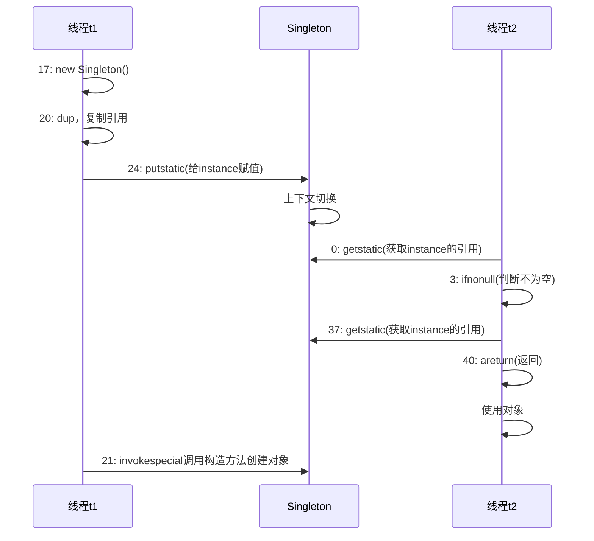

可以清楚地看到，线程t1还没有调用invokespecial指令之前，先对指令进行赋值，但线程t2这时获取的对象还没有完全被初始化，当它去使用这个对象的时候，就会发生异常

```
说得再简单一点，instance = new Singleton()这个语句可以拆分成：
#1 memory = allocate()      //分配对象的内存空间
#2 ctorInstance(memory)     //初始化对象
#3 instance = memory        //设置instance指向刚分配的内存地址
而#2与#3可能会被JVM进行指令重排，那么执行的顺序就变为：
#1 memory = allocate()      //分配对象的内存空间
#3 instance = memory        //设置instance指向刚分配的内存地址，对象还未被初始化！
#2 ctorInstance(memory)     //初始化对象
```

> 注意synchronized确实能够保证代码块内部指令的原子性、可见性和有序性，但前提是，共享变量完全被synchronized保护，也就是说共享变量的读写只在synchronized中进行时，synchronized才能保证指令的有序性，其余两项不管怎么样都能保证

解决上述问题：对instance使用volatile修饰，volatile可以保证指令的有序性

```java
public class Singleton{
    private static volatile Singleton instance = null;
    private Singleton(){}
    public static Singleton getInstance(){
        //创建完对象之后，这里instance == null始终为false，可以直接返回instance对象，无须再获取锁
        if(instance == null){
            //第一次进入if判断时，会对创建对象的代码进行保护
            synchronized(Singleton.class){
                if(instance == null){
                    instance = new Singleton();
                }
        	}
        }
        return instance;
    }
}
```

读写 volatile 变量时会加入内存屏障（Memory Barrier（Memory Fence））

从流程图中来讲：

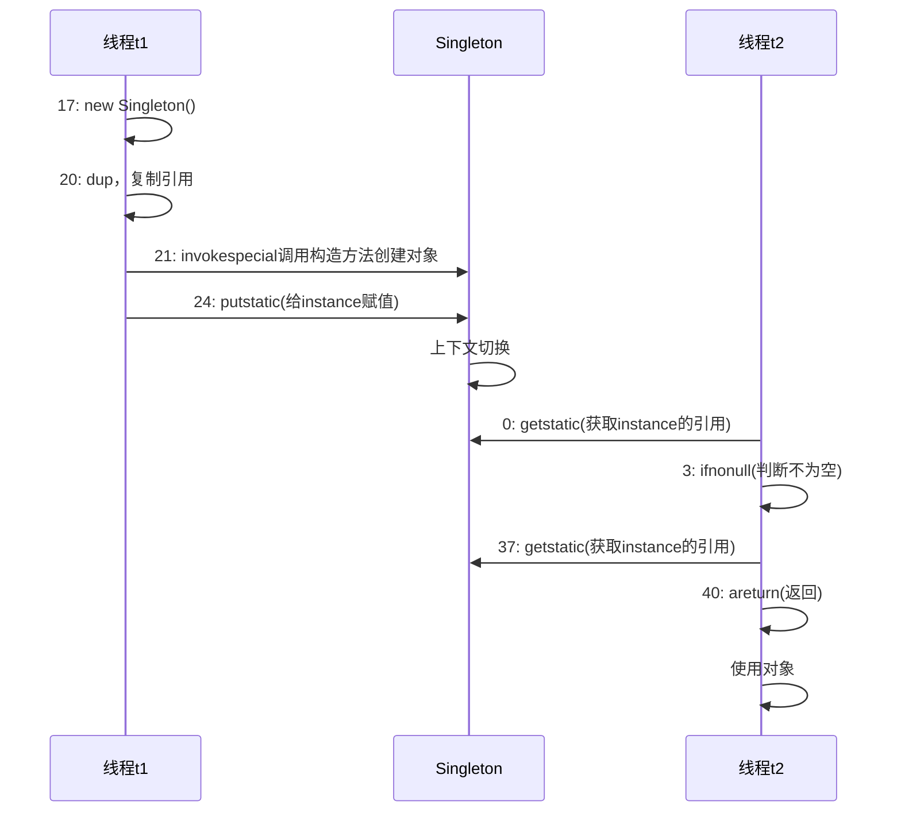

由于加了volatile关键字，在instance = new Singleton()方法之后加了一个写屏障，所以21行的invokespecial指令是不能被排序到写屏障之后的，这样就解决了指令重排序的问题

### 3.5 happens-before原则

happens-before原则，也称为先行发生原则，是Java内存模型中重要原则之一，它用于判断线程间使用的数据是否发生竞争，线程是否安全

happens-before原则是Java内存模型中定义两项操作之间的偏序关系，如：操作A先行发生于操作B，指的是在发生操作B之前，操作A产生的影响能被操作B观察到，举一个简单的例子：

```java
//线程t1执行操作A
i = 1;

//线程t2执行操作B
j = i;
```

现在，操作A先行发生于操作B，也就是线程t1先执行 i = 1的操作，那就可以确定，当线程t2执行操作B之后，j 的值是1，先行发生可以简单理解为，在操作B发生之前，操作A已经完成了，并且可以确定操作A发生之后的结果是什么

Java内存模型中有一些天然的先行发生关系：

+ **程序次序规则：**在一个线程内，按照控制流顺序，写在前面的操作先行发生于写在后面的操作
+ **管程锁定规则：**一个unlock操作（可以理解为synchronized编译为字节码文件后的monitorexit）先行发生于后面对同一个锁的lock操作（即monitorenter）
+ **volatile变量规则：**对一个volatile变量的写操作先行发生于后面对这个变量的读操作
+ **传递性：**如果操作A先行发生于操作B，操作B又先行发生于操作C，那么操作A先行发生于操作C

需要注意的是，一个操作的“时间上先发生”不代表这个操作会是”先行发生“，比如：

```java
private int value = 0;

public void setValue(int value){
    this.value = value;
}

public int getValue(){
    return value;
}

//线程A先启动执行：
setValue(1);

//线程B后启动执行：
int value = getValue();
```

从时间顺序上来看，线程A先执行了setValue(1)，之后线程B执行getValue()，最后value的值是1。实际上并不是这样的，赋值操作并不是一个原子操作，在赋值期间可能发生上下文切换，所以线程B取到的值有可能是0也有可能是1

如果按照先行发生的原则，那么应该可以明确地判断线程B取到的值就是1，所以时间上先发生和先行发生并没有直接联系

通过先行发生的原则，可以判断一个共享变量在使用的过程中是否线程安全


## 四、无锁并发 --- 乐观锁

### 4.1 问题引出

```java
//一个线程不安全的实现
class AccountUnsafe implements Account {

    //存款
    private Integer balance;

    public AccountUnsafe(Integer balance) {
        this.balance = balance;
    }

    @Override
    public Integer getBalance() {
        return balance;
    }

    @Override
    public void withdraw(Integer amount) {
        balance -= amount;
    }
}

interface Account {
    //获取余额
    Integer getBalance();

    //取款
    void withdraw(Integer amount);

    //测试方法，会在方法被调用的时候启动1000个线程取款，每个线程取款10元，如果初始存款为10000元，那么正确地结果应该是0元
    static void demo(Account account) {
        List<Thread> ts = new ArrayList<>();
        long start = System.nanoTime();
        for (int i = 0; i < 1000; i++) {
            ts.add(new Thread(() -> {
                account.withdraw(10);
            }));
        }
        ts.forEach(Thread::start);
        ts.forEach(t -> {
            try {
                t.join();
            } catch (InterruptedException e) {
                e.printStackTrace();
            }
        });
        long end = System.nanoTime();
        System.out.println(account.getBalance()
                + " cost: " + (end-start)/1000000 + " ms");
    }
}

//测试：
Account account = new AccountUnsafe(10000);
Account.demo(account);

输出：结果并不正确
940 cost: 223 ms
```

使用锁的方式来进行修改：

```java
class AccountUnsafe implements Account {

    //存款
    private Integer balance;

    public AccountUnsafe(Integer balance) {
        this.balance = balance;
    }

    @Override
    public synchronized Integer getBalance() {
        return balance;
    }

    @Override
    public synchronized void withdraw(Integer amount) {
        balance -= amount;
    }
}

输出结果：结果正确
0 cost: 114 ms
```

进一步做修改，使用无锁的方式

```java
//使用无锁方式保证线程安全
class AccountCas implements Account{
    //注意不是Integer
    private AtomicInteger balance;

    public AccountCas(Integer number) {
        balance = new AtomicInteger(number);
    }

    @Override
    public Integer getBalance() {
        return balance.get();
    }

    @Override
    public void withdraw(Integer amount) {
        while (true) {
            //获取当前的余额
            int cur = balance.get();
            //尝试减去取钱金额
            int next = cur - amount;
            if (balance.compareAndSet(cur, next)) {
                break;
            }
        }
    }
}
输出：
0 cost: 102 ms
```

可以看到整个类中并没有使用synchronized以及ReentrantLock等锁，其中AtomicInteger中也没有加synchronized关键字的方法，但得出的结果是一样的，并且比之前加锁的方式效率稍微高一点

### 4.2 CAS

观察上述代码的取款部分：

```java
//这里while(true)的意思是，如果上一次操作失败，回进行下一次的尝试，直至操作成功为止
while (true) {
    //获取当前的余额
    int cur = balance.get();
    //尝试减去取钱金额
    int next = cur - amount;
    //比较cur的值与当前期望的值是否相同，比如当前的余额是1000，在进行上面两行代码的过程中，其他线程对balance的值进行了修改，将balance的值修改为了990，这时，这个比较就会返回false
    if (balance.compareAndSet(cur, next)) {
    	break;
    }
}
```

分析执行流程：

+ 首先获取当前的余额值，比如当前的余额为1000
+ 尝试使用当前余额 - 要取的值，即1000 - 10
+ 使用CAS判断这个操作是否成功，compareAndSet的两个参数：期望的值和修改后的值
  + 比较获取到的cur是否与期望的值相同，如果相同，则将next值设置为当前值，并返回true表示操作成功
  + 如果cur与当前期望的值不同，则返回false，表示操作失败，进入下一次循环再次尝试操作

用流程图表示就是：（以两个线程为例）

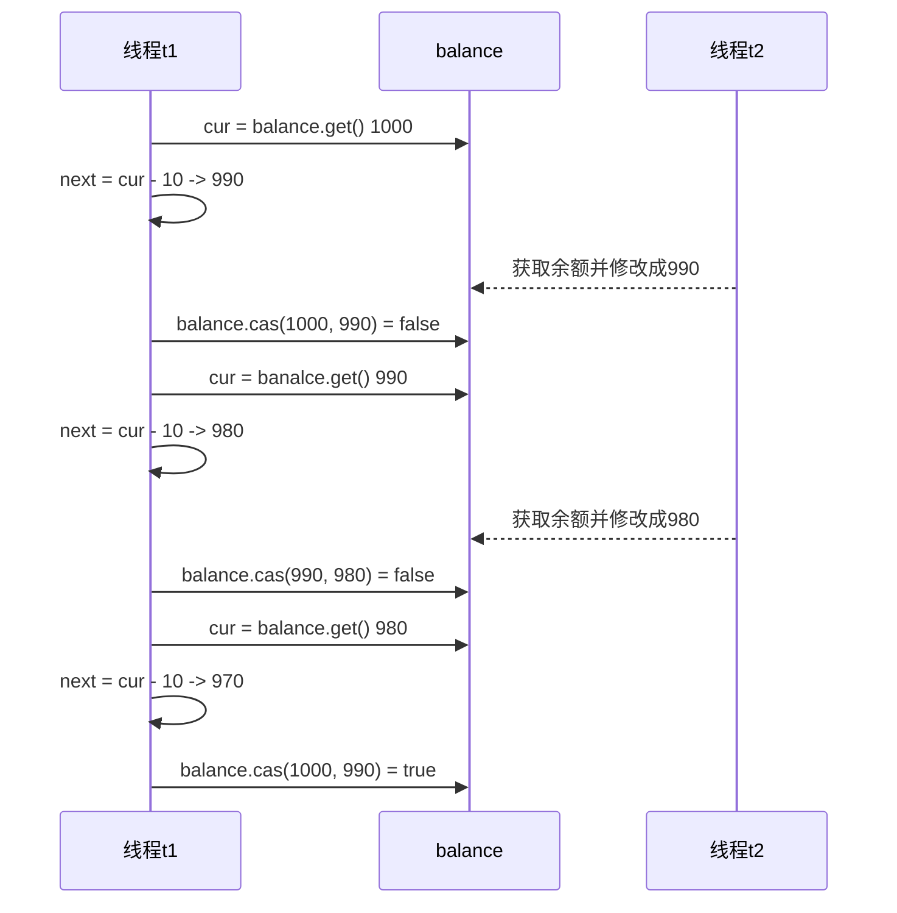

+ 当线程t1第一次取获取余额时，在那一时刻的余额值为1000
+ 在线程t1尝试进行修改的时候，线程t2获取余额的值并将余额值修改为990（修改成功）
+ 线程t2修改完成之后，线程t1调用balance的compareAndSet(1000, 990)方法进行操作判断，由于线程t2已经把余额的值修改了，所以当前余额的值为990，与线程t1“以为”的1000并不相同，所以方法会返回false，终止操作，进行下一次地尝试

> 注意一点，CAS在进行比较操作的时候，也就是调用compareAndSet()方法的时候，可以在CPU层面上保证操作是原子性的

**CAS与volatile关键字**

可以看到，在使用CAS进行判断的时候，需要获取变量的最新值，为了能够获取到这个值，变量需要使用volatile进行修饰，可以看一下AtomicInteger的源码：

```java
public class AtomicInteger extends Number implements java.io.Serializable {
    ...
    private volatile int value;

    public AtomicInteger(int initialValue) {
        value = initialValue;
    } 
    ...
}
```

可以看到value用于存储整型值的变量使用volatile进行修饰的，CAS 必须借助 volatile 才能读取到共享变量的最新值来实现【比较并交换】的效果


**为什么CAS的运行效率高一点？**

+ 在无锁的情况下，即使操作尝试失败，线程也始终在运行当中，并不会发生上下文切换（时间片没用完的话），而synchronized的情况下，会使得没有获得锁的线程进入阻塞状态，言外之意就是发生了一次上下文切换
+ 上下文切换的代价比较大，如果把线程比作是赛道上的赛车，一次上下文切换就相当于在赛道上的车需要在高速状态下进行减速、熄火，当再次获得CPU使用权时，需要再进行加速，回到之前的速度，这样的开销是比较大的
+ 但从之前的描述中也看得出来，线程的运行需要CPU的支持，如果是单核CPU，只能执行一个线程，那么对于CAS来说，不管怎么样，在线程时间片用完的情况下都会发生上下文切换，性能自然也不会高

**CAS的特点**

+ CAS基于乐观锁的思想，不对共享变量进行上锁，不怕别的线程对共享变量的修改，即使修改了也没关系，再进行一次尝试即可

  > 相反地，synchronized采用的就是一种悲观锁的思想，直接对共享变量上锁，防止其他任何线程对其进行访问，等到当前线程操作完毕时，再释放锁

+ CAS体现的是无锁并发，无阻塞并发

+ CAS适用于线程数较少，**多核CPU**，以及**线程竞争不激烈**的场景下，这样CAS能够发挥它的优势

### 4.3 原子整数

juc并发包提供了：

+ **AtomicBoolean**
+ **AtomicInteger**
+ **AtomicLong**

这些类使用CAS的方法保证对变量的运算是原子的

以AtomicInteger为例：

```java
AtomicInteger atomicInteger = new AtomicInteger(5);

//相当于++i
atomicInteger.incrementAndGet();
//相当于i++
atomicInteger.getAndIncrement();
//相当于i = i + 5
atomicInteger.addAndGet(5);
//相当于先返回i，再i = i + 5
atomicInteger.getAndAdd(5);
//相当于x = x / 10
atomicInteger.updateAndGet(x -> x / 10);

//这个方法需要传入一个函数式接口IntUnaryOperator，可以进行任何一元运算
updateAndGe(IntUnaryOperator updateFunction)
//...
```

这些方法的底层实现都是使用CAS的方式，也就是

```java
while(true) {
    int cur = atomicInteger.get();
    int next = cur op number;
    if(atomicInteger.compareAndSet(cur, next)){
        break; //或return next;
    }
}
```

### 4.4 原子引用

上面的原子整数是对基本数据类型的保护，而Java中，存在着大量的引用数据类型，所以，juc也提供了对引用类型的保护的类：

+ **AtomicReference**
+ **AtomicMarkableReference**
+ **AtomicStampedReference**

基本原子引用的使用方式与原子整数相似，还是以之前的转账为例，不过账户的余额类型使用BigDecimal代替int

```java
class DecimalAccountSafeCas implements DecimalAccount {
     AtomicReference<BigDecimal> ref;
     public DecimalAccountSafeCas(BigDecimal balance) {
     	ref = new AtomicReference<>(balance);
     }
     @Override
     public BigDecimal getBalance() {
     	return ref.get();
     }
     @Override
     public void withdraw(BigDecimal amount) {
         while (true) {
             BigDecimal prev = ref.get();
             BigDecimal next = prev.subtract(amount);
             if (ref.compareAndSet(prev, next)) {
             	break;
             }
         }
     }
}
```

> 注意：AtomicReference对应普通的对象引用，底层使用的是compareAndSwapObject实现CAS，比较的是两个对象的**地址是否相等**

**原子引用引发的ABA问题**

先来看一个简单的示例：

```java
AtomicReference<String> ref = new AtomicReference<>("A");

log.debug("start...");
String cur = ref.get();
TimeUtil.sleep(2);
log.debug("change A -> C {}", ref.compareAndSet(cur, "C"));

输出：在单线程的情况下对原子引用的修改是完全没有问题的
20:07:15.469 [main] DEBUG com.concurrent.demo02.thread.ThreadTest17 - start...
20:07:17.479 [main] DEBUG com.concurrent.demo02.thread.ThreadTest17 - change A -> C true
```

现在考虑这个问题：主线程修改的这个“A”还是原来的那个“A”吗？意思是，中途是否有其他线程对ref进行了修改，只不过改了几次又改回了“A”，主线程是否能够察觉到这样的变化？再来看一个示例：

```java
AtomicReference<String> ref = new AtomicReference<>("A");


log.debug("start...");
String cur = ref.get();
other();
TimeUtil.sleep(2);
log.debug("change A -> C {}", ref.compareAndSet(cur, "C"));

//在主线程睡眠的期间，中间两个线程对ref进行修改
public void other(){
    	//线程t1将A改为B
        new Thread(() -> {
            log.debug("change A->B {}", ref.compareAndSet(ref.get(), "B"));
        }, "t1").start();

        try {
            Thread.sleep(500);
        } catch (InterruptedException e) {
            e.printStackTrace();
        }
		//线程t2将B再改回A，并且两个线程顺序执行
        new Thread(() -> {
            log.debug("change B->A {}", ref.compareAndSet(ref.get(), "A"));
        }, "t2").start();
    }

输出：可以看到主线程仍然修改成功了，就说明，主线程并没有感知到其他两个线程对ref的修改操作，这就是ABA问题
20:10:37.074 [main] DEBUG com.concurrent.demo02.thread.ThreadTest17 - start...
20:10:37.078 [t1] DEBUG com.concurrent.demo02.thread.ThreadTest17 - change A->B true
20:10:37.582 [t2] DEBUG com.concurrent.demo02.thread.ThreadTest17 - change B->A true
20:10:39.590 [main] DEBUG com.concurrent.demo02.thread.ThreadTest17 - change A -> C true
```

如何解决这个问题呢？换一个原子引用就可以了，使用AtomicStampedReference原子引用，在传入引用类型的时候同时传入版本号，再之后比较的时候不仅仅比较引用，还要比较版本号是否相同

```java
//初始化时需要两个参数，一个是引用对象，另一个是初始版本号
AtomicStampedReference<String> reference = new AtomicStampedReference<>("A", 0);

log.debug("start...");
    String cur = reference.getReference();
    //获取版本号
    int stamp = reference.getStamp();
    log.debug("version: {}", stamp);
    other2();
    TimeUtil.sleep(2);
    log.debug("main version: {}", stamp);
    log.debug("change A -> B, {}", reference.compareAndSet(reference.getReference(), "C", stamp, stamp + 1));

public void other2(){
        new Thread(() -> {
            int stamp = reference.getStamp();
            log.debug("t1 version: {}",stamp);
            log.debug("change A -> B, {}", reference.compareAndSet(reference.getReference(), "B", stamp, stamp + 1));
        }, "t1").start();

        try {
            Thread.sleep(500);
        } catch (InterruptedException e) {
            e.printStackTrace();
        }

        new Thread(() -> {
            int stamp = reference.getStamp();
            log.debug("t2 version: {}", stamp);
            log.debug("change B -> A, {}", reference.compareAndSet(reference.getReference(), "A", stamp, stamp + 1));
        }, "t2").start();

    }

输出：最后一次修改失败了，是因为版本号不一样
20:33:16.173 [main] DEBUG com.concurrent.demo02.thread.ThreadTest17 - start...
20:33:16.176 [main] DEBUG com.concurrent.demo02.thread.ThreadTest17 - version: 0
20:33:16.179 [t1] DEBUG com.concurrent.demo02.thread.ThreadTest17 - t1 version: 0
20:33:16.179 [t1] DEBUG com.concurrent.demo02.thread.ThreadTest17 - change A -> B, true
20:33:16.692 [t2] DEBUG com.concurrent.demo02.thread.ThreadTest17 - t2 version: 1
20:33:16.692 [t2] DEBUG com.concurrent.demo02.thread.ThreadTest17 - change B -> A, true
20:33:18.700 [main] DEBUG com.concurrent.demo02.thread.ThreadTest17 - main version: 0
20:33:18.700 [main] DEBUG com.concurrent.demo02.thread.ThreadTest17 - change A -> B, false
```


## 五、不可变类

### 5.1 问题引入

日期转换的问题，通常使用SimpleDateFormat类来进行日期格式的转换，但是在多线程的情况下，会出现问题：

```java
SimpleDateFormat sdf = new SimpleDateFormat("yyyy-MM-dd");
for (int i = 0; i < 10; i++) {
    new Thread(() -> {
        try {
            log.debug("{}", sdf.parse("2022-5-5"));
        } catch (Exception e) {
            log.error("{}", e);
        }
    }).start();
}
TimeUtil.sleep(1);

输出：有很大的概率会出现NumberFormatException异常，因为SimpleDateFormat对象是线程不安全的
15:04:35.593 [Thread-2] ERROR com.concurrent.demo02.thread.ThreadTest18 - {}
java.lang.NumberFormatException: For input string: ".22220020222222E4.22220020222222E.422220020222222E4"
15:04:35.594 [Thread-3] ERROR com.concurrent.demo02.thread.ThreadTest18 - {}
java.lang.NumberFormatException: For input string: ".22220020222222E4.22220020222222E.422220020222222"
15:04:35.589 [Thread-9] DEBUG com.concurrent.demo02.thread.ThreadTest18 - Wed May 05 00:00:00 CST 22522500
15:04:35.589 [Thread-0] DEBUG com.concurrent.demo02.thread.ThreadTest18 - Sun May 05 00:00:00 CST 2222
15:04:35.589 [Thread-4] DEBUG com.concurrent.demo02.thread.ThreadTest18 - Thu May 05 00:00:00 CST 2022
15:04:35.589 [Thread-5] DEBUG com.concurrent.demo02.thread.ThreadTest18 - Thu May 05 00:00:00 CST 2022
15:04:35.589 [Thread-8] DEBUG com.concurrent.demo02.thread.ThreadTest18 - Sun Dec 05 00:00:00 CST 2021
15:04:35.589 [Thread-1] DEBUG com.concurrent.demo02.thread.ThreadTest18 - Sun May 05 00:00:00 CST 2222
15:04:35.589 [Thread-7] DEBUG com.concurrent.demo02.thread.ThreadTest18 - Wed May 05 00:00:00 CST 1
15:04:35.589 [Thread-6] DEBUG com.concurrent.demo02.thread.ThreadTest18 - Mon May 05 00:00:00 CST 5000
```

所以，在java8之后引入了一个新的线程安全的类来使得日期转换变得线程安全

```java
DateTimeFormatter dtf = DateTimeFormatter.ofPattern("yyyy-MM-dd");
for(int i = 0; i < 10; i++) {
    new Thread(() -> {
        LocalDate parse = dtf.parse("2022-05-05", LocalDate::from);
        log.debug("{}", parse);
    }).start();
}
TimeUtil.sleep(1);

输出：并没有出现异常
15:12:26.976 [Thread-2] DEBUG com.concurrent.demo02.thread.ThreadTest18 - 2022-05-05
15:12:26.975 [Thread-1] DEBUG com.concurrent.demo02.thread.ThreadTest18 - 2022-05-05
15:12:26.975 [Thread-3] DEBUG com.concurrent.demo02.thread.ThreadTest18 - 2022-05-05
15:12:26.975 [Thread-9] DEBUG com.concurrent.demo02.thread.ThreadTest18 - 2022-05-05
15:12:26.974 [Thread-5] DEBUG com.concurrent.demo02.thread.ThreadTest18 - 2022-05-05
15:12:26.974 [Thread-8] DEBUG com.concurrent.demo02.thread.ThreadTest18 - 2022-05-05
15:12:26.975 [Thread-4] DEBUG com.concurrent.demo02.thread.ThreadTest18 - 2022-05-05
15:12:26.976 [Thread-6] DEBUG com.concurrent.demo02.thread.ThreadTest18 - 2022-05-05
15:12:26.976 [Thread-0] DEBUG com.concurrent.demo02.thread.ThreadTest18 - 2022-05-05
15:12:26.975 [Thread-7] DEBUG com.concurrent.demo02.thread.ThreadTest18 - 2022-05-05
```

可以看一下DateTimeFormatter的声明：

```java
//This class is immutable and thread-safe. 意思是这个类是不可变并且线程安全的
public final class DateTimeFormatter 
```

### 5.2 不可变类的设计

可以看一下常见不可变类的设计，比如String类：

```java
public final class String
    implements java.io.Serializable, Comparable<String>, CharSequence {
    @Stable
    private final byte[] value;

    private final byte coder;

    /** Cache the hash code for the string */
    private int hash; // Default to 0
    
    ...
}
```

可以看到String类被final修饰，并且其中的存储数据的属性value也是用final修饰（hash是用于缓存的，可以暂时不管）

+ 用final修饰属性，保证了该属性只是可读的，不能被修改
+ 类用final修饰，保证了类中的方法不能被覆盖，防止子类无意间破坏不可变性

**保护性拷贝**

String类中也有一些修改字符串的方法，比如substring：

```java
public String substring(int beginIndex) {
    if (beginIndex < 0) {
        throw new StringIndexOutOfBoundsException(beginIndex);
    }
    int subLen = length() - beginIndex;
    if (subLen < 0) {
        throw new StringIndexOutOfBoundsException(subLen);
    }
    if (beginIndex == 0) {
        return this;
    }
    //可以看到这里substring是直接又new了一个String出来
    return isLatin1() ? StringLatin1.newString(value, beginIndex, subLen)
                      : StringUTF16.newString(value, beginIndex, subLen);
}

//再去newString方法中看看，在new的时候，将byte数组拷贝了一份传入新的字符串中，也并没有修改之前的值
public static String newString(byte[] val, int index, int len) {
        return new String(Arrays.copyOfRange(val, index, index + len),
                          LATIN1);
    }
```

这种通过拷贝创建副本来避免共享的手段就称为保护性拷贝

### 5.3 享元模式

**是23种设计模式之一**，英文名为Flyweight pattern

> wikipedia： A flyweight is an object that minimizes memory usage by sharing as much data as possible with other similar objects

享元模式（Flyweight Pattern）主要用于减少创建对象的数量，以减少内存占用和提高性能。这种类型的设计模式属于结构型模式，它提供了减少对象数量从而改善应用所需的对象结构的方式。

享元模式尝试重用现有的同类对象，如果未找到匹配的对象，则创建新对象。

#### 5.3.1 模式的体现

在JDK的Long，Boolean，Short，Integer等对基本类型的包装类中提供了valueOf()的方法，比如Long类型的valueOf()会缓存-128 ~ 127之间的数据，在这个范围之间会重用对象，大于这个范围，才会创建新的Long对象（就是new一个出来）

```java
//Long类中的一个内部类
private static class LongCache {
    private LongCache(){}

    static final Long cache[] = new Long[-(-128) + 127 + 1];

    //在初始化的时候，会创建-128 ~ 127之间的Long对象并缓存起来
    static {
        for(int i = 0; i < cache.length; i++)
            cache[i] = new Long(i - 128);
    }
}

public static Long valueOf(long l) {
        final int offset = 128;
    	//调用此方法时，先判断数据是否在缓存的范围内，如果在则直接复用之前创建的对象
        if (l >= -128 && l <= 127) { 
            return LongCache.cache[(int)l + offset];
        }
    //否则再新建一个对象
        return new Long(l);
    }
```

八种包装类都有自己的缓存区：

+ Byte, Short, Long 缓存的范围都是 -128~127
+ Character 缓存的范围是 0~127，因为char没有负数
+ Integer的默认范围是-128 ~ 127，其最小值不能改变，但其最大值可以通过调整JVM参数 `-Djava.lang.Integer.IntegerCache.high` 来改变
+ Boolean缓存了TRUE和FALSE

#### 5.3.2 享元模式的应用

自定义数据库连接池

首先分析连接池中需要哪些属性：

+ 连接池的大小：poolSize
+ 连接对象的数组：connections[]
+ 连接状态数组：states，0表示空闲状态，1表示繁忙状态，需要使用原子数组，否则会有线程安全问题

连接池中需要的方法：

+ 获取连接池中的连接，当多个线程同时向连接池中获取连接时，要保证线程安全
+ 归还连接池中的连接，需要判断归还的连接是否是原本连接池中的连接

```java
//享元模式的应用 --- 连接池的实现
@Slf4j
class Pool {
    //1. 连接池的大小
    private final int poolSize;
    //2. 连接对象数组
    private Connection[] connections;
    //3. 状态数组，表示连接数组中每个连接的状态，0表示空闲，1表示繁忙
    private AtomicIntegerArray state;

    //初始化连接池
    public Pool(int poolSize) {
        this.poolSize = poolSize;
        connections = new Connection[poolSize];
        state = new AtomicIntegerArray(new int[poolSize]);

        for(int i = 0; i < poolSize; i++){
            connections[i] = new TestConnection("conn_" + (i + 1));
        }
    }

    //获取连接的方法
    public Connection getConnection() {
        //为保证线程安全，使用CAS锁的方式
        while(true) {
            for (int i = 0; i < poolSize; i++) {
                //查询每个连接的状态，如果找到空闲的连接，则返回
                if(state.get(i) == 0) {
                    //修改连接状态
                    if (state.compareAndSet(i, 0, 1)) {
                        log.debug("get: {}", connections[i]);
                        return connections[i];
                    }
                }
            }

            //如果循环一圈之后没找到，则线程进入阻塞状态，等待空闲连接
            synchronized (this) {
                try {
                    log.debug("waiting...");
                    this.wait();
                } catch (InterruptedException e) {
                    e.printStackTrace();
                }
            }
        }

    }

    //归还连接的方法
    public void freeConnection(Connection conn) {
        //判断归还的连接是否是连接池的连接
        for (int i = 0; i < poolSize; i++) {
            if(connections[i] == conn) {
                state.set(1, 0);
                //唤醒正在等待的线程
                synchronized (this) {
                    log.debug("free: {}", conn);
                    this.notifyAll();
                }
                break;
            }
        }
    }
}

测试：
Pool pool = new Pool(2);

for (int i = 0; i < 5; i++) {
    new Thread(() -> {
        Connection connection = pool.getConnection();
        try {
        	Thread.sleep(new Random().nextInt(1000));
        } catch (InterruptedException e) {
        	e.printStackTrace();
        }
        pool.freeConnection(connection);
    }, "t" + (i + 1)).start();
    }
}
输出：
17:02:39.433 [t1] DEBUG com.concurrent.demo02.thread.Pool - get: TestConnection{name='conn_2'}
17:02:39.433 [t4] DEBUG com.concurrent.demo02.thread.Pool - waiting...
17:02:39.433 [t2] DEBUG com.concurrent.demo02.thread.Pool - get: TestConnection{name='conn_1'}
17:02:39.438 [t3] DEBUG com.concurrent.demo02.thread.Pool - waiting...
17:02:39.438 [t5] DEBUG com.concurrent.demo02.thread.Pool - waiting...
17:02:40.207 [t2] DEBUG com.concurrent.demo02.thread.Pool - free: TestConnection{name='conn_1'}
17:02:40.207 [t5] DEBUG com.concurrent.demo02.thread.Pool - waiting...
17:02:40.207 [t4] DEBUG com.concurrent.demo02.thread.Pool - get: TestConnection{name='conn_2'}
17:02:40.207 [t3] DEBUG com.concurrent.demo02.thread.Pool - waiting...
17:02:40.421 [t1] DEBUG com.concurrent.demo02.thread.Pool - free: TestConnection{name='conn_2'}
17:02:40.421 [t5] DEBUG com.concurrent.demo02.thread.Pool - get: TestConnection{name='conn_2'}
17:02:40.421 [t3] DEBUG com.concurrent.demo02.thread.Pool - waiting...
17:02:40.830 [t5] DEBUG com.concurrent.demo02.thread.Pool - free: TestConnection{name='conn_2'}
17:02:40.830 [t3] DEBUG com.concurrent.demo02.thread.Pool - get: TestConnection{name='conn_2'}
17:02:40.870 [t4] DEBUG com.concurrent.demo02.thread.Pool - free: TestConnection{name='conn_2'}
17:02:41.247 [t3] DEBUG com.concurrent.demo02.thread.Pool - free: TestConnection{name='conn_2'}
```

上面只是实现了一个及其简单的连接池模型，还有很多可以优化的地方，比如：

+ 连接的动态增长与收缩 
+ 连接保活（可用性检测） 
+ 等待超时处理 
+ 分布式 hash
+ ......

### 5.4 final原理

```java
public class TestFinal{
    final int a = 20;
}

转换为字节码
 0 aload_0
 1 invokespecial #1 <java/lang/Object.<init> : ()V>
 4 aload_0
 5 bipush 10
 7 putfield #2 <com/concurrent/demo02/theory/TestFinal.a : I>
 <--写屏障
 8 return
```

final变量赋值的时候是通过putfield指令进行（普通成员变量也是），但final变量赋值的时候会在这条指令之后加上一个写屏障，保证其他线程在读到它的值时不会出现默认值的情况（当字节码进入类加载阶段时，对成员变量的初始化分为两步，一是分配内存，二是赋值，这两步是分开来的）

## 六、并发工具

### 6.1 线程池

线程池工作模型：

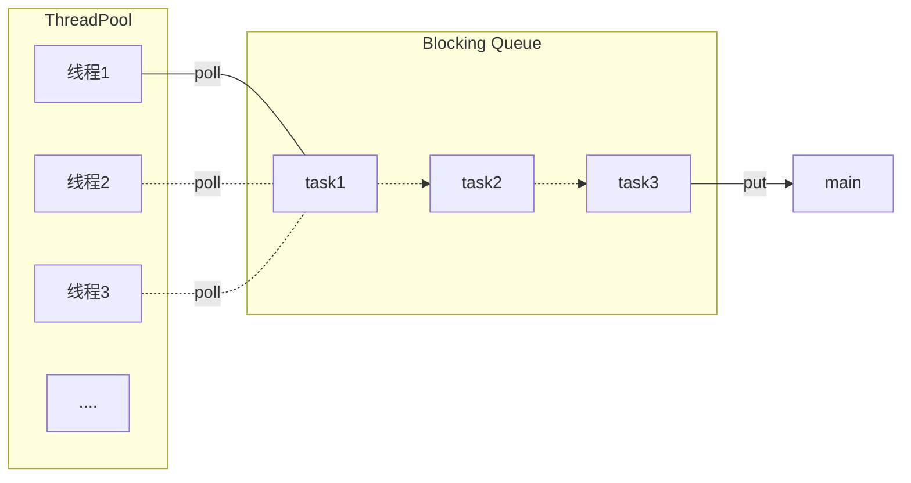

线程池工作过程：

+ 首先创建一个空的线程池
+ 当有任务进入时，首先判断线程池中的线程数是否达到了最大线程数
  + 如果没有达到，则可以新建一个线程，直接令其去执行任务
  + 如果已经有了最大核心数个线程，那么任务就需要进入任务队列等待
+ 任务进入任务队列等待被线程获取执行，当之前的线程执行完所分配的任务后，从任务队列中尝试获取之前被阻塞的任务
  + 如果任务队列不为空，则获取队首的任务执行
  + 如果任务队列为空，则将线程销毁（即从线程集合中移除）
+ 随着时间的推移，当任务队列也满了，之后的任务再想加入时，会由任务队列执行一个拒绝策略，决定对多余的任务的处置

#### 6.1.1 自定义线程池

根据上面的工作模型，自定义一个线程池，需要的元素有：ThreadPool，BlockingQueue

**BlockingQueue**，任务队列，当线程池中的线程数 == 核心线程数时，之后创建的任务由于没有多余的线程分配给它而进入阻塞状态，任务队列就是用来容纳这些任务的容器，它的属性有：

+ 队列容量，来规定队列中最多能存放多少个被阻塞的任务
+ 一个队列，用来存储被阻塞的任务
+ 一把锁，确保之后线程池中的线程从队列中获取任时的线程安全
+ 两个条件变量，当队列空时，线程不能从队列中获取任务；当队列满时，不能有任务再继续加入队列中

方法：

+ 获取队列当前的容量，即当前任务队列中有多少个任务
+ 当线程池中的线程有空闲，并且队列不为空时，去获取队首的任务
+ 当队列有空闲位置时，没有被分配线程的任务可以入队

```java
class BlockingQueue<T> {
    //1. 任务队列，存放待执行的任务
    private Deque<T> blockQueue = new ArrayDeque<>();  //ArrayDeque，一种双向链表的实现，性能比较好
    //2. 锁，保证获取任务的安全性
    private ReentrantLock lock = new ReentrantLock();
    //3. 队列满时的条件变量
    private Condition full = lock.newCondition();
    //4. 队列空时的条件变量
    private Condition empty = lock.newCondition();
    //5. 队列容量
    private int capacity;

    public BlockingQueue(int capacity) {
        this.capacity = capacity;
    }

    //获取队列容量
    public int size() {
        lock.lock();
        try {
            return blockQueue.size();
        } finally {
            lock.unlock();
        }
    }

    //阻塞获取
    public T poll() {
        //加锁
        lock.lock();

        try {
            //如果队列为空，则循环等待
            while(blockQueue.isEmpty()) {
                try {
                    empty.await();
                } catch (InterruptedException e) {
                    e.printStackTrace();
                }

            }
            T t = blockQueue.removeFirst();
            full.signal();
            return t;
        } finally {
            lock.unlock();
        }
    }

    /**
     * 带超时的阻塞获取
     * @param timeout 超时时间
     * @param unit 时间单位
     * @return
     */
    public T poll(long timeout, TimeUnit unit) {
        //加锁
        lock.lock();
        //将时间转换为纳秒
        long nanos = unit.toNanos(timeout);
        try {
            //如果队列为空，则循环等待

            while(blockQueue.isEmpty()) {
                try {
                    if(nanos <= 0) {
                        return null;
                    }
                    //awaitNanos会返回此次等待之后的剩余等待时间
                    nanos = empty.awaitNanos(nanos);
                } catch (InterruptedException e) {
                    e.printStackTrace();
                }

            }
            T t = blockQueue.removeFirst();
            full.signal();
            return t;
        } finally {
            lock.unlock();
        }
    }

    //阻塞添加
    public void put(T element) {
        lock.lock();
        try {
            //如果队列满，就不能向其中继续放元素
            while(blockQueue.size() == capacity) {
                try {
                    full.await();
                } catch (InterruptedException e) {
                    e.printStackTrace();
                }
            }
            blockQueue.addLast(element);
            empty.signal();
        } finally {
            lock.unlock();
        }
    }

}
```

**ThreadPool**，线程池，用于存放创建的线程，使用内部的线程去执行任务，它的属性有：

+ 任务队列，将后续被阻塞的任务放入任务队列中
+ 线程集合，用于存放被创建的线程
+ 核心线程数，用于表示线程集合的最大容量
+ 线程连接的超时时长，如果线程从任务从任务队列获取任务长时间没有反馈，就设置一个超时时间强制退出
+ 内部类Workers，封装一下创建的线程，更具有通用性

方法：

+ 一个执行任务的方法，如果传入的任务执行完毕，就从任务队列中去获取被阻塞的任务，如果任务队列也为空，那么就将这个线程移出线程集合

```java
class ThreadPool {
    //1. 线程池所关联的任务队列
    private BlockingQueue<Runnable> taskQueue;
    //2. 线程池包含的线程集合
    private Set<Workers> threadPool = new HashSet<>();
    //3. 核心线程数
    private int coreSize;
    //4. 线程连接的超时时间
    private int timeout;
    private TimeUnit unit;

    public ThreadPool(int coreSize, int timeout, TimeUnit unit, int capacity) {
        this.coreSize = coreSize;
        this.timeout = timeout;
        this.unit = unit;
        this.taskQueue = new BlockingQueue<>(capacity);
    }

    //线程封装
    class Workers extends Thread{
        private Runnable task;

        public Workers(Runnable task) {
            this.task = task;
        }

        //执行任务
        @Override
        public void run() {
            //当创建线程时就有任务传入，则直接执行
            //如果当前任务执行完毕，就去查看任务队列中是否有被阻塞的任务，如果有则获取任务并执行
            while(task != null || (task = taskQueue.poll()) != null) {
                try {
                    log.debug("running {}", task);
                    task.run();
                } catch (Exception e) {
                    e.printStackTrace();
                } finally {
                    //task执行完毕，置为null
                    task = null;
                }
            }

            //跳出循环就说明当前线程任务已经执行完毕，是一个空闲的线程
            synchronized (threadPool) {
                log.debug("remove thread: {}", this);
                threadPool.remove(this);
            }
        }
    }

    //执行任务
    public void execute(Runnable task) {
        synchronized (threadPool) {
            //如果线程池的大小小于核心线程数，则可以直接将这个任务交给新建的线程去执行
            if(threadPool.size() < coreSize) {
                Workers workers = new Workers(task);
                log.debug("pool add thread: {}, task: {}", workers, task);
                threadPool.add(workers);
                workers.start();
            } else{
                //否则需要进入任务阻塞队列，等待其他线程执行完毕，空闲下来之后再被执行
                log.debug("taskQueue add task: {}", task);
                taskQueue.put(task);
            }
        }
    }
}
```

测试：

```java
ThreadPool threadPool = new ThreadPool(2, 1000, TimeUnit.MILLISECONDS, 5);
for (int i = 0; i < 5; i++) {
    int j = i;
    threadPool.execute(() -> {
        log.debug("{}", j);
    });
}
输出：当线程执行完毕时，Java程序并没有结束，因为在去任务队列中获取任务时，使用的是没有超时限制的poll方法，线程如果没有获取新任务就会一直阻塞下去，导致java进程结束不了
15:51:51.765 [main] DEBUG com.concurrent.demo02.thread.ThreadPool - pool add thread: Thread[Thread-0,5,main], task: com.concurrent.demo02.thread.ThreadTest19$$Lambda$21/0x00000001000ce840@30a3107a
15:51:51.769 [main] DEBUG com.concurrent.demo02.thread.ThreadPool - pool add thread: Thread[Thread-1,5,main], task: com.concurrent.demo02.thread.ThreadTest19$$Lambda$21/0x00000001000ce840@307f6b8c
15:51:51.769 [Thread-0] DEBUG com.concurrent.demo02.thread.ThreadPool - running com.concurrent.demo02.thread.ThreadTest19$$Lambda$21/0x00000001000ce840@30a3107a
15:51:51.769 [main] DEBUG com.concurrent.demo02.thread.ThreadPool - taskQueue add task: com.concurrent.demo02.thread.ThreadTest19$$Lambda$21/0x00000001000ce840@6f195bc3
15:51:51.769 [Thread-0] DEBUG com.concurrent.demo02.thread.ThreadTest19 - 0
15:51:51.769 [main] DEBUG com.concurrent.demo02.thread.ThreadPool - taskQueue add task: com.concurrent.demo02.thread.ThreadTest19$$Lambda$21/0x00000001000ce840@51e2adc7
15:51:51.769 [main] DEBUG com.concurrent.demo02.thread.ThreadPool - taskQueue add task: com.concurrent.demo02.thread.ThreadTest19$$Lambda$21/0x00000001000ce840@1a8a8f7c
15:51:51.769 [Thread-1] DEBUG com.concurrent.demo02.thread.ThreadPool - running com.concurrent.demo02.thread.ThreadTest19$$Lambda$21/0x00000001000ce840@307f6b8c
15:51:51.770 [Thread-0] DEBUG com.concurrent.demo02.thread.ThreadPool - running com.concurrent.demo02.thread.ThreadTest19$$Lambda$21/0x00000001000ce840@6f195bc3
15:51:51.770 [Thread-0] DEBUG com.concurrent.demo02.thread.ThreadTest19 - 2
15:51:51.770 [Thread-1] DEBUG com.concurrent.demo02.thread.ThreadTest19 - 1
15:51:51.770 [Thread-0] DEBUG com.concurrent.demo02.thread.ThreadPool - running com.concurrent.demo02.thread.ThreadTest19$$Lambda$21/0x00000001000ce840@51e2adc7
15:51:51.770 [Thread-1] DEBUG com.concurrent.demo02.thread.ThreadPool - running com.concurrent.demo02.thread.ThreadTest19$$Lambda$21/0x00000001000ce840@1a8a8f7c
15:51:51.770 [Thread-0] DEBUG com.concurrent.demo02.thread.ThreadTest19 - 3
15:51:51.770 [Thread-1] DEBUG com.concurrent.demo02.thread.ThreadTest19 - 4
```

可以修改一下获取任务的方法，改成带有超时限制的poll(long timeout, TimeUnit unit)方法

```java
class Workers extends Thread{
    private Runnable task;

    public Workers(Runnable task) {
        this.task = task;
    }

    //执行任务
    @Override
    public void run() {
		//修改成带有超时限制的获取方法
        while(task != null || (task = taskQueue.poll(timeout, unit)) != null) {
            try {
                log.debug("running {}", task);
                task.run();
            } catch (Exception e) {
                e.printStackTrace();
            } finally {
                //task执行完毕，置为null
                task = null;
            }
        }

        //跳出循环就说明当前线程任务已经执行完毕，是一个空闲的线程
        synchronized (threadPool) {
            log.debug("remove thread: {}", this);
            threadPool.remove(this);
        }
    }
}

测试结果：可以看到结果比之前不带超时限制的多输出了两句，并且程序也能够自动停止
16:33:39.338 [main] DEBUG com.concurrent.demo02.thread.ThreadPool - pool add thread: Thread[Thread-0,5,main], task: com.concurrent.demo02.thread.ThreadTest19$$Lambda$21/0x00000001000ce840@30a3107a
16:33:39.341 [main] DEBUG com.concurrent.demo02.thread.ThreadPool - pool add thread: Thread[Thread-1,5,main], task: com.concurrent.demo02.thread.ThreadTest19$$Lambda$21/0x00000001000ce840@307f6b8c
16:33:39.341 [Thread-0] DEBUG com.concurrent.demo02.thread.ThreadPool - running com.concurrent.demo02.thread.ThreadTest19$$Lambda$21/0x00000001000ce840@30a3107a
16:33:39.342 [main] DEBUG com.concurrent.demo02.thread.ThreadPool - taskQueue add task: com.concurrent.demo02.thread.ThreadTest19$$Lambda$21/0x00000001000ce840@6f195bc3
16:33:39.342 [main] DEBUG com.concurrent.demo02.thread.ThreadPool - taskQueue add task: com.concurrent.demo02.thread.ThreadTest19$$Lambda$21/0x00000001000ce840@51e2adc7
16:33:39.342 [main] DEBUG com.concurrent.demo02.thread.ThreadPool - taskQueue add task: com.concurrent.demo02.thread.ThreadTest19$$Lambda$21/0x00000001000ce840@1a8a8f7c
16:33:39.342 [Thread-1] DEBUG com.concurrent.demo02.thread.ThreadPool - running com.concurrent.demo02.thread.ThreadTest19$$Lambda$21/0x00000001000ce840@307f6b8c
16:33:39.342 [Thread-1] DEBUG com.concurrent.demo02.thread.ThreadTest19 - 1
16:33:39.342 [Thread-1] DEBUG com.concurrent.demo02.thread.ThreadPool - running com.concurrent.demo02.thread.ThreadTest19$$Lambda$21/0x00000001000ce840@6f195bc3
16:33:39.342 [Thread-1] DEBUG com.concurrent.demo02.thread.ThreadTest19 - 2
16:33:39.342 [Thread-0] DEBUG com.concurrent.demo02.thread.ThreadTest19 - 0
16:33:39.342 [Thread-1] DEBUG com.concurrent.demo02.thread.ThreadPool - running com.concurrent.demo02.thread.ThreadTest19$$Lambda$21/0x00000001000ce840@51e2adc7
16:33:39.342 [Thread-1] DEBUG com.concurrent.demo02.thread.ThreadTest19 - 3
16:33:39.342 [Thread-0] DEBUG com.concurrent.demo02.thread.ThreadPool - running com.concurrent.demo02.thread.ThreadTest19$$Lambda$21/0x00000001000ce840@1a8a8f7c
16:33:39.343 [Thread-0] DEBUG com.concurrent.demo02.thread.ThreadTest19 - 4
16:33:40.355 [Thread-0] DEBUG com.concurrent.demo02.thread.ThreadPool - remove thread: Thread[Thread-0,5,main]
16:33:40.355 [Thread-1] DEBUG com.concurrent.demo02.thread.ThreadPool - remove thread: Thread[Thread-1,5,main]
```

如果线程池中的核心线程数已经创建完，并且都在执行任务，任务队列中也已经放满了，那如果再来一个任务呢，先来看一个测试：

```java
//在之前的测试基础上，创建的任务数 > 线程池的核心线程数 + 任务队列的容量
ThreadPool threadPool = new ThreadPool(2, 1000, TimeUnit.MILLISECONDS, 5);
for (int i = 0; i < 10; i++) {
    int j = i;
    threadPool.execute(() -> {
        //模拟一个线程执行任务的时间很长，否则之后线程空闲了，还是能执行完之后的任务
        TimeUtil.sleep(10);
        log.debug("{}", j);
    });
}

测试结果：再加入了五个任务之后，第六个任务就加入不了任务队列了
16:40:14.777 [main] DEBUG com.concurrent.demo02.thread.ThreadPool - pool add thread: Thread[Thread-0,5,main], task: com.concurrent.demo02.thread.ThreadTest19$$Lambda$21/0x00000001000ce840@30a3107a
16:40:14.783 [main] DEBUG com.concurrent.demo02.thread.ThreadPool - pool add thread: Thread[Thread-1,5,main], task: com.concurrent.demo02.thread.ThreadTest19$$Lambda$21/0x00000001000ce840@307f6b8c
16:40:14.783 [main] DEBUG com.concurrent.demo02.thread.BlockingQueue - taskQueue add task: com.concurrent.demo02.thread.ThreadTest19$$Lambda$21/0x00000001000ce840@6f195bc3
16:40:14.783 [main] DEBUG com.concurrent.demo02.thread.BlockingQueue - taskQueue add task: com.concurrent.demo02.thread.ThreadTest19$$Lambda$21/0x00000001000ce840@51e2adc7
16:40:14.783 [main] DEBUG com.concurrent.demo02.thread.BlockingQueue - taskQueue add task: com.concurrent.demo02.thread.ThreadTest19$$Lambda$21/0x00000001000ce840@1a8a8f7c
16:40:14.783 [main] DEBUG com.concurrent.demo02.thread.BlockingQueue - taskQueue add task: com.concurrent.demo02.thread.ThreadTest19$$Lambda$21/0x00000001000ce840@2353b3e6
16:40:14.783 [main] DEBUG com.concurrent.demo02.thread.BlockingQueue - taskQueue add task: com.concurrent.demo02.thread.ThreadTest19$$Lambda$21/0x00000001000ce840@631330c
16:40:14.783 [main] DEBUG com.concurrent.demo02.thread.BlockingQueue - waiting to add...
16:40:14.783 [Thread-1] DEBUG com.concurrent.demo02.thread.ThreadPool - running com.concurrent.demo02.thread.ThreadTest19$$Lambda$21/0x00000001000ce840@307f6b8c
16:40:14.783 [Thread-0] DEBUG com.concurrent.demo02.thread.ThreadPool - running com.concurrent.demo02.thread.ThreadTest19$$Lambda$21/0x00000001000ce840@30a3107a
```

**拒绝策略：**当线程池已满，并且任务队列也已经放满时，对于后续创建的任务的一种策略，是拒绝还是其他，由设计者决定

在原来线程池中的execute方法中：

```java
//执行任务
public void execute(Runnable task) {
    synchronized (threadPool) {
        //如果线程池的大小小于核心线程数，则可以直接将这个任务交给线程去执行
        if(threadPool.size() < coreSize) {
            Workers workers = new Workers(task);
            log.debug("pool add thread: {}, task: {}", workers, task);
            threadPool.add(workers);
            workers.start();
        } else{
            //否则需要进入任务阻塞队列，等待其他线程执行完毕，空闲下来之后再被执行
            //taskQueue.put(task);
            /*
            * 如果任务队列也满了，那么这个put方法的执行或许就直接阻塞住了，一般会有如下的策略处理多出来的任务
            * 1). 死等
            * 2). 带超时的等待
            * 3). 让调用者放弃执行任务
            * 4). 让调用者抛出异常
            * 5). 让调用者自己执行任务
            * 6) ....
            * 可以有很多的策略，如果在这里写死了，那么代码的扩展性就很差，所以，可以把这里的方式抽象为接口，由调用者自己实现
            * */
            //在这里使用这个拒绝策略，由任务队列去执行这个拒绝策略
            taskQueue.tryPut(rejectPolicy, task);
        }
    }
}
```

根据上面的思路，创建一个接口，以及在blockQueue中新增一个方法来执行这个拒绝策略，这个拒绝策略应该是在线程池创建的时候就决定的，所以这个拒绝策略可以作为线程池的一个属性，在初始化的时候传入

```java
//拒绝策略，由设计者具体去实现
@FunctionalInterface
interface RejectPolicy<T> {
    void reject(BlockingQueue<T> taskQueue, T task);
}


//由任务队列去执行这个拒绝策略
public void tryPut(RejectPolicy<T> rejectPolicy, T task) {
    lock.lock();

    try {
        //判断队列是否已满
        if(blockQueue.size() == capacity) {
            //执行拒绝策略
            rejectPolicy.reject(this, task);
        } else {
            //如果有空闲的话
            log.debug("taskQueue add task: {}", task);
            blockQueue.addLast(task);
            empty.signal();
        }
    } finally {
        lock.unlock();
    }
}


```

使用具体的代码去测试一下：

```java
ThreadPool threadPool = new ThreadPool(2, 1000, TimeUnit.MILLISECONDS, 1, (queue, task) -> {
    //其中一种拒绝策略，直接放弃，还可以是其他任何一种拒绝策略
    log.debug("give up task: {}", task);
});
for (int i = 0; i < 5; i++) {
    int j = i;
    threadPool.execute(() -> {
        TimeUtil.sleep(1);
        log.debug("{}", j);
    });
}
结果：可以看到，当任务队列满了，之后创建的任务直接被线程池放弃执行
17:18:46.303 [main] DEBUG com.concurrent.demo02.thread.ThreadPool - pool add thread: Thread[Thread-0,5,main], task: com.concurrent.demo02.thread.ThreadTest19$$Lambda$22/0x00000001000cec40@34c4973
17:18:46.307 [main] DEBUG com.concurrent.demo02.thread.ThreadPool - pool add thread: Thread[Thread-1,5,main], task: com.concurrent.demo02.thread.ThreadTest19$$Lambda$22/0x00000001000cec40@6f195bc3
17:18:46.308 [main] DEBUG com.concurrent.demo02.thread.BlockingQueue - taskQueue add task: com.concurrent.demo02.thread.ThreadTest19$$Lambda$22/0x00000001000cec40@1a8a8f7c
17:18:46.307 [Thread-0] DEBUG com.concurrent.demo02.thread.ThreadPool - running com.concurrent.demo02.thread.ThreadTest19$$Lambda$22/0x00000001000cec40@34c4973
17:18:46.308 [main] DEBUG com.concurrent.demo02.thread.ThreadTest19 - give up task: com.concurrent.demo02.thread.ThreadTest19$$Lambda$22/0x00000001000cec40@2353b3e6
17:18:46.308 [Thread-1] DEBUG com.concurrent.demo02.thread.ThreadPool - running com.concurrent.demo02.thread.ThreadTest19$$Lambda$22/0x00000001000cec40@6f195bc3
17:18:46.308 [main] DEBUG com.concurrent.demo02.thread.ThreadTest19 - give up task: com.concurrent.demo02.thread.ThreadTest19$$Lambda$22/0x00000001000cec40@631330c
17:18:47.313 [Thread-1] DEBUG com.concurrent.demo02.thread.ThreadTest19 - 1
17:18:47.313 [Thread-1] DEBUG com.concurrent.demo02.thread.ThreadPool - running com.concurrent.demo02.thread.ThreadTest19$$Lambda$22/0x00000001000cec40@1a8a8f7c
17:18:47.313 [Thread-0] DEBUG com.concurrent.demo02.thread.ThreadTest19 - 0
17:18:48.328 [Thread-1] DEBUG com.concurrent.demo02.thread.ThreadTest19 - 2
17:18:48.328 [Thread-0] DEBUG com.concurrent.demo02.thread.ThreadPool - remove thread: Thread[Thread-0,5,main]
17:18:49.337 [Thread-1] DEBUG com.concurrent.demo02.thread.ThreadPool - remove thread: Thread[Thread-1,5,main]
```

#### 6.1.2 ThreadPoolExecutor

ThreadPoolExecutor是`java.util.concurrent`包下提供的一个线程池的实现类，它的集成体系：


ThreadPoolExecutor规定了几种线程池的状态，使用一个int变量的高三位来存储，剩余的29位用来存储线程数量

```java
// runState is stored in the high-order bits
private static final int RUNNING    = -1 << COUNT_BITS;
private static final int SHUTDOWN   =  0 << COUNT_BITS;
private static final int STOP       =  1 << COUNT_BITS;
private static final int TIDYING    =  2 << COUNT_BITS;
private static final int TERMINATED =  3 << COUNT_BITS;
```

| **状态**   | **是否接收新任务** | **是否处理阻塞队列中的任务** | 高三位 | 说明                                              |
| ---------- | ------------------ | ---------------------------- | ------ | ------------------------------------------------- |
| Running    | Y                  | Y                            | 111    | 线程池正常运行的状态                              |
| Shutdown   | N                  | Y                            | 000    | 不会接收新任务，但还是会处理阻塞队列中剩余的任务  |
| Stop       | N                  | N                            | 001    | 会中断正在执行的任务，并抛弃阻塞队列中的任务      |
| Tidying    | -                  | -                            | 010    | 任务全部执行完毕，活动线程数为0，即将进入终结状态 |
| Terminated | -                  | -                            | 011    | 终结状态                                          |

**为什么使用一位整数来同时存储线程状态和线程数呢？**

其实也是可以将这两个变量分开来存储的，之所以将这两个合并在一个整型中是为了减少一次CAS赋值操作

**构造方法**

```java
//这是ThreadPoolExecutor中参数最全的一个构造方法
public ThreadPoolExecutor(int corePoolSize,
                          int maximumPoolSize,
                          long keepAliveTime,
                          TimeUnit unit,
                          BlockingQueue<Runnable> workQueue,
                          ThreadFactory threadFactory,
                          RejectedExecutionHandler handler) 
```

+ **corePoolSize：**核心线程数，线程池中最多能保留的线程数，跟之前自定义线程池中的coreSize含义相同
+ **maximumPoolSize：**最大线程数，JDK提供的线程池与之前自定义的线程池的不同之处，它允许创建临时的救急线程
+ **keepAliveTime：**救急线程的生存时间
+ **unit：**时间单位
+ **workQueue：**阻塞队列，跟之前自定义线程池中的BlockingQueue相同
+ **threadFactory：**线程工厂，可以给线程池中创建的每一个线程起个名字
+ **handler：**拒绝策略，跟之前定义的含义相同

JDK中线程池的工作方式，注意一下与自定义线程池不同的地方，也就是救急线程的使用

```mermaid
graph LR;
subgraph 线程池 c = 2, m = 3
ct1(核心线程1)
ct2(核心线程2)
mt1(救急线程1)

ct1 --> t1(任务1)
ct2 --> t2(任务2)
end

subgraph 阻塞队列 size = 2
t3(任务3)
t4(任务4)
end

style mt1 fill:#ccf,stroke:#f66,stroke-width:2px, stroke-dasharray: 5, 5
```

+ 线程池刚创建的时候，里面没有线程，当一个任务提交给线程池之后，线程池就会创建一个新线程来执行这个任务
+ 当线程池中的线程数达到corePoolSize时，且没有线程空闲，那么之后提交给线程池的任务就会被放入阻塞队列中排队等待
+ 如果阻塞队列**有容量限制**，那么当阻塞队列中的任务数达到阻塞队列的最大容量时，之后提交给线程池的任务，线程池会临时创建救急线程去执行这些多余的任务，线程池最多能够创建`maximumPoolSize - corePoolSize`个救急线程
  + 救急线程是被临时创建出来的，有存在时长的限制，也就是构造函数参数中的keepAliveTime
  + 如果救急线程执行完任务，并且达到了它所能生存的最大时间，那么救急线程就会被销毁
  + 核心线程是从创建之后便一直存在于线程池中，并没有生存时间的限制
+ 如果救急线程也创建完了，并且线程池中也没有空闲的线程，之后提交给线程池的任务就会执行handler中的拒绝策略，常用的拒绝策略有
  + AbortPolicy 让调用者抛出 RejectedExecutionException 异常，这是默认策略，JDK提供
  + CallerRunsPolicy 让调用者运行任务，JDK提供
  + DiscardPolicy 放弃本次任务，JDK提供
  + DiscardOldestPolicy 放弃队列中最早的任务，本任务取而代之，JDK提供
  + Dubbo 的实现，在抛出 RejectedExecutionException 异常之前会记录日志，并 dump 线程栈信息，方 便定位问题
  + Netty 的实现，是创建一个新线程来执行任务
  + ActiveMQ 的实现，带超时等待（60s）尝试放入队列，类似我们之前自定义的拒绝策略
  + PinPoint 的实现，它使用了一个拒绝策略链，会逐一尝试策略链中每种拒绝策略


**newFixedThreadPool**

```java
public static ExecutorService newFixedThreadPool(int nThreads, ThreadFactory threadFactory) {
    return new ThreadPoolExecutor(nThreads, nThreads,
                                  0L, TimeUnit.MILLISECONDS,
                                  new LinkedBlockingQueue<Runnable>(),
                                  threadFactory);
}
```

特点：

+ 核心线程数 = 最大线程数，没有救急线程
+ 阻塞队列是无界的，可以放任意数量的任务

测试：

```java
ExecutorService pool = Executors.newFixedThreadPool(2, new ThreadFactory() {
    //自定义的一个线程工厂，只是为了规定一下线程池中创建线程的名称
    private AtomicInteger threadNumber = new AtomicInteger(1);

    @Override
    public Thread newThread(Runnable r) {
        return new Thread(r, "pool_t" + threadNumber.getAndIncrement());
    }
});

for(int i = 0; i < 5; i++) {
    int j = i;
    pool.execute(() -> {
        log.debug("{}", j);
    });
}
输出：
15:47:31.921 [pool_t1] DEBUG com.concurrent.demo02.thread.ThreadTest20 - 0
15:47:31.930 [pool_t1] DEBUG com.concurrent.demo02.thread.ThreadTest20 - 2
15:47:31.930 [pool_t1] DEBUG com.concurrent.demo02.thread.ThreadTest20 - 3
15:47:31.921 [pool_t2] DEBUG com.concurrent.demo02.thread.ThreadTest20 - 1
15:47:31.931 [pool_t1] DEBUG com.concurrent.demo02.thread.ThreadTest20 - 4
```

适用场合：适用于任务数量已知，并且每个任务相对来说比较耗时的情况


**newCachedThreadPool**

```java
public static ExecutorService newCachedThreadPool() {
    return new ThreadPoolExecutor(0, Integer.MAX_VALUE,
                                  60L, TimeUnit.SECONDS,
                                  new SynchronousQueue<Runnable>());
}
```

特点：

+ 核心线程数为0，创建出来的全部是救急线程，并且可以创建Integer.MAX_VALUE个救急线程（可以近似看成没有数量限制）
+ 每个救急线程的生存时间是60s
+ 阻塞队列采用`SynchronousQueue<Runnable>`实现，这个队列没有容量，并且如果没有线程来取任务，任务是放不进去的（一手交钱、一手交货）

适用场合： 整个线程池表现为线程数会根据任务量不断增长，没有上限，当任务执行完毕，空闲 1分钟后释放线程。 适合任务数比较密集，但每个任务执行时间较短的情况


**newSingleThreadExecutor**

```java
public static ExecutorService newSingleThreadExecutor() {
    return new FinalizableDelegatedExecutorService
        (new ThreadPoolExecutor(1, 1,
                                0L, TimeUnit.MILLISECONDS,
                                new LinkedBlockingQueue<Runnable>()));
}
```

特点：

+ 线程池中只有一个线程，并且没有救急线程
+ 创建的线程池被进一步封装过

先来看测试实例：

```java
ExecutorService pool = Executors.newSingleThreadExecutor();

pool.execute(() -> {
    log.debug("1");
    //模拟任务执行过程中的异常
    int i = 1 / 0;
});
pool.execute(() -> {
    log.debug("2");
});
pool.execute(() -> {
    log.debug("3");
});
pool.execute(() -> {
    log.debug("4");
});

输出：注意输出时的线程名
16:40:18.020 [pool-1-thread-1] DEBUG com.concurrent.demo02.thread.ThreadTest20 - 1
Exception in thread "pool-1-thread-1" java.lang.ArithmeticException: / by zero
16:40:18.027 [pool-1-thread-2] DEBUG com.concurrent.demo02.thread.ThreadTest20 - 2
16:40:18.028 [pool-1-thread-2] DEBUG com.concurrent.demo02.thread.ThreadTest20 - 3
16:40:18.028 [pool-1-thread-2] DEBUG com.concurrent.demo02.thread.ThreadTest20 - 4
```

一些注意的点：

+ 单线程线程池在线程执行过程中出现了异常，会再创建一个线程，并且抛弃之前出异常的线程，保证线程池中始终只有一个正常工作的线程
+ `Executors.newSingleThreadExecutor()`中线程数始终为1，并且不能被修改，不同于使用`Executors.newFixedThreadPool(1)`，这样创建了固定大小的线程池之后，线程池中核心线程的数目可以通过set方法重置


**任务提交**

`ExecutorService`中提供了多种任务提交的方法，之前的`executor()`只是其中的一种

```java
void execute(Runnable command);
//传入Callable任务，其中的call方法有返回值，可以接收返回值
<T> Future<T> submit(Callable<T> task);
//传入一个任务集合，执行tasks中所有的任务
<T> List<Future<T>> invokeAll(Collection<? extends Callable<T>> tasks)
    throws InterruptedException;
//带超时时间的，如果在规定的时间内没有执行完成，会抛弃所有任务的执行
<T> List<Future<T>> invokeAll(Collection<? extends Callable<T>> tasks,
                              long timeout, TimeUnit unit)
    throws InterruptedException;
//执行任务列表中的一个任务，只要有一个任务执行结束，就以那个任务的执行结果作为返回结果，并抛弃其余任务
<T> T invokeAny(Collection<? extends Callable<T>> tasks)
    throws InterruptedException, ExecutionException;
//带超时时间的
<T> T invokeAny(Collection<? extends Callable<T>> tasks,
                long timeout, TimeUnit unit)
    throws InterruptedException, ExecutionException, TimeoutException;
```

`submit()`测试：

```java
ExecutorService pool = Executors.newFixedThreadPool(2);
Future<String> result = pool.submit(() -> {
    log.debug("begin...");
    log.debug("1");
    log.debug("end");
    return "1";
});

TimeUtil.sleep(1);
try {
    log.debug("{}", result.get());
} catch (Exception e) {
    e.printStackTrace();
}

输出：
17:09:54.157 [pool-1-thread-1] DEBUG com.concurrent.demo02.thread.ThreadTest20 - begin...
17:09:54.161 [pool-1-thread-1] DEBUG com.concurrent.demo02.thread.ThreadTest20 - 1
17:09:54.161 [pool-1-thread-1] DEBUG com.concurrent.demo02.thread.ThreadTest20 - end
17:09:55.166 [main] DEBUG com.concurrent.demo02.thread.ThreadTest20 - 1
```

`invokeAll()`测试：

```java
ExecutorService pool = Executors.newFixedThreadPool(2);
List<Future<String>> futureList = pool.invokeAll(Arrays.asList(
        () -> {
            log.debug("begin t1");
            sleep(1000);
            log.debug("t1 end");
            return "1";
        }, () -> {
            log.debug("begin t2");
            sleep(500);
            log.debug("t2 end");
            return "2";
        }, () -> {
            log.debug("begin t3");
            sleep(2000);
            log.debug("t3 end");
            return "3";
        }
));
futureList.forEach(f -> {
    try {
        log.debug("{}", f.get());
    } catch (Exception e) {
        e.printStackTrace();
    }
});

输出：
17:15:07.583 [pool-1-thread-1] DEBUG com.concurrent.demo02.thread.ThreadTest20 - begin t1
17:15:07.583 [pool-1-thread-2] DEBUG com.concurrent.demo02.thread.ThreadTest20 - begin t2
17:15:08.096 [pool-1-thread-2] DEBUG com.concurrent.demo02.thread.ThreadTest20 - t2 end
17:15:08.096 [pool-1-thread-2] DEBUG com.concurrent.demo02.thread.ThreadTest20 - begin t3
17:15:08.587 [pool-1-thread-1] DEBUG com.concurrent.demo02.thread.ThreadTest20 - t1 end
17:15:10.106 [pool-1-thread-2] DEBUG com.concurrent.demo02.thread.ThreadTest20 - t3 end
17:15:10.107 [main] DEBUG com.concurrent.demo02.thread.ThreadTest20 - 1
17:15:10.110 [main] DEBUG com.concurrent.demo02.thread.ThreadTest20 - 2
17:15:10.110 [main] DEBUG com.concurrent.demo02.thread.ThreadTest20 - 3
```

`invokeAny()`测试

```java
ExecutorService pool = Executors.newFixedThreadPool(2);
String s = pool.invokeAny(Arrays.asList(
        () -> {
            log.debug("begin t1");
            sleep(1000);
            log.debug("t1 end");
            return "1";
        }, () -> {
            log.debug("begin t2");
            sleep(500);
            log.debug("t2 end");
            return "2";
        }, () -> {
            log.debug("begin t3");
            sleep(2000);
            log.debug("t3 end");
            return "3";
        }
));
log.debug("{}", s);

输出：只有第二个任务执行完毕了，其他任务虽然开始了，但并没有结束
17:17:33.002 [pool-1-thread-1] DEBUG com.concurrent.demo02.thread.ThreadTest20 - begin t1
17:17:33.002 [pool-1-thread-2] DEBUG com.concurrent.demo02.thread.ThreadTest20 - begin t2
17:17:33.509 [pool-1-thread-2] DEBUG com.concurrent.demo02.thread.ThreadTest20 - t2 end
17:17:33.509 [pool-1-thread-2] DEBUG com.concurrent.demo02.thread.ThreadTest20 - begin t3
17:17:33.509 [main] DEBUG com.concurrent.demo02.thread.ThreadTest20 - 2
```

`shotdown()`方法

```java
//showdown()方法定义在ExecutorService接口中，下面是ThreadPoolExecutor中的实现
/*
当线程池调用shutdown方法之后
 - 线程池不会接收新的任务
 - 但会将正在执行的、在阻塞队列中的任务执行完
 - 不会阻塞调用线程的执行，比如说主线程调用了pool.shutdown()，调用完之后，主线程仍然会继续执行，并不会等待
*/
public void shutdown() {
    final ReentrantLock mainLock = this.mainLock;
    mainLock.lock();
    try {
        checkShutdownAccess();
        //修改线程池的状态为SHUTDOWN
        advanceRunState(SHUTDOWN);
        //打断空闲的线程
        interruptIdleWorkers();
        onShutdown(); // hook for ScheduledThreadPoolExecutor
    } finally {
        mainLock.unlock();
    }
    // 尝试终结(没有运行的线程可以立刻终结，如果还有运行的线程也不会等)
    tryTerminate();
}
```

测试：

```java
ExecutorService pool = Executors.newFixedThreadPool(2);
Future<Integer> result1 = pool.submit(() -> {
    log.debug("task1 begin...");
    TimeUtil.sleep(1);
    log.debug("task1 end...");
    return 1;
});
Future<Integer> result2 = pool.submit(() -> {
    log.debug("task2 begin...");
    TimeUtil.sleep(1);
    log.debug("task2 end...");
    return 2;
});
Future<Integer> result3 = pool.submit(() -> {
    log.debug("task3 begin...");
    TimeUtil.sleep(1);
    log.debug("task3 end...");
    return 3;
});

log.debug("shutdown");
pool.shutdown();
//如果在shutdown之后再想提交任务，则报错
Future<Integer> result4 = pool.submit(() -> {
    log.debug("task4 begin...");
    TimeUtil.sleep(1);
    log.debug("task4 end...");
    return 3;
});
log.debug("other code execute...");

输出：在调用shutdown方法之后，主线程仍然可以继续执行，并且任务队列中的其他任务也可以线程池处理
16:41:30.348 [pool-1-thread-2] DEBUG com.concurrent.demo02.thread.ThreadTest20 - task2 begin...
16:41:30.348 [pool-1-thread-1] DEBUG com.concurrent.demo02.thread.ThreadTest20 - task1 begin...
16:41:30.348 [main] DEBUG com.concurrent.demo02.thread.ThreadTest20 - shutdown
16:41:30.355 [main] DEBUG com.concurrent.demo02.thread.ThreadTest20 - other code execute...
//但在调用shutdown之后，如果还想继续提交任务，则会报错
Exception in thread "main" java.util.concurrent.RejectedExecutionException: Task java.util.concurrent.FutureTask@2a556333[Not completed, task = com.concurrent.demo02.thread.ThreadTest20$$Lambda$24/0x00000001000ce040@480bdb19] rejected from java.util.concurrent.ThreadPoolExecutor@7d70d1b1[Shutting down, pool size = 2, active threads = 2, queued tasks = 1, completed tasks = 0]
16:41:31.364 [pool-1-thread-2] DEBUG com.concurrent.demo02.thread.ThreadTest20 - task2 end...
16:41:31.364 [pool-1-thread-1] DEBUG com.concurrent.demo02.thread.ThreadTest20 - task1 end...
16:41:31.364 [pool-1-thread-1] DEBUG com.concurrent.demo02.thread.ThreadTest20 - task3 begin...
16:41:32.373 [pool-1-thread-1] DEBUG com.concurrent.demo02.thread.ThreadTest20 - task3 end...
```

`shotdownNow()`方法

```java
/*
当线程池调用shutdownNow()方法之后
 - 线程池的状态切换为STOP
 - 会将阻塞队列中的任务返回
 - 调用interrupt方法打断正在执行的线程
*/
public List<Runnable> shutdownNow() {
    List<Runnable> tasks;
    final ReentrantLock mainLock = this.mainLock;
    mainLock.lock();
    try {
        checkShutdownAccess();
        //修改线程池的状态
        advanceRunState(STOP);
        //打断所有线程
        interruptWorkers();
        //获取阻塞队列中的任务
        tasks = drainQueue();
    } finally {
        mainLock.unlock();
    }
    //尝试终结
    tryTerminate();
    return tasks;
}
```

#### 6.1.3 工作线程模式

**基本定义：**让有限的工作线程（Worker Thread）来轮流异步处理无限多的任务。也可以将其归类为分工模式，它的典型实现
就是线程池，也体现了经典设计模式中的享元模式。

> 就好比说餐厅服务员，需要轮流处理每位客人的点餐任务

不同任务类型应该使用不同的线程池，这样能够避免饥饿，并能提升效率

**线程饥饿现象**

这里的线程饥饿与之前在哲学家进餐问题中遇到的线程饥饿现象有所不同，这里的线程饥饿现象指的是线程池中的线程数不足以处理提交的任务

固定大小的线程池就会出现线程饥饿现象，用下面的场景来说明

+ 假设服务员是线程中的线程，服务员能够干的事情：点餐和做菜，此时就相当于一个线程可以进行多个阶段的工作
+ 点餐和做菜是两个阶段的工作：
  + 客人点餐，必须先点完餐，等菜做好之后上菜，在此期间，点餐的服务员需要等待
  + 服务员做菜
+ 当店里只有一个顾客的时候，服务员A处理点餐并，服务员B去做菜，这样运行并没有问题
+ 但如果店里来了两个客人，服务员A和B都去处理点餐，没有人做菜，那么服务员A与B就只能傻等

```java
static final List<String> MENU = Arrays.asList("地三鲜", "宫保鸡丁", "辣子鸡丁", "烤鸡翅");
static Random RANDOM = new Random();
static String cooking() {
    return MENU.get(RANDOM.nextInt(MENU.size()));
}
public static void main(String[] args) {
    ExecutorService pool = Executors.newFixedThreadPool(2);
    pool.execute(() -> {
        log.debug("处理点餐...");
        Future<String> f = pool.submit(() -> {
            log.debug("做菜...");
            return cooking();
        });
        try {
            log.debug("上菜：{}", f.get());
        } catch (Exception e) {
            e.printStackTrace();
        }
    });
    pool.execute(() -> {
        log.debug("处理点餐...");
        Future<String> f = pool.submit(() -> {
            log.debug("做菜...");
            return cooking();
        });
        try {
            log.debug("上菜：{}", f.get());
        } catch (Exception e) {
            e.printStackTrace();
        }
    });
}
输出：两个线程都去处理点餐，并没有线程去做菜
17:12:41.452 [pool-1-thread-1] DEBUG com.concurrent.demo02.thread.ThreadTest21 - 处理点餐...
17:12:41.452 [pool-1-thread-2] DEBUG com.concurrent.demo02.thread.ThreadTest21 - 处理点餐...
```

注意，虽然程序不能继续向下运行了，但这并不是死锁，可以使用jconsole检测一下


解决方法：把点餐线程和做菜线程分到两个不同的线程池中，也就是雇一批服务员，一批厨师

```java
//创建一个线程池，专门负责点餐服务
ExecutorService waitPool = Executors.newFixedThreadPool(1);
//再创建一个线程池，专门负责做菜任务
ExecutorService cookPool = Executors.newFixedThreadPool(1);

waitPool.execute(() -> {
    log.debug("处理点餐...");
    Future<String> f = cookPool.submit(() -> {
        log.debug("做菜...");
        return cooking();
    });
    try {
        log.debug("上菜：{}", f.get());
    } catch (Exception e) {
        e.printStackTrace();
    }
});
waitPool.execute(() -> {
    log.debug("处理点餐...");
    Future<String> f = cookPool.submit(() -> {
        log.debug("做菜...");
        return cooking();
    });
    try {
        log.debug("上菜：{}", f.get());
    } catch (Exception e) {
        e.printStackTrace();
    }
});
输出：
17:17:04.344 [pool-1-thread-1] DEBUG com.concurrent.demo02.thread.ThreadTest21 - 处理点餐...
17:17:04.350 [pool-2-thread-1] DEBUG com.concurrent.demo02.thread.ThreadTest21 - 做菜...
17:17:04.350 [pool-1-thread-1] DEBUG com.concurrent.demo02.thread.ThreadTest21 - 上菜：辣子鸡丁
17:17:04.352 [pool-1-thread-1] DEBUG com.concurrent.demo02.thread.ThreadTest21 - 处理点餐...
17:17:04.353 [pool-2-thread-1] DEBUG com.concurrent.demo02.thread.ThreadTest21 - 做菜...
17:17:04.353 [pool-1-thread-1] DEBUG com.concurrent.demo02.thread.ThreadTest21 - 上菜：宫保鸡丁
```

**如何选择合适大小的线程数量**

线程数太少的线程池会导致程序不能充分地利用系统资源，容易导致线程饥饿

线程数太多的线程池会导致更频繁地上下文切换，损失性能，并且会占用更多的内存

一般有两种方式来计算线程数量：

+ CPU密集型运算：通常采用 `cpu 核数 + 1` 能够实现最优的 CPU 利用率，+1 是保证当线程由于页缺失故障（操作系统）或其它原因
  导致暂停时，额外的这个线程就能顶上去，保证 CPU 时钟周期不被浪费

+ IO密集型运算：CPU并不总是处于繁忙的情况下，例如，执行IO操作或者进行远程RPC调用时，CPU就会闲下来了

  经验公式：`线程数 = 核数 * 期望 CPU 利用率 * 总时间(CPU计算时间+等待时间) / CPU 计算时间`

  例如 4 核 CPU 计算时间是 50% ，其它等待时间是 50%，期望 cpu 被 100% 利用，套用公式 `4 * 100% * 100% / 50% = 8`，即需要8个线程

**定时任务**

```java
//问题：如何让线程在每周四18:00:00定时执行任务

//获取当前的时间
LocalDateTime now = LocalDateTime.now();

//获取本周四18:00:00的时间，根据now的时间进行修改
LocalDateTime thursday = now.withHour(18).withMinute(0).withSecond(0).withNano(0).with(DayOfWeek.THURSDAY);
//如果当前的时间超过了本周四的18:00:00，比如现在是本周的周五，需要获取的是下周周四的时间
if(now.compareTo(thursday) >= 0) {
    //在thursday的基础上增加一周即可
    thursday = now.plusWeeks(1);
}
log.debug("now: {}", now);
log.debug("thursday: {}", thursday);

long initialDelay = Duration.between(now, thursday).toMillis();
long period = 1000 * 60 * 60 * 24 * 7;
//创建定时线程池
ScheduledExecutorService pool = Executors.newScheduledThreadPool(2);
/*
  Runnable command: 待执行的任务
  long initialDelay: 延时时间
  long period: 时间间隔
  TimeUnit unit: 时间单位
 */
//以毫秒为单位
pool.scheduleAtFixedRate(() -> {
    log.debug("running...");
}, initialDelay, period, TimeUnit.MILLISECONDS);
```

#### 6.1.4 实例：Tomcat线程池

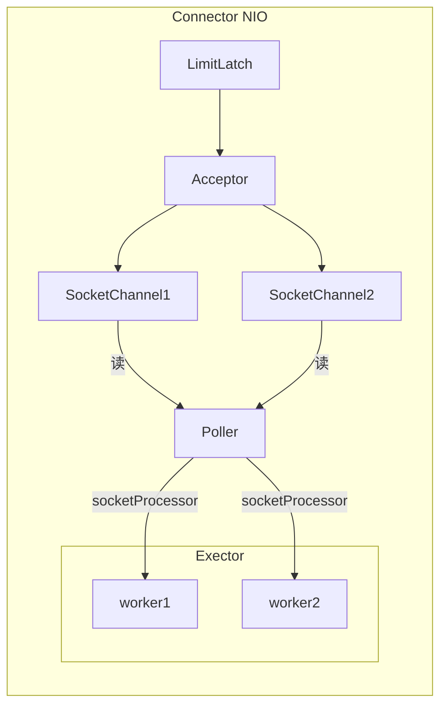

上面是Tomcat中Connector的结构

+ LimitLatch用来限流，可以控制最大连接个数
+ Acceptor只负责接收新的socket连接
+ Poller只负责监听socket channel是否有可读IO时间
+ 如果Poller监听到可读事件，将事件封装成一个任务对象（socketProcessor），提交给Executor线程池处理
+ Executor线程池中的工作线程最终负责处理请求

Tomcat中的Connector结构就体现了之前的工作线程模式，每个线程分工合作，并不会出现线程饥饿的现象

> Tomcat线程池扩展了ThreadPoolExecutor，行为稍有不同
>
> + 如果总线程数达到了maximumPoolSize并不会立即执行拒绝策略，而是再次尝试将任务放入任务队列，如果还失败，才抛出异常
>
> ```java
> public void execute(Runnable command, long timeout, TimeUnit unit) {
>      submittedCount.incrementAndGet();
>      try {
>      	super.execute(command);
>      } catch (RejectedExecutionException rx) {
>          //TaskQueue是Tomcat对任务队列的一个改进
>          if (super.getQueue() instanceof TaskQueue) {
>              final TaskQueue queue = (TaskQueue)super.getQueue();
>              try {
>                  //尝试将任务再次放入任务队列
>                  if (!queue.force(command, timeout, unit)) {
>                  submittedCount.decrementAndGet();
>                      //如果这次还是没放进去，那么就报错
>                  throw new RejectedExecutionException("Queue capacity is full.");
>              }
>              } catch (InterruptedException x) {
>                  submittedCount.decrementAndGet();
>                  Thread.interrupted();
>                  throw new RejectedExecutionException(x);
>              }
>          } else {
>              submittedCount.decrementAndGet();
>              throw rx;
>      	}
>      }
> }
> 
> ```
>
> 

Tomcat线程池的配置：**Connector配置**

| 配置项                | 默认值 | 说明             |
| --------------------- | ------ | ---------------- |
| `acceptorThreadCount` | 1      | acceptor线程数量 |
| `pollerThreadCount`   | 1      | poller线程数量   |
| `minSpareThreads `    | 10     | 核心线程数       |
| `maxThreads`          | 200    | 最大线程数       |
| `executor`            | -      | Executor的名称   |

**Executor配置**

| 配置项                    | 默认值              | 说明                                           |
| ------------------------- | ------------------- | ---------------------------------------------- |
| `threadPriority `         | 5                   | 线程优先级                                     |
| `daemon`                  | true                | 是否为守护线程                                 |
| `minSpareThreads`         | 25                  | 核心线程数                                     |
| `maxThreads`              | 200                 | 最大线程数                                     |
| `maxIdleTime`             | 60000               | 救急线程的生存事件，单位为毫秒，即1min（默认） |
| `maxQueueSize`            | `Integer.MAX_VALUE` | 任务队列的长度，建议修改                       |
| `prestartminSpareThreads` | false               | 核心线程是否在服务器启动时即创建               |

> Tomcat中的线程池与JDK中的线程池有所不同，在提交任务数量大于核心线程数时，是先会创建救急线程去处理多出来的任务，如果再有任务进来，再考虑放进任务队列中

#### 6.1.5 Fork / Join线程池

`Fork/Join` 是 JDK 1.7 加入的新的线程池实现，它体现的是一种分治思想，适用于能够进行任务拆分的 cpu 密集型
运算，`Fork/Join` 在分治的基础上加入了多线程，可以把每个任务的分解和合并交给不同的线程来完成，进一步提升了运
算效率，`Fork/Join` 默认会创建与 cpu 核心数大小相同的线程池

> 所谓的任务拆分，是将一个大任务拆分为算法上相同的小任务，直至不能拆分可以直接求解。跟递归相关的一些计 算，如归并排序、斐波那契数列、都可以用分治思想进行求解

基本使用：

```java
//创建线程池，默认CPU核心数大小的线程池
ForkJoinPool pool = new ForkJoinPool();
Integer invoke = pool.invoke(new MyTask(5));
log.debug("result: {}", invoke);

//任务：求和 1 - n之间整数的和
@Slf4j
class MyTask extends RecursiveTask<Integer> {

    private int n;

    public MyTask(int n) {
        this.n = n;
    }

    @Override
    protected Integer compute() {
        // 如果 n 已经为 1，可以求得结果了
        if (n == 1) {
            log.debug("join() {}", n);
            return n;
        }

        // 将任务进行拆分(fork)
        MyTask t1 = new MyTask(n - 1);
        t1.fork();
        log.debug("fork() {} + {}", n, t1);

        // 合并(join)结果
        int result = n + t1.join();
        log.debug("join() {} + {} = {}", n, t1, result);
        return result;
    }
}

输出：可以从打印的结果看出，中间结果是由多个线程执行的
17:34:57.540 [ForkJoinPool-1-worker-3] DEBUG com.concurrent.demo02.thread.MyTask - fork() 5 + com.concurrent.demo02.thread.MyTask@64843d37
17:34:57.540 [ForkJoinPool-1-worker-5] DEBUG com.concurrent.demo02.thread.MyTask - fork() 4 + com.concurrent.demo02.thread.MyTask@6f38084c
17:34:57.540 [ForkJoinPool-1-worker-11] DEBUG com.concurrent.demo02.thread.MyTask - join() 1
17:34:57.540 [ForkJoinPool-1-worker-7] DEBUG com.concurrent.demo02.thread.MyTask - fork() 3 + com.concurrent.demo02.thread.MyTask@29d304a0
17:34:57.540 [ForkJoinPool-1-worker-9] DEBUG com.concurrent.demo02.thread.MyTask - fork() 2 + com.concurrent.demo02.thread.MyTask@5a52d19c
17:34:57.547 [ForkJoinPool-1-worker-9] DEBUG com.concurrent.demo02.thread.MyTask - join() 2 + com.concurrent.demo02.thread.MyTask@5a52d19c = 3
17:34:57.548 [ForkJoinPool-1-worker-7] DEBUG com.concurrent.demo02.thread.MyTask - join() 3 + com.concurrent.demo02.thread.MyTask@29d304a0 = 6
17:34:57.548 [ForkJoinPool-1-worker-5] DEBUG com.concurrent.demo02.thread.MyTask - join() 4 + com.concurrent.demo02.thread.MyTask@6f38084c = 10
17:34:57.548 [ForkJoinPool-1-worker-3] DEBUG com.concurrent.demo02.thread.MyTask - join() 5 + com.concurrent.demo02.thread.MyTask@64843d37 = 15
17:34:57.548 [main] DEBUG com.concurrent.demo02.thread.ThreadTest23 - result: 15
```

如果去分析这个输出，其实可以发现，虽然有多个线程去执行中间任务，但前面一个线程都需要去等待后面一个线程的返回结果才能继续向前返回，所以，仔细看来，还是串行执行的

可以改进一下分组的方式，之前是类似于递归的方式逐渐将sum(5)减少成sum(4)，sum(3)...前一个任务与后一个任务耦合度太高，导致最后是串行执行的。现在改进一下分组方式

```java
protected Integer compute() {
        // 5, 5
        if (begin == end) {
            log.debug("join() {}", begin);
            return begin;
        }

        if (end - begin == 1) {
            log.debug("join() {} + {} = {}", begin, end, end + begin);
            return end + begin;
        }

        // 1 5
        int mid = (end + begin) / 2; // 3
        MyTask t1 = new MyTask(begin, mid); // 1,3
        t1.fork();
        MyTask t2 = new MyTask(mid + 1, end); // 4,5
        t2.fork();
        log.debug("fork() {} + {} = ?", t1, t2);
        int result = t1.join() + t2.join();
        log.debug("join() {} + {} = {}", t1, t2, result);
        return result;
    }
```

其实也能够看出来，`fork()/join()`线程池类似于算法中的分治算法，只不过其中一些子问题是通过多线程来解决的，执行效率的高低也取决于子问题的分法，如果分离出来的子问题前后依赖性不大，执行效率就比较高


### 6.2 JUC包

#### 6.2.1 AQS

AQS，全称`AbstractQueuedSynchronizer`，是阻塞式锁和相关的同步器工具框架

+ 内部使用一个state属性来表示资源的状态（独占模式和共享模式），子类需要定义如何维护这个状态，控制如何获取锁和释放锁
  + `getState()` - 获取state状态
  + `setState(int arg)` - 设置state状态
  + `compareAndSetState(int expire, int newState)` - cas机制设置state状态
  + 独占模式是只有一个线程能够访问资源，而共享模式允许多个线程访问资源
+ 提供了基于FIFO的等待队列，类似于Monitor的EntryList
+ 使用条件变量来实现等待、唤醒机制，支持多个条件变量，类似于Monitor的WaitSet

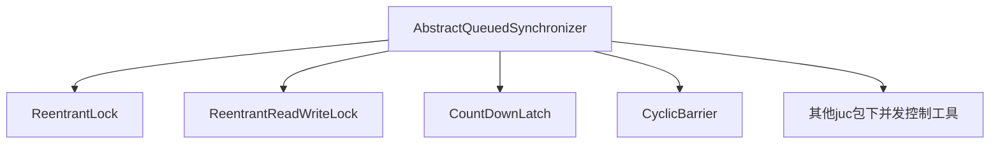


部分源码：

```java
public abstract class AbstractQueuedSynchronizer extends AbstractOwnableSynchronizer
    implements java.io.Serializable {
	//默认state为0
    protected AbstractQueuedSynchronizer() { }
    
    ......
    
    private volatile int state;

    protected final int getState() {
        return state;
    }

    protected final void setState(int newState) {
        state = newState;
    }

    protected final boolean compareAndSetState(int expect, int update) {
        return STATE.compareAndSet(this, expect, update);
    }
    
    ......
}
```

> AQS的主要使用方式是继承，子类通过继承同步器并实现它的抽象方法来管理同步状态
>
> 子类推荐被定义为自定义同步组件的静态内部类
>
> AQS自身没有实现任何同步接口，它仅仅是定义了若干同步状态获取和释放的方法来供自定义同步组件使用，同步器既可以支持独占式地获取同步状态，也可以支持共享式地获取同步状态，这样方便实现不同类型的同步组件
>
> AQS是实现锁的关键，在锁的实现中聚合同步器，利用同步器实现锁的语义，锁和同步器很好地隔离了使用者和实现者所需关注的领域

其子类主要实现：

+ `boolean tryAcquire()`：尝试获取锁
+ `boolean tryRelease()`：尝试释放锁
+ `int tryAcquireShared()`：尝试获取共享模式下的锁
+ `boolean tryReleaseShared()`：尝试释放共享模式下的锁
+ `boolean isHeldExclusively()`：是否获取了独占模式下的锁

应用：自定义不可重入锁

```java
//自定义锁，实现Lock接口（不可重入）
class MyLock implements Lock{

    private MySync sync = new MySync();

    //自定义同步器类
    class MySync extends AbstractQueuedSynchronizer {
        //定义state = 0表示没有获取锁，state = 1表示获取了锁
        //尝试获取锁
        @Override
        protected boolean tryAcquire(int arg) {
            //使用cas机制更改state状态
            if(compareAndSetState(0, 1)) {
                //如果加上了锁，并设置锁的持有者为当前线程
                setExclusiveOwnerThread(Thread.currentThread());
                return true;
            }
            return false;
        }

        //尝试释放锁
        @Override
        protected boolean tryRelease(int arg) {
            setExclusiveOwnerThread(null);
            setState(0);
            return true;
        }

        //是否持有独占锁
        @Override
        protected boolean isHeldExclusively() {
            return getState() == 1;
        }

        //返回条件变量
        public Condition newCondition() {
            return new ConditionObject();
        }
    }

    //上锁方法，不成功则进入等待队列
    @Override
    public void lock() {
        //acquire方法会间接调用tryAcquire方法，参数暂时可以忽略
        sync.acquire(1);
    }

    //可打断上锁
    @Override
    public void lockInterruptibly() throws InterruptedException {
        sync.acquireInterruptibly(1);
    }

    //尝试加锁（尝试一次）
    @Override
    public boolean tryLock() {
        return sync.tryAcquire(1);
    }

    //带超时的尝试加锁
    @Override
    public boolean tryLock(long time, TimeUnit unit) throws InterruptedException {
        return sync.tryAcquireNanos(1, unit.toNanos(time));
    }

    //解锁
    @Override
    public void unlock() {
        //release方法会间接调用tryRelease方法
        sync.release(1);
    }

    //创建条件变量
    @Override
    public Condition newCondition() {
        return sync.newCondition();
    }
}
```

在实现自定义同步组件时，将会调用AQS提供的模板方法：

| 方法名称                             | 描述                                                         |
| ------------------------------------ | ------------------------------------------------------------ |
| `void acquire(int arg)`              | 获取同步锁，如果当前线程获取锁成功，则由该方法返回，否则线程将会进入同步队列等待，该方法将会调用重写的`tryAcquire(int arg)`方法 |
| `void acquireInterruptibly(int arg)` | 与`void acquire(int arg)`相同，但是该方法会响应中断，当先线程未获取到同步状态而进入同步队列中，如果当前线程被中断，则会抛出`InterruptedException`并返回 |
| `boolean release(int arg)`           | 释放啊同步锁，该方法会在释放同步锁之后，将同步队列中第一个结点包含的线程唤醒 |


#### 6.2.2 ReentrantLock原理

+ 实现`Lock`接口
+ 内部维护一个继承于`AbstractQueuedSynchronizer`的`Sync`抽象同步器
+ 抽象类`Sync`有两个子类：`NonfairSync`（非公平锁）和`FairSync`（公平锁）


> 公平锁：是指多个线程按照申请锁的顺序来获取锁，类似于排队打饭，先来后到
>
> 非公平锁：指多个线程获取锁的顺序并不是按照申请锁的顺序，有可能后申请锁的线程比先申请锁的线程优先获取锁，在高并发的情况下，有可能会造成优先级反转或者线程饥饿的现象
>
> 对于非公平锁，有新线程想获取锁可以直接尝试，如果尝试失败，才采用类似公平锁的方式进入等待队列等待

**非公平锁原理**

ReentrantLock的构造器：默认使用的是非公平锁

```java
private final Sync sync;
public ReentrantLock() {
    sync = new NonfairSync();
}

//可以设置为公平锁
public ReentrantLock(boolean fair) {
    sync = fair ? new FairSync() : new NonfairSync();
}
```

`lock()`方法

```java
public void lock() {
    sync.acquire(1);
}
//acquire()方法
public final void acquire(int arg) {
        if (!tryAcquire(arg) &&
            acquireQueued(addWaiter(Node.EXCLUSIVE), arg))
            selfInterrupt();
    }
```

如果没有线程竞争锁，那么锁的owner就是当前线程，如果出现了竞争


Thread - 1尝试去获得锁

+ 使用CAS机制尝试将锁的state状态修改为1，结果失败
+ 调用`tryAcquire()`方法，但此时state仍然是1，再次失败
  + 此时`tryAcquire(arg)`方法返回false，取反之后返回true
  + 需要进一步判断'&&'之后的逻辑，执行`acquireQueued(addWaiter(Node.EXCLUSIVE), arg)`
+ 首先执行`addWaiter(Node.EXCLUSIVE)`方法，构造Node队列（双向链表，即阻塞队列）
  + Node是`AbstractQueuedSynchronizer`类内部定义的一个链表结点
  + Node顶上的三角中的数字表示Node的等待状态，刚进入队列时为0，表示正常等待状态
  + 链表首位为Dummy（虚头节点）


+ 当`addWaiter()`方法执行完毕，执行`acquireQueued()`方法

  ```java
  final boolean acquireQueued(final Node node, int arg) {
      boolean interrupted = false;
      try {
          for (;;) {
              //获取当前结点的前驱结点
              final Node p = node.predecessor();
              //如果当前结点是链表的第一个有效结点（dummy结点之后的第一个结点），则可以再次尝试获取锁
              if (p == head && tryAcquire(arg)) {
                  setHead(node);
                  p.next = null; // help GC
                  return interrupted;
              }
              if (shouldParkAfterFailedAcquire(p, node))
                  interrupted |= parkAndCheckInterrupt();
          }
      } catch (Throwable t) {
          cancelAcquire(node);
          if (interrupted)
              selfInterrupt();
          throw t;
      }
  }
  ```

  + `acquireQueued` 会在一个死循环中不断尝试获得锁，失败后进入 park 阻塞
  + 如果自己是紧邻着 head（排第二位），那么再次 tryAcquire 尝试获取锁
  + 如果获取锁失败，或者并不是链表的第一个有效结点，执行`shouldParkAfterFailedAcquire(p, node)`方法，将当前结点的前驱结点的状态改为-1，表示如果之后要唤醒当前被阻塞的线程，**由前驱结点唤醒**
  + 再进入if语句块，执行park方法，阻塞当前线程


+ 到后续如果又有多个线程尝试获得锁，就会演变成下面的情况


当Thread - 0执行完毕，释放锁，调用`unlock()`方法

```java
public void unlock() {
    sync.release(1);
}

public final boolean release(int arg) {
        if (tryRelease(arg)) {
            Node h = head;
            if (h != null && h.waitStatus != 0)
                unparkSuccessor(h);
            return true;
        }
        return false;
    }
```

+ 首先Thread - 0调用`tryRelease()`方法尝试释放锁
  + 如果成功，就从exclusiveOwnerThread撤下（置exclusiveOwnerThread为null）
  + 把state设置为0


+ 进入判断`if (h != null && h.waitStatus != 0)`当阻塞队列不为空，并且dummy结点的状态为-1时，进入`unparkSuccessor(h)`

  + `unparkSuccessor(h)`最后会调用`LockSupport.unpark(s.thread)`方法唤醒线程
  + 当前结点唤醒的是其后继结点的线程

+ 唤醒线程之后

  + 如果没有竞争，那么Thread就理所当然地变成lock的owner，并且将原来Thread - 1线程所在的结点设置为dummy结点，原本的那个结点可被垃圾回收器回收

  

  + 如果有竞争，即Thread - 0释放了锁，刚好又有一个线程Thread - 4来竞争锁，并且竞争成功，那么Thread - 1被唤醒之后会再次尝试获得锁失败再次进入阻塞状态（这就是非公平锁的非公平之处，并不是先进阻塞队列的线程就一定能获得锁）

  

**可重入原理**

```java
static class Sync extends AbstractQueuedSynchronizer {
    //其余代码
    ...
	//同一个线程多次获取锁
    final boolean nonfairTryAcquire(int acquires) {
            final Thread current = Thread.currentThread();
            int c = getState();
            if (c == 0) {
                if (compareAndSetState(0, acquires)) {
                    setExclusiveOwnerThread(current);
                    return true;
                }
            }
        	//如果已经获得了锁，并且锁的owner就是当前线程
            else if (current == getExclusiveOwnerThread()) {
                //让锁的状态加1，即state++
                int nextc = c + acquires;
                if (nextc < 0) // overflow
                    throw new Error("Maximum lock count exceeded");
                setState(nextc);
                return true;
            }
            return false;
        }
    
    //释放重入锁
    protected final boolean tryRelease(int releases) {
        //把state--
            int c = getState() - releases;
            if (Thread.currentThread() != getExclusiveOwnerThread())
                throw new IllegalMonitorStateException();
        //free标志标识是否需要唤醒其他线程
            boolean free = false;
        //如果释放一次之后，当前线程仍然持有锁，那么就不需要唤醒其他的线程
            if (c == 0) {
                //如果释放之后线程真的释放了锁，就需要唤醒其他线程
                free = true;
                setExclusiveOwnerThread(null);
            }
            setState(c);
            return free;
        }
    ...
}
```

**公平锁原理**

对比一下非公平锁

```java
final boolean nonfairTryAcquire(int acquires) {
    //...
    //当发现锁是闲置的时候，不管AQS中是否有队列，直接去竞争锁
    if (c == 0) {
        if (compareAndSetState(0, acquires)) {
            setExclusiveOwnerThread(current);
            return true;
        }
    }
    else if (current == getExclusiveOwnerThread()) {
        //...
    }
    return false;
}
```

再来看公平锁

```java
//ReentrantLock的内部类FairSync中的方法
protected final boolean tryAcquire(int acquires) {
    final Thread current = Thread.currentThread();
    int c = getState();
    if (c == 0) {
        //在获取锁之前，会先去查看AQS中是否有前驱结点，如果AQS中没有结点存在，那么再去尝试竞争锁，否则，就会唤醒队列中的第一个结点，并令其获得锁
        if (!hasQueuedPredecessors() &&
            compareAndSetState(0, acquires)) {
            setExclusiveOwnerThread(current);
            return true;
        }
    }
    else if (current == getExclusiveOwnerThread()) {
        int nextc = c + acquires;
        if (nextc < 0)
            throw new Error("Maximum lock count exceeded");
        setState(nextc);
        return true;
    }
    return false;
}

//判断AQS中是否有结点，如果有返回true，否则，返回false
public final boolean hasQueuedPredecessors() {
        Node h, s;
        if ((h = head) != null) {
            if ((s = h.next) == null || s.waitStatus > 0) {
                s = null; // traverse in case of concurrent cancellation
                for (Node p = tail; p != h && p != null; p = p.prev) {
                    if (p.waitStatus <= 0)
                        s = p;
                }
            }
            if (s != null && s.thread != Thread.currentThread())
                return true;
        }
        return false;
    }
```

**条件变量的实现原理**

每一个条件变量都对应一个等待队列，Condition是一个接口，其实现类是`AbstractQueuedSynchronizer`中的内部类ConditionObject

首先看看await方法

```java
public final void await() throws InterruptedException {
    if (Thread.interrupted())
        throw new InterruptedException();
    Node node = addConditionWaiter();
    int savedState = fullyRelease(node);
    int interruptMode = 0;
    while (!isOnSyncQueue(node)) {
        LockSupport.park(this);
        if ((interruptMode = checkInterruptWhileWaiting(node)) != 0)
            break;
    }
    if (acquireQueued(node, savedState) && interruptMode != THROW_IE)
        interruptMode = REINTERRUPT;
    if (node.nextWaiter != null) // clean up if cancelled
        unlinkCancelledWaiters();
    if (interruptMode != 0)
        reportInterruptAfterWait(interruptMode);
}

private Node addConditionWaiter() {
    //判断当前线程是否是持有锁的线程，如果不是则抛出异常
            if (!isHeldExclusively())
                throw new IllegalMonitorStateException();
            Node t = lastWaiter;
            // If lastWaiter is cancelled, clean out.
            if (t != null && t.waitStatus != Node.CONDITION) {
                unlinkCancelledWaiters();
                t = lastWaiter;
            }

    //向条件变量所对应的等待队列添加结点CONDITION表示初始结点状态为-2
            Node node = new Node(Node.CONDITION);

            if (t == null)
                firstWaiter = node;
            else
                t.nextWaiter = node;
            lastWaiter = node;
            return node;
        }
//释放锁
final int fullyRelease(Node node) {
        try {
            //获取锁的状态，如果有重入的情况，使用这种方法可以一次性释放所有重入的锁
            int savedState = getState();
            if (release(savedState))
                return savedState;
            throw new IllegalMonitorStateException();
        } catch (Throwable t) {
            node.waitStatus = Node.CANCELLED;
            throw t;
        }
    }
```

+ 开始时，Thread - 0持有锁，调用await，进入`addConditionWaiter()`方法，将Thread - 0加入条件变量所对应的等待队列


+ 接下来，调用`fullyRelease(node)`方法释放Thread - 0持有的锁，如果有重入的情况，也一次性释放


+ 在`fullRelease()`方法中的`release()`方法会唤醒阻塞队列中的下一个线程，如果没有其他新来的线程竞争锁，则Thread - 1获得锁


+ 然后再调用`LockSupport.park()`方法阻塞Thread - 0


再来看看唤醒线程的signal方法，在上面的例子中，Thread - 1执行完相关代码之后会调用条件变量的signal方法唤醒Thread - 0

```java
public final void signal() {
    //首先仍然判断是否持有锁，如果不是，则报错
    if (!isHeldExclusively())
        throw new IllegalMonitorStateException();
    //获得条件变量等待队列的头节点
    Node first = firstWaiter;
    //如果头节点不为空，则调用doSignal方法把这个结点从条件变量中的等待队列中断开
    if (first != null)
        doSignal(first);
}

//就是在链表中删除一个结点的操作
private void doSignal(Node first) {
            do {
                if ( (firstWaiter = first.nextWaiter) == null)
                    lastWaiter = null;
                first.nextWaiter = null;
            } while (!transferForSignal(first) &&
                     (first = firstWaiter) != null);
        }

//将条件变量等待队列中的一个结点转换到阻塞队列中，并将等待状态置为0
final boolean transferForSignal(Node node) {
    //使用CAS机制转换等待状态
        if (!node.compareAndSetWaitStatus(Node.CONDITION, 0))
            return false;
	//将这个结点加入阻塞队列的尾部，返回原来阻塞队列中的最后一个结点
        Node p = enq(node);
        int ws = p.waitStatus;
    //将p这个结点的等待状态变为-1
        if (ws > 0 || !p.compareAndSetWaitStatus(ws, Node.SIGNAL))
            LockSupport.unpark(node.thread);
        return true;
    }
```

+ 获取Condition的等待队列中的头节点，并进入doSignal中


+ 执行`transferForSignal()`方法，将等待队列中的线程转移至阻塞队列中，并将结点的等待状态置为0，将原来阻塞队列末尾的结点等待状态置为-1
  + 会有转移失败的情况，比如说在等待的过程中Thread - 0被打断等等
  + 如果转移失败，那么会再取下一个结点尝试进行转移


#### 6.2.3 读写锁

当读操作远远高于写操作时，这时候使用 读写锁 让 读-读 可以并发，提高性能。

> 类似于数据库中的共享锁 `select xxx from xxx lock in share mode`

读写锁可以使用`ReentrantReadWriteLock`实现

```java
class DataContainer {

    //可以是int，也可以是其他类型，Object等
    private int data;
    //读写锁
    private ReentrantReadWriteLock rw = new ReentrantReadWriteLock();
    //读锁
    private ReentrantReadWriteLock.ReadLock r = rw.readLock();
    //写锁
    private ReentrantReadWriteLock.WriteLock w = rw.writeLock();

    //读操作
    public void read() {
        //用读锁保护读操作
        r.lock();
        try {
            log.debug("read...");
            TimeUtil.sleep(1);
        } finally {
            log.debug("release read lock");
            r.unlock();
        }
    }


    //写操作
    public void write() {
        //用写锁保护写操作
        w.lock();
        try {
            log.debug("write...");
        } finally {
            log.debug("release write lock");
            w.unlock();
        }
    }
}

DataContainer data = new DataContainer();
new Thread(data::read, "t1").start();
new Thread(data::read, "t2").start();
输出：可以看到两个读操作并没有阻塞
14:51:09.320 [t2] DEBUG com.concurrent.demo02.thread.DataContainer - read...
14:51:09.320 [t1] DEBUG com.concurrent.demo02.thread.DataContainer - read...
14:51:10.329 [t2] DEBUG com.concurrent.demo02.thread.DataContainer - release read lock
14:51:10.329 [t1] DEBUG com.concurrent.demo02.thread.DataContainer - release read lock
如果换成一个读一个写的话：先获得锁的线程会阻塞另一个线程的执行
15:00:59.029 [t1] DEBUG com.concurrent.demo02.thread.DataContainer - write...
15:00:59.029 [t1] DEBUG com.concurrent.demo02.thread.DataContainer - release write lock
15:00:59.029 [t2] DEBUG com.concurrent.demo02.thread.DataContainer - read...
15:01:00.039 [t2] DEBUG com.concurrent.demo02.thread.DataContainer - release read lock
```

读写锁使用时的注意事项：

+ 读锁不支持条件变量，因为没必要，多个线程可以同时读取

+ `ReentrantReadWriteLock`支持锁的重入

  + 重入时，不支持锁的升级，即不能再线程持有读锁的情况下再去获得写锁

  ```java
  //不允许出现下面的代码
  read.lock();
  try {
      write.lock();
      try {
          
      } finally {
          write.unlock();
      }
  } finally{
      read.unlock();
  }
  ```

  + 重入时，支持锁的降级，即支持在线程持有写锁的情况下去获取读锁

> 在`ReentrantReadWriteLock`中，JDK自己提供了一个例子：
>
> ```java
> class CachedData {
>    Object data;
>     //表示缓存数据是否有效，如果无效，则需要重新计算data的值
>    boolean cacheValid;
>    final ReentrantReadWriteLock rwl = new ReentrantReadWriteLock();
> 
>    void processCachedData() {
>      rwl.readLock().lock();
>      if (!cacheValid) {
>        //在重新获得写锁之前，必须释放读锁
>        rwl.readLock().unlock();
>        rwl.writeLock().lock();
>        try {
>            //判断其他线程是否修改过缓存中的数据
>          if (!cacheValid) {
>            data = ...
>            cacheValid = true;
>          }
>          // 降级为读锁, 释放写锁, 这样能够让其它线程读取缓存
>          rwl.readLock().lock();
>        } finally {
>          rwl.writeLock().unlock(); // Unlock write, still hold read
>        }
>      }
> 
>      try {
>        use(data);
>      } finally {
>        rwl.readLock().unlock();
>      }
>    }
>  }
> ```
>
> 

**读写锁的应用 --- 缓存**

先来看不加缓存的情况

```java
//模拟查询数据库的通用类，为方便起见，就做简单输出
@Slf4j
class GenericDao {
    
    private String result = "1";
    //从数据库中查询一条数据
    public <T> T queryOne(Class<T> beanClass, String sql, Object ...args) {
        log.debug("sql: [{}] params: {}", sql, Arrays.toString(args));
        
        return (T) result;
    }

    //更新操作
    public int update(String sql, Object ...args) {
        log.debug("sql: [{}] params: {}", sql, Arrays.toString(args));
		result = "2";
        return 1;
    }
}

//测试：
GenericDao dao = new GenericDao();
        log.debug("select...");
        String sql = "select * from emp where empno = ?";
        int empno = 3306;
        Object result = dao.queryOne(Object.class, sql, empno);
        log.debug("result : {}", result);
        result = dao.queryOne(Object.class, sql,  empno);
        log.debug("result : {}", result);
        result = dao.queryOne(Object.class, sql,  empno);
        log.debug("result : {}", result);

        log.debug("update...");
        dao.update("update emp set sal = ? where empon = ?", 1000, empno);
        result = dao.queryOne(Object.class, sql,  empno);
        log.debug("result : {}",result);


输出：可以看到，虽然是相同的sql语句，并且结果也是相同的，但还是执行了三次相同的sql语句
15:42:55.988 [main] DEBUG com.concurrent.demo02.thread.ThreadTest25 - select...
15:42:55.990 [main] DEBUG com.concurrent.demo02.thread.GenericDao - sql: [select * from emp where empno = ?] params: [3306]
15:42:55.991 [main] DEBUG com.concurrent.demo02.thread.ThreadTest25 - result : 1
15:42:55.991 [main] DEBUG com.concurrent.demo02.thread.GenericDao - sql: [select * from emp where empno = ?] params: [3306]
15:42:55.991 [main] DEBUG com.concurrent.demo02.thread.ThreadTest25 - result : 1
15:42:55.991 [main] DEBUG com.concurrent.demo02.thread.GenericDao - sql: [select * from emp where empno = ?] params: [3306]
15:42:55.991 [main] DEBUG com.concurrent.demo02.thread.ThreadTest25 - result : 1
15:42:55.991 [main] DEBUG com.concurrent.demo02.thread.ThreadTest25 - update...
15:42:55.991 [main] DEBUG com.concurrent.demo02.thread.GenericDao - sql: [update emp set sal = ? where empon = ?] params: [1000, 3306]
15:42:55.991 [main] DEBUG com.concurrent.demo02.thread.GenericDao - sql: [select * from emp where empno = ?] params: [3306]
15:42:55.991 [main] DEBUG com.concurrent.demo02.thread.ThreadTest25 - result : 2
```

对上述存在的问题进行解决，增加一个缓存

```java
class GenericCachedDao extends GenericDao {

    private GenericDao dao = new GenericDao();

    private Map<SqlPair, Object> cache = new HashMap<>();

    //封装sql语句以及参数作为缓存的键
    private class SqlPair {
        private String sql;
        private Object[] args;

        public SqlPair(String sql, Object[] args) {
            this.sql = sql;
            this.args = args;
        }

        //重写hashCode与equals方法用于对象比较


        @Override
        public boolean equals(Object o) {
            if (this == o) return true;
            if (o == null || getClass() != o.getClass()) return false;
            SqlPair sqlPair = (SqlPair) o;
            return Objects.equals(sql, sqlPair.sql) && Arrays.equals(args, sqlPair.args);
        }

        @Override
        public int hashCode() {
            int result = Objects.hash(sql);
            result = 31 * result + Arrays.hashCode(args);
            return result;
        }
    }

    //重写父类中的方法，使其带有缓存

    @Override
    public <T> T queryOne(Class<T> beanClass, String sql, Object... args) {
        //先从缓存中查找
        SqlPair key = new SqlPair(sql, args);
        T o = (T) cache.get(key);
        if(o != null) {
            return o;
        }

        //如果没找到再调用父类的方法进行查询，并放入缓存
        T value = dao.queryOne(beanClass, sql, args);
        cache.put(key, value);
        return value;
    }

    @Override
    public int update(String sql, Object... args) {
        //清空缓存
        cache.clear();
        return dao.update(sql, args);
    }
}

对上面同样的代码进行测试：可以看到这次只进行了一次查询
15:53:36.116 [main] DEBUG com.concurrent.demo02.thread.ThreadTest25 - select...
15:53:36.126 [main] DEBUG com.concurrent.demo02.thread.GenericDao - sql: [select * from emp where empno = ?] params: [3306]
15:53:36.126 [main] DEBUG com.concurrent.demo02.thread.ThreadTest25 - result : 1
15:53:36.126 [main] DEBUG com.concurrent.demo02.thread.ThreadTest25 - result : 1
15:53:36.126 [main] DEBUG com.concurrent.demo02.thread.ThreadTest25 - result : 1
15:53:36.126 [main] DEBUG com.concurrent.demo02.thread.ThreadTest25 - update...
15:53:36.126 [main] DEBUG com.concurrent.demo02.thread.GenericDao - sql: [update emp set sal = ? where empon = ?] params: [1000, 3306]
15:53:36.126 [main] DEBUG com.concurrent.demo02.thread.GenericDao - sql: [select * from emp where empno = ?] params: [3306]
15:53:36.126 [main] DEBUG com.concurrent.demo02.thread.ThreadTest25 - result : 2
```

但上面的代码存在着一些问题：

+ 上面的代码是单线程的，在多线程的情况下，可能在同一时间有多个线程进入`if(o != null)`的判断，此时o为null，那么这些线程会去执行后面查询的代码，缓存反而起不到作用

+ HashMap并不是线程安全的，在多线程情况下会出现存储问题

+ `cache.clear(); return dao.update(sql, args);`，如果按照下面的流程执行，问题就比较严重了，后续虽然B将数据更新为了2，但后续A查询的结果却一直为1

  ```mermaid
  sequenceDiagram
  	participant A
  	participant B
  	participant 缓存
  	participant 数据库
  B ->> 缓存: 1) 清空缓存
  A ->> 数据库: 2) 查询数据库(result = 1)
  A ->> 缓存: 3) 将查询结果放入缓存(result = 1) 
  B ->> 数据库: 4)将数据更新为2(result = 2)
  A ->> 缓存: 5)后续查询结果一直为1
  ```

+ 如果换一种方式，先更新，再将缓存清空，在一段时间内会有数据不一致的问题，如果对数据一致性要求不高，其实可以忽略这一问题

  ```mermaid
  sequenceDiagram
  	participant A
  	participant B
  	participant 缓存
  	participant 数据库
  	
  B ->> 数据库: 1)将数据更新为2(result = 2)
  A ->> 数据库: 2) 查询数据库(result = 1)
  B ->> 缓存: 3) 清空缓存
  A ->> 数据库: 4) 查询数据库(result = 2)
  A ->> 缓存: 5)后续查询结果可以查到新值2
  ```

针对上面的问题，再改写一下代码，使用读写锁在线程安全的情况下，确保缓存还能够起效果

```java
//更改GenericCachedDao中的两个方法，并且再加一个ReentrantReadWriteLock属性
private ReentrantReadWrite rw = new ReentrantReadWriteLock();

@Override
public <T> T queryOne(Class<T> beanClass, String sql, Object... args) {
    //先从缓存中查找
    SqlPair key = new SqlPair(sql, args);
    //读取缓存时加上读锁
    rw.readLock().lock();
    try {
        T o = (T) cache.get(key);
        if(o != null) {
            return o;
        }
    } finally {
        //在获得写锁之前一定要释放读锁，读写锁不支持锁升级的重入
        rw.readLock().unlock();
    }
    //在更新缓存的时候使用写锁
    rw.writeLock().lock();
    try {
        //如果有多个线程同时执行到了这里，虽然只有一个线程能够执行代码块中的代码，但释放写锁之后，如果不加以判断，多个线程还是会执行多次查询操作
        //所以在这里需要再一次查询缓存
        T value = (T) cache.get(key);
        if(value != null) {
            return value;
        }
        //如果没找到再调用父类的方法进行查询，并放入缓存
        value = dao.queryOne(beanClass, sql, args);
        cache.put(key, value);
        return value;
    } finally {
        rw.writeLock().unlock();
    }
}

@Override
public int update(String sql, Object... args) {
    //同理，在更新的时候使用写锁保护
    rw.writeLock().lock();
    try {
        //先更新数据，再清空缓存
        int update = dao.update(sql, args);
        //清空缓存
        cache.clear();
        return update;
    } finally {
        rw.writeLock().unlock();
    }
}
```

锁的优化：在上面的示例中只是简单地实现了一个使用读写锁的缓存，还有很多方面可以改进

+ 这种读写锁适合读多写少的场景，如果是写多读少，上面的方式性能就不好
+ 没有考虑缓存的容量
+ 没有考虑缓存中数据的过期时间
+ 只适合单机应用，不适合分布式的场景
+ 更新缓存的方式太“粗暴”，直接清空缓存，应按照类型重新设置key

#### 6.2.4 Semaphore

Semaphore直译为信号量，用来限制能同时访问共享资源的线程上限

基本使用：

```java
//设置共享资源的数量为3个
Semaphore semaphore = new Semaphore(3);
for(int i = 0; i < 5; i++) {
    new Thread(() -> {
        //获取共享资源
        try {
            semaphore.acquire();
        } catch (InterruptedException e) {
            e.printStackTrace();
        }
        try {
            log.debug("running...");
            TimeUtil.sleep(1);
            log.debug("end");
        } finally {
            //释放资源
            semaphore.release();
        }

    }, "t" + (i + 1)).start();
}

输出：前三个线程先获取资源执行，等得到前三个线程执行完毕，最后两个线程再执行
17:06:43.708 [t3] DEBUG com.concurrent.demo02.thread.ThreadTest26 - running...
17:06:43.708 [t1] DEBUG com.concurrent.demo02.thread.ThreadTest26 - running...
17:06:43.708 [t2] DEBUG com.concurrent.demo02.thread.ThreadTest26 - running...
17:06:44.715 [t2] DEBUG com.concurrent.demo02.thread.ThreadTest26 - end
17:06:44.715 [t3] DEBUG com.concurrent.demo02.thread.ThreadTest26 - end
17:06:44.716 [t4] DEBUG com.concurrent.demo02.thread.ThreadTest26 - running...
17:06:44.715 [t1] DEBUG com.concurrent.demo02.thread.ThreadTest26 - end
17:06:44.716 [t5] DEBUG com.concurrent.demo02.thread.ThreadTest26 - running...
17:06:45.724 [t4] DEBUG com.concurrent.demo02.thread.ThreadTest26 - end
17:06:45.724 [t5] DEBUG com.concurrent.demo02.thread.ThreadTest26 - end
```

### 6.3 线程安全集合类

线程安全集合类大致可以分为三部分：

+ 遗留的线程安全集合：`HashTable`和`Vector`，这两个类是在早期的jdk版本中就已经存在，保证线程安全的方式也很简单，就是给每个方法加上`synchronized`关键字修饰，在多线程并发情况下的效率并不高

+ 使用Collections装饰的线程安全类，大致有以下几种：

  + `Collections.SynchronizedCollection<E>`
  + `Collections.SynchronizedList<E>`
  + `Collections.SynchronizedSet<E>`
  + `Collections.SynchronizedMap<K, V>`

  这些类定义在Collections类的内部，使用装饰者模式的方式添加线程安全的操作，比如说`SynchronizedCollection<E>`

  ```java
  static class SynchronizedCollection<E> implements Collection<E>, Serializable {
      private static final long serialVersionUID = 3053995032091335093L;
  
      final Collection<E> c;  // Backing Collection
      final Object mutex;     // 内部自带的锁
  
      //包装一下正常的Collection<E>
      SynchronizedCollection(Collection<E> c) {
          this.c = Objects.requireNonNull(c);
          mutex = this;
      }
  
      SynchronizedCollection(Collection<E> c, Object mutex) {
          this.c = Objects.requireNonNull(c);
          this.mutex = Objects.requireNonNull(mutex);
      }
  
      //在每个方法的执行之中都加上了锁
      public int size() {
          synchronized (mutex) {return c.size();}
      }
      public boolean isEmpty() {
          synchronized (mutex) {return c.isEmpty();}
      }
      public boolean contains(Object o) {
          synchronized (mutex) {return c.contains(o);}
      }
      public Object[] toArray() {
          synchronized (mutex) {return c.toArray();}
      }
      public <T> T[] toArray(T[] a) {
          synchronized (mutex) {return c.toArray(a);}
      }
      public <T> T[] toArray(IntFunction<T[]> f) {
          synchronized (mutex) {return c.toArray(f);}
      }
  
      public Iterator<E> iterator() {
          return c.iterator(); // Must be manually synched by user!
      }
  
      public boolean add(E e) {
          synchronized (mutex) {return c.add(e);}
      }
      public boolean remove(Object o) {
          synchronized (mutex) {return c.remove(o);}
      }
  
      public boolean containsAll(Collection<?> coll) {
          synchronized (mutex) {return c.containsAll(coll);}
      }
      public boolean addAll(Collection<? extends E> coll) {
          synchronized (mutex) {return c.addAll(coll);}
      }
      public boolean removeAll(Collection<?> coll) {
          synchronized (mutex) {return c.removeAll(coll);}
      }
      public boolean retainAll(Collection<?> coll) {
          synchronized (mutex) {return c.retainAll(coll);}
      }
      public void clear() {
          synchronized (mutex) {c.clear();}
      }
      public String toString() {
          synchronized (mutex) {return c.toString();}
      }
      // Override default methods in Collection
      @Override
      public void forEach(Consumer<? super E> consumer) {
          synchronized (mutex) {c.forEach(consumer);}
      }
      @Override
      public boolean removeIf(Predicate<? super E> filter) {
          synchronized (mutex) {return c.removeIf(filter);}
      }
      @Override
      public Spliterator<E> spliterator() {
          return c.spliterator(); // Must be manually synched by user!
      }
      @Override
      public Stream<E> stream() {
          return c.stream(); // Must be manually synched by user!
      }
      @Override
      public Stream<E> parallelStream() {
          return c.parallelStream(); // Must be manually synched by user!
      }
      private void writeObject(ObjectOutputStream s) throws IOException {
          synchronized (mutex) {s.defaultWriteObject();}
      }
  }
  ```

+ 最后一类就是`java.util.concurrent`包下所提供的线程安全集合类，这些类包含了三个关键词：`Blocking`、`CopyOnWrite`、`Concurrent`

  + **Blocking**打头的类大部分基于锁来实现（`ReentrantLock`），提供阻塞式的存储和获取的方法
  + **CopyOnWrite**打头的类大多适用于读多写少的场景，但开销相对较重
  + **Concurrent**打头的类内部很多操作都使用CAS机制进行优化，提高并发度，因此在并发的情况下，效率比较高；与此同时，数据一致性就比较弱

  > 在多线程的情况下，遍历时如果发生修改，对于非安全容器来说，使用`fail-fast`（快速失败）机制，即让遍历立刻失败，抛出`ConcurrentModificationException`异常，并终止遍历


### 6.4 ConcurrentHashMap

**concurrentHashMap的使用**

场景：词频统计，在事先由程序生成好的26个文件中，统计每个字母出现的次数，为了提高效率，使用多线程读取

> 先前由程序生成的文件中，已知a - z每个字母均出现了200次，所以正确的统计结果是a - z均出现200次

多线程读取文件的代码：

```java
//模版代码，模版代码中封装了多线程读取文件的代码
public static <V> void demo(Supplier<Map<String,V>> supplier,
                             BiConsumer<Map<String,V>,List<String>> consumer) {
    Map<String, V> counterMap = supplier.get();
    List<Thread> ts = new ArrayList<>();
    for (int i = 1; i <= 26; i++) {
        int idx = i;
        Thread thread = new Thread(() -> {
            List<String> words = readFromFile(idx);
            consumer.accept(counterMap, words);
        });
        ts.add(thread);
    }
    ts.forEach(t -> t.start());
    ts.forEach(t -> {
        try {
            t.join();
        } catch (InterruptedException e) {
            e.printStackTrace();
        }
    });
    System.out.println(counterMap);


}

public static List<String> readFromFile(int i) {
    ArrayList<String> words = new ArrayList<>();
    try (BufferedReader in = new BufferedReader(new InputStreamReader(
            new FileInputStream("D:/Java_idea/JavaConcurrent/demo02/src/tmp/"
            + i +".txt")))) {
        while(true) {
            String word = in.readLine();
            if(word == null) {
                break;
            }
            words.add(word);
        }
        return words;
    } catch (IOException e) {
        throw new RuntimeException(e);
    }
}
```

在主函数中的实现一：使用HashMap

```java
//如果使用HashMap
demo(
        () -> new HashMap<String, Integer>(),

        (map, words) -> {
            for (String word : words) {
                Integer counter = map.get(word);
                int newValue = counter == null ? 1 : counter + 1;
                map.put(word, newValue);
            }
        });

输出：可以看到结果并不正确，因为HashMap并不是线程安全的类
{a=200, b=199, c=200, d=199, e=199, f=199, g=198, h=198, i=199, j=200, k=199, l=200, m=196, n=199, o=200, p=199, q=200, r=198, s=199, t=200, u=198, v=164, w=199, x=199, y=198, z=200}
```

实现二：直接替换为ConcurrentHashMap

```java
//如果直接替换为ConcurrentHashMap
demo(
        () -> new ConcurrentHashMap<String, Integer>() {
        },

        (map, words) -> {
            for (String word : words) {
                Integer counter = map.get(word);
                int newValue = counter == null ? 1 : counter + 1;
                map.put(word, newValue);
            }
        });

输出：可以看到输出也是不对的
{a=140, b=33, c=64, d=90, e=189, f=185, g=182, h=159, i=30, j=156, k=63, l=186, m=154, n=190, o=184, p=191, q=55, r=192, s=188, t=184, u=190, v=89, w=185, x=184, y=188, z=188}
```

> 为什么使用了原本线程安全的类，统计出来的结果却是不对的呢？
>
> + 因为ConcurrentHashMap内部每一个方法是线程安全的，但是这些方法的组合却会收到多线程的影响，就比如后续的
>
>   ```java
>   Integer counter = map.get(word);
>   int newValue = counter == null ? 1 : counter + 1;
>   map.put(word, newValue);
>   ```
>
>   map.get方法和map.put方法的组合不是线程安全的，所以这里的统计也是会出问题的

正确使用：使用ConcurrentHashMap中的computeIfAbsent方法，代替上面的三个语句

 

```java
demo(
                () -> new ConcurrentHashMap<String, LongAdder>() {
                },

                (map, words) -> {
                    for (String word : words) {

                        //如果map中不含有这个key，则生成一个value，然后将<key,value>存到map中
                        LongAdder value = map.computeIfAbsent(word, (key) -> new LongAdder());
                        //使用LongAdder执行累加，保证累加过程的原子性
                        value.increment();
//                        Integer counter = map.get(word);
//                        int newValue = counter == null ? 1 : counter + 1;
//                        map.put(word, newValue);
                    }
                });

输出：结果正确
{a=200, b=200, c=200, d=200, e=200, f=200, g=200, h=200, i=200, j=200, k=200, l=200, m=200, n=200, o=200, p=200, q=200, r=200, s=200, t=200, u=200, v=200, w=200, x=200, y=200, z=200}
```

#### 6.4.1 JDK1.7时HashMap的并发死链

测试代码：

```java
//在jdk1.7的情况下才会出现死链的问题
public void deadList() {
    // 测试 java 7 中哪些数字的 hash 结果相等
    System.out.println("长度为16时，桶下标为1的key");
    for (int i = 0; i < 64; i++) {
        if (hash(i) % 16 == 1) {
            System.out.println(i);
        }
    }
    System.out.println("长度为32时，桶下标为1的key");
    for (int i = 0; i < 64; i++) {
        if (hash(i) % 32 == 1) {
            System.out.println(i);
        }
    }
    // 1, 35, 16, 50 当大小为16时，它们在一个桶内
    final HashMap<Integer, Integer> map = new HashMap<Integer, Integer>();
    // 放 12 个元素，此时不会扩容
    map.put(2, null);
    map.put(3, null);
    map.put(4, null);
    map.put(5, null);
    map.put(6, null);
    map.put(7, null);
    map.put(8, null);
    map.put(9, null);
    map.put(10, null);
    map.put(16, null);
    map.put(35, null);
    map.put(1, null);
    System.out.println("扩容前大小[main]:"+map.size());
    //现在有两个线程去往map中增加第13个元素，这个操作会导致hashMap的扩容
    new Thread() {
        @Override
        public void run() {
            // 放第 13 个元素, 发生扩容
            map.put(50, null);
            System.out.println("扩容后大小[Thread-0]:"+map.size());
        }
    }.start();
    new Thread() {
        @Override
        public void run() {
            // 放第 13 个元素, 发生扩容
            map.put(50, null);
            System.out.println("扩容后大小[Thread-1]:"+map.size());
        }
    }.start();

}

final static int hash(Object k) {
    int h = 0;
    if (0 != h && k instanceof String) {
        return sin.misc.Hashing.stringHash32((String) k);
    }
    h ^= k.hashCode();
    h ^= (h >>> 20) ^ (h >>> 12);
    return h ^ (h >>> 7) ^ (h >>> 4);
}
```

初始化之后的hashMap：前面的元素省略不画，主要看前面三个hash冲突的元素，**在jdk1.7中，发生Hash冲突时，会将冲突的结点以头插法的形式存入数组中**

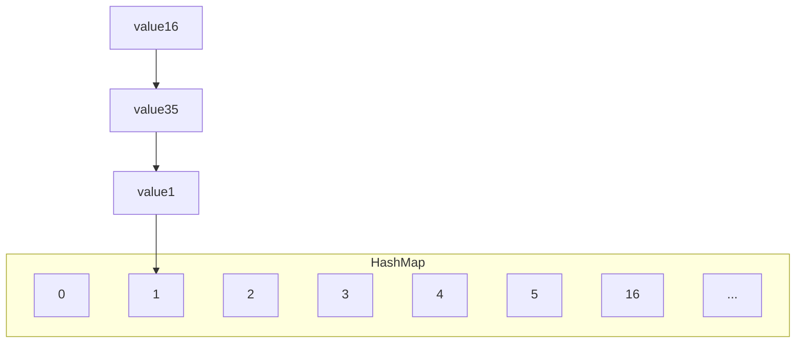

在hashMap扩容的时候，会将原来数组上的元素迁移到新的数组中，对于像这样的链表，迁移时使用遍历的方式进行迁移，通过两个变量记录：

+ `Entry<K, V> e`记录当前结点
+ `Entry<K, V> next`记录下一个结点

完整代码大致结构：

```java
void transfer(Entry[] newTable, boolean rehash) {
    for(Entry<K, V> e : table) {    //table是原hashMap的数组
        while(null != e) {
            Entry<K, V> next = e.next;
            if(rehash) {   //#1
                //...
            }
            //...生成i
            //将新元素加入 newTable[i], 原 newTable[i] 作为新元素的 next
            e.next = newTable[i];
            newTable[i] = e;
            e = next;
        }
    }
}
```

现在有两个线程Thread - 0，Thread - 1同时执行这个函数，为了模拟出死链的情况，在调试的时候，可以令Thread - 0停在`#1`处的位置，先令Thread - 1完整地执行一遍扩容，再去观察当Thread - 0继续执行时的情况

+ 当Thread - 0执行到`#1`处时，变量e和next值为：

  ```
  e         (1) -> (35) -> (16) -> null
  next      (35) -> (16) -> null
  ```

+ 当Thread - 1执行完整个扩容过程，hashMap的容量被扩容到32（初始容量默认为16），**并且注意，Thread - 1已经将变量e和next的值修改了**，扩容之后hashMap的结构：

  ```mermaid
  graph TD;
  subgraph HashMap
  0
  1
  2
  3
  4
  5
  ...
  13
  ....
  32
  end
  value35 --> 1
  value1 --> value35
  value16 --> 13
  ```
  
  > 在扩容的时候，会重新计算每个结点的下标，这时16这个结点的下标已经不与1，35结点冲突，被迁移到另一个新的位置（假设是13），而35与1还是冲突，并且先迁移1到新数组的下标为1的位置，再次强调，jdk1.7采用头插法的方式，所以，后迁移的35会插入在结点1的前面
  
+ **此时，对于Thread - 0来说变量e与next的值为：**

  ```
  e         (1) -> null     //因为在Thread - 0中e指向结点1，当Thread - 1执行完毕之后，结点1之后为空
  next      (35) -> (1) -> null
  ```

+ 线程Thread - 0从`#1`处重新开始执行，先把结点1放入扩容后的map，注意此时Thread - 0操作的map，是原先Thread - 1扩容之后的map，下标为1的位置上有35 -> 1这样的链表，所以采用头插的方式将结点1插入在结点35之前，这样就形成了`(1) -> (35) -> (1)`这样的死链（35的next指针并没有改变），这样下去`while(null != e)`这个循环就变成了死循环

  ```mermaid
  graph TD;
  subgraph HashMap
  0
  1
  2
  3
  4
  5
  ...
  13
  ....
  32
  end
  value35 --> value1
  value1 --> 1
  value1 --> value35
  value16 --> 13
  ```

  

总结：产生死链现象的原因就是在多线程的情况下使用线程不安全的HashMap；虽然在JDK1.8中调整了HashMap的扩容算法（将头插的方式改成了尾插），这样避免了死链问题的产生，但是仍然会出现其他的线程安全问题

#### 6.4.2 ConcurrentHashMap源码

一些基本属性：

```java
//整个ConcurrentHashMap就是一个Node[]数组
static class Node<K,V> implements Map.Entry<K,V>{}
//原始hash数组
transient volatile Node<K,V>[] table;
//扩容之后的hash数组
private transient volatile Node<K,V>[] nextTable;
/*
默认值为0
初始化ConcurrentHashMap时，值为-1
扩容时，值变为-(1 + 扩容线程数)
当初始化或扩容完成之后，为下一次扩容的阈值大小
*/
private transient volatile int sizeCtl;
// 扩容时如果某个 bin 迁移完毕, 用 ForwardingNode 作为旧 table bin 的头结点
/*这个结点的作用有两个：
1. 标识在扩容的时候，原始hash数组中的这个位置的元素已经迁移完毕了
2. 在多线程的情况下，如果有其他线程想要从map中取数据，这个ForwardingNode可以提醒线程需要去扩容之后的数组中取数据
*/
static final class ForwardingNode<K,V> extends Node<K,V>{}
// 用在 compute 以及 computeIfAbsent 时, 用来占位, 计算完成后替换为普通 Node
static final class ReservationNode<K,V> extends Node<K,V>{}
//红黑树的头节点
static final class TreeBin<K,V> extends Node<K,V>{}
//红黑树的普通结点
static final class TreeNode<K,V> extends Node<K,V>{}
```

构造函数：

```java
/*其中一个构造函数
initialCapacity: 初始容量的大小
loadFactor: 加载因子
concurrencyLevel: 并发度
*/
public ConcurrentHashMap(int initialCapacity,
                         float loadFactor, int concurrencyLevel) {
    //判断这些参数是否合法
    if (!(loadFactor > 0.0f) || initialCapacity < 0 || concurrencyLevel <= 0)
        throw new IllegalArgumentException();
    //初始容量至少要满足基本的并发度
    if (initialCapacity < concurrencyLevel)   // Use at least as many bins
        initialCapacity = concurrencyLevel;   // as estimated threads
    long size = (long)(1.0 + (long)initialCapacity / loadFactor);
    //计算初始容量，如果不是2的幂次，会通过tableSizeFor()方法转换为2的幂次
    int cap = (size >= (long)MAXIMUM_CAPACITY) ?
        MAXIMUM_CAPACITY : tableSizeFor((int)size);
    this.sizeCtl = cap;
}
```

`get()`方法：整个get流程中**不需要加锁**

```java
public V get(Object key) {
    Node<K,V>[] tab; Node<K,V> e, p; int n, eh; K ek;
    //计算的hashCode经过spread方法转换之后保证是一个正整数
    int h = spread(key.hashCode());
    //如果map不为空
    if ((tab = table) != null && (n = tab.length) > 0 &&
        //这部分就是计算key在hash数组中的下标
        (e = tabAt(tab, (n - 1) & h)) != null) {
        if ((eh = e.hash) == h) {
            //如果找到了，直接返回
            if ((ek = e.key) == key || (ek != null && key.equals(ek)))
                return e.val;
        }
        /*
        eh是结点e的hash值，一般是 > 0的，小于0有两种情况：
        	1. 结点是ForwardingNode，会调用ForwardingNode的find方法，到新的扩容的map中寻找元素
        	2. 结点是TreeBin结点，会调用TreeBin的find方法，在红黑树中寻找结点
        */
        else if (eh < 0)  
            return (p = e.find(h, key)) != null ? p.val : null;
        //如果都不是，说明当前位置上的元素构成了一个链表，那就遍历链表寻找
        while ((e = e.next) != null) {
            if (e.hash == h &&
                ((ek = e.key) == key || (ek != null && key.equals(ek))))
                return e.val;
        }
    }
    return null;
}
```

`put()`方法

```java
public V put(K key, V value) {
    return putVal(key, value, false);
}

//boolean onlyIfAbsent表示如果有相同的key进行put，是否要用新值覆盖旧值
//true表示不覆盖
//false表示使用新值覆盖旧值，默认
final V putVal(K key, V value, boolean onlyIfAbsent) {
    //ConcurrentHashMap中不允许有空的键和值
    if (key == null || value == null) throw new NullPointerException();
    int hash = spread(key.hashCode());
    int binCount = 0;
    for (Node<K,V>[] tab = table;;) {
        /*
        f是链表的头节点
        fh是头节点的hash值
        i表示链表在数组中的下标位置
        */
        Node<K,V> f; int n, i, fh; K fk; V fv;
        //如果table为空，则创建一个table
        if (tab == null || (n = tab.length) == 0)
            //initTable()方法内部使用CAS的方式创建table，保证创建时的线程安全
            tab = initTable();
        //如果当前位置还没有元素占，则将结点直接加入该位置
        else if ((f = tabAt(tab, i = (n - 1) & hash)) == null) {
            //注意，添加的时候使用CAS的方式，保证添加时的安全性，如果添加失败会进入下一次循环再次尝试添加
            if (casTabAt(tab, i, null, new Node<K,V>(hash, key, value)))
                break;                   // no lock when adding to empty bin
        }
        //如果头节点是ForwardingNode，表示某个线程正在对map进行扩容，MOVED是ForwardingNode的hash值
        else if ((fh = f.hash) == MOVED)
            //则当前线程需要取帮助那个线程扩容
            tab = helpTransfer(tab, f);
        else if (onlyIfAbsent // check first node without acquiring lock
                 && fh == hash
                 && ((fk = f.key) == key || (fk != null && key.equals(fk)))
                 && (fv = f.val) != null)
            return fv;
        //最后这个else就是最普遍的情况，发生了hash冲突，并且下标的位置上有值
        else {
            V oldVal = null;
            //到了这里才加锁，并且只给头节点加锁
            synchronized (f) {
                //判断头节点是否被移动，如果没有被移动，就可以进行put操作
                if (tabAt(tab, i) == f) {
                    if (fh >= 0) {
                        //binCount记录链表的长度
                        binCount = 1;
                        //遍历链表去寻找是否有key这个键所对应的结点
                        for (Node<K,V> e = f;; ++binCount) {
                            K ek;
                            if (e.hash == hash &&
                                ((ek = e.key) == key ||
                                 (ek != null && key.equals(ek)))) {
                                oldVal = e.val;
                                //如果找到了，就更新key所对应value的值
                                if (!onlyIfAbsent)
                                    e.val = value;
                                break;
                            }
                            Node<K,V> pred = e;
                            //如果没找到，就在链表末尾追加一个结点
                            if ((e = e.next) == null) {
                                pred.next = new Node<K,V>(hash, key, value);
                                break;
                            }
                        }
                    }
                    //如果当前这个链表已经升级为红黑树，则在红黑树中寻找
                    else if (f instanceof TreeBin) {
                        Node<K,V> p;
                        binCount = 2;
                        if ((p = ((TreeBin<K,V>)f).putTreeVal(hash, key,
                                                       value)) != null) {
                            oldVal = p.val;
                            if (!onlyIfAbsent)
                                p.val = value;
                        }
                    }
                    else if (f instanceof ReservationNode)
                        throw new IllegalStateException("Recursive update");
                }
            }
            if (binCount != 0) {
                //如果链表的长度大于指定的值（默认为8），则将链表转换为红黑树
                if (binCount >= TREEIFY_THRESHOLD)
                    treeifyBin(tab, i);
                if (oldVal != null)
                    return oldVal;
                break;
            }
        }
    }
    //使用线程安全的方式将链表长度 + 1
    addCount(1L, binCount);
    return null;
}
```

`initTable()`方法

```java
private final Node<K,V>[] initTable() {
    Node<K,V>[] tab; int sc;
    //首先判断当前table是否还未被新建，为配合之后的CAS，使用while而不是if
    while ((tab = table) == null || tab.length == 0) {
        //之后其他线程走到这里的时候，sc已经被某一个线程修改为了-1，其他线程都会执行这个Thread.yield()
        if ((sc = sizeCtl) < 0)
            Thread.yield(); // lost initialization race; just spin
        //使用CAS的方式修改SIZECTL的状态为-1（表示初始化table）
        else if (U.compareAndSetInt(this, SIZECTL, sc, -1)) {
            //只会有一个线程进入这个代码块
            try {
                if ((tab = table) == null || tab.length == 0) {
                    //n为创建table的容量，如果没给，则使用默认的16作为table的容量
                    int n = (sc > 0) ? sc : DEFAULT_CAPACITY;
                    //创建数组
                    @SuppressWarnings("unchecked")
                    Node<K,V>[] nt = (Node<K,V>[])new Node<?,?>[n];
                    table = tab = nt;
                    //更新sc为下一次扩容时的阈值
                    sc = n - (n >>> 2);
                }
            } finally {
                sizeCtl = sc;
            }
            break;
        }
    }
    return tab;
}
```

**ConcurrentHashMap的size计算：**

size的计算实际发生在put和remove方法改变集合元素的操作中

+ 如果没有竞争发生，就向baseCount中累加计数
+ 如果有竞争发生，新建counterCells，向其中的一个cell累加计数
  + counterCells初始有两个cell
  + 如果计数竞争激烈，会创建新的cell来累加计数

```java
public int size() {
     long n = sumCount();
     return ((n < 0L) ? 0 :
     (n > (long)Integer.MAX_VALUE) ? Integer.MAX_VALUE :
     (int)n);
}
final long sumCount() {
     CounterCell[] as = counterCells; CounterCell a;
     // 将 baseCount 计数与所有 cell 计数累加
     long sum = baseCount;
     if (as != null) {
         for (int i = 0; i < as.length; ++i) {
             if ((a = as[i]) != null)
             sum += a.value;
         }
     }
     return sum;
}
```

