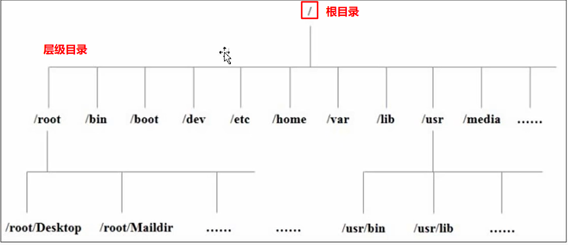

## Linux

### Linux的发行版本

**RedHat**

+ RHEL，红帽的企业版，收费
+ Fedora：一般是测试版
+ CentOS：企业版的简化版

**debian**

+ ubuntu，版本比较新，有界面

+ mint，ubuntu的简化版本

### Linux的文件结构

**在linux系统中一切皆文件**



文件挂载点：在Linux中，将所有的目录结构都放到了根目录下，根目录正常情况下对应一块硬盘空间分区，但根目录下的文件不一定要存放在根目录所在的硬盘分区内，如果想实现这种文件存储在不同的分区的功能，就需要挂载点

先在硬盘空间中划分出一块分区，直接挂载到相应的文件目录下去


### Linux网络配置和系统管理

如果是VM虚拟机，VMware提供了三种网络连接的模式：

+ 桥接模式：虚拟机直接连接外部物理网络的模式，主机起到了网桥的作用，在这种模式下，虚拟机可以直接访问外部网络，并且对外部网络是可见的
+ NAT模式：虚拟机和主机构建了一个专用网络，并通过虚拟网络地址转换设备对IP进行转换，虚拟机通过共享主机IP可以访问外部网络，但外部网络无法访问虚拟机
+ 仅主机模式：虚拟机与主机共享一个专用网络，与外部网络无法通信

**Linux服务**

启动之后一直存在，常驻内存的进程，一般被称作服务（service），比如网络服务

一般这种服务在系统启动的时候就启动起来了，最后在系统关闭的时候才会销毁，一般统称为系统服务，具体执行这些服务的进程称为`守护进程`

> linux中有很多进程带有d结尾的，比如firewalld，这些就是守护进程

在centos7之后，使用systemctl命令来进行服务管理，在centos7之后，所有的服务都在/usr/lib/systemd/system下

```shell
systemctl start|stop|restart|status  服务名
```

**Linux的运行级别**

centos7之后的总体的运行级别就两个

+ multi-user.target  多用户有网，无图形界面
+ graphical.target  多用户有望，有图形界面

可以使用`systemctl get-default`命令查看当前系统的运行级别

也可以使用`systemctl set-default  xxx.target`设置系统的运行级别


### Linux常用命令

**1. 帮助命令**

man命令获得帮助信息

```
man [命令或配置文件]
```

help获得shell内置命令的帮助信息

```
help  命令
命令 --help
```

> 内置命令：一部分基础功能的系统命令是直接内嵌在shell中的，系统加载启动之后会随着shell一起加载，常驻系统内存中，这部分命令被称为内置命令
>
> 相应的，其他命令被称为外部命令

**2. 文件目录类命令**

pwd：显示当前工作目录的绝对路径

```
pwd
```

ls：列出目录下的内容

```
ls [参数] [目录或文件]
```

常用的参数：

+ `-a`：显示目录下全部的文件，包括隐藏文件（在linux下，开头为`.`的文件就是隐藏文件）
+ `-l`：长数据串列出每个文件的信息，包含文件的属性与权限等等，可以用 ll命令代替

mkdir：创建一个文件夹

```
mkdir [参数] 路径 + 目录名
```

常用参数：

+ `-p`：如果父目录不存在，则一同创建，比如mkdir -p a/b/c  a，b目录不存在会一并创建

rmdir：删除目录，参数也是-p，意思和mkdir的意思相反

```
rmdir [参数] 路径 + 目录名
```

touch：创建空文件，如果不带后缀，默认为文本文件

```
touch 文件名
```

cp：复制文件或者目录

```
cp [参数] 源文件  目标路径
#示例
cp hello /usr/local/hello
```

常用参数：

+ `-r`：递归复制整个文件夹
+ `\cp`：强制覆盖

rm：删除文件或目录

```
rm [参数] 文件或目录
```

常用参数：

+ `-r`：递归删除目录中的所有内容
+ `-f`：强制删除，不提示任何信息
+ `-v`：显示指令的详细执行过程
+ `*`：匹配文件的通配符，比如`rm ./*` 删除当前目录下的所有文件

mv：移动文件与目录或重命名

```
mv 原始文件名称  目标文件名称
#如果两个文件在同一个目录下，则相当于重命名
```

cat：查看文件内容，从第一行开始显示

```
cat [参数] 要查看的文件
```

常用参数：

+ `-n`：显示所有行的行号，包括空行
+ 一般用于查看比较小的文件，一个屏幕能够完全显示

more：文件内容分屏查看器，这是一个基于vi编辑器的文本过滤器，以全屏幕的方式按页显示文本文件的内容

```
more 待查看的文件
```

与之对应的一个命令less，less指令功能与more命令类似，但是比more命令更加强大，支持各种显示终端，less指令在现实文件内容时，并不是一次性将整个文件加载之后才显示，而是根据显示需要加载的内容，对于显示大型文件具有较高效率

echo：输出指定内容到控制台

```
echo [参数] 输出内容
```

常用参数：

+ `-e`：支持反斜杠控制的字符转换

+ 输出重定向`>`和内容追加`>>`，将命令执行的结果输出到指定的地方

  ```
  ls -l > 文件名  #将当前列表的所有文件信息写入到指定文件
  cat 文件1 > 文件2  #将文件1的内容覆盖到文件2
  cat 文件1 >> 文件2  #将文件1的内容追加到文件2中
  echo "内容" >> 文件 #将内容追加到指定文件
  ```

head：显示文件头部内容，默认情况下，head指令显示文件前10行的内容

```
head 文件名  #查看文件前10行的内容
head -n number 文件名   #查看文件前number行的内容 -n表示指定显示头部内容的行数
```

与之相对的tail命令显示文件末尾的内容，用法和head一样

> tail有个比较重要的应用：`tail -f`实时追踪该文档的所有更新，常用于实时获取日志文件的信息

**3. 搜索查找类命令**

find：将从指定目录向下递归地遍历其各个子目录，将满足条件的文件显示在终端

```
find [搜寻范围] [参数]  #搜寻范围为指定的目录路径，如果不写，默认是当前目录
#示例：
find -name "*.log"  #查找当前目录包括其子目录下所有后缀名为.log的文件
find -size +10M    #查找当前目录包括其子目录下所有超过10M大小的文件
```

常用参数：

+ `-name`：按照指定的文件名查找文件
+ `-user`：查找属于指定用户名所有文件
+ `-size`：按照指定的文件大小查找文件

locate：快速定位文件路径，locate指令无需遍历整个文件系统，查询速度较快

```
locate [带搜索的文件名称]
```

> locate指令是利用事先建立的系统中所有文件名称及路径的locate数据库实现快速定位文件的，默认这个数据库是一天更新一次，为了保证查询结果的准确性，管理员必须定期更新locate时刻，可以使用updatedb命令
>
> 白板centos并不带有locate和updatedb命令，可以使用yum install mlocate下载

grep以及"|"管道符：管道符"|"表示将前一个命令的处理结果输出传递给后面的命令处理，grep是一个过滤查找结果的命令

```
grep [参数] 查找内容 源文件
#示例
grep -n Application app/nohup.out  #在nohup.out文件中查找Application关键字，结果显示行号
```

常用参数：

+ `-n`：显示匹配行及行号

**4. 压缩解压缩命令**

gzip / gunzip：gzip压缩命令，将文件压缩为.gz的压缩文件；gunzip解压缩命令，解压.gz结尾的压缩包

```
gzip [文件名]
gunzip xxx.gz
```

说明：

+ 只能压缩文件不能压缩目录
+ 不保留原来的文件
+ 同时压缩多个文件会产生多个压缩包

zip / unzip：zip可以压缩目录和文件，unzip也可以解压目录

```
zip [参数] xxx.zip 将要解压的内容
unzip [参数] xxx.zip   
```

常用参数：

+ `-r`：zip的参数，压缩目录用的
+ `-d`：unzip的参数，指定解压后文件的存放目录
+ zip和unzip在windows中也可以使用，用法一样
+ zip压缩完成之后可以保留源文件

tar：打包归档命令

```
tar [参数] xxx.tar.gz 要打包的内容
#示例：
tar -zcvf temp.tar.gz file1.txt file2.txt #将file1.txt和file2.txt一并打包并压缩到temp.tar.gz这个文件中
tar -zxvf temp.tar.gz  #将temp.tar.gz压缩文件解压到当前目录
```

常用参数：

+ `-c`：产生.tar打包文件
+ `-v`：显示打包的详细信息
+ `-f`：指定压缩后的文件名
+ `-z`：在打包的同时进行压缩
+ `-x`：解包.tar文件
+ `-C`：解压到指定目录

**5. 磁盘查看和分区类**

du：disk usage 查看磁盘占用情况

```
du [参数] 目录或者文件  #如果不写，默认统计当前目录或者文件的大小
#示例
du -sh  #统计当前目录占用磁盘的大小 ，输出只有一个数，如 52M
du -h   #显示当前目录下的文件大小
#输出格式是：
12K	./redis/redis/tests/cluster/tests/includes
8.0K	./redis/redis/tests/cluster/tests/helpers
128K	./redis/redis/tests/cluster/tests
152K	./redis/redis/tests/cluster
124K	./redis/redis/tests/unit/moduleapi
272K	./redis/redis/tests/unit/type
836K	./redis/redis/tests/unit
8.0K	./redis/redis/tests/sentinel/tmp
16K	./redis/redis/tests/sentinel/tests/includes
8.0K	./redis/redis/tests/sentinel/tests/helpers
72K	./redis/redis/tests/sentinel/tests
88K	./redis/redis/tests/sentinel
36K	./redis/redis/tests/assets
216K	./redis/redis/tests/modules
20K	./redis/redis/tests/helpers
1.8M	./redis/redis/tests
159M	./redis/redis
159M	./redis
4.0K	./lib
48K	./mysql/sql
68K	./mysql
4.0K	./libexec
1.1G	.
```

常用参数：

+ `-h`：会显示大小，即xxK，xxKB，xxG等
+ `-a`：不仅查看子目录大小，还要包括每个文件
+ `-c`：显示所有的文件和子目录大小后，最后显示综合
+ `-s`：只显示目录或者文件的总大小
+ `--max-depth=n`：指定统计子目录深度为第n层的目录或者文件的大小

df：disk free空余磁盘

```
df [参数] #列出文件系统的整体磁盘使用量，检查文件系统的磁盘空间占用情况，常用的参数是-h意思和上面那个命令一样
#在根目录下使用时的输出信息：
Filesystem      Size  Used Avail Use% Mounted on
devtmpfs        915M     0  915M   0% /dev
tmpfs           933M     0  933M   0% /dev/shm
tmpfs           933M  456K  933M   1% /run
tmpfs           933M     0  933M   0% /sys/fs/cgroup
/dev/vda1        40G  4.5G   33G  12% /
tmpfs           187M     0  187M   0% /run/user/0
```

lsblk：查看设备的挂载情况

```
lsblk
#输出信息：最后的mountpoint就是挂载点
NAME   MAJ:MIN RM SIZE RO TYPE MOUNTPOINT
vda    253:0    0  40G  0 disk 
└─vda1 253:1    0  40G  0 part /
```

常用参数：

+ `-f`：查看详细的设备挂载情况，显示文件系统信息

mount / umount：挂载和卸载

对于Linux用户来讲，不论有几个分区，分别分给哪一个目录使用，它总归是一个根目录，一个独立且唯一的文件结构

Linux中每个分区都是用来组成整个文件系统的一部分，它在用一种叫做“挂载”的处理方法，它整个文件系统包含了一整套的文件和目录，并将一个分区和一个目录联系起来，要载入的那个分区将使它的存储空间在这个目录下获得

**6. 进程管理类命令**

ps：process status进程状态

```
ps aux | grep xxx   #查看系统中所有进程
# USER：当前用户
# PID：进程编号
# %CPU：当前进程CPU占比
# %MEM：进程占用内存的百分比
# VSZ：进程占用的虚拟内存
# RSS：进程占用的实际内存
# TTY：进程使用的终端
# STAT：进程状态   R：运行状态   S：睡眠状态    T：暂停状态     Z：僵尸进程，快运行完但数据还没完全清除的进程   l：多线程的进程
# START：什么时候开始运行的
# TIME：占用CPU的运算时间
# COMMAND：进程的命令
#信息显示：
USER         PID %CPU %MEM    VSZ   RSS TTY      STAT START   TIME COMMAND
root           1  0.0  0.4 178228  8524 ?        Ss   Jun06   1:32 /usr/lib/systemd/systemd 
root           2  0.0  0.0      0     0 ?        S    Jun06   0:01 [kthreadd]
root           3  0.0  0.0      0     0 ?        I<   Jun06   0:00 [rcu_gp]
root           4  0.0  0.0      0     0 ?        I<   Jun06   0:00 [rcu_par_gp]
root           6  0.0  0.0      0     0 ?        I<   Jun06   0:00 [kworker/0:0H-events_high
root           8  0.0  0.0      0     0 ?        I<   Jun06   0:00 [mm_percpu_wq]
root           9  0.0  0.0      0     0 ?        S    Jun06   0:00 [rcu_tasks_rude_]
root          10  0.0  0.0      0     0 ?        S    Jun06   0:00 [rcu_tasks_trace]
root          11  0.0  0.0      0     0 ?        S    Jun06   0:04 [ksoftirqd/0]

ps -ef | grep xxx   #查看字子父进程之间的关系
#信息显示：PPID就是父进程的pid
UID          PID    PPID  C STIME TTY          TIME CMD
root           1       0  0 Jun06 ?        00:01:32 /usr/lib/systemd/systemd --switched-root
root           2       0  0 Jun06 ?        00:00:01 [kthreadd]
root           3       2  0 Jun06 ?        00:00:00 [rcu_gp]
root           4       2  0 Jun06 ?        00:00:00 [rcu_par_gp]
root           6       2  0 Jun06 ?        00:00:00 [kworker/0:0H-events_highpri]
root           8       2  0 Jun06 ?        00:00:00 [mm_percpu_wq]
root           9       2  0 Jun06 ?        00:00:00 [rcu_tasks_rude_]
root          10       2  0 Jun06 ?        00:00:00 [rcu_tasks_trace]

```

常用参数：

+ `a`：列出带有终端的所有用户的进程
+ `x`：列出当前用户的所有进程，包括没有终端的进程
+ `u`：面向用户友好的显示风格
+ `-e`：列出所有进程
+ `-u`：列出某个用户关联的所有进程
+ `-f`：显示完整格式的进程列表

kill：终止进程

```
kill [参数] 进程号  #通过进程号杀死进程
killall 进程名称   #通过进程名称杀死进程，可以批量停止进程
```

常用参数：

+ `-9`：表示强制进程立即停止

top：实时监控系统进程状态，相当于windows的任务管理器

```
top [参数]
#显示信息：默认3s更新一次
#top: 当前执行的命令，up: 至今服务器启动了多长时间  1 user: 当前有多少个用户连接服务器  load average: 过去的1min、5min和15min系统的平均负载
#Tasks: 当前执行的进程总数
#%CPU: 每种进程占用CPU时间的百分比

top - 11:24:10 up 81 days, 14:13,  1 user,  load average: 0.00, 0.00, 0.00
Tasks: 118 total,   1 running, 117 sleeping,   0 stopped,   0 zombie
%Cpu(s):  0.5 us,  0.3 sy,  0.0 ni, 98.8 id,  0.0 wa,  0.3 hi,  0.0 si,  0.0 st
MiB Mem :   1865.8 total,    324.4 free,    813.5 used,    727.9 buff/cache
MiB Swap:      0.0 total,      0.0 free,      0.0 used.    879.5 avail Mem 

    PID USER      PR  NI    VIRT    RES    SHR S  %CPU  %MEM     TIME+ COMMAND             
 278817 root      10 -10  127484  28940  16836 S   1.3   1.5  90:41.64 AliYunDun           
      1 root      20   0  178228   8524   5452 S   0.0   0.4   1:32.08 systemd             
      2 root      20   0       0      0      0 S   0.0   0.0   0:01.00 kthreadd            
      3 root       0 -20       0      0      0 I   0.0   0.0   0:00.00 rcu_gp              
      4 root       0 -20       0      0      0 I   0.0   0.0   0:00.00 rcu_par_gp          
      6 root       0 -20       0      0      0 I   0.0   0.0   0:00.00 kworker/0:0H-events+
      8 root       0 -20       0      0      0 I   0.0   0.0   0:00.00 mm_percpu_wq        
      9 root      20   0       0      0      0 S   0.0   0.0   0:00.00 rcu_tasks_rude_     
     10 root      20   0       0      0      0 S   0.0   0.0   0:00.00 rcu_tasks_trace     
     11 root      20   0       0      0      0 S   0.0   0.0   0:04.48 ksoftirqd/0         
     12 root      20   0       0      0      0 I   0.0   0.0  15:16.03 rcu_sched           
     13 root      rt   0       0      0      0 S   0.0   0.0   0:00.81 migration/0         
     14 root      20   0       0      0      0 S   0.0   0.0   0:00.00 cpuhp/0             
     15 root      20   0       0      0      0 S   0.0   0.0   0:00.00 cpuhp/1             
     16 root      rt   0       0      0      0 S   0.0   0.0   0:00.85 migration/1         
     17 root      20   0       0      0      0 S   0.0   0.0   0:01.87 ksoftirqd/1         
     19 root       0 -20       0      0      0 I   0.0   0.0   0:00.00 kworker/1:0H-events+
     21 root      20   0       0      0      0 S   0.0   0.0   0:00.00 kdevtmpfs           
     22 root       0 -20       0      0      0 I   0.0   0.0   0:00.00 netns               
     23 root      20   0       0      0      0 S   0.0   0.0   0:00.00 kauditd             
     26 root      20   0       0      0      0 S   0.0   0.0   0:01.31 khungtaskd          
     27 root      20   0       0      0      0 S   0.0   0.0   0:00.00 oom_reaper          
     28 root       0 -20       0      0      0 I   0.0   0.0   0:00.00 writeback           
     29 root      20   0       0      0      0 S   0.0   0.0   0:59.55 kcompactd0          
     30 root      25   5       0      0      0 S   0.0   0.0   0:00.00 ksmd                
     31 root      39  19       0      0      0 S   0.0   0.0   0:18.46 khugepaged          
     32 root       0 -20       0      0      0 I   0.0   0.0   0:00.00 memcg_wmark         
     46 root       0 -20       0      0      0 I   0.0   0.0   0:00.00 cryptd              
```

常用参数：

+ `-d`：指定top命令每隔几秒更新，默认是3s
+ `-i`：使top不显示任何闲置或者僵死进程
+ `-p`：通过指定监控进程ID来仅仅监控某个进程的状态

netstat：显示网络状态和端口占用信息

```
netstat -anp | grep 进程号    #查看进程的网络信息
netstat -nlp | grep 端口号    #查看网络端口号占用情况
```

常用参数：

+ `-a`：显示所有正在监听和未监听的套接字
+ `-n`：拒绝显示别名，能显示数字的全部转化成数字
+ `-l`：仅列出在监听的服务状态
+ `-p`：表示显示哪个进程在调用

lsof -i: 用于查看某一端口的占用情况，比如查看5000端口的使用情况

```
lsof -i:5000
##常用命令
lsof abc.txt   //查看开启文件abc.txt的进程
lsof -c abc    //显示abc进程现在打开的文件
lsof -c -p 1234 //列出进程号为1234的进程打开的文件
```

netstat命令：netstat是一个监控tcp/ip网络的工具，可以显示路由表，实际的网络链接以及每一个网络接口设备的状态信息

```
#netstat的参数：
-a : 显示所有连线中的Socket
-t : 指明显示TCP端口
-u : 指明显示UDP端口
-l : 仅显示监听套接字(所谓套接字就是使应用程序能够读写与收发通讯协议(protocol)与资料的程序)
-p : 显示进程标识符和程序名称，每一个套接字/端口都属于一个程序。
-n : 不进行DNS轮询，显示IP(可以加速操作)

#常用命令
netstat -tnlp   //查看当前所有tcp端口的占用情况
netstat -anp    //查看端口的连接客户端ip
```

防火墙命令

```
#添加指定需要开放的端口：
firewall-cmd --add-port=8088/tcp --permanent
#查询指定端口是否开启成功：
firewall-cmd --query-port=8088/tcp
#移除指定端口：
firewall-cmd --permanent --remove-port=8088/tcp
#查询开放的防火墙端口列表
firewall-cmd --zone=public --list-ports

#重载入添加的端口：
firewall-cmd --reload
```

