## Springboot

### 一、Spring的作用

#### 1. Spring的生态

覆盖了：web开发、数据访问、安全控制

分布式、消息服务、移动开发、批处理

#### 2. Spring5的重大升级

+ 响应式编程
+ 内部源码设计：基于java8的一些新特性，如：接口默认实现，重新设计源码架构等


#### 3. Springboot的作用


Springboot是基于spring framework的框架

#### 4. Springboot的优缺点

##### 4.1 springboot的优点

+ Create stand-alone Spring applications
  + 创建独立Spring应用

- Embed Tomcat, Jetty or Undertow directly (no need to deploy WAR files)
  + 内嵌web服务器

- Provide opinionated 'starter' dependencies to simplify your build configuration
  + 自动starter依赖，简化构建配置

- Automatically configure Spring and 3rd party libraries whenever possible
  + 自动配置Spring以及第三方功能

- Provide production-ready features such as metrics, health checks, and externalized configuration
  + 提供生产级别的监控、健康检查及外部化配置

- Absolutely no code generation and no requirement for XML configuration
  + 无代码生成、无需编写XML


> SpringBoot是整合Spring技术栈的一站式框架
>
> SpringBoot是简化Spring技术栈的快速开发脚手架

##### 4.2 Springboot的缺点

+ 人称版本帝，迭代快，需要时刻关注变化
+ 封装太深，内部原理复杂，不容易精通

#### 5. Spring的时代背景

##### 5.1 微服务

+ 微服务是一种架构风格
+ 一个应用拆分为一组小型服务

- 每个服务运行在自己的进程内，也就是可独立部署和升级
- 服务之间使用轻量级HTTP交互

- 服务围绕业务功能拆分
- 可以由全自动部署机制独立部署

- 去中心化，服务自治。服务可以使用不同的语言、不同的存储技术

##### 5.2 分布式


+ 分布式的困难

  - 远程调用、服务发现

  - 负载均衡、服务容错

  - 配置管理、服务监控

  - 链路追踪、日志管理

  - 任务调度

  - ......

+ 分布式的解决：springboot + springcloud

### 二、HelloWorld

#### 1. 需求

需求：浏览发送/hello请求，响应 Hello，Spring Boot 2 

#### 2. 做法

##### 2.1 创建maven工程

pom.xml

```xml
<?xml version="1.0" encoding="UTF-8"?>
<project xmlns="http://maven.apache.org/POM/4.0.0"
         xmlns:xsi="http://www.w3.org/2001/XMLSchema-instance"
         xsi:schemaLocation="http://maven.apache.org/POM/4.0.0 http://maven.apache.org/xsd/maven-4.0.0.xsd">
    <modelVersion>4.0.0</modelVersion>

    <groupId>com.SpringBoot</groupId>
    <artifactId>springboot-demo1</artifactId>
    <version>1.0-SNAPSHOT</version>

    <properties>
        <maven.compiler.source>11</maven.compiler.source>
        <maven.compiler.target>11</maven.compiler.target>
    </properties>

    <!--配置父项，导入springboot插件-->
    <parent>
        <groupId>org.springframework.boot</groupId>
        <artifactId>spring-boot-starter-parent</artifactId>
        <version>2.3.4.RELEASE</version>
    </parent>

    <dependencies>
        <!--导入与springboot相关的依赖-->
        <dependency>
            <groupId>org.springframework.boot</groupId>
            <artifactId>spring-boot-starter-web</artifactId>
        </dependency>

    </dependencies>

</project>
```

##### 2.2 创建主程序

MainApplication.java

```java
import org.springframework.boot.SpringApplication;
import org.springframework.boot.autoconfigure.SpringBootApplication;

/*
* @SpringBootApplication注解标识这是一个springboot应用
* 主程序类
* */
@SpringBootApplication
public class MainApplication {
    public static void main(String[] args) {
        SpringApplication.run(MainApplication.class, args);
    }
}
```

##### 2.3 编写需求业务

HelloController.java

```java
import org.springframework.web.bind.annotation.RequestMapping;
import org.springframework.web.bind.annotation.RestController;

//@RestController = @ResponseBody + @Controller
@RestController
public class HelloController {
    @RequestMapping("/hello")
    public String hello(){
        return "Hello SpringBoot2 !";
    }
}
```

##### 2.4 运行

直接运行main方法


运行结果


### 三、springboot依赖管理原理

#### 1. 依赖管理

+ 父项目做依赖管理

  ```xml
  <!--当前项目依赖于父项目，每一个springboot项目都要依赖与这个spring-boot-starter-parent-->
  <parent>
      <groupId>org.springframework.boot</groupId>
      <artifactId>spring-boot-starter-parent</artifactId>
      <version>2.3.4.RELEASE</version>
  </parent>
  
  <!--spring-boot-starter-parent的父项目-->
  <parent>
     <groupId>org.springframework.boot</groupId>
      <artifactId>spring-boot-dependencies</artifactId>
      <version>2.3.4.RELEASE</version>
  </parent>
  
  <properties>
  	<!--声明了几乎所有可能用到的依赖的版本，避免版本冲突-->
      <xxx.version>3.0.1</xxx.version>
  </properties>
  
  在spring-boot-dependencies项目中几乎声明了开发中常用依赖的版本号，称为自动版本仲裁机制
  ```

+ 开发导入starter场景启动器

  + 官方starter以spring-boot-starter-\*命名，*就代表各种场景，比如spring-boot-starter-web表示web应用

  + 只要引入starter，这个场景下的所有常规需要的依赖都会自动引入

  + 所有*-spring-boot-starter是第三方提供的简化开发的场景启动器

  + 所有场景启动器最底层的依赖：

    ```xml
    <dependency> 			
      <groupId>org.springframework.boot</groupId>
      <artifactId>spring-boot-starter</artifactId>
      <version>2.3.4.RELEASE</version>
      <scope>compile</scope>
    </dependency>
    ```
  
+ 之后引入依赖无需写版本号，自动版本仲裁

  + 引入依赖默认都可以不写版本号
  + 但引入非版本仲裁的jar，需要写版本号

+ 自定义修改版本号

  ```xml
  查看spring-boot-dependencies里面规定的当前依赖版本
  在当前项目里面重写配置，比如想要修改mysql的版本好，自动仲裁机制选择的版本为
  <mysql.version>8.0.21</mysql.version>
  需要在当前项目中重写配置，并引入依赖
  <properties>
     <mysql.version>5.1.43</mysql.version>
  </properties>
  <dependency>
     <groupId>mysql</groupId>
     <artifactId>mysql-connector-java</artifactId>
  </dependency>
  ```

#### 2. 自动配置

+ 自动配置Tomcat

  + 引入Tomcat依赖

    ```xml
    <!--在spring-boot-starter-web自动引入-->
    <dependency>
          <groupId>org.springframework.boot</groupId>
          <artifactId>spring-boot-starter-tomcat</artifactId>
          <version>2.3.4.RELEASE</version>
          <scope>compile</scope>
    </dependency>
    ```

  + 配置Tomcat

+ 自动配置SpringMVC

  + 引入SpringMVC全套组件
  + 自动配置好了springMVC的常用功能

+ 自动配置web常见功能，比如字符编码

  + springboot已经配置好了所有web开发的常见场景

+ 默认的包结构

  + 主程序所在的包及其下面的所有子包，都会被默认扫描

  + 如果想要改变默认扫描路径，使用@SpringBootApplication(scanBasePackages = "包路径")修改扫描路径

    其中**@SpringBootApplication** = **@SpringBootConfiguration** + **@EnableAutoConfiguration** + **@ComponentScan**

    可以改变@ComponentScan中的扫描路径改变默认扫描包路径

+ 各种配置拥有默认值

  + 默认配置最终都是映射到一个java类上
  + 配置文件的值，最终会绑定到某个java类上，这个类会在IOC容器中创建对象

+ 按需加载所有自动配置项

  + 引入了哪些场景，这个场景的自动配置才会开启
  + springboot所有的自动配置功能都在spring-boot-autoconfigure包中，这个包在spring-boot-starter根配置中引入

#### 3. 容器功能

##### 3.1 组件添加

+ @Configuration注解

  ```java
  //两个JavaBean
  public class User {
      private String name;
      private Integer age;
      public User() {
      }
      public User(String name, Integer age) {
          this.name = name;
          this.age = age;
      }
      public String getName() {
          return name;
      }
      public void setName(String name) {
          this.name = name;
      }
      public Integer getAge() {
          return age;
      }
      public void setAge(Integer age) {
          this.age = age;
      }
      @Override
      public String toString() {
          return "User{" +
                  "name='" + name + '\'' +
                  ", age=" + age +
                  '}';
      }
  }
  
  public class Pet {
      private String name;
      public Pet() {
      }
      public Pet(String name) {
          this.name = name;
      }
      public String getName() {
          return name;
      }
      public void setName(String name) {
          this.name = name;
      }
      @Override
      public String toString() {
          return "Pet{" +
                  "name='" + name + '\'' +
                  '}';
      }
  }
  ```

  一个配置类

  ```java
  //proxyBeanMethods: 代理bean的方法
  //当有这个属性在时，外部无论对配置类中的这个组件注册方法调用多少次，获取的都是之前注册容器中的单实例对象
  @Configuration(proxyBeanMethods = true)
  public class MyConfiguration {
      //@Bean注解给容器添加组件，以方法名作为组件的id，返回类型就是组件类型，方法返回的值，就是组件在组件中的实例
      @Bean
      public User user_1(){
          return new User("zhangsan", 18);
      }
  
      @Bean
      public Pet cat(){
          return new Pet("Tomcat");
      }
  }
  ```

  1. @Configuration注解告诉springboot这是一个配置类，相当于一个配置文件
  2. 配置类里面使用@Bean标注在方法上给容器注册组件，默认是单实例的
  3. 配置类本身也是一个组件
  4. 当有proxyBeanMethod = true属性时，由代理对象调用类中的方法，Springboot总会检查这个组件是否在容器中有，保持组件的单实例

  在主程序中获取组件实例

  ```java
  @SpringBootApplication
  public class MainApplication {
      public static void main(String[] args) {
          //1. 返回IOC容器
          ConfigurableApplicationContext run = SpringApplication.run(MainApplication.class, args);
          //2. 查看容器中的组件
          String[] names = run.getBeanDefinitionNames();
          for (String s: names) {
              System.out.println(s);
          }
  
          //3. 从容器中获取组件
          Pet cat1 = run.getBean("cat", Pet.class);
          Pet cat2 = run.getBean("cat", Pet.class);
          System.out.println("是否是同一个对象实例：" + (cat1 == cat2));
          //返回结果为true
          
          //4. 获取配置类的组件实例，调用配置类中的方法创建组件实例 
          MyConfiguration bean = run.getBean(MyConfiguration.class);
          User user1 = bean.user_1();
          User user2 = bean.user_1();
          System.out.println(user1 == user2);
          //返回结果仍然为true
      }
  }
  ```

  组件依赖

  当User类中含有Pet类型的属性，需要外部注入，就形成了组件依赖
      在使用配置类方法获取组件时
      User user = new User("zhangsan", 18);
      user.setPet(cat());
      调用配置类中的创建Pet组件方法向User组件中注入Pei类型的属性
      当proxyBeanMethods属性为true时，user中注入的Pet类型的属性即为IOC容器中创建的Pet类型的组件，这种模式称为Full模式
      当proxyBeanMethods属性为false时，user中注入的Pet类型的属性就于IOC容器中创建的Pet组件不同，这种模式称为Lite模式

  当配置类中的组件之间没有依赖关系，可以使用Lite模式，加快容器启动过程

  当配置类中的组件之间有相互依赖关系，方法会被调用到之前的单实例组件，就用Full模式

+ @Bean、@Component、@Controller、@Service、@Repository注解，跟之前Spring中的用法相同

+ @Import注解

  value属性：类对象数组

  @Import({User.class, String.class})

  给容器中自动创建出这两个类型的组件，默认创建组件的名字就是全类名

  ```java
  //在配置类上添加@Import注解
  @Import({User.class, DBHelper.class})
  @Configuration(proxyBeanMethods = true)
  public class MyConfiguration {
      @Bean
      public User user_1(){
          return new User("zhangsan", 18);
      }
  
      @Bean
      public Pet cat(){
          return new Pet("Tomcat");
      }
  }
  
  //在主程序中获取容器中，由@Import注解创建的组件
  @SpringBootApplication
  public class MainApplication {
      public static void main(String[] args) {
          ConfigurableApplicationContext run = SpringApplication.run(MainApplication.class, args);
          String[] beanNamesForType = run.getBeanNamesForType(User.class);
          for (String s : beanNamesForType) {
              System.out.println(s);
          }
  
          DBHelper helper = run.getBean(DBHelper.class);
          System.out.println(helper);
      }
  }
  //结果：
  com.Springboot.Bean.User
  user_1
  ch.qos.logback.core.db.DBHelper@1b7a52dd
  ```

+ @Conditional注解

  满足Conditional指定的条件，则进行注入，有非常多的派生注解

  + @ConditionalOnBean：当容器中有指定组件时再注入组件

  ```java
  @Configuration(proxyBeanMethods = true)
  public class MyConfiguration {
      @ConditionalOnBean(name = "cat") // 当容器中有cat组件时再注入User类型的组件
      @Bean
      public User user_1(){
          return new User("zhangsan", 18);
      }
      //先注释掉Pet类型组件上的注解
      //@Bean
      public Pet cat(){
          return new Pet("Tomcat");
      }
  }
  
  //测试方法：
  @SpringBootApplication
  public class MainApplication {
      public static void main(String[] args) {
          ConfigurableApplicationContext run = SpringApplication.run(MainApplication.class, args);
          //测试条件装配注解
          //将MyConfiguration中的创建Pet组件方法上的@Bean注解删去，测试容器中是否还含有Pet类型的组件
          boolean cat = run.containsBean("cat");
          System.out.println(cat);
          //测试容器中是否含有User类型的组件
          boolean user_1 = run.containsBean("user_1");
          System.out.println(user_1);
      }
  }
  结果：
  false
  false
  ```

##### 3.2 原生配置文件引入

+ @ImportResource

  导入原生的xml配置文件@ImportResource("配置文件路径")

##### 3.3 配置绑定

+ @ConfigurationProperties注解

  引入类路径下的配置文件中相应的数据

  配置文件：

  ```properties
  mycar.brand=BYD
  mycar.price=100000
  ```

  JavaBean:

  ```java
  @Component  //只有在容器中的组件，才会拥有springboot的强大功能
  @ConfigurationProperties(prefix = "mycar")  //导入配置文件中的数据，prefix为配置文件中的前缀
  public class Car {
      private String brand;
      private Integer price;
  
      public Car() {
      }
  
      public Car(String brand, Integer price) {
          this.brand = brand;
          this.price = price;
      }
  
      public String getBrand() {
          return brand;
      }
  
      public void setBrand(String brand) {
          this.brand = brand;
      }
  
      public Integer getPrice() {
          return price;
      }
  
      public void setPrice(Integer price) {
          this.price = price;
      }
  
      @Override
      public String toString() {
          return "Car{" +
                  "brand='" + brand + '\'' +
                  ", price=" + price +
                  '}';
      }
  }
  
  //测试配置文件导入
      @RequestMapping("/car")
      public Car car(){
          return car;
      }
  
  结果：
  浏览器端显示：{"brand":"BYD","price":100000}
  ```

+ @EnableConfigurationProperties注解

  @EnableConfigurationProperties注解

  1. 需要标注在配置类上，开启Car的属性配置功能

  2. 把组件自动注入到容器中
  3. Car类上仍然需要@ConfigurationProperties(prefix = "mycar")

  ```java
  @Configuration(proxyBeanMethods = true)
  @EnableConfigurationProperties(Car.class)
  public class MyConfiguration {
  }
  ```

#### 4. 自动配置原理

核心：@SpringbootApplication注解

```java
@SpringBootConfiguration
@EnableAutoConfiguration
@ComponentScan(excludeFilters = { @Filter(type = FilterType.CUSTOM, classes = TypeExcludeFilter.class),
		@Filter(type = FilterType.CUSTOM, classes = AutoConfigurationExcludeFilter.class) })
public @interface SpringBootApplication 
```

##### 4.1 @SpringBootConfiguration

```java
@Configuration
public @interface SpringBootConfiguration
```

本质上是一个@Configuration注解，标识主程序所在的类是一个配置类

##### 4.2 @ComponentScan

组件扫描

##### 4.3 @EnableAutoConfiguration

```java
//@EnableAutoConfiguration = @AutoConfigurationPackage + @Import
@AutoConfigurationPackage
@Import(AutoConfigurationImportSelector.class)
public @interface EnableAutoConfiguration
```

1. **@AutoConfigurationPackage**: 实际上是一个@Import注解 = @Import(AutoConfigurationPackages.Registrar.class)，指定了默认的包规则

   Registrar类：借助Register给容器中导入一系列组件，将指定的一个包下(主程序所在的包下)的所有组件导入

   ```java
   static class Registrar implements ImportBeanDefinitionRegistrar, DeterminableImports {
      @Override
      public void registerBeanDefinitions(AnnotationMetadata metadata, BeanDefinitionRegistry registry) {
          //new PackageImports(metadata).getPackageNames()获取当前注解所在类的包名，即主程序所在包的包名，所以在扫描时，会扫描主程序所在包下的所有组件
         register(registry, new PackageImports(metadata).getPackageNames().toArray(new String[0]));
      }
   
      @Override
      public Set<Object> determineImports(AnnotationMetadata metadata) {
         return Collections.singleton(new PackageImports(metadata));
      }
   }
   ```

2. **@Import(AutoConfigurationImportSelector.class)**

   (1). 利用getAutoConfigurationEntry(annotationMetadata);给容器中批量导入一些组件
   (2). 调用List\<String> configurations = getCandidateConfigurations(annotationMetadata, attributes)获取到所有需要导入到容器中的配置类
   (3). 利用工厂加载 Map<String, List\<String>> loadSpringFactories(@Nullable ClassLoader classLoader)；得到所有的组件,共127个

   

   (4). 从META-INF/spring.factories位置来加载一个文件。
   	默认扫描我们当前系统里面所有META-INF/spring.factories位置的文件
       spring-boot-autoconfigure-2.3.4.RELEASE.jar包里面也有META-INF/spring.factories，在文件中写死了spring-boot一启动就要加载的配置类，就是上面所获取的127个配置类
   
   ```xml
   #spring.factories文件
   # Auto Configure
   org.springframework.boot.autoconfigure.EnableAutoConfiguration=\
   org.springframework.boot.autoconfigure.admin.SpringApplicationAdminJmxAutoConfiguration,\
   org.springframework.boot.autoconfigure.aop.AopAutoConfiguration,\
   org.springframework.boot.autoconfigure.amqp.RabbitAutoConfiguration,\
   org.springframework.boot.autoconfigure.batch.BatchAutoConfiguration,\
   org.springframework.boot.autoconfigure.cache.CacheAutoConfiguration,\
   org.springframework.boot.autoconfigure.cassandra.CassandraAutoConfiguration,\
   org.springframework.boot.autoconfigure.context.ConfigurationPropertiesAutoConfiguration,\
   org.springframework.boot.autoconfigure.context.LifecycleAutoConfiguration,\
   org.springframework.boot.autoconfigure.context.MessageSourceAutoConfiguration,\
   org.springframework.boot.autoconfigure.context.PropertyPlaceholderAutoConfiguration,\
   org.springframework.boot.autoconfigure.couchbase.CouchbaseAutoConfiguration,\
   ......   #共127个
   ```

##### 4.4 按需开启自动配置项

+ 虽然我们127个场景的所有自动配置启动的时候默认全部加载。xxxxAutoConfiguration
+ 按照条件装配规则（@Conditional），最终会按需配置。

##### 4.5 修改默认配置

以文件上传解析器为例

```java
//文件上传解析器的底层默认配置
@Bean
@ConditionalOnBean(MultipartResolver.class)   //当容器中有这个类型组件
//MULTIPART_RESOLVER_BEAN_NAME = "multipartResolver", 容器中没有这个名字的组件
@ConditionalOnMissingBean(name = DispatcherServlet.MULTIPART_RESOLVER_BEAN_NAME)
//满足上述的两个条件，则配置这个组件
public MultipartResolver multipartResolver(MultipartResolver resolver) {
   //给@Bean标注的方法传入了对象参数，这个参数的值就会从容器中找。
   //SpringMVC multipartResolver。防止有些用户配置的文件上传解析器不符合规范
   return resolver;
}
```

类似的springboot默认会在底层配置号所有的组件，但是如果用户在自己的配置类中先配置了自定义的组件，则以用户配置的组件优先

例如，在springboot中，字符过滤器的配置如下：

```java
@Bean
@ConditionalOnMissingBean   //当容器中没有这个组件类对象时配置
public CharacterEncodingFilter characterEncodingFilter() {
   CharacterEncodingFilter filter = new OrderedCharacterEncodingFilter();
   filter.setEncoding(this.properties.getCharset().name());
   filter.setForceRequestEncoding(this.properties.shouldForce(Encoding.Type.REQUEST));
   filter.setForceResponseEncoding(this.properties.shouldForce(Encoding.Type.RESPONSE));
   return filter;
}
```

用户可以在自己的MyConfiguration类中添加对字符过滤器的自定义配置

```java
@Bean
public CharacterEncodingFilter characterEncodingFilter() {
    //具体配置信息
}
```

#### 5. 总结

+ Springboot会在启动时，先加载所有的配置类信息   ----  xxxxAutoConfiguration

+ 每个自动配置类按照条件注解生效(@Confitionalxxx)，默认都会绑定配置文件指定的值  ----  xxxxProperties类，xxxxProperties类又和配置文件xxxx.properties进行绑定

+ 生效的配置类就会给容器中装配很多的组件

+ 只要容器中有这些组件，就具备了相应的功能

+ 用户可以自定义组件的配置

  + 用户在自定义的配置类中，使用@Bean注解配置相关组件
  + 用户可以直接在.properties文件中修改相应的属性值，自动会绑定到相应的配置类上

+ 总的流程：

  xxxxAutoConfiguration ----  生成组件  ----  从xxxxProperties类中获取属性值  ----  在application.properties中按需修改相应的配置

+ 最佳实践：

  1. 引入场景依赖

  - https://docs.spring.io/spring-boot/docs/current/reference/html/using-spring-boot.html#using-boot-starter

  2. 查看自动配置了哪些（选做）

  - 自己分析，引入场景对应的自动配置一般都生效了

  - 配置文件中debug=true开启自动配置报告。Negative（不生效）\Positive（生效）

  3. 是否需要修改

  - 参照文档修改配置项

  - - (1). https://docs.spring.io/spring-boot/docs/current/reference/html/appendix-application-properties.html#common-application-properties

    - (2). 自己分析。xxxxProperties绑定了配置文件的哪些。

  - 自定义加入或者替换组件

  - - (1). @Bean、@Component。。。

    - (2). 自定义器  **XXXXXCustomizer**；

    - (3). ......


### 四、Springboot核心功能

#### 1. 配置文件

普通的properties和**ymal**配置文件

##### 1.1 yaml简介

YAML 是 "YAML Ain't Markup Language"（YAML 不是一种标记语言）的递归缩写。在开发的这种语言时，YAML 的意思其实是："Yet Another Markup Language"（仍是一种标记语言）。 比xml具有更简洁的语法和轻量级的占用空间

非常适合用来做以数据为中心的配置文件

##### 1.2 yaml基本语法

- key: value；kv之间有空格，指":"之后有一个空格
- 大小写敏感

- 使用缩进表示层级关系
- 缩进不允许使用tab，只允许空格

- 缩进的空格数不重要，只要相同层级的元素左对齐即可
- '#'表示注释

- 字符串无需加引号，如果要加，''与""表示字符串内容 会被 转义/不转义

##### 1.3 数据类型

+ 字面量：单个的，不可再分的值，date，boolean，string，number，null

  ```yaml
  key: value
  ```

+ 对象：键值对的集合，map，hash，set，object

  ```yaml
  #行内写法
  key: {k1:v1, k2:v2, k3:v3}
  #换行写法
  key:
  	k1: v1
  	k2: v2
  	k3: v3
  ```

+ 数组：一组按次序排列的值，array，list，queue

  ```yaml
  #行内写法
  key: [v1,v2,v3]
  #换行写法
  key:
  	- v1
  	- v2
  	- v3
  ```

##### 1.4 yaml实例

JavaBean：

```java
//yaml测试类
@Component
@ConfigurationProperties(prefix = "person")
//需要get和set方法，为简便处理而省去
public class Person {
    private String userName;
    private Boolean boss;
    private Date birth;
    private Integer age;
    private Pet pet;
    private String[] interests;
    private List<String> animal;
    private Map<String, Object> score;
    private Set<Double> salarys;
    private Map<String, List<Pet>> allPets;
}

public class Pet {
    private String name;
    private Double weight;
}
```

yaml文件：

```yaml
person:
  userName: zhangsan
  #字符串可以使用单双引号进行标识，也可以不标识
  #单引号会将特殊字符作为字符串输出，即进行对特殊字符进行转义，使其成为普通字符串
  #双引号不会转义特殊字符
  boss: true
  birth: 2022/2/7
  age: 18
  #interests: [basketball, football]  #行内写法
  interests:
    - basketball
    - football
  animal: [cat, dog]
  #score: {}   行内写法
  score:
    English: 80
    Math: 90
  salarys: [9999.98, 9998.98]
  pet:
    name: tom
    weight: 25.0
  allPets:
    sick:
      - {name: jerry, weight: 25.0}
      - name: mike
        weight: 25.0
      - name: sary
        weight: 25.0
    health: [{name: candy, weight: 25.0}]
```

配置自定义类属性提示：在pom.xml添加依赖，并重启主程序

```xml
<dependency>
    <groupId>org.springframework.boot</groupId>
    <artifactId>spring-boot-configuration-processor</artifactId>
    <optional>true</optional>
</dependency>
```

#### 2. Web开发

##### 2.1 SpringMVC的自动配置

Spring Boot provides auto-configuration for Spring MVC that **works well with most applications.(大多场景我们都无需自定义配置)**

The auto-configuration adds the following features on top of Spring’s defaults:

- Inclusion of `ContentNegotiatingViewResolver` and `BeanNameViewResolver` beans.
  + 内容协商视图解析器和BeanName视图解析器

- Support for serving static resources, including support for WebJars (covered [later in this document](https://docs.spring.io/spring-boot/docs/current/reference/html/spring-boot-features.html#boot-features-spring-mvc-static-content))).
  + 静态资源（包括webjars）

- Automatic registration of `Converter`, `GenericConverter`, and `Formatter` beans.
  + 自动注册 `Converter，GenericConverter，Formatter `

- Support for `HttpMessageConverters` (covered [later in this document](https://docs.spring.io/spring-boot/docs/current/reference/html/spring-boot-features.html#boot-features-spring-mvc-message-converters)).
  + 支持 `HttpMessageConverters` （后来我们配合内容协商理解原理）

- Automatic registration of `MessageCodesResolver` (covered [later in this document](https://docs.spring.io/spring-boot/docs/current/reference/html/spring-boot-features.html#boot-features-spring-message-codes)).
  + 自动注册 `MessageCodesResolver` （国际化用）

- Static `index.html` support.
  + 静态index.html 页支持(欢迎页)

- Custom `Favicon` support (covered [later in this document](https://docs.spring.io/spring-boot/docs/current/reference/html/spring-boot-features.html#boot-features-spring-mvc-favicon)).
  + 自定义 `Favicon`  

- Automatic use of a `ConfigurableWebBindingInitializer` bean (covered [later in this document](https://docs.spring.io/spring-boot/docs/current/reference/html/spring-boot-features.html#boot-features-spring-mvc-web-binding-initializer)).
  + 自动使用 `ConfigurableWebBindingInitializer` ，（DataBinder负责将请求数据绑定到JavaBean上）


> If you want to keep those Spring Boot MVC customizations and make more [MVC customizations](https://docs.spring.io/spring/docs/5.2.9.RELEASE/spring-framework-reference/web.html#mvc) (interceptors, formatters, view controllers, and other features), you can add your own `@Configuration` class of type `WebMvcConfigurer` but **without** `@EnableWebMvc`.

**不用@EnableWebMvc注解。使用** `**@Configuration**` **+** `**WebMvcConfigurer**` **自定义规则**


>  If you want to provide custom instances of `RequestMappingHandlerMapping`, `RequestMappingHandlerAdapter`, or `ExceptionHandlerExceptionResolver`, and still keep the Spring Boot MVC customizations, you can declare a bean of type `WebMvcRegistrations` and use it to provide custom instances of those components.

**声明** `**WebMvcRegistrations**` **改变默认底层组件**


>  If you want to take complete control of Spring MVC, you can add your own `@Configuration` annotated with `@EnableWebMvc`, or alternatively add your own `@Configuration`-annotated `DelegatingWebMvcConfiguration` as described in the Javadoc of `@EnableWebMvc`.

**使用** `**@EnableWebMvc+@Configuration+DelegatingWebMvcConfiguration 全面接管SpringMVC**`

##### 2.2 简单功能分析

1. **静态资源访问**

   + **静态资源目录**

     类路径下：/static (or /public or /resources or /META-INF/resources)

     访问：当前项目根路径/ + 静态资源名

     可以修改默认的静态资源访问目录

     ```yaml
     spring:
       resources:
         static-locations: [classpath:/haha/]
     ```

     静态资源映射/**(所有请求)

     请求进来，先去Controller中找是否有方法可以处理这个请求，不能处理的所有请求再交给静态资源处理器

   + **静态资源访问前缀**

     在浏览器地址访问栏中，默认为/**，即任意请求，可以在配置文件中修改配置

     ```yaml
     spring:
       mvc:
         static-path-pattern: /res/**
     ```

     访问路径就变更为：当前项目 + static-path-pattern + 静态资源名 (静态资源文件夹下找)

   + **webjar**

     自动映射 /[webjars](http://localhost:8080/webjars/jquery/3.5.1/jquery.js)/**

     https://www.webjars.org/

     ```xml
             <dependency>
                 <groupId>org.webjars</groupId>
                 <artifactId>jquery</artifactId>
                 <version>3.5.1</version>
             </dependency>
     ```

     访问地址：[http://localhost:8080/webjars/**jquery/3.5.1/jquery.js**](http://localhost:8080/webjars/jquery/3.5.1/jquery.js)   后面地址要按照依赖里面的包路径

2. **欢迎页支持**

   - 静态资源路径下  index.html

   - 可以配置静态资源路径

   - 但是不可以配置静态资源的访问前缀。否则导致 index.html不能被默认访问

   ```yaml
   spring:
   #  mvc:
   #    static-path-pattern: /res/**   这个会导致welcome page功能失效
   
     resources:
       static-locations: [classpath:/haha/]
   ```

   - controller能处理/index

3. **自定义Favicon**

   favicon.ico 放在静态资源目录下即可。图标文件名必须为favicon.ico

4. **静态资源配置原理**

   (1). Springboot启动默认加载xxxxAutoConfiguration类（自动配置类）

   (2). SpringMVC功能的自动配置类：WebMvcAutoConfiguration，生效

   ```java
   @Configuration(proxyBeanMethods = false)
   @ConditionalOnWebApplication(type = Type.SERVLET)
   @ConditionalOnClass({ Servlet.class, DispatcherServlet.class, WebMvcConfigurer.class })
   @ConditionalOnMissingBean(WebMvcConfigurationSupport.class)
   @AutoConfigureOrder(Ordered.HIGHEST_PRECEDENCE + 10)
   @AutoConfigureAfter({ DispatcherServletAutoConfiguration.class, TaskExecutionAutoConfiguration.class,
   		ValidationAutoConfiguration.class })
   public class WebMvcAutoConfiguration{
   }
   ```

   (3). 向容器中添加的配置

   ```java
   @Configuration(proxyBeanMethods = false)
   @Import(EnableWebMvcConfiguration.class)
   @EnableConfigurationProperties({ WebMvcProperties.class, ResourceProperties.class })
   @Order(0)
   public static class WebMvcAutoConfigurationAdapter implements WebMvcConfigurer{
   }
   ```

   (4). 配置文件的相关属性和哪些类进行了绑定

   WebMvcProperties：prefix = "spring.mvc"

   ResourceProperties：prefix = "spring.resources"

   (5). 扩展：配置类只有一个有参构造器

   有参构造器所有参数的值都会从容器中确定

   ```java
   //ResourceProperties resourceProperties；获取和spring.resources绑定的所有的值的对象
   //WebMvcProperties mvcProperties 获取和spring.mvc绑定的所有的值的对象
   //ListableBeanFactory beanFactory Spring的beanFactory
   //HttpMessageConverters 找到所有的HttpMessageConverters
   //ResourceHandlerRegistrationCustomizer 找到 资源处理器的自定义器。=========
   //DispatcherServletPath  
   //ServletRegistrationBean   给应用注册Servlet、Filter....
   	public WebMvcAutoConfigurationAdapter(ResourceProperties resourceProperties, WebMvcProperties mvcProperties,
   				ListableBeanFactory beanFactory, ObjectProvider<HttpMessageConverters> messageConvertersProvider,
   				ObjectProvider<ResourceHandlerRegistrationCustomizer> resourceHandlerRegistrationCustomizerProvider,
   				ObjectProvider<DispatcherServletPath> dispatcherServletPath,
   				ObjectProvider<ServletRegistrationBean<?>> servletRegistrations) {
   			this.resourceProperties = resourceProperties;
   			this.mvcProperties = mvcProperties;
   			this.beanFactory = beanFactory;
   			this.messageConvertersProvider = messageConvertersProvider;
   			this.resourceHandlerRegistrationCustomizer = resourceHandlerRegistrationCustomizerProvider.getIfAvailable();
   			this.dispatcherServletPath = dispatcherServletPath;
   			this.servletRegistrations = servletRegistrations;
   		}
   ```

   (6). 资源处理的默认规则

   ```java
   @Override
   public void addResourceHandlers(ResourceHandlerRegistry registry) {
   	if (!this.resourceProperties.isAddMappings()) {
   		logger.debug("Default resource handling disabled");
   		return;
   	}
       //webjars的处理规则，对应webjars下资源的访问路径
   	addResourceHandler(registry, "/webjars/**", "classpath:/META-INF/resources/webjars/");
       //静态资源的处理规则，对应静态资源的访问路径
   	addResourceHandler(registry, this.mvcProperties.getStaticPathPattern(), (registration) -> {
           //this.resourceProperties.getStaticLocations(): 默认/**
   		registration.addResourceLocations(this.resourceProperties.getStaticLocations());
        //getStaticLocations():默认   
       //private static final String[] CLASSPATH_RESOURCE_LOCATIONS = { "classpath:/META-INF/resources/",
   	//			"classpath:/resources/", "classpath:/static/", "classpath:/public/" };    
   	if (this.servletContext != null) {
   		ServletContextResource resource = new ServletContextResource(this.servletContext, SERVLET_LOCATION);
   		registration.addResourceLocations(resource);
   		}
   	});
   }
   ```

   (7). 欢迎页的处理规则

   ```java
   //HandlerMapping: 处理器映射，保存了每一个Handler能处理哪些请求
   @Bean
   public WelcomePageHandlerMapping welcomePageHandlerMapping(ApplicationContext applicationContext,
         FormattingConversionService mvcConversionService, ResourceUrlProvider mvcResourceUrlProvider) {
      WelcomePageHandlerMapping welcomePageHandlerMapping = new WelcomePageHandlerMapping(
            new TemplateAvailabilityProviders(applicationContext), applicationContext, getWelcomePage(),
          	 //this.mvcProperties.getStaticPathPattern(): 配置文件中静态资源的访问路径
            this.mvcProperties.getStaticPathPattern());
      welcomePageHandlerMapping.setInterceptors(getInterceptors(mvcConversionService, mvcResourceUrlProvider));
      welcomePageHandlerMapping.setCorsConfigurations(getCorsConfigurations());
      return welcomePageHandlerMapping;
   }
   
   WelcomePageHandlerMapping(TemplateAvailabilityProviders templateAvailabilityProviders,
   			ApplicationContext applicationContext, Resource welcomePage, String staticPathPattern) {
       	//要启用欢迎页功能，访问路径必须是/**
   		if (welcomePage != null && "/**".equals(staticPathPattern)) {
   			logger.info("Adding welcome page: " + welcomePage);
   			setRootViewName("forward:index.html");
   		} //当前面的条件不满足时，就当作是请求，在Controller中寻找处理/index请求的方法
   		else if (welcomeTemplateExists(templateAvailabilityProviders, applicationContext)) {
   			logger.info("Adding welcome page template: index");
   			setRootViewName("index");
   		}
   	}
   ```

##### 2.3 请求参数处理

1. **rest的使用原理**

   + @xxxMapping；

   + Rest风格支持（*使用**HTTP**请求方式动词来表示对资源的操作*）

   - 以前：*/getUser*  *获取用户*    */deleteUser* *删除用户*   */editUser*  *修改用户*      */saveUser* *保存用户*

   - 现在： */user*    *GET-*获取用户   *DELETE-删除用户*     *PUT-修改用户*      *POST-保存用户*

   - 核心Filter；HiddenHttpMethodFilter

   - - 用法： 表单method=post，隐藏域 _method=put

     - SpringBoot中手动开启

   + 在SpringMVC中自动配置了一个HiddenHttpMethodFilter

     ```java
     @Bean
     @ConditionalOnMissingBean(HiddenHttpMethodFilter.class)
     //要想这个Filter生效，需要在配置文件中修改，将spring.mvc.hiddenmethod.filter.enabled修改为true
     @ConditionalOnProperty(prefix = "spring.mvc.hiddenmethod.filter", name = "enabled")
     public OrderedHiddenHttpMethodFilter hiddenHttpMethodFilter() {
        return new OrderedHiddenHttpMethodFilter();
     }
     ```

     Rest原理（表单提交要使用REST的时候）

     - 表单提交会带上**_method=PUT**
     - **请求过来被**HiddenHttpMethodFilter拦截

       + 请求是否正常，并且是POST

       + 获取到**_method**的值。

       - 兼容以下请求；**PUT**.**DELETE**.**PATCH**

         **原生request（post），包装模式requesWrapper重写了getMethod方法，返回的是传入的值。**

         **过滤器链放行的时候用wrapper。以后的方法调用getMethod是调用**requesWrapper的。

 Rest使用客户端工具

 - 如PostMan直接发送Put、delete等方式请求，无需Filter。

   2. **请求映射原理**

      SpringMVC功能分析都从 org.springframework.web.servlet.DispatcherServlet ---- doDispatch()开始

      ```java
      protected void doDispatch(HttpServletRequest request, HttpServletResponse response) throws Exception {
         HttpServletRequest processedRequest = request;
         HandlerExecutionChain mappedHandler = null;
         boolean multipartRequestParsed = false;
      
         WebAsyncManager asyncManager = WebAsyncUtils.getAsyncManager(request);
      
         try {
            ModelAndView mv = null;
            Exception dispatchException = null;
      
            try {
               processedRequest = checkMultipart(request);
               multipartRequestParsed = (processedRequest != request);
      
               // 找到当前请求使用哪个Handler(Controller方法)进行处理
               mappedHandler = getHandler(processedRequest);
                
               ...
               
      }
      ```

      

   **RequestMappingHandlerMapping**保存了所有@RequestMapping和Handler的映射规则

   - 

**WelcomePageHandlerMapping **中保存了访问首页的映射规则


所有的请求映射都在HandlerMapping中：  

   - SpringBoot自动配置欢迎页的 WelcomePageHandlerMapping 。访问 /能访问到index.html；
   - SpringBoot自动配置了默认 的 RequestMappingHandlerMapping

   - 请求进来，挨个尝试所有的HandlerMapping看是否有请求信息。

     + 如果有就找到这个请求对应的handler

     - 如果没有就是下一个 HandlerMapping


   + 可以自定义HandlerMapping，放在配置类中

     ```java
     	protected HandlerExecutionChain getHandler(HttpServletRequest request) throws Exception {
     		if (this.handlerMappings != null) {
                 //增强for循环，遍历所有的HandlerMapping，找到对应的处理器
     			for (HandlerMapping mapping : this.handlerMappings) {
     				HandlerExecutionChain handler = mapping.getHandler(request);
     				if (handler != null) {
     					return handler;
     				}
     			}
     		}
     		return null;
     	}
     ```

     

3. **普通参数与基本注解**

   (1). 注解：

   @PathVariable、@RequestHeader、@ModelAttribute、@RequestParam、@MatrixVariable、@CookieValue、@RequestBody

   @MatrixVariable：矩阵变量，需要重新配置configurePathMatch(在WebMvcConfigurer接口下的一个抽象方法)

   ​	语法： 请求路径：/cars/sell;low=34;brand=byd,audi,yd
   ​    SpringBoot默认是禁用了矩阵变量的功能
   ​    手动开启：原理。对于路径的处理。UrlPathHelper进行解析。
   ​                  removeSemicolonContent（移除分号内容）支持矩阵变量的
   ​    矩阵变量必须有url路径变量才能被解析

   ```java
   // /cars/sell;low=34;brand=byd,audi,yd
   @GetMapping("/cars/{path}")
       public Map carsSell(@MatrixVariable("low") Integer low,
                           @MatrixVariable("brand") List<String> brand,
                           @PathVariable("path") String path){
           Map<String,Object> map = new HashMap<>();
   
           map.put("low",low);
           map.put("brand",brand);
           map.put("path",path);
           return map;
       }
   
   //需要配置
   @Configuration
   public class WebConfig implements WebMvcConfigurer{
       @Override
       public void configurePathMatch(PathMatchConfigure configurer){
           UrlPathHelper urlPathHelper = new UrlPathHelper();
           urlPathHelper.setRemoveSemicolonContent(false);
           configurer.setUrlPathMatch(UrlPathHelper);
       }
       
   }
   
   ```

4. **参数处理原理**

   + HandlerMapping中找到能处理请求的Handler(Controller.method())
   + 为当前Handler找一个适配器HandlerAdapter ---- RequestMappingHandlerAdapter
   + 适配器执行目标方法并确定方法参数的每一个值

   (1). HandlerAdapter: 处理器适配器

   

   ​		0 --- 支持方法上标注@RequestMapping的请求

   ​		1 --- 支持函数式编程的

   (2). 执行目标方法

   ```java
   //DispatchServlet类中的doDispatch方法中的
   mv = ha.handle(processedRequest, response, mappedHandler.getHandler());  
   
   //RequestMappingHandlerAdpater或者其他HandlerAdapter中，正真执行目标方法的代码
   mav = invokeHandlerMethod(request, response, handlerMethod);
   
   //ServletInvocableHandlerMethod类中的invokeForRequest方法获取被调用控制器方法的参数
   Object returnValue = invokeForRequest(webRequest, mavContainer, providedArgs);
   //获取方法的参数值
   Object[] args = getMethodArgumentValues(request, mavContainer, providedArgs);
   ```

   (3).  参数解析器 --- **HandlerMethodArgumentResolver**

   ```java
   //getMethodArgumentValues(request, mavContainer, providedArgs)调用InvocableHandlerMethod类下的getMethodArgumentValues方法，获取方法的参数并进行解析
   protected Object[] getMethodArgumentValues(NativeWebRequest request, @Nullable ModelAndViewContainer mavContainer,
   			Object... providedArgs) throws Exception {
   
   		MethodParameter[] parameters = getMethodParameters();
   		if (ObjectUtils.isEmpty(parameters)) {
   			return EMPTY_ARGS;
   		}
   
   		Object[] args = new Object[parameters.length];
   		for (int i = 0; i < parameters.length; i++) {
   			MethodParameter parameter = parameters[i];
   			parameter.initParameterNameDiscovery(this.parameterNameDiscoverer);
   			args[i] = findProvidedArgument(parameter, providedArgs);
   			if (args[i] != null) {
   				continue;
   			}
               //判断是否支持参数类型
   			if (!this.resolvers.supportsParameter(parameter)) {
   				throw new IllegalStateException(formatArgumentError(parameter, "No suitable resolver"));
   			}
   			try {
                   //获取解析器，进行参数解析
   				args[i] = this.resolvers.resolveArgument(parameter, mavContainer, request, this.dataBinderFactory);
   			}
   			catch (Exception ex) {
   				// Leave stack trace for later, exception may actually be resolved and handled...
   				if (logger.isDebugEnabled()) {
   					String exMsg = ex.getMessage();
   					if (exMsg != null && !exMsg.contains(parameter.getExecutable().toGenericString())) {
   						logger.debug(formatArgumentError(parameter, exMsg));
   					}
   				}
   				throw ex;
   			}
   		}
   		return args;
   	}
   
   //判断是否支持参数类型，挨个判断所有参数解析器那个支持解析这个参数
   @Nullable
   	private HandlerMethodArgumentResolver getArgumentResolver(MethodParameter parameter) {
   		HandlerMethodArgumentResolver result = this.argumentResolverCache.get(parameter);
   		if (result == null) {
   			for (HandlerMethodArgumentResolver resolver : this.argumentResolvers) {
   				if (resolver.supportsParameter(parameter)) {
   					result = resolver;
   					this.argumentResolverCache.put(parameter, result);
   					break;
   				}
   			}
   		}
   		return result;
   	}
   ```

   SpringMVC目标方法能写多少种参数类型。取决于参数解析器。目前所支持的参数解析器

   


##### 2.4 视图解析与模板引擎

视图解析：**SpringBoot默认不支持 JSP，需要引入第三方模板引擎技术实现页面渲染。**

1. **视图解析原理流程**

   (1)、目标方法处理的过程中，所有数据都会被放在 **ModelAndViewContainer** 里面。包括数据和视图地址

   **(2)、方法的参数是一个自定义类型对象（从请求参数中确定的），把他重新放在** **ModelAndViewContainer** 

   **(3)、任何目标方法执行完成以后都会返回 ModelAndView（**数据和视图地址**）。**

   **(4)、**processDispatchResult  处理派发结果（页面改如何响应）

   - 1、**render**(**mv**, request, response); 进行页面渲染逻辑

     + 1、根据方法的String返回值得到 **View** 对象【定义了页面的渲染逻辑】

     ​             1、所有的视图解析器尝试是否能根据当前返回值得到**View**对象

     ​			 2、得到了  **redirect:/main.html** --> Thymeleaf new **RedirectView**()

     ​			 3、ContentNegotiationViewResolver 里面包含了下面所有的视图解析器，内部还是利用下面所有视图解析器得到视图			 对象。

     ​			 4、view.render(mv.getModelInternal(), request, response);   视图对象调用自定义的render进行页面渲染工作

   - **RedirectView 如何渲染【重定向到一个页面】**

     - **1、获取目标url地址**

     + **2、**response.sendRedirect(encodedURL);


   **视图解析：**

   - **返回值以 forward: 开始： new InternalResourceView(forwardUrl); -->  转发**request.getRequestDispatcher(path).forward(request, response);

     **返回值以** **redirect: 开始：** **new RedirectView() --》 render就是重定向** 

   - **返回值是普通字符串： new ThymeleafView（）--->** 

2. **Thymeleaf的引入**

   (1). 引入starter

   ```xml
   <dependency>
       <groupId>org.springframework.boot</groupId>
       <artifactId>spring-boot-starter-thymeleaf</artifactId>
   </dependency>
   ```

   (2). 官方所配置的Thymeleaf

   ```java
   @Configuration(proxyBeanMethods = false)
   @EnableConfigurationProperties(ThymeleafProperties.class)
   @ConditionalOnClass({ TemplateMode.class, SpringTemplateEngine.class })
   @AutoConfigureAfter({ WebMvcAutoConfiguration.class, WebFluxAutoConfiguration.class })
   public class ThymeleafAutoConfiguration 
   ```

   自动配好的策略

   - 1、所有thymeleaf的配置值都在 ThymeleafProperties
   - 2、配置好了 **SpringTemplateEngine** 

   - **3、配好了** **ThymeleafViewResolver** 
   - 4、我们只需要直接开发页面

   ```java
   	public static final String DEFAULT_PREFIX = "classpath:/templates/";
   	public static final String DEFAULT_SUFFIX = ".html";  //xxx.html
   ```
   
3. **视图解析原理**

   仍然从DispatchServlet的doDispatch()方法开始

   ```java
   //doDispatch方法调用handle方法，执行控制器方法，并且返回一个ModelAndView对象
   //任何目标方法执行完成之后都会返回一个ModelAndView对象
   mv = ha.handle(processedRequest, response, mappedHandler.getHandler());
   
   //handle方法调用相应处理器适配器(xxxxHandlerAdapter)中的invokeHandlerMethod方法执行目标方法(控制器方法)
   mav = invokeHandlerMethod(request, response, handlerMethod);
   //invokeHandlerMethod方法返回一个值(控制器方法返回的值)，后续过程中，选择一个返回值处理器处理目标方法的返回值
   ```

   在创建ModelAndView过程中将一些请求数据以及视图地址存放在一个ModelAndViewContainer中

   doDispatch方法在上述代码执行完成之后，调用processDispatchResult方法决定页面如何响应

   ```java
   processDispatchResult(processedRequest, response, mappedHandler, mv, dispatchException);
   
   //在processDispatchResult()方法中又调用render方法进行视图渲染
   render(mv, request, response);
   
   //render方法中，当视图视图名称不为空时，调用resolveViewName方法，根据方法的返回值得到相应的View对象
   view = resolveViewName(viewName, mv.getModelInternal(), locale, request);
   
   //resolveViewName方法，遍历所有的视图解析器，找到一个能够处理当前视图的解析器并返回
   @Nullable
   	protected View resolveViewName(String viewName, @Nullable Map<String, Object> model,
   			Locale locale, HttpServletRequest request) throws Exception {
   
   		if (this.viewResolvers != null) {
   			for (ViewResolver viewResolver : this.viewResolvers) {
   				View view = viewResolver.resolveViewName(viewName, locale);
   				if (view != null) {
   					return view;
   				}
   			}
   		}
   		return null;
   	}
   ```

   经过上述过程得到一个View对象处理相应的页面信息，最后调用View对象的render方法进行页面渲染

   + 当返回值是forward:xxx  ----- **new InternalResourceView(forwardUrl)** ---- 转发请求调用**request.getRequestDispatcher(path).forward(request, response);**  
   + 当返回值是redirect:xxx ----- **new RedirectView()** ----- 重定向请求调用request.sendRedirect(url)
   + 当返回值是普通字符串 ----- **new ThymeleafView()** ----- 调用模板引擎渲染页面

4. **视图解析原理总结**

   1、目标方法处理的过程中，所有数据都会被放在 **ModelAndViewContainer 里面。包括数据和视图地址**

   **2、方法的参数是一个自定义类型对象（从请求参数中确定的），把他重新放在** **ModelAndViewContainer** 

   **3、任何目标方法执行完成以后都会返回 ModelAndView（**数据和视图地址**）。**

   **4、*****processDispatchResult  处理派发结果（页面改如何响应）**

   - 1、**render**(**mv**, request, response); 进行页面渲染逻辑

   - - 1、根据方法的String返回值得到 **View** 对象【定义了页面的渲染逻辑】

   - - - 1、所有的视图解析器尝试是否能根据当前返回值得到**View**对象
       - 2、得到了  **redirect:/main.html** --> Thymeleaf new **RedirectView**()

   - - - 3、ContentNegotiationViewResolver 里面包含了下面所有的视图解析器，内部还是利用下面所有视图解析器得到视图对象。
       - 4、view.render(mv.getModelInternal(), request, response);   视图对象调用自定义的render进行页面渲染工作

   - - - - **RedirectView 如何渲染【重定向到一个页面】**
         - **1、获取目标url地址**

   - - - - **2、** **response.sendRedirect(encodedURL);**


##### 2.5 拦截器

1. **HandlerInterceptor接口**

   自定义拦截器都需要实现HandlerInterceptor接口，标识这是一个拦截器

   ```java
   //拦截器
   /*
   * 登录检查
   *   1. 配置好拦截器
   *   2. 把这些配置放在容器中
   * */
   public class LoginInterceptor implements HandlerInterceptor {
       //目标方法执行之前执行
       @Override
       public boolean preHandle(HttpServletRequest request, HttpServletResponse response, Object handler) throws Exception {
           //登录检查逻辑
           HttpSession session = request.getSession();
           Object user = session.getAttribute("loginUser");
           if(user != null){
               return true;
           }
           request.setAttribute("msg", "请登录");
           //response.sendRedirect("/");
           request.getRequestDispatcher("/").forward(request, response);
           return false;
       }
   
       //目标方法执行完成之后
       @Override
       public void postHandle(HttpServletRequest request, HttpServletResponse response, Object handler, ModelAndView modelAndView) throws Exception {
   
       }
   }
   ```

2. **配置拦截器**

   * 1、编写一个拦截器实现HandlerInterceptor接口
    * 2、拦截器注册到容器中（实现WebMvcConfigurer的addInterceptors）
    * 3、指定拦截规则【如果是拦截所有，静态资源也会被拦截】

   ```java
   @Configuration
   public class AdminWebConfig implements WebMvcConfigurer {
   
       //添加拦截器
       @Override
       public void addInterceptors(InterceptorRegistry registry) {
           //将自定义的拦截器放入容器中，并规定拦截哪些请求
           registry.addInterceptor(new LoginInterceptor())   // /**表示拦截所有请求，包括静态资源
                   .addPathPatterns("/**").excludePathPatterns("/","/login",
                           "/css/**", "/js/**", "/fonts/**", "/images/**");  //放行请求
       }
   }
   ```

3. **拦截器原理**

   (1)、根据当前请求，找到**HandlerExecutionChain【**可以处理请求的handler以及handler的所有 拦截器】

   (2)、先来**顺序执行** 所有拦截器的 preHandle方法

   - 1、如果当前拦截器prehandler返回为true。则执行下一个拦截器的preHandle
   - 2、如果当前拦截器返回为false。直接    倒序执行所有已经执行了的拦截器的  afterCompletion；

   **(3)、如果任何一个拦截器返回false。直接跳出不执行目标方法**

   **(4)、所有拦截器都返回True。执行目标方法**

   **(5)、倒序执行所有拦截器的postHandle方法。**

   **(6)、前面的步骤有任何异常都会直接倒序触发** afterCompletion

   (7)、页面成功渲染完成以后，也会倒序触发 afterCompletion

   拦截器链：

   

   拦截器原理图：

   

##### 2.6 文件上传

1. **文件上传代码**

```java
 /**
     * MultipartFile 自动封装上传过来的文件
     * @param email
     * @param username
     * @param headerImg
     * @param photos
     * @return
     */
    @PostMapping("/upload")
    public String upload(@RequestParam("email") String email,
                         @RequestParam("username") String username,
                         @RequestPart("headerImg") MultipartFile headerImg,
                         @RequestPart("photos") MultipartFile[] photos) throws IOException {
		
        //打印日志信息
        log.info("上传的信息：email={}，username={}，headerImg={}，photos={}",
                email,username,headerImg.getSize(),photos.length);

        if(!headerImg.isEmpty()){
            //保存到文件服务器，OSS服务器
            String originalFilename = headerImg.getOriginalFilename();
            headerImg.transferTo(new File("H:\\cache\\"+originalFilename));
        }

        if(photos.length > 0){
            for (MultipartFile photo : photos) {
                if(!photo.isEmpty()){
                    String originalFilename = photo.getOriginalFilename();
                    photo.transferTo(new File("H:\\cache\\"+originalFilename));
                }
            }
        }


        return "main";
    }

```

2. **文件上传自动配置原理**


##### 2.7 异常处理

1. **错误处理**

   - 默认情况下，Spring Boot提供`/error`处理所有错误的映射

   - 对于机器客户端，它将生成JSON响应，其中包含错误，HTTP状态和异常消息的详细信息。对于浏览器客户端，响应一个“ whitelabel”错误视图，以HTML格式呈现相同的数据

     使用其他客户端发送错误请求收到的json响应数据

     

     springboot默认的错误处理页

     

2. 


##### 2.8 Web原生组件注入

1. **使用原生Servlet**

   @ServletComponentScan(basePackages = **"com.atguigu.admin"**) :指定原生Servlet组件都放在那里

   @WebServlet(urlPatterns = **"/my"**)：效果：直接响应，**没有经过Spring的拦截器**
   
   @WebFilter(urlPatterns={**"/css/\*"**,**"/images/\*"**})
   
   @WebListener
   
2. **使用RegistrationBean**

   ```java
   @Configuration
   public class MyRegistConfig {
       
       //注入Servlet组件
       @Bean
       public ServletRegistrationBean myServlet(){
           MyServlet myServlet = new MyServlet();
           return new ServletRegistrationBean(myServlet,"/my","/my02");
       }
   
   	//注入Filter组件
       @Bean
       public FilterRegistrationBean myFilter(){
   
           MyFilter myFilter = new MyFilter();
   //        return new FilterRegistrationBean(myFilter,myServlet());
           FilterRegistrationBean filterRegistrationBean = new FilterRegistrationBean(myFilter);
           filterRegistrationBean.setUrlPatterns(Arrays.asList("/my","/css/*"));
           return filterRegistrationBean;
       }
       
   	//注入Listener组件
       @Bean
       public ServletListenerRegistrationBean myListener(){
           MySwervletContextListener mySwervletContextListener = new MySwervletContextListener();
           return new ServletListenerRegistrationBean(mySwervletContextListener);
       }
   }
   ```

##### 2.9 嵌入式Servlet容器


##### 2.10 定制化原理

1. **定制化的常见方式**

   (1). 修改配置文件

   (2). xxxxCostumizer

   (3). 编写自定义的配置类 xxxConfiguration + @Bean替换、增加容器中默认组件

   ​	比如web应用：**自定义一个配置类实现WebMVCConfigurer，即可定制化web功能 + @Bean，给容器中再扩展一些组件**

#### 3. 数据访问

##### 3.1 SQL

1. **数据源的自动配置**

   (1). **导入JDBC场景**

   官方默认导入的jdbc相关包中不包含JDBC驱动

   ```xml
       <dependency>
           <groupId>org.springframework.boot</groupId>
           <artifactId>spring-boot-starter-data-jdbc</artifactId>
       </dependency>
   
   
   	<!--需要自己手动导入JDBC驱动
   		可以导入官方自动仲裁的版本，也可以自己导入想要的版本，驱动版本需要与数据库版本保持一致
   		1、直接依赖引入具体版本（maven的就近依赖原则）
   		2、重新声明版本（maven的属性的就近优先原则）
   		
   	-->
   	<dependency>
               <groupId>com.microsoft.sqlserver</groupId>
               <artifactId>mssql-jdbc</artifactId>
               <version>9.2.1.jre11</version>
       </dependency>
   ```

   (2). **jdbc的自动配置**

   + DataSourceAutoConfiguration：数据源的自动配置

     修改数据源相关配置：spring.datasource

     数据库连接池的配置：当容器中没有自定义配置的DataSource时，自动配置数据库连接池

     官方底层配置的数据库连接池是HikariDataSource

   + DataSourceTransactionManagerAutoConfiguration：事务管理器的自动配置

   + JdbcTemplateAutoConfiguration：JdbcTemplate的自动配置，Spring底层操作数据库的组件

     + 可以修改这个配置项@ConfigurationProperties(prefix = **"spring.jdbc"**) 来修改JdbcTemplate
     + @Bean@Primary    JdbcTemplate；容器中有这个组件

   + XADataSourceAutoConfiguration：分布式事务相关配置

   (3). **修改配置项**

   ```yaml
   spring:
     datasource:
       url: jdbc:sqlserver://localhost:1433;DatabaseName=springboot
       username: sa
       password: abc
       driver-class-name: com.microsoft.sqlserver.jdbc.SQLServerDriver
   ```

   (4). **测试**

   ```java
   @Slf4j
   @SpringBootTest
   class SpringbootDemo4ApplicationTests {
   
       @Autowired
       JdbcTemplate jdbcTemplate;
   
       @Test
       void contextLoads() {
           String sql = "select count(*) from account_table";
           Long aLong = jdbcTemplate.queryForObject(sql, Long.class);
           //System.out.println();
           log.info("记录总数: {}", aLong);
       }
   }
   ```

2. **使用Druid数据源**

   (1). **自定义方式整合Druid数据库连接池**

   创建自定义的配置类

   使用@Bean注解，将创建的Druid数据源注入容器中

   使用@ConfigurationProperties注解将类与配置文件绑定，使用配置文件中的信息配置数据源

   ```java
   @Configuration
   public class DataSourceConfiguration {
   	
       @ConfigurationProperties("spring.datasource")
       @Bean
       public DataSource dataSource(){
           DruidDataSource dataSource = new DruidDataSource();
   
           return dataSource;
       }
   
   }
   ```

   可以配置一些其他监控信息：

   + *StatViewServlet*：
     - 提供监控信息展示的html页面
     - 提供监控信息的JSON API
   + *StatFilter*:
     + 用于统计监控信息；如SQL监控、URI监控

   

   (2). **使用官方的starter**

   导入官方提供的starter

   ```xml
       <dependency>
           <groupId>com.alibaba</groupId>
           <artifactId>druid-spring-boot-starter</artifactId>
           <version>1.1.17</version>
       </dependency>
   ```

   自动配置的DataSource

   ```java
   @Configuration
   @ConditionalOnClass(DruidDataSource.class)
   //在springboot官方配置的数据源之前配置，把官方的数据源覆盖
   @AutoConfigureBefore(DataSourceAutoConfiguration.class)
   @EnableConfigurationProperties({DruidStatProperties.class, DataSourceProperties.class})
   @Import({DruidSpringAopConfiguration.class,
       DruidStatViewServletConfiguration.class,
       DruidWebStatFilterConfiguration.class,
       DruidFilterConfiguration.class})
   public class DruidDataSourceAutoConfigure 
   ```

   druid的扩展配置项在spring.datasource.druid中

   导入的类：

   ​	DruidSpringAopConfiguration.class ：监控spring组件的，配置项spring.datasource.druid.aop-patterns
   ​    DruidStatViewServletConfiguration.class：监控页的配置，配置项spring.datasource.druid.stat-view-servlet，默认开启
   ​    DruidWebStatFilterConfiguration.class：web监控的配置，配置项spring.datasource.druid.web-stat-filter，默认开启
   ​    DruidFilterConfiguration.class：所有druid的Filter配置

   一些自定义配置

   ```yaml
   
   #SpringBoot配置示例
   #https://github.com/alibaba/druid/tree/master/druid-spring-boot-starter
   #配置项列表https://github.com/alibaba/druid/wiki/DruidDataSource%E9%85%8D%E7%BD%AE%E5%B1%9E%E6%80%A7%E5%88%97%E8%A1%A8
   
   spring:
     datasource:	
       druid:
         aop-patterns: com.atguigu.admin.*  #监控SpringBean
         filters: stat,wall     # 底层开启功能，stat（sql监控），wall（防火墙）
   
         stat-view-servlet:   # 配置监控页功能
           enabled: true
           login-username: admin
           login-password: admin
           resetEnable: false
   
         web-stat-filter:  # 监控web
           enabled: true
           urlPattern: /*
           exclusions: '*.js,*.gif,*.jpg,*.png,*.css,*.ico,/druid/*'
         filter:
           stat:    # 对上面filters里面的stat的详细配置
             slow-sql-millis: 1000
             logSlowSql: true
             enabled: true
           wall:
             enabled: true
             config:
               drop-table-allow: false
   ```

   

3. **整合Mybatis操作**

   https://github.com/mybatis

   starter

   SpringBoot官方的Starter：spring-boot-starter-*

   第三方的： *-spring-boot-starter

   ```xml
       <dependency>
           <groupId>org.mybatis.spring.boot</groupId>
           <artifactId>mybatis-spring-boot-starter</artifactId>
           <version>2.1.4</version>
       </dependency>
   ```

   (1). **配置模式**

   + 全局配置文件
   + SqlSessionFactory：自动配置
   + SqlSession：自动配置了SqlSessionTemplate，含有SqlSession
   + Mapper：只要写的操作Mybatis接口标注了@Mapper注解，就会被自动扫描

   自动配置：

   ```java
   @org.springframework.context.annotation.Configuration
   @ConditionalOnClass({ SqlSessionFactory.class, SqlSessionFactoryBean.class })
   @ConditionalOnSingleCandidate(DataSource.class)   //当容器中有且只有一个数据源
   @EnableConfigurationProperties(MybatisProperties.class)
   @AutoConfigureAfter({ DataSourceAutoConfiguration.class, MybatisLanguageDriverAutoConfiguration.class })
   public class MybatisAutoConfiguration implements InitializingBean 
       
       
   //配置文件绑定的配置类
   //通过修改固定前缀的配置项，修改mybatis的配置    
   @ConfigurationProperties(prefix = "mybatis")
   public class MybatisProperties     
   ```

   配置文件

   ```yaml
   #配置mybatis规则
   mybatis:
     config-location: classpath:mybatis/mybatis-config.xml    #Mybatis全局配置文件的位置
     mapper-locations: classpath:mybatis/mapper/*.xml      #xxxxMapper.xml文件的位置
     
   #可以不写全局配置文件，所有配置文件的配置都放在configuration配置项下
   mybatis:
     mapper-locations: classpath:mybatis/mapper/*.xml
     configuration:   #充当全局配置文件
       map-underscore-to-camel-case: true  
   ```

   - 导入mybatis官方starter
   - 编写mapper接口。标注@Mapper注解

   - 编写sql映射文件并绑定mapper接口
   - 在application.yaml中指定Mapper配置文件的位置，以及指定全局配置文件的信息 （建议；**配置在mybatis.configuration**）

   (2). **注解模式**

   在Mapper接口中的方法上添加相应操作的注解@Select, @Insert...

   ```java
   @Mapper
   public interface CityMapper {
   
       @Select("select * from city where id = #{id}")
       public City getCityById(Integer id);
   
   }
   ```

   (3). **混合模式**

   上述两种方式的混合，复杂的sql在方法上不写注解，创建Mapper按照原始方式进行

   ```java
   @Mapper
   public interface CityMapper {
   
       @Select("select * from city where id=#{id}")
       public City getById(Long id);
   
       public void insert(City city);
   
   }
   ```

   (4).**配置流程**

   - 引入mybatis-starter
   - **配置application.yaml中，指定mapper-location位置即可**

   - 编写Mapper接口并标注@Mapper注解
   - 简单方法直接注解方式

   - 复杂方法编写mapper.xml进行绑定映射
   - *@MapperScan("com.atguigu.admin.mapper") 简化，其他的接口就可以不用标注@Mapper注解*

4. **CRUD操作**

   (1). **整合Mybatis-plus**

   [MyBatis-Plus](https://github.com/baomidou/mybatis-plus)（简称 MP）是一个 [MyBatis](http://www.mybatis.org/mybatis-3/) 的增强工具，在 MyBatis 的基础上只做增强不做改变，为简化开发、提高效率而生。

   [mybatis plus 官网](https://baomidou.com/)

   建议安装 **MybatisX** 插件 

   (2). **Mybatis-plus的自动配置**

   ```java
   @Configuration(proxyBeanMethods = false)
   @ConditionalOnClass({SqlSessionFactory.class, SqlSessionFactoryBean.class})
   @ConditionalOnSingleCandidate(DataSource.class)
   @EnableConfigurationProperties(MybatisPlusProperties.class)
   @AutoConfigureAfter({DataSourceAutoConfiguration.class, MybatisPlusLanguageDriverAutoConfiguration.class})
   public class MybatisPlusAutoConfiguration implements InitializingBean 
       
   //绑定配置类
   @ConfigurationProperties(prefix = "mybatis-plus")
   public class MybatisPlusProperties     
   ```

   SqlSessionFactory: 自动配置好

   mapperLocations: 自动配置好，有默认值，classpath\*: /mapper/\*\*/*.xml，任意包的类路径下的所有mapper文件夹下，任意路径下的所有xml都是sql映射文件

   **优点：**

   -  只需要我们的Mapper继承 **BaseMapper** 就可以拥有crud能力

##### 3.2 NoSQL


#### 4. 单元测试

##### 4.1 **JUnit5的变化**

**Spring Boot 2.2.0 版本开始引入 JUnit 5 作为单元测试默认库**

作为最新版本的JUnit框架，JUnit5与之前版本的Junit框架有很大的不同。由三个不同子项目的几个不同模块组成。

**JUnit 5 = JUnit Platform + JUnit Jupiter + JUnit Vintage**

**JUnit Platform**: Junit Platform是在JVM上启动测试框架的基础，不仅支持Junit自制的测试引擎，其他测试引擎也都可以接入。

**JUnit Jupiter**: JUnit Jupiter提供了JUnit5的新的编程模型，是JUnit5新特性的核心。内部 包含了一个**测试引擎**，用于在Junit Platform上运行。

**JUnit Vintage**: 由于JUint已经发展多年，为了照顾老的项目，JUnit Vintage提供了兼容JUnit4.x,Junit3.x的测试引擎。


springboot对JUnit5的依赖包

```xml
<dependency>
  <groupId>org.springframework.boot</groupId>
  <artifactId>spring-boot-starter-test</artifactId>
  <scope>test</scope>
</dependency>
```

注意：

**SpringBoot 2.4 以上版本移除了默认对** **Vintage 的依赖。如果需要兼容junit4需要自行引入（不能使用junit4的功能 @Test****）**

**JUnit 5’s Vintage Engine Removed from** `**spring-boot-starter-test,如果需要继续兼容junit4需要自行引入vintage**`

```xml
<dependency>
    <groupId>org.junit.vintage</groupId>
    <artifactId>junit-vintage-engine</artifactId>
    <scope>test</scope>
    <exclusions>
        <exclusion>
            <groupId>org.hamcrest</groupId>
            <artifactId>hamcrest-core</artifactId>
        </exclusion>
    </exclusions>
</dependency>
```

##### 4.2 **JUnit5的常用注解**

JUnit5的注解与JUnit4的注解有所变化

https://junit.org/junit5/docs/current/user-guide/#writing-tests-annotations

**@Test :**表示方法是测试方法。但是与JUnit4的@Test不同，他的职责非常单一不能声明任何属性，拓展的测试将会由Jupiter提供额外测试

**@ParameterizedTest :**表示方法是参数化测试，下方会有详细介绍

**@RepeatedTest :**表示方法可重复执行，下方会有详细介绍

**@DisplayName :**为测试类或者测试方法设置展示名称

**@BeforeEach :**表示在每个单元测试之前执行

**@AfterEach :**表示在每个单元测试之后执行

**@BeforeAll :**表示在所有单元测试之前执行

**@AfterAll :**表示在所有单元测试之后执行

**@Tag :**表示单元测试类别，类似于JUnit4中的@Categories

**@Disabled :**表示测试类或测试方法不执行，类似于JUnit4中的@Ignore

**@Timeout :**表示测试方法运行如果超过了指定时间将会返回错误

**@ExtendWith :**为测试类或测试方法提供扩展类引用

##### 4.3 **断言(assertion)**

断言（assertions）是测试方法中的核心部分，用来对测试需要满足的条件进行验证。**这些断言方法都是 org.junit.jupiter.api.Assertions 的静态方法**。JUnit 5 内置的断言可以分成如下几个类别：

**检查业务逻辑返回的数据是否合理。**

**所有的测试运行结束以后，会有一个详细的测试报告；**

1. **简单断言**

| 方法            | 说明                                 |
| --------------- | ------------------------------------ |
| assertEquals    | 判断两个对象或两个原始类型是否相等   |
| assertNotEquals | 判断两个对象或两个原始类型是否不相等 |
| assertSame      | 判断两个对象引用是否指向同一个对象   |
| assertNotSame   | 判断两个对象引用是否指向不同的对象   |
| assertTrue      | 判断给定的布尔值是否为 true          |
| assertFalse     | 判断给定的布尔值是否为 false         |
| assertNull      | 判断给定的对象引用是否为 null        |
| assertNotNull   | 判断给定的对象引用是否不为 null      |

```java
@Test
@DisplayName("simple assertion")
public void simple() {
    //如果前面部分的断言没有成功，那么之后的代码都不会执行
     assertEquals(3, 1 + 2, "simple math");
     assertNotEquals(3, 1 + 1);

     assertNotSame(new Object(), new Object());
     Object obj = new Object();
     assertSame(obj, obj);

     assertFalse(1 > 2);
     assertTrue(1 < 2);

     assertNull(null);
     assertNotNull(new Object());
}
```

2. **数组断言**

通过 assertArrayEquals 方法来判断两个对象或原始类型的数组是否相等

```java
@Test
@DisplayName("array assertion")
public void array() {
 assertArrayEquals(new int[]{1, 2}, new int[] {1, 2});
}
```

3. **组合断言**

assertAll 方法接受多个 org.junit.jupiter.api.Executable 函数式接口的实例作为要验证的断言，可以通过 lambda 表达式很容易的提供这些断言

```java
@Test
@DisplayName("assert all")
public void all() {
 assertAll("Math",
    () -> assertEquals(2, 1 + 1),
    () -> assertTrue(1 > 0)
 );
}
```

4. **异常断言**

在JUnit4时期，想要测试方法的异常情况时，需要用@Rule注解的ExpectedException变量还是比较麻烦的。而JUnit5提供了一种新的断言方式Assertions.assertThrows() ,配合函数式编程就可以进行使用。

```java
@Test
@DisplayName("异常测试")
public void exceptionTest() {
    ArithmeticException exception = Assertions.assertThrows(
           //扔出断言异常
            ArithmeticException.class, () -> System.out.println(1 % 0));

}
```

5. **超时断言**

Junit5还提供了Assertions.assertTimeout() 为测试方法设置了超时时间

```java
@Test
@DisplayName("超时测试")
public void timeoutTest() {
    //如果测试方法时间超过1s将会异常
    Assertions.assertTimeout(Duration.ofMillis(1000), () -> Thread.sleep(500));
}
```

6. **快速失败**

通过fail方法直接使测试失败

```java
@Test
@DisplayName("fail")
public void shouldFail() {
 fail("This should fail");
}
```

##### 4.4 前置条件

JUnit 5 中的前置条件（**assumptions【假设】**）类似于断言，不同之处在于**不满足的断言会使得测试方法失败**，而不满足的**前置条件只会使得测试方法的执行终止**。前置条件可以看成是测试方法执行的前提，当该前提不满足时，就没有继续执行的必要，即跳过测试方法。

```java
@DisplayName("前置条件")
public class AssumptionsTest {
 private final String environment = "DEV";
 
 @Test
 @DisplayName("simple")
 public void simpleAssume() {
    assumeTrue(Objects.equals(this.environment, "DEV"));
    assumeFalse(() -> Objects.equals(this.environment, "PROD"));
 }
 
 @Test
 @DisplayName("assume then do")
 public void assumeThenDo() {
    assumingThat(
       Objects.equals(this.environment, "DEV"),
       () -> System.out.println("In DEV")
    );
 }
}
```

assumeTrue 和 assumFalse 确保给定的条件为 true 或 false，不满足条件会使得测试执行终止。

assumingThat 的参数是表示条件的布尔值和对应的 Executable 接口的实现对象。只有条件满足时，Executable 对象才会被执行；当条件不满足时，测试执行并不会终止。

##### 4.5 嵌套测试

JUnit 5 可以通过 Java 中的内部类和@Nested 注解实现嵌套测试，从而可以更好的把相关的测试方法组织在一起。在内部类中可以使用@BeforeEach 和@AfterEach 注解，而且嵌套的层次没有限制。

```java
@DisplayName("A stack")
class TestingAStackDemo {

    Stack<Object> stack;

    @Test
    @DisplayName("is instantiated with new Stack()")
    void isInstantiatedWithNew() {
        //外层的测试方法执行时，不能驱动内层的BeforeEach(After)/All注解标注的方法
        new Stack<>();
    }

    @Nested
    @DisplayName("when new")
    class WhenNew {

        @BeforeEach
        void createNewStack() {
            stack = new Stack<>();
        }

        @Test
        @DisplayName("is empty")
        void isEmpty() {
            assertTrue(stack.isEmpty());
        }

        @Test
        @DisplayName("throws EmptyStackException when popped")
        void throwsExceptionWhenPopped() {
            assertThrows(EmptyStackException.class, stack::pop);
        }

        @Test
        @DisplayName("throws EmptyStackException when peeked")
        void throwsExceptionWhenPeeked() {
            assertThrows(EmptyStackException.class, stack::peek);
        }

        @Nested
        @DisplayName("after pushing an element")
        class AfterPushing {

            String anElement = "an element";

            @BeforeEach
            void pushAnElement() {
                stack.push(anElement);
            }

            @Test
            @DisplayName("it is no longer empty")
            void isNotEmpty() {
                //内层测试方法执行时，能够驱动外层BeforeEach(After)/All注解标注的方法
                assertFalse(stack.isEmpty());
            }

            @Test
            @DisplayName("returns the element when popped and is empty")
            void returnElementWhenPopped() {
                assertEquals(anElement, stack.pop());
                assertTrue(stack.isEmpty());
            }

            @Test
            @DisplayName("returns the element when peeked but remains not empty")
            void returnElementWhenPeeked() {
                assertEquals(anElement, stack.peek());
                assertFalse(stack.isEmpty());
            }
        }
    }
}
```

##### 4.6 参数化测试

参数化测试是JUnit5很重要的一个新特性，它使得用不同的参数多次运行测试成为了可能，也为我们的单元测试带来许多便利。

利用**@ValueSource**等注解，指定入参，我们将可以使用不同的参数进行多次单元测试，而不需要每新增一个参数就新增一个单元测试，省去了很多冗余代码。

**@ValueSource**: 为参数化测试指定入参来源，支持八大基础类以及String类型,Class类型

**@NullSource**: 表示为参数化测试提供一个null的入参

**@EnumSource**: 表示为参数化测试提供一个枚举入参

**@CsvFileSource**：表示读取指定CSV文件内容作为参数化测试入参

**@MethodSource**：表示读取指定方法的返回值作为参数化测试入参(注意方法返回需要是一个流)

当然如果参数化测试仅仅只能做到指定普通的入参还达不到让我觉得惊艳的地步。让我真正感到他的强大之处的地方在于他可以支持外部的各类入参。如:CSV,YML,JSON 文件甚至方法的返回值也可以作为入参。只需要去实现**ArgumentsProvider**接口，任何外部文件都可以作为它的入参。

```java
@ParameterizedTest
@ValueSource(strings = {"one", "two", "three"})
@DisplayName("参数化测试1")
public void parameterizedTest1(String string) {
    System.out.println(string);
    Assertions.assertTrue(StringUtils.isNotBlank(string));
}


@ParameterizedTest
@MethodSource("method")    //指定方法名
@DisplayName("方法来源参数")
public void testWithExplicitLocalMethodSource(String name) {
    System.out.println(name);
    Assertions.assertNotNull(name);
}

static Stream<String> method() {
    return Stream.of("apple", "banana");
}
```


#### 5. 指标监控

##### 5.1 Springboot Actuator

未来每一个微服务在云上部署以后，我们都需要对其进行监控、追踪、审计、控制等。SpringBoot就抽取了Actuator场景，使得我们每个微服务快速引用即可获得生产级别的应用监控、审计等功能。

引入Springboot Actuator依赖

```xml
<dependency>
   <groupId>org.springframework.boot</groupId>
   <artifactId>spring-boot-starter-actuator</artifactId>
</dependency>
```

1. **Actuator1.x与2.x不同**


2. 使用

   引入场景

   访问 http://localhost:8080/actuator/**

   暴露所有监控信息为HTTP

   ```yaml
   management:
     endpoints:
       enabled-by-default: true #暴露所有端点信息
       web:
         exposure:
           include: '*'  #以web方式暴露
   ```

    测试
   http://localhost:8080/actuator/beans
   http://localhost:8080/actuator/configprops
   http://localhost:8080/actuator/metrics
   http://localhost:8080/actuator/metrics/jvm.gc.pause
   http://localhost:8080/actuator/endpointName/detailPath

##### 5.2 Actuator Endpoint

1. **最常使用的监控端点**

   | ID                 | 描述                                                         |
   | ------------------ | ------------------------------------------------------------ |
   | `auditevents`      | 暴露当前应用程序的审核事件信息。需要一个`AuditEventRepository组件`。 |
   | `beans`            | 显示应用程序中所有Spring Bean的完整列表。                    |
   | `caches`           | 暴露可用的缓存。                                             |
   | `conditions`       | 显示自动配置的所有条件信息，包括匹配或不匹配的原因。         |
   | `configprops`      | 显示所有`@ConfigurationProperties`。                         |
   | `env`              | 暴露Spring的属性`ConfigurableEnvironment`                    |
   | `flyway`           | 显示已应用的所有Flyway数据库迁移。 需要一个或多个`Flyway`组件。 |
   | `health`           | 显示应用程序运行状况信息。                                   |
   | `httptrace`        | 显示HTTP跟踪信息（默认情况下，最近100个HTTP请求-响应）。需要一个`HttpTraceRepository`组件。 |
   | `info`             | 显示应用程序信息。                                           |
   | `integrationgraph` | 显示Spring `integrationgraph` 。需要依赖`spring-integration-core`。 |
   | `loggers`          | 显示和修改应用程序中日志的配置。                             |
   | `liquibase`        | 显示已应用的所有Liquibase数据库迁移。需要一个或多个`Liquibase`组件。 |
   | `metrics`          | 显示当前应用程序的“指标”信息。                               |
   | `mappings`         | 显示所有`@RequestMapping`路径列表。                          |
   | `scheduledtasks`   | 显示应用程序中的计划任务。                                   |
   | `sessions`         | 允许从Spring Session支持的会话存储中检索和删除用户会话。需要使用Spring Session的基于Servlet的Web应用程序。 |
   | `shutdown`         | 使应用程序正常关闭。默认禁用。                               |
   | `startup`          | 显示由`ApplicationStartup`收集的启动步骤数据。需要使用`SpringApplication`进行配置`BufferingApplicationStartup`。 |
   | `threaddump`       | 执行线程转储。                                               |

   Web应用程序附带的端点

   | ID           | 描述                                                         |
   | ------------ | ------------------------------------------------------------ |
   | `heapdump`   | 返回`hprof`堆转储文件。                                      |
   | `jolokia`    | 通过HTTP暴露JMX bean（需要引入Jolokia，不适用于WebFlux）。需要引入依赖`jolokia-core`。 |
   | `logfile`    | 返回日志文件的内容（如果已设置`logging.file.name`或`logging.file.path`属性）。支持使用HTTP`Range`标头来检索部分日志文件的内容。 |
   | `prometheus` | 以Prometheus服务器可以抓取的格式公开指标。需要依赖`micrometer-registry-prometheus`。 |

   最常用的Endpoint

   - **Health：监控状况**
   - **Metrics：运行时指标**

   - **Loggers：日志记录**

2. **Health point**

   健康检查端点，我们一般用于在云平台，平台会定时的检查应用的健康状况，我们就需要Health Endpoint可以为平台返回当前应用的一系列组件健康状况的集合。

   重要的几点：

   - health endpoint返回的结果，应该是一系列健康检查后的一个汇总报告
   - 很多的健康检查默认已经自动配置好了，比如：数据库、redis等

   - 可以很容易的添加自定义的健康检查机制

   

3. **Metrics point**

   提供详细的、层级的、空间指标信息，这些信息可以被pull（主动推送）或者push（被动获取）方式得到；

   - 通过Metrics对接多种监控系统
   - 简化核心Metrics开发

   - 添加自定义Metrics或者扩展已有Metrics

   

4. **管理Endpoint**

   (1). **开启与禁用Endpoint**

   - 默认所有的Endpoint除过shutdown都是开启的。

   - 需要开启或禁用某个Endpoint

     ```yaml
     management:
       endpoint:
         beans:
           enabled: true
     ```

   - 或全部禁用，然后手动开启想要监控的端点

     ```yaml
     management:
       endpoints:
         enabled-by-default: false
       endpoint:
         beans:
           enabled: true
         health:
           enabled: true
     ```

   (2). **暴露Endpoint**

   支持的暴露方式

   - HTTP：默认只暴露**health**和**info** Endpoint
   - **JMX**：默认暴露所有Endpoint

   - 除过health和info，剩下的Endpoint都应该进行保护访问。如果引入SpringSecurity，则会默认配置安全访问规则

##### 5.3 定制化Endpoint

1. **定制Health信息**

   ```java
   import org.springframework.boot.actuate.health.Health;
   import org.springframework.boot.actuate.health.HealthIndicator;
   import org.springframework.stereotype.Component;
   
   @Component
   public class MyHealthIndicator implements HealthIndicator {
   
       @Override
       public Health health() {
           int errorCode = check(); // perform some specific health check
           if (errorCode != 0) {
               return Health.down().withDetail("Error Code", errorCode).build();
           }
           return Health.up().build();
       }
   
   }
   
   构建Health
   Health build = Health.down()
                   .withDetail("msg", "error service")
                   .withDetail("code", "500")
                   .withException(new RuntimeException())
                   .build();
   //注入容器
   @Component
   public class MyComHealthIndicator extends AbstractHealthIndicator {
   
       /**
        * 真实的检查方法
        * @param builder
        * @throws Exception
        */
       @Override
       protected void doHealthCheck(Health.Builder builder) throws Exception {
           //mongodb。  获取连接进行测试
           Map<String,Object> map = new HashMap<>();
           // 检查完成
           if(1 == 2){
   //            builder.up(); //健康
               builder.status(Status.UP);
               map.put("count",1);
               map.put("ms",100);
           }else {
   //            builder.down();
               builder.status(Status.OUT_OF_SERVICE);
               map.put("err","连接超时");
               map.put("ms",3000);
           }
   
   
           builder.withDetail("code",100)
                   .withDetails(map);
   
       }
   }
   ```

   配置项：

   ```yaml
   management:
       health:
         enabled: true
         show-details: always #总是显示详细信息。可显示每个模块的状态信息
   ```

   2. **定制info信息**

      (1). 配置文件方式

      ```yaml
      info:
        appName: boot-admin
        version: 2.0.1
        mavenProjectName: @project.artifactId@  #使用@@可以获取maven的pom文件值
        mavenProjectVersion: @project.version@
      ```

      (2). 编写InfoContributor

      ```java
      import java.util.Collections;
      
      import org.springframework.boot.actuate.info.Info;
      import org.springframework.boot.actuate.info.InfoContributor;
      import org.springframework.stereotype.Component;
      
      @Component
      public class ExampleInfoContributor implements InfoContributor {
      
          @Override
          public void contribute(Info.Builder builder) {
              builder.withDetail("example",
                      Collections.singletonMap("key", "value"));
          }
      
      }
      ```

   3. **定制Metrics信息**

      (1). SpringBoot支持自动适配的Metrics

      - JVM metrics, report utilization of:

      - - Various memory and buffer pools
        - Statistics related to garbage collection

      - - Threads utilization
        - Number of classes loaded/unloaded

      - CPU metrics
      - File descriptor metrics

      - Kafka consumer and producer metrics
      - Log4j2 metrics: record the number of events logged to Log4j2 at each level

      - Logback metrics: record the number of events logged to Logback at each level
      - Uptime metrics: report a gauge for uptime and a fixed gauge representing the application’s absolute start time

      - Tomcat metrics (`server.tomcat.mbeanregistry.enabled` must be set to `true` for all Tomcat metrics to be registered)
      - [Spring Integration](https://docs.spring.io/spring-integration/docs/5.4.1/reference/html/system-management.html#micrometer-integration) metrics

      (2). 增加定制Metrics

      ```java
      class MyService{
          Counter counter;
          public MyService(MeterRegistry meterRegistry){
               counter = meterRegistry.counter("myservice.method.running.counter");
          }
      
          public void hello() {
              counter.increment();
          }
      }
      
      //也可以使用下面的方式
      @Bean
      MeterBinder queueSize(Queue queue) {
          return (registry) -> Gauge.builder("queueSize", queue::size).register(registry);
      }
      ```

      

#### 6. 原理解析


### 四、Springboot项目打包

**打包运行**

在IDEA中配合Maven插件打包非常容易，点击package即可

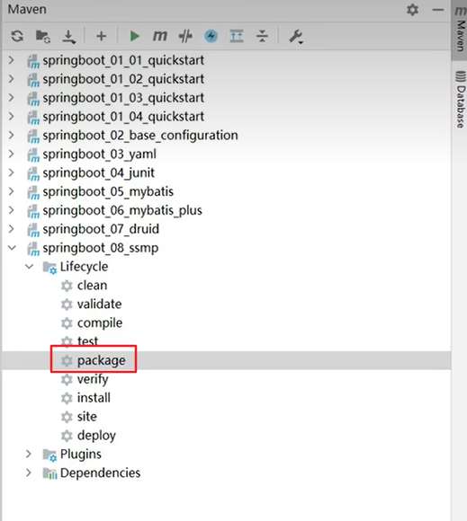

打包完成之后，在项目的target目录下就会生成对应的jar包

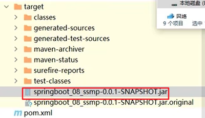

直接使用java -jar命令即可运行jar包，如果想在linux上运行，需将jar包上传至linux服务器，并指定日志输出文件，采用后台启动的方式运行jar包


**快速配置**

当在服务器上运行的jar包有一些临时的配置需要修改，可以通过快速配置进行

```shell
java -jar xxxx.jar --server.port=8080
#将jar包运行的端口设置为8080，可以覆盖原项目中yml配置文件中的配置，如果有多个属性，属性之间使用空格分隔
```

**临时属性**

Springboot的启动类

```java
public class Application {
    /*
    args是系统带的参数，完全可以换成自定义的
    */
    public static void main(String[] args) {
        String[] param = new String[] {"--server.port = 8080"};
        //SpringApplication.run(Application.class, args);
        SpringApplication.run(Application.class, params);  //运行起来也完全没有问题，只是启动端口变为8080
    //为了防止系统参数被外部参数干扰，也可以采用无参的启动方式
        SpringApplication.run(Application.class);
    }
    
}
```

**配置文件分级**

一般来说，Springboot项目结构中，resources目录下会有一个由开发人员创建的application.yml配置文件，但在实际生产中，会有一些特定的配置，保密级别比较高，会放在resources目录下新建的config目录下的application.yml中，在启动时，config下的application.yml会覆盖普通的application.yml

当进行打包，运维人员在进行维护时，与打包后的jar包在同一级目录的application.yml会覆盖原有jar包中的两个application.yml配置，相同的，在同级目录下也会有config/application.yml

所以Springboot可以同时拥有四级配置文件：

```
1级 file(打包后jar包所在目录)/config/application.yml
2级 file/application.yml
3级 resources(项目中的资源文件夹)/config/application.yml
4级 resources/application.yml
四级目录的优先级从高到底排列
```

**多环境开发**

Springboot支持多环境配置，不同环境的配置文件命名：application-环境简称，比如application-dev表示开发环境、application-test表示测试环境，在最后的主配置文件application.yml中配置公共配置项，以及指定使用哪一个配置文件

```yaml
spring:
 profiles:
  active: dev/test/pro
```

在实际开发中，很多独立功能的配置会使用单独的application-xxx.yml进行配置，比如application-devDB.yml、application-devRedis.yml等，在主配置文件中进行相应的配置可以应用这些配置文件

```yaml
spring:
 profiles:
  active: dev
  group:  #不同的组使用不同环境下的配置组
   "dev": devDB,devRedis
   "pro": proDB,proRedis
```

Springboot的多环境配置可以依赖与maven的环境配置，在maven中需要首先设置多环境的信息

```xml
<profiles>
	<profile>
    	<id>env_dev</id>  <!--某一项环境的标识-->
        <properties>
            <!--标签名可任意-->
        	<profile.active>dev</profile.active>
        </properties>
        <activation>
            <!--默认启动环境-->
        	<activeByDefault>true</activeByDefault>
        </activation>
    </profile>
    <profile>
    	<id>env_pro</id>  <!--某一项环境的标识-->
        <properties>
            <!--标签名可任意-->
        	<profile.active>pro</profile.active>
        </properties>
    </profile>
</profiles>
```

在Springboot中的配置文件中可以引用这些环境的配置

```yaml
spring:
 profiles:
  active: @profile.active@  #读取的就是默认启动的环境
```

**日志操作**

日志（log）的作用：

+ 编程期调试代码
+ 运营期记录信息
  + 记录日常运营重要信息（峰值流量，平均响应时间）
  + 记录应用报错信息（错误堆栈）
  + 记录运维过程数据（扩容、宕机、报警）

日志使用方式：

```java
@RestController
@RequestMapping("/book")
public class BookController {
    //Sl4j的Logger和LoggerFactory
    private static final Logger log = LoggerFactory.getLogger(BookController.class);
    
    @GetMapping("/get")
    public String getById() {
        log.debug("debug...");
        log.info("info...");
        log.error("error...");
        log.warn("warn...")
    }
    
}
```

日志配置：

```yaml
logging:
 group:
  #组名任意，后面为一个组内的包
  ebank: com.xxxx.controller,com.xxxx.service,com.xxxx.mapper
 level: 
  root: info   #整个系统项目是info级别的日志
  ebank: debug  #对某个组使用debug级别的日志
```

日志输出格式：

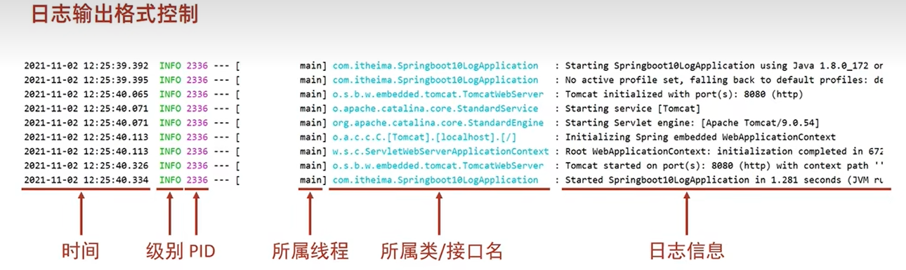

通常在线上运行的项目需要把日志记录到文件中保存下来，Springboot提供了这些日志配置：

```yaml
logging:
 file:
  name: server.log  #保存的文件名，任意
 logback:
  rollingpolicy:
   max-file-size: 10MB   #由于程序在一直运行，记录的日志量会很大，之后定位问题会很麻烦，所以需要将日志分开记录，当一个日志文件达到指定大小时，Springboot会自动将后续日志记录到新文件中
   file-name-pattern: server.%d{yyyy-MM-dd}.%i.log
   #日志文件名的格式，可根据需要进行设置
```

### 五、Springboot开发

**Springboot自动热部署**

导入devtools包

```xml
<dependency>
    <groupId>org.springframework.boot</groupId>
    <artifactId>spring-boot-devtools</artifactId>
</dependency>
```

在IDEA的设置中打开自动编译：当程序内容改变时，IDEA失去焦点5s之后便会自动重启项目

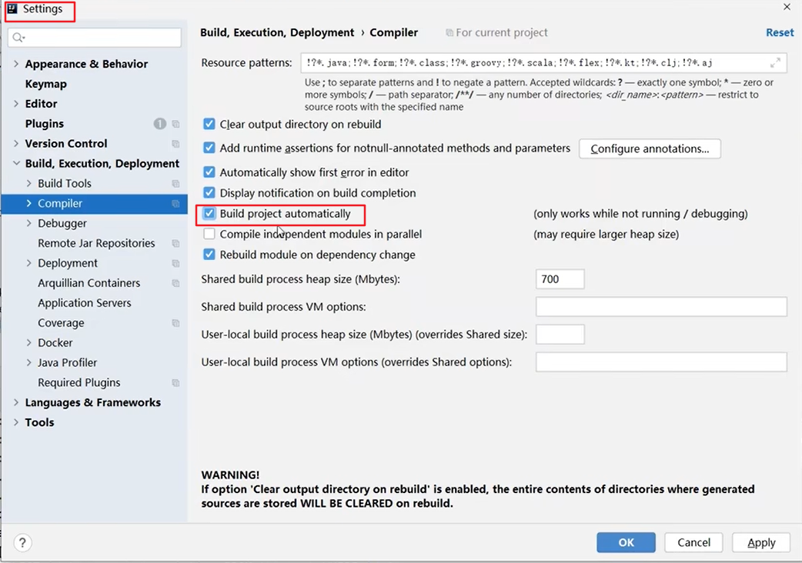

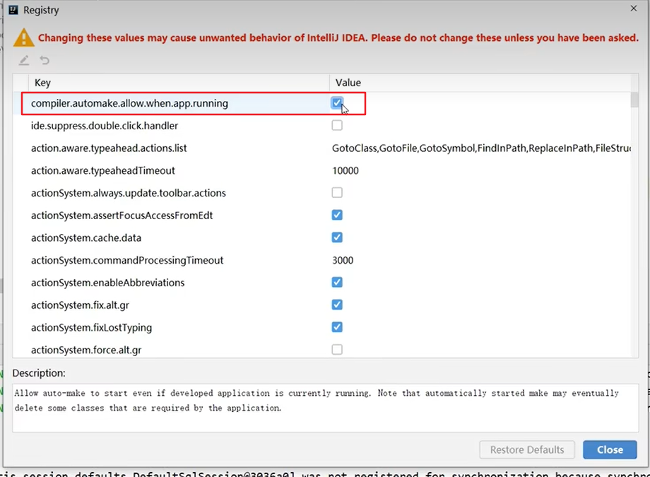

**Springboot高级配置**

`@ConfigurationProperties`注解可以为自定义bean绑定配置，也可以为第三方bean绑定配置

```java
@ConfigurationProperties(prefix = "servers")
public class ServerConfig {
    private String ipAddress;
    private int port;
    private long timeout;
}

yml配置：
servers:
  ipAddress: 127.0.0.1
  port: 6379
  timeout: -1
      
//为第三方bean绑定属性
@Bean
@ConfigurationProperties(prefix = "datasource")
public DruidDataSource dataSource() {
      DruidDataSource ds = new DruidDataSource();
      return ds;
  }

datasource:
  driverClassName: com.mysql.jdbc.Driver //属性名与类中的属性名一致`
```

`@ConfigurationProperties`注解支持宽松绑定，比如类中的属性是ipAddress，配置中可以写ipaddress，ip-address（官方推荐写法）等等。`@Value`注解不支持这种宽松绑定

**Springboot测试**

标准的Springboot的测试模块：

```java
@SpringbootTest
public class xxxxTest {
    @Test
    void testxxxx() {
    }
    
}
```

大多数时候，在测试时，需要在程序中添加一些临时属性。`@SpringbootTest`中有一个属性`String[] properties`可以添加一些临时属性，这样就能在不修改原有application.yml的情况下添加临时属性，并且不会对原有的配置产生干扰

当临时配置与application.yml产生冲突时，properties中的临时属性可以覆盖application.yml中的配置

```java
@SpringbootTest(properties = {"test.prop=testValue"})
public class xxxTest {
    
    @Value("${test.prop}")
    private String msg;
    
    @Test
    void test() {
        System.out.println(msg); //输出testValue1
    }
    
}
```

还有一些时候，需要为测试类专门注入一些特定的bean，这些bean只在测试中被使用，此时，需要将bean定义在测试包test下

```java
//这个bean需要定义在test目录下的包结构中
@Configuration
public class MessageConfiguration {
    
    @Bean
    public String message() {
        return "This is a test bean";
    }
    
}

@SpringbootTest
//通过@Import注解导入相应的配置类
@Import({MessageConfiguration.class})
public class ConfigurationTest {
    
    @Autowired
    private String message;
    
    @Test
    void testMessage() {
        System.out.println(message);
    }
    
}
```

一般在Springboot的测试类中需要同时测试MVC三层，但测试Controller层需要Web环境，Springboot测试类中提供了测试所需要的web环境，`@SpringbootTest`注解中有webEnviornment属性，其中WebEnvironment中有四个常量

```java
@SpringbootTest(webEnvironment = SpringbootTest.WebEnvironment.RANDOM_PORT)
public class WebTest {
    
}
```

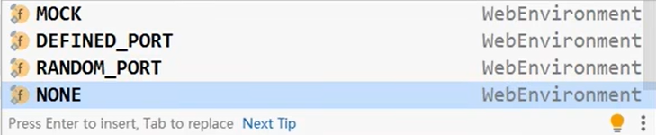

WebEnvironment创建了一个Web环境，在测试类中需要去模拟请求需要被测试的控制层接口

```java
@SpringbootTest(webEnvironment = SpringbootTest.WebEnvironment.RANDOM_PORT)
//通过这个注解开启虚拟MVC调用
@AutoConfigureMockMvc
public class WebTest {
    
    @Test
    //注入虚拟MVC调用对象
    void testWeb(@Autowired MockMvc mvc) throws Exception {
        //1. 创建虚拟请求，访问控制器方法，假设路径为/books
        MockHttpServletRequestBuilder builder = MockMvcRequestBuilders.get("/books");
        //2. 执行请求
        RequestActions action = mvc.perform(builder);
    }
    
}
```

在搭建好测试环境之后，就需要去验证测试是否通过，Springboot提供了web环境下测试的匹配工具

```java
@SpringbootTest(webEnvironment = SpringbootTest.WebEnvironment.RANDOM_PORT)
//通过这个注解开启虚拟MVC调用
@AutoConfigureMockMvc
public class WebTest {
    
    @Test
    //注入虚拟MVC调用对象
    void testWeb(@Autowired MockMvc mvc) throws Exception {
        //1. 创建虚拟请求，访问控制器方法，假设路径为/books
        MockHttpServletRequestBuilder builder = MockMvcRequestBuilders.get("/books");
        //2. 执行请求
        RequestActions action = mvc.perform(builder);
    	//3. 匹配执行状态，是否符合预期值
        //3.1 定义执行状态匹配器
        StatusResultMatchers status = MockMvcResultMatchers.status();
        //3.2 定义预期执行状态
        ResultMatcher ok = status.isOk();
        //3.3 使用本次真实执行结果与预期结果进行对比
        action.andExpect(ok);
    }
    
} 
```

其中`MockMvcResultMatchers`可以进行多种状态的检测，可以根据不同的结构进行相应的匹配

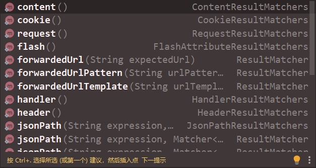

检测的匹配内容也有很多

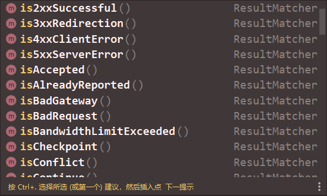

如果匹配成功，则控制台会输出相应的输出结果，但如果匹配失败，控制台会给出详细的请求响应信息

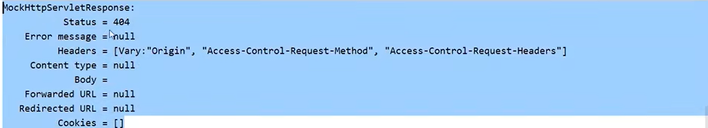

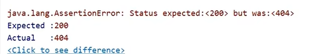

在实际生产中，需要在一个测试方法中定义**多个匹配规则**，定义的规则越多，匹配规则越精准，但开发成本也会相应的增加

在实际生产中，测试需要同时测试Mapper和Service层，但是测试往往会对数据库产生一些测试脏数据，这些数据在上线之前不应该存在，所以需要在测试之后清除这些数据，需要使用到测试的数据回滚，即在测试类上加上`@Transactional`注解

**Springboot监控**

监控的意义：

+ 监控服务状态是否宕机
+ 监控服务运行指标（内存、虚拟机、线程、请求等）
+ 监控日志
+ 管理服务（服务下线）

Springboot的基本监控

```xml
<!--首先需要导入一个监控程序-->
<dependency>
	<groupId>de.codecentric</groupId>
    <artifactId>spring-boot-admin-starter-server</artifactId>
    <!--整个系统Springboot用的什么版本，这里就是什么版本-->
    <version>2.3.7</version>
</dependency>
```

配置监控服务的端口信息：

```yaml
server:
 port: 8080   #端口任意，但不能有冲突
```

在启动类上加上注解

```java
@SpringbootApplication
@EnableAdminServer
public class ActuatorApplication {
    public static void main(String[] args) {
        SpringApplication.run(ActuatorApplication.class, args);
    }
}
```

直接启动服务即可进入监控页面

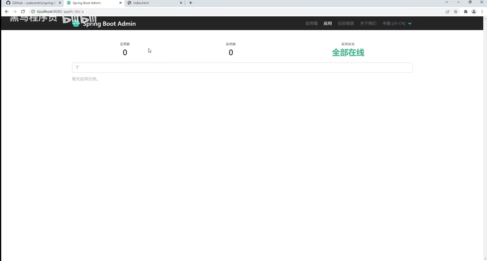

然后配置需要被监控的服务

```xml
<!--在需要被监控的服务中导入配置-->
<dependency>
	<groupId>de.codecentric</groupId>
    <artifactId>spring-boot-admin-starter-client</artifactId>
    <!--整个系统Springboot用的什么版本，这里就是什么版本-->
    <version>2.3.7</version>
</dependency>
```

配置监控器的url

```yaml
server:
 port: 80
spring:
 boot:
  admin:
   client: 
    url: http://localhost:8080
```

启动被监控的服务之后，监控界面就会发生变化

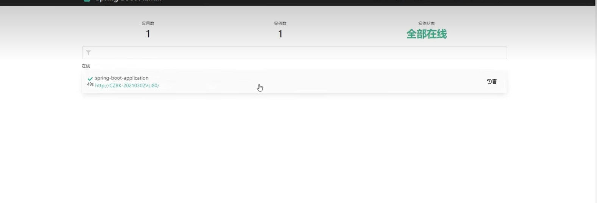

被监控的服务可以决定对监控服务开放被监控的功能，比如监控服务的健康信息等，需要在被监控服务的配置文件中进行配置

```yaml
server:
 port: 80
spring:
 boot:
  admin:
   client: 
    url: http://localhost:8080
management:
 endpoint:
  health:
   show-details: always #默认是never，即不显示健康信息
 endpoints:
  web:
   exposure: 
    include: "*"  #指对监控服务开放所有的监控节点，即监控服务能够看到当前服务运行的所有详细信息，默认能够看到健康信息
```

开放之后，监控服务的界面就能看到结果：

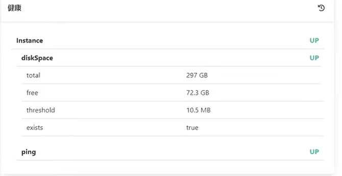

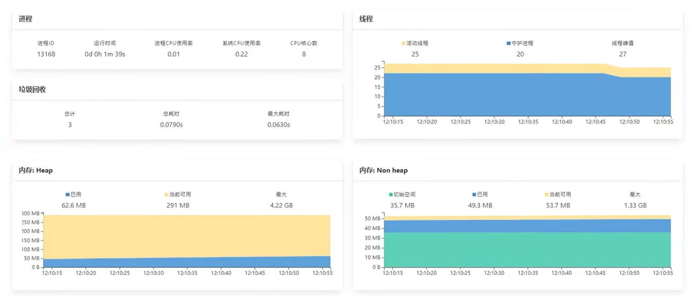

在Springboot中，由Actuator完成对程序的监控

+ Actuator提供了Springboot生产就绪功能，通过端点的配置与访问，获取端点信息
+ 端点描述了一组监控信息，Springboot提供了多个内置端点，也可以根据需要自定义端点信息
+ 访问当前应用所有端点信息：/actuator
+ 访问端点的详细信息：/actuator/端点名称

总共能够检测的端点是13个，可以通过被监控程序的配置文件来启用端点

```yaml
management:
 endpoint: 
  health:
   enabled: true  #表示对外开放端点
   show-details: always
  info:  #端点名称
   enabled: true
###可以通过下面的配置来启用所有端点
management:
 endpoints:
  enabled-by-default: true
```

