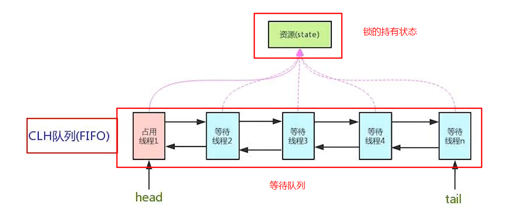
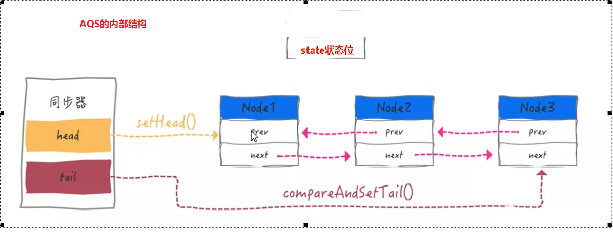
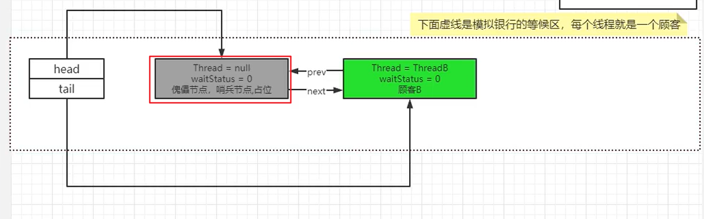
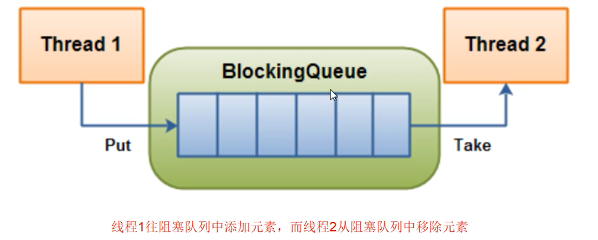
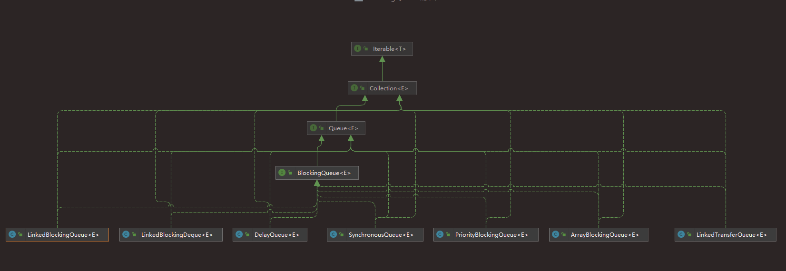
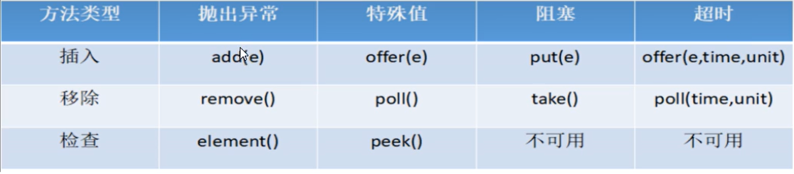
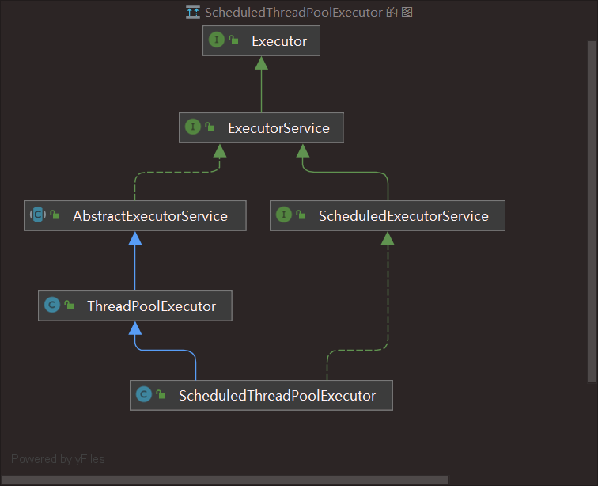

# JUC多线程部分

### Java乐观锁和悲观锁

**悲观锁**

悲观锁的代表就是synchronized和Lock锁

+ 核心思想是，线程只有占有了锁，才能去操作共享变量，每次只有一个线程占锁成功，获取锁失败的线程，都得停下来等待
+ 线程从运行到阻塞，再从阻塞到唤醒，设计线程的上下文切换，如果频繁地发生，会影响性能
+ 实际上，线程在获取synchronized和Lock锁时，如果锁已经被占用，都会做几次重试操作，减少阻塞的机会

**乐观锁**

乐观锁的代表就是AtomicInteger，使用CAS操作来保证原子性

+ 其核心思想是，无需加锁，每次只有一个线程能成功修改共享变量，其他失败的线程不需要停止，不断重试直至成功
+ 由于线程一直运行，不需要阻塞，因此不涉及线程上下文切换
+ 它需要多核CPU支持，且线程数应该和CPU核数相差不大


### ConcurrentHashMap


### ThreadLocal

**ThreadLocal基本概念**

ThreadLocal提供线程局部变量，这些变量与正常变量不同，因为每一个线程在访问ThreadLocal实例的时候（get和set）`都有自己独立的初始化的变量副本`，ThreadLocal实例通常是类中的私有静态字段，使用它的目的是希望将状态与线程关联起来

线程都有自己专属的本地变量副本，主要解决了每个线程绑定自己的值，通过get和set方法，获取默认值或将其值更改为当前线程所存的副本的值从而避免了线程安全问题

简单来讲就是提供了一个不同的解决线程安全问题的思路，之前是避免线程的争抢，每次只能有一个线程访问共享变量；现在是直接将共享资源复制一份给各个线程使用，将共享变量变为线程内部的本地变量

**ThreadLocal的作用**

ThreadLocal可以实现【资源对象】的线程隔离，让每个线程各用各的【资源对象】，避免争用引发的线程安全问题

ThreadLocal同时实现了线程内的资源共享

> 一般的多线程情况下解决共享资源的线程安全问题是通过加锁的方法实现的，不管是加synchronized悲观锁还是使用CAS乐观锁尝试
>
> ThreadLocal采用一种完全相反的解决思路，实现资源对象的隔离，也就是每个线程各用各的资源，将共享资源变得不共享

测试代码：

```java
public class TestThreadLocal {
    public static void main(String[] args) {
        test1();
        test2();
    }

    private static void test1() {
        for (int i = 0; i < 5; i++) {
            new Thread(() -> {
                	//线程间获取的是不同的Connection对象
				log.debug("conn: {}", Utils.getConnection());
            }, "t" + (i + 1)).start();
        }
    }
    
    private static void test2() {
        for (int i = 0; i < 2; i++) {
            new Thread(() -> {
                //线程内获取的是相同的Connection对象
			   log.debug("conn: {}", Utils.getConnection());
                log.debug("conn: {}", Utils.getConnection());
                log.debug("conn: {}", Utils.getConnection());
            }, "t" + (i + 1)).start();
        }
    }

    static class Utils {
        private static final ThreadLocal<Connection> tl = new ThreadLocal<>();

        public static Connection getConnection() {
            Connection conn = tl.get();   //再当前线程中获取资源
            if(conn == null) {
                try {
                    conn = DriverManager.getConnection("");
                } catch (SQLException e) {
                    e.printStackTrace();
                }
                tl.set(conn);   //将资源存入当前线程
            }
            return conn;
        }
    }
}
```

**Thread的实现原理**

从代码上看，整个程序中只有一个ThreadLocal对象（使用static关键字修饰），但却能够实现资源的隔离

其实是每个线程内有一个ThreadLocalMap的成员变量，用来存储资源对象

```java
ThreadLocal.ThreadLocalMap threadLocals = null;   //ThreadLocalMap是ThreadLocal中的一个静态内部类
```

当线程调用ThreadLocal的set方法时，就是以ThreadLocal自己作为key，资源对象作为value，放入调用这个方法线程的ThreadLocalMap中

```java
//ThreadLocal中set方法的源码
public void set(T value) {
    Thread t = Thread.currentThread();  //当前线程
    ThreadLocalMap map = getMap(t);  //从当前线程中获取ThreadLocalMap
    if (map != null) {
        //将ThreadLocal对象作为键，待放入的资源作为value放入到线程的ThreadLocalMap中
        map.set(this, value);
    } else {
        //如果为空则新建一个ThreadLocalMap
        createMap(t, value);
    }
}

void createMap(Thread t, T firstValue) {
    //每个线程调用都会新建一个ThreadLocalMap
	t.threadLocals = new ThreadLocalMap(this, firstValue);
}
```

> 既然是Map就有相应的索引计算和扩容的规则，ThreadLocal内部的这个ThreadLocalMap也一样
>
> + 索引的计算是有规律的，加入第一个ThreadLocal时，hash值固定为0，之后每加入一个ThreadLocal会在前一个hash值的基础上加上一个固定的值，然后再计算桶下标
> + 扩容规则，第一次创建Map的时候，容量默认是16，当Map中的元素个数大于`capacity * 2 / 3`时，就会扩容，容量扩大为原来的两倍，并重新计算元素的桶下标
> + 当然，作为Map还需要考虑hash冲突的解决方案，ThreadLocalMap的解决方法较为简单，就单纯的拉链法，如果有冲突就寻找离冲突点最近的一个空闲位置，放入新元素，注意一点，ThreadLocalMap数组上不能出现链表的结构

当线程调用get方法时，就以ThreadLocal自己作为key，到当前线程的ThreadLocalMap中查找关联的资源值

```java
public T get() {
    Thread t = Thread.currentThread();
    ThreadLocalMap map = getMap(t);  //获取当前线程中的ThreadLocalMap
    if (map != null) {
        ThreadLocalMap.Entry e = map.getEntry(this);
        if (e != null) {
            @SuppressWarnings("unchecked")
            T result = (T)e.value;
            return result;
        }
    }
    //如果当前线程中的ThreadLocalMap还没有创建，则创建并将资源设置进去
    return setInitialValue();
}

//ThreadLocalMap中的getEntry方法
private Entry getEntry(ThreadLocal<?> key) {
            int i = key.threadLocalHashCode & (table.length - 1);  //计算桶下标
            Entry e = table[i];
            if (e != null && e.get() == key)
                return e;
            else
                return getEntryAfterMiss(key, i, e);
        }

//setInitialValue方法
private T setInitialValue() {
        T value = initialValue();
        Thread t = Thread.currentThread();
        ThreadLocalMap map = getMap(t);
        if (map != null) {  //如果已经有ThreadLocalMap了，直接设置值
            map.set(this, value);
        } else {
            //否则新建一个ThreadLocalMap并将资源put进去
            createMap(t, value);
        }
        if (this instanceof TerminatingThreadLocal) {
            TerminatingThreadLocal.register((TerminatingThreadLocal<?>) this);
        }
        return value;
    }
```

**为什么ThreadLocalMap中的key（ThreadLocal）要设计为弱引用**

```java
//这是ThreadLocalMap中存储键值对的一个内部类，可以看到它继承自WeakReference
static class Entry extends WeakReference<ThreadLocal<?>> {
    /** The value associated with this ThreadLocal. */
    Object value;

    Entry(ThreadLocal<?> k, Object v) {
        super(k);  //只有键是弱引用
        value = v;
    }
}
```

Thread可能需要长时间运行，如果key不再使用，需要在内存不足时释放其占用的内存

如果把key设置为强引用，那么在垃圾回收的时候，即使其余地方不再使用这些键值，GC也不会回收掉这部分内存，因为线程内部的Map还在，仍然在引用这些key，所以仍然是释放不掉这部分内存的

弱引用只要到垃圾回收的时候就会被回收，只要别的地方没有引用这些key，就会被垃圾回收器回收

但只会回收key，值仍然是强引用，不会被回收，所以这是ThreadLocalMap不同于其他Map的一种情况，key可以为null，值不为null

> 弱引用：描述一些非必须对象，被弱引用关联的对象只能生存到下一次垃圾收集发生为止，当GC开始工作，无论当前内存是否足够，都会回收掉只被弱引用关联的对象

**value的释放时机**

（1）调用get方法时，发现key为null，会顺便将这个位置上的value置为null

```java
//再来看get方法的最后返回值，这个方法就是如果在get方法中判断key为null时，
private T setInitialValue() {
    T value = initialValue();  //这个方法只返回null，即将value置为null
    Thread t = Thread.currentThread();
    ThreadLocalMap map = getMap(t);
    if (map != null) {
        map.set(this, value);  //如果Map不为空，但key为null，执行set会把之前的value置为null
    } else {
        createMap(t, value);
    }
    if (this instanceof TerminatingThreadLocal) {
        TerminatingThreadLocal.register((TerminatingThreadLocal<?>) this);
    }
    return value;
}
```

（2）调用set方法时，会使用启发式扫描，清除**临近**的key为null的值

但一般ThreadLocal使用时都会被设置为static的变量，一般不会被垃圾回收器回收，前两种情况发生的也比较少

（3）主动调用remove方法直接清除指定的key-value

### AbstractQueuedSynchronizer

简称AQS，抽象队列同步器，最主要的使用方式就是继承这个类，队列管理抢占锁失败的线程

```java
public abstract class AbstractQueuedSynchronizer
    extends AbstractOwnableSynchronizer
    implements java.io.Serializable 
```

AQS是用来构建锁或者其他同步器组件的**重量级基础框架及整个JUC体系的基石**，通过内置的FIFO队列来完成资源获取线程的排队工作，并通过一个int类型变量表示持有锁的状态



AQS的作用：

管理被加锁阻塞的线程，抢到资源的线程直接使用处理业务逻辑，抢不到资源的必然涉及一种排队等待机制，抢占资源失败的线程继续去等待，但等候的线程仍然保留获取锁的可能且获取锁流程仍然在继续（类似于顾客排队用餐）

如果共享资源被占用，就需要一定的阻塞等待唤醒机制来保证锁分配，这个机制主要用的是CLH队列的变体实现，将暂时获取不到锁的线程加入到队列中，这个队列就是AQS的抽象表现，它将请求共享资源的线程封装成队列的结点，**通过CAS，自旋以及LockSupport.park()的方式**，维护state变量的状态，使并发打到同步的控制效果


AQS使用一个volatile的int类型的成员变量来表示同步状态

```java
/**
 * The synchronization state.
 */
private volatile int state;
```

通过内置的FIFO队列来完成资源获取的排队工作将每个要去抢占资源的线程封装成一个Node结点来实现锁的分配，通过CAS完成对State值的修改

```java
//内置的一个队列结点类
static final class Node {
    //... 
    //双向链表
    volatile Node prev;

    volatile Node next;
	//封装线程
    volatile Thread thread;
    
    //每个线程的等待状态，默认为0
    volatile int waitStatus;
	
    //...
}
protected final boolean compareAndSetState(int expect, int update) {
    return STATE.compareAndSet(this, expect, update);
}
```

**总结**

AQS的内部结构总结起来就是：



### ReentrantLock的实现原理

Lock接口的实现类，基本都是通过聚合了一个队列同步器的子类完成线程的访问控制的

```java
public class ReentrantLock implements Lock, java.io.Serializable {
 	...
    private final Sync sync;
    abstract static class Sync extends AbstractQueuedSynchronizer {
   		...
    }
    
    ...
}
```

```java
ReentrantLock lock = new ReentrantLock();   //默认是非公平锁
public ReentrantLock() {
    sync = new NonfairSync();
}
//true是公平锁  false是非公平锁
ReentrantLock lock = new ReentrantLock(true / false);
public ReentrantLock(boolean fair) {
    sync = fair ? new FairSync() : new NonfairSync();
}
```

> 公平锁：讲究先来先得，线程在获取锁的时候，如果这个锁的等待队列中已经有线程在等待，那么当前线程就会进入等待队列中
>
> 非公平锁：不管是否有等待队列，如果可以获取锁，则立刻占有锁对象，也就是说队列的第一个排队线程在unpark()，之后还是需要竞争锁，并不是直接获得锁

**lock()方法**

```java
public void lock() {
    sync.acquire(1);
}
public final void acquire(int arg) {
        if (!tryAcquire(arg) &&   //尝试获取锁失败，tryAcquire()返回false，那么!tryAcquire()就是true，还会继续执行下面的方法
            acquireQueued(addWaiter(Node.EXCLUSIVE), arg))
            selfInterrupt();
    }
//非公平锁的tryAcquire()实现  --- nonfairTryAcquire()方法
final boolean nonfairTryAcquire(int acquires) {
            final Thread current = Thread.currentThread();   //获取当前线程
            int c = getState();   //获取当前锁的状态
            if (c == 0) {  //首先判断锁的状态
                if (compareAndSetState(0, acquires)) {  //使用CAS的方式设置锁的状态  0表示锁没有被任何线程获取
                    setExclusiveOwnerThread(current);   //如果设置成功，则设置锁的持有者为当前线程
                    return true;
                }
            }
    		//这部分就是ReentrantLock可重入的原理
            else if (current == getExclusiveOwnerThread()) {  //判断当前想要获取锁的线程和持有锁的线程是不是同一个，如果是，也可放行
                int nextc = c + acquires;
                if (nextc < 0) // overflow
                    throw new Error("Maximum lock count exceeded");
                setState(nextc);
                return true;
            }
            return false;   //尝试获取锁失败，返回false
        }
```

**addWaiter()方法**

AQS中的方法，将没抢到锁的线程入队

```java
private Node addWaiter(Node mode) {
    Node node = new Node(mode);

    for (;;) {
        //当第二次进入for循环时，由于已经做了初始化，tail指针指向的就是新创建出来的占位结点
        Node oldTail = tail;
        if (oldTail != null) {
            //在这里的时候，获取锁失败的线程才真正入队
            node.setPrevRelaxed(oldTail);  //设置结点的前向引用，如果是第一个入队的线程，指向的就是占位结点
            if (compareAndSetTail(oldTail, node)) {  //使用CAS的方式改变尾指针
                oldTail.next = node;  //把链表连接起来
                return node;
            }
        } else {
            //跳出这个方法之后会第二次进入for循环
            initializeSyncQueue();
        }
    }
}

//初始化队列
private final void initializeSyncQueue() {
        Node h;
        if (HEAD.compareAndSet(this, null, (h = new Node())))   //当第一次有线程准备入队时，会先向队列中放一个占位结点，也称为哑元结点
            tail = h;
    }
```

类似于这样的情况：



**acquireQueued()方法**

```java
final boolean acquireQueued(final Node node, int arg) {
    boolean interrupted = false;
    try {
        for (;;) {
            final Node p = node.predecessor();   //获取当前结点的前一个结点
            if (p == head && tryAcquire(arg)) {  //如果是队列的第一个有效结点（不包括占位节点），可以允许线程再一次尝试获取锁
                setHead(node);  //如果获取锁成功，就会将线程所在的那个结点转换为新的哨兵结点
                p.next = null; // 原来的哨兵结点会被垃圾回收器回收
                return interrupted;
            }
             //第一次调用这个方法的时候，返回false，但会把结点的状态置为-1，由于自旋的原因，第二次调用这个方法的时候就会返回true
            if (shouldParkAfterFailedAcquire(p, node)) 
                interrupted |= parkAndCheckInterrupt();  //parkAndCheckInterrupt方法就调用了LockSupport的park方法，将线程挂起，此时线程才算真正进入了AQS的等待队列中，在此之前它仍然可以尝试获取锁
        }
    } catch (Throwable t) {
        cancelAcquire(node);
        if (interrupted)
            selfInterrupt();
        throw t;
    }
}

private static boolean shouldParkAfterFailedAcquire(Node pred, Node node) {
        int ws = pred.waitStatus;  //获取结点的等待状态
        if (ws == Node.SIGNAL)  //-1表示的是这个由这个结点去调用unpark()方法去唤醒它的下一个结点
            /*
             * This node has already set status asking a release
             * to signal it, so it can safely park.
             */
            return true;
        if (ws > 0) {
            /*
             * Predecessor was cancelled. Skip over predecessors and
             * indicate retry.
             */
            do {
                node.prev = pred = pred.prev;
            } while (pred.waitStatus > 0);
            pred.next = node;
        } else {
            //将pre结点的等待状态改为Node.SIGNAL(-1)
            pred.compareAndSetWaitStatus(ws, Node.SIGNAL);
        }
        return false;
    }
```

**unlock()方法**

```java
public void unlock() {
    sync.release(1);
}

public final boolean release(int arg) {
        if (tryRelease(arg)) {
            Node h = head;
            if (h != null && h.waitStatus != 0)
                //释放锁成功，并且队列中有其他等待的线程
                unparkSuccessor(h);
            return true;
        }
        return false;
    }
//ReentrantLock内部类Sync中的tryRelease()方法
protected final boolean tryRelease(int releases) {
            int c = getState() - releases;
            if (Thread.currentThread() != getExclusiveOwnerThread())
                throw new IllegalMonitorStateException();
            boolean free = false;
            if (c == 0) {  //表示当前线程释放锁
                free = true;
                setExclusiveOwnerThread(null);
            }
            setState(c);
            return free;
        }

private void unparkSuccessor(Node node) {
        //获取队列头节点的等待状态，一般都是占位结点的状态
        int ws = node.waitStatus;
        if (ws < 0)
            //重新设置为0
            node.compareAndSetWaitStatus(ws, 0);

        Node s = node.next;
        if (s == null || s.waitStatus > 0) {
            s = null;
            for (Node p = tail; p != node && p != null; p = p.prev)
                if (p.waitStatus <= 0)
                    s = p;
        }
    	//从这里可以看出，从队列中唤醒线程的时候，是由当前结点的前一个结点去唤醒的线程
        if (s != null)
            LockSupport.unpark(s.thread);
    }
```

### synchronized与Lock的区别

（1）`synchronzied`是Java的关键字，属于JVM层面的内容；`Lock`是`java.util.concurrent`包下的锁，属于api层面的锁

+ `synchronzied`在jvm层面表现为`monitorenter`和`monitorexit`两条字节码指令，底层原理是Monitor对象
+ `Lock`是一个接口，有多种实现，比如常用的`ReentrantLock`

（2）`synchronized`不需要用户手动释放锁，当线程执行完代码块中的内容时，会自动释放；即使代码块中的程序出现异常，也会释放锁

`Lock`（以ReentrantLock为例）需要手动上锁和解锁，如果没有解锁就可能出现死锁的情况

```java
Lock lock = new ReentrantLock();
lock.lock();
try {
    //具体业务代码
} finally {
    lock.unlock();  //释放锁
}
```

（3）`synchronized`代码块中执行不可中断（不考虑wait和sleep等方法，单就synchronized关键字来说），除非程序抛出异常或执行完成自动退出，其余线程如果没获得锁只能阻塞等待

`Lock`比较灵活，有尝试获取锁的`tryLock(long timeout, TimeUnit unit)`方法，如果超时就放弃释放锁进入阻塞队列等待

（4）`synchronized`是非公平锁，`ReentrantLock`默认也是非公平锁，但也支持公平锁

（5）`synchronized`相当于只有一个条件，因为只能绑定一个Monitor对象

`ReentrantLock`可以绑定多个Condition对象，可以实现分组唤醒线程，`synchronized`要么随机唤醒一个，要么都唤醒

绑定多个Condition的示例：

```java
//实现线程的轮流打印，线程1打印5次A，接着线程2打印10次B，最后线程3打印15次C，循环10次
class ConditionLock {

    private int flag;
    private int loopNumber;

    private Lock lock = new ReentrantLock();

    private Condition a = lock.newCondition();
    private Condition b = lock.newCondition();
    private Condition c = lock.newCondition();

    public ConditionLock(){}

    public ConditionLock(int flag, int loopNumber) {
        this.flag = flag;
        this.loopNumber = loopNumber;
    }

    public void print(int status, int nextStatus, int loop, char ch) {
        for(int i = 0; i < loopNumber; i++) {
            lock.lock();  //上锁
            try {
                //1. 判断
                while(status != flag) {
                    if(status == 1) {
                        a.await();
                    } else if(status == 2) {
                        b.await();
                    } else {
                        c.await();
                    }
                }
                //2. 打印
                for(int j = 0; j < loop; j++) {
                    System.out.println(Thread.currentThread().getName() + ": " + ch);
                }
                //3. 通知
                flag = nextStatus;
                if(nextStatus == 1) {
                    a.signal();
                } else if(nextStatus == 2) {
                    b.signal();
                } else {
                    c.signal();
                }
            } catch (Exception e){
                
            } finally {
                lock.unlock();
            }
        }
    }
}
```


### 阻塞队列

阻塞队列首先是一个队列：



阻塞队列的两个特点：

+ 当阻塞队列是**空**的时候，从队列中**获取元素**的操作将会被阻塞
+ 当阻塞队列是**满**的时候，往队列中**添加元素**的操作会被阻塞

**为什么需要阻塞队列**

好处就是不需要去关心什么时候需要阻塞线程，什么时候需要唤醒线程，因为这一切阻塞队列都实现了

**BlockingQueue的继承关系及其主要实现类**




+ `ArrayBlockingQueue`：有数组结构组成的有界阻塞队列
+ `LinkedBlockingQueue`：由链表结构组成的有界阻塞队列（虽然有界，但最多可以放Integer.MAX_VALUE，相当于无界）
+ `PriorityBlockingQueue`：支持优先级排序的无界阻塞队列
+ `SynchronousQueue`：不存储元素的阻塞队列，即单个元素的队列，放入队列中就必须立刻被消费

接口的常用方法：



比较特殊的是第三组`put()和take()`：

+ 当阻塞队列满时，生产者线程继续往队列里put元素，队列会一直阻塞生产者线程
+ 当阻塞队列空时，消费者线程试图从队列里take元素，队列会一直阻塞消费者线程

`ArrayBlockingQueue`和`LinkedBlockingQueue`基本上与`ArrayList`和`LinkedList`操作差不多

一个不同的是`SynchronousQueue`，这个队列中只会存放一个元素，消费者不消费，生产者不生产


### 线程池

Java中的线程池是通过Executor框架实现的，该框架中用到了Executor，Executors，ExecutorService，ThreadPoolExecutor这几个类



其中最重要的就是ThreadPoolExecutor

**三种常用的线程池**

+ `Executors.newFixedThreadPool(int nThread)`：固定线程数的线程池，核心线程数 = 最大线程数，适合执行长期任务
+ `Executors.newCachedThreadPool`：线程池中有多个线程，没有核心线程，全是救急线程，并且有无穷多个救急线程，适合执行短时间任务
+ `Executors.newSingleThreadPool`：线程池中只有一个线程，核心线程数 = 最大线程数 = 1，适合任务串行执行的场景

**线程池的七个参数**

```java
public ThreadPoolExecutor(int corePoolSize,   //核心线程数
                          int maximumPoolSize,   //最大线程数
                          long keepAliveTime,   //救急线程存活时间
                          TimeUnit unit,    //时间单位
                          BlockingQueue<Runnable> workQueue,    //任务队列 / 阻塞队列
                          ThreadFactory threadFactory,    //线程工厂
                          RejectedExecutionHandler handler) {}    //拒绝策略
```

**线程池的工作原理**

《JUC并发编程》6.1.2

**Tips**

虽然在JDK中提供了三种常用线程池，但由于本身的限制，生产上几乎不用这三种使用`Executors`创建的线程池（加上`ScheduleThreadPool`四个都不用）

原因：

+ `FixedThreadPool`和`SingleThreadPool`使用LinkedBlockingQueue，可能会堆积大量请求导致OOM
+ `CachedThreadPool`和`ScheduleThreadPool`允许创建的线程数为Integer.MAX_VALUE，创建大量线程也可能导致OOM

**如何确定线程池的线程数**

一般有两种方式来计算线程数量：

+ CPU密集型运算：通常采用 `cpu 核数 + 1` 能够实现最优的 CPU 利用率，+1 是保证当线程由于页缺失故障（操作系统）或其它原因
  导致暂停时，额外的这个线程就能顶上去，保证 CPU 时钟周期不被浪费

+ IO密集型运算：CPU并不总是处于繁忙的情况下，例如，执行IO操作或者进行远程RPC调用时，CPU就会闲下来了

  经验公式：`线程数 = 核数 * 期望 CPU 利用率 * 总时间(CPU计算时间+等待时间) / CPU 计算时间`

  例如 4 核 CPU 计算时间是 50% ，其它等待时间是 50%，期望 cpu 被 100% 利用，套用公式 `4 * 100% * 100% / 50% = 8`，即需要8个线程

### Java中的锁

（1）悲观锁和乐观锁

+ 悲观锁：给共享数据加锁，线程每次使用共享资源的时候都会上锁，其余没有获取锁的线程只能阻塞等待，java中的synchronized和ReentrantLock是悲观锁的几种实现方式
+ 乐观锁：在操作共享数据时，不给数据上锁，在更新数据的时候判断在此期间是否有线程去修改了这个数据，CAS是乐观锁的一种实现

（2）独占锁和共享锁

+ 独占锁：指锁一次只能被一个线程占有，如果一个线程对数据加上独占锁之后，其他线程不能再对这个数据加锁，占有锁的线程可以对数据进行读操作和写操作，Java中的synchronized和Lock接口的一些实现都是独占锁
+ 共享锁：指锁可以被多个线程持有，如果一个线程对数据加上共享锁之后，其他线程只能对数据加共享锁，不能加独占锁，持有共享锁的线程只能对数据进行读操作，不能修改数据，读锁就是一种共享锁，比如java中的ReentrantReadWriteLock

（3）公平锁和非公平锁

+ 公平锁：多个线程按照申请获取锁的顺序获得锁，类似于排队，先来先得，后来后得，ReentrantLock支持公平锁
+ 非公平锁：多个线程并非按照申请锁的顺序获得锁，后来申请的线程可能比先申请的线程快一步获得锁，有可能造成线程饥饿的现象，ReentrantLock默认就是非公平锁

（4）可重入锁

可重入锁指同一个锁在外层获取了一次锁之后，进入内层方法会自动获取锁，可重入锁的一个好处就是可以在一定程度上避免死锁，Java中ReentranLock就是典型的一个可重入锁
