# JVM部分

### JVM的内存结构

**java代码的执行流程**

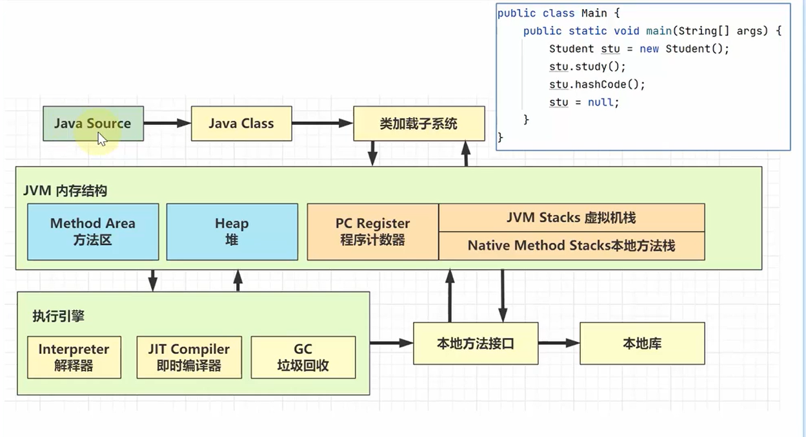

**jvm内存的各个部分**

+ 类加载子系统：将类的字节码文件读取到内存中
+ 方法区：存放代码中类的原始信息，包括类的名字，类的继承关系，类的成员变量，类的成员方法等等
+ 堆（Heap）：存放对象，即使用new关键词创建对象之后，对象的存放位置
+ java虚拟机栈：给各个线程运行提供内存，线程内的局部变量存放处
+ PC程序计数器：可以通俗理解为记录当前线程执行到第几行代码

> PC，jvm栈和本地方法栈都是线程私有的

**可能产生内存溢出**

内存溢出：

+ `StackOverflowError`：
  + 虚拟机内方法调用过多，最常见的一种情况就是递归调用
+ `OutOfMemoryError`：
  + 堆内存耗尽，对象越来越多，却又一直在使用，不能被垃圾回收
  + 方法区内存耗尽，加载的类越来越多，比如Java代码离出现了很多new新的一个类，很多框架都会在运行期间动态产生新的类，但这种情况比较少见
  + 虚拟机栈累计，线程的创建也会占用内存，如果线程数过多，并且长时间运行不销毁，也会导致内存溢出

> 只有PC既不会发生StackOverflow也不会发生OutOfMemory

**方法区，永久代，元空间**

+ 方法区时JVM规范中定义的一块内存区域，用来存储类的元数据信息、方法的字节码信息、即时编译器需要的信息等；但这仅仅是Java虚拟机的一个规范，具体实现需要看具体的虚拟机
+ 永久代是Hotspot虚拟机对JVM规范的实现（jdk1.8之前）
+ 元空间是Hotspot虚拟机对JVM规范的实现（jdk1.8及之后），使用本地内存作为这些信息的存储空间

元空间：

元空间中存储类的原始信息，通过堆内的XXX.class对象去访问元空间中的类原始信息

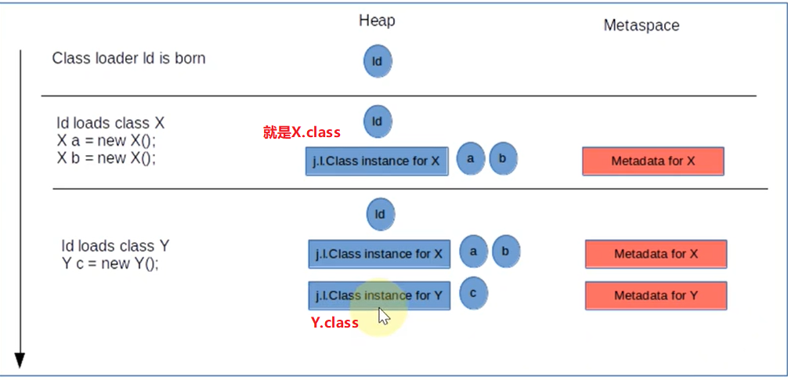

### Java内存参数

+ -Xmx：Java虚拟机的最大内存
+ -Xms：Java虚拟机的最小内存
+ -Xmn：堆内存中新生代的内存大小
+ -XX:SurvivorRatio = x：新生代内Eden区和其中一个survivor区内存大小的占比为x : 1
  + 这个有个默认值，是Eden:from:to = 8:1:1
+ -XX:NewRatio：控制整个新生代的内存比例
  + 也有个默认值Young : Old = 1 : 2

### JVM垃圾回收算法

**标记过程**

可达性分析，首先找到GCRoots，一般能够作为GCRoots的有：

+ 正在使用的局部变量
+ 静态变量
+ ......

然后沿着这些GCRoots的引用链，找到根对象直接或者间接引用的对象，给这些对象加上标记，表示这些对象不能被回收

**标记清除算法**

在标记对象之后，直接清除掉未标记的对象即可

缺点就是会产生比较多的空间碎片，内存不连续

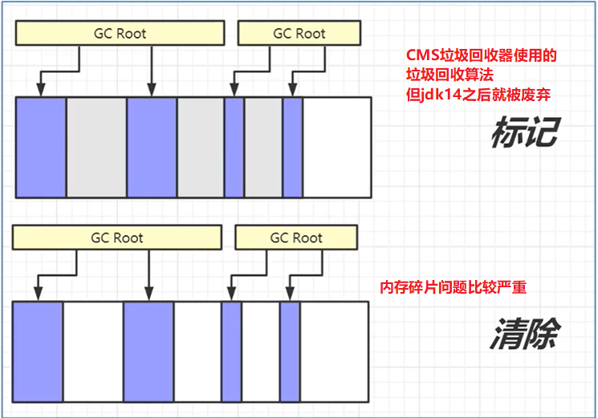

**标记整理算法**

在标记之后，将没有标记的对象清除，并将剩余的存活对象向内存的一端靠拢，解决内存碎片的问题，常用于老年代的垃圾回收

缺点就是效率比较低

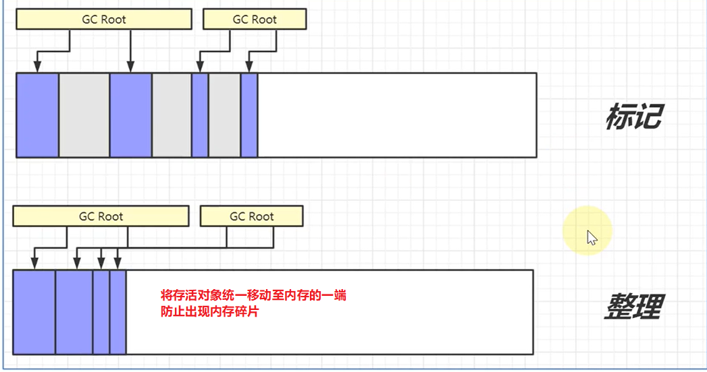

**标记复制算法**

将内存一分为二，只使用一半，新生代中survivor就是使用的这种垃圾回收算法，效率比较高

缺点就是浪费内存，只能使用一半

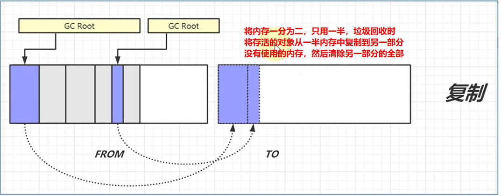

### 垃圾回收和分代回收算法

**垃圾回收的目的**

GC的目的在于实现无用对象内存的自动释放，减少内存碎片，加快分配速度

**垃圾回收的要点**

+ 回收的区域是堆内存，不包括虚拟机栈，栈中，方法返回之后会自动释放方法所占用的内存
+ 使用可达性分析算法来标记存活对象
+ GC的具体实现，常用的垃圾回收器
+ GC大多采用了分代回收的思想，理论依据是大部分对象朝生夕灭，用完之后立即可以回收，另有少部分对象会长时间存活，每次很难回收，所以根据对象的这两个特性将回收区域分为新生代和老年代，不同区域的回收策略也不同
+ 根据GC的规模可以分成Minor GC（新生代垃圾回收），Mixed GC（部分老年代发生垃圾回收）、Full GC（全面回收新生代和老年代）
  + Minor GC暂停时间比较短
  + Full GC垃圾回收规模比较大，暂停时间比较长，应该尽量避免

**分代回收算法**

新生代：

+ eden区，Java对象最初都是诞生在这里
+ survivor区，当eden区内存不足，垃圾回收之后，幸存的对象会被放在survivor区内，分成from区和to区

老年代：

+ 当新生代的对象熬过了多次的垃圾回收（最多15次），就会被晋升到老年代
+ 如果创建的对象过大，新生代放不下了，也会被直接放到老年代

**三色标记法**

故名思意：以三种颜色记录对象的标记状态

+ 黑色，已标记对象
+ 灰色，标记中的对象
+ 白色，还未标记的对象

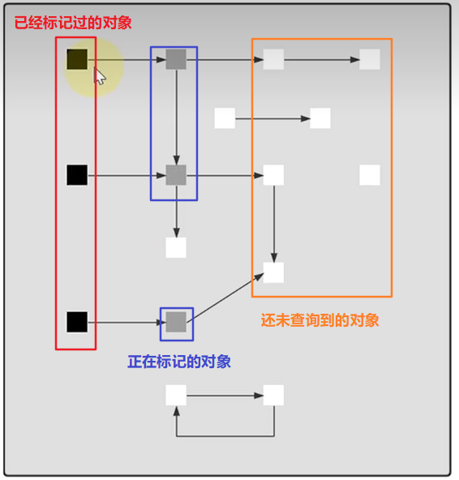

**并发标记**

CMS垃圾回收器使用垃圾收集线程和用户线程同时工作的方式，暂时标记一部分存活对象

但由于和用户线程并发执行，用户线程就会改变已有的引用关系，比如：

+ 垃圾收集线程正在标记a对象，用户线程先断开a对象与b对象之间的引用关系，新建立了已经标记完成的c对象与b对象之间的引用关系
+ 已经标记过的d对象，又新引用了刚创建的e对象

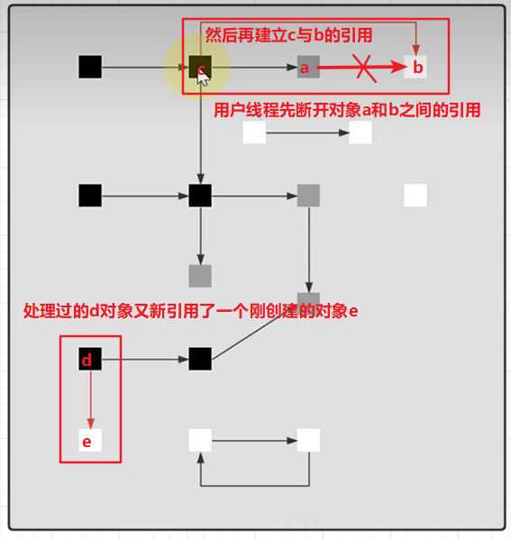

由于对象c与对象d都是已经被标记过了，垃圾回收线程并不会再去查找它们的引用关系，所以，在并发标记阶段，对象b与对象e会被误认为是垃圾

所以，CMS垃圾回收器在并发标记阶段之后还有一个重新标记的阶段，这一阶段必须STW，即暂停用户线程，对对象d，c的引用关系进行重新处理

### 常用的垃圾回收器

**Parallel GC**

由两部分组成，一个是新生代垃圾回收器Parallel Scavenge收集器，一个是老年代垃圾回收器Parallel Old收集器，`支持多线程并发收集`

+ Parallel Scavenge，当eden内存不足时，对新生代做垃圾回收，采用标记复制算法，会暂停用户线程
+ Parallel Old，当老年代内存不足时，会同时触发新生代和老年代的垃圾回收（即Full GC），对老年代采用标记整理算法，会暂停用户线程
+ 这款垃圾回收器比较注重吞吐量，整体上暂停时间比较短

> 吞吐量 = 运行用户代码时间 / (运行用户代码时间 + 运行垃圾收集时间)

**CMS**

CMS收集器是一种以获取最短回收停顿时间为目标的收集器，基于标记清除算法实现

CMS垃圾回收分为四个部分：

+ 初始标记，需要STW，仅仅标记GCRoots能够直接关联的对象，通常暂停时间比较短
+ 并发标记，不需要STW，可以与用户线程并发执行，从GCRoots遍历整个引用关系图的过程，整个过程耗时较长
+ 重新标记，需要STW，主要是修正一些误标为垃圾的对象，通常暂停时间也比较短
+ 并发清除，不需要STW，清除掉垃圾对象，整个过程耗时也比较长

CMS比较注重响应时间，即每次垃圾回收停顿的时间比较短，但有明显的几个缺点：

+ 采用标记清除算法，容易产生内存碎片
+ CMS无法处理浮动垃圾
  + 浮动垃圾：即在并发标记阶段，用户线程产生的新垃圾，CMS不能够识别出它们，只能等到下一次垃圾回收时，才能够去处理
  + 重新标记阶段是标记那些被误认为是垃圾的对象，而不是去标记那些新产生的对象，所以不能识别浮动垃圾
+ 由于在标记阶段能够和用户线程并行执行，CMS在进行垃圾回收时，并不能等到老年代被完全填满的时候，而是需要去预留一部分空间存放用户线程新产生的对象，这就有可能造成CMS的一次并发失败（Concurrent Mode Failure）
  + 即预留出来的空间不足以存放用户线程产生的新对象，就会产生并发失败
  + 并发失败之后，CMS垃圾回收器会采用最差的备用方案，即进行依次Full GC，很影响性能

> 正因为CMS的这些缺点，在jdk1.9之后就不提倡使用
>
> 在jdk1.14之后被完全废弃

**G1**

G1垃圾回收器是基于Region的内存分布，采用局部收集的设计思想：

region：把堆内存分割为许多不相关的区域，这些区域就称为region，使用这些region来表示eden，survivor和old区

这些region的大小相等，可以通过参数进行调整，取值范围为1MB - 32MB

由于划分了这些region区域，在进行垃圾回收时，G1可以面向堆内存中的任何区域进行垃圾回收，这就是G1收集器特有的Mixed GC

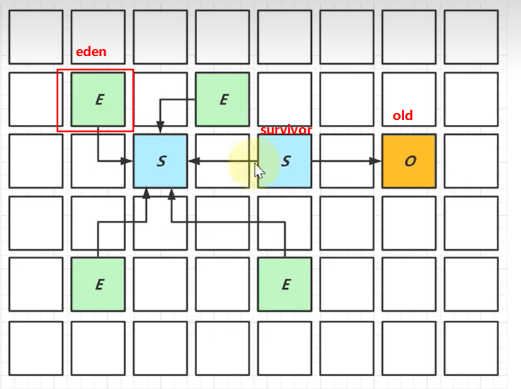

G1的垃圾回收阶段也可以大致划分为四个阶段：

+ 初始标记阶段：也是标记GC Root的直接关联对象，并且修改TAMS（Top at Mark Start）指针
  + TAMS指针的作用是让用户线程在并发标记阶段能够选择空闲的region区分配对象
+ 并发标记阶段：从GC Roots开始进行可达性分析，找出要回收的对象
+ 最终标记阶段：需要暂停用户线程，也是用于处理并发标记阶段遗留的标记问题
+ 混合收集阶段：对各个待回收的Region的回收价值和成本做一个排序，根据用户所期望的停顿时间来制定回收计划，率先回收那些回收价值较高的region
  + 这个阶段可能被执行多次

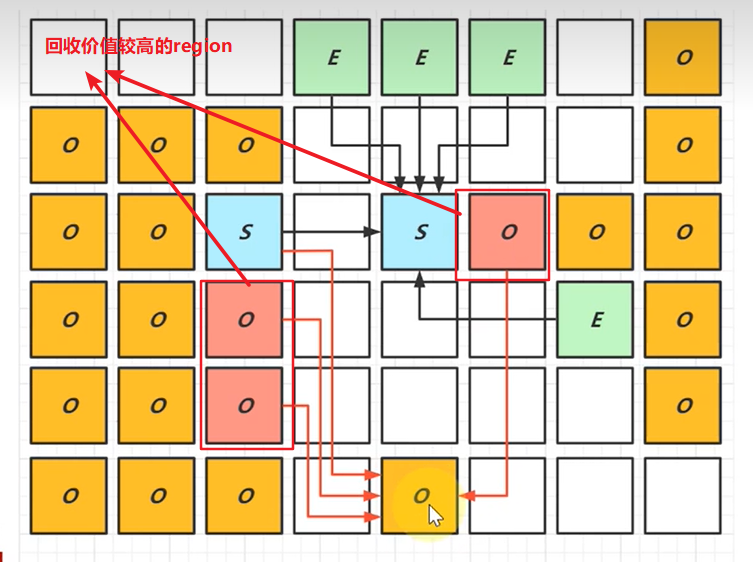

G1垃圾回收器相对于CMS回收器来说的优势：

+ 采用标记复制算法，产生的内存碎片比较少
+ 可以根据用户的期望设置垃圾回收器的暂停时间

但是相对于CMS来说，G1也有不足的地方：

+ G1为了垃圾回收产生的内存占用和程序运行时的额外执行负载都比CMS要高
+ 因为采用了标记复制算法，需要移动对象，以及对Region做回收价值的排序等

### 对象的引用类型

+ 强引用：普通变量的赋值即为强引用，A a = new A(); 通过GC Root的引用链，只要被强引用到的对象都不会被回收

+ 软引用：

  + SoftReference a = new SoftReference(new A())
  + 如果仅有软引用该对象时，首次垃圾回收不会回收该对象，如果内存仍然不足，再次触发垃圾回收时，才会释放对象
  + 软引用自身需要配合引用队列来释放
  + 典型的软引用是反射，通过反射获得的对象基本都是软引用

  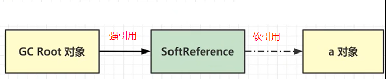

+ 弱引用：

  + WeakReference a = new WeakReference(new A())
  + 如果仅有弱引用引用该对象，只要发生垃圾回收，就会把对象回收
  + 弱引用自身也需要配合引用队列来释放
  + 典型的例子就是ThreadLocalMap中的Entry对象

  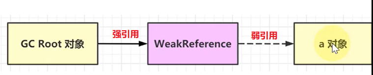

+ 虚引用：

  + PhantomReference a = new PhantomReference(new A())
  + 必须配合引用队列一起使用，当虚引用的对象被回收时，会将虚引用对象入队，由ReferenceHandler线程释放其关联的外部资源（即直接物理内存被使用的资源）
  + 典型的例子是Cleaner释放DirectByteBuffer占用的直接内存

  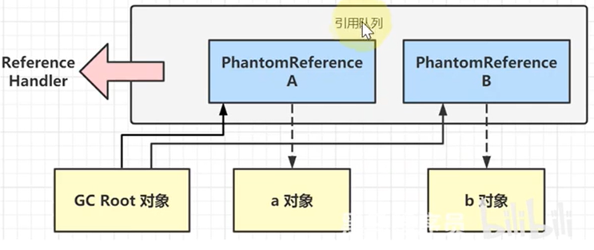

  

   