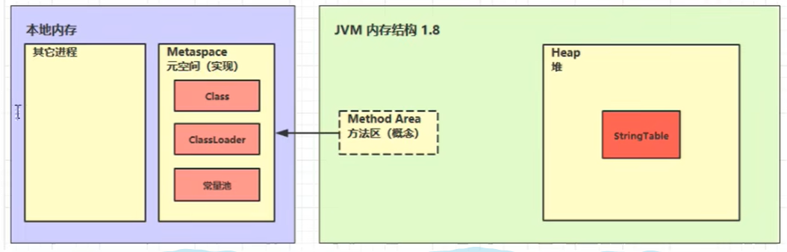

# JVM部分

### JVM的内存结构

**java代码的执行流程**


**jvm内存的各个部分**

+ 类加载子系统：将类的字节码文件读取到内存中
+ 方法区：存放代码中类的原始信息，包括类的名字，类的继承关系，类的成员变量，类的成员方法等等
+ 堆（Heap）：存放对象，即使用new关键词创建对象之后，对象的存放位置
+ java虚拟机栈：给各个线程运行提供内存，线程内的局部变量存放处
+ PC程序计数器：可以通俗理解为记录当前线程执行到第几行代码

> PC，jvm栈和本地方法栈都是线程私有的

**可能产生内存溢出**

内存溢出：

+ `StackOverflowError`：
  + 虚拟机内方法调用过多，最常见的一种情况就是递归调用
+ `OutOfMemoryError`：
  + 堆内存耗尽，对象越来越多，却又一直在使用，不能被垃圾回收
  + 方法区内存耗尽，加载的类越来越多，比如Java代码离出现了很多new新的一个类，很多框架都会在运行期间动态产生新的类，但这种情况比较少见
  + 虚拟机栈累计，线程的创建也会占用内存，如果线程数过多，并且长时间运行不销毁，也会导致内存溢出

> 只有PC既不会发生StackOverflow也不会发生OutOfMemory

**方法区，永久代，元空间**

+ 方法区时JVM规范中定义的一块内存区域，用来存储类的元数据信息、方法的字节码信息、即时编译器需要的信息等；但这仅仅是Java虚拟机的一个规范，具体实现需要看具体的虚拟机
+ 永久代是Hotspot虚拟机对JVM规范的实现（jdk1.8之前）
+ 元空间是Hotspot虚拟机对JVM规范的实现（jdk1.8及之后），使用本地内存作为这些信息的存储空间

元空间：

元空间中存储类的原始信息，通过堆内的XXX.class对象去访问元空间中的类原始信息


> 关于方法区：
>
> 在Hotspot虚拟机给出的官方定义中说明了，方法区是一个线程共享的区域，用于存储每一个类的结构，包括属性字段，一些方法的元数据以及类的构造器等，方法区在JVM启动的时候进行初始化，逻辑上是堆的一部分；在jdk1.8之前，方法区的一个实现是永久代，占用的是JVM的内存空间，而在jdk1.8之后，方法区的实现变为元空间，占用的是本地内存（除了字符串常量池，在堆中）
>
> 
>
> 关于常量池：
>
> 通常字节码文件由三部分组成：类基本信息，常量池，类方法定义；其中常量池就是运行时常量池，查看字节码文件可以使用javap命令，比如下面一个字节码文件：常量池实际上就是一张表，虚拟机指令根据这张常量表找到要执行的类名，方法名，参数类型，字面量等信息
>
> 运行时常量池是.class文件中，当该类被加载时，它的常量池信息就会放入内存中的运行时常量池，并把里面的符号地址变为真实地址
>
> ```
> #一些类的基本信息，包括类名，权限修饰符，父类信息，实现的接口等
> Classfile /D:/Java_idea/JavaVirtualMachine/out/production/chapter02/com/jvm/StringTest.class
>   Last modified 2022年4月6日; size 632 bytes
>   MD5 checksum 9b12d409af85c5bcfb37039ba1fba33d
>   Compiled from "StringTest.java"
> public class com.jvm.StringTest
>   minor version: 0
>   major version: 55
>   flags: (0x0021) ACC_PUBLIC, ACC_SUPER
>   this_class: #7                          // com/jvm/StringTest
>   super_class: #8                         // java/lang/Object
>   interfaces: 0, fields: 0, methods: 2, attributes: 1
> #一下就是常量池，保存程序运行时的一些基本信息
> Constant pool:
>    #1 = Methodref          #8.#24         // java/lang/Object."<init>":()V
>    #2 = Class              #25            // java/lang/String
>    #3 = Methodref          #2.#24         // java/lang/String."<init>":()V
>    #4 = Fieldref           #26.#27        // java/lang/System.out:Ljava/io/PrintStream;
>    #5 = String             #28            // com.jvm.StringTest
>    #6 = Methodref          #29.#30        // java/io/PrintStream.println:(Ljava/lang/String;)V
>    #7 = Class              #31            // com/jvm/StringTest
>    #8 = Class              #32            // java/lang/Object
>    #9 = Utf8               <init>
>   #10 = Utf8               ()V
> .....
> ```

### 字符串常量池

```java
public static void main(String[] args) {
    String s1 = "a";
    String s2 = "b";
    String s3 = "ab";
}
```

上述代码转换为字节码文件就是：

```
0: ldc           #2                  // String a
2: astore_1
3: ldc           #3                  // String b
5: astore_2
6: ldc           #4                  // String ab
8: astore_3
9: return
```

在类加载的过程中，常量池中的信息都会被加载到运行时常量池中，这时，"a", "b", "ab"都是常量池中的符号，还没有变为java字符串对象

ldc  #2  会把a符号变为"a"字符串对象

ldc  #3  会把b符号变为"b"字符串对象

ldc  #4  会把ab符号变为"ab"字符串对象

并且将这些字符串常量放入字符串常量池中，也就是StringTable，这个StringTable是个hashtable结构，不能扩容

**字符串拼接**

在上述代码的基础上，进行字符串拼接：

```java
String s4 = s1 + s2;
//上面这段代码在jdk1.8中转换成字节码之后
new   #5
invokespecial    #6   //StringBuilder()
invokespecial    #7   //append()
invokespecial    #7   //append()
invokespecial    #8   //toString()
//其实翻译过来就是
new StringBuilder().append("a").append("b").toString();
//也就是说当进行字符串拼接的时候，会创建一个中间对象StringBuilder进行拼接并返回一个新的String对象（toString()方法最后是new String()）
//所以s3 == s4返回false

//还有一种拼接：
String s5 = "a" + "b";  //转换为字节码之后
ldc    #4   //"ab"
//由于"ab"在字符串常量池中已经存在了，所以s5直接就是确定为"ab"
//s3 == s5返回true
```

**intern方法**

```java
String s = new String("a") + new String("b");
```

上面一行代码的运行过程是：先new String("a")，将"a"常量放入字符串常量池；再new String("b")，将"b"常量放入字符串常量池

但两个new出来的对象都在堆中，然后进行拼接，最后其实就相当于new String("ab")，但"ab"并没有放入字符串常量池中

可以调用intern方法主动将字符串放入字符串常量池，并返回串池中的对象

### 类加载过程

类加载的基本流程：加载、验证、准备、解析、初始化

其中验证、准备、解析阶段合起来称为连接阶段

**加载**

+ 通过一个类的全限定名来获取定义类的二进制字节流
+ 将这个字节流所代表的静态存储结构转换为方法区的运行时数据结构
  + 将类的字节码文件载入方法区，内部采用c++的instanceKlass描述Java类，比较重要的一个field是_java_mirror，就是通常说的xxx.class
+ 在内存中生成一个代表这个类的java.lang.Class对象，作为方法区这个类的各种数据的访问入口
  + 反射就是基于此实现的，将Java类的字节码文件加载到机器内存中，并在内存中构建出Java类的原型，指向方法去中的instanceKlass

**连接**

+ 验证阶段：这一阶段的目的是确保Class文件的字节流中包含的信息符合《Java虚拟机规范》的全部要求，进行一些安全性检查
+ 准备阶段：为static变量分配空间，并设置默认值
  + 在jdk1.7之后，静态变量存储在堆中
  + 静态变量分配空间和赋值是两个步骤，分配空间在准备阶段完成，赋值在初始化阶段完成
  + 如果是static final的基本类型或者字符串常量，比如static final String const = "aaa"，那么值在编译期就确定了，直接在准备阶段赋值
  + 如果是static final的引用类型，那么赋值在初始化阶段
+ 解析阶段：将常量池中的符号引用解析为直接引用
  + 这里的符号引用可以理解为某个类的全类名字符串，就比如"java.lang.String"
  + 直接引用指的是当前类已经被加载到堆中，并且分配了对象，直接引用就是这个对象所在堆中的地址

**初始化**

+ 初始化阶段，简单说就是调用类构造器方法，即`<clinit>()V`方法的过程，虚拟机会保证这个方法执行时的线程安全
  + main方法所在的类，总会被先初始化
  + 首次访问这个类的静态变量或静态方法时
  + 子类初始化时，会保证父类已经被初始化
  + 子类访问父类静态变量，只会触发父类的初始化

> 初始化的时机：
>
> + 遇到new、getstatic、putstatic、invokestatic这四条字节码指令时，如果类型没有进行初始化，则需要先触发其初始化阶段
>   + 使用new关键字实例化对象时
>   + 读取或设置一个类型的静态字段时（static final、已在编译期把结果放入常量池的静态字段除外）
>   + 调用一个类型的静态方法时
> + 使用java.lang.reflect包的方法对类型进行反射调用时，如果类型没有进行初始化，则需要先触发其初始化
> + 当类初始化时，如果发现其父类还没有进行初始化，则需要先触发其父类的初始化
> + 当虚拟机启动时，用户需要指定一个要执行的主类，虚拟机会先初始化这个主类

懒汉式单例（内部类方式）：

```java
class Singleton {
    private Singleton() {}
    
    private static class LazyHolder {
        private static final Singleton INSTANCE = new Singleton();
    }
    
    //当第一次调用这个方法时，才会触发内部类LazyHolder的加载连接初始化，从而保证INSTANCE是懒加载的
    public static Singleton getInstance() {
        return LazyHolder.INSTANCE;
    }
}
```


### Java内存参数

+ -Xmx：Java虚拟机的最大内存
+ -Xms：Java虚拟机的最小内存
+ -Xmn：堆内存中新生代的内存大小
+ -XX:SurvivorRatio = x：新生代内Eden区和其中一个survivor区内存大小的占比为x : 1
  + 这个有个默认值，是Eden:from:to = 8:1:1
+ -XX:NewRatio：控制整个新生代的内存比例
  + 也有个默认值Young : Old = 1 : 2

### 垃圾标记

**什么是“垃圾”**

简单的说，内存中已经不再被使用到的空间就是垃圾

**如何判断一个对象是否为“垃圾”**

引用计数法（已经不使用了）

可达性分析算法：也称为根路径搜索，这里的根就是GC roots，也就是一组活跃引用的集合

+ 基本思路就是通过一些列GC roots的对象作为起始点，从这些对象开始向下搜索，如果一个对象到GC roots没有任何引用链相连时，则说明此对象不可用，也即给定一个集合的引用作为根出发，通过引用关系遍历对象图，能被遍历到的对象就被判定为存活

可以作为GC roots的对象：

+ 虚拟机栈中引用的对象（正在使用的局部变量）
+ 方法区中的类静态属性引用的对象
+ 方法区中常量引用的对象
+ 本地方法栈中JNI引用的对象

### JVM垃圾回收算法

**标记过程**

可达性分析，首先找到GCRoots，一般能够作为GCRoots的有：

+ 正在使用的局部变量
+ 静态变量
+ ......

然后沿着这些GCRoots的引用链，找到根对象直接或者间接引用的对象，给这些对象加上标记，表示这些对象不能被回收

**标记清除算法**

在标记对象之后，直接清除掉未标记的对象即可

缺点就是会产生比较多的空间碎片，内存不连续


**标记整理算法**

在标记之后，将没有标记的对象清除，并将剩余的存活对象向内存的一端靠拢，解决内存碎片的问题，常用于老年代的垃圾回收

缺点就是效率比较低


**标记复制算法**

将内存一分为二，只使用一半，新生代中survivor就是使用的这种垃圾回收算法，效率比较高

缺点就是浪费内存，只能使用一半


### 垃圾回收和分代回收算法

**垃圾回收的目的**

GC的目的在于实现无用对象内存的自动释放，减少内存碎片，加快分配速度

**垃圾回收的要点**

+ 回收的区域是堆内存，不包括虚拟机栈，栈中，方法返回之后会自动释放方法所占用的内存
+ 使用可达性分析算法来标记存活对象
+ GC的具体实现，常用的垃圾回收器
+ GC大多采用了分代回收的思想，理论依据是大部分对象朝生夕灭，用完之后立即可以回收，另有少部分对象会长时间存活，每次很难回收，所以根据对象的这两个特性将回收区域分为新生代和老年代，不同区域的回收策略也不同
+ 根据GC的规模可以分成Minor GC（新生代垃圾回收），Mixed GC（部分老年代发生垃圾回收）、Full GC（全面回收新生代和老年代）
  + Minor GC暂停时间比较短
  + Full GC垃圾回收规模比较大，暂停时间比较长，应该尽量避免

**分代回收算法**

新生代：

+ eden区，Java对象最初都是诞生在这里
+ survivor区，当eden区内存不足，垃圾回收之后，幸存的对象会被放在survivor区内，分成from区和to区

老年代：

+ 当新生代的对象熬过了多次的垃圾回收（最多15次），就会被晋升到老年代
+ 如果创建的对象过大，新生代放不下了，也会被直接放到老年代

**三色标记法**

故名思意：以三种颜色记录对象的标记状态

+ 黑色，已标记对象
+ 灰色，标记中的对象
+ 白色，还未标记的对象


**并发标记**

CMS垃圾回收器使用垃圾收集线程和用户线程同时工作的方式，暂时标记一部分存活对象

但由于和用户线程并发执行，用户线程就会改变已有的引用关系，比如：

+ 垃圾收集线程正在标记a对象，用户线程先断开a对象与b对象之间的引用关系，新建立了已经标记完成的c对象与b对象之间的引用关系
+ 已经标记过的d对象，又新引用了刚创建的e对象


由于对象c与对象d都是已经被标记过了，垃圾回收线程并不会再去查找它们的引用关系，所以，在并发标记阶段，对象b与对象e会被误认为是垃圾

所以，CMS垃圾回收器在并发标记阶段之后还有一个重新标记的阶段，这一阶段必须STW，即暂停用户线程，对对象d，c的引用关系进行重新处理

### 常用的垃圾回收器

**Parallel GC**

由两部分组成，一个是新生代垃圾回收器Parallel Scavenge收集器，一个是老年代垃圾回收器Parallel Old收集器，`支持多线程并发收集`

+ Parallel Scavenge，当eden内存不足时，对新生代做垃圾回收，采用标记复制算法，会暂停用户线程
+ Parallel Old，当老年代内存不足时，会同时触发新生代和老年代的垃圾回收（即Full GC），对老年代采用标记整理算法，会暂停用户线程
+ 这款垃圾回收器比较注重吞吐量，整体上暂停时间比较短

> 吞吐量 = 运行用户代码时间 / (运行用户代码时间 + 运行垃圾收集时间)

**CMS**

CMS收集器是一种以获取最短回收停顿时间为目标的收集器，基于标记清除算法实现

CMS垃圾回收分为四个部分：

+ 初始标记，需要STW，仅仅标记GCRoots能够直接关联的对象，通常暂停时间比较短
+ 并发标记，不需要STW，可以与用户线程并发执行，从GCRoots遍历整个引用关系图的过程，整个过程耗时较长
+ 重新标记，需要STW，主要是修正一些误标为垃圾的对象，通常暂停时间也比较短
+ 并发清除，不需要STW，清除掉垃圾对象，整个过程耗时也比较长

CMS比较注重响应时间，即每次垃圾回收停顿的时间比较短，但有明显的几个缺点：

+ 采用标记清除算法，容易产生内存碎片
+ CMS无法处理浮动垃圾
  + 浮动垃圾：即在并发标记阶段，用户线程产生的新垃圾，CMS不能够识别出它们，只能等到下一次垃圾回收时，才能够去处理
  + 重新标记阶段是标记那些被误认为是垃圾的对象，而不是去标记那些新产生的对象，所以不能识别浮动垃圾
+ 由于在标记阶段能够和用户线程并行执行，CMS在进行垃圾回收时，并不能等到老年代被完全填满的时候，而是需要去预留一部分空间存放用户线程新产生的对象，这就有可能造成CMS的一次并发失败（Concurrent Mode Failure）
  + 即预留出来的空间不足以存放用户线程产生的新对象，就会产生并发失败
  + 并发失败之后，CMS垃圾回收器会采用最差的备用方案，即进行依次Full GC，很影响性能

> 正因为CMS的这些缺点，在jdk1.9之后就不提倡使用
>
> 在jdk1.14之后被完全废弃

**G1**

G1垃圾回收器是基于Region的内存分布，采用局部收集的设计思想：

region：把堆内存分割为许多不相关的区域，这些区域就称为region，使用这些region来表示eden，survivor和old区

这些region的大小相等，可以通过参数进行调整，取值范围为1MB - 32MB

由于划分了这些region区域，在进行垃圾回收时，G1可以面向堆内存中的任何区域进行垃圾回收，这就是G1收集器特有的Mixed GC


G1的垃圾回收阶段也可以大致划分为四个阶段：

+ 初始标记阶段：也是标记GC Root的直接关联对象，并且修改TAMS（Top at Mark Start）指针
  + TAMS指针的作用是让用户线程在并发标记阶段能够选择空闲的region区分配对象
+ 并发标记阶段：从GC Roots开始进行可达性分析，找出要回收的对象
+ 最终标记阶段：需要暂停用户线程，也是用于处理并发标记阶段遗留的标记问题
+ 混合收集阶段：对各个待回收的Region的回收价值和成本做一个排序，根据用户所期望的停顿时间来制定回收计划，率先回收那些回收价值较高的region
  + 这个阶段可能被执行多次


G1垃圾回收器相对于CMS回收器来说的优势：

+ 采用标记复制算法，产生的内存碎片比较少
+ 可以根据用户的期望设置垃圾回收器的暂停时间

但是相对于CMS来说，G1也有不足的地方：

+ G1为了垃圾回收产生的内存占用和程序运行时的额外执行负载都比CMS要高
+ 因为采用了标记复制算法，需要移动对象，以及对Region做回收价值的排序等

### 对象的引用类型

+ 强引用：普通变量的赋值即为强引用，A a = new A(); 通过GC Root的引用链，只要被强引用到的对象都不会被回收

  + 即使是报OOM了，也不会被回收

+ 软引用：是一种相对强引用弱化了一些的引用，需要通过`java.lang.ref.SoftReference`类来实现

  + SoftReference a = new SoftReference(new A())
  + 如果仅有软引用该对象时，首次垃圾回收不会回收该对象，如果内存仍然不足，再次触发垃圾回收时，才会释放对象
  + 软引用自身需要配合引用队列来释放
  + 典型的软引用是反射，通过反射获得的对象基本都是软引用

  

+ 弱引用：

  + WeakReference a = new WeakReference(new A())
  + 如果仅有弱引用引用该对象，只要发生垃圾回收，就会把对象回收
  + 弱引用自身也需要配合引用队列来释放
  + 典型的例子就是ThreadLocalMap中的Entry对象

  

+ 虚引用：

  + PhantomReference a = new PhantomReference(new A())
  + 必须配合引用队列一起使用，当虚引用的对象被回收时，会将虚引用对象入队，由ReferenceHandler线程释放其关联的外部资源（即直接物理内存被使用的资源）
  + 典型的例子是Cleaner释放DirectByteBuffer占用的直接内存

  

  

   