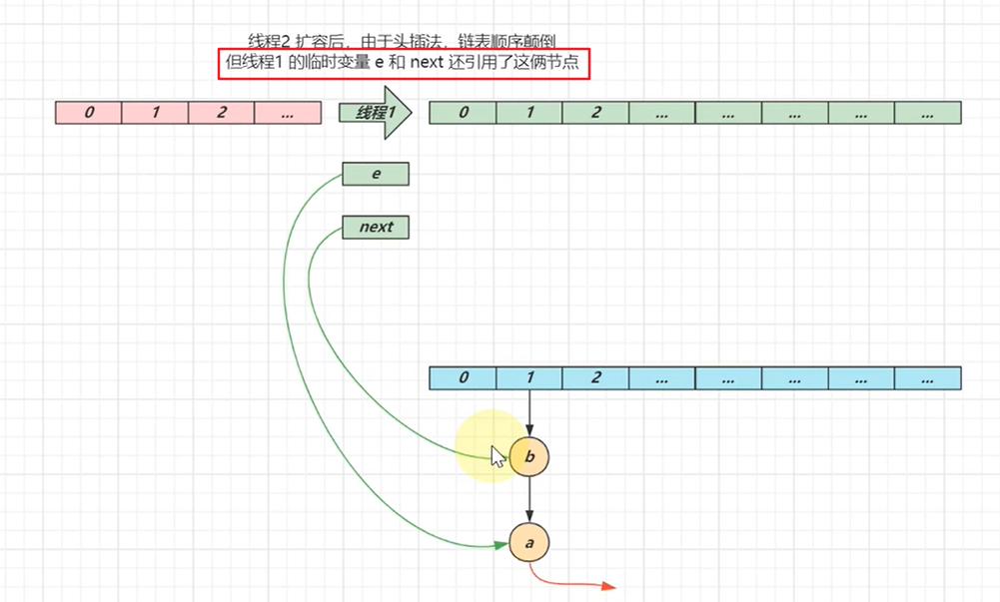
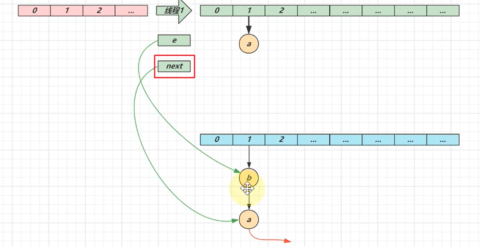
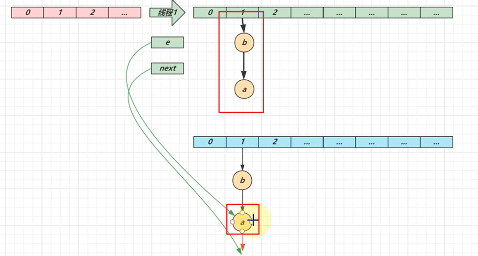
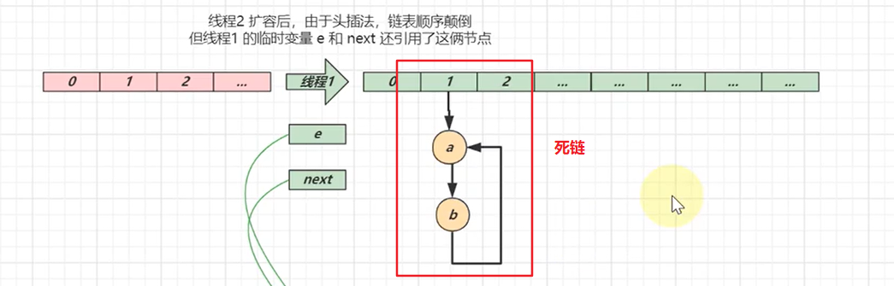
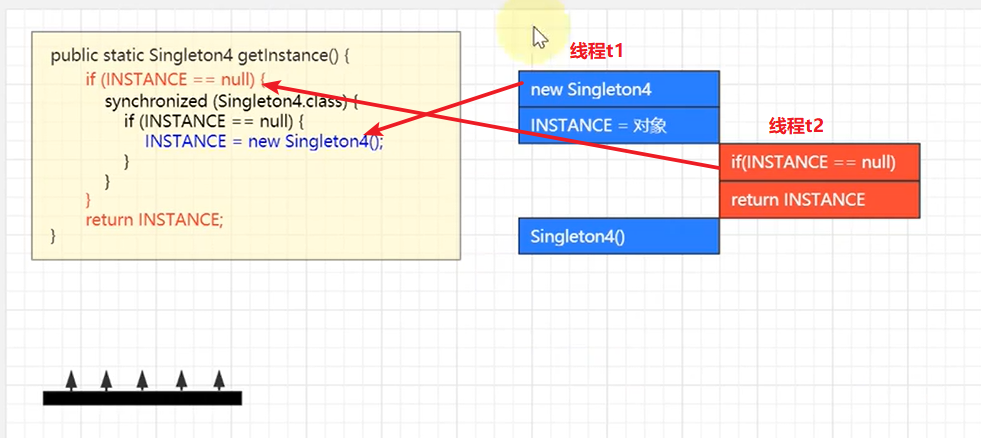

# Java基础

## 一、集合部分

### 1.1 ArrayList

**扩容机制**

当调用ArrayList的空参构造器时，会创建一个空的Object类型的数组；当**第一次**进行add操作时，才会正真创建一个容量为10的Object类型的数组

等加入的元素（使用普通的add方法进行添加）达到容量上限时，会进行一次扩容，将容量扩容为上次容量的1.5倍

+ 创建一个新数组，容量为旧数组的1.5倍
+ 将旧数组中的元素拷贝一份放到新数组中
+ 使用新数组代替旧数组，旧数组会被垃圾回收器进行回收
+ 新容量的计算使用移位的方式进行计算扩容1.5倍：
  + 先将原始容量右移一位，相当于capacity / 2
  + 再加上旧数组的容量，即`newCapacity = capacity + capacity >> 1`

```java
//扩容方法
private int newCapacity(int minCapacity) {
    // overflow-conscious code
    int oldCapacity = elementData.length;
    int newCapacity = oldCapacity + (oldCapacity >> 1);   //新容量的计算
    if (newCapacity - minCapacity <= 0) {
        if (elementData == DEFAULTCAPACITY_EMPTY_ELEMENTDATA)  //第一次扩容
            return Math.max(DEFAULT_CAPACITY, minCapacity);   
        if (minCapacity < 0) // overflow
            throw new OutOfMemoryError();
        return minCapacity;
    }
    return (newCapacity - MAX_ARRAY_SIZE <= 0)
        ? newCapacity
        : hugeCapacity(minCapacity);
}
```

当使用`addAll(Collections...)`方法时，扩容机制又有点不同

+ 看上面的源码也能够知道，如果再次扩容的容量比新计算出来的容量还要大，那么会选择较大的那个值作为新的容量

```java
private static void testAddAllGrowEmpty() {
        ArrayList<Integer> list = new ArrayList<>();
//        list.addAll(List.of(1, 2, 3));     //这个会扩容为10
//        list.addAll(List.of(1, 2, 3, 4, 5, 6, 7, 8, 9, 10, 11));    //这个会扩容为11
        System.out.println(length(list));
    }

    private static void testAddAllGrowNotEmpty() {
        ArrayList<Integer> list = new ArrayList<>();
        //预先放入10个元素，已经达到了容量上限
        for (int i = 0; i < 10; i++) {
            list.add(i);
        }
//        list.addAll(List.of(1, 2, 3));   //这个会扩容为15，因为新计算出的容量15比实际容量13大
        list.addAll(List.of(1, 2, 3, 4, 5, 6));  //这个就会扩容为16
        System.out.println(length(list));
    }
```

### 1.2 Iterator

**要点**

Fail-fast和Fail-safe机制

+ fail-fast机制： 一旦发现遍历的同时其它人来修改，则立刻抛异常

  ```java
  //通过调试的方式模拟在遍历的时候修改集合
  private static void failFast() {
          ArrayList<Student> list = new ArrayList<>();
          list.add(new Student("A"));
          list.add(new Student("B"));
          list.add(new Student("C"));
          list.add(new Student("D"));
          for (Student student : list) {
              System.out.println(student);
          }
          System.out.println(list);
      }
  
  如果在遍历的时候，对集合元素进行了修改，会即刻抛出异常：ConcurrentModificationException
  ```

+ fail-safe：发现遍历的同时其它人来修改，应当能有应对策略，例如牺牲一致性来让整个遍历运行完成

  ```java
  //通过调试的方式在遍历的同时，向集合中加入new Student("E")
  private static void failSafe() {
          CopyOnWriteArrayList<Student> list = new CopyOnWriteArrayList<>();   //是一种List的实现，保证了fail-safe机制
          list.add(new Student("A"));
          list.add(new Student("B"));
          list.add(new Student("C"));
          list.add(new Student("D"));
          for (Student student : list) {
              System.out.println(student);
          }
          System.out.println(list);
      }
  
  能够完成遍历，但是遍历出来的元素只有"A","B","C","D"并没有新加的"E"
  ```

**fail - Fast分析**

在ArrayList中有内置的成员变量，继承Iterator

总结起来就是ArrayList在遍历开始前记录了ArrayList的修改次数（等于当前元素个数），并在每一次循环的时候判断初始的修改次数是否与当前ArrayList的修改次数相同（如果在遍历时修改了ArrayList集合，那么ArrayList类中的修改次数就会改变，而迭代器类中的修改次数始终时循环开始时，ArrayList的元素个数）

```java
private class Itr implements Iterator<E> {
    int cursor;       // index of next element to return
    int lastRet = -1; // index of last element returned; -1 if no such
    
    //这个变量用来记录在循环开始时List集合被修改了多少次   modCount是ArrayList集合的成员变量
    int expectedModCount = modCount;

    // prevent creating a synthetic constructor
    Itr() {}

    public boolean hasNext() {
        return cursor != size;
    }

    @SuppressWarnings("unchecked")
    public E next() {
        //每次循环都会调用这个方法去判断expectedModCount和ArrayList集合中被修改的次数是否一致
        checkForComodification();
        int i = cursor;
        if (i >= size)
            throw new NoSuchElementException();
        Object[] elementData = ArrayList.this.elementData;
        if (i >= elementData.length)
            throw new ConcurrentModificationException();
        cursor = i + 1;
        return (E) elementData[lastRet = i];
    }

    public void remove() {
        if (lastRet < 0)
            throw new IllegalStateException();
        checkForComodification();

        try {
            ArrayList.this.remove(lastRet);
            cursor = lastRet;
            lastRet = -1;
            expectedModCount = modCount;
        } catch (IndexOutOfBoundsException ex) {
            throw new ConcurrentModificationException();
        }
    }

    ......
    //如果在遍历的过程中对ArrayList集合做了修改，会改变modCount的值，那么if条件会成立，就会抛出异常    
    final void checkForComodification() {
        if (modCount != expectedModCount)
            throw new ConcurrentModificationException();
    }    
}
```

**fail - Safe分析**

跟之前的ArrayList相似CopyOnWriteArrayList也内置了一个迭代器

如果在遍历的时候，添加了一个新的元素，新添加的元素并不在迭代器的快照数组中，CopyOnWriteArrayList会复制一个数组出来，将新添加的元素放到复制出来的数组中，但这并不影响迭代器中的快照数组，所以，遍历也不会抛出异常，并且遍历的结果不包括新添加的元素

```java
static final class COWIterator<E> implements ListIterator<E> {
    /*在遍历开始的时候，迭代器会复制一份原始集合的数组，之后迭代器的复制操作都是在这个快照数组中进行的*/
    private final Object[] snapshot;
    /** Index of element to be returned by subsequent call to next.  */
    private int cursor;

    COWIterator(Object[] es, int initialCursor) {
        cursor = initialCursor;
        snapshot = es;
    }

    public boolean hasNext() {
        return cursor < snapshot.length;
    }


    @SuppressWarnings("unchecked")
    public E next() {
        if (! hasNext())
            throw new NoSuchElementException();
        return (E) snapshot[cursor++];
    }

    ......
}
```

### 1.3 LinkedList

**特点**

+ 基于双向链表，无需连续内存
+ 随机访问慢（要沿着链表遍历）
  + 并没有实现RandomAccess接口，只能使用迭代器来遍历访问
+ **头尾**插入删除性能高
  + 但在集合中间位置插入元素，性能并不好，因为需要先一个个遍历找到中间元素，再插入，性能反而会比ArrayList差
+ 占用内存多

与ArrayList的区别，ArrayList的特点：

+ 基于数组，需要连续内存
+ 随机访问快（指根据下标访问）
  + ArrayList实现了RandomAccess接口（是个标识性的接口，没有任何方法，如果实现了这个接口，那么就可以使用类似数组下标的方式进行访问）
+ **尾部**插入、删除性能可以，**其它部分**插入、删除都会移动数据，因此性能会低
+ 可以利用 cpu 缓存，局部性原理（空间局部性）
  + 链表反而不能配合局部性原理，因为内存空间不连续


### 1.4 HashMap

**jdk1.7与jdk1.8的不同**

+ 1.7：数组 + 链表
+ 1.8：数组 + 链表 | 红黑树

**HashMap的快速查找**

二次hash计算元素在数组下标的位置，快速定位，最优的情况下只需要进行一次比较即可

但Hash码计算也存在问题：会产生Hash冲突，如果Hash冲突比较严重，所有元素都会堆积在数组的同一个位置，此时要再想寻找指定元素，就必须在链表上一个个比较了

有两种优化的思路：

+ 减少数组某一位置上的链表长度，扩容就能解决，因为扩容之后，每个元素的下标位置需要重新计算
  + 但扩容治标不治本，因为如果很多元素计算出来的hash码就相同，那么再怎么扩容，这些元素仍然在同一位置上
+ 树化，当数组容量到达某一阈值，并且数组某一位置上的链表长度也达到某一阈值，就会将链表转换为红黑树

> **为什么要用红黑树**
>
> 如果只是单纯的使用链表，当哈希冲突比较严重，那么数组某个位置上的链表长度会很长，查询的时候只能遍历查询，影响查询效率
>
> **为什么不一开始就树化**
>
> 红黑树的内存占用比较大，如果链表的结点个数比较少，查询的效率不比有着相同结点数量的红黑树差，并且链表更加节省空间
>
> **树化阈值为什么是8**
>
> 首先要明确的是，链表转换为红黑树是一种不正常的情况，在一般情况下，即使数据量很大，如果不刻意地去构造hash值，那么某个数组位置上的链表长度达到8几乎是不可能的，树化只是一种无可奈何的情况
>
> 其次，如果hash值足够随机，则hash表内元素的分布符合泊松分布，在负载因子0.75的情况下，链表长度超过8的出现概率是0.00000006，树化阈值选择8是为了让树化的几率足够小

**HashMap树化过程**

需要满足两个条件（同时满足）：

+ 数组位置上链表长度大于等于8
  + 数组位置上链表的长度是有可能大于8的，因为如果不满足下一个条件，会首先采用扩容的方式进行解决
+ 数组容量大于等于64
  + 如果数组容量没有大于64，但链表长度超过了64，这时会首先尝试采用扩容的方式解决冲突问题

**采用红黑树的作用**

* 红黑树用来避免 DoS 攻击（链表长度过长一般都是有意攻击造成的），防止链表超长时性能下降，树化应当是偶然情况，是保底策略
* hash 表的查找，更新的时间复杂度是 $O(1)$，而红黑树的查找，更新的时间复杂度是$O(log_2⁡n )$，TreeNode 占用空间也比普通 Node 的大，如非必要，尽量还是使用链表

**树退化为链表的过程**

* 情况1：在扩容时如果拆分树时，树元素个数 <= 6 则会退化链表
* 情况2：remove 树节点时（在移除前检查，也就是检查未移除当前元素时的红黑树），若 `root、root.left、root.right、root.left.left` 有一个为 null ，也会退化为链表

**HashMap中索引值的计算**

+ 首先调用对象的`hashCode()`方法计算出第一个hash值

+ 再调用HashMap中的`hash()`方法进行二次hash

  ```java
  static final int hash(Object key) {
      int h;
      return (key == null) ? 0 : (h = key.hashCode()) ^ (h >>> 16);   
  }
  ```

+ 最后将计算出来的值`& (capacity - 1)`计算出索引位置，采用按位与是为了提高计算效率

  `value & (capacity - 1)`相当于`value % capacity`但是有一个条件，就是capacity必须是2的幂次，所以hashMap数组的容量都是2的幂次

+ 进行二次hash的目的是为了让元素能够更加分散，均匀地分布在数组中

  > 容量是 2 的 n 次幂这一设计计算索引效率更好，但 hash 的分散性就不好，需要二次 hash 来作为补偿，所以二次hash是基于容量是2的n次幂这个前提的，如果容量不满足这个条件，也没有必要使用二次hash了

**为什么数组的容量都是2的n次幂**

+ 第一个原因就是前面说过的，如果是2的n次幂，当计算索引位置时，可以将取模运算转换为按位与运算，提高了计算效率
+ 第二个原因就是，当HashMap扩容时，需要重新计算桶下标，如果容量是2的n次幂，重新计算桶下标时：
  + 如果二次hash值 & oldCap（原始容量，即未扩容时的容量）== 0，那么这些元素不需要移动
  + 如果二次hash值 & oldCap != 0，那么这些元素的新的桶下标是oldPos（元素未扩容时的下标）+ oldCap，计算非常方便

**HashMap put方法的过程**

+ HashMap在jdk1.8的版本中采用懒惰加载的方式，当第一次调用put方法的时候才会创建数组
+ 计算元素的索引位置index（二次hash + 按位与）
+ 计算索引之后，首先判断index位置上是否有元素，如果没有，则直接加入数组中
+ 如果index位置上已经有元素存在：
  + 如果index位置上是链表，则按照链表的添加逻辑，逐个比较并添加
  + 如果index位置上已经树化，则按照红黑树的添加逻辑
  + 如果index位置上是链表并且达到了树化的条件，则将链表树化
+ 在**添加完成之后**，判断容量是否超过阈值，如果超过，则进行扩容

**HashMap在jdk1.7与jdk1.8的不同**

+ 当索引位置上已经有元素时，如果添加成功：
  + 1.8按照尾插法，将元素插入到链表的尾部
  + 1.7按照头插法，将元素插入到链表的头部
  + 1.7不支持树化
+ 扩容条件不同：
  + 1.7的扩容原则：当元素个数大于等于阈值，并且添加的元素没有发生hash冲突时，才扩容
  + 1.8的扩容原则：当元素个数大于等于阈值即扩容

**为什么负载因子默认是0.75**

+ 这是在空间占用与查询时间之间取得一个较好的平衡
+ 如果负载因子过大，扩容的阈值会变大，空间会节省，但是会导致某一位置上的链表过长，性能下降
+ 如果负载因子过小，扩容的阈值会变小，空间会浪费，但是链表的长度不会太长，性能比较好

**HashMap在多线程下的问题**

数据丢失：这个问题在jdk1.8与jdk1.7中都存在，主要原因是HashMap中的`putVal()`方法：

```java
//这是putVal方法的一部分，判断当前索引位置是否为空，如果是，则直接将元素放到此位置
if ((p = tab[i = (n - 1) & hash]) == null)
    tab[i] = newNode(hash, key, value, null);

接下来就是常规的多线程分析：
    如果线程t1刚刚执行完if判断，进入if中，还没有执行里面的代码，发生上下文切换
    线程t2也进入了if判断，这时由于线程t1还没有执行添加的操作，当前位置上仍然是空的，
    所以线程t2也能够进入if语句块，这样，不论线程t1还是线程t2先执行完，之后执行完的
    线程都会将之前的数据覆盖掉，造成数据缺失的问题
```

并发死链：jdk1.7版本下HashMap的问题

+ 首先要搞清楚jdk1.7版本下HashMap的扩容过程：

  （1）扩容时有两个指针：e，next，指针e指向扩容前链表头节点，指针next指向e结点的next结点

  

  （2）然后，先将e指向的结点搬到新数组上，再将next指向的结点搬到新数组上，由于采用头插法，扩容之后的元素位置就发生了颠倒

  需要注意的是，扩容时并不是将原来的元素复制一份，而是改变引用，仍然使用的是原来的对象

  ```mermaid
  graph TD;
  subgraph HashMap
  1
  2
  3
  ...
  end
  b --> 3
  a --> b
  ```

+ 在多线程的情况下：

  （1）有两个线程：t1，t2，现在都要对HashMap进行扩容，遵循上面的步骤，当线程t1将要执行扩容时（已经创建好e和next并指向a，b），发生上下文切换，轮到线程t2执行

  （2）线程t2率先完成了对HashMap的扩容，线程t1此时开始执行：

  

  （3）线程t1按照之前的步骤将元素a，b移动到扩容之后的数组中，第一次循环：先将元素a放到新数组中，e指向next结点的值，即b，next指向b.next，注意，此时b.next = a，所以，next会指向a：

  

  （4）第二次循环：将b移动到新数组中，**e指向next结点的值，即a**，next指向a.next = null：

  

  （5）此时还需要再进行一次循环，将e指向的结点以**头插法**移动到新数组中，由于扩容时，是移动元素，并不是新创建出来一个元素，所以，第三次循环结束之后，就会出现：这个主要的原因就是头插法

  

**HashMap key要求**

+ HashMap的key值可以为null，但并不意味着其他Map实现就可以为null，ConcurrentHashMap的key和value都不能为null

+ 作为HashMap的key对象，必须重写Object类中的`hashCode()和equals()`方法

+ key的值是不可变的

  ```java
  public class HashMapMutableKey {
      public static void main(String[] args) {
          HashMap<Student, Object> map = new HashMap<>();
          Student stu = new Student("张三", 18);
          map.put(stu, new Object());
  
          System.out.println(map.get(stu));
  
          stu.age = 19;   //改变了属性的值，hashCode的计算结果就与之前不同了
          System.out.println(map.get(stu));   //输出为null
      }
  
      static class Student {
          String name;
          int age;
  
          public Student(String name, int age) {
              this.name = name;
              this.age = age;
          }
  
          public String getName() {
              return name;
          }
  
          public void setName(String name) {
              this.name = name;
          }
  
          public int getAge() {
              return age;
          }
  
          public void setAge(int age) {
              this.age = age;
          }
  
          @Override
          public boolean equals(Object o) {
              if (this == o) return true;
              if (o == null || getClass() != o.getClass()) return false;
              Student student = (Student) o;
              return age == student.age && Objects.equals(name, student.name);
          }
  
          @Override
          public int hashCode() {
              return Objects.hash(name, age);
          }
      }
  }
  ```

## 二、单例模式

### 2.1 实现方式1 -- 饿汉式

饿汉式比较简单

```java
//单例模式 --- 饿汉式
public class Singleton1 {

    private Singleton1() {
        System.out.println("饿汉式单例");
    }

    //饿汉式的特点
    private static final Singleton1 instance = new Singleton1();

    public static Singleton1 getInstance() {
        return instance;
    }
}
```

**饿汉式单例的破坏**

（1）暴力反射，通过反射可以调用类的私有成员和方法，自然而然也能够调用私有的构造器

```java
private static void reflection(Class<?> clazz) throws NoSuchMethodException, InstantiationException, IllegalAccessException, InvocationTargetException {
    Constructor<?> constructor = clazz.getDeclaredConstructor();
    constructor.setAccessible(true);
    System.out.println("反射创建实例:" + constructor.newInstance());
}

//测试代码
Singleton1.otherMethod();
System.out.println(">>>>>>>>>>>>>>>>>>>>>>>>>>>>>>>>>>>>>>>>>>>>>>>>");
System.out.println(Singleton1.getInstance());
System.out.println(Singleton1.getInstance());
// 反射破坏单例
try {
	reflection(Singleton1.class);
} catch (Exception e) {
	e.printStackTrace();
}

输出：
饿汉式单例
private otherMethod()
>>>>>>>>>>>>>>>>>>>>>>>>>>>>>>>>>>>>>>>>>>>>>>>>
com.java.base.pattern.Singleton1@26ba2a48
com.java.base.pattern.Singleton1@26ba2a48
饿汉式单例
反射创建实例:com.java.base.pattern.Singleton1@5f2050f6
```

暴力反射破坏单例的方式可以预防：

```java
private Singleton1() {
    if(instance != null) {   //如果在已经创建过对象之后再通过反射调用构造方法，此时instance != null会抛出异常
        throw new RuntimeException("单例对象已经被创建！");
    }
    System.out.println("饿汉式单例");
}
```

（2）序列化，反序列化破坏单例，这个方法的前提是单例对象需要实现Serializable接口，这是因为在反序列化的时候会新创建一个对象，但并不会走构造方法

```java
private static void serializable(Object instance) throws IOException, ClassNotFoundException {
    ByteArrayOutputStream bos = new ByteArrayOutputStream();
    ObjectOutputStream oos = new ObjectOutputStream(bos);
    oos.writeObject(instance);
    ObjectInputStream ois = new ObjectInputStream(new ByteArrayInputStream(bos.toByteArray()));
    System.out.println("反序列化创建实例:" + ois.readObject());
}

输出：
饿汉式单例
private otherMethod()
>>>>>>>>>>>>>>>>>>>>>>>>>>>>>>>>>>>>>>>>>>>>>>>>
com.java.base.pattern.Singleton1@26ba2a48
com.java.base.pattern.Singleton1@26ba2a48
反序列化创建实例:com.java.base.pattern.Singleton1@c038203
```

序列化 / 反序列化破坏单例也是可以预防的，只要在单例中再创建一个方法，在反序列化的时候就不会新建对象了

```java
//方法名固定
public Object readResolve() {
    return instance;
}
```

（3）通过Unsafe类创建对象，Unsafe类是Java内置的一个类，可以直接调用里面的方法创建对象，这种目前还找不到预防的方法，但Unsafe类一般也获取不到


### 2.2 实现方式2 -- 枚举饿汉式

枚举饿汉式，顾名思义是一个枚举类，当枚举类中只含有一个元素的时候，就构成了枚举饿汉式单例

首先，枚举类是一个特殊的类，当创建枚举类的时候，Java虚拟机会把它翻译成一个真正的类：

```java
enum Sex {
    MALE, FEMALE
}

//=====>java虚拟机翻译：
final class Sex extends Enum<Sex> { //只是底层翻译的时候能这么继承，表面写代码的时候这样写会报错
    public static final Sex MALE;
    public static final Sex FEMALE;
    
    private Sex(String name, int ordinal) {
        super(name, ordinal);
    }
    
    static {
        MALE = new Sex("MALE", 0);
        FEMALE = new Sex("FEMALE", 1);
    }
    ...
}
```

可以看待，底层翻译的时候，枚举类中创建的元素都是单例的，所以，当枚举类中只含有一个元素时，就构成了一个单例对象

```java
public enum Singleton2 {
    INSTANCE;

    private Singleton2() {  //也可以不加private，枚举类默认的构造就是私有的
        System.out.println("private Singleton2()");
    }

    @Override
    public String toString() {
        return getClass().getName() + "@" + Integer.toHexString(hashCode());
    }

    public static Singleton2 getInstance() {
        return INSTANCE;
    }

    public static void otherMethod() {
        System.out.println("otherMethod()");
    }
}
```

枚举饿汉式单例的好处就是天然地防范了暴力反射和序列化和反序列化破坏单例的攻击，但仍然不能方式Unsafe类的破坏

### 2.3 实现方式3 -- 懒汉式

懒汉式也比较简单

```java
public class Singleton3 {

    private Singleton3() {
        System.out.println("懒汉式单例");
    }

    private static Singleton3 instance = null;

    public static Singleton3 getInstance() {
        if(instance == null) {
            instance = new Singleton3();
        }
        return instance;
    }

    public static void otherMethod() {
        System.out.println("private otherMethod()");
    }

}
```

懒汉式单例有一个很大的问题就是线程不安全，在多线程下单例就无法保证，不过解决的方法也很简单，就是在`getInstance()`方法上加上synchronized关键字

### 2.4 实现方式4 -- DCL懒汉式

DCL：双重校验锁

```java
// 4. 懒汉式单例 - DCL
public class Singleton4 implements Serializable {
    private Singleton4() {
        System.out.println("private Singleton4()");
    }

    private static volatile Singleton4 INSTANCE = null; // 可见性，有序性

    public static Singleton4 getInstance() {
        if (INSTANCE == null) {
            synchronized (Singleton4.class) {
                if (INSTANCE == null) {
                    INSTANCE = new Singleton4();
                }
            }
        }
        return INSTANCE;
    }

    public static void otherMethod() {
        System.out.println("otherMethod()");
    }
}
```

**为什么要加volatile**

指令重排，先给引用赋值，还没初始化成员变量，另一个线程就拿去用了，就会产生各种各样的问题



### 2.5 实现方式5 -- 内部类懒汉式

```java
public class Singleton5 implements Serializable {
    private Singleton5() {
        System.out.println("private Singleton5()");
    }

    //将对象的创建交给静态内部类去做，能够在jvm层面上保证线程安全
    private static class Holder {
        static Singleton5 INSTANCE = new Singleton5();
    }

    //当调用这个方法的时候才会触发内部类的加载，才会创建对象
    public static Singleton5 getInstance() {
        return Holder.INSTANCE;
    }

    public static void otherMethod() {
        System.out.println("otherMethod()");
    }
}
```

### 2.6 jdk中的单例模式

（1）Runtime类

程序中常用的System类有些就是调用了Runtime类中的方法，比如exit方法和gc方法，Runtime被设计为一个饿汉单例模式

```java
private static final Runtime currentRuntime = new Runtime();

public static Runtime getRuntime() {
    return currentRuntime;
}

private Runtime() {}
```
