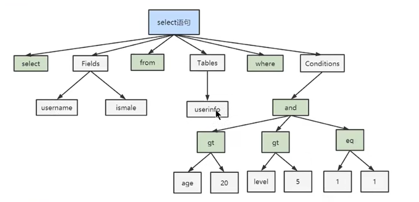
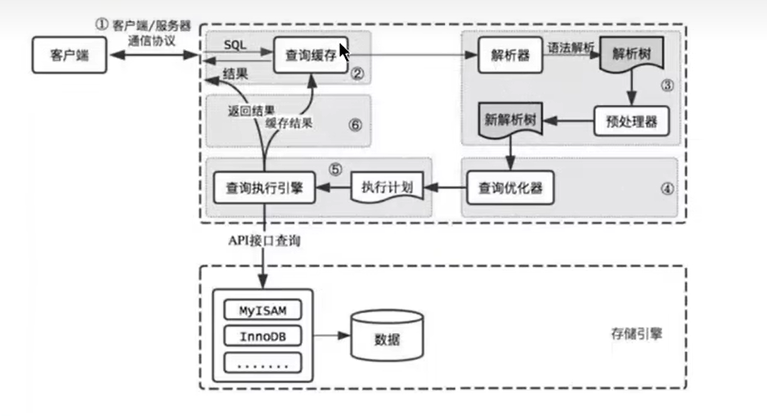
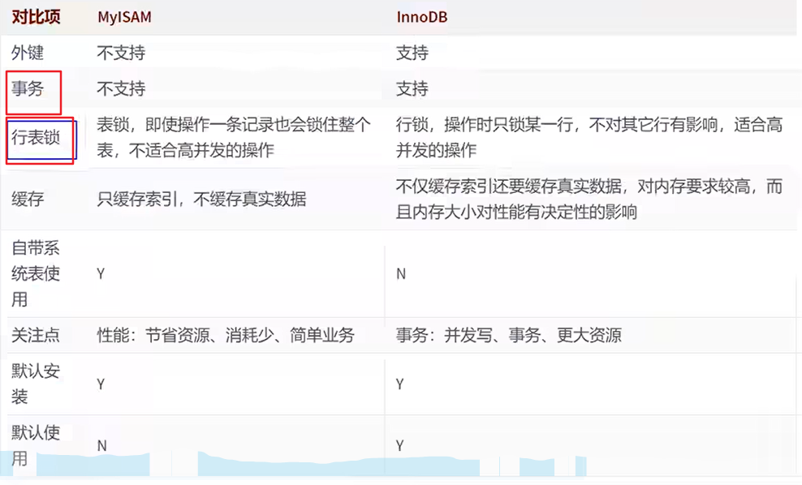
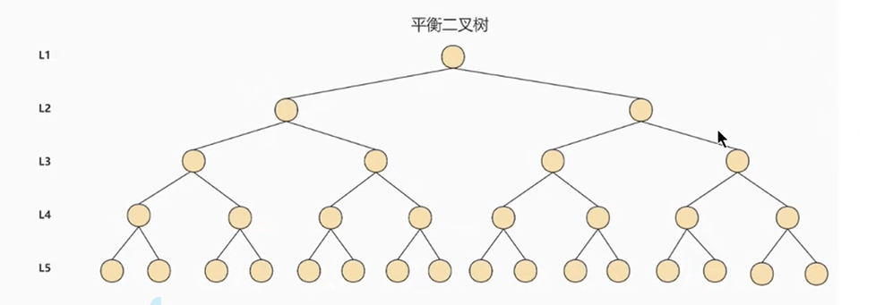
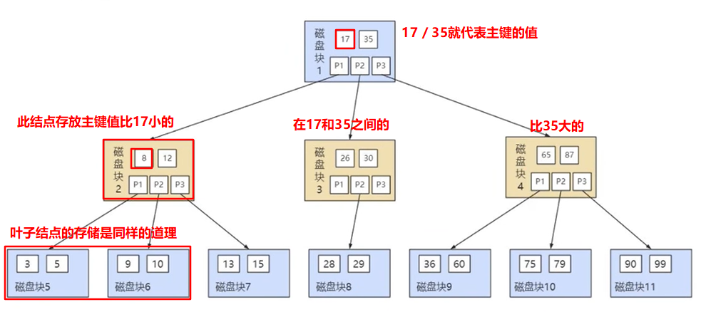
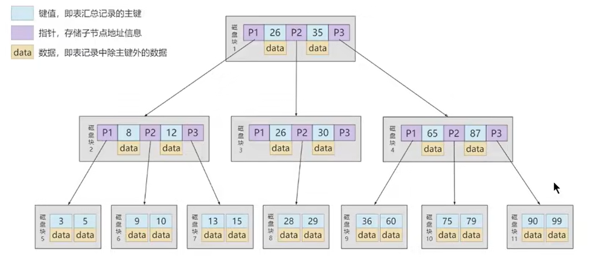

# MySQL部分

### SQL执行流程

**MySQL查询执行流程**

+ `查询缓存`，服务器如果在查询缓存中发现了这条SQL语句，就会直接将结果返回给客户端；如果没有，就进入到解析器阶段

  + 缓存的命中率很低，在MySQL8.0之后抛弃了这个功能
  + 因为两个查询请求完全相同才会命中，如果在任何字符串上的不同（比如加空格，注释，大小写）都会导致缓存不命中

+ `解析器`，在解析器当中，对SQL语句做语法，语义分析；SQL分析分为词法分析和语法分析

  + 分析器先做词法分析，MySQL首先需要识别出SQL语句中的字符串
  + 接着做语法分析，根据词法分析的结果，判断当前SQL语句是否符合MySQL定义的语法
  + 如果通过了上面的两个分析，则会生成一棵语法树

  

+ `优化器`，在优化器中确定SQL语句的执行路径，比如是全表检索还是索引检索等

  + 一条查询可以有多种执行方式，最后返回的结果都相同，优化器的作用就是找到其中最好的执行计划
  + 比如，表中有多个索引，决定使用哪个索引；或者在一个语句有多表关联的时候，决定各个表的连接顺序；还有表达式简化，子查询转换为连接等等
  + 最后会生成一个执行计划

+ `执行器`，负责SQL语句的最终执行，在执行之前会首先判断一下用户是否具备权限，如果没有则报错；如果有，就执行SQL语句并返回结果

  + 如果有相应的执行权限，就会打开表继续执行，此时会调用存储引擎的API对表进行读写

### 存储引擎

存储引擎简而言之就是表的类型，主要功能是接收上层传下来的指令，然后对表中的数据进行提取或写入操作

> 在MySQL8.0之后，默认的存储引擎为InnoDB，最大的特点就是支持数据库事务和分布式事务
>
> MySQL8.0之前是MyISAM

**InnoDB存储引擎**

+ 具备外键支持功能的`事务存储引擎`
+ 是MySQL5.5版本之后默认的事务型存储引擎，可以确保事务的完整提交和回滚
+ 对比MyISAM，InnoDB写的处理效率较差，并且会占用更多的磁盘空间以保存数据和索引

**MyISAM存储引擎**

+ 主要的非事务处理存储引擎
+ MyISAM不支持事务，行级锁和外键，崩溃后无法安全恢复
+ 优势是访问比较快，5.5版本之前的默认存储引擎

### 聚簇索引

聚簇索引是一种数据存储方式（所有的用户记录都存储在了叶子结点），也就是所谓的**索引即数据，数据即索引**

聚簇索引的特点：

+ 使用记录主键值的大小进行记录和页的排序：
  + 数据页内的记录按照主键的大小顺序排成一个`单向链表`
  + 各个存放`用户记录的页`也是根据页中用户记录的主键大小顺序拍成一个双向链表
  + 存放目录项记录的页分为不同的层次，在同一层次中的页也是根据页中目录项记录的主键大小顺序排成一个双向链表
+ 聚簇索引B+数的`叶子结点`存储的是一条完整的用户记录
  + 完整的用户记录指的是这个记录存储了所有列的值

InnoDB存储引擎会自动创建聚簇索引

优点：

+ `数据访问更快`，因为聚簇索引将索引和数据同时保存在B+树中，因此聚簇索引中获取数据比非聚簇索引更快
+ 聚簇索引对于主键的`排序查找`和`范围查找`速度非常快
+ 按照聚簇索引排序顺序，查询显示一定范围数据的时候，由于数据都是紧密相连的，数据库不用从多个数据块中提取数据，所以`节省了大量的IO操作`

缺点：

+ 向表中插入数据的速度严重依赖于插入顺序，如果乱序插入会导致页分裂，需要移动数据项，严重影响性能
+ 更新主键的代价很高，会导致被更新的行的数据项移动

限制：

+ MySQL数据库目前只有InnoDB支持聚簇索引，而MyISAM不支持聚簇索引
+ MySQL的表中只能有一个聚簇索引，一般情况下是该表的主键
+ 如果没有定义主键，InnoDB会选择一个`非空且唯一的索引`代替主键；如果没有这样的索引，InnoDB会隐式的定义一个主键

### 非聚簇索引

非聚簇索引B+树的叶子结点并不存储完整的用户记录，如果在表中以c2列的值创建了一个索引：

+ 数据页内的记录按照c2列的大小顺序拍成一个单向链表
+ 各个存放用户记录的页也是根据页中c2的大小排成一个双向链表

**回表操作**：由于非聚簇索引叶子结点只存放了c2列和主键的值，所以类似于select * from table where c2 = xxx这样的查询语句不能只查询以c2为索引创建出来的，需要首先沿着非聚簇索引查询到c2=xxx这行的主键值，再根据得到的主键值去查询聚簇索引得到这行的完整数据，这就是回表操作

一张数据表可以有多个非聚簇索引

> **聚簇索引和非聚簇索引的区别**
>
> + 聚簇索引的叶子节点存储的是数据记录，非聚簇索引的叶子节点存储的是数据位置，非聚簇索引不会影响数据表的物理存储顺序
> + 一个表只能有一个聚簇索引，因为只能有一种物理存储方式，可以有多个非聚簇索引
> + 使用聚簇索引时，数据的查询效率比较高，但如果对数据进行插入、删除和更新等操作，效率比非聚簇索引低

### 其他索引结构

**Hash索引**

hash本身是一个散列函数，可以大幅度提高数据检索效率

hash算法是通过某种确定性算法将输入转换为输出，`相同的输入永远会得到相同的输出`

采用hash进行数据查询时的效率非常高，基本上一次检索就可以找到数据，复杂度为O(1)

hash索引的缺陷：

+ Hash索引只能满足 =、<>（不等于）和IN这样的等值查询，如果进行范围查询，哈希型的索引，时间复杂度救护退化为O(n)
+ Hash数据存储没有顺序，如果进行排序查询（order by）哈希还需要对数据进行重新排序
+ 如果索引列的重复值比较多，hash冲突的情况会变多，这时查找关键字就会非常耗时

目前仅Memory存储引擎支持hash索引，MyISAM和InnoDB都不支持hash索引

> InnoDB支持一个`自适应Hash索引`，比如如果某条数据经常被使用，当满足一定条件的时候，就会将这个数据页的地址存放到hash表中，这样，下次查询时会直接找到这个页的地址

### 平衡二叉树索引

平衡二叉树是一棵空树，或者它的左右子树的高度差的绝对值不超过1，并且左右两个子树都是平衡二叉树

平衡二叉树每访问一次结点都需要进行一次磁盘IO，对于上面的树来说，就需要进行5次IO操作，随着记录的增多，树的深度慢慢增加，IO次数增多也会影响整体查询效率，所以可以考虑将二叉树改成M叉树，降低树的高度

### B树索引

B树全称多路平衡查找树，它的高度远小于平衡二叉树的高度

B树的每一个结点最多可以包括M个子节点，M就称为B树的阶，每个磁盘块中包括关键字和子节点指针

B树在插入和删除结点的时候如果导致树不平衡，就通过自动调整结点的位置来保持树的自平衡

关键字集合分布在整棵树中，即叶子结点和非叶子节点都存放数据，搜索有可能在非叶子结点结束

搜索的性能相当于在一个完整表数据中做一次二分查找

### 查询优化

