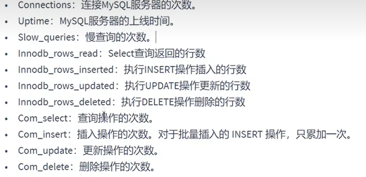

# MySQL部分

### SQL执行流程

**MySQL查询执行流程**

+ `查询缓存`，服务器如果在查询缓存中发现了这条SQL语句，就会直接将结果返回给客户端；如果没有，就进入到解析器阶段

  + 缓存的命中率很低，在MySQL8.0之后抛弃了这个功能
  + 因为两个查询请求完全相同才会命中，如果在任何字符串上的不同（比如加空格，注释，大小写）都会导致缓存不命中

+ `解析器`，在解析器当中，对SQL语句做语法，语义分析；SQL分析分为词法分析和语法分析

  + 分析器先做词法分析，MySQL首先需要识别出SQL语句中的字符串
  + 接着做语法分析，根据词法分析的结果，判断当前SQL语句是否符合MySQL定义的语法
  + 如果通过了上面的两个分析，则会生成一棵语法树

  

+ `优化器`，在优化器中确定SQL语句的执行路径，比如是全表检索还是索引检索等

  + 一条查询可以有多种执行方式，最后返回的结果都相同，优化器的作用就是找到其中最好的执行计划
  + 比如，表中有多个索引，决定使用哪个索引；或者在一个语句有多表关联的时候，决定各个表的连接顺序；还有表达式简化，子查询转换为连接等等
  + 最后会生成一个执行计划

+ `执行器`，负责SQL语句的最终执行，在执行之前会首先判断一下用户是否具备权限，如果没有则报错；如果有，就执行SQL语句并返回结果

  + 如果有相应的执行权限，就会打开表继续执行，此时会调用存储引擎的API对表进行读写


### 存储引擎

存储引擎简而言之就是表的类型，主要功能是接收上层传下来的指令，然后对表中的数据进行提取或写入操作

> 在MySQL8.0之后，默认的存储引擎为InnoDB，最大的特点就是支持数据库事务和分布式事务
>
> MySQL8.0之前是MyISAM

**InnoDB存储引擎**

+ 具备外键支持功能的`事务存储引擎`
+ 是MySQL5.5版本之后默认的事务型存储引擎，可以确保事务的完整提交和回滚
+ 对比MyISAM，InnoDB写的处理效率较差，并且会占用更多的磁盘空间以保存数据和索引

**MyISAM存储引擎**

+ 主要的非事务处理存储引擎
+ MyISAM不支持事务，行级锁和外键，崩溃后无法安全恢复
+ 优势是访问比较快，5.5版本之前的默认存储引擎


### 聚簇索引

聚簇索引是一种数据存储方式（所有的用户记录都存储在了叶子结点），也就是所谓的**索引即数据，数据即索引**

聚簇索引的特点：

+ 使用记录主键值的大小进行记录和页的排序：
  + 数据页内的记录按照主键的大小顺序排成一个`单向链表`
  + 各个存放`用户记录的页`也是根据页中用户记录的主键大小顺序拍成一个双向链表
  + 存放目录项记录的页分为不同的层次，在同一层次中的页也是根据页中目录项记录的主键大小顺序排成一个双向链表
+ 聚簇索引B+数的`叶子结点`存储的是一条完整的用户记录
  + 完整的用户记录指的是这个记录存储了所有列的值

InnoDB存储引擎会自动创建聚簇索引

优点：

+ `数据访问更快`，因为聚簇索引将索引和数据同时保存在B+树中，因此聚簇索引中获取数据比非聚簇索引更快
+ 聚簇索引对于主键的`排序查找`和`范围查找`速度非常快
+ 按照聚簇索引排序顺序，查询显示一定范围数据的时候，由于数据都是紧密相连的，数据库不用从多个数据块中提取数据，所以`节省了大量的IO操作`

缺点：

+ 向表中插入数据的速度严重依赖于插入顺序，如果乱序插入会导致页分裂，需要移动数据项，严重影响性能
+ 更新主键的代价很高，会导致被更新的行的数据项移动

限制：

+ MySQL数据库目前只有InnoDB支持聚簇索引，而MyISAM不支持聚簇索引
+ MySQL的表中只能有一个聚簇索引，一般情况下是该表的主键
+ 如果没有定义主键，InnoDB会选择一个`非空且唯一的索引`代替主键；如果没有这样的索引，InnoDB会隐式的定义一个主键

### 非聚簇索引

非聚簇索引B+树的叶子结点并不存储完整的用户记录，如果在表中以c2列的值创建了一个索引：

+ 数据页内的记录按照c2列的大小顺序拍成一个单向链表
+ 各个存放用户记录的页也是根据页中c2的大小排成一个双向链表

**回表操作**：由于非聚簇索引叶子结点只存放了c2列和主键的值，所以类似于select * from table where c2 = xxx这样的查询语句不能只查询以c2为索引创建出来的，需要首先沿着非聚簇索引查询到c2=xxx这行的主键值，再根据得到的主键值去查询聚簇索引得到这行的完整数据，这就是回表操作

一张数据表可以有多个非聚簇索引

> **聚簇索引和非聚簇索引的区别**
>
> + 聚簇索引的叶子节点存储的是数据记录，非聚簇索引的叶子节点存储的是数据位置，非聚簇索引不会影响数据表的物理存储顺序
> + 一个表只能有一个聚簇索引，因为只能有一种物理存储方式，可以有多个非聚簇索引
> + 使用聚簇索引时，数据的查询效率比较高，但如果对数据进行插入、删除和更新等操作，效率比非聚簇索引低

### 其他索引结构

**Hash索引**

hash本身是一个散列函数，可以大幅度提高数据检索效率

hash算法是通过某种确定性算法将输入转换为输出，`相同的输入永远会得到相同的输出`

采用hash进行数据查询时的效率非常高，基本上一次检索就可以找到数据，复杂度为O(1)

hash索引的缺陷：

+ Hash索引只能满足 =、<>（不等于）和IN这样的等值查询，如果进行范围查询，哈希型的索引，时间复杂度救护退化为O(n)
+ Hash数据存储没有顺序，如果进行排序查询（order by）哈希还需要对数据进行重新排序
+ 如果索引列的重复值比较多，hash冲突的情况会变多，这时查找关键字就会非常耗时

目前仅Memory存储引擎支持hash索引，MyISAM和InnoDB都不支持hash索引

> InnoDB支持一个`自适应Hash索引`，比如如果某条数据经常被使用，当满足一定条件的时候，就会将这个数据页的地址存放到hash表中，这样，下次查询时会直接找到这个页的地址

### 平衡二叉树索引

平衡二叉树是一棵空树，或者它的左右子树的高度差的绝对值不超过1，并且左右两个子树都是平衡二叉树


平衡二叉树每访问一次结点都需要进行一次磁盘IO，对于上面的树来说，就需要进行5次IO操作，随着记录的增多，树的深度慢慢增加，IO次数增多也会影响整体查询效率，所以可以考虑将二叉树改成M叉树，降低树的高度

### B树索引

B树全称多路平衡查找树，它的高度远小于平衡二叉树的高度


B树的每一个结点最多可以包括M个子节点，M就称为B树的阶，每个磁盘块中包括关键字和子节点指针

B树在插入和删除结点的时候如果导致树不平衡，就通过自动调整结点的位置来保持树的自平衡

关键字集合分布在整棵树中，即叶子结点和非叶子节点都存放数据，搜索有可能在非叶子结点结束

搜索的性能相当于在一个完整表数据中做一次二分查找


### 索引设计原则

**1. 字段的数值有唯一性的限制**

索引本身可以起到约束作用，比如唯一索引、主键索引都可以起到唯一性约束，因此在数据表中，如果某个字段是唯一的，就可以创建唯一性索引，这样可以快速地通过该索引来确定某条记录

> 《阿里巴巴Java开发手册》中规定了：业务上具有唯一性索引的字段，即使是组合字段，也必须创建唯一索引

**2. 频繁作为Where查询条件的字段**

某个字段在SELECT语句的WHERE条件中经常被使用到，那么就需要给这个字段创建索引了，尤其是在数据量大的情况下，创建`普通索引`就可以大幅度提升数据查询效率

**3. 经常Group By和Order By的列**

索引就是让数据按照某种顺序进行存储检索，因此当我们使用Group By对数据进行分组查询，或者使用Order by对数据进行排序时，就需要对分组或者排序的字段进行索引，如果排序的列有多个，那么可以在这些列上建立索引

**4. DISTINCT字段需要创建索引**

如果要去去重，使用索引之后，值相同的数据经过B+树排序之后都在一起，去重效率自然就提高了

**5. 多表Join连接操作时，创建索引的注意事项**

首先，连接的表最好不要超过3张，因为每增加一张表就相当于增加了一次嵌套循环，数量级增长会非常快，严重影响查询效率

其次，对where条件创建索引，因为where才是对数据条件的过滤，如果在数量非常大的情况下，没有where条件过滤效率比较低

最后，对于连接的字段创建索引，并且该字段在多张表的类型必须一致，类型的转换会导致索引失效

**6. 使用列的类型小的创建索引**

类型大小指的是该类型表示的数据范围的大小，也就是占存储空间的大小

原因：

+ 数据类型越小，在查询时进行的比较操作就越快
+ 数据类型越小，索引占用的存储空间就越少，在一个数据页中就能放下更多记录，从而减少磁盘IO带来的性能损耗

**7. 使用字符串前缀创建索引**

如果字符串很长，那存储一个字符串就需要占用很大的存储空间，会引起几个问题：

+ B+树索引中的记录需要把该列的完整字符串存储起来，费时也浪费空间
+ 如果B+树中索引列存储的字符串很长，在做字符串比较时，只能一个一个比，性能也不好

所以，可以截取字段的前面一部分内容建立索引，这就叫字符串前缀索引

具体取前多少个字符，可以计算一下区分度：`count(distinct left(字符串字段, 截取长度)) / count(*)`比较各个前缀长度的区分度，取最接近1的那个

> 《阿里巴巴Java开发手册》中规定，在varchar字段上建立索引时，必须指定索引长度，没必要对全字段建立索引，根据实际文本区分度决定索引长度

**8. 区分度高的列适合创建索引**

区分度可以根据之前的公式计算，如果区分度高，在筛选的时候比较容易定位到数据

**9. 使用最频繁的列放到联合索引的左侧**

最左前缀原则

**10. 在多个字段都要创建索引的情况下，联合索引优于单值索引**


> **不适合创建索引的情况**
>
> + 在where、order by、group by中基本使用不到的字段不适合创建索引
> + 数据量小的表不适合创建索引（小于1000条）
> + 有大量重复的列上不适合创建索引
> + 经常更新的列不适合创建索引
> + 没有规律的列不适合创建索引
> + 删除不再使用或者很少使用的索引
> + 不要定义冗余的索引

### 查询优化

数据库调优的目标：**响应时间更快，吞吐量更大**

一些常用的系统性能参数：



**慢查询日志**

MySQL的慢查询日志，用来记录在MySQL中`响应时间超过阈值`的语句，具体指运行时间超过`long_query_time`值的SQL，则会被记录到慢查询日志中，`long_query_time`这个值默认是10，意思是运行10s以上的语句就认为是慢查询

慢查询日志的主要作用就是帮助我们发现那些执行时间特别长的SQL查询，并且有针对性地进行优化，从而提高系统的整体效率；MySQL默认是关闭慢查询日志的

```mysql
mysql> set global slow_query_log = on;   #开启慢查询日志功能
mysql> set global long_query_time = 1;   #修改慢查询阈值
```

除了`long_query_time`这个变量，MySQL中控制慢查询的还有一个系统变量: `min_examined_row_limit`，这个变量的意思是，查询扫描过的最少记录数，这个变量和查询执行时间，共同组成了判断一个查询是否是慢查询的条件

**慢查询分析工具**

`mysqldumpslow`

mysqldumpslow 命令的具体参数：

+ -a: 不将数字抽象成N，字符串抽象成S 
+ -s: 是表示按照何种方式排序： 
  + c: 访问次数 
  + l: 锁定时间 
  + r: 返回记录 
  + t: 查询时间 
  + al:平均锁定时间 
  + ar:平均返回记录数 
  + at:平均查询时间 （默认方式） 
  + ac:平均查询次数 
+ -t: 即为返回前面多少条的数据；
+ -g: 后边搭配一个正则匹配模式，大小写不敏感的

**查看SQL执行成本**

`show profile`命令

常用参数：① ALL：显示所有的开销信息。 ② BLOCK IO：显示块IO开销。 ③ CONTEXT SWITCHES：上下文切换开 销。 ④ CPU：显示CPU开销信息。 ⑤ IPC：显示发送和接收开销信息。 ⑥ MEMORY：显示内存开销信 息。 ⑦ PAGE FAULTS：显示页面错误开销信息。 ⑧ SOURCE：显示和Source_function，Source_file， Source_line相关的开销信息。 ⑨ SWAPS：显示交换次数开销信息。

**EXPLAIN查看执行计划**

```mysql
explain select * from table where xxx = xxx; #后面可以跟update, delete, insert等语句，不会真的执行，只是查看查询计划
或者
describe select * from table where xxx = xxx;  
```

explain执行之后结果字段的含义：

| 列名            | 描述                                                    |
| --------------- | ------------------------------------------------------- |
| `id`            | 在一个大的查询语句中每个SELECT关键字都对应一个 唯一的id |
| `select_type`   | SELECT关键字对应的那个查询的类型                        |
| `table`         | 表名                                                    |
| `partitions`    | 匹配的分区信息                                          |
| `type`          | 针对单表的访问方法                                      |
| `possible_keys` | 可能用到的索引                                          |
| `key`           | 实际上使用的索引                                        |
| `key_len`       | 实际使用到的索引长度                                    |
| `ref`           | 当使用索引列等值查询时，与索引列进行等值匹配的对象信息  |
| `rows`          | 预估的需要读取的记录条数                                |
| `filtered`      | 某个表经过搜索条件过滤后剩余记录条数的百分比            |
| `Extra`         | 一些额外的信息                                          |

具体说明：

（1）`table`：查询的每一条记录都对应了一张单表，如果是连接查询，explain执行之后会有多条记录，一条记录对应一张表，比如：

```mysql
explain select * from s1 inner join s2;
```

放在前面的记录称为驱动表，后面的记录称为被驱动表


这个表还包括临时表，由MySQL自动创建，用户感受不到

（2）`id`：在一个大查询中，每个select关键字都对应一个id

```mysql
explain select * from s1 inner join s2;   #虽然有两条记录，但id都为1
explain select * from s1 where col1 in (select * from s2);  #子查询就会有两条，因为有两个select关键字
```

查询优化器可能会对子查询进行重写，改写为连接查询，所以有时候子查询进行explain操作时，结果只有一个id值

+ id如果相同，可以认为是一组，从上往下顺序执行 
+ 在所有组中，id值越大，优先级越高，越先执行 
+ **关注点：id号每个号码，表示一趟独立的查询, 一个sql的查询趟数越少越好**

（3）`select_type`：一条大的查询语句里边可以包含若干个select关键字，每个select关键字代表着一个小的查询语句，而每个查询关键字的from子句中都可以包括若干张表（这些表用来做连接查询），每一张表都对应着执行计划输出中的一条记录，对于同一个select关键字中的表来说，它们的id值是相同的

MySQL为每一个select关键字代表的小查询都定义了一个称之为`select_type`的属性，意思是这个小查询在整个大查询中国扮演了什么样的角色

**（4）**`type`:执行计划的一条记录就代表着MySQL对某个表的执行查询时的访问方法，又称“访问类型”，其中的`type`列就表明了这个访问方法是什么，是较为重要的一个指标

完整的访问方法有：`system ， const ， eq_ref ， ref ， fulltext ， ref_or_null ， index_merge ， unique_subquery ， index_subquery ， range ， index ， ALL `

其中如果`type`是前面几个类型的，那么SQL执行的效率就比较高，越靠后，SQL执行效率就比较低

+ `system`：当表中只有一条记录，并且该表使用的存储引擎的统计数据是精确的，比如MyISAM，Memory，那么对该表的访问方法就是system

  举个例子：在MyISAM中，会使用一个变量直接记录表中的数据有多少条，这个system就代表着直接将变量拿来输出，这个效率是最高的

+ `const`：当使用主键或者唯一二级索引列与常数进行等值匹配时，对单表的访问就是`const`

  比如，id是主键`select * from table where id = 1`因为id是唯一的，在找到记录时就可以直接返回，不必要再去查找是否有其余相同的记录

+ `eq_ref`：在连接查询中，如果被驱动表是通过主键或者唯一索引等值匹配的方式进行访问的，则对被驱动表的访问方法就是`eq_ref`

+ `ref`：当通过普通的二级索引列与常量进行等值匹配时来查询某个表，那么对该表的访问方法就可能是`ref`

+ `ref_or_null`：就是在`ref`的基础上，匹配的列有可能是null值

> 结果值从最好到最坏依次是： `system > const > eq_ref > ref > fulltext > ref_or_null > index_merge > unique_subquery > index_subquery > range > index > ALL` 其中比较重要的几个提取出来。SQL 性能优化的目标：至少要达到 range 级别，要求是 ref 级别，最好是 consts级别。（阿里巴巴 开发手册要求）

（5）` possible_keys`和`key`：` possible_keys`表示在某个查询语句中，对某个表执行单表查询时可能用到的索引有哪些，一般如果查询涉及到的字段上存在索引，则该索引将被列出，但不一定会用；` key`就表示实际用到的索引有哪些，如果为null，就没有使用索引
