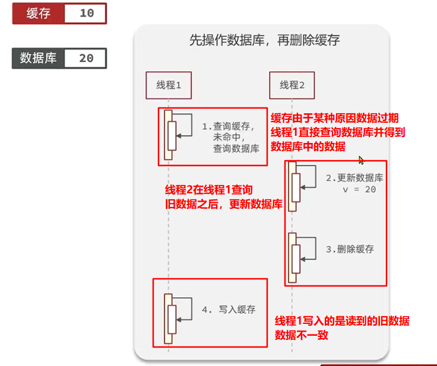

# Redis部分

## 一、Redis传统五大数据类型

### String

最常用的命令：

```
set k1 v1
get k1
```

同时设置 / 获取多个键值

```
mset k1 v1 k2 v2 ...
mget k1 k2 ...
```

数值的递增

```
set k1 100
incr k1  #+1
decr k1  #-1
increby k1 10  # +10
decrby k1 10  #-10
```

获取长度

```
strlen k1
```

应用场景：

+ 点赞，网站访问次数等可以使用`incr`命令，点击一次即+1


### List

双向链表，添加元素：

```
lpush key v1 v2 v3 ... #从链表的左边添加元素
rpush key v1 v2 v3 ... #从链表的右边添加元素
```


list的一个特点就是一对多，应用场景：

现在几乎每个平台都会有订阅功能或者收藏功能，比如b站的关注up主

```
#表示xxxx号用户关注了3个up主
lpush like_up_loader:userId:xxxx upId1 upId2 upId2
#查看up主的消息
lrange like_up_loader:userId:xxxx 0 -1
```

### Hash

redis中的hash数据结构对应Java中的`Map<String, Map<String, Object>>`

设置字段

```
hset key field value  #一次设置一个
hmset key filed1 value1 field2 value2 ... #一次性设置多个
```

获取字段值

```
hget key field
hmget key field1 field2 ...
hgetall key  #一次性获取key的所有字段
```

应用场景：购物车（简单版）

```
#记录商品，表示xxxx用户将一个商品id为prodId的商品加入了购物车
hset shopping-cart-userId:xxxx prodId 1

#hincrby将指定的数值字段的值增加指定数目
#在这里表示用户xxxx又添加了一个prodId商品
hincrby shopping-cart-userId:xxxx prodId 1
```


```
#全选
hgetall shopping-cart-userId:xxxx

#总计
hlen shopping-cart-userId:xxxx
```


### **Set**

Redis中的Set相当于Java中的HashSet，无序，无重复

```
#如果有重复的值会被自动除去
sadd key v1 v2 v3 ...
#删除元素
srem key v1 v2 ...
#获取集合中所有元素
smembers key
#判断元素是否在集合中
sismember key v1
#获取集合中的所有元素
scard key
#从集合中【随机】弹出一个元素，【不删除】
srandmember key [count]   #如果不加count就默认随机弹出一个，如果加了count就是随机弹出count个
#从集合中随机删除一个元素
spop key [count]
```

示例：


**set的集合运算**

```
#集合差运算 
sdiff set1 set2 [...]
#集合交运算
sinter set1 set2 [...]
#集合并运算
#sunion set1 set2 [...]
```

示例：


**应用场景**

（1）抽奖程序

+ 直观的操作：`spop key` 和 `srandmember key`都是随机弹出一个或者多个，这就可以用来做抽奖程序，因为是随机的
+ 一般抽奖都会让用户决定是否参与，如果用户点击【立即参与】按钮，则后台调用`sadd choujiang:idxxxx userId`将用户加入抽奖名单
+ 一般页面也会显示有多少人参与抽奖，`scard key`统计总数

（2）点赞程序

+ 之前说过点赞统计可以用string去做，set也能做，并且能比string做的更好
+ 当在社交软件上发布文章或者其他的东西，其他用户点赞，`sadd userId:xxx:article:xxx otherUser1 otherUser2 ...`
+ 如果有用户发现误点了，取消点赞，`srem userId:xxx:article:xxx oneUser`
+ 展示所有点赞的用户头像，`smembers userId:xxx:article:xxx`然后去查数据库或者直接查缓存
+  判断某个用户是否给我点赞过，`sismember userId:xxx:article:xxx oneUser`

（3）共同兴趣

+ 比如微博共同关注的人，`sadd user1 interest1 interest2 ...` `sadd user2 interest1 interest2 ...`
+ 相同的关注，`sinter user1 user2`，可以做大数据的喜好推荐
+ 有谁跟我一起关注了某个人，`sismember user1 oneUser  sismember user2 oneUser`如果都为true，则user2也关注了onUser这个人

（4）可能认识的人

+ 比如我的好友有1 2 3 4 5 ==> `sadd user1 1 2 3 4 5`
+ 我的某一名好友有 3 4 5 6 7 ==> `sadd user2 3 4 5 6 7`
+ 我可能认识的人 ==> `sdiff user2 user1` 就是我的好友的好友，但不在我的好友列表里的人

### Zset（sorted set）

有序的集合，向集合中加入一个元素和该元素的分数，按照分数大小对元素进行排序

```
#向有序集合中添加元素，携带分数信息
zadd key score1 v1 score2 v2 ...
#获取集合中的指定下标的元素，可以选择是否携带分数信息
zrange key start stop [withscores]
#获取集合中某个元素的分数信息
zscore key member
#删除指定元素
zrem key v1 v2 ... 
#获取指定分数范围内的元素
zrangebyscore key min max [withscores]
#获取指定集合中元素的数量
zcard key
#获取指定分数范围内元素的数量
zcount key min max
#获取元素的排名，从小到大排列，（下标从0开始）
zrank key member
#获取元素的排名，从大到小排列
zrevrank key member
```

示例：


应用场景：

（1）根据商品的销售量对商品进行排序显示

+ `zadd goods:sell:sort volume1 prodId1 volume2 prodId2 ...` 将商品的销售量作为分数，商品id作为元素加入zset中
+ 如果客户又买了number件商品prodId，`zincrby goods:sell:sort number prodId`
+ 获取销售量的前10名，`zrange goods:sell:sort 0 9 [withscroes]`，一般都要带上withscores参数

（2）热搜排名

+ 一条新闻加入zset，`zadd news:hot:sort number1 newsId1`，以点击量作为分数
+ 用户查看新闻（点赞，评论等），`zincrby news:hot:sort newsId`
+ 热搜前几名，`zrange news:hot:sort 0 rank withscores`

## 二、分布式锁

### 分布式锁的概念

+ 分布式微服务架构下，将各个服务拆分之后，为避免各个服务之间的冲突和数据故障而加上的一种锁
+ 与JVM层面上的锁（synchronized、cas，lock等）不同

**分布式锁的实现**

（1）MySQL

（2）zookeeper

（3）redis，现在的主流


**本地锁在分布式情况下的问题**

因为每个服务被部署到了多台服务器下，本地锁只能锁住转发到当前服务器的请求，但并不能锁住转发到其他服务器的请求，所以还是会有多个线程去访问数据库

### 分布式锁的引入

现在有多个服务要去查询数据库，可以让这些服务去竞争一把锁，这把锁需要是全局唯一的，这个全局唯一是指在微服务情况下全局唯一的

当某个服务竞争到了这把锁，即可执行后面的业务逻辑，否则就必须等待

这个锁可以是全局的MySQL数据库，也可以是redis缓存，也可以去每一个服务都能访问的地方

这里讨论使用redis作为锁的情况


**分布式锁的第一阶段**

使用redis作为分布式锁，可以这样做，每一个服务先去访问redis，向redis中set一个key，比如说lock

只有第一个set成功的服务可以去访问数据库，其他服务都需要等待

分布式锁的基本思想就是基于这个的，使用redis的set lock value nx（nx表示如果不存在这个key，则set，是一个原子操作，如果多个客户端执行，只会执行成功一个，也可以直接使用setnx命令）命令去占锁，如果set成功，则表示获得了这把锁，把这些对应到代码上就是

```java
Boolean lock = redisTemplate.opsForValue().setIfAbsent("lock", "value");  //value可以任意

if(lock) {
    //表示加锁成功
    执行查询数据库的逻辑
    //解锁逻辑，可以直接把redis中lock键删除
    redisTemplate.delete("lock");    
} else {
    //加锁失败，重新尝试加锁，自旋的方式，不断尝试加锁
    
}
```

分布式锁阶段一存在的问题：死锁问题


**分布式锁阶段二**

为解决阶段一的死锁问题，可以在获取到锁之后再设置一个过期时间，那么这样即使在业务逻辑执行期间出现了问题，也不会不释放锁

映射到代码上就是

```java
Boolean lock = redisTemplate.opsForValue().setIfAbsent("lock", "value");  //value可以任意

if(lock) {
    //表示加锁成功
    //设置锁的过期时间
    redisTemplate.expire("lock", 30, TimeUnit.SECONDS);
    执行查询数据库的逻辑
    //解锁逻辑，可以直接把redis中lock键删除
    redisTemplate.delete("lock");    
} else {
    //加锁失败，重新尝试加锁，自旋的方式，不断尝试加锁
    
}
```


但这样还是不能解决问题，因为如果在设置锁和设置过期时间的操作是分开来的，如果在设置锁的过期时间之前，服务器发生了宕机，那锁的过期时间还是没有设置上，那还是会造成死锁的问题

**分布式锁阶段三**

为了解决上面的问题，可以使用`setnx expireTime lock value`这样的设置值和过期时间一体的命令

映射到业务代码上就是：

```java
//Boolean redisTemplate.opsForValue().setIfAbsent("lock", "value");  //value可以任意
Boolean lock = redisTemplate.opsForValue().setIfAbsent("lock", "value", 30, TimeUnit.SECONDS);
if(lock) {
    //表示加锁成功
    //设置锁的过期时间和加锁必须是同步的、原子的
    //redisTemplate.expire("lock", 30, TimeUnit.SECONDS);
    执行查询数据库的逻辑
    //解锁逻辑，可以直接把redis中lock键删除
    redisTemplate.delete("lock");    
} else {
    //加锁失败，重新尝试加锁，自旋的方式，不断尝试加锁
}
```


但阶段三仍然有它的问题，由于业务逻辑的不确定性，如果随机设置一个锁的过期时间，很有可能执行业务逻辑的时间比锁的过期时间要长，比如，锁的过期时间是10s，但执行业务逻辑的时间是30s，那么这会出现几个问题：

+ 当业务逻辑执行到一半，锁过期了，redis自动把锁删了，那么其他正在等待锁的线程就能够获得这个锁，并再次进入到业务逻辑中，这就造成了，还是会有多个线程进入业务逻辑代码的情况
+ 然后，等到第一个服务把业务逻辑执行完了，已经过去30s了，现在redis内lock锁并不是第一个服务原来获取的锁，如果要执行删锁操作，删掉的就是其他服务持有的锁，那其余一些等待锁释放的服务也能够进入到业务逻辑代码中

**分布式锁阶段四**

为了解决上面的问题，可以在设置锁的时候，给lock键所对应的值附上一个唯一标识，比较常用的就是UUID标识，映射到Java代码上就是：

```java
//Boolean redisTemplate.opsForValue().setIfAbsent("lock", "value");  //value可以任意
String uuid = UUID.randomUUID().toString();
Boolean lock = redisTemplate.opsForValue().setIfAbsent("lock", uuid, 30, TimeUnit.SECONDS);
if(lock) {
    //表示加锁成功
    //设置锁的过期时间和加锁必须是同步的、原子的
    //redisTemplate.expire("lock", 30, TimeUnit.SECONDS);
    执行查询数据库的逻辑
    //解锁时，先判断lock中的值是否是自己的值
    String lockValue = redisTemplate.opsForValue().get("lock");
    if(uuid.equals(lockValue)) {
        //删除我自己的锁
        redisTemplate.delete("lock");
    }    
} else {
    //加锁失败，重新尝试加锁，自旋的方式，不断尝试加锁
    
}
```


但这个阶段仍然存在问题，现在假设锁的过期时间是10s，某个服务执行业务逻辑的时间是9.5s，然后向redis发送一个get命令，由于网络传输也有时间，假设是0.3s，那么这个命令发到redis的时候，锁已经存在9.8s，还有0.2s就要过期了，但获取到值之后，仍然要传回服务器，假设还需要花掉0.5s，那么在这个返回结果的过程中，redis中lock的值就过期了，接下来获取到锁的就是另一个服务，但在之前服务判断中就发生了误判，还是会删掉别人的锁导致没锁柱的情况

**分布式锁最终阶段**

为了解决上面的问题，在redis的官方文档里给出了解决方案：https://redis.io/commands/set/

使用lua脚本解决删除的问题，下面是redis官方给的一段lua脚本

```lua
if redis.call("get",KEYS[1]) == ARGV[1]
then
    return redis.call("del",KEYS[1])
else
    return 0
end
```

把这些映射到代码上就是：

```java
//Boolean redisTemplate.opsForValue().setIfAbsent("lock", "value");  //value可以任意
String uuid = UUID.randomUUID().toString();
Boolean lock = redisTemplate.opsForValue().setIfAbsent("lock", uuid, 30, TimeUnit.SECONDS);
if(lock) {
    //表示加锁成功
    //设置锁的过期时间和加锁必须是同步的、原子的
    //redisTemplate.expire("lock", 30, TimeUnit.SECONDS);
    执行查询数据库的逻辑
    //解锁时，使用lua脚本删除redis中的key
    String script = "if redis.call(\"get\",KEYS[1]) == ARGV[1] then return redis.call(\"del\",KEYS[1]) else return 0 end";
    //redis执行lua脚本的代码，泛型是返回值的类型
    redisTemplate.execute(new DefaultRedisScript<Integer>(script, Integer.class), Arrays.asList("lock"), uuid);
} else {
    //加锁失败，重新尝试加锁，自旋的方式，不断尝试加锁
}
```


> 使用setnx命令 + lua脚本实现分布式锁的一些细节：
>
> + 这个锁是不可重入的，同一个线程无法多次获取同一把分布式锁
> + 不可重试，为获取锁的线程只尝试一次就返回false，没有重试机制
> + 超时释放，锁的超时释放虽然可以避免死锁的问题，但如果业务逻辑执行时间太长，会导致锁的过期
> + 主从一致，如果Redis是集群模式，主从同步存在延迟，当主机宕机时，从机没有同步主机中锁数据，也会出现问题
>
> 以上问题发生的概率都比较小，或者说业务没有这个需求，在大部分情况下，使用redis自带的setnx + lua脚本已经能够适用于大部分的场景


### 分布式锁的应用

首先简单搭建一个商品买卖的环境：就是最基本的Spring boot项目 + redis缓存

+ springboot-redis-1
+ springboot-redis-2

两个服务代码一模一样，只有端口号不同

RedisConfig：

```java
@Configuration
public class RedisConfig {
    @Bean
    public RedisTemplate<String, Serializable> redisTemplate(LettuceConnectionFactory connectionFactory) {
        RedisTemplate<String, Serializable> redisTemplate = new RedisTemplate<>();
        redisTemplate.setConnectionFactory(connectionFactory);

        redisTemplate.setKeySerializer(new StringRedisSerializer());
        redisTemplate.setValueSerializer(new GenericJackson2JsonRedisSerializer());
        return redisTemplate;
    }
}
```

RedisController

```java
@RestController
@Slf4j
public class RedisController {

    @Autowired
    private StringRedisTemplate redisTemplate;

    @Value("${server.port}")
    private String serverPort;

    @GetMapping("/buyGoods")
    public String buyGoods() {
        String result = redisTemplate.opsForValue().get("good:0001");//查看库存是否足够
        int goodNumber = result == null ? 0 : Integer.parseInt(result);
        if(goodNumber > 0) {       //#1
            int realNumber = goodNumber - 1;
            redisTemplate.opsForValue().set("good:0001", String.valueOf(realNumber));
            log.info("成功购买商品，剩余库存: {}", realNumber);
            log.info("服务提供端口: {}", serverPort);
            return "成功购买商品，剩余库存: " + realNumber + "件" + "\t服务提供端口: " + serverPort;
        }
        return "商品已售罄 / 活动结束" + "\t服务提供端口: " + serverPort;
    }

}
```

**程序在单机版下的问题**

（1）多线程情况下，goodNumber和redisTemplate就是共享资源，多线程竞争下就会出现问题

（2）#1句出就会发生经典的多线程进入循环导致超卖的问题

解决方式：加锁

+ synchronized代码块
+ ReentrantLock

理论上两者都可以，但是ReentrantLock更加灵活一些

```java
private final ReentrantLoock lock = new ReentrantLock();
if(lock.tryLock(3L, TimeUnit.SECONDS)) {
    lock.lock();
    try {
        //业务逻辑
        ...
    } finally {
        lock.unlock(); //释放锁
    }
} else {
    //没抢到锁的处理
}
```

**程序在分布式架构下的问题**

（1）单机版的锁（即synchronized）在每台服务器上都是独立的，锁不住打到其他服务器的请求

使用nginx配置反向代理，实现请求的轮询，分别访问1111和2222

使用jmeter做压测，100个线程分别打到两个微服务上，观察效果


可以发现91号商品被卖了两遍，所以单机锁解决不了分布式下的并发问题

解决方法：使用redis作为分布式锁，使用setnx命令：

```java
@GetMapping("/buyGoods")
public String buyGoods() {

    //手动加redis锁
    String value = UUID.randomUUID() + Thread.currentThread().getName();
    Boolean absent = redisTemplate.opsForValue().setIfAbsent(REDIS_LOCK, value);//value作为加锁者的唯一标识

    if(Boolean.FALSE.equals(absent)) {
        //未抢到锁时的处理方式
        return "抢锁失败" + "\t服务提供端口: " + serverPort;
    }

    String result = redisTemplate.opsForValue().get("good:0001");//查看库存是否足够
    int goodNumber = result == null ? 0 : Integer.parseInt(result);
    if(goodNumber > 0) {
        int realNumber = goodNumber - 1;
        redisTemplate.opsForValue().set("good:0001", String.valueOf(realNumber));
        log.info("成功购买商品，剩余库存: {}", realNumber);
        log.info("服务提供端口: {}", serverPort);
        redisTemplate.delete(REDIS_LOCK);   //处理完成，解锁
        return "成功购买商品，剩余库存: " + realNumber + "件" + "\t服务提供端口: " + serverPort;
    }
    return "商品已售罄 / 活动结束" + "\t服务提供端口: " + serverPort;

}
```

（2）加了上述的分布式锁之后，当业务逻辑出现异常，程序在解锁之前退出，出现死锁的情况

两种解决方案：

+ 给锁加一个过期时间，这个更好一点，能够避免服务器宕机这种外部异常因素
+ 加try finally块，保证即使程序出现异常，也能够把锁删除，不能阻挡外部异常因素，例如微服务直接宕机
+ 或者两个加起来，双保险

```java
//手动加redis锁
String value = UUID.randomUUID() + Thread.currentThread().getName();
try {
    
    Boolean absent = redisTemplate.opsForValue().setIfAbsent(REDIS_LOCK, value);//value作为加锁者的唯一标识
    //给锁设置过期时间，必须要是这样的原子操作
    Boolean absent = redisTemplate.opsForValue().setIfAbsent(REDIS_LOCK, value, 5L, TimeUnit.SECONDS);

    if(Boolean.FALSE.equals(absent)) {
        //未抢到锁时的处理方式
        return "抢锁失败" + "\t服务提供端口: " + serverPort;
    }

    String result = redisTemplate.opsForValue().get("good:0001");//查看库存是否足够
    int goodNumber = result == null ? 0 : Integer.parseInt(result);
    if(goodNumber > 0) {
        int realNumber = goodNumber - 1;
        redisTemplate.opsForValue().set("good:0001", String.valueOf(realNumber));
        log.info("成功购买商品，剩余库存: {}", realNumber);
        log.info("服务提供端口: {}", serverPort);
        return "成功购买商品，剩余库存: " + realNumber + "件" + "\t服务提供端口: " + serverPort;
    }
    return "商品已售罄 / 活动结束" + "\t服务提供端口: " + serverPort;
} finally {
    //在finally块中释放锁，保证即使程序出现异常，也能够释放锁
    redisTemplate.delete(REDIS_LOCK);
}
```

（3）加了锁过期时间之后，仍然会出现一定的问题，如果服务器执行业务的时间比redis内设置的锁的过期时间还要长，在服务器A执行业务逻辑执行到一半的时候，锁过期了，后面服务器B立即获得了这个锁去执行业务逻辑，当A执行完之后，删除锁时，由于没有进行判断，直接把B拿到的锁删掉了，这就出现了锁误删的情况

解决方法：在删除锁之前，判断这把锁是否是自己的，即判断锁对应的value值

```java
//在finally块中释放锁，保证即使程序出现异常，也能够释放锁
if(value.equals(redisTemplate.opsForValue().get(REDIS_LOCK))) {
    redisTemplate.delete(REDIS_LOCK);
}
```

（4）由于判断和删除的操作也不是原子操作，所以，在多线程情况下仍然会发生问题，即在判断的时候进入了if语句，但在删除之前，原有的key已经被删除了

解决方法：redis官方网站上提倡使用lua脚本的方法解决问题，实际生产中也提倡用这种方法

也可以用redis自己的事务解决，即multi，watch，exec命令

```java
while(true) {   //使用类似乐观锁的机制保证删锁的原子性
    redisTemplate.watch(REDIS_LOCK);   //监听这个key
    if(value.equals(redisTemplate.opsForValue().get(REDIS_LOCK))) {
        redisTemplate.setEnableTransactionSupport(true);  //开启redis事务支持
        redisTemplate.multi();   //开启redis事务
        redisTemplate.delete(REDIS_LOCK);
        List<Object> list = redisTemplate.exec();
        if(list == null) {   //如果修改没有成功，继续进行下一次尝试
            continue;
        }
    }
    redisTemplate.unwatch();   //解除监视
    break;
}

/*
使用lua脚本解决问题的代码
*/
//解锁时，使用lua脚本删除redis中的key
    String script = "if redis.call(\"get\",KEYS[1]) == ARGV[1] then return redis.call(\"del\",KEYS[1]) else return 0 end";
    //redis执行lua脚本的代码，泛型是返回值的类型
    redisTemplate.execute(new DefaultRedisScript<Integer>(script, Integer.class), Arrays.asList("lock"), uuid);
```

（5）锁续期问题，在刚开始加锁，给锁设置过期时间时是一个固定值，而生产环境却是不确定的，很有可能造成锁的过期时间小于业务逻辑执行的时间，其中一种解决办法就是加长锁的过期时间，另一种就是锁续期（一般由工具进行封装），在业务逻辑执行的时候，自动判断是否需要将锁的过期时间增加

一般来说setnx + lua脚本的方法已经能够应付大部分的高并发分布式锁的问题，但有一个小细节，在一些大型业务中，为了保证服务的高可用性，redis通常都是部署成集群的形式：一主一从，或者一主多从，当设置锁的时候，在主机上操作，设置完成主机能够立即通知服务设置完成，并不会等待将数据同步到从机上，所以，如果在主机还没有将数据同步到从机上，但回复了服务执行完成这一时间结点，主机宕机，redis的哨兵机制会按照一定的规则选择一个从机作为主机，但新上任的主机还没有锁的数据，这就有可能导致最后删除锁时出现数据异常

解决方法：使用分布式锁工具Redisson

```java
//手动加redis锁
        String value = UUID.randomUUID() + Thread.currentThread().getName();
        RLock redissonLock = redisson.getLock(REDIS_LOCK);
        redissonLock.lock();   //使用与ReentrantLock相似
        try {

            String result = redisTemplate.opsForValue().get("good:0001");//查看库存是否足够
            int goodNumber = result == null ? 0 : Integer.parseInt(result);
            if(goodNumber > 0) {
                int realNumber = goodNumber - 1;
                redisTemplate.opsForValue().set("good:0001", String.valueOf(realNumber));
                log.info("成功购买商品，剩余库存: {}", realNumber);
                log.info("服务提供端口: {}", serverPort);
                return "成功购买商品，剩余库存: " + realNumber + "件" + "\t服务提供端口: " + serverPort;
            }
            return "商品已售罄 / 活动结束" + "\t服务提供端口: " + serverPort;
        } finally {

            redissonLock.unlock();
        }
```

在使用之前需要添加配置：

```java
@Bean
public Redisson redisson() {
    Config config = new Config();
    config.useSingleServer().setAddress("redis://localhost:6379").setDatabase(0);
    return (Redisson) Redisson.create(config);
}
```

### 分布式锁工具

Redisson是在redis的基础上实现的Java驻内存数据网络，不仅提供了一些列的分布式的Java常用对象，还提供了许多分布式服务，其中就包含了各种分布式锁的实现


Redisson的使用：

（1）在需要使用的项目中引入依赖：

```xml
<dependency>
    <groupId>org.redisson</groupId>
    <artifactId>redisson</artifactId>
    <version>3.13.6</version>
</dependency>
```

（2）配置RedissonClient

```java
@Configuration
public class RedisConfig {
    @Bean
    public RedissonClient redissonClient() {
        Config config = new Config();
        config.useSingleServer().setAddress("redis://localhost:6379").setPassword("123456");  //redis的地址和密码（如果有密码的话）
        return Redisson.create(config);
    }
}
```

（3）使用：优点类似于Java中的ReentrantLock

```java
//获取Redis分布式锁
RLock lock = redissonClient.getLock("lock:order:" + userId);
//尝试获取锁
boolean isLock = lock.tryLock();
try {
    //业务逻辑
} finally {
    lock.unlock();  //释放锁
}
```

## 三、Redis的应用场景

### 热点数据缓存

缓存是Redis最常见的应用场景，之所有这么使用，主要是因为Redis读写性能优异。

+ 在应用程序读取数据前先去查询redis中是否有相应的数据，如果有直接返回即可，不需要访问数据库
+ 在更新数据时，同时需要清空redis中保存的旧数据，保证数据的一致性

这样的方式实施起来比较简单，但需要防止缓存的一些问题，以及数据的一致性会差一点

### 限时业务

比如手机验证码，多少分钟有效，现实优惠活动信息的存储等

redis在设置键值对的时候可以给键值对设置一个过期值，到时间之后，redis会自动删除这个键值对

### 计数器的相关问题

redis中有一条命令incry / incr可以实现原子性的递增，可以做相关计数操作

比如输入密码的次数限制，手机验证码发送次数的限制等

### 分布式锁

这个主要利用redis的setnx命令进行，setnx："set if not exists"就是如果不存在则成功设置缓存同时返回1，否则返回0

### 排行榜相关

关系型数据库在排行榜方面查询速度普遍偏慢，所以可以借助redis的SortedSet进行热点数据的排序。

比如点赞排行榜，做一个SortedSet, 然后以用户的openid作为上面的username, 以用户的点赞数作为上面的score, 然后针对每个用户做一个hash, 通过zrangebyscore就可以按照点赞数获取排行榜，然后再根据username获取用户的hash信息，这个当时在实际运用中性能体验也蛮不错的。

## 四、Redis作为缓存

为了提升系统的性能，一般会将一些数据放到缓存中，加速访问，而数据库只承担数据持久化的功能

**哪些数据适合放到缓存**

+ 即时性，数据一致性要求不高的数据
+ 访问量大且更新频率不高的数据（读多，写少）

缓存使用的一般流程


最简单的缓存就是一个Map集合，称为本地缓存，本地缓存如果在单机模式下不会有任何问题（如果保证线程安全的话）

但在分布式情况下会有严重的问题，由于分布式微服务的架构，某一个服务会部署到多个服务器下


（1）缓存失效的问题，因为如果查询数据，每一次数据都保存在本地缓存中，也就是某一台服务器的缓存中，但是如果下一次的请求被转发到了另一台服务器，那台服务器上的缓存并没有数据，所以还是要查询数据库

（2）数据一致性的问题，如果某次数据更新的请求被转发到某一台服务器上，这台服务器更新数据库并更新缓存数据，但下一次查询请求被转发到了另一台服务器上，那台服务器上的缓存并没有被更新，还是旧数据，所以会出现数据不一致的问题

### **分布式缓存**

由于本地缓存会产生各种各样的问题，所以，在分布式的情况下就需要使用分布式缓存，各个服务器共享一个缓存中间件，一般是redis

分布式缓存还有一个好处就是可以设置集群，扩大了缓存容量，也可以达到高可用的目的	


### **Redis缓存的问题**

（1）缓存穿透

指查询一个一定不存在的数据（指数据库中也不存在），由于缓存中没有这些数据，那么这些请求将会去访问数据库，但数据库中也没有这些数据，也就不能记录到缓存中，之后所有请求都会重复这样的步骤，全部打到数据库上，缓存就用不上了

如果有大量这样的请求，会导致数据库崩溃

解决方法：

+ 可以缓存空数据，并设置一个过期时间，缺点就是比较消耗内存
+ 或者设置一个布隆过滤器，是在客户端与Redis之间添加一层布隆过滤器，但布隆过滤器存在误判的可能
  + 布隆过滤器的特点：布隆过滤器判断不存在的数据就一定不存在，判断存在的数据由于hash冲突的原因可能会有误判


缓存穿透问题解决方案大致流程：


（2）缓存雪崩

指在设置缓存时key采用了相同的过期时间，导致缓存在某一时刻同时失效或者redis宕机，请求全部转发到数据库

解决方法：在原有的失效时间基础上增加一个随机值，降低缓存失效时间的重复率

利用Redis集群提高服务的可用性，给缓存业务添加降级限流策略，给业务添加多级缓存


（3）缓存击穿

对于一些设置了过期时间的key，如果这些key可能会在某些时间被超高并发地访问，这些数据就被称为热点数据

如果这个key在大量请求同时进来的前正好失效（一般出现在秒杀缓存预热的时候），那么所有对这个key的数据查询都会落到数据库上，导致数据库崩溃

解决方法：加锁，让大量并发只有一个请求去查数据库，其他请求暂时等待，等那个请求查到数据之后，放到缓存中，其他人获取倒锁，查询缓存，并返回数据


> 使用锁的方式解决缓存击穿的问题：
>
> 
>
> 还有一种解决缓存击穿问题的方案：逻辑过期
>
> 
>
> 两种方案的对比：
>
> | 解决方案 | 优点                                         | 缺点                                           |
> | -------- | -------------------------------------------- | ---------------------------------------------- |
> | 互斥锁   | 没有额外的内存消耗  保证数据一致性  实现简单 | 线程需要等待，性能收到影响  可能有死锁的风险   |
> | 逻辑删除 | 线程无需等待，性能比较好                     | 不保证数据的一致性  有额外的内存消耗  实现复杂 |

### **Redis缓存更新策略**

|              | 内存淘汰                                                     | 超时剔除                                                    | 主动更新                                                   |
| ------------ | ------------------------------------------------------------ | ----------------------------------------------------------- | ---------------------------------------------------------- |
| **说明**     | 不用自己维护，利用redis自己的缓存淘汰策略，当内存不足时自动淘汰部分数据，在下次查询时更新缓存 | 给每一个缓存数据添加TTL超时时间，缓存数据过期后自动删除缓存 | 编写业务逻辑，在应用程序中如果修改数据库数据，主动更新缓存 |
| **一致性**   | 差，不是没有，取决于内存大小                                 | 一般，取决于TTL的设置时间                                   | 好                                                         |
| **维护成本** | 无，redis内部自动维护                                        | 低，只需要设置一个缓存过期时间即可                          | 高，需要编写业务代码实现                                   |

> 主动更新的三种策略：
>
> + `Cache Aside Pattern`：有缓存的调用者，在更新数据库的同时更新缓存，大多采用这种方案
> + `Read/Write Through Pattern`：缓存与数据库整合为一个服务，有服务来维护一致性；调用者调用该服务，无需关心缓存一致性问题；缺点就是维护成本很高
> + `Write Behind Caching Pattern`：调用者只操作缓存，所有的增删改操作全部在缓存中进行，由其他线程异步的将缓存数据持久化到数据库，保证最终一致性；缺点是可能会造成数据丢失

主动更新中由缓存的调用者，在更新数据库的同时更新缓存，在操作数据库时，有三个问题需要考虑：

+ 删除缓存还是更新缓存
  + 更新缓存：每次更新数据库都要去更新缓存，大多数据更新之后如果不读，这个缓存更新就是无效的，无效写操作比较多
  + 删除缓存：更新数据库的同时让缓存失效，查询时再更新缓存，使用这种方案的较多
+ 如何保证缓存与数据库的操作同时成功或者失败
  + 在单体架构中，可以通过将缓存与数据库操作放在一个事务中
  + 分布式系统，需要利用TCC等分布式事务解决方案
+ 先操作缓存还是先操作数据库
  + 先删除缓存，再操作数据库
  + 先操作数据库，再删除缓存

最后一个需要根据具体的情况来说

（1）先删除缓存，再操作数据库：

正常情况下：


在高并发情况下：


这种情况在高并发情况下发生的概率还是很大的

> **延迟双删**：为了避免更新数据库的时候，其他线程从缓存中读取到不一致的数据，就在更新完数据库之后，令线程sleep一段时间，然后再次删除缓存
>
> 一般的流程：
>
> + 线程1删除缓存，然后去更新数据库
> + 此时线程2来读缓存，发现缓存已经被删除，所以直接从数据库中读取数据，这时，由于线程1还没有更新完成，所以读到的是旧数据
> + 线程2把旧数据写入缓存
> + 线程1根据估算的时间，阻塞一段时间，一般sleep的时间大于线程2读数据 + 写缓存的时间，所以缓存中的旧数据会被线程1再次删除
> + 之后，如果有其他线程来读缓存的话，就会再次从缓存中读取到最新值

（2）先操作数据库，再更新缓存

正常情况下：


在高并发环境下：



但这种问题发生的概率是比较小的（不是没有），因为更新数据库的操作时间比较长，在线程1读到数据之后写入缓存用的时间很少，线程2不一定能更新完

所以大多数情况下用的是先操作数据库，再删除缓存

> **消息队列解决缓存不一致问题**：再线程更新完数据库之后，往消息队列中发送消息，消费者接收到消息后再删除缓存，借助消息队列的重试机制来实现，达到最终一致性的效果；有一点问题就是消息队列的消息延迟会带来短暂的不一致性，在大多数情况下，这个延迟是可以被接受的
>
> 一般大公司本身都会有监听binlog消息的消息队列，主要是为了做一些核对的工作，这样，可以借助监听binlog的消息队列来做删除缓存的操作

**缓存更新策略的最佳实践方案**

+ 低一致性需求：用redis自带的内存淘汰机制更新缓存
+ 高一致性要求：主动更新，并以超时剔除作为兜底方案
  + 读操作：先查询缓存，如果命中则直接返回；如果没有命中，则查询数据库并写入缓存，设置超时时间
  + 写操作：先更新数据库数据，再删除缓存；要确保数据库与缓存操作的原子性

大致的框架：

```java
//这个是service层的方法，在impl类中实现
@Transactional   //保证一整个方法是一个事务，即保证操做缓存和数据库是一个原子性的操作
public CommonResult<T> update(Entity entity) {
    Long id = entity.getId();   //根据实际情况来判断传过来的实体类是否合法
    if(id == null) {
        return CommResult.fail();
    }
    //先更新数据库
    updateById(entity);
    
    //删除redis中的缓存
    String key = "xxx" + id;   //根据实际情况构造缓存在redis中的key
    stringRedisTemplate.delete(key);
    return CommonResult.ok();
    
}
```

### 单节点Redis在并发情况下的问题

+ 数据丢失问题：Redis是基于内存的，服务重启就会导致数据丢失   ---- **Redis持久化机制**
+ 并发能力问题：单节点Redis并发能力强，但是遇到再高并发的场景，也无法满足需求  ---- **Redis主从集群，读写分离**
+ 故障恢复问题：单节点Redis宕机，服务不可用，需要一种自动故障恢复手段  ----  **Redis哨兵机制，检测结点的状态**
+ 存储能力的问题：Redis基于内存，单节点Redis难以满足缓存海量数据的要求  ----  **搭建分片集群，利用插槽机制实现动态扩容**


**Redis持久化**

RDB机制，Redis数据快照，简单来说就是把内存中的所有数据都记录到磁盘中，当Redis实例故障重启后，从磁盘读取快照，恢复数据

`Redis停机的时候会自动执行一次RDB操作`

Redis中有两个命令完成RDB持久化操作


更推荐使用bgsave，save命令的执行会阻塞其他针对redis的读写操作

Redis的配置文件中配置了触发RDB机制：

```conf
#默认执行的都是bgsave命令
save 900 1
save 300 10
save 60 10000
```

RDB写入磁盘时的流程：

+ 首先主进程会fork出一个子进程，这个过程是阻塞过程
+ 子进程复制一份主进程的页表，这样，子进程和主进程页表映射的都是同一块内存地址空间
+ 在子进程进行持久化操作时，会将持久化部分的内存设置为只读，即只能进行读取操作
+ 如果主进程仍然想要进行写操作，会将需要写操作的数据从只读空间中拷贝一份，进行更新操作，并不会阻塞子进程的持久化操作
+ 最后将新写的RDB文件去替换原来旧的RDB文件
+ 新写的那部分内容只能等待下一次持久化时，才能更新到磁盘上


AOF机制,Redis每处理一个**写命令**，都会将命令追加到AOF文件中


在Redis配置文件中也设置了一些与AOF有关的配置：

```conf
#Redis默认关闭AOF机制
appendonly no 
appendfilename "appendonly.aof"  #默认的AOF文件名

appendfsync always  #每执行一次写命令，立即记录到AOF文件，性能比较差，但数据几乎不会丢失
appendfsync everysec  #每隔一秒将缓冲区的数据写到AOF文件，默认方案
appendfsync no     #写命令执行完成之后先放入AOF缓冲区，由操作系统决定何时将缓冲区的数据写到磁盘，数据丢失问题比较严重
```

AOF显而易见的一个缺陷就是：不论什么写命令，Redis都会将命令写到aof文件中，这样会导致文件的体积过大；如果对同一个key的多次写操作，只有最后一次有用，但aof仍然会记录前几次的命令

所以，Redis提供了bgrewriteaof命令，对aof文件重写，以最少的命令打到相同的效果


Redis也会自动触发对AOF文件的重写，在配置文件中：

```conf
auto-aof-rewrite-percentage 100   #AOF文件比上次文件增加超过多少时，触发重写，默认是增加一倍
auto-aof-rewrite-min-size 64mb    #AOF文件体积达到多大时，触发重写，默认是64mb
```


## 附录 Redis在秒杀业务中的应用

### 全局唯一ID

常用于订单号的生成，这个全局指的是整个分布式系统

如果订单使用MySQL主键自增所存在的问题：

+ id规律性比较明显
+ 受单表数据量的限制，因为订单的数据量比较大，订单的数据会常年累积，数据量可能非常大，单张表就无法保存这些数据
  + 为解决单表存不下的问题，那么订单数据就会被分配保存到多张表中
  + 但多张表中如果每张表都是用id自增，那么id总会有重复的，所以主键自增id不适用于订单数据的存储

全局ID生成器，是一种在分布式系统下用来生成全局唯一ID的工具，一般要满足：

+ 全局唯一性
+ 高可用
+ 高性能
+ 安全性

id的组成部分：这部分不是一定的，可以根据实际情况做一定修改，雪花算法是41bit时间戳（单位ms） + 5bit机器id + 5bit服务id + 12bit序号

+ 符号位，1bit永远为0，表示生成的id永远都是正数
+ 时间戳：31bit，以秒为单位
+ 序列号：秒内计数器，支持每秒产生2^32个不同ID


```java
//生成全局唯一id的实现

public static final long BEGIN_TIMESTAMP = 1640995200L;  //可以任意，根据具体情况看以哪个时间作为基准时间
public static final int COUNT_BITS = 32;   //序列号的位数
public long getId(String keyPrefix) {  //keyPrefix对应于不同业务
    //1. 生成时间戳
    //设置一个基准时间
    LocalDateTime now = LocalDateTime.now();   
    long nowSecond = now.toEpochSecond(ZoneOffset.GMT);  //获取当前时间戳，参数是时区，根据具体情况指定
    long timestamp = nowSecond - BEGIM_TIMESTAMP;
    
    //2. 生成序列号
    //2.1 获取当前日期，精确到天
    String date = now.formate(DateTimeFormatter.ofPattern("yyyy:MM:dd"));
    //2.2 自增长
    long count = stringRedisTemplate.opsForValue().increment("inr:" + keyPrefix + ":" + date);  //按照时间戳生成id，防止id超限
    
    //3. 拼接并返回
    //使用位运算 + 移位运算
    return (timestamp << 32) | count;   //让计算出来的时间戳左移序列号的位数，然后使用或运算拼接
}
```

> 这种全局唯一ID不是固定的，可以根据实际情况做一定的修改

### 模拟商城秒杀业务

实现优惠券秒杀下单功能，基本要求有两个：

+ 在抢购时，判断秒杀业务是否开启或结束，如果不在秒杀时间内，无法下单
+ 判断优惠券库存是否充足，不足则无法下单

基本流程图：


基本业务代码：

```java
@Override
@Transactional  //由于修改了两张表（库存表和订单表），需要加上事务来保证数据的一致性
public Result seckillVoucher(Long voucherId) {
    //1. 根据优惠券id查询优惠券信息
    SeckillVoucher seckillVoucher = iSeckillVoucherService.getById(voucherId);
    //2. 判断当前时间是否是秒杀时间
    if (seckillVoucher.getBeginTime().isAfter(LocalDateTime.now())) {
        return Result.fail("抢购尚未开始");
    }

    if(seckillVoucher.getEndTime().isBefore(LocalDateTime.now())) {
        return Result.fail("抢购已经结束");
    }

    //3. 判断秒杀券的库存是否充足
    if (seckillVoucher.getStock() < 1) {
        return Result.fail("优惠券已售完");
    }
    //4. 如果库存充足，则扣减库存
    boolean isSuccess = iSeckillVoucherService.update().setSql("stock = stock - 1")
            .eq("voucher_id", voucherId).update();
    if(!isSuccess) {
        return Result.fail("抢购失败");
    }
    //5. 创建订单
    VoucherOrder voucherOrder = new VoucherOrder();
    //5.1 生成订单id
    long orderId = redisIdWorker.getId("order");
    voucherOrder.setId(orderId);
    //5.2 设置用户id
    Long userId = UserHolder.getUser().getId();
    voucherOrder.setUserId(userId);
    //5.3 设置当前购买的代金券的id
    voucherOrder.setVoucherId(voucherId);
    //6. 将订单保存至数据库
    save(voucherOrder);
    return Result.ok(orderId);
}
```

**基本功能下的超卖问题**

使用jmeter压测工具，配置请求秒杀的线程组（带上登录token），对系统进行测试，会出现商品超卖的问题

设置200个线程请求模拟秒杀请求，执行完毕后数据库状态：


查看订单表，有109条数据

解决方案：加锁

（1）加悲观锁，比如synchronized，Lock等，或者数据库上的表锁

（2）加乐观锁，在线程更新时去判断有没有其他线程修改过，如果没有，则直接修改

为保证高并发情况下的性能问题，可以加乐观锁比较并交换，解决思路：


修改代码的第四步更新数据库语句：

```java
//4. 如果库存充足，则扣减库存
//update tb set stock = stock - 1 where voucher_id = ? and  stock > 0
boolean isSuccess = iSeckillVoucherService.update().setSql("stock = stock - 1") 
        .gt("stock", 0)   //添加乐观锁机制，在扣减库存时，判断其他线程是否已经修改过线程，提高乐观锁的成功率，比较大于0即可  
        .eq("voucher_id", voucherId).update();
```

进一步优化：“一人一单”

一般优惠券的优惠力度比较大，商家常见的要求就是一个限购多少单，而之前的业务不具备这样的功能，所以需要进一步优化成一人一单，基本流程：

只需要添加一层判断即可


在第四步扣减库存之前，添加业务代码：

```java
Long userId = UserHolder.getUser().getId();

//优化：实现一人一单，在扣减库存之前，判断该用户是否下过单
QueryWrapper<VoucherOrder> wrapper = new QueryWrapper<>();
//根据用户id和优惠券id查询订单表
wrapper.eq("user_id", userId);
wrapper.eq("voucher_id", voucherId);
int count = count(wrapper);
if(count > 0) {
    //如果已经下过单了，则返回
    return Result.fail("一人最多只能购买一单");
}
```

仅仅添加判断是不行的，使用jmeter进行压测的时候发现一个用户依然能够下多单，这是因为，在多线程情况下，会有多个线程同时判断count > 0，多个线程也会同时判断成功，那么仍然会有多个线程下单成功，虽然不是全部，但也没有解决一开始的问题

而这里的解决方案只能添加悲观锁，将判断、扣减库存的操作全部加锁，仅适合单体服务，因为加的是JVM层面的锁

分布式锁优化：使用Redisson作为分布式锁工具，在判断库存是否充足之后，添加获取分布式锁的步骤

```java
//获取Redis分布式锁
RLock lock = redissonClient.getLock("lock:order:" + userId);
//尝试获取锁
boolean isLock = lock.tryLock();
if(!isLock) {
    return Result.fail("不允许重复下单");
}
try {
    //优化：实现一人一单，在扣减库存之前，判断该用户是否下过单
    QueryWrapper<VoucherOrder> wrapper = new QueryWrapper<>();
    //根据用户id和优惠券id查询订单表
    wrapper.eq("user_id", userId);
    wrapper.eq("voucher_id", voucherId);
    int count = count(wrapper);
    if(count > 0) {
        //如果已经下过单了，则返回
        return Result.fail("一人最多只能购买一单");
    }

    //4. 如果库存充足，则扣减库存
    //update tb set stock = stock - 1 where voucher_id = ? and  stock > 0
    boolean isSuccess = iSeckillVoucherService.update().setSql("stock = stock - 1")
            .gt("stock", 0)   //添加乐观锁机制，在扣减库存时，判断其他线程是否已经修改过线程
            .eq("voucher_id", voucherId).update();
    if(!isSuccess) {
        return Result.fail("抢购失败");
    }
    //5. 创建订单
    VoucherOrder voucherOrder = new VoucherOrder();
    //5.1 生成订单id
    long orderId = redisIdWorker.getId("order");
    voucherOrder.setId(orderId);
    //5.2 设置用户id
    voucherOrder.setUserId(userId);
    //5.3 设置当前购买的代金券的id
    voucherOrder.setVoucherId(voucherId);
    //6. 将订单保存至数据库
    save(voucherOrder);
    return Result.ok(orderId);
} finally {
    lock.unlock();  //释放锁
}
```

到这里整个秒杀业务差不多就完成了

### 秒杀业务优化

当前秒杀业务的结构：整个业务流程执行完毕之后，才能给用户响应，用户体验并不是很好


观察Tomcat中的业务流程，整个业务可以分为两个部分：

+ 判断用户是否能够购买秒杀优惠券（a. 库存是否充足  b. 用户是否是第一次购买）
+ 创建订单扣减库存

所以，完全可以将整个业务流程分为两部分，在判断用户有购买资格之后，立即向用户返回购买成功的信息，后续再去保存订单和扣减库存以及之后的用户支付，一般这个中间件由MQ去做，不过毕竟是Redis部分的总结，所以使用Redis来完成，整个流程是相似的

> 这有点像平常去餐厅吃饭，先点餐，点完之后上菜就能吃，吃完之后再付款
>
> 这就相当于后台先给你返回一个信息说直接能吃了，然后后台再给你做菜以及处理你的订单

由于使用的测试秒杀业务是一个单体服务，没办法再继续划分出两个服务，可以使用多线程来实现，一个线程专门用于判断用户是否有资格购买秒杀券，另一个线程专门用于去操作数据库，整体的架构也就变成：


流程图：


## 附录 Redis为什么这么快

### 并发 vs 并行

并发：concurrency，指在同一时刻只能有一条指令执行，但多个进程指令被快速地轮换执行，是的在宏观上具有多个进程同时执行的效果，但在微观上并不是同时执行的，只是把时间分成若干段，使多个进程快速交替地执行

并行：parallel，指在同一时刻，有多条指令在多个处理器上同时执行所以无论从微观还是宏观来看，二者都是一起执行的

> 不难发现，在同一时刻只有一条指令执行，只不过进程（线程）在CPU中快速切换，速度极快，给人开起来就是“同时运行”的印象，实际上同一时刻只有一条指令进行，但实际上，如果我们在一个应用程序中使用了多线程，线程之间的轮换以及上下文切换是需要花费很多时间的

### 基于内存

传统的关系型数据库，比如MySQL的数据和索引都是持久化保存在磁盘上的，因此使用SQL语句执行一条查询命令时，如果目标数据库的索引还没被加载到内存中，首先要把索引加载到内存，再通过若干寻址定位和磁盘IO，把数据对应的磁盘块加载到内存中，最后再读取数据

本质上，磁盘的读取都是机械运动，效率取决于硬件，这就是磁盘读写的瓶颈

Redis本身是基于内存的数据库，读写都直接对数据库进行操作，天然地比硬盘数据库少了到磁盘读取数据的这一步，有效避免了磁盘IO瓶颈的问题

### 单线程

需要注意的是Redis的单线程指的是，在处理网络请求时（指一些输入的命令）只有一个线程处理，一个正式的Redis server运行时肯定不止一个线程，就比如RDB持久化的时候就会fork一个子进程

> 对于Redis到底是单线程还是多线程，可以这么回答：
>
> + 如果仅仅是Redis的业务核心部分（就是命令处理），是单线程的
> + 如果是整个Redis服务，则是多线程的
>
> 在Redis的版本迭代中，有两个时期引入了多线程支持：
>
> + Redis4.0版本，引入多线程异步处理一些耗时较长的任务
> + Redis6.0版本，在核心网络模型中引入多线程，进一步提高对于多核CPU的利用率，但在命令处理部分，仍然是单线程
>
> Redis早期对于多核CPU的利用率就是搭建集群

**为什么Redis要单线程**

Redis是纯内存操作，它的性能瓶颈是网络延迟，多线程并不能带来巨大的性能提升

多线程操作会导致过多的上下文切换，带来不必要的开销

引入多线程会面临线程安全问题，必然要引入线程锁这样的安全手段，会比较复杂

### Redis网络模型

**用户空间和内核空间**

为了避免用户应用导致冲突甚至内核崩溃，用户应用于内核是分离的，进程的寻址空间会划分为两部分：内核空间和用户空间

+ 用户空间只能执行受限命令，而且不能直接调用系统资源，必须通过内核提供的接口来访问
+ 内核空间可以执行特权命令，调用一切系统资源

运行在用户空间的进程就处于用户态，运行在内核空间的进程就处于内核态，在一定条件下，进程可以在这个两个状态之间切换


Linux系统为了提高IO效率，会在用户空间和内核空间都加入缓冲区：

+ 写数据时，要把用户缓冲数据拷贝到内核缓冲区，然后写入相应的设备（磁盘或者网卡）
+ 读数据时，要从设备（磁盘或者网卡）读取数据到内核缓冲区，然后拷贝到用户缓冲区


**几种IO模型**

参考上面的那张图，Linux在读数据的时候，首先进程从用户态切换为内核态，查询内核缓冲区是否有数据，如果没有则需要等待数据


（1）阻塞IO，也称BIO，其实整个过程可以划分为两个部分，第一个是进程等待数据就绪，第二个是数据从内核缓冲区拷贝到用户缓冲区，阻塞IO就是在这两个过程中，进程全程阻塞的状态


（2）非阻塞IO，也称NIO，在第一个阶段如果内核缓冲区没有数据，则进程（线程）会一直进程系统调用查看内核缓冲区是否有数据，但不阻塞，意思就是一个while(true)循环，一直调用，等到有数据的时候break掉；在数据拷贝阶段，进程（线程）还是会阻塞等待拷贝的完成


**（3）多路复用IO，基于非阻塞IO实现**

无论是阻塞IO还是非阻塞IO，用户应用在一阶段都需要调用recvfrom来向CPU获取数据，差别在于无数据时的处理方案：

+ 阻塞IO在数据还未就绪的时候会直接使进程阻塞
+ 非阻塞IO在数据还未就绪的时候会使CPU空转，并不会阻塞进程

为解决这种低效的处理方式，会有几种办法：

+ 方案一：增加线程，多线程
+ 方案二：并不阻塞进程，如果某个进程的数据就绪了，就直接处理

> 类似于餐厅服务员点餐，阻塞IO和非阻塞IO就是一个长队，服务员处理完一个后再处理下一个，区别就是在客户点餐的时候服务员是不是一直在问客户是否就绪（CPU空转），解决方案一就是增加服务员，把一个长队分成多个较短的队伍，但会增加开销；方案二就不排队，客户来了直接就座，想好吃什么了之后再叫服务员

IO复用就是方案二的一种实现，这里先介绍一个概念：文件描述符

`文件描述符(File Descriptor)`：是一个从0开始递增的无符号整数，用来关联Linux中的一个文件，当然也包括进程的socket

IO多路复用就是利用单个线程来同时监听多个FD，并在某个FD数据就绪的时候得到通知，从而避免无效的等待，充分利用CPU资源


而监听FD的方式、通知进程的方式也有多种实现，最常见的就是：select，poll和epoll

+ select和poll只会通知用户进程有FD就绪，但不确定具体是哪个FD，需要用户进程逐个遍历FD来确认
+ epoll则会在通知用户进程FD就绪的同时，把已就绪的FD写入用户空间

**select**

select是Linux中最早的IO多路复用的实现方案，大概长这样：

```c
//函数的返回值是具体的就绪的fd的数量
int select(
	int nfds,   //要监视的fd_set的最大fd + 1
    fd_set *readfds,  //要监听的读事件的fd集合
    fd_set *readfds,  //要监听的写事件的fd集合
    fd_set *readfds,  //要监听的异常事件的fd集合
    struct timeval *timeout   //超时事件，null-用不超时，0-不阻塞等待，大于0-固定的等待事件
);

typedef struct {
    //fds_bits是long类型数组，长度为1024 / 32 = 32
    //__fd_mask本质是long int类型占用4byte，也是32位
    //所以这个数组总长度是1024个bit，每一个bit代表一个监听的fd，0代表未就绪，1代表就绪
    __fd_mask fds_bits[__FD_SETSIZE / __NFDBITS];
} fd_set;
```

Linux执行select的过程是：


> select模式存在的问题：
>
> + 需要将整个fd_set从用户空间拷贝到内核空间，select结束之后还要拷贝回用户空间
> + select无法得知具体哪个fd就绪，需要遍历整个fd_set
> + fd_set监听的fd数量不能超过1024个，数据是在源码里写死了

**poll**

poll方法是对select方法的一个改进，大致长这样：

```c
//返回值同样是fd的就绪个数
int poll(
	struct pollfd *fds,  //pollfd数组，可自定义大小
    nfds_t nfds,   //数组元素个数
    int timeout    //超时时间
);

struct pollfd {
	int fd;   //要监听的fd
    short int events;  //要监听的事件类型，读、写、异常等
    short int revents; //实际发生的事件类型，这个内核会操作，在用户空间创建的时候不用管
};
```

poll的流程是：

+ 创建pollfd数组，向其中添加关注的fd的信息，数组大小可以自定义
+ 调用poll函数，将pollfd数组拷贝到内核空间
+ 内核遍历fd，判断是否就绪
+ 数据在就绪或者等待超时之后，内核将pollfd数组再拷贝回用户空间，返回就绪的fd的数量
+ 用户进程去遍历pollfd数组并找到就绪的fd进行处理

> 可以看到poll仅仅对select能够监听的fd的上限进行了优化，其余流程几乎于select相同，性能也并没有提高多少，反而如果监听的fd越多，每次遍历消耗的时间也越久，性能反而会下降

（4）异步IO，也称AIO，在真个过程中都是非阻塞的，用户进程调用完异步API之后就可以去做其他事情，内核等待数据就绪并拷贝到用户空间后开启一个线程向用户进程递交信号，通知用户进程，特点就是有多个线程协调合作，并且整个过程非阻塞


## 附录 Redis新增的三种数据结构

### BitMap


### HyperLogLog

HyperLogLog常用于网站流量统计，网站流量分为两个方面：

+ UV：`Unique Visitor`，也叫独立访客量，是指通过互联网访问，浏览这个网页的自然人，一天内用户多次访问该网站，只记录一次
+ PV：`Page View`，也叫页面访问量或点击量，用户每访问网站的一个页面，记录一次PV，用户多次打开页面，则记录多次PV，往往来衡量网站的流量

如果UV统计在服务端做会比较麻烦，因为要判断用户是否已经统计过了，所以需要将统计过的用户保存下来，但是如果每个访问的用户都保存到redis中，数据量会非常恐怖，内存消耗很大

HyperLogLog是从LogLog算法派生的概率算法，用于确定非常大的集合的基数，而不需要存储其所有值

Redis中的HLL是基于string结构实现的，**单个HLL的内存永远小于16kb**，内存占用量很低，但是其测量结果是概率性的，也就是说可能不准确，有大概0.81%的误差，但是对于数据量极大的UV统计来说，可以忽略不记

```
PFADD key element1 element2 ...   #将element1 element2 ...等元素加入到key中

PFCOUNT key1 [key2 ...]   #统计key1中的元素个数，概率统计，可能不准确，一次性可以统计多个

PFMERGE destkey sourcekey   #将两个不同的HyperLogLog合并成一个
```

