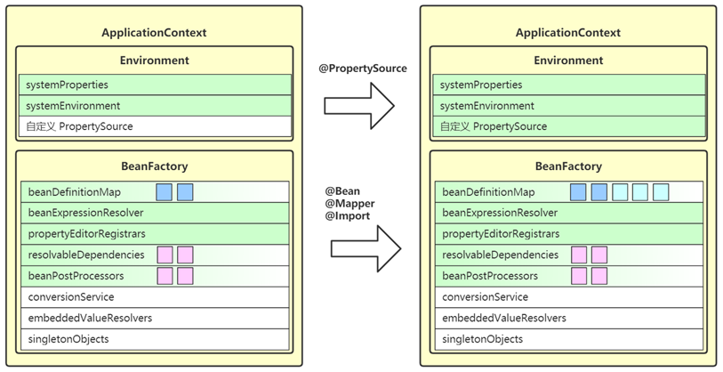

# Spring部分

## 一、ApplicationContext的refresh流程

### 1. prepareRefresh

**要点**

+ 这一步创建和准备了Environment对象
+ 理解Environment对象的作用
  + 为后续spring程序运行时，提供键值信息
  + systemProperties：java虚拟机中的键值信息
  + systemEnvironment：操作系统提供的键值对
  + PropertySource：自定义键值信息（springboot的application.yml）
  + 总之Environment的作用之一就是为后续@Value值注入时提供键值


+ 调试代码的步骤

测试代码：

```java
public static void main(String[] args) throws Exception {
    // 1) 获得 @Value 的值
    System.out.println("=======================> 仅获取 @Value 值");
    /*
    QualifierAnnotationAutowireCandidateResolver类的作用：拿到@Value注解中的值
    	+ getSuggestedValue()方法：获取目标上@Value注解的值（最原始的值，不进行任何解析，通俗地说就是字符串）
    	  +  new DependencyDescriptor(Bean1.class.getDeclaredField("name")：取的@Value的位置
    	  	Bean1.class.getDeclaredField表示要取类Bean1，name属性上的@Value的值
    	  + boolean required：是否是必须的
    */
    QualifierAnnotationAutowireCandidateResolver resolver = new QualifierAnnotationAutowireCandidateResolver();
    Object name = resolver.getSuggestedValue(new DependencyDescriptor(Bean1.class.getDeclaredField("name"), false));
    System.out.println(name);

    // 2) 解析 @Value 的值  --- 使用Environment的实现类
    System.out.println("=======================> 获取 @Value 值, 并解析${}");
    Object javaHome = resolver.getSuggestedValue(new DependencyDescriptor(Bean1.class.getDeclaredField("javaHome"), false));
    System.out.println(javaHome);
    /*
    通过resolvePlaceholders方法对${}中的内容进行解析
    */
    System.out.println(getEnvironment().resolvePlaceholders(javaHome.toString()));

    // 3) 解析 SpEL 表达式  -- 先解析内部的${}再解析外部的#{}
    System.out.println("=======================> 获取 @Value 值, 并解析#{}");
    Object expression = resolver.getSuggestedValue(new DependencyDescriptor(Bean1.class.getDeclaredField("expression"), false));
    System.out.println(expression);
    String v1 = getEnvironment().resolvePlaceholders(expression.toString());
    System.out.println(v1);
    System.out.println(new StandardBeanExpressionResolver().evaluate(v1, new BeanExpressionContext(new DefaultListableBeanFactory(),null)));
}

/*
Environment是一个接口，可以直接返回它的实现类
*/
private static Environment getEnvironment() throws IOException {
    StandardEnvironment env = new StandardEnvironment();
    //如果是在classpath下有自定义的properties文件，需要告诉spring这个文件的位置
    //env.getPropertySources().addLast(new ResourcePropertySource("jdbc", new ClassPathResource("jdbc.properties")));
    return env;
}

static class Bean1 {
    @Value("hello")
    private String name;

    @Value("${JAVA_HOME}")
    private String javaHome;

    @Value("#{'class version:' + '${java.class.version}'}")
    private String expression;
}
```

### 2. obtainFreshBeanFactory

**要点**

+ 这一步获取（或者创建）`BeanFactory`
+ 理解BeanFactory的作用
  + 负责bean的创建、依赖注入和初始化
  + bean的各项信息需要由BeanDefinition提供
+ 理解BeanDefinition的作用
  + 作为bean的设计蓝图，规定了bean的特征，如单例多例，依赖关系，初始销毁方法等
  + BeanDefinition的来源多种多样，可以通过xml解析获取，也可以通过配置类获取还能够通过包扫描获取
+ 所有的 BeanDefinition 会存入 BeanFactory 中的 beanDefinitionMap 集合


**总结**

+ BeanFactory的作用就是负责bean的创建、依赖注入和初始化

测试代码：BeanDefinition的各种来源

```java
public static void main(String[] args) {
    //开始时，并没有任何BeanDefinition
    System.out.println("========================> 一开始");
    DefaultListableBeanFactory beanFactory = new DefaultListableBeanFactory();
    System.out.println(Arrays.toString(beanFactory.getBeanDefinitionNames()));

    //从XML文件中获取bean的定义
    System.out.println("========================> 1) 从 xml 获取 ");
    XmlBeanDefinitionReader reader1 = new XmlBeanDefinitionReader(beanFactory);
    reader1.loadBeanDefinitions(new ClassPathResource("bd.xml"));
    System.out.println(Arrays.toString(beanFactory.getBeanDefinitionNames()));

    System.out.println("========================> 2) 从配置类获取 ");
    //通过编程的方式将配置类加入到容器中
    beanFactory.registerBeanDefinition("config1", BeanDefinitionBuilder.genericBeanDefinition(Config1.class).getBeanDefinition());

    /*
    bean工厂的后处理器，解析配置类，对BeanFactory的功能做一些增强
    */
    ConfigurationClassPostProcessor postProcessor = new ConfigurationClassPostProcessor();
    postProcessor.postProcessBeanDefinitionRegistry(beanFactory);
    System.out.println(Arrays.toString(beanFactory.getBeanDefinitionNames()));

    System.out.println("========================> 3) 扫描获取 ");
    ClassPathBeanDefinitionScanner scanner = new ClassPathBeanDefinitionScanner(beanFactory);
    scanner.scan("day04.refresh.sub");
    System.out.println(Arrays.toString(beanFactory.getBeanDefinitionNames()));
}

static class Bean1 {

}

static class Bean2 {

}

static class Config1 {
    @Bean
    public Bean2 bean2() {
        return new Bean2();
    }
}
```

### 3. prepareBeanFactory

**要点**

+ 完善BeanFactory，为BeanFactory的各个属性赋值
  + beanExpressionResolver 用来解析 SpEL，常见实现为 StandardBeanExpressionResolver
  + propertyEditorRegistrars 会注册类型转换器
  + registerResolvableDependency 来注册 beanFactory 以及 ApplicationContext，让它们也能用于依赖注入
  + beanPostProcessors 是 bean 后处理器集合，会工作在 bean 的生命周期各个阶段，此处会添加两个（ApplicationContextAwareProcessor和ApplicationListenerDetector）


+ 了解谁来执行类型转换
+ 了解特殊bean注入
+ 两个内置的BeanPostProcessor的作用

### 4. postProcessBeanFactory

**要点**

+ 这一步是空实现，留给子类扩展

  ```java
  protected void postProcessBeanFactory(ConfigurableListableBeanFactory beanFactory) {
  }
  ```

+ 模板方法的设计模式，提供父类方法，子类可扩展自己的方法

### 5. invokeBeanFactoryPostProcessors

**要点**

+ 理解beanFactory后处理器的作用
  + 充当beanFactory的扩展点，可以用来补充或修改BeanDefinition
+ 掌握常见的beanFactory后处理器
  + ConfigurationClassPostProcessor  –  解析 @Configuration、@Bean、@Import、@PropertySource 等
  + MapperScannerConfigurer – 补充 Mapper 接口对应的 BeanDefinition



### 6. registerBeanPostProcessors

**要点**

这一步是继续从beanFactory中找出bean后置处理器，添加至beanPostProcessor集合中

+ bean后置处理器的作用：充当bean的扩展点，可以工作在bean的实例化、依赖注入、初始化阶段，常见的有：

  + AutowiredAnnotationBeanPostProcessor 功能有：解析 @Autowired，@Value 注解
  + CommonAnnotationBeanPostProcessor 功能有：解析 @Resource，@PostConstruct，@PreDestroy
  + AnnotationAwareAspectJAutoProxyCreator 功能有：为符合切点的目标 bean 自动创建代理（AOP）

  ```java
  public static void main(String[] args) {
      GenericApplicationContext context = new GenericApplicationContext();
      DefaultListableBeanFactory beanFactory = context.getDefaultListableBeanFactory();
      //通过编程的方式创建实例对象
      beanFactory.registerBeanDefinition("bean1", BeanDefinitionBuilder.genericBeanDefinition(Bean1.class).getBeanDefinition());
      beanFactory.registerBeanDefinition("bean2", BeanDefinitionBuilder.genericBeanDefinition(Bean2.class).getBeanDefinition());
      beanFactory.registerBeanDefinition("bean3", BeanDefinitionBuilder.genericBeanDefinition(Bean3.class).getBeanDefinition());
      beanFactory.registerBeanDefinition("aspect1", BeanDefinitionBuilder.genericBeanDefinition(Aspect1.class).getBeanDefinition());
      
      //添加BeanPostProcesser
      beanFactory.registerBeanDefinition("processor1",
              BeanDefinitionBuilder.genericBeanDefinition(AutowiredAnnotationBeanPostProcessor.class).getBeanDefinition());
      beanFactory.registerBeanDefinition("processor2",
              BeanDefinitionBuilder.genericBeanDefinition(CommonAnnotationBeanPostProcessor.class).getBeanDefinition());
      beanFactory.registerBeanDefinition("processor3",
              BeanDefinitionBuilder.genericBeanDefinition(AnnotationAwareAspectJAutoProxyCreator.class).getBeanDefinition());
  
      context.refresh();
      beanFactory.getBean(Bean1.class).foo();
  }
  
  static class Bean1 {
      Bean2 bean2;
      Bean3 bean3;
  
      @Autowired
      public void setBean2(Bean2 bean2) {
          System.out.println("发生了依赖注入..." + bean2);
          this.bean2 = bean2;
      }
  
      @Resource
      public void setBean3(Bean3 bean3) {
          System.out.println("发生了依赖注入..." + bean3);
          this.bean3 = bean3;
      }
  
      public void foo() {
          System.out.println("foo");
      }
  }
  
  static class Bean2 {
  }
  
  static class Bean3 {
  }
  
  @Aspect
  static class Aspect1 {
      @Before("execution(* foo())")
      public void before() {
          System.out.println("before...");
      }
  }
  ```

**总结**

前六步都在不断地完善BeanFactory

### 7. initMessageSource

第七步又回到了ApplicationContext，为ApplicationContext添加属性赋值，这一步是为 ApplicationContext 添加 messageSource 成员，实现国际化功能

**要点**

+ MessageSource的作用：去 beanFactory 内找名为 messageSource 的 bean，如果没有，则提供空的 MessageSource 实现（即不支持国际化）
+ 国际化是Application独有的功能


### 8. initApplicationContextEventMulticaster

**要点**

* 这一步为 ApplicationContext 添加事件广播器成员，即 applicationContextEventMulticaster
* 它的作用是发布事件给监听器
* 去 beanFactory 找名为 applicationEventMulticaster 的 bean 作为事件广播器，若没有，会创建默认的事件广播器
* 之后就可以调用 ApplicationContext.publishEvent(事件对象) 来发布事件


### 9. onRefresh

**要点**

+ 这一步是空实现，留给子类扩展
  + 常见的使用是SpringBoot中的子类在这里准备了WebServer（内嵌的Tomcat）
+ 模板方法的设计模式

### 10. registerListeners

**要点**

+ 这一步从多种途径找到事件监听器，并添加至applicationEventMulticaster
+ 事件监听器的作用就是用来接收事件广播器发布的事件，一般的来源有：
  + 事先编程添加的
  + 来自容器中的bean
  + 来自于@EventListener的解析
+ 要实现事件监听器，需要实现ApplicationListener接口，重写其中的onApplicationEvent(E e)方法


### 11. finishBeanFactoryInitialization

**要点**

+ 这一步会将beanFactory的成员补充完整，并初始化所有非延迟单例bean
+ 了解conversionService的作用：是一套转换机制，作为PropertyEditor的补充
+ embaddedValueResolvers：内嵌值解析器，用来解析@Value中的${}表达式，底层也是调用了Environment的功能
+ singletonObjects：单例池，缓存所有的单例对象
  + 对象的创建都分为三个阶段，每一个阶段都有不同的bean后处理器参与进来，扩展功能


### 12. finishRefresh

**要点**

+ 这一步会将ApplicationContext添加至lifecycleProcessor 成员，用来控制容器内需要生命周期管理的 bean

* 准备好生命周期管理器，就可以实现
  * 调用 context 的 start，即可触发所有实现 LifeCycle 接口 bean 的 start
  * 调用 context 的 stop，即可触发所有实现 LifeCycle 接口 bean 的 stop
* 发布 ContextRefreshed 事件，整个 refresh 执行完成


### 总结

refresh是AbstractApplicationContext中的一个方法，负责初始化ApplicationContext容器

```java
@Override
public void refresh() throws BeansException, IllegalStateException {
   synchronized (this.startupShutdownMonitor) {
      // Prepare this context for refreshing.
      prepareRefresh();

      // Tell the subclass to refresh the internal bean factory.
      ConfigurableListableBeanFactory beanFactory = obtainFreshBeanFactory();

      // Prepare the bean factory for use in this context.
      prepareBeanFactory(beanFactory);

      try {
         // Allows post-processing of the bean factory in context subclasses.
         postProcessBeanFactory(beanFactory);

         // Invoke factory processors registered as beans in the context.
         invokeBeanFactoryPostProcessors(beanFactory);

         // Register bean processors that intercept bean creation.
         registerBeanPostProcessors(beanFactory);

         // Initialize message source for this context.
         initMessageSource();

         // Initialize event multicaster for this context.
         initApplicationEventMulticaster();

         // Initialize other special beans in specific context subclasses.
         onRefresh();

         // Check for listener beans and register them.
         registerListeners();

         // Instantiate all remaining (non-lazy-init) singletons.
         finishBeanFactoryInitialization(beanFactory);

         // Last step: publish corresponding event.
         finishRefresh();
      }

      catch (BeansException ex) {
         if (logger.isWarnEnabled()) {
            logger.warn("Exception encountered during context initialization - " +
                  "cancelling refresh attempt: " + ex);
         }

         // Destroy already created singletons to avoid dangling resources.
         destroyBeans();

         // Reset 'active' flag.
         cancelRefresh(ex);

         // Propagate exception to caller.
         throw ex;
      }

      finally {
         // Reset common introspection caches in Spring's core, since we
         // might not ever need metadata for singleton beans anymore...
         resetCommonCaches();
      }
   }
}
```

大致可以分为四个大步骤

+ 1准备环境
+ 2 3 4 5 6准备BeanFactory
+ 7 8 9 10 12准备ApplicationContext
+ 11初始化BeanFactory中的非延迟单例bean


## 二、Spring bean的生命周期

### 阶段划分的依据：doGetBean方法

```java
//AbstractBeanFactory类中的方法
protected <T> T doGetBean(final String name, @Nullable final Class<T> requiredType,
      @Nullable final Object[] args, boolean typeCheckOnly) throws BeansException {

}
```

### 阶段1：处理名称，检查缓存

+  这一步首先会处理bean的别名，讲别名解析为实际名称

  ```java
  //对应于代码中的这一句
  final String beanName = transformedBeanName(name);
  
  //最终这个方法会调用自己类中的成员方法：
  public String canonicalName(String name) {
  		String canonicalName = name;
  		// Handle aliasing...
  		String resolvedName;
  		do {
              //aliasMap是存放别名的map，本质上是ConcurrentHashMap
  			resolvedName = this.aliasMap.get(canonicalName);
  			if (resolvedName != null) {
  				canonicalName = resolvedName;
  			}
  		}
  		while (resolvedName != null);
  		return canonicalName;
  	}
  ```

+ 对FactoryBean也会有特殊的处理，如果以"&"开头，就表示要获取FactoryBean本身，否则表示要获取其产品

+ 对单例对象会去检查spring的一级、二级、三级缓存

  + 一级缓存：singletonObjects，存放已经完成创建的单例成品对象
  + 二级缓存：earlySingletonObjects，存放单例工厂的产品对象
  + 三级缓存： singletonFactories，存放单例工厂对象

  ```java
  //对应于这段代码
  // Eagerly check singleton cache for manually registered singletons.
  Object sharedInstance = getSingleton(beanName);
  
  //这个方法调用DefaultSingletonBeanRegistry类中的：
  protected Object getSingleton(String beanName, boolean allowEarlyReference) {
      //会先查找一级缓存中是否有这个单例对象
  		Object singletonObject = this.singletonObjects.get(beanName);
      //下面这段是解决循环依赖的代码，之后会细说
  		if (singletonObject == null && isSingletonCurrentlyInCreation(beanName)) {
  			synchronized (this.singletonObjects) {
  				singletonObject = this.earlySingletonObjects.get(beanName);
  				if (singletonObject == null && allowEarlyReference) {
  					ObjectFactory<?> singletonFactory = this.singletonFactories.get(beanName);
  					if (singletonFactory != null) {
  						singletonObject = singletonFactory.getObject();
  						this.earlySingletonObjects.put(beanName, singletonObject);
  						this.singletonFactories.remove(beanName);
  					}
  				}
  			}
  		}
  		return singletonObject;
  	}
  ```

### 阶段2、处理父容器

* 如果当前容器根据名字找不到这个 bean，此时若父容器存在，则执行父容器的 getBean 流程
* 父子容器的 bean 名称可以重复


### 阶段3、处理dependsOn

* 如果当前 bean 有通过 dependsOn 指定了非显式依赖的 bean，这一步会提前创建这些 dependsOn 的 bean 
* 所谓非显式依赖，就是指两个 bean 之间不存在直接依赖关系，但需要控制它们的创建先后顺序

### 阶段4、按照scope创建bean

scope即为bean的作用域，常见的有singleton和prototype

+ singleton：从单例池（一级缓存）中获取bean对象，如果没有，则创建之后再放入这个单例池中
  + 单例池是在refresh的第十一个步骤就被创建出来了，顺带把其中部分单例对象也创建出来放到单例池了
  + 单例对象的销毁是随着容器的销毁而销毁
  + 所有bean的生命周期的起点都是doGetBean方法，虽然单例池在refresh阶段被创建出来，底层仍然调用了getBean方法
+ prototype：多例bean不受spring容器的管理，每次在调用getBean方法时，都会创建一个对象，需要用户手动调用方法进行销毁，生命周期由用户决定

> `getBean()`方法是顶层接口BeanFactory中定义的方法，而AbstractBeanFactory中扩展了这个方法，最终调用其内部方法`doGetBean()`来创建对象，所以，一切bean生命周期的起点都是getBean方法

### **阶段5、创建bean**

#### 5.1 创建bean实例

有关键的两个创建方法：

+ **AutowiredAnnotationBeanPostProcessor**：
  + ① 优先选择带  @Autowired  注解的构造
  + ② 若有唯一的带参构造，也会入选
+ **采用默认的构造方法**：如果上面的后处理器和 BeanDefiniation 都没找到构造，采用默认构造，即使是私有的（会采用暴力反射的方法）

#### 5.2 依赖注入

通过各种beanPostProcessor去寻找需要注入的属性，常见的注入方式有：

+ AutowiredAnnotationBeanPostProcessor：**识别**   @Autowired  及 @Value  标注的成员，封装为  InjectionMetadata 进行依赖注入，最终进行依赖注入的是InjectionMetadata，这个beanPostProcessor只负责识别
+ CommonAnnotationBeanPostProcessor：**识别**   @Resource  标注的成员，封装为  InjectionMetadata 进行依赖注入
+ AUTOWIRE_BY_NAME：根据成员名字找 bean 对象，修改 mbd 的 propertyValues，不会考虑简单类型的成员
+ AUTOWIRE_BY_TYPE：根据成员类型执行 resolveDependency 找到依赖注入的值，修改  mbd 的 propertyValues
+ applyPropertyValues：根据 mbd 的 propertyValues 进行依赖注入（即xml中 `<property name ref|value/>`）

> 各种依赖注入的优先级：
>
> + 在xml配置中的优先级最高
> + 其次是根据名称和类型注入（就是xml配置中的byName或者byType）
> + 优先级最低的是使用注解方式进行注入的

#### 5.3 初始化阶段


## 附录1 ApplicationContext与BeanFactory

### ApplicationContext与BeanFactory之间的关系

BeanFactory：是ApplicationContext的父接口，spring真正的核心容器，是ApplicationContext的一个成员变量

ApplicationContext中的某一部分功能是间接调用BeanFactory的功能

BeanFactory的结构：


### BeanFactory的功能

在BeanFactory的接口定义中，最主要的功能就是getBean方法

实际上，BeanFactory的功能有很多，都是由其实现类提供的，包括：

+ 控制反转
+ 依赖注入
+ 以及Bean的生命周期的管理等等

一个常用的实现类DefaultListableBeanFactory


其中一个比较重要类是DefaultSingletonBeanRegistry，用于管理spring中的所有单例对象

比较重要的属性就是spring的三级缓存

```java
private final Map<String, Object> singletonObjects = new ConcurrentHashMap<>(256);

/** Cache of singleton factories: bean name to ObjectFactory. */
private final Map<String, ObjectFactory<?>> singletonFactories = new HashMap<>(16);

/** Cache of early singleton objects: bean name to bean instance. */
private final Map<String, Object> earlySingletonObjects = new ConcurrentHashMap<>(16);
```

### ApplicationContext的作用

ApplicationContext的作用完全取决于它所继承的接口，主要的功能有四个，分别通过继承四个接口实现


+ MessageSource：国际化功能，主要提供一些语言的翻译功能，主要的方法就是`getMessage()`方法，一些信息都配置在message.properties中
+ ResourcePatternResolver：匹配资源的功能，资源是指从磁盘路径或者类路径下找到的一些文件，可以根据通配符匹配多个资源，主要的方法是`getResources()`和`getResource()`方法
+ ApplicationEventPublisher：用来发布事件对象，主要的优点就是可以实现容器内部功能的解耦，
+ EnvironmentCapable：读取一些环境信息（配置信息），主要的方法就是`getProperty()`方法

> ApplicationEventPublisher的使用：
>
> ApplicationContext可以使用`publishEvent()`方法发送事件，事件可以自己定义，但需要实现一个接口，来标记这是一个事件
>
> ```java
> public class UserRegisterEvent extends ApplicationEvent {
>     public UserRegisterEvent(Object source) {
>         super(source);
>     }
> }
> ```
>
> spring容器中任何一个对象都可以作为监听器使用，在类中可以使用某个方法来接收事件
>
> ```java
> @Component
> @Slf4j
> public class ComponentB {
>     @EventListener   //spring容器中任意一个对象都能够作为事件监听器，这个注解表示这个方法需要接收事件
>     public void receiveEvent(UserRegisterEvent event) {
>         log.debug("{}", event);
>     }
> }
> ```
>
> 这样就可以做到一些处理事件的代码解耦

### 总结

ApplicationContext与BeanFactory不仅仅是简单的接口继承关系

+ ApplicationContext组合并扩展了BeanFactory的功能（以BeanFactory作为自己的属性）
+ 事件的手法，新的代码之间解耦的方式


## 附录2 BeanFactory的实现类

 ### DefaultListableBeanFactory

是最主要的BeanFactory的实现类

```java
public class TestBeanFactory {
    public static void main(String[] args) {
        //一个最主要的beanFactory的实现类
        DefaultListableBeanFactory beanFactory = new DefaultListableBeanFactory();

        //bean的定义：class，scope（作用域），初始化方法，销毁方法
        AbstractBeanDefinition beanDefinition =
                BeanDefinitionBuilder.genericBeanDefinition(Config.class).setScope("singleton").getBeanDefinition();
        //将bean注册到beanFactory中
        beanFactory.registerBeanDefinition("config", beanDefinition);

        //给beanFactory添加一些后置处理器
        AnnotationConfigUtils.registerAnnotationConfigProcessors(beanFactory);
        
        //获取beanFactory中的所有beanFactory的后置处理器，后置处理器的作用是补充了一些bean的定义
        Map<String, BeanFactoryPostProcessor> postProcessorMap =
                beanFactory.getBeansOfType(BeanFactoryPostProcessor.class);
        //执行每一个beanFactory的后置处理器
        postProcessorMap.values().stream().forEach(beanFactoryPostProcessor -> {
            beanFactoryPostProcessor.postProcessBeanFactory(beanFactory);
        });

        for (String name: beanFactory.getBeanDefinitionNames()) {
            System.out.println(name);
        }

        //bean后处理器，针对bean生命周期的各个阶段提供一些扩展功能，比如@Autowired，依赖注入
        Map<String, BeanPostProcessor> processorMap = beanFactory.getBeansOfType(BeanPostProcessor.class);
        processorMap.values().stream().forEach(beanFactory :: addBeanPostProcessor);

        //即使到这个地步，beanFactory仍然没有依赖注入的功能，依赖注入的功能仍然是由bean后置处理器提供的
        //bean后置处理器是针对每一个bean的生命周期进行扩展
        Bean1 bean1 = beanFactory.getBean(Bean1.class);
        System.out.println(bean1.getBean2());  

    }

    @Configuration
    static class Config {
        @Bean
        public Bean1 bean1() {
            return new Bean1();
        }

        @Bean
        public Bean2 bean2() {
            return new Bean2();
        }
    }

    static class Bean1 {
        @Autowired
        private Bean2 bean2;

        public Bean1() {
            log.debug("构造Bean1()");
        }

        public Bean2 getBean2() {
            return bean2;
        }
    }

    static class Bean2 {
        public Bean2() {
            log.debug("构造Bean2()");
        }
    }
}
```

需要注意的是，如果单纯的使用new的方法创建beanFactory，这个BeanFactory并不具有其他任何功能，因为BeanFactory只是一个基础容器，并没有其他的扩展功能，它的扩展功能都是由其后置处理器实现的，比如：

+ ConfigurationAnnotationProcessor：解析配置类的注解@Configuration
+ AutowiredAnnotationProcessor / CommonAnnotationProcessor：解析@Autowired和@Resource进行依赖注入的注解
+ ...

BeanFactory的特点：

+ 不会主动调用BeanFactory的后处理器
+ 不会主动添加Bean后处理器
+ 不会主动初始化单例对象（第一次调用方法时创建，懒加载）

