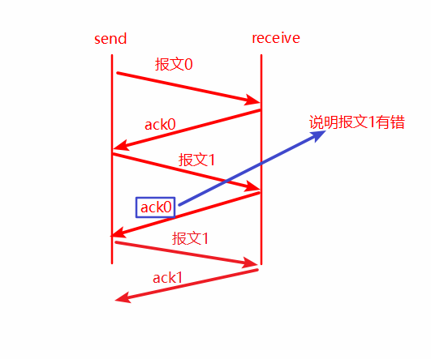
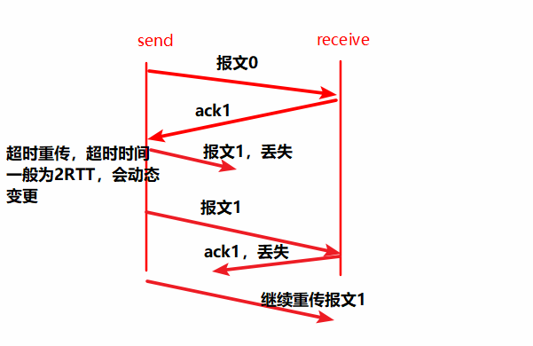
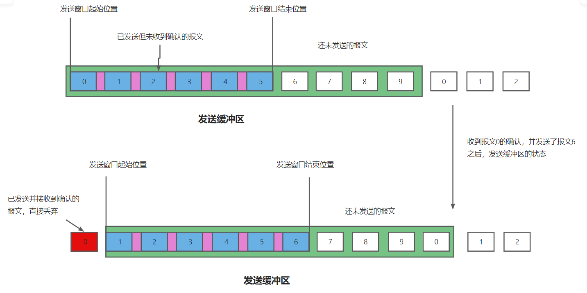
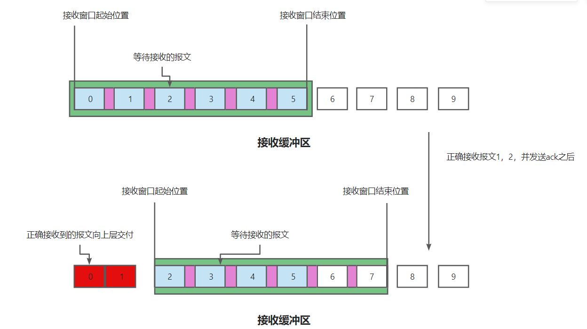
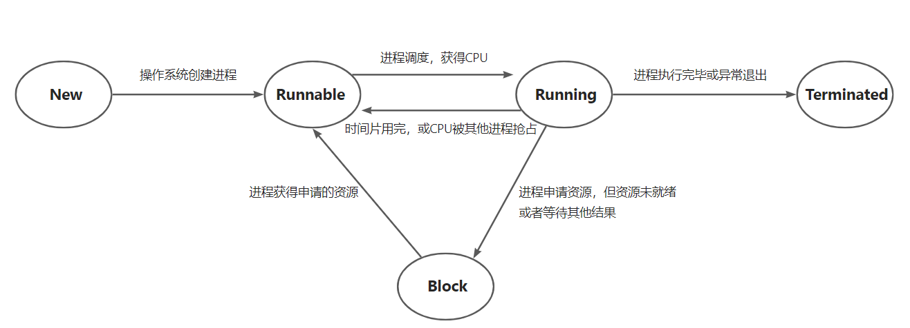
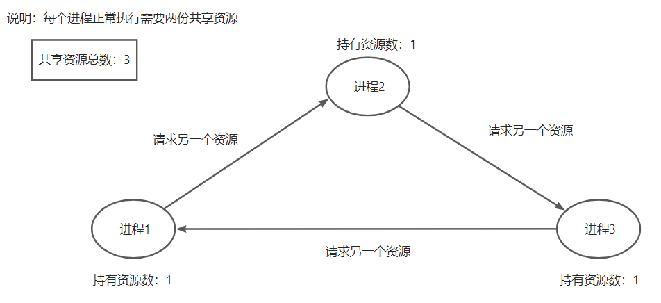

# 计算机基础部分

## 计算机网络

### 应用层

应用层是对应用程序的通信提供服务的

**应用层协议定义**

+ 应用进程交换的报文类型，请求 or 响应
+ 各种报文类型的语法，如报文中的各个字段及其详细描述
+ 字段的语义，即包含在字段中的信息的含义
+ 进程何时，如何发送报文，以及对报文进行响应的规则

**应用层的功能**

+ 文件传输、访问和管理
+ 电子邮件
+ 虚拟终端
+ 查询服务和远程作业登录

应用对传输层协议的一些要求：

| 应用       | 数据丢失率 | 吞吐                                   | 时间敏感度  |
| ---------- | ---------- | -------------------------------------- | ----------- |
| 文件传输   | 不能丢失   | 弹性                                   | 不高        |
| 邮件       | 不能丢失   | 弹性                                   | 不高        |
| 实时音视频 | 容忍丢失   | 音频：5kpbs-1Mbps  视频：0kbps - 5Mbps | 敏感        |
| 交互时游戏 | 容忍丢失   | 10kpbs左右                             | 敏感 ms级别 |
| 即时讯息   | 不能丢失   | 弹性                                   | 不高        |


### 网络应用模型

**客户端 --- 服务器模型**

服务器：提供计算服务的设备

+ 永久性提供服务
+ 永久性访问地址或者域名

客户端：请求计算服务的主机

+ 与服务器通信，使用服务器提供的服务
+ 间歇性接入网络
+ 可能使用动态IP地址
+ 不与其他客户机直接通信

应用：Web基本上都是这样的，文件传输FTP，远程登录，电子邮件

这种模型的可扩展性比较差

**P2P模型**

不存在永远在线的服务器

每个主机既可以提供服务，也可以请求服务

任意端系统 / 结点之间可以直接通讯

每一个结点的IP地址不固定

可扩展性比较好，网络健壮性强（高可用）

### DNS系统

**域名**

+ www.baidu.com
+ www.google.com
+ ...

形式：xxx.xxx.xxx由英文字符（不区分大小写）、`"."`分隔符以及`"-"`（在每个分隔符之间构成一部分的名称比如www.xx-xx.com）

为便于记忆，每个分隔符之间的字符长度不超过12个字符

以百度的域名为例：域名从左向右等级逐渐增高

+ www：三级域名
+ baidu：二级域名
+ com：顶级域名

其实还有一个根，域名完整的写法应该是：`www.baidu.com.`最后那一个点就是根

**顶级域名**

+ 国家级顶级域名：`cn, us, uk`等
+ 通用顶级域名：`com, net, org, gov`等
+ 基础结构域名：`arpa`

**二级域名**

+ 类别域名：`ac, com, edu, gov, net, org`等
+ 行政区域名：`bj, js`
+ 用户自定义注册域名：根据用户注册时自定义的域名比如baidu、google等

可以看到二级域名与顶级域名有部分重复的，这取决于注册时选择的域名，像百度com就是顶级域名，如果是像：`www.baidu.com.cn`这样最后带国家级域名的，com就成了二级域名

**三级域名 / 四级域名**

一般常见的三级 / 四级域名有www、mail、ftp等

像：`www.pku.edu.cn`就会有四级域名

`mail.pku.edu.cn`等

网站域名的书写就是由低级域名向高级域名写的


**域名服务器**

本地域名服务器：原本本地域名服务器是不属于整体的域名服务器体系的，但对域名解析非常重要

+ 当一个主机发出DNS查询请求时，这个查询请求报文就会发给本地域名服务器
+ 本地域名服务器距离主机一般不会超过几个路由器的距离

根域名服务器：当本地域名服务器没有缓存域名的ip地址时，会首先向根域名服务器发送查询ip的请求

+ 根域名服务器知道所有顶级域名的IP地址
+ 根域名服务器保存有13不同ip的顶级域名，每个顶级域名拥有多台顶级域名服务器


顶级域名服务器：管理该顶级域名服务器注册的所有二级域名

权限域名服务器：负责一个区的域名服务器


**域名解析过程**

递归查询

`本地域名服务器 ---> 根域名服务器 ---> 顶级域名服务器 ---> 权限域名服务器`

返回是从权限域名服务器逆序返回

其实就是遍历域名服务器树的一个过程，本地请求根，根再请求顶级域名服务器一层层下去


迭代查询

由本地服务器发送查询请求到根域名服务器

如果根域名服务器无法解析全部域名，根域名会告诉本地域名服务器去查询哪个顶级域名服务器

全程都是由本地域名服务器亲自查询的


两种查询的实例：


### 万维网

万维网www是一个大规模、联机式的信息储藏所 / 资料空间，是无数个网络站点和网页的集合

由统一资源定位符URL唯一地标识一个万维网中的资源

> URL：<协议>://<主机ip>:<端口>/<路径>

用户通过点击超链接获取资源，这些资源通过超文本传输协议HTTP传送给使用者

万维网以客户 / 服务器方式工作，用户使用的浏览器就是万维网客户程序，万维网文档所驻留的主机运行服务器程序

万维网使用超文本标记语言HTML，使得万维网页面设计者可以很方便地从一个界面的链接转到另一个界面


### HTTP协议

http协议的工作过程


当在浏览器的地址栏输入URL或者点击超链接时

+ 浏览器首先分析URL，并向DNS服务器请求解析ip地址
+ DNS收到请求后处理并返回解析出的IP地址
+ 浏览器与服务器建立TCP连接，并向服务器发送取文件的请求
+ 服务器处理并响应浏览器的请求
+ 数据传输完毕之后释放TCP连接
+ 浏览器解析显示页面

HTTP是无状态的协议，指的是第二次发送http请求获得的结果与第一次发送http请求的结果相同，并且过程也是相同的

但在实际环境中，通常都需要识别用户，所以会有Cookie，Cookie是存储在用户主机中的文本文件，记录一段时间内用户的访问记录

> **Cookie的特点**：
>
> Cookie技术通过在请求和响应报文中写入Cookie信息来控制客户端的状态，Cookie会根据从服务器端发送的响应报文内的一个叫Set-Cookie的首部字段，通知客户端保存Cookie，当下次客户端再次往该服务器发送请求时，客户端会自动在请求报文中添加Cookie值后发送出去，服务器会检查是从哪个客户端发来的请求，然后对比服务器上的记录，得到之前的状态信息

HTTP协议以TCP协议作为运输层协议，但HTTP本身是无连接的

> http1.0与http1.1之间的区别：
>
> + http1.0是非持久连接，即：每请求一个资源就需要建立一次连接（短连接）
>   + Http客户端在80端口发起请求
>   + 服务器在80端口等待连接，接收并通知客户端
>   + Http客户端发送http请求报文，服务器接收请求报文并解析内容
>   + **http关闭TCP连接**
> + http1.1是持久连接，即服务器处理完请求给客户端响应之后并不关闭TCP连接（长连接）
>   + 客户端之后的请求和服务器之后的响应使用第一次建立的TCP连接
>   + 非流水方式的持久http：客户端在接收到一个响应后才能再次发出下一次响应
>   + 流水方式的持久http：客户端能够一次性发送多个请求
>
> 往返时间RTT（round-trip-time）：一个小的报文分组从客户端到服务器，再回到客户端的时间
>
> 响应时间：一个RTT用来发起TCP连接；一个RTT用来HTTP请求并等待HTTP响应


**get请求与post请求的区别**

+ get请求提交的数据会拼接在URL之后，并且请求参数会被完整的保留在浏览器的记录里，存在一定的安全性问题，因此往往用于从服务器中获取资源信息
+ post请求参数放在请求体中，并且参数不会被保留，相比get方法，post方法更安全，主要用于修改服务器上的资源
+ get请求只支持URL编码，即ASCII编码格式；post请求没有这个限制
+ get请求提交的数据相对浏览器而言有大小限制；post方法提交的数据没有限制

**HTTP2.0与HTTP1.1之间的区别**

HTTP2.0大幅度的提高了Web工作性能，在HTTP1.1完全语义兼容的基础上，进一步减少了网络延迟，实现低延迟高吞吐量的目标

主要的特点有：二进制分帧，首部压缩，多路复用，请求优先级，服务器推送


### TCP协议

**TCP协议的特点**

+ TCP是面向连接（虚连接）的传输层协议
+ 每一条TCP连接只能有两个端点
+ TCP提供可靠交付服务无差错，不丢失，不重复，按序到达
+ TCP提供全双工通信，通信双方都设有发送缓存和接收缓存
+ TCP面向字节流的，TCP把应用程序转发下来的数据看成是一连串的无结构的字节流

**TCP报文**


**TCP连接管理**

TCP连接建立的三个阶段：

+ 建立连接（三次握手）
+ 数据传输
+ 连接释放（四次挥手）

TCP连接的建立采用**客户端服务器的方式**，主动发起连接建立的应用进程称为客户端，而被动等待连接建立的应用进程叫服务器


**TCP可靠传输**

可靠：保证接收方进程从缓存区读出的字节流与发送方发出的字节流完全一样，不出错，不重复，不失序

TCP可靠传输的保证：校验、序号机制、确认机制、重传机制

+ 序号机制：给每个报文分配一个序号，这个序号机制可以解决报文重复和报文乱序问题
+ 确认机制：发送方发送的每一个报文，接收方都得给一个确认
+ 重传机制：如果发送方没有收到报文的ACK确认，则重发报文

发送方：

+ 在报文分组中加入序号，0或者1（停止等待协议），一次只发送一个未经确认的分组，等待收到确认之后才会发送下一个分组
+ 需要检测接收方发送过来的ACK / NACK是否出错

接收方：

+ 检测收到的报文是否出错 / 重复
+ 如果报文正确，则发送ACK确认，如果报文出错则发送NAK

**传输层的多路复用和解复用**

发送方主机的多路复用：从多个套接字接收来自多个进行的报文，根据套接字对应的IP地址和端口号等信息对报文段用头部加以封装

> 应用层在向传输层传送数据的时候，会传送两个部分：①Message本身  ②Socket，而socket中就包含了通信的源ip和目标ip，源端口和目标端口，以TCP协议为例，其Socket格式为：
>
> | Socket | 源IP | 源端口 | 目标IP | 目标端口 |
> | ------ | ---- | ------ | ------ | -------- |
>
> 当传输层从应用层接收到来自多个进程的报文时，就可以通过Socket中对应的端口号对数据报文进行区分，从而在封装传输层报文的时候加上源端口和目标端口；然后向下交付给网络层的时候，网络层仍然能够通过Socket中的源ip和目标ip封装ip报文

接收方主机的多路解复用：根据报文段的头部信息中的ip地址和端口号将接收到的报文段发给正确的套接字

> 接收方主机在收到IP数据报的时候，进行解封装，向传输层交付TPC数据报，当然也包括源端口和目标端口，传输层根据数据头中的源端口和目标端口以及IP报文头的源ip和目标ip就能在Socket表中查出这个报文是要交付给哪个进程的，然后进一步向上交付给应用层

### UDP协议

UDP协议不同于TCP协议，它提供不可靠的无连接的数据包处理服务，UDP协议尽最大努力交付，报文段可能丢失，可能乱序也可能发生错误

UDP是无连接的协议：UDP发送端和接收端之间没有“握手”，每个UDP报文都被独立地处理

UDP通常被用于实时性比较强的应用，比如网络多媒体，DNS域名解析等

UDP相比于TCP的优势：

+ 无连接的，不存在建立连接需要的时延，UDP不需要维护连接，减少开销，传输效率很高
+ UDP报文首部开销很小，只有8个字节（通常报文的首部也称为报文的开销，首部越大，开销越大，TCP报文首部有20个字节）
+ 没有繁琐的拥塞控制和流量控制，发送的速度非常快应用层向传输层交付之后可以立即向网络层转发并投递到网络中
+ 由于不需要建立连接，UDP支持一对一，一对多，多对一和多对多间的信息交互

如果想要在UDP上实现可靠传输就需要一个比较可靠的应用层，或者设计的应用程序有特定的差错控制

### 可靠数据传输（RDT）原理

可靠数据传输的难点就是，如果在下层服务不可靠的前提下，向上层提供可靠的数据传输服务

**RDT1.0**

可以进行一层层假设，首先RDT1.0：在可靠信道上的可靠数据传输，基于假设

+ 下层的信道是完全可靠的，没有bit丢失也没有分组丢失

其实这个发送方只需要接收上层的数据进行封装，然后直接交付给下层即可；接收方也只需要接收数据，进行解封装，即可得到正确的数据

**RDT2.0**

在RDT1.0上去掉一个假设，也就是说下层信道在传输的过程中会出现bit翻转，也就是信息可能出错

这时，接收方就需要使用校验的方式来检测比特位的差错

如果信息出现了差错，如何将信息从差错中恢复：引入新的确认机制

+ 确认（ACK）接收方在检测信息没有出错时，显示地向发送方发送确认，告诉发送方信息已正确收到
+ 否认（NACK）接收方收到的信息没有通过校验，显示地向发送方发送NACK，告诉发送方信息出现差错
  + 发送方如果收到NACK，就需要向接收方重新发送一份数据

所以相比于理想的RDT1.0，RDT2.0新增了：

+ 发送方差错控制编码，以及需要缓存一份发送的数据
+ 接收方使用编码校验
+ 接收方的反馈，信息正确或者信息错误
+ 发送方在接收到反馈之后的相应动作，是重发还是继续发送下一份数据

RDT2.0主要解决的问题就是发送方发送报文出现错误的情况

**RDT2.1**

既然发出去的报文可能出错，那么接收方向发送方发送的确认报文也可能出错，RDT2.0解决不了接收方发出ack / nack出现差错的情况，由此引出RDT2.1

RDT2.1在RDT2.0的基础上，加上了序号机制，为每个发送的报文编一个号，发送的流程是：

+ 发送方发送报文0，接收方接收报文0
+ 如果接收方检测到报文0没有出错，发送ack，但ack在传输过程中出错，比如bit位翻转，导致解析乱码
+ 发送方收到接收方发出的错误的ack，直接重发报文0
+ 接收方再次收到报文0，由于报文已被编号，所以能够辨别出重复报文，直接丢弃其中一个重复报文即可，**再次向发送方发送ack**
+ 发送方收到ack之后才能继续发送下一个报文

其实这就是**停止-等待协议**，发送方发送一个报文之后，等待接收方确认，如果出错重发；直到收到没有出错的ack之后才能发送下一个报文

报文的序号也只需要两个0和1即可，所以RDT2.1主要解决的问题就是接收方发送ack / nack出错的情况

> **RDT2.2**
>
> 对于RDT2.1的优化，去掉NACK报文，对ACK报文进行编号，标识这个ACK确认的是几号报文，具体的流程：
>
> 
>
> + 发送方发送报文0，接收方接收到并通过检测，向发送方发送ack0
> + 发送方正确接收到ack0发送报文1，接收方接收到报文1，但检测出错，**仍然向发送方法送ack0**
> + 发送方收到ack0，表明之前发送的报文1出错，重新发送报文1
> + 接收方收到报文1并发送ack1，发送方接着发送下一个报文
>
> RDT2.2主要对RDT2.1做了一定的优化，去掉NACK，为之后的流水线协议做准备

**RDT3.0**

在RDT2.0的基础上再去掉一层假设，即报文的传输有可能丢失，RDT3.0面临的状况就是，报文在下层传输的过程中，即可能出错，也可能丢失，如果仅仅靠RDT2.0的那一套，可能会产生通信死锁的问题，接收方收不到报文，发送方收不到ACK

解决方法：**超时重传机制**，发送方等待ACK一段合理时间之后，如果没有收到接收方的ACK，则重传刚刚发送的报文，大致的流程就是：

+ 发送方发送报文0，并启动超时重传计时器，接收方收到并发送ack0，发送方收到ack0，重置重传计时器
+ 发送方发送报文1，但在中途丢失，接收方仍在等待ack；
+ 发送方迟迟未收到ack1，此时计时器归零，发送方重发报文1；这时接收方收到并发送ack1
+ 假设ack1中途丢失，发送方未收到ack1，再次触发重发报文1
+ 接收方再次收到报文1，判定为重复报文，丢弃，**并向发送方发送ack1**
+ 发送方收到ack1后继续发送后续报文




RDT3.0所解决的问题就是在传输过程中，报文可能出现丢失的情况，主要的解决方法就是引入超时重传机制，传输层的这个超时时间是适应式的，也就是动态计算变更的

### 滑动窗口协议

RDT3.0已经是一个比较完备的协议，能够解决信道传输过程中bit出错，以及报文丢失的情况，但是前面讨论的RDT都是基于停止-等待协议，发送方一次只能发送一个报文，等待接收方确认之后才能发送下一个报文，中途还有可能出现报文丢失，出错重发的情况，信道的利用率极低，非常影响传输效率

可以对停止等待协议做一个升级：就是滑动窗口协议

在滑动窗口协议中，发送方和接收方都维护两个窗口

+ 发送缓冲区：内存中的一个区域，落入缓冲区的分组可以向接收方发送，用于存放已经发送但还没收到确认的报文，其缓冲区的报文可用于重发

  + 发送缓冲区的大小，一次最多可以发送多少个未经确认的分组
  + 当接收到报文的确认之后，发送窗口的起始位置可以向前滑动

  

+ 接收缓冲区：接收方用于接收报文的缓冲区，报文落入分组序号内才允许接收，若接收到的报文序号在接收窗口的范围之外，则丢弃

  + 正确接收到一个报文，发送ack之后，将正确接收到的报文向上层交付，接收窗口向前滑动
  + 如果接收方收到了报文序号为9的报文，则需要丢弃，并发送等待接收报文序号最大的ack
  + 如果接收窗口大小为1，则只能顺序接收；否则可以乱序接收
  + 当接收窗口大小为1时，就称为Go Back N，能够进行累计确认，发送连续收到的最大序号的报文确认，比如发送方连续发送了1 2 3 4号报文，接收方如果都正确收到，只需要发送ack4，代表1 2 3 4号报文全部收到
  + 当接收窗口大小大于1时，就称为随机确认，接收方收到哪个分组，就发送哪个分组的确认

  


## 操作系统

### 进程的定义

**多道程序技术**

内存中同时放入多道程序，各个程序的代码、运算数据存放的位置不同，操作系统为每个运行的程序配置一个数据结构，称为进程控制块（PCB），用来描述进程的各种信息（比如代码存放的位置）

为了方便操作系统管理，完成各程序并发执行的任务，引入了进程、进程实体的概念

**进程**

程序段、数据段、PCB三部分组成了进程实体（进程映像），一般情况下进程实体就简称为进程

例如：

+ 创建进程是创建进程实体中的PCB
+ 撤销进程实质上是撤销实体中的PCB

从不同的角度来看进程有不同的定义：

+ 进程是程序的一次执行过程
+ 进程是一个程序及其数据在处理机上顺序执行时所发生的活动
+ 进程具有独立功能的程序在数据集合上运行的过程
+ **进程是系统进行资源分配和调度的基本单位**

> 综合来说，进程的定义可以概括为：是系统资源分配和调度的一个独立单位

### 进程的状态及状态转换

进程是程序的一次执行，在这个执行过程中，有时进程正在被CPU处理，有时又需要等待CPU服务，操作系统为进程划分了几种状态

**进程的三种基本状态**

+ 运行态：占有CPU资源，已经在CPU上运行
+ 就绪态：进程已经拥有了除CPU之外的所有需要资源，一旦获得CPU，便可进入运行态
+ 阻塞态：因等待某一事件而暂时不能运行，如等待操作系统分配资源，等待IO结果等

**进程的另外两种状态**

+ 创建态（New）：即进程正在被创建，操作系统正在为进程分配资源，初始化PCB块
+ 终止态（Terminated）：进程执行结束或者出现异常退出，操作系统正在回收进程拥有的资源，撤销PCB块

**进程状态的转换**



+ 进程从运行态转换为阻塞态是一种进程自身做出的主动行为
+ 阻塞态到就绪态是进程被动被控制的行为
+ 阻塞态不能直接转换为运行态


### 进程通信

进程通信就是进程之间的信息交换

进程是系统分配资源的单位（包括内存空间），因此各个进程拥有的内存空间相互独立


**共享存储**

操作系统在内存空间中开辟一个共享空间，每个进程都能访问这个共享空间

但每个进程对共享空间的访问必须是互斥的，互斥操作的实现由操作系统提供（PV操纵）


由共享存储来实现进程间通信分为两种方式：

+ 基于数据结构的共享：在共享空间中只能存放一个固定的数据结构（通常是长度固定的数组），每次通信时，发出的信息不能超过数组的长度，这种方式通信速度慢，限制多，是一种低级通信方式
+ 基于存储区的共享：在内存中划分出一块共享存储区，通信的数据形式、数据的存放位置都由进程控制，这种通信方式效率比较高

**管道通信**

管道（Pipe）是用于连接读写进程的一个共享文件，就是在内存中开辟的一个大小固定的缓冲区


管道通信的特点：

+ 管道只能采用半双工通信，即在某一个时间段内只能实现单向的传输
  + 如果要实现双向同时通信，可以设置两个管道
+ 各个进程互斥地访问管道
+ 数据以字符流的形式写入管道，当管道写满时，写进程将会被阻塞，等待读进程将数据取走
  + 当读进程将数据全部取走之后，管道变空，此时读进程将会被阻塞，等待写进程写入
+ 如果管道内没有写满，就不允许读进程去读；如果在读管道内数据，没有将数据读完，就不允许向管道内写数据
+ 数据一旦被读出，就从管道中被抛弃，如果想要精确通信，读进程只能有有一个

**消息通信**

进程间的数据交换以格式化的消息（message）为单位，进程通过操作系统提供的发送（send）和接收（receive）原语进程数据交换

消息是一种数据结构，又分为消息头和消息体

+ 消息头：由发送进程的id，接收进程的id，消息类型，消息长度等格式化的信息组成

+ 消息体：消息体就是要进行传输的数据

消息传递也分为两种方式：

+ 直接通信方式，进程1发送消息到进程2的消息缓冲队列中

  

+ 间接通信方式，进程首先将消息发送到一个中间缓冲区中，通常称为信箱，因此也称为信箱通信方式，不同于管道通信，信箱允许多个进程同时访问

  

### 线程的概念

进程概括地来说是程序的一次执行，比如说QQ，但实际生活中，我们能在同一时间使用QQ进行视频聊天，文字聊天和文件传输，如果在使用进程去运行这个QQ程序，显然是做不到这样的，因为同一个进程中的程序只能顺序执行


为此，引入了线程的概念，线程可以简单地理解为轻量级进程


在引入了线程之后，进程就不再作为CPU调度的基本单位，而是只作为系统资源分配的基本单位

线程代替进程成为了CPU基本的执行单元，在引入线程之后，不仅进程之间可以并发执行，进程内的各个线程之间也能够并发执行

传统的进程间并发，需要切换进程的运行环境，系统开销很大

线程间并发，如果是同一进程内的线程切换，不需要切换进程环境，系统开销比较小，所以，引入线程之后，并发所带来的系统开销也会减小

**线程的特点**

+ 线程是处理机调度的基本单位
+ 各个线程可以占用不同的CPU核心
+ 每个线程都拥有自己的线程ID和线程控制块
+ 线程也有就绪，阻塞，运行这三种基本状态
+ 线程只拥有栈，寄存器等这些程序运行最基本的资源
+ 同一个进程内的各个线程可以共享进程内的资源
+ 同一个进程内的线程通信不需要操作系统的干预

**线程的分类**

用户级线程

+ 用户级线程由应用程序通过线程库实现
+ 所有的线程管理工作都由应用程序负责
+ 用户级线程的切换可以在用户态下完成，不需要系统的干预
+ 用户级线程就是从用户角度能够看到的线程


内核级线程

+ 内核级线程的管理工作由操作系统内核完成
+ 线程调度、切换等工作都由内核负责，因此内核级线程的切换必然需要在核心态下才能完成
+ 内核级线程就是从操作系统内核视角能看到的线程
+ **内核级线程才是处理及调度的单位**


> 有的操作系统只支持用户级线程，有的操作系统只支持内核级线程，有的都支持，在同时支持两种线程的操作系统中，采用两者相互映射的方式，将n各用户级线程映射到m个内核级线程中去（n >= m）
>
> 

### 多线程模型

在同时支持用户级线程和内核级线程的系统中，几个用户级线程映射到几个内核级线程的问题就引出了多线程模型：

**多对一模型**

多个用户级线程映射到一个内核级线程中去


+ 优点：由于用户级线程的切换在用户空间即可完成，不需要切换到核心态，线程管理的系统开销小
+ 缺点：由于只有一个内核级线程，当一个用户级线程被阻塞的时候，内核级线程也会被阻塞，其余的用户及线程也就不能相互切换，并发度比较低

**一对一模型**

一个用户级线程映射到一个内核级线程中去


+ 优点：并发度很高，一个用户级线程被阻塞之后，不会影响其他用户级线程的执行
+ 缺点：线程之间的切换需要将系统从用户态切换到内核态，开销比较大

上面两种取折中就是多对多模型

### 内核态和用户态

操作系统的内核态用于保存操作系统的内核代码，包括核心函数和一些基本信息

用户态是用户能够使用的一些部分，内核态和用户态相互隔离（由硬件实现）


内核态可以访问任何数据，用户态不能访问内核的数据

用户态调用内核函数称为系统调用

### 进程同步

两种资源共享的方式：

+ 互斥共享：系统中的某些资源，虽然可以提供给多个进程使用，但一个时间段内只允许有一个进程访问
+ 同时共享：系统中的某些资源，允许一个时间段内有多个进程同时对它们进行访问

临界资源：把一个时间段内只允许一个进程使用的资源称为**临界资源**，对于临界资源的访问必须互斥地进行

对临界资源的访问可以在逻辑上分为四个部分：

```
do {
	entry section;   //进入区，检查当前进程是否可以进入临界区，如果可以进入，则会设置一个正在访问临界区的标志
	critical section;  //临界区 访问临界资源的代码
	exit section;   //退出区，负责解除正在访问临界资源的标志，释放锁
	remainder section;   //剩余区，做一些其他处理
} while(true)
```

对临界区的访问也需要遵循四个原则：

+ 空闲让进：临界区空闲的时候，可允许一个请求进入临界区的进程立即进入临界区
+ 忙则等待：当已有进程进入临界区时，其他试图进入临界区的进程必须等待
+ 有限等待：对请求访问的进程，应保持能在有限时间内进入临界区
+ 让权等待：当进程不能进入临界区时，应立即释放处理机，防止进程忙等

### 信号量机制

信号量实际上就是一个变量，可以是一个整数，也可以是更复杂的记录型变量，可以用信号量来表示**系统中某种资源的数量**

用户进程可以通过使用操作系统提供的**一对原语**来对信号量进行操作，从而很方便的实现了进程互斥，进程同步

> **原语**是一种特殊的程序段，执行的时候不能被打断（即原子性的）

**整型信号量**

用一个整数型的变量作为信号量，用来表示系统中某种资源的数量，比如：

```c++
int S = 1;   //初始化整型信号量，表示当前系统中可用的资源数目
//获取资源的操作
void wait(int S) {  //wait操作代表资源的进入区，主要目的就是判断进程是否能够进入临界区
    while(S <= 0);  //如果资源数量不够，就一直循环等待
    S = S - 1;      //如果资源数量够了，则占用一个资源
}
//释放资源的操作
void signal(int S) {  //signal原语相当于资源的退出区，做资源的释放
    S = S + 1;
}
```

**记录型信号量**

整型信号量存在的缺陷：当进程获取不到资源的时候仍然占用着CPU资源，存在“忙等的问题”，记录型信号量可以解决这个问题

```c++
typedef struct {
    int value;   //表示资源剩余的数量
    struct process *L;   //等待队列
} Semaphore;
```

上面就是一个比较标准的记录型信号量，记录型信号量的PV操作

```c++
void wait(Semaphore S) {
    S.value--;   //获取资源
    if(S.value < 0) {   //如果资源数目不够，使用block原语使进程进入阻塞态，并把进程挂到与信号量绑定的等待队列中，使进程自己释放CPU资源
        block(S.L);   
    }
}

void signal(Semaphore S) {
    S.value++;   //进程释放资源
    if(S.value <= 0) {   //如果释放资源之后，还有别的进程正在等待资源，则使用wakeup原语唤醒等待队列中的一个进程
        wakeup(S.L);
    }
}
```


### 死锁

死锁的概念：在进程并发执行的情况下，各个进程因竞争资源而造成的一种互相等待对方手里的资源，导致各进程都阻塞，都无法向前推进的现象，就是死锁，发送死锁之后，**若无外力干涉**，这些进程都将无法向前推进

**死锁的四个条件**

+ 互斥条件：只有对必须`互斥使用资源`的争抢才会导致进程死锁的发生，比如打印机这种

+ 非剥夺条件：进程所获得的资源在未使用完之前，不能由其他进程强行夺走，`只能由进程主动释放`

+ 请求保持条件：进程已经保持了至少一个资源，但又提出了新的资源请求，而该资源又被其他进程占有，此时请求进程被阻塞，`但又对自己已有的资源保持不放`，简而言之就是，在请求新资源的同时不释放自己持有的资源

+ 循环等待条件：存在一种进程资源的循环等待链，比如：

  

只有四个条件都满足才会出现死锁的现象

**死锁产生的原因**

+ 对系统资源的竞争，各个进程对不可剥夺的资源的竞争就有可能引起死锁
+ 进程推进顺序非法，请求和释放资源的顺序不当，同样会导致死锁，比如：并发执行的进程P1，P2分别申请并占有资源R1，R2，之后进程P1又紧接着申请资源R2，而进程P2又申请资源R1，这样就会发生死锁
+ 信号量的使用不当也会造成死锁

### 死锁的处理

**预防死锁**

主要做法就是破坏死锁产生的四个必要条件中的一个或者几个

（1）破坏互斥条件，主要思想就是将互斥使用的资源采用某种方法改造成共享资源，Java中ThreadLocal的使用就有点类似于这种思想，将线程间的共享资源转换为线程私有的资源，避免线程间对共享资源使用的互斥条件

（2）破坏不剥夺条件，有两种方案：

+ 当某个进程请求新的资源而得不到满足时，它必须立即释放保持的所有资源，待以后需要时再重新申请；也就是说，即使某些资源尚未使用完，也需要主动释放，从而破坏了不可剥夺条件
  + 有点像Java中的wait() / notify()，wait()方法的特点就是，在阻塞线程的同时释放锁，也是线程主动释放资源的一种形式
+ 当某个进程需要的资源被其他进程占用时，可以由操作系统协助，将想要的资源强行剥夺过来，这种方式一般需要考虑进程的优先级，并且实现起来也比较复杂

（3）破坏请求保持条件，采用静态分配的方式，即进程在运行前一次性申请运行所需要的全部资源，在它的资源未满足前，不让它投入运行，一旦投入运行之后，这些资源就一直归它所有，该进程不会再请求别的资源；缺点就是资源利用率很低，并且会造成某些进程的饥饿现象

（4）破坏循环等待条件，采用顺序资源分配法，首先给系统中的资源编号，规定每个进程必须按编号递增的顺序请求资源，同类资源一次性申请完毕，进程在申请资源的时候需要遵循一定的规则：

+ 一个进程只有占有了小编号资源的时候，才有资格申请更大编号的资源
+ 已经持有大编号资源的进程不可能反过来申请小编好资源

该策略的缺点就是如果新增了一个资源，可能就需要对原有的资源重新编号，操作起来很复杂


**避免死锁**

用某种方法防止系统进入不安全状态，从而避免死锁


**死锁的检测和解除**

允许死锁的发生，操作系统会负责检测出死锁的发生，然后采取某种措施解除死锁
