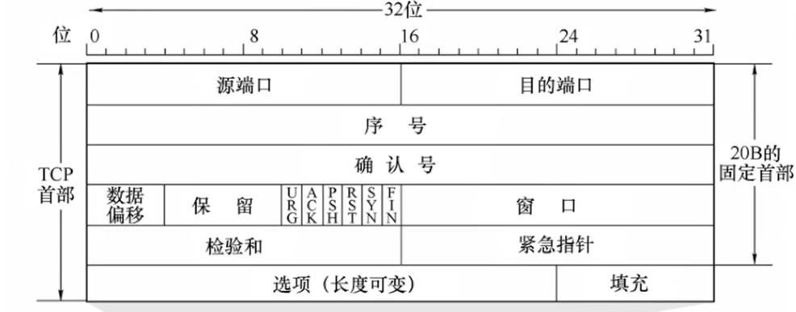
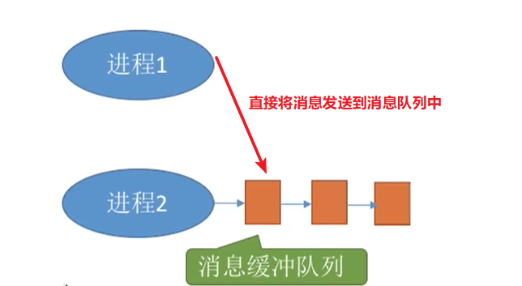

# 计算机基础部分

## 计算机网络

### 应用层

应用层是对应用程序的通信提供服务的

**应用层协议定义**

+ 应用进程交换的报文类型，请求 or 响应
+ 各种报文类型的语法，如报文中的各个字段及其详细描述
+ 字段的语义，即包含在字段中的信息的含义
+ 进程何时，如何发送报文，以及对报文进行响应的规则

**应用层的功能**

+ 文件传输、访问和管理
+ 电子邮件
+ 虚拟终端
+ 查询服务和远程作业登录

应用对传输层协议的一些要求：

| 应用       | 数据丢失率 | 吞吐                                   | 时间敏感度  |
| ---------- | ---------- | -------------------------------------- | ----------- |
| 文件传输   | 不能丢失   | 弹性                                   | 不高        |
| 邮件       | 不能丢失   | 弹性                                   | 不高        |
| 实时音视频 | 容忍丢失   | 音频：5kpbs-1Mbps  视频：0kbps - 5Mbps | 敏感        |
| 交互时游戏 | 容忍丢失   | 10kpbs左右                             | 敏感 ms级别 |
| 即时讯息   | 不能丢失   | 弹性                                   | 不高        |

### 网络应用模型

**客户端 --- 服务器模型**

服务器：提供计算服务的设备

+ 永久性提供服务
+ 永久性访问地址或者域名

客户端：请求计算服务的主机

+ 与服务器通信，使用服务器提供的服务
+ 间歇性接入网络
+ 可能使用动态IP地址
+ 不与其他客户机直接通信

应用：Web基本上都是这样的，文件传输FTP，远程登录，电子邮件

这种模型的可扩展性比较差

**P2P模型**

不存在永远在线的服务器

每个主机既可以提供服务，也可以请求服务

任意端系统 / 结点之间可以直接通讯

每一个结点的IP地址不固定

可扩展性比较好，网络健壮性强（高可用）

### DNS系统

**域名**

+ www.baidu.com
+ www.google.com
+ ...

形式：xxx.xxx.xxx由英文字符（不区分大小写）、`"."`分隔符以及`"-"`（在每个分隔符之间构成一部分的名称比如www.xx-xx.com）

为便于记忆，每个分隔符之间的字符长度不超过12个字符

以百度的域名为例：域名从左向右等级逐渐增高

+ www：三级域名
+ baidu：二级域名
+ com：顶级域名

其实还有一个根，域名完整的写法应该是：`www.baidu.com.`最后那一个点就是根

**顶级域名**

+ 国家级顶级域名：`cn, us, uk`等
+ 通用顶级域名：`com, net, org, gov`等
+ 基础结构域名：`arpa`

**二级域名**

+ 类别域名：`ac, com, edu, gov, net, org`等
+ 行政区域名：`bj, js`
+ 用户自定义注册域名：根据用户注册时自定义的域名比如baidu、google等

可以看到二级域名与顶级域名有部分重复的，这取决于注册时选择的域名，像百度com就是顶级域名，如果是像：`www.baidu.com.cn`这样最后带国家级域名的，com就成了二级域名

**三级域名 / 四级域名**

一般常见的三级 / 四级域名有www、mail、ftp等

像：`www.pku.edu.cn`就会有四级域名

`mail.pku.edu.cn`等

网站域名的书写就是由低级域名向高级域名写的

**域名服务器**

本地域名服务器：原本本地域名服务器是不属于整体的域名服务器体系的，但对域名解析非常重要

+ 当一个主机发出DNS查询请求时，这个查询请求报文就会发给本地域名服务器
+ 本地域名服务器距离主机一般不会超过几个路由器的距离

根域名服务器：当本地域名服务器没有缓存域名的ip地址时，会首先向根域名服务器发送查询ip的请求

+ 根域名服务器知道所有顶级域名的IP地址
+ 根域名服务器保存有13不同ip的顶级域名，每个顶级域名拥有多台顶级域名服务器

顶级域名服务器：管理该顶级域名服务器注册的所有二级域名

权限域名服务器：负责一个区的域名服务器

**域名解析过程**

递归查询

`本地域名服务器 ---> 根域名服务器 ---> 顶级域名服务器 ---> 权限域名服务器`

返回是从权限域名服务器逆序返回

其实就是遍历域名服务器树的一个过程，本地请求根，根再请求顶级域名服务器一层层下去

迭代查询

由本地服务器发送查询请求到根域名服务器

如果根域名服务器无法解析全部域名，根域名会告诉本地域名服务器去查询哪个顶级域名服务器

全程都是由本地域名服务器亲自查询的

两种查询的实例：

### 万维网

万维网www是一个大规模、联机式的信息储藏所 / 资料空间，是无数个网络站点和网页的集合

由统一资源定位符URL唯一地标识一个万维网中的资源

> URL：<协议>://<主机ip>:<端口>/<路径>

用户通过点击超链接获取资源，这些资源通过超文本传输协议HTTP传送给使用者

万维网以客户 / 服务器方式工作，用户使用的浏览器就是万维网客户程序，万维网文档所驻留的主机运行服务器程序

万维网使用超文本标记语言HTML，使得万维网页面设计者可以很方便地从一个界面的链接转到另一个界面

### HTTP协议

http协议的工作过程

当在浏览器的地址栏输入URL或者点击超链接时

+ 浏览器首先分析URL，并向DNS服务器请求解析ip地址
+ DNS收到请求后处理并返回解析出的IP地址
+ 浏览器与服务器建立TCP连接，并向服务器发送取文件的请求
+ 服务器处理并响应浏览器的请求
+ 数据传输完毕之后释放TCP连接
+ 浏览器解析显示页面

HTTP是无状态的协议，指的是第二次发送http请求获得的结果与第一次发送http请求的结果相同，并且过程也是相同的

但在实际环境中，通常都需要识别用户，所以会有Cookie

Cookie是存储在用户主机中的文本文件，记录一段时间内用户的访问记录

HTTP协议以TCP协议作为运输层协议，但HTTP本身是无连接的

> http1.0与http1.1之间的区别：
>
> + http1.0是非持久连接，即：每请求一个资源就需要建立一次连接
>   + Http客户端在80端口发起请求
>   + 服务器在80端口等待连接，接收并通知客户端
>   + Http客户端发送http请求报文，服务器接收请求报文并解析内容
>   + **http关闭TCP连接**
> + http1.1是持久连接，即服务器处理完请求给客户端响应之后并不关闭TCP连接
>   + 客户端之后的请求和服务器之后的响应使用第一次建立的TCP连接
>   + 非流水方式的持久http：客户端在接收到一个响应后才能再次发出下一次响应
>   + 流水方式的持久http：客户端能够一次性发送多个请求
>
> 往返时间RTT（round-trip-time）：一个小的报文分组从客户端到服务器，再回到客户端的时间
>
> 响应时间：一个RTT用来发起TCP连接；一个RTT用来HTTP请求并等待HTTP响应

### TCP协议

**TCP协议的特点**

+ TCP是面向连接（虚连接）的传输层协议
+ 每一条TCP连接只能有两个端点
+ TCP提供可靠交付服务无差错，不丢失，不重复，按序到达
+ TCP提供全双工通信，通信双方都设有发送缓存和接收缓存
+ TCP面向字节流的，TCP把应用程序转发下来的数据看成是一连串的无结构的字节流

**TCP报文**

**TCP连接管理**

TCP连接建立的三个阶段：

+ 建立连接（三次握手）
+ 数据传输
+ 连接释放（四次挥手）

TCP连接的建立采用**客户端服务器的方式**，主动发起连接建立的应用进程称为客户端，而被动等待连接建立的应用进程叫服务器

**TCP可靠传输**

可靠：保证接收方进程从缓存区读出的字节流与发送方发出的字节流完全一样，不出错，不重复，不失序

TCP可靠传输的保证：校验、序号机制、确认机制、重传机制

+ 序号机制：给每个报文分配一个序号，这个序号机制可以解决报文重复和报文乱序问题
+ 确认机制：发送方发送的每一个报文，接收方都得给一个确认
+ 重传机制：如果发送方没有收到报文的ACK确认，则重发报文

发送方：

+ 在报文分组中加入序号，0或者1（停止等待协议），一次只发送一个未经确认的分组，等待收到确认之后才会发送下一个分组
+ 需要检测接收方发送过来的ACK / NACK是否出错

接收方：

+ 检测收到的报文是否出错 / 重复
+ 如果报文正确，则发送ACK确认，如果报文出错则发送NAK

## 操作系统

### 进程的定义

**多道程序技术**

内存中同时放入多道程序，各个程序的代码、运算数据存放的位置不同，操作系统为每个运行的程序配置一个数据结构，称为进程控制块（PCB），用来描述进程的各种信息（比如代码存放的位置）

为了方便操作系统管理，完成各程序并发执行的任务，引入了进程、进程实体的概念

**进程**

程序段、数据段、PCB三部分组成了进程实体（进程映像），一般情况下进程实体就简称为进程

例如：

+ 创建进程是创建进程实体中的PCB
+ 撤销进程实质上是撤销实体中的PCB

从不同的角度来看进程有不同的定义：

+ 进程是程序的一次执行过程
+ 进程是一个程序及其数据在处理机上顺序执行时所发生的活动
+ 进程具有独立功能的程序在数据集合上运行的过程
+ **进程是系统进行资源分配和调度的基本单位**

> 综合来说，进程的定义可以概括为：是系统资源分配和调度的一个独立单位

### 进程通信

进程通信就是进程之间的信息交换

进程是系统分配资源的单位（包括内存空间），因此各个进程拥有的内存空间相互独立

**共享存储**

操作系统在内存空间中开辟一个共享空间，每个进程都能访问这个共享空间

但每个进程对共享空间的访问必须是互斥的，互斥操作的实现由操作系统提供（PV操纵）

由共享存储来实现进程间通信分为两种方式：

+ 基于数据结构的共享：在共享空间中只能存放一个固定的数据结构（通常是长度固定的数组），每次通信时，发出的信息不能超过数组的长度，这种方式通信速度慢，限制多，是一种低级通信方式
+ 基于存储区的共享：在内存中划分出一块共享存储区，通信的数据形式、数据的存放位置都由进程控制，这种通信方式效率比较高

**管道通信**

管道（Pipe）是用于连接读写进程的一个共享文件，就是在内存中开辟的一个大小固定的缓冲区

管道通信的特点：

+ 管道只能采用半双工通信，即在某一个时间段内只能实现单向的传输
  + 如果要实现双向同时通信，可以设置两个管道
+ 各个进程互斥地访问管道
+ 数据以字符流的形式写入管道，当管道写满时，写进程将会被阻塞，等待读进程将数据取走
  + 当读进程将数据全部取走之后，管道变空，此时读进程将会被阻塞，等待写进程写入
+ 如果管道内没有写满，就不允许读进程去读；如果在读管道内数据，没有将数据读完，就不允许向管道内写数据
+ 数据一旦被读出，就从管道中被抛弃，如果想要精确通信，读进程只能有有一个

**消息通信**

进程间的数据交换以格式化的消息（message）为单位，进程通过操作系统提供的发送（send）和接收（receive）原语进程数据交换

消息是一种数据结构，又分为消息头和消息体

+ 消息头：由发送进程的id，接收进程的id，消息类型，消息长度等格式化的信息组成

+ 消息体：消息体就是要进行传输的数据

消息传递也分为两种方式：

+ 直接通信方式，进程1发送消息到进程2的消息缓冲队列中

  

+ 间接通信方式，进程首先将消息发送到一个中间缓冲区中，通常称为信箱，因此也称为信箱通信方式，不同于管道通信，信箱允许多个进程同时访问

  

### 线程的概念

进程概括地来说是程序的一次执行，比如说QQ，但实际生活中，我们能在同一时间使用QQ进行视频聊天，文字聊天和文件传输，如果在使用进程去运行这个QQ程序，显然是做不到这样的，因为同一个进程中的程序只能顺序执行

为此，引入了线程的概念，线程可以简单地理解为轻量级进程

在引入了线程之后，进程就不再作为CPU调度的基本单位，而是只作为系统资源分配的基本单位

线程代替进程成为了CPU基本的执行单元，在引入线程之后，不仅进程之间可以并发执行，进程内的各个线程之间也能够并发执行

传统的进程间并发，需要切换进程的运行环境，系统开销很大

线程间并发，如果是同一进程内的线程切换，不需要切换进程环境，系统开销比较小，所以，引入线程之后，并发所带来的系统开销也会减小

**线程的特点**

+ 线程是处理机调度的基本单位
+ 各个线程可以占用不同的CPU核心
+ 每个线程都拥有自己的线程ID和线程控制块
+ 线程也有就绪，阻塞，运行这三种基本状态
+ 线程只拥有栈，寄存器等这些程序运行最基本的资源
+ 同一个进程内的各个线程可以共享进程内的资源
+ 同一个进程内的线程通信不需要操作系统的干预

**线程的分类**

用户级线程

+ 用户级线程由应用程序通过线程库实现
+ 所有的线程管理工作都由应用程序负责
+ 用户级线程的切换可以在用户态下完成，不需要系统的干预
+ 用户级线程就是从用户角度能够看到的线程

内核级线程

+ 内核级线程的管理工作由操作系统内核完成
+ 线程调度、切换等工作都由内核负责，因此内核级线程的切换必然需要在核心态下才能完成
+ 内核级线程就是从操作系统内核视角能看到的线程
+ **内核级线程才是处理及调度的单位**

> 有的操作系统只支持用户级线程，有的操作系统只支持内核级线程，有的都支持，在同时支持两种线程的操作系统中，采用两者相互映射的方式，将n各用户级线程映射到m个内核级线程中去（n >= m）
>
> 

### 多线程模型

在同时支持用户级线程和内核级线程的系统中，几个用户级线程映射到几个内核级线程的问题就引出了多线程模型：

**多对一模型**

多个用户级线程映射到一个内核级线程中去

+ 优点：由于用户级线程的切换在用户空间即可完成，不需要切换到核心态，线程管理的系统开销小
+ 缺点：由于只有一个内核级线程，当一个用户级线程被阻塞的时候，内核级线程也会被阻塞，其余的用户及线程也就不能相互切换，并发度比较低

**一对一模型**

一个用户级线程映射到一个内核级线程中去

+ 优点：并发度很高，一个用户级线程被阻塞之后，不会影响其他用户级线程的执行
+ 缺点：线程之间的切换需要将系统从用户态切换到内核态，开销比较大

上面两种取折中就是多对多模型

### 内核态和用户态

操作系统的内核态用于保存操作系统的内核代码，包括核心函数和一些基本信息

用户态是用户能够使用的一些部分，内核态和用户态相互隔离（由硬件实现）

内核态可以访问任何数据，用户态不能访问内核的数据

用户态调用内核函数称为系统调用
