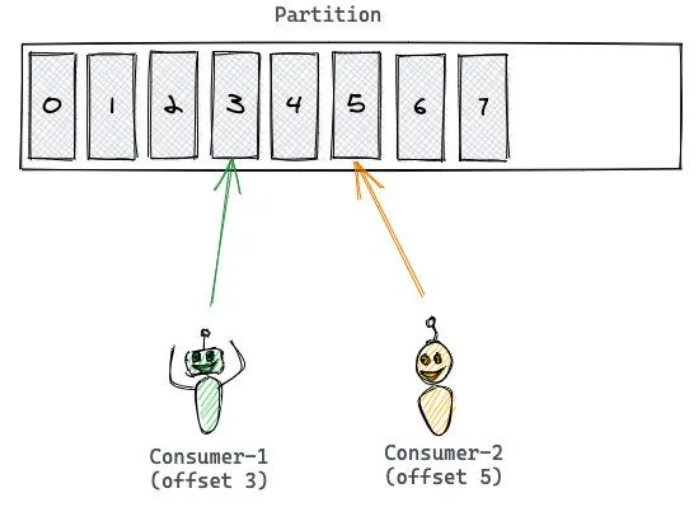
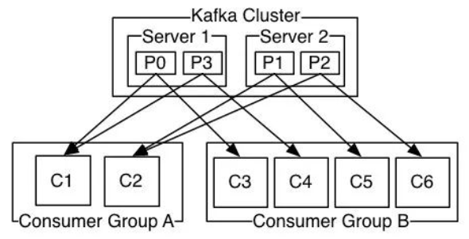

# Kafka

## 一、Kafka简介

### 1.1 基本介绍

Apache Kafka是一个分布式流平台(a distributed streaming platform)，具有三个关键能力：

1. 发布和订阅记录流，在此方面，类似于一个消息队列或企业消息系统
2. 持久化收到的记录流，从而具有容错能力
3. 处理收到的记录流

通常kafka被应用于两大类情况：

1. 建立实时流数据管道从而能够可靠地在系统或应用程序之间的共享数据
2. 构建实时流应用程序，能够变换或者对数据进行相应的处理

Kafka可以作为一个分布式的发布-订阅消息传递系统，并且是一个健壮的队列，可以处理大量数据，并使您能够将消息从一个端点传递到另一个端点。Kafka适用于离线和在线消息消费。Kafka消息将保留在磁盘上，并在群集内复制以防止数据丢失。Kafka建立在ZooKeeper同步服务之上。它与Apache Storm和Spark集成得很好，可以进行实时流数据分析

### 1.2 特点

+ 高吞吐量：可以满足每秒百万级别消息的生产和消费

+ 持久性：有一套完善的消息存储机制，确保数据高效、安全且持久化

  > kafka通过O(1)的磁盘数据结构提供消息的持久化，这种结构对于即使数以TB的消息存储也能够保持长时间的稳定性能

+ 分布式：基于分布式的扩展；Kafka的数据都会复制到几台服务器上，当某台故障失效时，生产者和消费者转而使用其它的Kafka broker

+ 可扩展性：kafka消息传递系统能够轻松扩展，而无需停机

### 1.3 使用场景

1. **实时数据流处理：**Kafka可以作为数据流处理的中间件，用于接收和传输大量的实时数据。它可以接收来自不同数据源的数据，并将其传输到不同的数据处理系统，如Apache Storm、Apache Flink等。通过使用Kafka，可以实现高吞吐量和低延迟的实时数据处理。

2. **日志收集与分析：**Kafka可以用于集中式的日志收集和分析。许多应用程序和系统会生成大量的日志数据，使用Kafka可以将这些日志数据集中存储，并提供给日志分析工具进行实时或离线的分析。通过将日志数据发送到Kafka主题中，可以实现高效的日志收集和处理。

3. **消息队列：**Kafka最常见的应用场景就是作为消息队列使用。它可以用于解耦应用程序的不同组件，实现异步通信。生产者将消息发送到Kafka的主题中，消费者从主题中订阅消息并进行处理。Kafka提供了高吞吐量和可靠性的消息传递机制，使得应用程序能够以高效的方式进行消息传递和处理。

4. **流式处理：**Kafka可以与流式处理框架结合使用，如Apache Samza、Apache Spark Streaming等。通过将数据流发送到Kafka主题中，流式处理框架可以实时地处理和分析数据。这种架构可以实现高可扩展性和容错性，适用于需要实时处理大规模数据的场景。

5. **数据备份与复制：**Kafka提供了数据备份和复制的机制，可以将数据复制到多个Kafka集群中，以实现数据的高可用性和容错性。这对于需要保证数据的可靠性和持久性的应用场景非常重要，如分布式数据库、分布式文件系统等。

### 1.4 基本结构


**producer**：生产者，消息的生产者，将消息发送给kafka broker

**broker**：kafka实例，一个kafka实例称为一个broker，一般搭建的kafka集群会包含多个broker

**topic**：消息的主题，即消息的分类，kafka中的消息以主题为单位进行分类，生产者负责将消息发送到指定的主题中；消费者根据订阅的消息主题进行消息消费；topic是逻辑上的概念

**partition**：topic的分区，每个topic可以有多个分区，即队列，真正存储消息的位置；每个topic至少有一个partition；每一个topic下的partition可以分布在不同的broker上，以此保证消息的持久性；partition中的数据是有序的，不同partition间的数据丢失了数据的顺序，如果topic有多个partition，消费数据时就不能保证数据的顺序性，在严格要求消费顺序的情况下应将partition的数量设置为1

**replication**：每一个分区都有多个副本，用于消息数据备份

+ **leader**: 每个partition会有多个副本，其中有且仅有一个作为leader，leader是当前负责数据读写的partition
+ **follower**: follower只负责与leader进行数据同步，所有写请求都通过Leader路由，数据变更会广播给所有Follower，Follower与Leader保持数据同步

**message**：消息

**consumer**：消费者，消息的出口

> **partition上的消息存储**
>
> 每一个topic下的分区都是顺序的消息队列，可持续追加；partition是最小的存储单元，每一个partition都是一个单独的log文件，每条记录都以末尾追加的方式写入
>
> 
>
> partition中的每一条记录都会被分配一个唯一的序号，称为offset偏移量，offset是一个递增的，不可变的数字，由kafka自动维护，当一条新的消息写入partition时，它就被追加到当前分区的log末尾。并被分配一个序号作为当前消息的offset
>
> 
>
> kafka将一个topic下的多个partition分布在多个broker中，这样会有多个好处：
>
> + 如果把topic的所有partition都放在一个broker上，那么这个topic的可扩展性就大大降低了，会受限于当前broker的IO能力，把partition分散开之后，topic就可以水平扩展
> + 一个topic可以被多个Consumer并行消费，如果Topic的所有partition都在一个broker上，那么支持的Consumer数量就有限

消息写入kafka的流程：


kafka的消息分发策略：

+ 1、 使用partition key将消息写入特定的partition中，partition key会传递给一个hash函数，由计算结果决定写入哪个partition。
+ 2、 如果没有指定partition key，kafka就会使用轮询的方式决定将消息写入哪一个partition。
+ 3、 kafka支持自定义消息分发规则，一个partition可以使用自己的分区指定规则。

> **partition消息读取**
>
> kafka不会向consumer推送消息，消费者必须自己从订阅的topic下的partition拉取消息；消息的offset就是consumer的游标，根据offset来记录消息的消费情况
>
> 
>
> 读完一条消息之后，Consumer 会推进到 Partition 中的下一个 Offset，继续读取消息。Offset 的推进和记录都是 Consumer 的责任，Kafka是不管的
>
> Kafka 中有一个 Consumer Group（消费组）的概念，多个 Consumer 组团去消费一个 Topic。同组的 Consumer 有相同的 Group ID。Consumer Group 机制会保障一条消息只被组内唯一一个 Consumer 消费，不会重复消费。消费组这种方式可以让多个 Partition 并行消费，大大提高了消息的消费能力，最大并行度为Topic的Partition数量
>
> 

## 二、Kafka的安装和部署

### 2.1 zookeeper

kafka依赖于zookeeper来保存集群的元数据，在进行kafka的安装时，需要先行安装zookeeper

官网：https://downloads.apache.org/zookeeper/

```
#解压安装包
tar -zxvf apache-zookeeper-3.5.7-bin.tar.gz     
#更改配置文件名称
cd ./apache-zookeeper-3.5.7-bin/conf
cp zoo_sample.cfg ./zoo.cfg
#启动服务
sh zkServer.sh start
#查看启动状态
sh ./zkServer.sh status
```

### 2.2 安装kafka

官网：http://kafka.apache.org/downloads

```
#解压安装包
tar -zxvf kafka_2.12-2.3.0.tgz
#如果需要集群，可以进行配置
vim server.porperties

#########
#1. 配置broker.id
#2. 配置listener
listeners=PLAINTEXT://本机ip:9092
#3. 配置zookeeper链接地址
zookeeper.connect=ip:port

#启动kafka
sh kafka-server-start.sh -daemon ../config/server.properties
```

## 三、Springboot集成kafka

### 3.1 引入maven

```xml
<!--引入kafka依赖-->
<dependency>
    <groupId>org.springframework.kafka</groupId>
    <artifactId>spring-kafka</artifactId>
</dependency>
```

### 3.2 编写yml配置文件

```yaml
spring:
  application:
    name: kafka-springboot-demo
  kafka:
    #kafka集群地址
    bootstrap-servers: ip:port,ip:port
    #生产者配置
    producer:
      #生产者在消息发送异常时重新发送的次数，默认为0，即发送消息发送失败即抛出异常
      retries: 0
      #kafka在发送消息时，需要等待多少个副本确认消息是否发送成功，默认为1，即只需要有一个副本确认消息发送成功即可
      acks: 1
      #生产者消息缓冲消息数量，批量发送消息的大小
      batch-size: 16384
      #生产者缓冲区大小
      buffer-memory: 33554432
      #消息提交时延，当生产端累积的消息达到batch-size或接收到消息linger.ms之后，生产者就会将消息提交给kafka
      properties:
        linger: 0
      #消息key和value的序列化器
      key-serializer: org.apache.kafka.common.serialization.StringSerializer
      value-serializer: org.apache.kafka.common.serialization.StringSerializer
    #消费者配置
    consumer:
      #消费组id
      group-id: kafka-springboot-test-01
      #消费者是否自动提交offset
      enable-auto-commit: true
      #自动提交offset的时间延迟，接收到消息后多久提交offset
      auto-commit-interval: 100
      #kafka中没有初始offset或offset超出范围时将自动重置offset
      # earliest:当各分区下有已提交的offset时，从提交的offset开始消费；无提交的offset时，从头开始消费
      # latest:当各分区下有已提交的offset时，从提交的offset开始消费；无提交的offset时，消费新产生的该分区下的数据
      # none:topic各分区都存在已提交的offset时，从offset后开始消费；只要有一个分区不存在已提交的offset，则抛出异常
      auto-offset-reset: latest
      #消费者的序列化器
      key-deserializer: org.apache.kafka.common.serialization.StringDeserializer
      value-deserializer: org.apache.kafka.common.serialization.StringDeserializer
```

### 3.3 生产者

**消息实体类**

```java
@Data
public class User implements Serializable {

    private String name;

    private Integer age;

    private List<String> hobby;

}
```

**生产者代码**

```java
@RestController
public class KafkaProducer {

    //使用KafkaTemplate发送消息
    @Resource
    private KafkaTemplate<String, Object> kafkaTemplate;

    @PostMapping("/kafka/send/message")
    public String sendMessage(@RequestBody User user) {
        //使用fastjson2转换为string后向kafka发送消息
        String userString = JSON.toJSONString(user);
        kafkaTemplate.send("test-kafka-springboot", userString);
        return "message send successfully";
    }
}
```

**带回调的生产者**

kafkaTemplate提供了一个回调方法addCallback，可以在回调方法中监控消息是否发送成功或失败时做补偿处理，有两种写法

```java
@Resource
private KafkaTemplate<String, Object> kafkaTemplate;

public void sendMessage2(String callbackMessage) {
  kafkaTemplate.send("topic1", callbackMessage).addCallback(success -> {
      // 消息发送到的topic
      String topic = success.getRecordMetadata().topic();
      // 消息发送到的分区
      int partition = success.getRecordMetadata().partition();
      // 消息在分区内的offset
      long offset = success.getRecordMetadata().offset();
      System.out.println("发送消息成功:" + topic + "-" + partition + "-" + offset);
  }, failure -> {
      System.out.println("发送消息失败:" + failure.getMessage());
  });
}
```

```java
@Resource
private KafkaTemplate<String, Object> kafkaTemplate;

public void sendMessage3(String callbackMessage) {
  kafkaTemplate.send("topic1", callbackMessage).addCallback(new ListenableFutureCallback<SendResult<String, Object>>() {
      @Override
      public void onFailure(Throwable ex) {
          System.out.println("发送消息失败："+ex.getMessage());
      }

      @Override
      public void onSuccess(SendResult<String, Object> result) {
          System.out.println("发送消息成功：" + result.getRecordMetadata().topic() + "-"
                  + result.getRecordMetadata().partition() + "-" + result.getRecordMetadata().offset());
      }
  });
}
```

### 3.4 消费者

```java
@Slf4j
public class KafkaConsumer {

    //通过注解监听kafka指定主题
    @KafkaListener(topics = {"test-kafka-springboot"})
    public User consumer(ConsumerRecord<String, String> record) {
        String userString = record.value();
        log.info("user string: {}", userString);
        //将收到的消息转换为实体类
        User user = JSON.parseObject(userString, User.class);
        log.info("get message: {},from topic: {}, partition: {}", userString, record.topic(), record.partition());
        return user;
    }

}
```

**@KafkaListener参数**

+ id: 消费者id
+ groupId: 消费组id
+ topics: 监听的topic名称，可以监听多个topic
+ topicPartitions: 更详细的监听信息，可指定topic、partition、offset监听；与topics不能同时出现

### 3.5 分区策略

kafka中每个topic被划分为多个分区，那么生产者将消息发送到topic时，具体追加到哪个分区呢？这就是所谓的分区策略，Kafka 为我们提供了默认的分区策略，同时它也支持自定义分区策略

路由机制遵循：

+ 若发送消息时指定了分区（即自定义分区策略），则直接将消息append到指定分区；
+ 若发送消息时未指定 patition，但指定了 key（kafka允许为每条消息设置一个key），则对key值进行hash计算，根据计算结果路由到指定分区，这种情况下可以保证同一个 Key 的所有消息都进入到相同的分区；
+ patition 和 key 都未指定，则使用kafka默认的分区策略，轮询选出一个 patition；

**自定义分区策略**

```java
public class CustomizePartitioner implements Partitioner {
  @Override
  public int partition(String topic, Object key, byte[] keyBytes, Object value, byte[] valueBytes, Cluster cluster) {
      // 自定义分区规则(这里假设全部发到0号分区)
      // ......
      return 0;
  }

  @Override
  public void close() {

  }

  @Override
  public void configure(Map<String, ?> configs) {

  }
}
```

在application.yml中也需要添加配置，指定自定义分区处理器

```yaml
spring: 
  kafka:
    producer: 
      properties:
        partitioner:
          class: 分区处理器全类名
```

### 3.6 消息异常处理器

消息异常处理器可以处理consumer在处理消息异常时的场景，消息异常处理器：ConsumerAwareListenerErrorHandler

需要新建一个ConsumerAwareListenerErrorHandler类型的异常处理方法，放到@KafkaListener注解的errorHandler参数中

```java
@Configuration
public class KafkaInitialConfiguration {
 
    //异常处理器
    @Bean
    public ConsumerAwareListenerErrorHandler myConsumerAwareErrorHandler() {
        return new ConsumerAwareListenerErrorHandler() {
            /**
            * message: 处理异常消息的元数据
            * exception: 异常信息
            * consumer: 消费者信息
            */
            @Override
            public Object handleError(Message<?> message, ListenerExecutionFailedException exception,
                                      Consumer<?, ?> consumer) {
                System.out.println("--- 发生消费异常 ---");
                System.out.println(message.getPayload());
                System.out.println(exception);
                return null;
            }
        };
    }
}
```

消息异常处理器的使用

```java
@Component
public class KafkaConsumer {
    // 消费监听
    @KafkaListener(topics = {"topic3"}, errorHandler = "myConsumerAwareErrorHandler")
    public void listen1(String data) throws Exception {
        throw new Exception("模拟一个异常");
    }
}
```

### 3.7 消息过滤器

消息过滤器可以在消息抵达consumer之前被拦截，在实际应用中，可以根据自己的业务逻辑，筛选出需要的信息再交由KafkaListener处理，不需要的消息则过滤掉

配置消息过滤只需要为监听器工厂配置一个RecordFilterStrategy（消息过滤策略），返回true的时候消息将会被抛弃，返回false时，消息能正常抵达监听容器

```java
@Component
public class KafkaConsumer {
    @Autowired
    ConsumerFactory consumerFactory;

    // 消息过滤器
    @Bean
    public ConcurrentKafkaListenerContainerFactory filterContainerFactory() {
        ConcurrentKafkaListenerContainerFactory factory = new ConcurrentKafkaListenerContainerFactory();
        factory.setConsumerFactory(consumerFactory);
        // 被过滤的消息将被丢弃
        factory.setAckDiscarded(true);
        // 消息过滤策略
        factory.setRecordFilterStrategy(consumerRecord -> {
            if (Integer.parseInt(consumerRecord.value().toString()) % 2 == 0) {
                return false;
            }
            //返回true消息则被过滤
            return true;
        });
        return factory;
    }

    // 消息过滤监听
    @KafkaListener(topics = {"topic1"},containerFactory = "filterContainerFactory")
    public void onMessage6(ConsumerRecord<?, ?> record) {
        System.out.println(record.value());
    }
}
```

