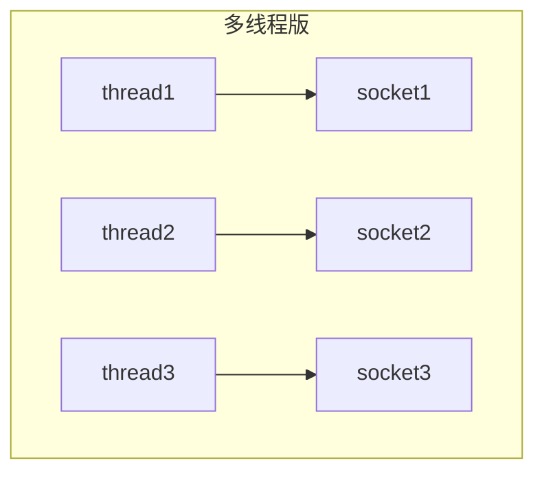
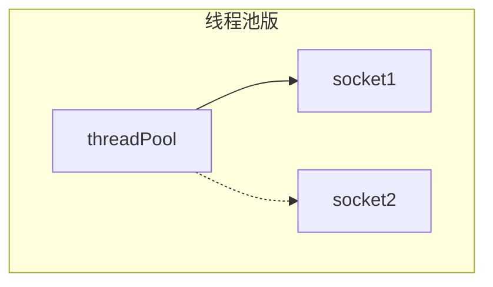
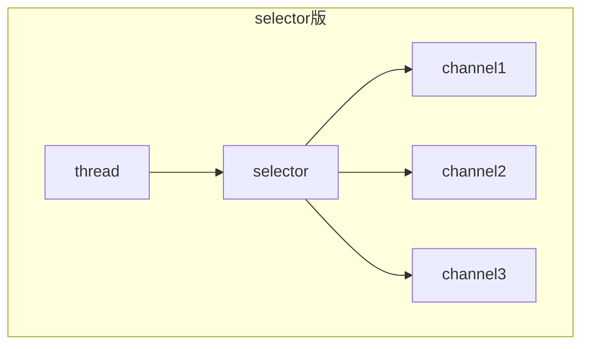
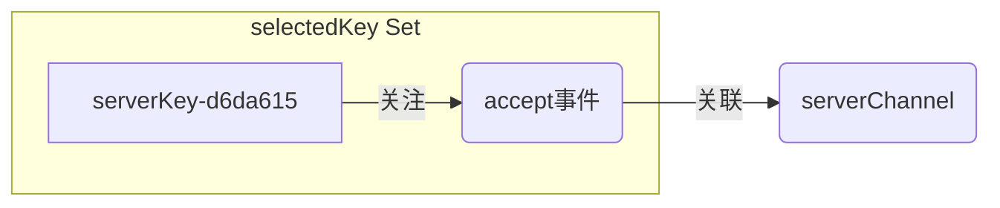
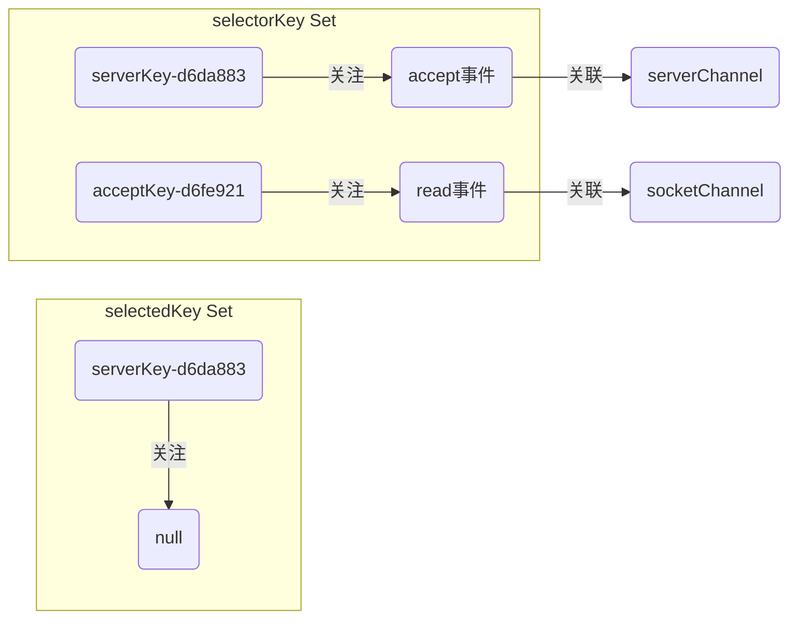
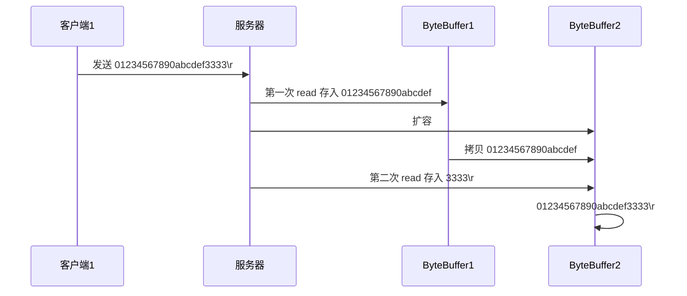
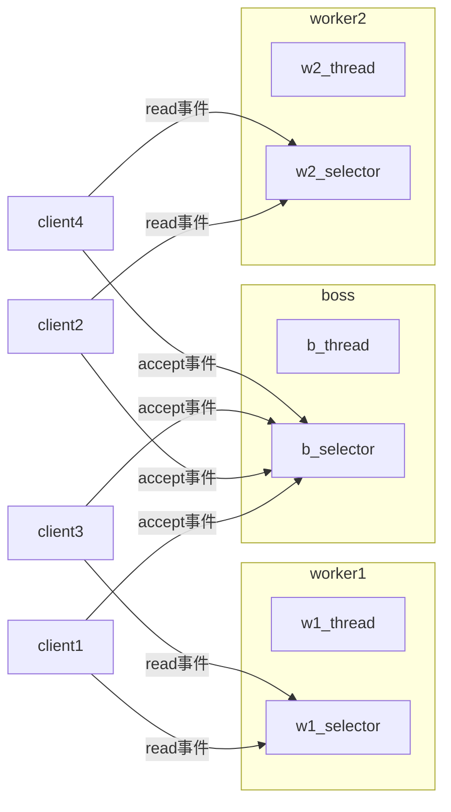
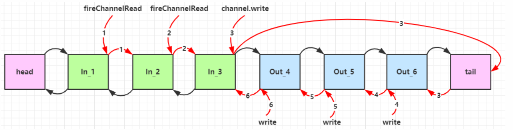
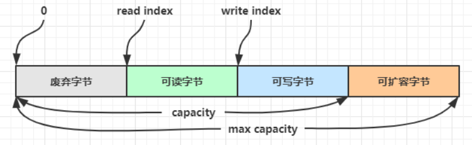
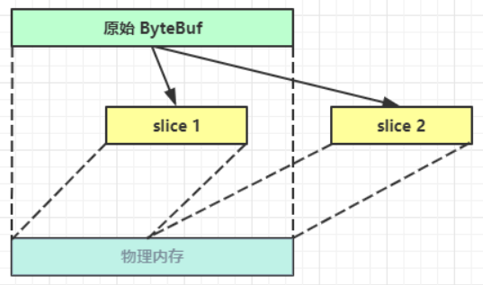

# Netty

## 一、NIO基础

NIO：`non - blocking io` 非阻塞IO

###  1.1 三大组件

#### 1.1.1 Channel & Buffer

Channel有一点类似于stream（流），它就是读写数据的**双向通道**，可以从Channel将数据读入到Buffer，也可以将Buffer的数据写入Channel中，而Java中的stream，要么只能输入，要么只能输出，Channel比stream更为底层

常见的channel有：

+ FileChannel
+ DatagramChannel
+ SocketChannel
+ ServerSocketChannel

Buffer则是用来缓冲读写数据，常见的Buffer有

+ ByteBuffer
  + MappedByteBuffer
  + DirectByteBuffer
  + HeapByteBuffer
+ ShortBuffer
+ IntBuffer
+ LongBuffer
+ ...

#### 1.1.2 Selector

从字面意思上来看，Selector是选择器，可以结合服务器的设计演化来理解

**多线程版**



一个客户端连接单独创建一个线程去处理

缺点：

+ 内存占用高，当连接数增多，操作系统创建的线程数也增多，每个线程本身创建的时候就需要占用内存
+ 线程上下文切换成本高，线程数增多，那么发生线程上下文切换的次数就会增多，线程上下文切换的代价较大，会影响整体服务器的性能
+ 只适合连接数较少的场景

**线程池版**



缺点：

+ 阻塞模式下，线程只能处理一个socket连接，也就是当一个socket连接建立时，线程池分配一个线程去处理，这个线程在socket连接断开之前都不能再处理其他连接
+ 所以线程池版的服务器设计仅仅适合短连接的场景（只一个连接建立之后，处理的比较快，处理完成之后，线程立刻去处理另外一个连接）

**selector版**



selector的作用就是配合一个线程来管理多个通道，获取通道上发生的事件，如果某个通道有一个读写请求，就发送给selector，selector再通知线程去处理这个通道的请求

这些selector工作再非阻塞模式下，不会让线程吊死在一个channel上，适合连接数特别多，但流量（请求不频繁）的场景

### 1.2 ByteBuffer

#### 1.2.1 ByteBuffer的使用

读取一个文件，data.txt，内容为123456789PPQQSS

```java
//FileChannel
//1. 可以使用输入输出流
//2. 也可以使用RandomAccessFile
FileChannel channel = null;
try {
    //获取channel
    channel = new FileInputStream("data.txt").getChannel();
    //准备缓冲区，allocate()方法分配缓冲区的大小
    ByteBuffer buffer = ByteBuffer.allocate(10);
    //从channel中读取数据，并写入buffer
    channel.read(buffer);
    //打印buffer的内容
    buffer.flip();  //切换buffer为读模式
    //检查buffer中是否含有剩余的数据
    while (buffer.hasRemaining()) {
        //无参的get默认一个字节一个字节读取
        byte b = buffer.get();
        log.debug("{}", (char) b);
    }

} catch (IOException e) {
    e.printStackTrace();
} finally {
    try {
        if (channel != null) {
            channel.close();
        }
    } catch (IOException e) {
        e.printStackTrace();
    }
}
输出：可以看到只输出了前十个字符，这是因为初始设置缓冲区大小时，就是十个
21:08:01.980 [main] DEBUG com.java.netty.demo01.nettybasic.NettyTest1 - 1
21:08:01.984 [main] DEBUG com.java.netty.demo01.nettybasic.NettyTest1 - 2
21:08:01.984 [main] DEBUG com.java.netty.demo01.nettybasic.NettyTest1 - 3
21:08:01.984 [main] DEBUG com.java.netty.demo01.nettybasic.NettyTest1 - 4
21:08:01.984 [main] DEBUG com.java.netty.demo01.nettybasic.NettyTest1 - 5
21:08:01.984 [main] DEBUG com.java.netty.demo01.nettybasic.NettyTest1 - 6
21:08:01.984 [main] DEBUG com.java.netty.demo01.nettybasic.NettyTest1 - 7
21:08:01.984 [main] DEBUG com.java.netty.demo01.nettybasic.NettyTest1 - 8
21:08:01.984 [main] DEBUG com.java.netty.demo01.nettybasic.NettyTest1 - 9
21:08:01.984 [main] DEBUG com.java.netty.demo01.nettybasic.NettyTest1 - P
```

上面也看到了，如果文件比较大，不好指定缓冲区的大小，可以使用循环的方式来读取，与使用输入输出流读取文件内容时类似

```java
FileChannel channel = null;
try {
    //获取channel
    channel = new FileInputStream("data.txt").getChannel();
    //准备缓冲区，allocate()方法分配缓冲区的大小
    ByteBuffer buffer = ByteBuffer.allocate(10);
    //从channel中读取数据，并写入buffer
    while (true) {
        //read()方法返回-1表示缓冲区已经被读取完成
        int read = channel.read(buffer);
        if(read == -1) {
            break;
        }
        //打印buffer的内容
        buffer.flip();  //切换buffer为读模式
        //检查buffer中是否含有剩余的数据
        while (buffer.hasRemaining()) {
            //无参的get默认一个字节一个字节读取
            byte b = buffer.get();
            log.debug("{}", (char) b);
        }
        buffer.clear(); //每次读取完成之后将buffer切换为写模式
    }

} catch (IOException e) {
    e.printStackTrace();
} finally {
    try {
        if (channel != null) {
            channel.close();
        }
    } catch (IOException e) {
        e.printStackTrace();
    }
}
输出：
21:12:32.267 [main] DEBUG com.java.netty.demo01.nettybasic.NettyTest1 - 1
21:12:32.274 [main] DEBUG com.java.netty.demo01.nettybasic.NettyTest1 - 2
21:12:32.275 [main] DEBUG com.java.netty.demo01.nettybasic.NettyTest1 - 3
21:12:32.275 [main] DEBUG com.java.netty.demo01.nettybasic.NettyTest1 - 4
21:12:32.275 [main] DEBUG com.java.netty.demo01.nettybasic.NettyTest1 - 5
21:12:32.275 [main] DEBUG com.java.netty.demo01.nettybasic.NettyTest1 - 6
21:12:32.275 [main] DEBUG com.java.netty.demo01.nettybasic.NettyTest1 - 7
21:12:32.275 [main] DEBUG com.java.netty.demo01.nettybasic.NettyTest1 - 8
21:12:32.275 [main] DEBUG com.java.netty.demo01.nettybasic.NettyTest1 - 9
21:12:32.275 [main] DEBUG com.java.netty.demo01.nettybasic.NettyTest1 - P
21:12:32.275 [main] DEBUG com.java.netty.demo01.nettybasic.NettyTest1 - P
21:12:32.275 [main] DEBUG com.java.netty.demo01.nettybasic.NettyTest1 - Q
21:12:32.275 [main] DEBUG com.java.netty.demo01.nettybasic.NettyTest1 - Q
21:12:32.275 [main] DEBUG com.java.netty.demo01.nettybasic.NettyTest1 - S
21:12:32.275 [main] DEBUG com.java.netty.demo01.nettybasic.NettyTest1 - S
```

将上面的例子总结一下，得出ByteBuffer的正确使用步骤：

+ （1）创建bytebuffer，并向里面写入数据`ByteBuffer buffer = ByteBuffer.allocate(int capacity);`
  + 当创建完bytebuffer之后，bytebuffer是空的，并且只能往里面写入数据
  + 可以使用多种方式读取，在上面的示例中是使用`channel.read(buffer)`从channel中读取
+ （2）当buffer中有数据，或者buffer已满时，可以调用`flip()`方法将buffer切换为读模式
  + 在向buffer中写入数据时，buffer是写模式，调用`flip()`方法之后切换为读模式，才能进行读操作
+ （3）从buffer中读取数据，比如调用`buffer.get()`方法
+ （4）调用`clear()`或者`compact()`方法再次将buffer切换为写模式
+ （5）重复（1） ~（4）读取文件或者其他内容

#### 1.2.2 ByteBuffer的内部结构

ByteBuffer有以下的几个属性

+ capacity：buffer的容量
+ position：buffer的写入位置（读写指针）
+ limit：代表buffer的读写限制

一开始，当bytebuffer刚创建出来时，position指向起始位置，写入限制也等于buffer分配的容量


在写模式下，写入一个位置，position就往后移一个位置


如果这时想要切换为读模式，可以调用`flip()`方法，这时，position会指向读取的起始位置，limit会指向读取的结束位置


在读状态下，读一个字节，就将position往后移动一位，直到读到limit指针为止


如果想要继续写，就调用`clear()`方法，将position指针再次指向起始位置（因为之前的数据已经读完了，没有用处，所以要写的话仍然从起始位置开始写）limit仍然指向capacity


如果之前的数据没有读完，那么就调用`compact()`方法，它会将之前没有读取完的数据整理到buffer的前几个位置，然后position指向它们之后第一个空的位置


#### 1.2.3 ByteBuffer的常见方法

**分配空间**：

+ 分配的空间是固定的，一开始分配多少就是多少，如果后续的使用中超过了这个容量，就会报错

```java
//其中一种分配方法，得到的是java.nio.HeapByteBuffer使用的是java虚拟机内的堆内存，读写效率较低，会受到GC的影响
ByteBuffer buffer = ByteBuffer.allocate(10);
//还有一种分配的方法，得到的是java.nio.DirectByteBuffer使用的系统内存，读写效率高，不会收到GC的影响，但分配效率较低
ByteBuffer buffer = ByteBuffer.allocateDirect(10);
```

**写入数据**：

+ 调用Channel的read方法，将channel中的数据写入buffer中
+ 调用buffer自己的put方法

```java
int read = channel.read(buffer);
buffer.put((byte) 0x61);
```

**读取数据**：

+ 调用channel的write方法，读取buffer中的数据向channel中写
+ 调用buffer自己的get方法

```java
int write = channel.write(buffer);
buffer.get();
```

> get方法会让position读指针向后移动一位，如果想重复读取数据：
>
> + 可以调用rewind方法，将position重新置为0
> + 或者调用get(int i)方法获取索引i的内容，它并不会移动读指针

**mark和reset**

mark方法是在读取的过程中，给某个位置做一个标记，即使position位置改变，之后调用reset方法会将position重新拿到mark标记的位置

`注意：rewind和flip方法都会清除mark标记`

```java
ByteBuffer buffer = ByteBuffer.allocate(10);
buffer.put((byte) 0x61);
buffer.put(new byte[]{0x62, 0x63, 0x64});
buffer.flip();

System.out.println((char)buffer.get());
System.out.println((char)buffer.get());
buffer.mark();
System.out.println((char)buffer.get());
System.out.println((char)buffer.get());
debugAll(buffer);
buffer.reset();
debugAll(buffer);
System.out.println((char)buffer.get());
System.out.println((char)buffer.get());

输出：第二次调用debugAll方法的时候，可以看到position的位置重新回到了2下标的位置
20:20:24.514 [main] DEBUG io.netty.util.internal.logging.InternalLoggerFactory - Using SLF4J as the default logging framework
+--------+-------------------- all ------------------------+----------------+
position: [4], limit: [4]
         +-------------------------------------------------+
         |  0  1  2  3  4  5  6  7  8  9  a  b  c  d  e  f |
+--------+-------------------------------------------------+----------------+
|00000000| 61 62 63 64 00 00 00 00 00 00                   |abcd......      |
+--------+-------------------------------------------------+----------------+
+--------+-------------------- all ------------------------+----------------+
position: [2], limit: [4]
         +-------------------------------------------------+
         |  0  1  2  3  4  5  6  7  8  9  a  b  c  d  e  f |
+--------+-------------------------------------------------+----------------+
|00000000| 61 62 63 64 00 00 00 00 00 00                   |abcd......      |
+--------+-------------------------------------------------+----------------+
c
d
```

**字符串与ByteBuffer之间的相互转换**

```java
//1. 使用buffer的put方法
ByteBuffer buffer1 = ByteBuffer.allocate(16);
buffer1.put("hello".getBytes());
debugAll(buffer1);

//2. 使用Charset中的encode方法
ByteBuffer buffer2 = StandardCharsets.UTF_8.encode("hello");
debugAll(buffer2);

//3. 使用ByteBuffer自带的wrap方法
ByteBuffer buffer3 = ByteBuffer.wrap("hello".getBytes());
debugAll(buffer3);

输出：注意position的位置，后面两种方式都将buffer自动切换到了读模式，第一种方式没有，仍然是写模式
+--------+-------------------- all ------------------------+----------------+
position: [5], limit: [16]
         +-------------------------------------------------+
         |  0  1  2  3  4  5  6  7  8  9  a  b  c  d  e  f |
+--------+-------------------------------------------------+----------------+
|00000000| 68 65 6c 6c 6f 00 00 00 00 00 00 00 00 00 00 00 |hello...........|
+--------+-------------------------------------------------+----------------+
+--------+-------------------- all ------------------------+----------------+
position: [0], limit: [5]
         +-------------------------------------------------+
         |  0  1  2  3  4  5  6  7  8  9  a  b  c  d  e  f |
+--------+-------------------------------------------------+----------------+
|00000000| 68 65 6c 6c 6f                                  |hello           |
+--------+-------------------------------------------------+----------------+
+--------+-------------------- all ------------------------+----------------+
position: [0], limit: [5]
         +-------------------------------------------------+
         |  0  1  2  3  4  5  6  7  8  9  a  b  c  d  e  f |
+--------+-------------------------------------------------+----------------+
|00000000| 68 65 6c 6c 6f                                  |hello           |
+--------+-------------------------------------------------+----------------+

```

+ 使用第一种方式时，在转换完成之后ByteBuffer仍然是写模式，如果想要还原为字符串，需要先调用`buffer1.flip()`方法
+ 第二、三种方式的效果相同，在转换完成之后会自动切换为读模式

```java
//切换回String，调用Charset的decode方法
String str1 = StandardCharsets.UTF_8.decode(buffer2).toString();
System.out.println(str1);
```

#### 1.2.4 分散读和组合写

因为不怎么常用，直接上代码：

```java
//Scattering Reads: 适用于事先知道文件中待读取的各个部分的长度，分散读
try (FileChannel channel = new RandomAccessFile("D:\\Java_idea\\JavaNetty\\demo01\\src\\words.txt", "r").getChannel()) {
    ByteBuffer b1 = ByteBuffer.allocate(3);
    ByteBuffer b2 = ByteBuffer.allocate(3);
    ByteBuffer b3 = ByteBuffer.allocate(5);
    channel.read(new ByteBuffer[] {b1,b2,b3});
    b1.flip();
    b2.flip();
    b3.flip();
    debugAll(b1);
    debugAll(b2);
    debugAll(b3);
} catch (IOException e) {
}
输出：
+--------+-------------------- all ------------------------+----------------+
position: [0], limit: [3]
         +-------------------------------------------------+
         |  0  1  2  3  4  5  6  7  8  9  a  b  c  d  e  f |
+--------+-------------------------------------------------+----------------+
|00000000| 6f 6e 65                                        |one             |
+--------+-------------------------------------------------+----------------+
+--------+-------------------- all ------------------------+----------------+
position: [0], limit: [3]
         +-------------------------------------------------+
         |  0  1  2  3  4  5  6  7  8  9  a  b  c  d  e  f |
+--------+-------------------------------------------------+----------------+
|00000000| 74 77 6f                                        |two             |
+--------+-------------------------------------------------+----------------+
+--------+-------------------- all ------------------------+----------------+
position: [0], limit: [5]
         +-------------------------------------------------+
         |  0  1  2  3  4  5  6  7  8  9  a  b  c  d  e  f |
+--------+-------------------------------------------------+----------------+
|00000000| 74 68 72 65 65                                  |three           |
+--------+-------------------------------------------------+----------------+
```

```java
//Gathering Writes：组合写
ByteBuffer b1 = StandardCharsets.UTF_8.encode("hello");
    ByteBuffer b2 = StandardCharsets.UTF_8.encode("world");
    ByteBuffer b3 = StandardCharsets.UTF_8.encode("你好");
    try (FileChannel channel = new RandomAccessFile("D:\\Java_idea\\JavaNetty\\demo01\\src\\words2.txt", "rw").getChannel()) {
        channel.write(new ByteBuffer[] {b1,b2,b3});
    } catch (IOException e) {
    }
}
输出文件：
helloworld你好
```

#### 1.2.5 黏包和半包

问题引出：网络上有多条数据发送给服务端，数据之间使用 \n 进行分隔
但由于某种原因这些数据在接收时，被进行了重新组合，例如原始数据有3条为

* Hello,world\n
* I'm zhangsan\n
* How are you?\n

变成了下面的两个 byteBuffer (黏包，半包)

* Hello,world\nI'm zhangsan\nHo
* w are you?\n

> 黏包现象就是两条分开的消息由于一次性传输与接收的原因被融合在了一起
>
> 半包现象就是由于客户端或者服务器的缓存区不足，一条消息被分割成了两部分

问题解决：

```java
//实现split方法分离接收的信息
private static void split(ByteBuffer source) {
    //读模式
    source.flip();
    for (int i = 0; i < source.limit(); i++) {
        //计算一条消息的长度，i表示信息的末尾，position读指针指向信息的头，相当于end - start + 1
        int length = i - source.position() + 1;
        //寻找一条消息与下一条消息的分隔符
        if (source.get(i) == '\n') {
            ByteBuffer target = ByteBuffer.allocate(length);
            //向缓冲区中写入数据
            for (int j = 0; j < length; j++) {
                target.put(source.get());
            }
            debugAll(target);
        }
    }
    //注意这里需要使用compact方法，因为上一次读取的信息很可能有半包现象的遗留，下次写的时候需要从上次未读部分写起
    source.compact();
}

ByteBuffer source = ByteBuffer.allocate(32);
source.put("Hello,World\nI'm zhangsan\nHo".getBytes());
split(source);
source.put("w are you?\n".getBytes());
split(source);

输出：能够正确读到每一条信息
+--------+-------------------- all ------------------------+----------------+
position: [12], limit: [12]
         +-------------------------------------------------+
         |  0  1  2  3  4  5  6  7  8  9  a  b  c  d  e  f |
+--------+-------------------------------------------------+----------------+
|00000000| 48 65 6c 6c 6f 2c 57 6f 72 6c 64 0a             |Hello,World.    |
+--------+-------------------------------------------------+----------------+
+--------+-------------------- all ------------------------+----------------+
position: [13], limit: [13]
         +-------------------------------------------------+
         |  0  1  2  3  4  5  6  7  8  9  a  b  c  d  e  f |
+--------+-------------------------------------------------+----------------+
|00000000| 49 27 6d 20 7a 68 61 6e 67 73 61 6e 0a          |I'm zhangsan.   |
+--------+-------------------------------------------------+----------------+
+--------+-------------------- all ------------------------+----------------+
position: [13], limit: [13]
         +-------------------------------------------------+
         |  0  1  2  3  4  5  6  7  8  9  a  b  c  d  e  f |
+--------+-------------------------------------------------+----------------+
|00000000| 48 6f 77 20 61 72 65 20 79 6f 75 3f 0a          |How are you?.   |
+--------+-------------------------------------------------+----------------+
```

### 1.3 文件编程

#### 1.3.1 FileChannel

FileChannel**只能工作在阻塞模式下**


**获取**

不能直接打开 FileChannel，必须通过 FileInputStream、FileOutputStream 或者 RandomAccessFile 来获取 FileChannel，它们都有 getChannel 方法

* 通过 FileInputStream 获取的 channel 只能读
* 通过 FileOutputStream 获取的 channel 只能写
* 通过 RandomAccessFile 是否能读写根据构造 RandomAccessFile 时的读写模式决定（"r"，"w"，"rw"）

**数据读取**

会从 channel 读取数据填充 ByteBuffer，返回值表示读到了多少字节，-1 表示到达了文件的末尾

```java
int readBytes = channel.read(buffer);    //数据流向： channel --> buffer
```

**数据写入**

从buffer中读取数据，写入channel

```java
ByteBuffer buffer = ...;
buffer.put(...); // 存入数据
buffer.flip();   // 切换读模式

while(buffer.hasRemaining()) {
    channel.write(buffer);
}
```

> 在 while 中调用 channel.write 是因为 write 方法并不能保证一次将 buffer 中的内容全部写入 channel
>
> 操作系统出于性能的考虑，会将数据缓存，不是立刻写入磁盘。可以调用 force(true)  方法将文件内容和元数据（文件的权限等信息）立刻写入磁盘

**指针位置**

获取当前位置：`long pos = channel.position();`

设置当前位置：`long newPos = ...; channel.pisotion(newPos);`

> 设置当前位置时，如果设置为文件的末尾
>
> * 这时读取会返回 -1 
> * 这时写入，会追加内容，但要注意如果 position 超过了文件末尾，再写入时在新内容和原末尾之间会有空洞（00）

**获取大小**

`channel.size()`获取文件大小

#### 1.3.2 数据传输

调用channel的`transferTo()`方法即可

```java
try (
        FileChannel from = new FileInputStream("D:\\Java_idea\\JavaNetty\\demo01\\src\\from.txt").getChannel();
        FileChannel to = new FileOutputStream("D:\\Java_idea\\JavaNetty\\demo01\\src\\to.txt").getChannel();
        ) {
    /* transferTo()的参数
    *  long position: 待穿数据在源文件的起始位置
    *  long count: 待传输数据的大小
    *  WritableByteChannel: 传输数据的目的地
    * */
    from.transferTo(0, from.size(), to);

} catch (IOException e) {
    e.printStackTrace();
}
```

使用transferTo方法的传输效率比较高，并且代码比较简洁

但上面的方法只适用于小数据的传输，当文件过大（通常是超过2g）时，可以分多次传输

```java
try (
        FileChannel from = new FileInputStream("D:\\Java_idea\\JavaNetty\\demo01\\src\\from.txt").getChannel();
        FileChannel to = new FileOutputStream("D:\\Java_idea\\JavaNetty\\demo01\\src\\to.txt").getChannel();
        ) {
    long size = from.size();
    long left = size;
    while(left > 0) {
        //transferTo方法有一个返回值，返回实际传输数据的大小
        log.debug("position: {}, left: {}", size - left, left);
        left -= from.transferTo((size - left), left, to);
    }

} catch (IOException e) {
    e.printStackTrace();
}
```

#### 1.3.3 Path和Paths

从jdk1.7开始引入了Path和Paths类

* Path 用来表示文件路径
* Paths 是工具类，用来获取 Path 实例

```java
Path source = Paths.get("1.txt"); // 相对路径 使用 user.dir 环境变量来定位 1.txt

Path source = Paths.get("d:\\1.txt"); // 绝对路径 代表了  d:\1.txt

Path source = Paths.get("d:/1.txt"); // 绝对路径 同样代表了  d:\1.txt

Path projects = Paths.get("d:\\data", "projects"); // 代表了  d:\data\projects
```

+ `.`表示当前目录
+ `..`表示上一级目录

比如目录路径：`d:/data/projects/`下有两个文件a和b

```java
Path path = Paths.get("d:\\data\\projects\\a\\..\\b");
System.out.println(path);
System.out.println(path.normalize()); // 正常化路径

输出：
d:\data\projects\a\..\b
d:\data\projects\b
```

#### 1.3.4 Files

检查文件是否存在

```java
Path path = Paths.get("helloword/data.txt");
System.out.println(Files.exists(path));   //返回true或false
```

创建一级目录

```java
Path path = Paths.get("helloword/d1");
Files.createDirectory(path);
```

* 如果目录已存在，会抛异常 FileAlreadyExistsException
* 不能一次创建多级目录，否则会抛异常 NoSuchFileException

创建多级目录用

```java
Path path = Paths.get("helloword/d1/d2");
Files.createDirectories(path);
```

拷贝文件

```java
Path source = Paths.get("helloword/data.txt");
Path target = Paths.get("helloword/target.txt");

Files.copy(source, target);
```

* 如果文件已存在，会抛异常 FileAlreadyExistsException

如果希望用 source 覆盖掉 target，需要用 StandardCopyOption 来控制

```java
Files.copy(source, target, StandardCopyOption.REPLACE_EXISTING);
```

移动文件

```java
Path source = Paths.get("helloword/data.txt");
Path target = Paths.get("helloword/data.txt");

Files.move(source, target, StandardCopyOption.ATOMIC_MOVE);
```

* StandardCopyOption.ATOMIC_MOVE 保证文件移动的原子性

删除文件

```java
Path target = Paths.get("helloword/target.txt");

Files.delete(target);
```

* 如果文件不存在，会抛异常 NoSuchFileException

删除目录

```java
Path target = Paths.get("helloword/d1");

Files.delete(target);
```

* 如果目录还有内容，会抛异常 DirectoryNotEmptyException


**常用API测试**

统计某个文件夹下目录和文件的个数

```java
//遍历某个文件夹，并统计这个文件夹下文件的个数和目录的个数
AtomicInteger dirCount = new AtomicInteger();
AtomicInteger fileCount = new AtomicInteger();
Files.walkFileTree(Paths.get("C:\\Program Files\\Java\\jdk1.8.0_74"), new SimpleFileVisitor<Path>() {
    //访问目录
    @Override
    public FileVisitResult preVisitDirectory(Path dir, BasicFileAttributes attrs) throws IOException {
        log.debug("dir: {}", dir);
        dirCount.incrementAndGet();
        return super.preVisitDirectory(dir, attrs);
    }

    //访问文件
    @Override
    public FileVisitResult visitFile(Path file, BasicFileAttributes attrs) throws IOException {
        log.debug("{}",file);
        fileCount.incrementAndGet();
        return super.visitFile(file, attrs);
    }
});
log.debug("fileCount: {}", fileCount);
log.debug("dirCount: {}", dirCount);

输出：
20:34:28.989 [main] DEBUG com.java.netty.demo01.nettybasic.NettyTest2 - fileCount: 1476
20:34:28.989 [main] DEBUG com.java.netty.demo01.nettybasic.NettyTest2 - dirCount: 133
```

统计java文件夹下jar包的个数

```java
//统计jar包的数量
AtomicInteger jarCount = new AtomicInteger();
Files.walkFileTree(Paths.get("C:\\Program Files\\Java\\jdk1.8.0_74"), new SimpleFileVisitor<Path>() {
    //访问文件
    @Override
    public FileVisitResult visitFile(Path file, BasicFileAttributes attrs) throws IOException {
        if (file.toString().endsWith(".jar")) {
            log.debug("{}",file);
            jarCount.incrementAndGet();
        }
        return super.visitFile(file, attrs);
    }
});
log.debug("jar: {}", jarCount);

输出：
20:35:34.122 [main] DEBUG com.java.netty.demo01.nettybasic.NettyTest2 - jar: 723
```

### 1.4 网络编程

#### 1.4.1 阻塞和非阻塞

先来看一个基本的CS架构的示例：

```java
//服务器端
public class Server {
    public static void main(String[] args) throws IOException {
        //使用nio阻塞模式编写服务器端的程序
        //0. 创建一个ByteBuffer接收数据
        ByteBuffer buffer = ByteBuffer.allocate(16);
        //1. 创建一个ServerSocketChannel作为服务器端
        ServerSocketChannel server = ServerSocketChannel.open();
        //2. 绑定一个端口，可以随意指定一个
        server.bind(new InetSocketAddress(8080));

        //3. 建立连接集合，用于处理多个客户端的连接
        List<SocketChannel> clients = new ArrayList<>();
        //接收连接
        while(true) {
            //4. 调用accept()方法建立与客户端的连接
            log.debug("connecting...");
            SocketChannel client = server.accept();
            log.debug("client {} has connected", client);
            //加入到连接集合中
            clients.add(client);
            //5. 接收客户端发送的数据
            for (SocketChannel socketChannel : clients) {
                socketChannel.read(buffer);
                buffer.flip();
                debugRead(buffer);
                //清空buffer，为下一次写做准备
                buffer.clear();
                log.debug("read end... {}", socketChannel);
            }
        }
    }
}

在刚启动服务器时，服务器端的输出：
19:27:18.616 [main] DEBUG com.java.netty.demo01.nettybasic.net.Server - connecting...
```

```java
//客户端
public class Client {
    public static void main(String[] args) throws IOException {
        SocketChannel client = SocketChannel.open();
        //连接服务器
        client.connect(new InetSocketAddress("localhost", 8080));
        log.debug("waiting...");          //#1
    }
}
```

先运行服务器端的main方法，再在客户端的`#1`语句处打一个断点，以调试的方式启动客户端

```
服务器端输出：表明有一个客户端连接到了服务器，客户端的socket为127.0.0.1:49173
19:27:18.616 [main] DEBUG com.java.netty.demo01.nettybasic.net.Server - connecting...
19:27:35.950 [main] DEBUG com.java.netty.demo01.nettybasic.net.Server - client java.nio.channels.SocketChannel[connected local=/127.0.0.1:8080 remote=/127.0.0.1:49173] has connected
```

+ 刚启动时，服务器端只输出connecting...，表明服务器端的代码执行到`SocketChannel client = server.accept();`处就阻塞了，所以，`accept()`是一个阻塞方法

+ 当有一个客户端连接到服务器时，被`accept()`方法接收，则服务器继续执行，一直到`socketChannel.read(buffer);`方法就再度阻塞，因为并没有打印之后buffer中的信息，以及read end...这句话，所以表明`read()`方法也是一个阻塞方法

+ 接下来，通过客户端的调试工具向服务器端发送信息，输入计算表达式：`client.write(StandardCharsets.UTF_8.encode("hello!"));`，点击计算之后，服务器端的输出：

  ```
  19:28:44.165 [main] DEBUG io.netty.util.internal.logging.InternalLoggerFactory - Using SLF4J as the default logging framework
  +--------+-------------------- read -----------------------+----------------+
  position: [0], limit: [6]
           +-------------------------------------------------+
           |  0  1  2  3  4  5  6  7  8  9  a  b  c  d  e  f |
  +--------+-------------------------------------------------+----------------+
  |00000000| 68 65 6c 6c 6f 21                               |hello!          |
  +--------+-------------------------------------------------+----------------+
  19:28:44.180 [main] DEBUG com.java.netty.demo01.nettybasic.net.Server - read end... java.nio.channels.SocketChannel[connected local=/127.0.0.1:8080 remote=/127.0.0.1:49173]
  19:28:44.180 [main] DEBUG com.java.netty.demo01.nettybasic.net.Server - connecting...
  ```

+ 由于收到了数据，`read()`方法得以继续执行，当数据处理完毕，跳出for循环，再次阻塞，进入等待连接的状态

**阻塞模式存在的问题**

现在，使用上面的正在调试的客户端再次发送数据，输入表达式：`client.write(StandardCharsets.UTF_8.encode("hi!"))`，可以发现，服务器端中并没有输出任何信息，依然阻塞在`SocketChannel client = server.accept();`这行代码上

> 原因：因为上面的信息仍然是同一个客户端发送的，没有其他客户端来连接，那么服务器会一直阻塞在`accept()`方法这里，直到下一个客户端连接发送过来之后才会接收到上一个客户端第二次发送的'hi!'消息，这就体现出了单线程阻塞模式的弊端，一次性只能处理一个事件，显得很笨重

再开启一个客户端的调试，可以发现服务器端接收到了之前客户端发送的消息：

```
输出：可以看到，新的客户端连接过来之后，服务器端才接收到之前客户端的信息，注意两个客户端的socket是不同的socket，端口号不同
19:28:44.180 [main] DEBUG com.java.netty.demo01.nettybasic.net.Server - connecting...
19:47:44.827 [main] DEBUG com.java.netty.demo01.nettybasic.net.Server - client java.nio.channels.SocketChannel[connected local=/127.0.0.1:8080 remote=/127.0.0.1:49719] has connected
+--------+-------------------- read -----------------------+----------------+
position: [0], limit: [3]
         +-------------------------------------------------+
         |  0  1  2  3  4  5  6  7  8  9  a  b  c  d  e  f |
+--------+-------------------------------------------------+----------------+
|00000000| 68 69 21                                        |hi!             |
+--------+-------------------------------------------------+----------------+
19:47:44.828 [main] DEBUG com.java.netty.demo01.nettybasic.net.Server - read end... java.nio.channels.SocketChannel[connected local=/127.0.0.1:8080 remote=/127.0.0.1:49173]
```

**将服务器端的阻塞模式改成非阻塞模式**

```java
//添加两行代码即可
public class Server {
    public static void main(String[] args) throws IOException {
        //使用nio非阻塞模式编写服务器端的程序
        //0. 创建一个ByteBuffer接收数据
        ByteBuffer buffer = ByteBuffer.allocate(16);
        //1. 创建一个ServerSocketChannel作为服务器端
        ServerSocketChannel server = ServerSocketChannel.open();
        //将服务器端改成非阻塞模式
        server.configureBlocking(false);                     //#1
        //2. 绑定一个端口，可以随意指定一个
        server.bind(new InetSocketAddress(8080));

        //3. 建立连接集合，用于处理多个客户端的连接
        List<SocketChannel> clients = new ArrayList<>();
        //接收连接
        while(true) {
            //4. 调用accept()方法建立与客户端的连接
            log.debug("connecting...");
            //如果将服务器端设置为非阻塞模式，那么accept方法不会阻塞线程，当没有客户端连接的时候，会返回null值并继续执行
            SocketChannel client = server.accept();
            //将客户端的连接也置为非阻塞模式
            client.configureBlocking(false);                 //#2
            log.debug("client {} has connected", client);
            //加入到连接集合中
            clients.add(client);
            //5. 接收客户端发送的数据
            for (SocketChannel socketChannel : clients) {
                //同样的，如果将客户端的连接也设置为非阻塞模式，那么read方法也不会阻塞，如果没有数据的时候read方法会返回0并继续向下执行
                socketChannel.read(buffer);    
                buffer.flip();
                debugRead(buffer);
                //清空buffer，为下一次写做准备
                buffer.clear();
                log.debug("read end... {}", socketChannel);
            }

        }
    }
}

就这样直接运行服务器端，输出：会这样不断循环
20:05:00.981 [main] DEBUG com.java.netty.demo01.nettybasic.net.Server - connecting...
20:05:00.981 [main] DEBUG com.java.netty.demo01.nettybasic.net.Server - client null has connected
20:05:00.981 [main] DEBUG com.java.netty.demo01.nettybasic.net.Server - connecting...
20:05:00.981 [main] DEBUG com.java.netty.demo01.nettybasic.net.Server - client null has connected
20:05:00.981 [main] DEBUG com.java.netty.demo01.nettybasic.net.Server - connecting...
20:05:00.981 [main] DEBUG com.java.netty.demo01.nettybasic.net.Server - client null has connected
20:05:00.981 [main] DEBUG com.java.netty.demo01.nettybasic.net.Server - connecting...
20:05:00.981 [main] DEBUG com.java.netty.demo01.nettybasic.net.Server - client null has connected
....
```

> 非阻塞模式的确可以正确处理多客户端的连接以及数据的处理，但非阻塞模式存在的问题：单线程对线程的损耗太大，只有一个线程不断执行，并且如果没有连接请求的时候，这个线程仍然在不断地执行`while(true)`这个循环，造成了CPU资源的浪费


**总结**：

阻塞模式

* 阻塞模式下，相关方法都会导致线程暂停
  * `ServerSocketChannel.accept` 会在没有连接建立时让线程暂停
  * `SocketChannel.read` 会在没有数据可读时让线程暂停
  * 阻塞的表现其实就是线程暂停了，暂停期间不会占用 cpu，但线程相当于闲置
* 单线程下，阻塞方法之间相互影响，几乎不能正常工作，需要多线程支持
* 但多线程下，有新的问题，体现在以下方面
  * 32 位 jvm 一个线程 320k，64 位 jvm 一个线程 1024k，如果连接数过多，必然导致 OOM，并且线程太多，反而会因为频繁上下文切换导致性能降低
  * 可以采用线程池技术来减少线程数和线程上下文切换，但治标不治本，如果有很多连接建立，但长时间 inactive，会阻塞线程池中所有线程，因此不适合长连接，只适合短连接

非阻塞模式

* 非阻塞模式下，相关方法都不会让线程暂停
  * 在 `ServerSocketChannel.accept` 在没有连接建立时，会返回 null，并继续向下运行
  * `SocketChannel.read` 在没有数据可读时，会返回 0，但线程不必阻塞，可以去执行其它 SocketChannel 的 read 或是去执行 `ServerSocketChannel.accept`
  * 写数据时，线程只是等待数据写入 Channel 即可，无需等 Channel 通过网络把数据发送出去
* 但非阻塞模式下，即使没有连接建立，和可读数据，线程仍然在不断运行，白白浪费了 cpu
* 数据复制过程中，线程实际还是阻塞的（AIO 改进的地方）

#### 1.4.2 Selector

Selector的优势：

+ 一个线程配合Selector就可以监控多个channel的事件，只有事件发生了，线程才去处理，否则就会阻塞，避免非阻塞模式下的线程空转情况
+ 让这个线程能够得到充分的利用
+ 减少线程上下文切换

**将上面非阻塞模式的服务器装换成Selector模式**

```java
public class Server {
    public static void main(String[] args) throws IOException {
        //添加selector解决非阻塞模式下的性能消耗问题

        //1. 创建selector，管理多个channel，这个demo下主要管理ServerSocketChannel和SocketChannel
        Selector selector = Selector.open();


        ByteBuffer buffer = ByteBuffer.allocate(16);
        ServerSocketChannel server = ServerSocketChannel.open();
        server.configureBlocking(false);

        //2. 建立selector和channel之间的联系（专有名称：注册）
        //register()方法会返回一个SelectionKey，这个SelectionKey就是将来事件发生后，通过找到这个selectionKey，就可以知道是哪个channel发生的事件
        SelectionKey serverKey = server.register(selector, 0, null);
        log.debug("register key: {}", serverKey);

        //指明这个key只关注accept事件，上面register方法中的第二个参数的含义就是这个，0默认表示不关注任何事件
        serverKey.interestOps(SelectionKey.OP_ACCEPT);
        server.bind(new InetSocketAddress(8080));

        while(true) {
            //3. 调用selector的select方法，select方法当没有事件发生的时候，会让线程阻塞；当有事件发生，select方法才会恢复线程运行
            selector.select();

            //4. 处理事件
            Iterator<SelectionKey> iterator = selector.selectedKeys().iterator();//selectedKeys方法拿到所有可用事件的集合，是一个Set集合
            while (iterator.hasNext()) {
                //拿到事件的key，拿着这个key去找到是哪个channel发生的事件
                SelectionKey key = iterator.next();
                log.debug("select key: {}", key);
                //通过key获得channel
                ServerSocketChannel channel = (ServerSocketChannel) key.channel();
                //去处理事件
                SocketChannel accept = channel.accept();
                log.debug("socket: {}", accept);
            }

        }
    }
}
```

> 通常，事件种类有四种：每一种事件在SelectionKey中都对应一个整数
>
> + `accept事件`：服务器处理的事件，会在有客户端连接时出发
> + `connect事件`：客户端事件，在连接建立之后触发
> + `read事件`：可读事件
> + `write事件`：可写事件

现在对selector模式下的服务器端进行测试：先启动服务器，再启动客户端

```
输出：可以看到server注册中获得的key与之后从触发事件之后获得的key是相同的，表明accept事件由server这个channel触发
20:41:41.535 [main] DEBUG com.java.netty.demo01.nettybasic.net.Server - register key: channel=sun.nio.ch.ServerSocketChannelImpl[unbound], selector=sun.nio.ch.WindowsSelectorImpl@d6da883, interestOps=0, readyOps=0
20:41:48.567 [main] DEBUG com.java.netty.demo01.nettybasic.net.Server - select key: channel=sun.nio.ch.ServerSocketChannelImpl[/0:0:0:0:0:0:0:0:8080], selector=sun.nio.ch.WindowsSelectorImpl@d6da883, interestOps=16, readyOps=16
20:41:48.567 [main] DEBUG com.java.netty.demo01.nettybasic.net.Server - socket: java.nio.channels.SocketChannel[connected local=/127.0.0.1:8080 remote=/127.0.0.1:50461]
```

> 需要注意的是：`selector.select()`方法在事件未处理的时候，是不会阻塞在这里的，而是一直循环，所以在编程的时候一定要注意，事件来了，必须处理，或者调用`key.cancel()`方法取消事件


#### 1.4.3 处理read事件

在上面的示例中，selector处理的是accept事件，下面，通过selector监听并处理客户端的读事件：

```java
public class Server {
    public static void main(String[] args) throws IOException {
        //使用selector处理客户端的读事件
        Selector selector = Selector.open();
        ServerSocketChannel server = ServerSocketChannel.open();
        server.configureBlocking(false);

        SelectionKey serverKey = server.register(selector, 0, null);    //#1
        log.debug("register key: {}", serverKey);

        serverKey.interestOps(SelectionKey.OP_ACCEPT);
        server.bind(new InetSocketAddress(8080));

        while(true) {
            selector.select();
            //4. 处理事件
            Iterator<SelectionKey> iterator = selector.selectedKeys().iterator();    //#2
            while (iterator.hasNext()) {
                SelectionKey key = iterator.next();
                log.debug("select key: {}", key);

                //5. 这边由于又添加了一个读事件的监听所以会出现多种事件类型，需要区分事件类型，分门别类地处理
                if (key.isAcceptable()) {
                    //如果是accept事件
                    //通过key获得发生事件的channel
                    ServerSocketChannel channel = (ServerSocketChannel) key.channel();
                    //去处理事件
                    SocketChannel accept = channel.accept();
                    //selector需要配合非阻塞模式使用，所以SocketChannel也需要工作在非阻塞模式下
                    accept.configureBlocking(false);
                    //注册SocketChannel accept的selectionKey
                    SelectionKey acceptKey = accept.register(selector, 0, null);           //#3
                    //关注读事件
                    acceptKey.interestOps(SelectionKey.OP_READ);
                    log.debug("socket: {}", accept);
                    log.debug("acceptKey: {}", acceptKey);
                } else if(key.isReadable()){
                    //如果是可读事件
                    //拿到触发事件的channel
                    SocketChannel channel = (SocketChannel) key.channel();
                    ByteBuffer buffer = ByteBuffer.allocate(16);
                    channel.read(buffer);
                    buffer.flip();
                    debugRead(buffer);
                }

            }
        }
    }
}

开启服务器，以调试模式运行客户端，并在调试工具中向服务器发送一条数据，输出结果：
17:00:49.427 [main] DEBUG com.java.netty.demo01.nettybasic.net.Server - register key: channel=sun.nio.ch.ServerSocketChannelImpl[unbound], selector=sun.nio.ch.WindowsSelectorImpl@d6da883, interestOps=0, readyOps=0
17:01:16.126 [main] DEBUG com.java.netty.demo01.nettybasic.net.Server - select key: channel=sun.nio.ch.ServerSocketChannelImpl[/0:0:0:0:0:0:0:0:8080], selector=sun.nio.ch.WindowsSelectorImpl@d6da883, interestOps=16, readyOps=16
17:01:16.127 [main] DEBUG com.java.netty.demo01.nettybasic.net.Server - socket: java.nio.channels.SocketChannel[connected local=/127.0.0.1:8080 remote=/127.0.0.1:61575]
17:01:16.127 [main] DEBUG com.java.netty.demo01.nettybasic.net.Server - acceptKey: channel=java.nio.channels.SocketChannel[connected local=/127.0.0.1:8080 remote=/127.0.0.1:61575], selector=sun.nio.ch.WindowsSelectorImpl@d6da883, interestOps=1, readyOps=0
17:01:51.930 [main] DEBUG com.java.netty.demo01.nettybasic.net.Server - select key: channel=sun.nio.ch.ServerSocketChannelImpl[/0:0:0:0:0:0:0:0:8080], selector=sun.nio.ch.WindowsSelectorImpl@d6da883, interestOps=16, readyOps=16
Exception in thread "main" java.lang.NullPointerException
	at com.java.netty.demo01.nettybasic.net.Server.main(Server.java:58)
```

**为什么服务器端会报错？**

这与selector的存储key的机制有关，在selector管理key的过程中，当程序执行到示例代码的`#1`处时，selector会创建一个存储key的集合，并且将新注册的key存入其中（key后面的一串数字是key在内存中的地址）


然后程序继续运行，当监听到有事件发生之后，在`selector.select();`代码之后，selector内部会再**新建**一个集合，就是在`#2`处通过`selector.selectedKeys()`获得的集合，这个集合中的key是从上面的selectorKey Set中复制过去的



> 这个`selectedKey Set`集合，只会在发生事件之后向这个集合中添加内容，**并不会从里面主动删除内容**

程序继续运行，注意`SelectionKey key = iterator.next();`执行这行代码的时候，是从这个`selectedKey Set`集合获取的内容并处理，处理完之后，会将`selectedKey Set`中key所关注的事件移除，**但并不会把key移除**，所以当处理完accept事件之后，两个集合中的内容是：



之后，程序会进入下一次的循环，在`selector.select();`处监听到客户端read事件，这时注意`SelectionKey key = iterator.next();`这行代码执行完，获得的key仍然是`serverKey-d6da883`，因为并没有将这个key从里面移除，所以到后面执行`accept.configureBlocking(false);`会报空指针已成，因为之前已经将accept事件处理完毕了，没有任何关联的socketChannel，解决方法就是在迭代处理事件之后，将key从集合中手动删除

> 其实从输出信息也能够看出来，在第二次进入循环处理事件的时候，获得的仍然是上一次accept事件遗留的key，因为两个key关注的事件是一样的
>
> 17:01:16.126 [main] interestOps=16, readyOps=16
>
> 17:01:51.930 [main] interestOps=16, readyOps=16

解决方法：在遍历的时候，边遍历，边把已经处理完的key删除

```java
Selector selector = Selector.open();
ServerSocketChannel server = ServerSocketChannel.open();
server.configureBlocking(false);

SelectionKey serverKey = server.register(selector, 0, null);
log.debug("register key: {}", serverKey);
serverKey.interestOps(SelectionKey.OP_ACCEPT);
server.bind(new InetSocketAddress(8080));

while(true) {
    selector.select();

    Iterator<SelectionKey> iterator = selector.selectedKeys().iterator();
    while (iterator.hasNext()) {     
        SelectionKey key = iterator.next();
//######################################这行代码很重要，将key从集合中删除#####################################
        iterator.remove();    
        log.debug("select key: {}", key);
        if (key.isAcceptable()) {
            ServerSocketChannel channel = (ServerSocketChannel) key.channel();
            SocketChannel accept = channel.accept();
            accept.configureBlocking(false);
            SelectionKey acceptKey = accept.register(selector, 0, null);
            acceptKey.interestOps(SelectionKey.OP_READ);
            log.debug("socket: {}", accept);
            log.debug("acceptKey: {}", acceptKey);
        } else if(key.isReadable()){
            SocketChannel channel = (SocketChannel) key.channel();
            ByteBuffer buffer = ByteBuffer.allocate(16);
            channel.read(buffer);
            buffer.flip();
            debugRead(buffer);

        }
    }
修改完成之后再次尝试：
17:39:06.423 [main] DEBUG com.java.netty.demo01.nettybasic.net.Server - register key: channel=sun.nio.ch.ServerSocketChannelImpl[unbound], selector=sun.nio.ch.WindowsSelectorImpl@d6da883, interestOps=0, readyOps=0
17:39:12.521 [main] DEBUG com.java.netty.demo01.nettybasic.net.Server - select key: channel=sun.nio.ch.ServerSocketChannelImpl[/0:0:0:0:0:0:0:0:8080], selector=sun.nio.ch.WindowsSelectorImpl@d6da883, interestOps=16, readyOps=16
17:39:12.521 [main] DEBUG com.java.netty.demo01.nettybasic.net.Server - socket: java.nio.channels.SocketChannel[connected local=/127.0.0.1:8080 remote=/127.0.0.1:61989]
17:39:12.521 [main] DEBUG com.java.netty.demo01.nettybasic.net.Server - acceptKey: channel=java.nio.channels.SocketChannel[connected local=/127.0.0.1:8080 remote=/127.0.0.1:61989], selector=sun.nio.ch.WindowsSelectorImpl@d6da883, interestOps=1, readyOps=0
17:39:31.429 [main] DEBUG com.java.netty.demo01.nettybasic.net.Server - select key: channel=java.nio.channels.SocketChannel[connected local=/127.0.0.1:8080 remote=/127.0.0.1:61989], selector=sun.nio.ch.WindowsSelectorImpl@d6da883, interestOps=1, readyOps=1
17:39:31.439 [main] DEBUG io.netty.util.internal.logging.InternalLoggerFactory - Using SLF4J as the default logging framework
+--------+-------------------- read -----------------------+----------------+
position: [0], limit: [6]
         +-------------------------------------------------+
         |  0  1  2  3  4  5  6  7  8  9  a  b  c  d  e  f |
+--------+-------------------------------------------------+----------------+
|00000000| 68 65 6c 6c 6f 21                               |hello!          |
+--------+-------------------------------------------------+----------------+
```

**服务器处理客户端断开事件**

再回看这段代码，现在如果客户端异常断开了，调试的演示就是直接关闭客户端程序，服务器会出现什么情况

```java
@Slf4j
public class Server {
    public static void main(String[] args) throws IOException {
        //selector处理客户端连接断开的情况
        Selector selector = Selector.open();
        ServerSocketChannel server = ServerSocketChannel.open();
        server.configureBlocking(false);

        SelectionKey serverKey = server.register(selector, 0, null);
        log.debug("register key: {}", serverKey);

        serverKey.interestOps(SelectionKey.OP_ACCEPT);
        server.bind(new InetSocketAddress(8080));

        while(true) {
            selector.select();

            Iterator<SelectionKey> iterator = selector.selectedKeys().iterator();//selectedKeys方法拿到所有可用事件的集合，是一个Set集合
            while (iterator.hasNext()) {
                SelectionKey key = iterator.next();
                iterator.remove();
                log.debug("select key: {}", key);

                if (key.isAcceptable()) {
                    ServerSocketChannel channel = (ServerSocketChannel) key.channel();
                    SocketChannel accept = channel.accept();
                    accept.configureBlocking(false);
                    SelectionKey acceptKey = accept.register(selector, 0, null);
                    acceptKey.interestOps(SelectionKey.OP_READ);
                    log.debug("socket: {}", accept);
                    log.debug("acceptKey: {}", acceptKey);
                } else if(key.isReadable()){
                   // try {
                        SocketChannel channel = (SocketChannel) key.channel();
                        ByteBuffer buffer = ByteBuffer.allocate(16);
                        channel.read(buffer);
                        buffer.flip();
                        debugRead(buffer);
                    //} catch (IOException e) {
                      //  e.printStackTrace();
                    //在这个地方取消读事件，保证当客户端异常退出时，服务器还能够正常运行
                      //  key.cancel();
                    //}

                }
            }
        }
    }
}

输出：服务器出现了一个异常，并异常停止了
...
16:50:07.756 [main] DEBUG com.java.netty.demo01.nettybasic.net.Server - socket: java.nio.channels.SocketChannel[connected local=/127.0.0.1:8080 remote=/127.0.0.1:62665]
16:50:07.756 [main] DEBUG com.java.netty.demo01.nettybasic.net.Server - acceptKey: channel=java.nio.channels.SocketChannel[connected local=/127.0.0.1:8080 remote=/127.0.0.1:62665], selector=sun.nio.ch.WindowsSelectorImpl@d6da883, interestOps=1, readyOps=0
16:50:13.302 [main] DEBUG com.java.netty.demo01.nettybasic.net.Server - select key: channel=java.nio.channels.SocketChannel[connected local=/127.0.0.1:8080 remote=/127.0.0.1:62665], selector=sun.nio.ch.WindowsSelectorImpl@d6da883, interestOps=1, readyOps=1
Exception in thread "main" java.io.IOException: 远程主机强迫关闭了一个现有的连接。
	at com.java.netty.demo01.nettybasic.net.Server.main(Server.java:54)    --- channel.read(buffer);
进程已结束，退出代码为 1
```

> **为什么会抛出异常呢？**
>
> 首先，客户端的断开会触发一个`读事件`，当监听到这个事件，服务器的程序会进入` else if(key.isReadable())`这个语句块，但实际上客户端并没有发送任何消息，那么在channel进行读取操作的时候，就会抛出IOException
>
> 可以使用`try - catch`块把处理读事件的代码包含起来，但这并不能解决问题，反而会出现服务器死循环的情况，即这个读事件并没有被处理，所以，正确的解决方法就是在catch块之后加上`key.cancel()`取消这个读事件

上面的代码能够解决客户端异常断开的情况，但却会引发客户端正常断开的问题，客户端正常断开就是在调试模式下，输入`client.close()`方法正常断开，可以看看服务器端的输出：

```
输出：服务器端又陷入了死循环
16:57:56.597 [main] DEBUG com.java.netty.demo01.nettybasic.net.Server - select key: channel=java.nio.channels.SocketChannel[connected local=/127.0.0.1:8080 remote=/127.0.0.1:62733], selector=sun.nio.ch.WindowsSelectorImpl@d6da883, interestOps=1, readyOps=1
+--------+-------------------- read -----------------------+----------------+
position: [0], limit: [0]

16:57:56.597 [main] DEBUG com.java.netty.demo01.nettybasic.net.Server - select key: channel=java.nio.channels.SocketChannel[connected local=/127.0.0.1:8080 remote=/127.0.0.1:62733], selector=sun.nio.ch.WindowsSelectorImpl@d6da883, interestOps=1, readyOps=1
+--------+-------------------- read -----------------------+----------------+
position: [0], limit: [0]

16:57:56.597 [main] DEBUG com.java.netty.demo01.nettybasic.net.Server - select key: channel=java.nio.channels.SocketChannel[connected local=/127.0.0.1:8080 remote=/127.0.0.1:62733], selector=sun.nio.ch.WindowsSelectorImpl@d6da883, interestOps=1, readyOps=1
+--------+-------------------- read -----------------------+----------------+
position: [0], limit: [0]

16:57:56.597 [main] DEBUG com.java.netty.demo01.nettybasic.net.Server - select key: channel=java.nio.channels.SocketChannel[connected local=/127.0.0.1:8080 remote=/127.0.0.1:62733], selector=sun.nio.ch.WindowsSelectorImpl@d6da883, interestOps=1, readyOps=1
+--------+-------------------- read -----------------------+----------------+
position: [0], limit: [0]
....
```

这是因为，客户端正常断开也会触发一个读事件，但这次的正常断开是不会进入catch语句块的，那就变成了这个事件又没被处理，但可以看到，read方法并没有读到任何数据，所以可以通过read方法的返回值来判断是一个正常的读事件还是由于客户端断开触发的读事件，如果是客户端正常断开，read方法返回值就是-1

```java
else if(key.isReadable()){
    try {
        SocketChannel channel = (SocketChannel) key.channel();
        ByteBuffer buffer = ByteBuffer.allocate(16);
        int read = channel.read(buffer);
        if(read == -1) {
            key.cancel();
        } else {
            buffer.flip();
            debugRead(buffer);
        }
    } catch (IOException e) {
        e.printStackTrace();
        key.cancel();
    }

}
```


**消息边界问题**

如果服务器端接收消息的缓冲区过小，就会发生消息边界的问题，使用调试工具令客户端发送消息`client.write(StanderdCharsets.UTF_8.encode("你好"))`

```java
else if(key.isReadable()){
                    try {
                        SocketChannel channel = (SocketChannel) key.channel();
                        //将buffer的容量调小
                        ByteBuffer buffer = ByteBuffer.allocate(4);
                        int read = channel.read(buffer);
                        if(read == -1) {
                            key.cancel();
                        } else {
                            buffer.flip();
                            //将接收到的消息直接转换为字符串后输出
                            log.debug("{}", StandardCharsets.UTF_8.decode(buffer));
                        }
                    } catch (IOException e) {
                        e.printStackTrace();
                        key.cancel();
                    }

                }
            }
输出： 接收到的信息出现了乱码
...
19:43:36.585 [main] DEBUG com.java.netty.demo01.nettybasic.net.Server - select key: channel=java.nio.channels.SocketChannel[connected local=/127.0.0.1:8080 remote=/127.0.0.1:51220], selector=sun.nio.ch.WindowsSelectorImpl@d6da883, interestOps=1, readyOps=1
19:43:36.586 [main] DEBUG com.java.netty.demo01.nettybasic.net.Server - 你�
19:43:36.586 [main] DEBUG com.java.netty.demo01.nettybasic.net.Server - select key: channel=java.nio.channels.SocketChannel[connected local=/127.0.0.1:8080 remote=/127.0.0.1:51220], selector=sun.nio.ch.WindowsSelectorImpl@d6da883, interestOps=1, readyOps=1
19:43:36.586 [main] DEBUG com.java.netty.demo01.nettybasic.net.Server - ��
```

> 原因：在UTF_8编码集下，一个中文字符由3个字节的编码标识，所以"你好"就由6个字节组成，但服务器端接收的buffer就只有4个字节，不能够一次性接收完成，所以需要分两次接收，第一次接收4个字节，将“你”字完全接收并接收“好”字的第一个字节，所以之后的“好”字在输出的过程中就出现了乱码

消息边界：


+ 第一种问题就是由于一条消息的长度过大，bytebuffer一次性容纳不下，这时候可以考虑将bytebuffer扩容
+ 第二种问题就是bytebuffer比一条消息稍大，但容纳不了两条消息，这时候就会出现半包的问题
+ 第三种问题就是bytebuffer太大，能够容纳两条消息，但容纳不下第三条数据，这就会出现黏包的问题

常见的解决问题的方式有：

+ 第一种，将bytebuffer扩容
+ 第二种，使用之前解决黏包半包问题的方式去解决，缺点就是效率太低
+ 第三种，使用特定的传输格式，通常在消息的头部标明消息的长度，然后，服务器再根据消息的长度动态分配bytebuffer
  + TLV 格式，即 Type 类型、Length 长度、Value 数据，类型和长度已知的情况下，就可以方便获取消息大小，分配合适的 buffer，缺点是 buffer 需要提前分配，如果内容过大，则影响 server 吞吐量
  + Http 1.1 是 TLV 格式
  * Http 2.0 是 LTV 格式（长度在前）

**使用split方法解决边界问题的缺点**

```java
else if(key.isReadable()){
    try {
        SocketChannel channel = (SocketChannel) key.channel();
        ByteBuffer buffer = ByteBuffer.allocate(16);
        int read = channel.read(buffer);
        if(read == -1) {
            key.cancel();
        } else {
            //这里就可以使用之前写过的split方法解决半包，黏包问题
            SplitSolve.split(buffer);
        }
    } catch (IOException e) {
        e.printStackTrace();
        key.cancel();
    }
}
//客户端发送消息
client.write(StandardCharsets.UTF_8.encode("0123456789abcdef333\n"));
输出：消息并没有接收完全，只接收到了最后的333部分
20:17:39.769 [main] DEBUG io.netty.util.internal.logging.InternalLoggerFactory - Using SLF4J as the default logging framework
+--------+-------------------- all ------------------------+----------------+
position: [4], limit: [4]
         +-------------------------------------------------+
         |  0  1  2  3  4  5  6  7  8  9  a  b  c  d  e  f |
+--------+-------------------------------------------------+----------------+
|00000000| 33 33 33 0a                                     |333.            |
+--------+-------------------------------------------------+----------------+
```

> 原因：由于客户端发送的消息长度已经超过了16个字节，也就是超过了一次性bytebuffer所能容纳的最大的消息长度，所以第一次接收的时候，bytebuffer接收的内容是0123456789abcdef，但并没有收到“/n”这个分隔符，所以此次的读事件并没有处理完，那么会进入下一次的循环，注意，bytebuffer是一个临时变量，所以每次循环都会创建一个新的bytebuffer，所以之前收到的消息就丢失了，只收到了333\n
>
> 所以，bytebuffer不能是一个局部变量，在多次读事件的时候，应该使用同一个bytebuffer，并且，当首次bytebuffer容量不够时，需要进行适当扩容，扩容是指新建一个较大的bytebuffer，并将全局bytebuffer中的内容拷贝到新建的bytebuffer中，大致的流程图如下



具体代码：

```java
else if(key.isReadable()){
    try {
        SocketChannel channel = (SocketChannel) key.channel();
        //通过key.attachment()方法获取每个key携带的附件
        ByteBuffer buffer = (ByteBuffer) key.attachment();
        int read = channel.read(buffer);
        if(read == -1) {
            key.cancel();
        } else {
            //这里就可以使用之前写过的split方法解决半包，黏包问题
            SplitSolve.split(buffer);
            //调用完split方法之后就需要判断一下buffer是否需要扩容，由于在split方法的最后调用了buffer.compact()方法
            //compact()方法会保留未读的部分，如果在一次读取中没有发现“\n”分隔符，那么未读的部分就是整个buffer串，调用
            //compact()方法之后，buffer的position指针就会指向维度部分，在这里就是buffer的末尾，所以可以通过position的位置判断buffer是否需要扩容
            if(buffer.position() == buffer.limit()) {
                //扩容为原来容量的两倍
                ByteBuffer newBuffer = ByteBuffer.allocate(buffer.capacity() * 2);
                buffer.flip();
                //将之前buffer的内容拷贝到新的buffer中
                newBuffer.put(buffer);
                //可以使用attach方法将key之前所关联的附件替换掉
                key.attach(newBuffer);
            }
        }
    } catch (IOException e) {
        e.printStackTrace();
        key.cancel();
    }

}

客户端仍然发送0123456789abcdef333\n，输出：此次服务器能够正确接收到消息，并且buffer的容量已经被扩容了
20:46:18.504 [main] DEBUG io.netty.util.internal.logging.InternalLoggerFactory - Using SLF4J as the default logging framework
+--------+-------------------- all ------------------------+----------------+
position: [20], limit: [20]
         +-------------------------------------------------+
         |  0  1  2  3  4  5  6  7  8  9  a  b  c  d  e  f |
+--------+-------------------------------------------------+----------------+
|00000000| 30 31 32 33 34 35 36 37 38 39 61 62 63 64 65 66 |0123456789abcdef|
|00000010| 33 33 33 0a                                     |333.            |
+--------+-------------------------------------------------+----------------+
```

**合适的bytebuffer大小分配**

* 每个 channel 都需要记录可能被切分的消息，因为 ByteBuffer 不能被多个 channel 共同使用，因此需要为每个 channel 维护一个独立的 ByteBuffer
* ByteBuffer 不能太大，比如一个 ByteBuffer 1Mb 的话，要支持百万连接就要 1Tb 内存，因此需要设计大小可变的 ByteBuffer
  * 一种思路是首先分配一个较小的 buffer，例如 4k，如果发现数据不够，再分配 8k 的 buffer，将 4k buffer 内容拷贝至 8k buffer，优点是消息连续容易处理，缺点是数据拷贝耗费性能，参考实现 [http://tutorials.jenkov.com/java-performance/resizable-array.html](http://tutorials.jenkov.com/java-performance/resizable-array.html)
  * 另一种思路是用多个数组组成 buffer，一个数组不够，把多出来的内容写入新的数组，与前面的区别是消息存储不连续解析复杂，优点是避免了拷贝引起的性能损耗


#### 1.4.4 处理write事件

服务器端：当客户端连接的时候，向客户端发送一条大数据量的消息

```java
public class Server {
    public static void main(String[] args) throws IOException {
        ServerSocketChannel server = ServerSocketChannel.open();
        //设置为非阻塞模式
        server.configureBlocking(false);
        //创建selector
        Selector selector = Selector.open();
        SelectionKey serverKey = server.register(selector, SelectionKey.OP_ACCEPT, null);
        //绑定端口
        server.bind(new InetSocketAddress(8080));

        while(true) {
            selector.select();
            Iterator<SelectionKey> iterator = selector.selectedKeys().iterator();
            while(iterator.hasNext()) {
                SelectionKey key = iterator.next();
                iterator.remove();
                if(key.isAcceptable()) {
                    SocketChannel client = server.accept();
                    client.configureBlocking(false);
                    log.debug("client: {}", client);

                    //1. 向客户端发送大量数据
                    StringBuilder sb = new StringBuilder();
                    for (int i = 0; i < 3000000; i++) {
                        sb.append("a");
                    }

                    ByteBuffer buffer = StandardCharsets.UTF_8.encode(sb.toString());
                    //当数据量很大时，可能不能一次性写完，所以使用while循环逐步写入数据
                    while(buffer.hasRemaining()) {
                        //2. write的返回值代表实际写入的字节数
                        int write = client.write(buffer);
                        log.debug("write: {}", write);
                    }
                }
            }
        }
    }
}

输出：当有客户端连接时
15:12:54.049 [main] DEBUG com.java.netty.demo01.nettybasic.net1.Server - client: java.nio.channels.SocketChannel[connected local=/127.0.0.1:8080 remote=/127.0.0.1:52452]
//这里是一次性发送了，每次发送的数据量要看操作系统分配的缓存，可以增大一点数据量再次尝试
15:12:54.130 [main] DEBUG com.java.netty.demo01.nettybasic.net1.Server - write: 3000000
```

客户端：接收服务器发送的消息

```java
public class Cilent {
    public static void main(String[] args) throws IOException {
        SocketChannel client = SocketChannel.open();

        log.debug("connecting...");
        client.connect(new InetSocketAddress("localhost", 8080));

        //接收服务器端发送的数据
        int count = 0;   //记录每次接收数据的实际大小
        ByteBuffer buffer = ByteBuffer.allocate(1024 * 1024);
        while(true) {
            count += client.read(buffer);
            log.debug("read: {}", count);
            buffer.clear();
        }
    }
}
输出：总共接收的数据与服务器端发送数据相同
15:12:54.027 [main] DEBUG com.java.netty.demo01.nettybasic.net1.Cilent - connecting...
15:12:54.128 [main] DEBUG com.java.netty.demo01.nettybasic.net1.Cilent - read: 131071
15:12:54.130 [main] DEBUG com.java.netty.demo01.nettybasic.net1.Cilent - read: 262142
15:12:54.130 [main] DEBUG com.java.netty.demo01.nettybasic.net1.Cilent - read: 393213
15:12:54.130 [main] DEBUG com.java.netty.demo01.nettybasic.net1.Cilent - read: 524284
15:12:54.131 [main] DEBUG com.java.netty.demo01.nettybasic.net1.Cilent - read: 655355
15:12:54.131 [main] DEBUG com.java.netty.demo01.nettybasic.net1.Cilent - read: 786426
15:12:54.131 [main] DEBUG com.java.netty.demo01.nettybasic.net1.Cilent - read: 917497
15:12:54.131 [main] DEBUG com.java.netty.demo01.nettybasic.net1.Cilent - read: 1048568
15:12:54.131 [main] DEBUG com.java.netty.demo01.nettybasic.net1.Cilent - read: 1179639
15:12:54.131 [main] DEBUG com.java.netty.demo01.nettybasic.net1.Cilent - read: 1310710
15:12:54.131 [main] DEBUG com.java.netty.demo01.nettybasic.net1.Cilent - read: 1441781
15:12:54.131 [main] DEBUG com.java.netty.demo01.nettybasic.net1.Cilent - read: 1572852
15:12:54.131 [main] DEBUG com.java.netty.demo01.nettybasic.net1.Cilent - read: 1703923
15:12:54.131 [main] DEBUG com.java.netty.demo01.nettybasic.net1.Cilent - read: 1834994
15:12:54.132 [main] DEBUG com.java.netty.demo01.nettybasic.net1.Cilent - read: 1966065
15:12:54.132 [main] DEBUG com.java.netty.demo01.nettybasic.net1.Cilent - read: 2097136
15:12:54.132 [main] DEBUG com.java.netty.demo01.nettybasic.net1.Cilent - read: 2228207
15:12:54.132 [main] DEBUG com.java.netty.demo01.nettybasic.net1.Cilent - read: 2359278
15:12:54.132 [main] DEBUG com.java.netty.demo01.nettybasic.net1.Cilent - read: 2490349
15:12:54.132 [main] DEBUG com.java.netty.demo01.nettybasic.net1.Cilent - read: 2621420
15:12:54.132 [main] DEBUG com.java.netty.demo01.nettybasic.net1.Cilent - read: 2752491
15:12:54.133 [main] DEBUG com.java.netty.demo01.nettybasic.net1.Cilent - read: 2883562
15:12:54.133 [main] DEBUG com.java.netty.demo01.nettybasic.net1.Cilent - read: 3000000
```

**存在问题**

可以看到，服务器端发送消息时，有可能不是一次性发送的（针对于大数据的消息来说），当分配的缓存区已满，不能再次写入时，服务器端的线程会不断地循环，直到缓存区可写为止，这就降低了效率，因为在发送数据的这一段时间内，服务器只能处理这个写事件，而搁置了其他客户端的访问

改造一下服务器端的代码，在客户端连接之后，令其关联一个写事件

```java
while(true) {
            selector.select();
            Iterator<SelectionKey> iterator = selector.selectedKeys().iterator();
            while(iterator.hasNext()) {
                SelectionKey key = iterator.next();
                iterator.remove();
                if(key.isAcceptable()) {
                    SocketChannel client = server.accept();
                    client.configureBlocking(false);
				  //把客户端注册到selector中
                    SelectionKey clientKey = client.register(selector, 0, null);
                    log.debug("client: {}", client);

                    //1. 向客户端发送大量数据
                    StringBuilder sb = new StringBuilder();
                    for (int i = 0; i < 5000000; i++) {
                        sb.append("a");
                    }

                    ByteBuffer buffer = StandardCharsets.UTF_8.encode(sb.toString());
                    //先尝试写一次，如果这次没写完，再将客户端关联上写事件
                    int write = client.write(buffer);
                    log.debug("write: {}", write);
                    //将while循环改成if条件判断
                    if(buffer.hasRemaining()) {
                        //如果一次性并没有写完数据，则在clientKey上关联一个可写事件，但注意不能将之前key上关注的事件覆盖掉
                        //读事件默认的编号是1，写事件默认的编号是4，如果selectionKey所关注事件的编号为5，则标识它即关注读事件也关注写事件
                        clientKey.interestOps(clientKey.interestOps() + SelectionKey.OP_WRITE);
                        //把未写完的buffer附加到key上
                        clientKey.attach(buffer);
                    }
                } else if (key.isWritable()) {
                    ByteBuffer b = (ByteBuffer) key.attachment();
                    //获取触发事件的channel
                    SocketChannel sc = (SocketChannel) key.channel();
                    int write = sc.write(b);
                    log.debug("write: {}", write);

                    //如果写完了，清理bytebuffer
                    if(!b.hasRemaining()) {
                        key.attach(null);   //使用null值覆盖掉之前附加的buffer
                        key.interestOps(key.interestOps() - SelectionKey.OP_WRITE);  //可以把与写事件的关联也去掉

                    }
                }
            }
        }
测试输出：可以看到，服务器分两次将5000000的数据发送完成，第二次发送的数据是由于客户端触发了写事件之后，服务器再向客户端发送数据
15:40:06.913 [main] DEBUG com.java.netty.demo01.nettybasic.net1.Server - client: java.nio.channels.SocketChannel[connected local=/127.0.0.1:8080 remote=/127.0.0.1:53035]
15:40:07.023 [main] DEBUG com.java.netty.demo01.nettybasic.net1.Server - write: 3014633
15:40:07.045 [main] DEBUG com.java.netty.demo01.nettybasic.net1.Server - write: 1985367
```

#### 1.4.5 selector总结

单线程可以配合 Selector 完成对多个 Channel 可读写事件的监控，这称之为多路复用

* 多路复用仅针对网络 IO、普通文件 IO 没法利用多路复用
* 如果不用 Selector 的非阻塞模式，线程大部分时间都在做无用功，而 Selector 能够保证
  * 有可连接事件时才去连接
  * 有可读事件才去读取
  * 有可写事件才去写入
    * 限于网络传输能力，Channel 未必时时可写，一旦 Channel 可写，会触发 Selector 的可写事件

Selector有时候也不会阻塞：

* 事件发生时
  * 客户端发起连接请求，会触发 accept 事件
  * 客户端发送数据过来，客户端正常、异常关闭时，都会触发 read 事件，另外如果发送的数据大于 buffer 缓冲区，会触发多次读取事件
  * channel 可写，会触发 write 事件
  * 在 linux 下 nio bug 发生时
* 调用 selector.wakeup()
* 调用 selector.close()
* selector 所在线程 interrupt


### 1.5 多线程优化

selector模式适用于channel事件处理的较快的情况，因为服务器端只有一个线程在处理事件，当某个事件处理时间过长时，其余channel就被迫处于阻塞状态，事件就得不到处理，针对这种情况，可以使用多线程进行优化



分两组选择器

* 单线程配一个选择器，专门处理 accept 事件
* 创建 cpu 核心数的线程，每个线程配一个选择器，轮流处理 read 事件


服务器改进：

+ boss线程专门处理accept事件
+ worker线程专门处理read事件

```java
public class MultiThreadServer {
    public static void main(String[] args) throws IOException {
        Thread.currentThread().setName("boss");

        ServerSocketChannel server = ServerSocketChannel.open();
        server.configureBlocking(false);

        //这个selector专门监听accept事件
        Selector boss = Selector.open();
        SelectionKey bossKey = server.register(boss, SelectionKey.OP_ACCEPT, null);
        server.bind(new InetSocketAddress(8080));
        //1. 创建固定数量的worker并进行初始化
        Worker worker = new Worker("worker_0");
        // worker.register();                //#1

        while (true) {
            boss.select();
            Iterator<SelectionKey> iterator = boss.selectedKeys().iterator();
            while (iterator.hasNext()) {
                SelectionKey key = iterator.next();
                iterator.remove();
                if(key.isAcceptable()) {
                    SocketChannel sc = server.accept();
                    sc.configureBlocking(false);
                    log.debug("client: {}", sc.getRemoteAddress());
                    //2. 关联selector，注意读写事件要关联到worker的selector上
                    log.debug("before read: {}", sc.getRemoteAddress());
                    worker.register();                     //#2
                    //将客户端事件关联到worker线程的selector上
                    sc.register(worker.selector, SelectionKey.OP_READ, null);
                    log.debug("after read: {}", sc.getRemoteAddress());
                }
            }
        }
    }

    //为了更好地简化代码，可以将worker线程单独抽取出来
    static class Worker implements Runnable{
        private Thread thread;
        private Selector selector;
        private String name;
        private volatile boolean start = false;  //表示线程还未初始化

        public Worker() {
        }

        public Worker(String name) {
            this.name = name;
        }

        //初始化线程和selector，这个方法只需要执行一遍即可，否则后续调用这个方法就会创建一个线程和一个selector、
        //一个worker只需要对应一个thread和selector即可
        public void register() throws IOException {
            if (!start) {
                thread = new Thread(this, name);
                selector = Selector.open();
                thread.start();
                start = true;
            }
        }


        //worker线程专门处理读事件和写事件
        @Override
        public void run() {
            while(true) {
                try {
                    //这行代码会影响boss线程中sc.register(worker.selector, SelectionKey.OP_READ, null);的执行
                    //boss线程需要等待这行代码执行完毕之后才会执行register方法
                    selector.select();
                    Iterator<SelectionKey> iter = selector.selectedKeys().iterator();
                    while (iter.hasNext()) {
                        SelectionKey key = iter.next();
                        iter.remove();
                        if (key.isReadable()) {
                            ByteBuffer buffer = ByteBuffer.allocate(16);
                            SocketChannel sc = (SocketChannel) key.channel();
                            log.debug("reading: {}", sc.getRemoteAddress());
                            sc.read(buffer);
                            buffer.flip();
                            debugAll(buffer);
                        }
                    }
                } catch (IOException e) {
                    e.printStackTrace();
                }
            }
        }
    }
}

//客户端发送消息：0123456789abcdef
```

> 关于`worker.register()`方法的位置：
>
> + 如果放在`#1`处，worker线程中也有一个selector，当worker线程中的selector调用select方法之后会阻塞，这个阻塞会影响到boss线程selector的执行，放在`#1`处，那么之后的boss线程会受影响，如果测试一下就会发现服务器端只输出了
>
>   ```
>   17:23:12.812 [boss] DEBUG com.java.netty.demo01.nettybasic.net2.MultiThreadServer - client: /127.0.0.1:57636
>   17:23:12.819 [boss] DEBUG com.java.netty.demo01.nettybasic.net2.MultiThreadServer - before read: /127.0.0.1:57636
>   ```
>
>   并没有执行worker线程中处理客户端读事件的代码，也没有接收到客户端发送的消息
>
> + 所以需要将这行代码放在`#2`处，放在`#2`处，操作系统在线程调度的时候，有很大概率先执行boss线程的`selector.select()`再执行`worker.register()`，可以测试一下，观察服务器端的输出：
>
>   ```
>   17:23:12.812 [boss] DEBUG com.java.netty.demo01.nettybasic.net2.MultiThreadServer - client: /127.0.0.1:57636
>   17:23:12.819 [boss] DEBUG com.java.netty.demo01.nettybasic.net2.MultiThreadServer - before read: /127.0.0.1:57636
>   17:23:12.821 [boss] DEBUG com.java.netty.demo01.nettybasic.net2.MultiThreadServer - after read: /127.0.0.1:57636
>   17:23:12.821 [worker_0] DEBUG com.java.netty.demo01.nettybasic.net2.MultiThreadServer - reading: /127.0.0.1:57636
>   17:23:12.833 [worker_0] DEBUG io.netty.util.internal.logging.InternalLoggerFactory - Using SLF4J as the default logging framework
>   +--------+-------------------- all ------------------------+----------------+
>   position: [0], limit: [16]
>            +-------------------------------------------------+
>            |  0  1  2  3  4  5  6  7  8  9  a  b  c  d  e  f |
>   +--------+-------------------------------------------------+----------------+
>   |00000000| 30 31 32 33 34 35 36 37 38 39 61 62 63 64 65 66 |0123456789abcdef|
>   +--------+-------------------------------------------------+----------------+
>   ```
>
>   服务器端成功接收到了消息，但这种方法并不能根本上解决这个现象，首先，服务器能否正确运行需要取决于操作系统的调度情况，这个调度并不能100%保证worker在boss线程之后执行，其次，如果还有客户端需要连接，由于上一次已经处理完read事件，worker线程又在`selector.select()`处阻塞，那么之后的客户端的读事件也都不能被处理了

**问题解决**

想要根本地解决问题，就需要保证boss线程中`sc.register(worker.selector, SelectionKey.OP_READ, null);`的这段代码在worker线程`selector.select()`方法之前执行，这两段代码分别在不同的线程中执行，为了解决这个问题，可以想一个办法，把这两段代码放在同一个线程中执行

> 为什么`sc.register(worker.selector, SelectionKey.OP_READ, null);`一定要在`selector.select()`之前执行？
>
> + selector的select方法只有在事件发生的时候才会继续向下执行，否则会一直阻塞
> + 如果`selector.select()`在`sc.register(worker.selector, SelectionKey.OP_READ, null);`之前执行，那么还没有任何channel关联到worker线程的selector上，所以worker线程的selector也不会监听到任何读事件，就一直阻塞在那里，之后的代码无法被执行，类似于死锁

对worker线程的代码进行改进：增加一个用于传递消息的队列

```java
static class Worker implements Runnable{
    private Thread thread;
    private Selector selector;
    private String name;
    private volatile boolean start = false;  //表示线程还未初始化
    //用于线程间传递消息
    private ConcurrentLinkedDeque<Runnable> queue = new ConcurrentLinkedDeque<>();


    public Worker() {
    }

    public Worker(String name) {
        this.name = name;
    }

    //初始化线程和selector，这个方法只需要执行一遍即可，否则后续调用这个方法就会创建一个线程和一个selector、
    //一个worker只需要对应一个thread和selector即可
    public void register(SocketChannel sc) throws IOException {
        if (!start) {
            thread = new Thread(this, name);
            selector = Selector.open();
            thread.start();
            start = true;
        }
		/*
		如果直接在这里写sc.register(this.selector, SelectionKey.OP_READ, null);是不行的
		因为这里的代码仍然是由boss线程调用，所以代码仍然可以看作在boss线程中执行，也不能保证执行的顺序
		真正在worker线程中执行的代码是run方法中的代码
		*/
        //将要执行的任务添加到队列中，任务并没有立即执行
        queue.add(() -> {
            try {
                sc.register(this.selector, SelectionKey.OP_READ, null);
            } catch (ClosedChannelException e) {
                e.printStackTrace();
            }
        });
        //唤醒selector，防止selector一直阻塞
        selector.wakeup();
    }


    //worker线程专门处理读事件和写事件
    @Override
    public void run() {
        while(true) {
            try {
                selector.select();
                //取出任务
                Runnable task = queue.poll();
                if(task != null) {
                    //执行任务，这就实现了sc.register(worker.selector, SelectionKey.OP_READ, null);与selector.select()在同一个线程中执行
                    task.run();
                }
                Iterator<SelectionKey> iter = selector.selectedKeys().iterator();
                while (iter.hasNext()) {
                    SelectionKey key = iter.next();
                    iter.remove();
                    if (key.isReadable()) {
                        ByteBuffer buffer = ByteBuffer.allocate(16);
                        SocketChannel sc = (SocketChannel) key.channel();
                        log.debug("reading: {}", sc.getRemoteAddress());
                        sc.read(buffer);
                        buffer.flip();
                        debugAll(buffer);
                    }
                }
            } catch (IOException e) {
                e.printStackTrace();
            }
        }
    }
}
```

启动服务器和客户端进行测试：输出正常

```
19:13:24.031 [boss] DEBUG com.java.netty.demo01.nettybasic.net2.MultiThreadServer - client: /127.0.0.1:62903
19:13:24.037 [boss] DEBUG com.java.netty.demo01.nettybasic.net2.MultiThreadServer - before read: /127.0.0.1:62903
19:13:24.041 [boss] DEBUG com.java.netty.demo01.nettybasic.net2.MultiThreadServer - after read: /127.0.0.1:62903
19:13:24.041 [worker_0] DEBUG com.java.netty.demo01.nettybasic.net2.MultiThreadServer - reading: /127.0.0.1:62903
19:13:24.053 [worker_0] DEBUG io.netty.util.internal.logging.InternalLoggerFactory - Using SLF4J as the default logging framework
+--------+-------------------- all ------------------------+----------------+
position: [0], limit: [16]
         +-------------------------------------------------+
         |  0  1  2  3  4  5  6  7  8  9  a  b  c  d  e  f |
+--------+-------------------------------------------------+----------------+
|00000000| 30 31 32 33 34 35 36 37 38 39 61 62 63 64 65 66 |0123456789abcdef|
+--------+-------------------------------------------------+----------------+
```

再启动一个客户端测试：也能够连接并接收数据

```
19:13:36.283 [boss] DEBUG com.java.netty.demo01.nettybasic.net2.MultiThreadServer - client: /127.0.0.1:62915
19:13:36.283 [boss] DEBUG com.java.netty.demo01.nettybasic.net2.MultiThreadServer - before read: /127.0.0.1:62915
19:13:36.283 [boss] DEBUG com.java.netty.demo01.nettybasic.net2.MultiThreadServer - after read: /127.0.0.1:62915
19:13:36.284 [worker_0] DEBUG com.java.netty.demo01.nettybasic.net2.MultiThreadServer - reading: /127.0.0.1:62915
+--------+-------------------- all ------------------------+----------------+
position: [0], limit: [16]
         +-------------------------------------------------+
         |  0  1  2  3  4  5  6  7  8  9  a  b  c  d  e  f |
+--------+-------------------------------------------------+----------------+
|00000000| 30 31 32 33 34 35 36 37 38 39 61 62 63 64 65 66 |0123456789abcdef|
+--------+-------------------------------------------------+----------------+
```

### 1.6 NIO vs BIO

#### 1.6.1 stream和channel的比较

* stream 不会自动缓冲数据，channel 会利用系统提供的发送缓冲区、接收缓冲区（更为底层）
* stream 仅支持阻塞 API，channel 同时支持阻塞、非阻塞 API，网络 channel 可配合 selector 实现多路复用
* 二者均为全双工，即读写可以同时进行

#### 1.6.2 IO模型

当调用一次`channel.read()`或者`stream.read()`时，会切换到操作系统内核来完成真正的数据读取，而在操作系统的层面，数据读取又分为两个阶段：

+ 等待数据阶段
+ 复制数据阶段


在IO模型的层面，可以更好地理解一些基本概念：

+ 阻塞IO：阻塞IO就是用户线程调用read方法之后就暂停运行，切换到内核态，等到操作系统内部两个阶段数据读取完成返回之后，用户线程才能继续运行

  

+ 非阻塞IO：非阻塞IO就是用户线程调用read方法之后，切换为内核态，操作系统在等待数据的时候，直接返回0（表示目前还没有读到数据），切换为用户态，用户线程执行之后的代码后再次调用read，不断地询问，直到内核中接收到了数据进入了复制数据的阶段，这个阶段还是会阻塞用户线程的执行，直到数据复制完毕返回之后，用户线程可以继续执行

  

+ 多路复用，就是使用selector，监听到了一个事件就去处理一个事件，但同一时间只能处理一个事件

  

  > 这里需要注意多路复用和阻塞的区别，阻塞IO事件到达处理是有先后顺序的，如果是accept事件先来，read事件后来，那么就必须先处理accept事件再处理read事件
  >
  > 多路复用是监听到哪个事件就处理哪个事件，如果监听到accept事件就处理accept事件，这次没处理完，下一次就有可能去处理其他事件
  >
  > 由于selector有等待事件的阶段，所以，当channel有读取事件，之前的等待数据阶段也融合在selector的等待事件阶段，当selector监听到read事件，就能够立即进入到复制数据阶段

+ 同步IO和异步IO

  + 同步IO：线程自己去获取结果（一个线程），简而言之就是调用方法和接受结果的是同一个线程
  + 异步IO：线程自己不去获取结果，而是由其它线程送结果（至少两个线程）

  > 之前的阻塞，非阻塞，多路复用都是同步的，因为都是只有一个线程去调用方法并等待结果
  >
  > 异步没有阻塞的情况

  异步模型：当用户线程调用方法的时候，在内核注册一个回调方法，将来得到结果的时候，由这个回调方法将结果送给用户线程
  
  

#### 1.6.3 零拷贝

传统IO将文件通过socket写出

```java
File f = new File("helloword/data.txt");
RandomAccessFile file = new RandomAccessFile(file, "r");

byte[] buf = new byte[(int)f.length()];
file.read(buf);

Socket socket = ...;
socket.getOutputStream().write(buf);
```

其内部的工作流程是这样的：


+ 由于Java程序本身并不具备IO读写的能力，所以执行到`file.read()`方法之后，要从Java程序的**用户态**切换成操作系统的**内核态**，去调用操作系统的内核函数进行读操作，将数据从磁盘读到**内核缓冲区**，在此期间用户线程阻塞
+ 上一步完成之后，从**内核态**再切换为**用户态**，将数据从**内核缓冲区**copy到**用户缓冲区**（即程序中的`byte[] buf`），在此期间需要cpu的参与
+ 当Java线程调用write方法时，又需要将数据从**用户缓冲区**复制到**socket缓冲区**，cpu也会参与拷贝
+ 之后需要向网卡中写数据，又需要从Java程序的**用户态**切换到操作系统的**内核态**，调用操作系统内核函数进行写操作，可以不占用cpu

整个操作的中间环节比较多：

+ 用户态与内核态的切换发生了 3 次，这个操作比较重量级
+ 数据拷贝了共 4 次

> java 的 IO 实际不是物理设备级别的读写，而是缓存的复制，底层的真正读写是操作系统来完成的

**使用NIO进行优化**

`ByteBuffer.allocateDirect(10) ` DirectByteBuffer 使用的是操作系统内存

java 可以使用 DirectByteBuf 将堆外内存映射到 jvm 内存中来直接访问使用


* 这块内存**不受 jvm 垃圾回收的影响**，因此内存地址固定，有助于 IO 读写
* java 中的 DirectByteBuf 对象仅维护了此内存的虚引用，内存回收分成两步
  * DirectByteBuf 对象被垃圾回收，将虚引用加入引用队列
  * 通过专门线程访问引用队列，根据虚引用释放堆外内存
* 减少了一次数据拷贝，用户态与内核态的切换次数没有减少


**进一步优化（Linux2.1版本）**

java 中对应着两个 channel 调用 transferTo/transferFrom 方法拷贝数据（底层采用了 linux 2.1 后提供的 sendFile 方法）


+ java 调用 transferTo 方法后，要从 java 程序的**用户态**切换至**内核态**，将数据读入**内核缓冲区**，可以不占用cpu

+ 数据从**内核缓冲区**传输到 **socket 缓冲区**，cpu 会参与拷贝

+ 最后使用 DMA 将 **socket 缓冲区**的数据写入网卡，不会使用 cpu

这种方式直接减少了两次用户态到内核态的切换


**再次优化（Linux2.4版本）**


切换到内核态之后，只会将一些少量的信息拷贝到socket缓冲区中，其余信息可以直接写入网卡

整个过程仅只发生了**一次用户态与内核态的切换**（Java调用transferTo方法），数据拷贝了 2 次。所谓的【零拷贝】，并不是真正无拷贝，而是在**不会拷贝重复数据到 jvm 内存中**，零拷贝的优点有

* 更少的用户态与内核态的切换
* 不利用 cpu 计算，减少 cpu 缓存伪共享
* 零拷贝适合小文件传输


## 二、Netty入门

### 2.1 HelloWorld

从最基本的HelloWorld程序开始

**服务器端：**

```java
public class NettyServer {
    public static void main(String[] args) {
        //1. ServerBootstrap: 启动器，负责组装netty组件，启动服务器
        new ServerBootstrap()
                //2. EventLoop：类似于之前nio中boss和worker，一个EventLoop中包含了一个selector和一个thread
                //group表示组
                .group(new NioEventLoopGroup())
                //3. 选择服务器的ServerSocketChannel实现 netty支持多种ServerSocketChannel的实现，这里选择一个比较通用的
                .channel(NioServerSocketChannel.class)
                //4. 之前写的nio方式的worker专门负责处理读事件和写事件，这个childHandler方法就是决定worker能执行哪些操作
                .childHandler(
                        //5. channel是和客户端进行读写的通道   Initializer，初始化器，负责添加别的handler
                        //这个初始化器会在连接建立之后被调用
                        new ChannelInitializer<NioSocketChannel>() {
                    @Override
                    protected void initChannel(NioSocketChannel nioSocketChannel) throws Exception {
                        //6. 添加具体的handler
                        nioSocketChannel.pipeline().addLast(new StringDecoder());  //字符串解码，将ByteBuf转换为字符串
                        nioSocketChannel.pipeline().addLast(new ChannelInboundHandlerAdapter() {  //自定义handler
                            @Override  //处理读事件
                            public void channelRead(ChannelHandlerContext ctx, Object msg) throws Exception {
                                log.debug("msg: {}", msg);
                            }
                        });
                    }
                })
                .bind(8080);
    }
}
```

代码分析：

+ 第2步，创建 NioEventLoopGroup，可以简单理解为 `线程池 + Selector` 

+ 第3步，选择服务 Scoket 实现类，其中 NioServerSocketChannel 表示基于 NIO 的服务器端实现，其它实现还有

  

+ 第4步，为啥方法叫 childHandler，是接下来添加的处理器都是给 SocketChannel 用的，而不是给 ServerSocketChannel。ChannelInitializer 处理器（仅执行一次），它的作用是待客户端 SocketChannel 建立连接后，执行 initChannel 以便添加更多的处理器

+ 第6步，SocketChannel 的处理器，解码 ByteBuf => String，SocketChannel 的业务处理器，使用上一个处理器的处理结果


**客户端：**

```java
public class NettyClient {
    public static void main(String[] args) throws InterruptedException {
        //1. 客户端的启动器类
        new Bootstrap()
                //2. 添加EventLoop
                .group(new NioEventLoopGroup())
                //3. 选择客户端的channel实现
                .channel(NioSocketChannel.class)
                //4. 添加处理器
                .handler(new ChannelInitializer<NioSocketChannel>() {
                    @Override  //在连接建立之后被调用
                    protected void initChannel(NioSocketChannel nioSocketChannel) throws Exception {
                        //5. 添加具体的处理器
                        nioSocketChannel.pipeline().addLast(new StringEncoder()); //字符串编码

                    }
                })
                //6. 连接到服务器
                .connect(new InetSocketAddress("localhost", 8080))
                .sync()
                .channel()
                //向服务器发送数据
                .writeAndFlush("hello world!");
    }
}
```

代码分析：

* 第2步，创建 NioEventLoopGroup，同 Server

* 第3步，选择客户 Socket 实现类，NioSocketChannel 表示基于 NIO 的客户端实现，其它实现还有

  

* 第4步，添加 SocketChannel 的处理器，ChannelInitializer 处理器（仅执行一次），它的作用是待客户端 SocketChannel 建立连接后，执行 initChannel 以便添加更多的处理器

* 第6步，指定要连接的服务器和端口

* `sycn()`方法，Netty 中很多方法都是异步的，如 connect，这时需要使用 sync 方法等待 connect 建立连接完毕

* `channel()`方法，获取 channel 对象，它即为通道抽象，可以进行数据读写操作

* `writeAndFlush()`方法，写入消息并清空缓冲区

* 第5步，消息会经过通道 handler 处理，这里是将 String => ByteBuf 发出

* 数据经过网络传输，到达服务器端，服务器端 5 和 6 处的 handler 先后被触发，走完一个流程


启动服务器端和客户端进行连接测试：

```
15:38:19.998 [nioEventLoopGroup-2-2] DEBUG com.java.netty.demo01.nettybasic.net.NettyServer - msg: hello world!
```

**流程梳理**


> 流程总结：
>
> + 可以把channel理解为一个生产上的传送带
> + 把msg理解为在传送带上流动的待加工的产品
> + 把handler理解为处理数据的一道道工序
>   + 工序可以有多道，多个工序按照顺序组合起来就是处理产品的pipeline（流水线）
>   + msg一开始处于未加工的状态（客户端发送的数据ByteBuf），经过流水线的加工变成服务器想要的数据（字符串），最后服务器对这些数据进行处理（本例是做输出）
>   + pipeline负责监听事件，将产品发送给handler去处理，handler只处理特定事件的产品
> + 把eventLoop理解为处理产品的工人
>   + 一个工人可以处理多条传送带上的产品（一个eventLoop可以管理多个channel的io操作）
>   + 每个工人有自己的传送带上负责的产品（每个eventLoop有自己的任务队列，队列里可以放多个待处理的任务）
>   + 每个工人按照pipeline的顺序处理产品（按照childHandler中初始化handler的顺序对数据进行处理）

### 2.2 EventLoop

EventLoop 本质是一个**单线程执行器**（同时维护了一个 Selector），里面有 run 方法处理 Channel 上源源不断的 **io 事件**。

它的继承关系比较复杂，EventLoop是一个接口

* 一条线是继承自 `j.u.c.ScheduledExecutorService` 因此包含了线程池中所有的方法
* 另一条线是继承自 netty 自己的 `OrderedEventExecutor`（按照初始化handler的顺序执行任务）
  * 提供了 `boolean inEventLoop(Thread thread)` 方法判断一个线程是否属于此 EventLoop
  * 提供了 parent 方法来看看自己属于哪个 EventLoopGroup

```java
public interface EventLoop extends OrderedEventExecutor, EventLoopGroup {}
//其中EventLoopGroup
public interface EventLoopGroup extends EventExecutorGroup{}
//EventExecutorGroup又继承
public interface EventExecutorGroup extends ScheduledExecutorService, Iterable<EventExecutor>{}
```

EventLoopGroup 是多个 EventLoop构成的一组EventLoop事件组，Channel 一般会调用 EventLoopGroup 的 register 方法来绑定其中一个 EventLoop，后续这个 Channel 上的 io 事件都由此 EventLoop 来处理（保证了 io 事件处理时的线程安全，因为是单线程的，所以没有资源竞争的问题）

* 继承自 netty 自己的 EventExecutorGroup
  * 实现了 Iterable 接口提供遍历 EventLoop 的能力
  * 另有 next 方法获取集合中下一个 EventLoop

```java
public interface EventLoopGroup extends EventExecutorGroup {}

public interface EventExecutorGroup extends ScheduledExecutorService, Iterable<EventExecutor> {
    EventExecutor next();
    Iterator<EventExecutor> iterator();
}
```

#### 2.2.1 EventLoop的基本使用

代码：

```java
//1. 创建事件循环组，一个实现类
//如果没给参数，默认是CPU的核心数，底层使用NettyRuntime.availableProcessors()获取cpu核心数
//如果给了参数nThread，就创建nThread个EventLoop
EventLoopGroup group = new NioEventLoopGroup(2);   //NioEventLoopGroup是一个常见的实现类，能够处理ip事件，普通任务，定时任务
```

使用`group.next()`获取下一个EventLoop

```java
System.out.println(group.next());
System.out.println(group.next());
System.out.println(group.next());
System.out.println(group.next());

输出：轮询获取
io.netty.channel.nio.NioEventLoop@393671df
io.netty.channel.nio.NioEventLoop@56620197
io.netty.channel.nio.NioEventLoop@393671df
io.netty.channel.nio.NioEventLoop@56620197
```

可以调用`EventLoop.executor(Runnable task)`或者`submit(Runnable task)`方法执行EventLoop所关联的任务

```java
group.next().execute(() -> {
    try {
        Thread.sleep(1000);
    } catch (InterruptedException e) {
        e.printStackTrace();
    }
    log.debug("print...");
});

log.debug("main thread...")

输出：
19:06:10.861 [main] DEBUG com.java.netty.demo01.nettybasic.EventLoopTest - main..
19:06:11.875 [nioEventLoopGroup-2-1] DEBUG com.java.netty.demo01.nettybasic.EventLoopTest - print...
```

> 因为EventLoop间接继承了ScheduledExecutorService接口，所以会有ExecutorService中的方法

调用`scheduleWithFixedDelay()`方法执行定时任务

```java
group.next().scheduleWithFixedDelay(() -> {
    log.debug("ok");
}, 0, 1, TimeUnit.SECONDS);

输出：间隔1s打印一次ok
19:08:52.061 [nioEventLoopGroup-2-1] DEBUG com.java.netty.demo01.nettybasic.EventLoopTest - ok
19:08:53.069 [nioEventLoopGroup-2-1] DEBUG com.java.netty.demo01.nettybasic.EventLoopTest - ok
19:08:54.076 [nioEventLoopGroup-2-1] DEBUG com.java.netty.demo01.nettybasic.EventLoopTest - ok
19:08:55.084 [nioEventLoopGroup-2-1] DEBUG com.java.netty.demo01.nettybasic.EventLoopTest - ok
19:08:56.091 [nioEventLoopGroup-2-1] DEBUG com.java.netty.demo01.nettybasic.EventLoopTest - ok
```

#### 2.2.2 处理io事件

编写一个服务器：使用客户端的调试工具向服务器发送数据

```java
public class EventLoopServer {
    public static void main(String[] args) {
        new ServerBootstrap()
                .group(new NioEventLoopGroup())
                .channel(NioServerSocketChannel.class)
                .childHandler(new ChannelInitializer<NioSocketChannel>() {
                    @Override
                    protected void initChannel(NioSocketChannel nioSocketChannel) throws Exception {
                        nioSocketChannel.pipeline().addLast(new ChannelInboundHandlerAdapter() {
                            @Override      //如果没有使用StringDecoder，传过来的就是ByteBuf
                            public void channelRead(ChannelHandlerContext ctx, Object msg) throws Exception {
                                ByteBuf buf = (ByteBuf) msg;
                                //输出
                                log.debug("msg: {}", buf.toString(StandardCharsets.UTF_8));
                            }
                        });
                    }
                })
                .bind(8080);
    }
}

输出：测试时启动了两个客户端
14:39:11.850 [nioEventLoopGroup-2-3] DEBUG com.java.netty.demo01.nettybasic.net2.EventLoopServer - msg: hello world
14:39:42.924 [nioEventLoopGroup-2-3] DEBUG com.java.netty.demo01.nettybasic.net2.EventLoopServer - msg: abcd
14:40:28.969 [nioEventLoopGroup-2-4] DEBUG com.java.netty.demo01.nettybasic.net2.EventLoopServer - msg: 123456
```

客户端发送过来的数据由服务器端EventLoopGroup中的EventLoop，每个EventLoop处理绑定channel的事件，在上面的输出中，有两个nioEventLoop在工作（因为开了两个客户端），每个EventLoop处理一个channel中的事件

其内部的结构大致是：

+ channel1、channel3与EventLoop1绑定
+ channel2与EventLoop2绑定


> head, h1, tail都是handler，其中head，tail是netty内部定义的handler，h1是用户自定义的handler

**进一步优化**

EventLoopGroup的职能能够进一步细分，在上面的Server中，只创建了一个EventLoopGroup，组中的某些EventLoop需要分离出来处理accept事件，`group()`方法能够传入两个EventLoopGroup对象，将职责细分，由创建的第一个EventLoopGroup专门去负责accept事件

```java
new ServerBootstrap()
        //更加明确地分工，可以传两个NioEventLoopGroup
        //细分1：第一个EventLoopGroup专门处理accept事件    第二个EventLoopGroup专门处理读写事件
        .group(new NioEventLoopGroup(), new NioEventLoopGroup(2))
```

还能够进一步细分，如果某个handler处理的事件是重量级的（处理时间较长），如果由EventLoop中的线程去处理，会影响其他channel的工作，所以，可以专门再创建一个EventLoopGroup，使其中的EventLoop去处理那些重量级的操作

```java
//细分2：专门创建一个EventLoopGroup来处理时间较长的事件
EventLoopGroup group = new DefaultEventLoopGroup();
childHandler(new ChannelInitializer<NioSocketChannel>() {
                    @Override
                    protected void initChannel(NioSocketChannel nioSocketChannel) throws Exception {
                        nioSocketChannel.pipeline().addLast("handler1", new ChannelInboundHandlerAdapter() {
                            @Override      //如果没有使用StringDecoder，传过来的就是ByteBuf
                            public void channelRead(ChannelHandlerContext ctx, Object msg) throws Exception {
                                ByteBuf buf = (ByteBuf) msg;
                                //输出
                                log.debug("msg: {}", buf.toString(StandardCharsets.UTF_8));
                                //将消息传递给下一个handler
                                ctx.fireChannelRead(msg);
                            }
                            //addLast的group表示处理事件的EventLoopGroup，"handler2"是处理器的名字
                        }).addLast(group, "handler2",new ChannelInboundHandlerAdapter() {
                            @Override      //如果没有使用StringDecoder，传过来的就是ByteBuf
                            public void channelRead(ChannelHandlerContext ctx, Object msg) throws Exception {
                                ByteBuf buf = (ByteBuf) msg;
                                //输出
                                log.debug("msg: {}", buf.toString(StandardCharsets.UTF_8));
                            }
                        });
                    }
                })
```

**Handler中的线程切换**

上面的代码中，由NioEventLoopGroup处理完的结果需要交给DefaultEventLoopGroup中的线程去处理，这一步的任务交付的关系可以看源码

```Java
//这段代码在io.netty.channel.AbstractChannelHandlerContext类中
static void invokeChannelRead(final AbstractChannelHandlerContext next, Object msg) {
    final Object m = next.pipeline.touch(ObjectUtil.checkNotNull(msg, "msg"), next);
    EventExecutor executor = next.executor();     //#1
    if (executor.inEventLoop()) {       //#2
        next.invokeChannelRead(m);
    } else {
        executor.execute(new Runnable() {     //#3
            public void run() {
                next.invokeChannelRead(m);
            }
        });
    }

}
```

结合处理链来分析上面的代码：


+ `#1`处的代码就是返回下一个handler所在的eventLoop，如，当前handler是channel1的head，那么这段代码的返回结果就是NioEventLoopGroup中的EventLoop1
+ `#2`中`if`语句中的判断的意思是当前handler所在的EventLoop与下一个handler所在的EventLoop是否是在同一个EventLoop中，比如当前handler是channel1中的head，那么这个`if`中的表达式返回的就是true
+ `#2`处返回false的情况：当前的handler是channel1中的h1，所在的group是NioEventLoopGroup中的eventLoop1，但下一个handler h2是DefaultEventLoopGroup中的eventLoop1，两个handler并不在同一个eventLoop中
+ `#3`当两个handler不在同一个eventLoop中，那么下一个handler就需要交付给下一个eventLoop中的线程中执行，而不是在当前线程中执行，其中如果直接调用`next.invokeChannelRead(m);`是在当前线程中执行下一个handler

> 最终结论：如果两个handler在同一个EventLoop中，那么就直接调用`next.invokeChannelRead(m);`否则，把要调用的代码封装成一个任务对象（Runnable），由下一个handler的线程来调用


### 2.3 Channel

channel 的主要方法

* `close()` 可以用来关闭 channel
* `closeFuture()` 用来处理 channel 的关闭
  * `sync()` 方法作用是同步等待 channel 关闭
  * 而`addListener()` 方法是异步等待 channel 关闭
* `pipeline()` 方法添加处理器
* `write()` 方法将数据写入
* `writeAndFlush()` 方法将数据写入并刷出

> 注意这个`sync()`方法，这个方法的作用是同步等待客户端与服务器的连接建立
>
> + 之前客户端中的`connect(ip, port)`方法是一个**异步非阻塞方法**，由main线程调用，发起建立连接的命令，而真正执行这个命令的线程是nio线程，main线程在这个阶段会继续向下运行
> + 如果注释掉`sync()`方法，那么后续客户端向服务器发送的数据，服务器不会收到，当主线程调用了`connect()`方法，调用完之后便立即向下执行`channel()`方法获取通道，而这时，连接还没有建立，这个channel的终点也就不得而知，所以之后客户端发送的数据，服务器也就接收不到了
> + 所以一定要调用`sync()`方法等待连接建立完成之后再去发送或接收数据

**异步处理**

调用channelFuture的`addListener()`方法异步处理返回的结果

```java
public class ChannelClient {
    public static void main(String[] args) throws InterruptedException {
        //2. 之后见到的带有Future，Promise类型的都是和异步方法配套使用，用来处理结果
        ChannelFuture channelFuture = new Bootstrap()
                .group(new NioEventLoopGroup())
                .channel(NioSocketChannel.class)
                .handler(new ChannelInitializer<NioSocketChannel>() {
                    @Override
                    protected void initChannel(NioSocketChannel nioSocketChannel) throws Exception {
                        nioSocketChannel.pipeline().addLast(new StringEncoder());
                    }
                })
                //1. connect方法连接到服务器，是个异步非阻塞方法
                //由main线程发起调用，真正执行connect的是nio线程，main线程可以继续向下执行
                .connect(new InetSocketAddress("localhost", 8080));
        //2.1 可以调用sync方法同步处理结果，主线程需要等待结果之后才能继续运行
//        channelFuture.sync();   //阻塞当前线程，直到nio线程连接建立完毕
//
//        Channel channel = channelFuture.channel();
//        //向服务器发送数据
//        channel.writeAndFlush("hello world");


        //2.2 使用addListener方法异步处理结果
        channelFuture.addListener(new ChannelFutureListener() {
            //在nio线程连接建立好之后，会调用operationComplete
            @Override    //这个参数中的ChannelFuture和调用addListener的channelFuture是同一个
            public void operationComplete(ChannelFuture channelFuture) throws Exception {
                Channel channel = channelFuture.channel();
                log.debug("channel: {}", channel);
                channel.writeAndFlush("hello world");
            }
        });
    }
}
```

**ChannelFuture的关闭**

现在有一个需求，客户端从控制台读取输入，将读入的信息发送给服务器，如果读到"q"，则关闭channel并进行一些“善后处理”

```java
ChannelFuture channelFuture = new Bootstrap()
        .group(new NioEventLoopGroup())
        .channel(NioSocketChannel.class)
        .handler(new ChannelInitializer<NioSocketChannel>() {
            @Override
            protected void initChannel(NioSocketChannel nioSocketChannel) throws Exception {
                nioSocketChannel.pipeline().addLast(new StringEncoder());
            }
        }).connect("localhost", 8080);

Channel channel = channelFuture.sync().channel();
log.debug("channel: {}", channel);
//新开一个线程读取控制台的输入并发送给服务器
new Thread(() -> {
    Scanner reader = new Scanner(System.in);

    while (true) {
        String line = reader.nextLine();
        if("q".equals(line)) {
            channel.close();   //异步方法
            break;
        }

        channel.writeAndFlush(line);
    }
}, "input").start();

//获取closeFuture对象，这个对象有两个作用：
//1. 同步处理channel关闭之后的操作   2. 异步处理channel关闭之后的操作
ChannelFuture closeFuture = channel.closeFuture();
//同步处理，只要调用sync方法，就能阻塞main线程的执行，直到channel close之后继续执行
//closeFuture.sync();
//log.debug("处理关闭后的代码...");

//异步方式与之前发送数据相同，使用addListener方法添加监听器
closeFuture.addListener(new ChannelFutureListener() {
    @Override
    public void operationComplete(ChannelFuture channelFuture) throws Exception {
        log.debug("处理关闭之后的代码...");
    }
});

输出：启动服务器，启动客户端，在客户端的控制台直接输入"q"，可以看到是nio线程在处理channel关闭之后的代码
15:34:13.190 [nioEventLoopGroup-2-1] DEBUG com.java.netty.demo01.nettybasic.net2.CloseFutureClient - 处理关闭之后的代码... 
```

处理的方式也有两种，对应发送消息时的处理方式

+ 调用`sync()`方法同步处理
+ 调用`addListener()`方法将处理权转交给nio线程去处理

> 关闭进程：可以看到客户端中输入"q"，并且处理了关闭之后的代码，整个客户端进程并没有关闭，这是因为还有一些EventLoopGroup中的线程正在运行，如果想要关闭整个客户端进程，就需要将这些线程也停止，可以把加入的匿名NioEventLoopGroup对象提取出来，之后调用NioEventLoopGroup中的`shutdownGracefully()`方法关闭组中的线程

**总结：**

+ 大致channel处理io事件都是交给channelFuture去处理，连接建立调用`connect(ip, port)`会返回一个channelFuture对象，连接释放调用`closeFuture()`也会获得一个channelFuture对象
+ channelFuture对象通常有两种处理结果的方式：
  + `sync()`方法同步等待结果并处理，由客户端的主线程去等待并接收结果
  + `addListener()`方法异步处理结果，由客户端的主线程向nio线程发送处理指令，由nio线程去处理并发挥结果，主线程并不阻塞

**拓展：Netty中的异步操作到底提升了什么？**

从channel中的例子中也可以看出，Netty中可以采用异步的方式进行数据的处理，那么，异步操作对数据处理操作的效率提升是哪方面的呢？

可以看这样一个例子：

4 个医生给人看病，每个病人花费 20 分钟，而且医生看病的过程中是以病人为单位的，一个病人看完了，才能看下一个病人。假设病人源源不断地来，可以计算一下 4 个医生一天工作 8 小时，处理的病人总数是：`4 * 8 * 3 = 96`


然后，进行进一步的操作细分，看病这个操作可以分解为：`挂号 -> 看病 -> 缴费 -> 取药`，每个步骤假设都为5分钟，因此可以做如下优化：


每个医生专门负责处理其中的一环，使用流水线的方式进行就诊

> 注意：
>
> + 流水线的方式并没有缩短每个病人就诊的时间，完整流程仍然为20min，反而由于流程交接的原因会增加整个流程的时间
> + 合理地进行任务拆分，是利用异步提升效率的关键
> + 流水线方式提升的是处理信息的吞吐量，之前每20min才会有一名病人看病结束，以流水线的方式，等到流程稳定时，每5min就能就诊一个病人
> + 单线程异步没有办法提高效率，需要配合多线程、多核cpu才能发挥异步的优势

### 2.4 Future & Promise

在异步处理时，经常用到这两个接口

首先要说明 netty 中的 Future 与 jdk 中的 Future 同名，但是是两个接口，netty 的 Future 继承自 jdk 的 Future，而 Promise 又对 netty Future 进行了扩展

* jdk Future 只能同步等待任务结束（或成功、或失败）才能得到结果
* netty Future 可以同步等待任务结束得到结果，也可以异步方式得到结果，但都是要等任务结束
* netty Promise 不仅有 netty Future 的功能，而且脱离了任务独立存在，只作为两个线程间传递结果的容器

| 功能/名称        | jdk Future                     | netty Future                                                 | Promise      |
| ---------------- | ------------------------------ | ------------------------------------------------------------ | ------------ |
| `cancel()`       | 取消任务                       | -                                                            | -            |
| `isCanceled()`   | 任务是否取消                   | -                                                            | -            |
| `isDone()`       | 任务是否完成，不能区分成功失败 | -                                                            | -            |
| `get()`          | 获取任务结果，阻塞等待         | -                                                            | -            |
| `getNow()`       | -                              | 获取任务结果，非阻塞，还未产生结果时返回 null                | -            |
| `await()`        | -                              | 等待任务结束，如果任务失败，不会抛异常，而是通过 isSuccess 判断 | -            |
| `sync()`         | -                              | 等待任务结束，如果任务失败，抛出异常                         | -            |
| `isSuccess()`    | -                              | 判断任务是否成功                                             | -            |
| `cause()`        | -                              | 获取失败信息，非阻塞，如果没有失败，返回null                 | -            |
| `addLinstener()` | -                              | 添加回调，异步接收结果                                       | -            |
| `setSuccess()`   | -                              | -                                                            | 设置成功结果 |
| `setFailure()`   | -                              | -                                                            | 设置失败结果 |

> 三个接口的继承关系
>
> ```mermaid
> graph TD;
> juc.Future
> netty.Future --> |继承| juc.Future
> netty.Promise --> |继承| netty.Future
> ```

#### 2.4.1 Future

**jdk中的Future**

jdk中的Future一般配合线程池使用，由线程池中的线程去执行提交的任务，执行结束之后由主线程去接受结果（同步方式）

```java
//jdk中的Future一般配合线程池使用
ExecutorService pool = Executors.newFixedThreadPool(2);

//提交任务，通过Future返回对象
Future<Integer> future = pool.submit(() -> {
    log.debug("compute...");
    Thread.sleep(1000);
    return 50;
});

//主线程获取结果
log.debug("waiting result...");
log.debug("get: {}", future.get());

输出：由线程池中的线程执行计算，再将计算结果告知主线程
19:22:11.232 [pool-1-thread-1] DEBUG com.java.netty.demo01.nettybasic.net3.FutureTest - compute...
19:22:11.232 [main] DEBUG com.java.netty.demo01.nettybasic.net3.FutureTest - waiting result...
19:22:12.250 [main] DEBUG com.java.netty.demo01.nettybasic.net3.FutureTest - get: 50
```

**netty中的Future**

netty中的Future与jdk中的Future相似，只不过是配合EventLoop使用，还有一个主要的区别就是，netty中的Future支持异步处理，可以由执行的线程接收结果

```java
//Netty中的Future类似于jdk中的线程池，需要配合EventLoop使用
NioEventLoopGroup group = new NioEventLoopGroup(2);

io.netty.util.concurrent.Future<Integer> future = group.next().submit(() -> {
    log.debug("compute...");
    try {
        Thread.sleep(1000);
    } catch (InterruptedException e) {
        e.printStackTrace();
    }
    return 70;
});
//Netty中的Future可以实现异步，由执行者去接收任务的执行结果
future.addListener(future1 -> {
    log.debug("result: {}", future1.getNow());
});

输出：可以看到，执行任务与接收结果的是同一个线程，主线程只是发出执行命令
19:41:32.685 [nioEventLoopGroup-2-1] DEBUG com.java.netty.demo01.nettybasic.net3.FutureTest - compute...
19:41:33.690 [nioEventLoopGroup-2-1] DEBUG com.java.netty.demo01.nettybasic.net3.FutureTest - result: 70
```

#### 2.4.2 Promise

Netty中的Promise不同于Future，Future是被动地创建去接收结果，而Promise可以主动创建，并且Promise还能够捕获执行过程中出现的异常

```java
//1. 准备一个EventLoop
        EventLoopGroup group = new NioEventLoopGroup();
        EventLoop eventLoop = group.next();

        //2. 可以主动创建promise对象，存储结果的容器
        Promise<Integer> promise = new DefaultPromise<>(eventLoop);

        //3. 由任意一个线程去执行计算任务，计算结束之后，向promise中填充结果
        eventLoop.execute(() -> {
            log.debug("begin...");
            try {
//                int i = 1 / 0;
                Thread.sleep(1000);
            } catch (Exception e) {
                e.printStackTrace();
                //promise还可以存储执行异常的结果，当执行任务过程中出现异常，可以向promise中存储一个异常，表明执行过程中出现异常
                promise.setFailure(e);
            }
            //如果执行成功，则放入正确的执行结果
            promise.setSuccess(80);
        });

        //4. 接收结果，可以同步地使用get()方法接收结果，也可以使用addListener()异步接收结果
        log.debug("waiting...");
        try {
            log.debug("result: {}", promise.get());
        } catch (Exception e) {
            e.printStackTrace();
            log.debug("exception...");
        }

输出：如果正常执行则返回正确结果
19:53:02.965 [main] DEBUG com.java.netty.demo01.nettybasic.net3.PromiseTest - waiting...
19:53:02.966 [nioEventLoopGroup-2-1] DEBUG com.java.netty.demo01.nettybasic.net3.PromiseTest - begin...
19:53:03.973 [main] DEBUG com.java.netty.demo01.nettybasic.net3.PromiseTest - result: 80
如果出现异常：
19:59:03.400 [main] DEBUG com.java.netty.demo01.nettybasic.net3.PromiseTest - exception...
java.util.concurrent.ExecutionException: java.lang.ArithmeticException: / by zero
	at io.netty.util.concurrent.DefaultPromise.get(DefaultPromise.java:350)
	at com.java.netty.demo01.nettybasic.net3.PromiseTest.main(PromiseTest.java:45)
Caused by: java.lang.ArithmeticException: / by zero
```

### 2.5 Handler & Pipeline

ChannelHandler 用来处理 Channel 上的各种事件，分为入站、出站两种。所有 ChannelHandler 被连成一串，就是 Pipeline

* 入站处理器通常是 `ChannelInboundHandlerAdapter` 的子类，主要用来读取客户端数据，写回结果
* 出站处理器通常是 `ChannelOutboundHandlerAdapter` 的子类，主要对写回结果进行加工

```java
public class PipelineTest {
    public static void main(String[] args) {
        new ServerBootstrap()
                .group(new NioEventLoopGroup())
                .channel(NioServerSocketChannel.class)
                .childHandler(new ChannelInitializer<NioSocketChannel>() {
                    @Override
                    protected void initChannel(NioSocketChannel nioSocketChannel) throws Exception {
                        //1. 通过channel获得pipeline
                        ChannelPipeline pipeline = nioSocketChannel.pipeline();
                        //2. 添加处理器，netty会自动添加一个head和一个tail handler，addLast是添加到tail之前head之后
                        pipeline.addLast("h1", new ChannelInboundHandlerAdapter(){
                            //InboundHandler 入站处理器，读取数据
                            @Override
                            public void channelRead(ChannelHandlerContext ctx, Object msg) throws Exception{
                                log.debug("input data1...");
                                super.channelRead(ctx , msg);
                            }
                        });
                        pipeline.addLast("h2", new ChannelInboundHandlerAdapter(){
                            //InboundHandler 入站处理器，读取数据
                            @Override
                            public void channelRead(ChannelHandlerContext ctx, Object msg) throws Exception{
                                log.debug("input data2...");
                                super.channelRead(ctx , msg);
                            }
                        });
                        pipeline.addLast("h3", new ChannelInboundHandlerAdapter(){
                            //InboundHandler 入站处理器，读取数据
                            @Override
                            public void channelRead(ChannelHandlerContext ctx, Object msg) throws Exception{
                                log.debug("input data3...");
                                super.channelRead(ctx , msg);
                                //只有向channel中写数据时才会触发后续的出战处理器
                                nioSocketChannel.writeAndFlush(ctx.alloc().buffer().writeBytes("123".getBytes(StandardCharsets.UTF_8)));

                            }
                        });
                        //经过三次添加之后，pipeline中的处理链就变为：
                        //head <-> h1 <-> h2 <-> h3 <-> tail

                        //向pipeline中添加出站处理器，注意出站处理器只有经过写操作之后才会触发
                        pipeline.addLast("h4", new ChannelOutboundHandlerAdapter(){
                            //添加出站处理器
                            @Override
                            public void write(ChannelHandlerContext ctx, Object msg, ChannelPromise promise) throws Exception {
                                log.debug("output data4...");
                                super.write(ctx, msg, promise);
                            }
                        });
                        pipeline.addLast("h5", new ChannelOutboundHandlerAdapter(){
                            //添加出站处理器
                            @Override
                            public void write(ChannelHandlerContext ctx, Object msg, ChannelPromise promise) throws Exception {
                                log.debug("output data5...");
                                super.write(ctx, msg, promise);
                            }
                        });
                        pipeline.addLast("h6", new ChannelOutboundHandlerAdapter(){
                            //添加出站处理器
                            @Override
                            public void write(ChannelHandlerContext ctx, Object msg, ChannelPromise promise) throws Exception {
                                log.debug("output data6...");
                                super.write(ctx, msg, promise);
                            }
                        });
                        
                        //再添加三个出站处理器之后，pipeline的处理链：出战处理器的执行顺序是从tail向前，也就是h6 h5 h4
                        //head <-> h1 <-> h2 <-> h3 <-> h4 <-> h5 <-> h6 <-> tail
                     }

                })
                .bind(8080);
    }
}

输出：注意入站处理和出站处理的顺序
20:19:51.267 [nioEventLoopGroup-2-2] DEBUG com.java.netty.demo01.nettybasic.net3.PipelineTest - input data1...
20:19:51.267 [nioEventLoopGroup-2-2] DEBUG com.java.netty.demo01.nettybasic.net3.PipelineTest - input data2...
20:19:51.267 [nioEventLoopGroup-2-2] DEBUG com.java.netty.demo01.nettybasic.net3.PipelineTest - input data3...
20:19:51.267 [nioEventLoopGroup-2-2] DEBUG io.netty.channel.DefaultChannelPipeline - Discarded inbound message PooledUnsafeDirectByteBuf(ridx: 0, widx: 1, cap: 2048) that reached at the tail of the pipeline. Please check your pipeline configuration.
20:19:51.272 [nioEventLoopGroup-2-2] DEBUG io.netty.channel.DefaultChannelPipeline - Discarded message pipeline : [h1, h2, h3, h4, h5, h6, DefaultChannelPipeline$TailContext#0]. Channel : [id: 0x73dd065b, L:/127.0.0.1:8080 - R:/127.0.0.1:62593].
20:19:51.274 [nioEventLoopGroup-2-2] DEBUG com.java.netty.demo01.nettybasic.net3.PipelineTest - output data6...
20:19:51.274 [nioEventLoopGroup-2-2] DEBUG com.java.netty.demo01.nettybasic.net3.PipelineTest - output data5...
20:19:51.274 [nioEventLoopGroup-2-2] DEBUG com.java.netty.demo01.nettybasic.net3.PipelineTest - output data4...
```

> 这种入站处理器可以将接收到的数据经过多个步骤的处理，最终得到服务器想要的数据，其中`super.channelRead(ctx , msg);`是将当前handler处理完的数据（msg）传送给下一个handler，如果不写，就不会触发后续入站handler的操作
>
> 出战处理器的执行顺序，当handler调用`channel.write()`时会触发一个出战处理器，`channel.write()`会从tail尾部开始向前查找出战处理器
>
> 

### 2.6 ByteBuf

ByteBuf是Netty中对普通的ByteBuffer做的增强，功能与ByteBuffer类似，但更强大

**ByteBuf的创建**

```java
public class ByteBufTest1 {
    public static void main(String[] args) {

        //1. 创建ByteBuf，Netty中的ByteBuf可以动态扩容
        ByteBuf buf = ByteBufAllocator.DEFAULT.buffer();  //可以指定容量，也可以不指定容量，默认为256字节
        //2. 测试ByteBuf的动态扩容
//        log.info("{}", buf);
        log(buf);
        StringBuilder sb = new StringBuilder();
        for(int i = 0; i < 300; i++) {   //默认的bytebuf容量是256
            sb.append("a");
        }
        buf.writeBytes(sb.toString().getBytes(StandardCharsets.UTF_8));
//        log.info("{}", buf);
        log(buf);
    }

    /**
     * 调试方法，打印ByteBuf中的具体情况
     * @param buffer
     */
    private static void log(ByteBuf buffer) {
        int length = buffer.readableBytes();
        int rows = length / 16 + (length % 15 == 0 ? 0 : 1) + 4;
        StringBuilder buf = new StringBuilder(rows * 80 * 2)
                .append("read index:").append(buffer.readerIndex())
                .append(" write index:").append(buffer.writerIndex())
                .append(" capacity:").append(buffer.capacity())
                .append(NEWLINE);
        appendPrettyHexDump(buf, buffer);
        System.out.println(buf.toString());
    }
}
输出：
read index:0 write index:0 capacity:256   //初始容量

read index:0 write index:300 capacity:512  //动态扩容为512
```

#### 2.6.1 ByteBuf的优点

**直接内存和堆内存**

ByteBuf支持创建基于堆内存的ByteBuf，也支持基于直接内存的ByteBuf

```java
ByteBuf buffer = ByteBufAllocator.DEFAULT.heapBuffer(10);

ByteBuf buffer = ByteBufAllocator.DEFAULT.directBuffer(10);
```

+ 直接内存创建和销毁的代价比较昂贵，但是读写性能高，可以减少一次数据从直接内存到Java内存的复制，适合配合池化功能一起使用
+ 直接内存对GC压力小，因为这部分内存不受JVM垃圾回收的管理，但也要注意及时主动释放
+ ByteBuf默认使用的就是直接内存

**池化**

池化的功能可以重用ByteBuf，类似于数据库连接池

+ 如果没有池化的功能，每次都得创建新的ByteBuf实例，这个操作对直接内存代价昂贵，就算是堆内存，也会增加GC压力
+ 有了池化功能，则可以重用池中ByteBuf的实例，并且采取了与jemalloc类似的内存分配算法提升分配效率
+ 高并发时，池化功能更节约内存资源，减少内存溢出的可能

池化功能是否开启可以通过系统环境变量进行设置：`-Dio.netty.allocator.type=unpooled | pooled`

> nett4.1之后，非Android平台默认启用池化实现，Android平台启用非池化实现
>
> netty4.2之前，池化功能还不成熟，默认是非池化的实现

#### 2.6.2 ByteBuf的组成

ByteBuf由四部分组成：

+ 废弃字节：已经读取完成的部分
+ 可读字节：位于读指针与写指针之间的字节
+ 可写字节：位于写指针与指定容量之间的空余部分
+ 可扩容字节：位于指定容量与最大容量之间的部分



> 相比于传统的ByteBuffer，ByteBuf将读指针与写指针分开，不需要再进行指针模式的切换即可进行读写操作

#### 2.6.3 ByteBuf的常用方法

**写入方法**


| 方法签名                                                     | 含义                   | 备注                                   |
| ------------------------------------------------------------ | ---------------------- | -------------------------------------- |
| `writeBoolean(boolean value)`                                | 写入 boolean 值        | 用一字节 01\|00 代表 true\|false       |
| `writeByte(int value)`                                       | 写入 byte 值           |                                        |
| `writeShort(int value)`                                      | 写入 short 值          |                                        |
| `writeInt(int value)`                                        | 写入 int 值            | 大端写入，即 0x250，写入后 00 00 02 50 |
| `writeIntLE(int value)`                                      | 写入 int 值            | 小端写入，即 0x250，写入后 50 02 00 00 |
| `writeLong(long value)`                                      | 写入 long 值           |                                        |
| `writeChar(int value)`                                       | 写入 char 值           |                                        |
| `writeFloat(float value)`                                    | 写入 float 值          |                                        |
| `writeDouble(double value)`                                  | 写入 double 值         |                                        |
| `writeBytes(ByteBuf src)`                                    | 写入 netty 的 ByteBuf  |                                        |
| `writeBytes(byte[] src)`                                     | 写入 byte[]            |                                        |
| `writeBytes(ByteBuffer src)`                                 | 写入 nio 的 ByteBuffer |                                        |
| `int writeCharSequence(CharSequence sequence, Charset charset)` | 写入字符串             |                                        |

> 方法基本都返回ByteBuf

测试代码：

```java
public void testMethod() {
    //指定10个字节的ByteBuf
    ByteBuf buf = ByteBufAllocator.DEFAULT.buffer(10);

    //写入字节数组
    buf.writeBytes(new byte[]{1, 2, 3, 4});
    log(buf);

    //写入整型，4个字节，大端写入
    buf.writeInt(5);
    log(buf);
}
输出：
read index:0 write index:4 capacity:10
         +-------------------------------------------------+
         |  0  1  2  3  4  5  6  7  8  9  a  b  c  d  e  f |
+--------+-------------------------------------------------+----------------+
|00000000| 01 02 03 04                                     |....            |
+--------+-------------------------------------------------+----------------+
read index:0 write index:8 capacity:10
         +-------------------------------------------------+
         |  0  1  2  3  4  5  6  7  8  9  a  b  c  d  e  f |
+--------+-------------------------------------------------+----------------+
|00000000| 01 02 03 04 00 00 00 05                         |........        |   //采用大端写入的方式
+--------+-------------------------------------------------+----------------+
```

**扩容**

如果在上面的基础上再写入一个int类型的数据，则会触发ByteBuf的扩容

```java
buf.writeInt(6);
log(buf);

输出：
read index:0 write index:12 capacity:16
         +-------------------------------------------------+
         |  0  1  2  3  4  5  6  7  8  9  a  b  c  d  e  f |
+--------+-------------------------------------------------+----------------+
|00000000| 01 02 03 04 00 00 00 05 00 00 00 06             |............    |
+--------+-------------------------------------------------+----------------+
```

ByteBuf的扩容规则：

+ 如果写入后数据的大小没有超过512个字节，则选择*下一个16的整数倍*为新buf的容量大小，比如上面写入6之后，大小为12个字节，则扩容为16；如果写入后大小为17个字节，则扩容为32，以此类推
+ 如果写入后的数据大小超过了512个字节，则选择下一个2^n作为buf的大小，比如在写入数据之后大小为520个字节，则会将buf扩容为2^10 = 1024个字节
+ 扩容之后的大小如果超过了max capacity（默认为2^64，可以在创建ByteBuf时指定）会报错

**读取**

读取的方法就是`readxxx()`，根据不同的读取数据类型进行读取即可

```java
    public void testMethod() {
        //指定10个字节的ByteBuf
        ByteBuf buf = ByteBufAllocator.DEFAULT.buffer(10);

        //写入字节数组
        buf.writeBytes(new byte[]{1, 2, 3, 4});
//        log(buf);

        //写入整型，4个字节，大端写入
        buf.writeInt(5);
//        log(buf);

        buf.writeInt(6);
//        log(buf);

        System.out.println(buf.readByte());
        System.out.println(buf.readByte());
        System.out.println(buf.readByte());
        System.out.println(buf.readByte());
        log(buf);
    }

输出：
1
2
3
4
read index:4 write index:12 capacity:16
         +-------------------------------------------------+
         |  0  1  2  3  4  5  6  7  8  9  a  b  c  d  e  f |
+--------+-------------------------------------------------+----------------+
|00000000| 00 00 00 05 00 00 00 06                         |........        |   //读取完的字节就会成为废弃字节
+--------+-------------------------------------------------+----------------+
```

如果需要重复读取某一数据（比如示例中的5）可以通过mark标记读指针位置，再进行reset

```java
buf.markReaderIndex();
System.out.println(buf.readInt());
log(buf);
buf.resetReaderIndex();
System.out.println(buf.readInt());
log(buf);

输出：
5
read index:8 write index:12 capacity:16
         +-------------------------------------------------+
         |  0  1  2  3  4  5  6  7  8  9  a  b  c  d  e  f |
+--------+-------------------------------------------------+----------------+
|00000000| 00 00 00 06                                     |....            |
+--------+-------------------------------------------------+----------------+
5
read index:8 write index:12 capacity:16
         +-------------------------------------------------+
         |  0  1  2  3  4  5  6  7  8  9  a  b  c  d  e  f |
+--------+-------------------------------------------------+----------------+
|00000000| 00 00 00 06                                     |....            |
+--------+-------------------------------------------------+----------------+
```

ByteBuf还有一些列的get开头的API，不会改变读指针的位置就会将数据读出来

#### 2.6.4 ByteBuf的内存回收

由于Netty中有堆外内存的ByteBuf实现，堆外内存最好是手动释放，而不是等GC垃圾回收

+ `UnpooledHeapByteBuf` 使用的是 JVM 内存，只需等 GC 回收内存即可
+ `UnpooledDirectByteBuf` 使用的就是直接内存了，需要特殊的方法来回收内存
+ `PooledByteBuf` 和它的子类使用了池化机制，需要更复杂的规则来回收内存

不同的ByteBuf的实现会有不同的回收方法

Netty采用了引用计数法来控制回收内存，每个ByteBuf都实现了ReferenceCounted接口

+ 每个 ByteBuf 对象的初始计数为 1
+ 调用 release 方法计数减 1，如果计数为 0，ByteBuf 内存被回收
+ 调用 retain 方法计数加 1，表示调用者没用完之前，其它 handler 即使调用了 release 也不会造成回收
+ 当计数为 0 时，底层内存会被回收，这时即使 ByteBuf 对象还在，其各个方法均无法正常使用

ByteBuf的release：在Netty中，由于有Pipeline的存在，一般需要将ByteBuf传递给下一个handler进行处理，所以不能进行一般的`try - finally`处理，基本规则就是，**谁最后使用了ByteBuf，谁负责进行release**

Netty中的pipeline默认有head和tail两个handler节点，这两个节点最终会处理传递到他们那里的未被释放的ByteBuf，但是我们仍然需要在最后使用ByteBuf的handler中释放ByteBuf，因为在对ByteBuf进行处理之后，可能传输给下一个handler的数据就不是ByteBuf了，有可能是字符串或者其他类型，这样head和tail就不会释放ByteBuf

* 入站 ByteBuf 处理原则
  * 对原始 ByteBuf 不做处理，调用 ctx.fireChannelRead(msg) 向后传递，这时无须 release
  * 将原始 ByteBuf 转换为其它类型的 Java 对象，这时 ByteBuf 就没用了，必须 release
  * 如果不调用 ctx.fireChannelRead(msg) 向后传递，那么也必须 release
  * 注意各种异常，如果 ByteBuf 没有成功传递到下一个 ChannelHandler，必须 release
  * 假设消息一直向后传，那么 TailContext 会负责释放未处理消息（原始的 ByteBuf）
* 出站 ByteBuf 处理原则
  * 出站消息最终都会转为 ByteBuf 输出，一直向前传，由 HeadContext flush 后 release

#### 2.6.5 ByteBuf零拷贝

**slice方法**

ByteBuf中的slice方法是Netty中**零拷贝**的体现之一，对原始ByteBuf进行切片成多个ByteBuf，切片后的ByteBuf并没有发生内存复制，还是使用原始的ByteBuf的内存，切片后的ByteBuf维护各自独立的read，write指针



```java
//slice的基本用法
public class SliceTest {
    public static void main(String[] args) {
        //1. 创建ByteBuf
        ByteBuf buf = ByteBufAllocator.DEFAULT.buffer(10);

        buf.writeBytes(new byte[]{'a', 'b', 'c', 'd', 'e', 'f', 'g', 'h', 'i', 'j'});

        log(buf);
        //2. 对ByteBuf进行切片， 在切片过程中并没有发生数据的复制
        ByteBuf slice1 = buf.slice(0, 5);
        ByteBuf slice2 = buf.slice(5, 5);

        log(slice1);
        log(slice2);

        //3. 对切片中的数据进行修改，验证与原始ByteBuf使用的是同一份内存
        slice1.setByte(0, 'b');
        log(slice1);
        log(buf);
    }
}

输出：
read index:0 write index:10 capacity:10
         +-------------------------------------------------+
         |  0  1  2  3  4  5  6  7  8  9  a  b  c  d  e  f |
+--------+-------------------------------------------------+----------------+
|00000000| 61 62 63 64 65 66 67 68 69 6a                   |abcdefghij      |
+--------+-------------------------------------------------+----------------+
read index:0 write index:5 capacity:5
         +-------------------------------------------------+
         |  0  1  2  3  4  5  6  7  8  9  a  b  c  d  e  f |
+--------+-------------------------------------------------+----------------+
|00000000| 61 62 63 64 65                                  |abcde           |
+--------+-------------------------------------------------+----------------+
read index:0 write index:5 capacity:5
         +-------------------------------------------------+
         |  0  1  2  3  4  5  6  7  8  9  a  b  c  d  e  f |
+--------+-------------------------------------------------+----------------+
|00000000| 66 67 68 69 6a                                  |fghij           |
+--------+-------------------------------------------------+----------------+

//原始ByteBuf与切片中的数据均做了修改，即可证明切片与原始ByteBuf使用的是同一份数据，并没有进行数据复制    
read index:0 write index:5 capacity:5
         +-------------------------------------------------+
         |  0  1  2  3  4  5  6  7  8  9  a  b  c  d  e  f |
+--------+-------------------------------------------------+----------------+
|00000000| 62 62 63 64 65                                  |bbcde           |
+--------+-------------------------------------------------+----------------+
read index:0 write index:10 capacity:10
         +-------------------------------------------------+
         |  0  1  2  3  4  5  6  7  8  9  a  b  c  d  e  f |
+--------+-------------------------------------------------+----------------+
|00000000| 62 62 63 64 65 66 67 68 69 6a                   |bbcdefghij      |
+--------+-------------------------------------------------+----------------+
```

> 如果在使用`buf.slice()`方法之后，释放了原有buf的内存，即调用`buf.release()`之后再去使用slice切片就会报错，因为切片与原始buf使用的是同一份内存；解决方法是调用`retain()`方法，让buf的引用计数+ 1，那么调用`release()`之后只会让slice的引用计数- 1，并不会释放内存，所以使用slice的一般步骤就是：
>
> ```java
> ByteBuf slice = buf.slice(0, len);
> slice.retain();  //引用计数 + 1
> //后续操作...
> buf.release();  //引用计数 - 1
> //对切片的操作...
> slice.release();  //正式释放切片内存
> ```


**composite**

composite也是netty中零拷贝的体现，作用是将两个ByteBuf逻辑上组合在一起，需要注意的是在创建完`CompositeByteBuf`之后也需要进行`retain`对引用计数 + 1操作，之后再释放

```java
public class CompositeTest {

    public static void main(String[] args) {
        ByteBuf buf1 = ByteBufAllocator.DEFAULT.buffer();
        buf1.writeBytes(new byte[]{1, 2, 3, 4, 5});

        ByteBuf buf2 = ByteBufAllocator.DEFAULT.buffer();
        buf2.writeBytes(new byte[]{6, 7, 8, 9, 10});

        //使用composite逻辑组合两个byteBuf
        CompositeByteBuf buffer = ByteBufAllocator.DEFAULT.compositeBuffer();
        buffer.addComponents(true, buf1, buf2);
        log(buffer);
    }

}

输出：
read index:0 write index:10 capacity:10
         +-------------------------------------------------+
         |  0  1  2  3  4  5  6  7  8  9  a  b  c  d  e  f |
+--------+-------------------------------------------------+----------------+
|00000000| 01 02 03 04 05 06 07 08 09 0a                   |..........      |
+--------+-------------------------------------------------+----------------+
```

> ByteBuf的优势：
>
> + 池化 -- 可以重用池中ByteBuf的实例，更节约内存，减少内存溢出的可能
> + 读写指针分离，不需要像ByteBuffer一样频繁切换读写模式
> + 可以自动扩容
> + 支持链式调用，使用更流畅
> + 很多地方体现零拷贝，减少数据复制

## 三、Netty进阶

### 3.1 黏包和半包

#### 3.1.1 黏包现象

编写Netty的客户端和服务器，在客户端连接之后，发送10次16个字节的数据给服务器，希望服务器分10次分别接收到这些数据

```java
//Netty服务器代码
@Slf4j
public class HelloWorldServer {

    public static void main(String[] args) {
        NioEventLoopGroup boss = new NioEventLoopGroup();
        NioEventLoopGroup worker = new NioEventLoopGroup();

        try {
            ServerBootstrap serverBootstrap = new ServerBootstrap();
            serverBootstrap.channel(NioServerSocketChannel.class);
            serverBootstrap.group(boss, worker);
            serverBootstrap.childHandler(new ChannelInitializer<SocketChannel>() {
                @Override
                protected void initChannel(SocketChannel ch) throws Exception {
                    ch.pipeline().addLast(new LoggingHandler(LogLevel.DEBUG));
                }
            });
            ChannelFuture channelFuture = serverBootstrap.bind(8080).sync();
            channelFuture.channel().closeFuture().sync();
        } catch (InterruptedException e) {
            log.error("server error", e);
        } finally {
            boss.shutdownGracefully();
            worker.shutdownGracefully();
        }
    }
}
```

```java
//Netty客户端代码
@Slf4j
public class HelloWorldClient {

    public static void main(String[] args) {
        NioEventLoopGroup worker = new NioEventLoopGroup();

        try {
            Bootstrap bootstrap = new Bootstrap();
            bootstrap.channel(NioSocketChannel.class);
            bootstrap.group(worker);
            bootstrap.handler(new ChannelInitializer<NioSocketChannel>() {
                @Override
                protected void initChannel(NioSocketChannel ch) throws Exception {
                    ch.pipeline().addLast(new ChannelInboundHandlerAdapter() {
                        //channel连接建立之后，触发Active事件
                        @Override
                        public void channelActive(ChannelHandlerContext ctx) throws Exception {
                            //循环发送10次16歌字节的数据
                            for (int i = 0; i < 10; i++) {
                                ByteBuf buf = ctx.alloc().buffer(16);
                                buf.writeBytes(new byte[]{0,1,2,3,4,5,6,7,8,9,10,11,12,13,14,15});
                                ctx.writeAndFlush(buf);
                            }
                        }
                    });
                }
            });
            ChannelFuture channelFuture = bootstrap.connect("127.0.0.1", 8080).sync();
            channelFuture.channel().closeFuture().sync();
        } catch (InterruptedException e) {
            log.error("client error", e);
        } finally {
            worker.shutdownGracefully();
        }
    }

}
```

最终输出结果：服务器一次性接收到了这160个字节的数据，发生了黏包现象

```
09:53:54.356 [nioEventLoopGroup-3-1] DEBUG io.netty.handler.logging.LoggingHandler - [id: 0x1deb7cf9, L:/127.0.0.1:8080 - R:/127.0.0.1:62936] READ: 160B
         +-------------------------------------------------+
         |  0  1  2  3  4  5  6  7  8  9  a  b  c  d  e  f |
+--------+-------------------------------------------------+----------------+
|00000000| 00 01 02 03 04 05 06 07 08 09 0a 0b 0c 0d 0e 0f |................|
|00000010| 00 01 02 03 04 05 06 07 08 09 0a 0b 0c 0d 0e 0f |................|
|00000020| 00 01 02 03 04 05 06 07 08 09 0a 0b 0c 0d 0e 0f |................|
|00000030| 00 01 02 03 04 05 06 07 08 09 0a 0b 0c 0d 0e 0f |................|
|00000040| 00 01 02 03 04 05 06 07 08 09 0a 0b 0c 0d 0e 0f |................|
|00000050| 00 01 02 03 04 05 06 07 08 09 0a 0b 0c 0d 0e 0f |................|
|00000060| 00 01 02 03 04 05 06 07 08 09 0a 0b 0c 0d 0e 0f |................|
|00000070| 00 01 02 03 04 05 06 07 08 09 0a 0b 0c 0d 0e 0f |................|
|00000080| 00 01 02 03 04 05 06 07 08 09 0a 0b 0c 0d 0e 0f |................|
|00000090| 00 01 02 03 04 05 06 07 08 09 0a 0b 0c 0d 0e 0f |................|
+--------+-------------------------------------------------+----------------+
```

#### 3.1.2 半包现象

将服务器的接收缓冲区调小，并重启服务器和客户端发送数据

```java
ServerBootstrap serverBootstrap = new ServerBootstrap();
serverBootstrap.channel(NioServerSocketChannel.class);
//调整服务器的接收缓冲区大小，观察半包现象，将服务器的接收缓冲区大小设置为10
serverBootstrap.option(ChannelOption.SO_RCVBUF, 10);
serverBootstrap.group(boss, worker);
```

输出：服务器分5次接收到了这些数据

```
09:59:22.707 [nioEventLoopGroup-3-1] DEBUG io.netty.handler.logging.LoggingHandler - [id: 0xdf24ccbc, L:/127.0.0.1:8080 - R:/127.0.0.1:63129] READ: 36B
         +-------------------------------------------------+
         |  0  1  2  3  4  5  6  7  8  9  a  b  c  d  e  f |
+--------+-------------------------------------------------+----------------+
|00000000| 00 01 02 03 04 05 06 07 08 09 0a 0b 0c 0d 0e 0f |................|
|00000010| 00 01 02 03 04 05 06 07 08 09 0a 0b 0c 0d 0e 0f |................|
|00000020| 00 01 02 03                                     |....            |
+--------+-------------------------------------------------+----------------+
09:59:22.707 [nioEventLoopGroup-3-1] DEBUG io.netty.handler.logging.LoggingHandler - [id: 0xdf24ccbc, L:/127.0.0.1:8080 - R:/127.0.0.1:63129] READ: 40B
         +-------------------------------------------------+
         |  0  1  2  3  4  5  6  7  8  9  a  b  c  d  e  f |
+--------+-------------------------------------------------+----------------+
|00000000| 04 05 06 07 08 09 0a 0b 0c 0d 0e 0f 00 01 02 03 |................|
|00000010| 04 05 06 07 08 09 0a 0b 0c 0d 0e 0f 00 01 02 03 |................|
|00000020| 04 05 06 07 08 09 0a 0b                         |........        |
+--------+-------------------------------------------------+----------------+
09:59:22.708 [nioEventLoopGroup-3-1] DEBUG io.netty.handler.logging.LoggingHandler - [id: 0xdf24ccbc, L:/127.0.0.1:8080 - R:/127.0.0.1:63129] READ: 40B
         +-------------------------------------------------+
         |  0  1  2  3  4  5  6  7  8  9  a  b  c  d  e  f |
+--------+-------------------------------------------------+----------------+
|00000000| 0c 0d 0e 0f 00 01 02 03 04 05 06 07 08 09 0a 0b |................|
|00000010| 0c 0d 0e 0f 00 01 02 03 04 05 06 07 08 09 0a 0b |................|
|00000020| 0c 0d 0e 0f 00 01 02 03                         |........        |
+--------+-------------------------------------------------+----------------+
09:59:22.708 [nioEventLoopGroup-3-1] DEBUG io.netty.handler.logging.LoggingHandler - [id: 0xdf24ccbc, L:/127.0.0.1:8080 - R:/127.0.0.1:63129] READ: 40B
         +-------------------------------------------------+
         |  0  1  2  3  4  5  6  7  8  9  a  b  c  d  e  f |
+--------+-------------------------------------------------+----------------+
|00000000| 04 05 06 07 08 09 0a 0b 0c 0d 0e 0f 00 01 02 03 |................|
|00000010| 04 05 06 07 08 09 0a 0b 0c 0d 0e 0f 00 01 02 03 |................|
|00000020| 04 05 06 07 08 09 0a 0b                         |........        |
+--------+-------------------------------------------------+----------------+
09:59:22.708 [nioEventLoopGroup-3-1] DEBUG io.netty.handler.logging.LoggingHandler - [id: 0xdf24ccbc, L:/127.0.0.1:8080 - R:/127.0.0.1:63129] READ: 4B
         +-------------------------------------------------+
         |  0  1  2  3  4  5  6  7  8  9  a  b  c  d  e  f |
+--------+-------------------------------------------------+----------------+
|00000000| 0c 0d 0e 0f                                     |....            |
+--------+-------------------------------------------------+----------------+
```

#### 3.1.3 现象分析

黏包：

+ 现象：发送两条数据abc def，接收端却接收到abcdef

+ 原因：

  + 应用层：接收方ByteBuf设置太大，Netty默认为1024个字节
  + 滑动窗口协议：假设发送方的256bytes表示一个完成报文，但由于接收方处理不及时，且窗口大小足够大，这256个字节就会缓冲在接收方的滑动窗口中，当滑动窗口中缓冲了多个报文就会形成黏包现象
  + Nagle算法：会造成黏包

  > Nagle算法：
  >
  > * 即使发送一个字节，也需要加入 tcp 头和 ip 头，也就是总字节数会使用 41 bytes，非常不经济。因此为了提高网络利用率，tcp 希望尽可能发送足够大的数据，这就是 Nagle 算法产生的缘由
  > * 该算法是指发送端即使还有应该发送的数据，但如果这部分数据很少的话，则进行延迟发送
  >   * 如果 SO_SNDBUF 的数据达到 MSS，则需要发送
  >   * 如果 SO_SNDBUF 中含有 FIN（表示需要连接关闭）这时将剩余数据发送，再关闭
  >   * 如果 TCP_NODELAY = true，则需要发送
  >   * 已发送的数据都收到 ack 时，则需要发送
  >   * 上述条件不满足，但发生超时（一般为 200ms）则需要发送
  >   * 除上述情况，延迟发送

半包：

+ 现象：发送数据abcdef，接收到的数据为abc  def
+ 原因：
  + 接收方ByteBuf小于实际发送数据量
  + 滑动窗口：假设接收方的窗口只剩128bytes，发送方发送的报文大小是256bytes，这时放不下了，只能先发送前128bytes，等到ack之后发送剩余部分，就造成了半包现象
  + MSS限制：当发送的数据超过MSS（一般为1500bytes，除去TCP/IP报文头为1460bytes）限制后，会将数据切分发送，就会造成半包

#### 3.1.4 黏包半包问题解决

**短连接**

为了解决黏包现象，可以在客户端发送完一次数据之后将连接断开，分开将数据发送，就不会出现黏包的问题：

```java
@Slf4j
public class HelloWorldClient {

    public static void main(String[] args) {
        for (int i = 0; i < 10; i++) {
            send();
        }
        log.info("数据发送完毕....");
    }

    private static void send() {
        NioEventLoopGroup worker = new NioEventLoopGroup();

        try {
            Bootstrap bootstrap = new Bootstrap();
            bootstrap.channel(NioSocketChannel.class);
            bootstrap.group(worker);
            bootstrap.handler(new ChannelInitializer<NioSocketChannel>() {
                @Override
                protected void initChannel(NioSocketChannel ch) throws Exception {
                    ch.pipeline().addLast(new ChannelInboundHandlerAdapter() {
                        //channel连接建立之后，触发Active事件
                        @Override
                        public void channelActive(ChannelHandlerContext ctx) throws Exception {
                            //每次发送完数据之后就断开客户端连接
                                ByteBuf buf = ctx.alloc().buffer(16);
                                buf.writeBytes(new byte[]{0,1,2,3,4,5,6,7,8,9,10,11,12,13,14,15});
                                ctx.writeAndFlush(buf);
                                ctx.channel().close();
                        }
                    });
                }
            });
            ChannelFuture channelFuture = bootstrap.connect("127.0.0.1", 8080).sync();
            channelFuture.channel().closeFuture().sync();
        } catch (InterruptedException e) {
            log.error("client error", e);
        } finally {
            worker.shutdownGracefully();
        }
    }

}

//服务器会分10次完整接收到客户端的数据
输出：
10:22:06.055 [nioEventLoopGroup-3-2] DEBUG io.netty.handler.logging.LoggingHandler - [id: 0x0bd763ed, L:/127.0.0.1:8080 - R:/127.0.0.1:52331] REGISTERED
10:22:06.055 [nioEventLoopGroup-3-2] DEBUG io.netty.handler.logging.LoggingHandler - [id: 0x0bd763ed, L:/127.0.0.1:8080 - R:/127.0.0.1:52331] ACTIVE
10:22:06.057 [nioEventLoopGroup-3-1] DEBUG io.netty.handler.logging.LoggingHandler - [id: 0x4f6eedd1, L:/127.0.0.1:8080 - R:/127.0.0.1:52298] READ: 16B
         +-------------------------------------------------+
         |  0  1  2  3  4  5  6  7  8  9  a  b  c  d  e  f |
+--------+-------------------------------------------------+----------------+
|00000000| 00 01 02 03 04 05 06 07 08 09 0a 0b 0c 0d 0e 0f |................|
+--------+-------------------------------------------------+----------------+

10:22:06.061 [nioEventLoopGroup-3-2] DEBUG io.netty.handler.logging.LoggingHandler - [id: 0x0bd763ed, L:/127.0.0.1:8080 - R:/127.0.0.1:52331] READ: 16B
         +-------------------------------------------------+
         |  0  1  2  3  4  5  6  7  8  9  a  b  c  d  e  f |
+--------+-------------------------------------------------+----------------+
|00000000| 00 01 02 03 04 05 06 07 08 09 0a 0b 0c 0d 0e 0f |................|
+--------+-------------------------------------------------+----------------+

10:22:06.081 [nioEventLoopGroup-3-3] DEBUG io.netty.handler.logging.LoggingHandler - [id: 0xda444ac3, L:/127.0.0.1:8080 - R:/127.0.0.1:52364] READ: 16B
         +-------------------------------------------------+
         |  0  1  2  3  4  5  6  7  8  9  a  b  c  d  e  f |
+--------+-------------------------------------------------+----------------+
|00000000| 00 01 02 03 04 05 06 07 08 09 0a 0b 0c 0d 0e 0f |................|
+--------+-------------------------------------------------+----------------+

10:22:06.105 [nioEventLoopGroup-3-4] DEBUG io.netty.handler.logging.LoggingHandler - [id: 0x7fc26d89, L:/127.0.0.1:8080 - R:/127.0.0.1:52397] READ: 16B
         +-------------------------------------------------+
         |  0  1  2  3  4  5  6  7  8  9  a  b  c  d  e  f |
+--------+-------------------------------------------------+----------------+
|00000000| 00 01 02 03 04 05 06 07 08 09 0a 0b 0c 0d 0e 0f |................|
+--------+-------------------------------------------------+----------------+

10:22:06.122 [nioEventLoopGroup-3-5] DEBUG io.netty.handler.logging.LoggingHandler - [id: 0x34e28579, L:/127.0.0.1:8080 - R:/127.0.0.1:52430] READ: 16B
         +-------------------------------------------------+
         |  0  1  2  3  4  5  6  7  8  9  a  b  c  d  e  f |
+--------+-------------------------------------------------+----------------+
|00000000| 00 01 02 03 04 05 06 07 08 09 0a 0b 0c 0d 0e 0f |................|
+--------+-------------------------------------------------+----------------+

10:22:06.142 [nioEventLoopGroup-3-6] DEBUG io.netty.handler.logging.LoggingHandler - [id: 0xfab73c09, L:/127.0.0.1:8080 - R:/127.0.0.1:52463] READ: 16B
         +-------------------------------------------------+
         |  0  1  2  3  4  5  6  7  8  9  a  b  c  d  e  f |
+--------+-------------------------------------------------+----------------+
|00000000| 00 01 02 03 04 05 06 07 08 09 0a 0b 0c 0d 0e 0f |................|
+--------+-------------------------------------------------+----------------+

10:22:06.161 [nioEventLoopGroup-3-7] DEBUG io.netty.handler.logging.LoggingHandler - [id: 0x3015a104, L:/127.0.0.1:8080 - R:/127.0.0.1:52497] READ: 16B
         +-------------------------------------------------+
         |  0  1  2  3  4  5  6  7  8  9  a  b  c  d  e  f |
+--------+-------------------------------------------------+----------------+
|00000000| 00 01 02 03 04 05 06 07 08 09 0a 0b 0c 0d 0e 0f |................|
+--------+-------------------------------------------------+----------------+
    
10:22:06.182 [nioEventLoopGroup-3-8] DEBUG io.netty.handler.logging.LoggingHandler - [id: 0x5692d8d4, L:/127.0.0.1:8080 - R:/127.0.0.1:52531] READ: 16B
         +-------------------------------------------------+
         |  0  1  2  3  4  5  6  7  8  9  a  b  c  d  e  f |
+--------+-------------------------------------------------+----------------+
|00000000| 00 01 02 03 04 05 06 07 08 09 0a 0b 0c 0d 0e 0f |................|
+--------+-------------------------------------------------+----------------+

10:22:06.202 [nioEventLoopGroup-3-9] DEBUG io.netty.handler.logging.LoggingHandler - [id: 0xda636eb0, L:/127.0.0.1:8080 - R:/127.0.0.1:52567] READ: 16B
         +-------------------------------------------------+
         |  0  1  2  3  4  5  6  7  8  9  a  b  c  d  e  f |
+--------+-------------------------------------------------+----------------+
|00000000| 00 01 02 03 04 05 06 07 08 09 0a 0b 0c 0d 0e 0f |................|
+--------+-------------------------------------------------+----------------+

10:22:06.239 [nioEventLoopGroup-3-10] DEBUG io.netty.handler.logging.LoggingHandler - [id: 0xe804560a, L:/127.0.0.1:8080 - R:/127.0.0.1:52605] READ: 16B
         +-------------------------------------------------+
         |  0  1  2  3  4  5  6  7  8  9  a  b  c  d  e  f |
+--------+-------------------------------------------------+----------------+
|00000000| 00 01 02 03 04 05 06 07 08 09 0a 0b 0c 0d 0e 0f |................|
+--------+-------------------------------------------------+----------------+

```

> 但短连接并不能解决半包问题，如果客户端发送的数据大小超过服务器ByteBuf的缓冲区大小，则服务器会分多次接收这些消息


**定长解码器**

服务器与客户端规定一条消息的最长字节数，比如10个字节，则当服务器接收到的消息未到达10个字节时会等待后续的字节到来之后再将消息接收，这样就避免了黏包、半包现象的发生

```java
//客户端的发送数据代码
private static void send() {
        NioEventLoopGroup worker = new NioEventLoopGroup();

        try {
            Bootstrap bootstrap = new Bootstrap();
            bootstrap.channel(NioSocketChannel.class);
            bootstrap.group(worker);
            bootstrap.handler(new ChannelInitializer<NioSocketChannel>() {
                @Override
                protected void initChannel(NioSocketChannel ch) throws Exception {
                    ch.pipeline().addLast(new LoggingHandler(LogLevel.DEBUG));
                    ch.pipeline().addLast(new ChannelInboundHandlerAdapter() {
                        //channel连接建立之后，触发Active事件
                        @Override
                        public void channelActive(ChannelHandlerContext ctx) throws Exception {

                            //发送固定长度的消息
                            log.debug("sending....");
                            Random random = new Random();
                            char c = '0';
                            ByteBuf buf = ctx.alloc().buffer();
                            for(int i = 0; i < 10; i++) {
                                byte[] bytes = new byte[10];  //每次发送10字节长度的消息
                                for(int j = 1; j <= random.nextInt(10) + 1; j++) {
                                    bytes[j] = (byte) c;
                                }
                                c++;
                                buf.writeBytes(bytes);
                            }
                            ctx.writeAndFlush(buf);
                        }
                    });
                }
            });
            ChannelFuture channelFuture = bootstrap.connect("127.0.0.1", 8080).sync();
            channelFuture.channel().closeFuture().sync();
        } catch (InterruptedException e) {
            log.error("client error", e);
        } finally {
            worker.shutdownGracefully();
        }
    }

//服务器端需要添加一个固定长度的解码器
serverBootstrap.childHandler(new ChannelInitializer<SocketChannel>() {
    @Override
    protected void initChannel(SocketChannel ch) throws Exception {
        ch.pipeline().addLast(new FixedLengthFrameDecoder(10));
        ch.pipeline().addLast(new LoggingHandler(LogLevel.DEBUG));
    }
});

输出：服务器每次都能够接收10个字节的数据
         +-------------------------------------------------+
         |  0  1  2  3  4  5  6  7  8  9  a  b  c  d  e  f |
+--------+-------------------------------------------------+----------------+
|00000000| 00 30 30 30 30 30 30 30 00 00                   |.0000000..      |
+--------+-------------------------------------------------+----------------+

10:45:10.852 [nioEventLoopGroup-3-1] DEBUG io.netty.handler.logging.LoggingHandler - [id: 0x1489f5ea, L:/127.0.0.1:8080 - R:/127.0.0.1:53443] READ: 10B
         +-------------------------------------------------+
         |  0  1  2  3  4  5  6  7  8  9  a  b  c  d  e  f |
+--------+-------------------------------------------------+----------------+
|00000000| 00 31 31 00 00 00 00 00 00 00                   |.11.......      |
+--------+-------------------------------------------------+----------------+

10:45:10.852 [nioEventLoopGroup-3-1] DEBUG io.netty.handler.logging.LoggingHandler - [id: 0x1489f5ea, L:/127.0.0.1:8080 - R:/127.0.0.1:53443] READ: 10B
         +-------------------------------------------------+
         |  0  1  2  3  4  5  6  7  8  9  a  b  c  d  e  f |
+--------+-------------------------------------------------+----------------+
|00000000| 00 32 32 32 00 00 00 00 00 00                   |.222......      |
+--------+-------------------------------------------------+----------------+

10:45:10.852 [nioEventLoopGroup-3-1] DEBUG io.netty.handler.logging.LoggingHandler - [id: 0x1489f5ea, L:/127.0.0.1:8080 - R:/127.0.0.1:53443] READ: 10B
         +-------------------------------------------------+
         |  0  1  2  3  4  5  6  7  8  9  a  b  c  d  e  f |
+--------+-------------------------------------------------+----------------+
|00000000| 00 33 00 00 00 00 00 00 00 00                   |.3........      |
+--------+-------------------------------------------------+----------------+

10:45:10.853 [nioEventLoopGroup-3-1] DEBUG io.netty.handler.logging.LoggingHandler - [id: 0x1489f5ea, L:/127.0.0.1:8080 - R:/127.0.0.1:53443] READ: 10B
         +-------------------------------------------------+
         |  0  1  2  3  4  5  6  7  8  9  a  b  c  d  e  f |
+--------+-------------------------------------------------+----------------+
|00000000| 00 34 34 00 00 00 00 00 00 00                   |.44.......      |
+--------+-------------------------------------------------+----------------+

10:45:10.853 [nioEventLoopGroup-3-1] DEBUG io.netty.handler.logging.LoggingHandler - [id: 0x1489f5ea, L:/127.0.0.1:8080 - R:/127.0.0.1:53443] READ: 10B
         +-------------------------------------------------+
         |  0  1  2  3  4  5  6  7  8  9  a  b  c  d  e  f |
+--------+-------------------------------------------------+----------------+
|00000000| 00 35 35 35 35 35 00 00 00 00                   |.55555....      |
+--------+-------------------------------------------------+----------------+

10:45:10.853 [nioEventLoopGroup-3-1] DEBUG io.netty.handler.logging.LoggingHandler - [id: 0x1489f5ea, L:/127.0.0.1:8080 - R:/127.0.0.1:53443] READ: 10B
         +-------------------------------------------------+
         |  0  1  2  3  4  5  6  7  8  9  a  b  c  d  e  f |
+--------+-------------------------------------------------+----------------+
|00000000| 00 36 36 36 00 00 00 00 00 00                   |.666......      |
+--------+-------------------------------------------------+----------------+

10:45:10.853 [nioEventLoopGroup-3-1] DEBUG io.netty.handler.logging.LoggingHandler - [id: 0x1489f5ea, L:/127.0.0.1:8080 - R:/127.0.0.1:53443] READ: 10B
         +-------------------------------------------------+
         |  0  1  2  3  4  5  6  7  8  9  a  b  c  d  e  f |
+--------+-------------------------------------------------+----------------+
|00000000| 00 37 37 37 37 00 00 00 00 00                   |.7777.....      |
+--------+-------------------------------------------------+----------------+

10:45:10.853 [nioEventLoopGroup-3-1] DEBUG io.netty.handler.logging.LoggingHandler - [id: 0x1489f5ea, L:/127.0.0.1:8080 - R:/127.0.0.1:53443] READ: 10B
         +-------------------------------------------------+
         |  0  1  2  3  4  5  6  7  8  9  a  b  c  d  e  f |
+--------+-------------------------------------------------+----------------+
|00000000| 00 38 38 00 00 00 00 00 00 00                   |.88.......      |
+--------+-------------------------------------------------+----------------+

10:45:10.854 [nioEventLoopGroup-3-1] DEBUG io.netty.handler.logging.LoggingHandler - [id: 0x1489f5ea, L:/127.0.0.1:8080 - R:/127.0.0.1:53443] READ: 10B
         +-------------------------------------------------+
         |  0  1  2  3  4  5  6  7  8  9  a  b  c  d  e  f |
+--------+-------------------------------------------------+----------------+
|00000000| 00 39 00 00 00 00 00 00 00 00                   |.9........      |
+--------+-------------------------------------------------+----------------+
```

> 固定长度解码器虽然能够解决黏包半包问题，但会浪费较多的内存，在发送数据时，如果数据量很小，也需要将数据填充到规定长度，造成空间浪费


**行解码器**

服务器会根据换行符来确定一条消息的结尾，Netty中支持两种行解码器

+ `LineBasedFrameDecoder`：支持`\n`，`\r\n`换行符
+ `DelimiterBasedFrameDecoder`：可以自定义换行符

行解码器需要指定解码的最大长度，如果消息超过了指定的长度并且没有发现换行符，则会抛出异常


**LTC解码器**

在客户端发送消息报文时，需要把这条消息内容的长度也作为报文的一部分发送给服务器，在服务器解码时，通过读取报文内容的长度来接收后续的消息内容

在netty中提供了`LengthFieldBasedFrameDecoder`对这种格式的报文进行解码，它有比较重要的四个参数

```java
/*
maxFrameLength：最大能接收的报文长度
lengthFieldOffset：长度字段偏移量
lengthFieldLength：长度字段的长度
lengthAdjustment：以长度字段为基准，还有几个字节是内容
initialBytesToStrip：解码之后的内容需要从头剥离几个字节
*/
public LengthFieldBasedFrameDecoder(
    int maxFrameLength,
    int lengthFieldOffset, int lengthFieldLength,
    int lengthAdjustment, int initialBytesToStrip) {
    this(
        maxFrameLength,
        lengthFieldOffset, lengthFieldLength, lengthAdjustment,
        initialBytesToStrip, true);
}
```

> 示例：
>
> ```
>    lengthFieldOffset   = 0    //表示长度字段从第0个字节开始
>    lengthFieldLength   = 2    //表示长度字段的长度为2个字节，即000c，并且当前消息的内容长度为12个字节
>    lengthAdjustment    = 0
>    initialBytesToStrip = 0 (= do not strip header)
>   
>    BEFORE DECODE (14 bytes)         AFTER DECODE (14 bytes)
>    +--------+----------------+      +--------+----------------+
>    | Length | Actual Content |----->| Length | Actual Content |
>    | 0x000C | "HELLO, WORLD" |      | 0x000C | "HELLO, WORLD" |
>    +--------+----------------+      +--------+----------------+
> ```
>
> ```
>    lengthFieldOffset   = 0
>    lengthFieldLength   = 2   //同上
>    lengthAdjustment    = 0
>    initialBytesToStrip = 2 (= the length of the Length field)  //在解码时将前两个字节去掉，直接取后12个字节的内容
>   
>    BEFORE DECODE (14 bytes)         AFTER DECODE (12 bytes)
>    +--------+----------------+      +----------------+
>    | Length | Actual Content |----->| Actual Content |
>    | 0x000C | "HELLO, WORLD" |      | "HELLO, WORLD" |
>    +--------+----------------+      +----------------+
> ```
>
> ```
>    lengthFieldOffset   = 0
>    lengthFieldLength   = 3     //长度字段的字节数为3个字节
>    lengthAdjustment    = 2 (= the length of Header 1)   //长度字段之后再过两个字节才是真正的消息内容
>    initialBytesToStrip = 0
>   
>    BEFORE DECODE (17 bytes)                      AFTER DECODE (17 bytes)
>    +----------+----------+----------------+      +----------+----------+----------------+
>    |  Length  | Header 1 | Actual Content |----->|  Length  | Header 1 | Actual Content |
>    | 0x00000C |  0xCAFE  | "HELLO, WORLD" |      | 0x00000C |  0xCAFE  | "HELLO, WORLD" |
>    +----------+----------+----------------+      +----------+----------+----------------+
> ```

使用方法：

```java
public class LengthFieldDecoderTest {
    public static void main(String[] args) {
        EmbeddedChannel channel = new EmbeddedChannel(
            //最大接收长度1024， 长度字段从0开始，4个字节，长度后面就是消息内容，解码之后剥离前面的4个字节，也就是只显示消息内容
                new LengthFieldBasedFrameDecoder(1024, 0, 4, 0, 4),
                new LoggingHandler(LogLevel.DEBUG)
        );
        //报文格式：长度字段4个字节，然后是后续内容
        ByteBuf buffer = ByteBufAllocator.DEFAULT.buffer();
        send("Hello, World", buffer);
        send("Hi", buffer);
        channel.writeInbound(buffer);
    }

    private static void send(String content, ByteBuf buffer) {
        //实际需要发送的内容
        byte[] bytes = content.getBytes(StandardCharsets.UTF_8);
        buffer.writeInt(bytes.length);  //int是4个字节
        buffer.writeBytes(bytes);
    }
}
输出：
11:18:08.803 [main] DEBUG io.netty.handler.logging.LoggingHandler - [id: 0xembedded, L:embedded - R:embedded] READ: 12B
         +-------------------------------------------------+
         |  0  1  2  3  4  5  6  7  8  9  a  b  c  d  e  f |
+--------+-------------------------------------------------+----------------+
|00000000| 48 65 6c 6c 6f 2c 20 57 6f 72 6c 64             |Hello, World    |
+--------+-------------------------------------------------+----------------+
11:18:08.804 [main] DEBUG io.netty.handler.logging.LoggingHandler - [id: 0xembedded, L:embedded - R:embedded] READ: 2B
         +-------------------------------------------------+
         |  0  1  2  3  4  5  6  7  8  9  a  b  c  d  e  f |
+--------+-------------------------------------------------+----------------+
|00000000| 48 69                                           |Hi              |
+--------+-------------------------------------------------+----------------+
11:18:08.804 [main] DEBUG io.netty.handler.logging.LoggingHandler - [id: 0xembedded, L:embedded - R:embedded] READ COMPLETE
```
