# RabbitMQ

## 一、MQ的基本概念

### 1.1 什么是MQ

MQ（message queue），从字面意思上看，本质是一个队列，FIFO先进先出，只不过队列中存放的内容是message，是一种进程间通信或者一个进程中不同线程的通信方式

在互联网架构中，MQ是一种非常常见的上下游“逻辑解耦 + 物理解耦”的消息通信服务，主要解决应用耦合，异步消息，流量削锋等问题

**基本概念**

大多数应用中，可以通过消息服务中间件来提升系统异步通信、扩展解耦的能力

消息服务中两个重要概念：

+ 消息代理：就是安装了消息中间件的服务器，生产者要发消息给装有消息中间件的服务器，如果想要获取消息，也需要连接上这台服务器来获取消息
+ 目的地：消息的生产者想要把消息发到哪里去

当消息发送者发送消息以后，将由消息代理接管，消息代理保证消息传递到指定目的地

消息队列主要有两种形式的目的地：

+ 队列：点对点消息通信
+ 主题：发布 / 订阅消息通信

> **点对点通信：**
>
> + 消息发送者发送消息之后，消息代理将其放入一个队列中，消息接收者从队列中获取消息内容，消息读取后被移出队列
> + 消息只有唯一的发送者和接收者，但可以有多个服务监听消息队列，谁先强到这个消息，谁就去处理这个消息
>
> **发布订阅式**
>
> + 发送者发送消息到主题，多个接收者监听这个主题
> + 所有接收者都会收到这个消息
>
> 所有的消息中间件都需要具备这两种模式

**消息队列协议**

JMS（Java Message Service）Java消息服务：基于JVM消息代理的规范，ActiveMQ就是基于这个实现的

AMQP（Advanced Message Queuing Protocol）高级消息队列协议，兼容JMS，RabbitMQ是AMQP的实现

两者的对比：

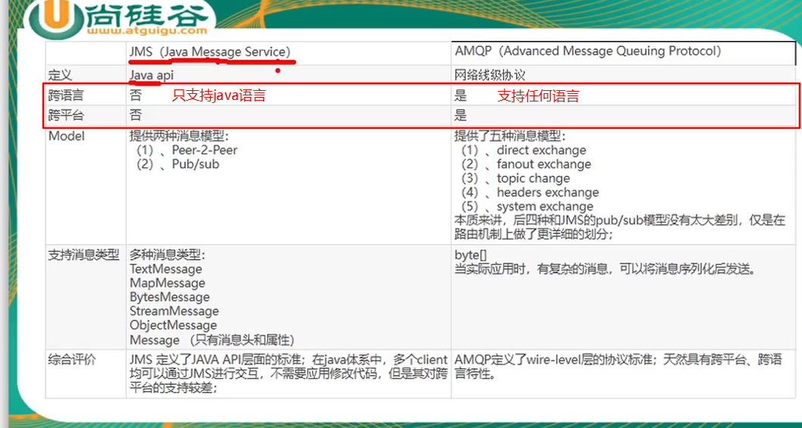


### 1.2 MQ的作用

#### 1.2.1 流量削峰

假设现在有一个订单系统，1s内能够处理10000次请求，这个处理能力在正常情况下完全没有问题，但在流量高峰期，如果1s内有20000个请求进来，订单系统是处理不了的，只能使用服务降级和服务熔断，限制用户下单

使用消息队列，将这些大量的请求全部发送到消息队列中，然后系统立即给用用户响应，之后后台系统再去从消息队列中获取这些请求，慢慢处理

原始情况：当请求在系统的处理能力范围之内，那么系统就可以正常处理请求；一旦请求次数超过系统能够处理的范围，就会使得系统宕机

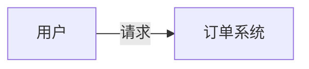

加入MQ：MQ可以接收用户的请求并缓存起来，采用先进先出的方式将缓存的请求发送至订单系统

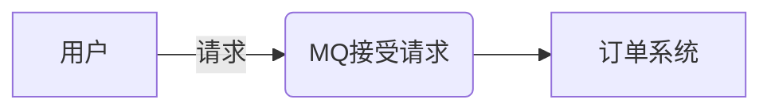


#### 1.2.2 应用解耦

以电商应用为例，应用中有支付系统，库存系统，物流系统等，用户创建订单之后，请求被订单系统处理，而订单系统又需要调用支付系统，库存系统，物流系统等

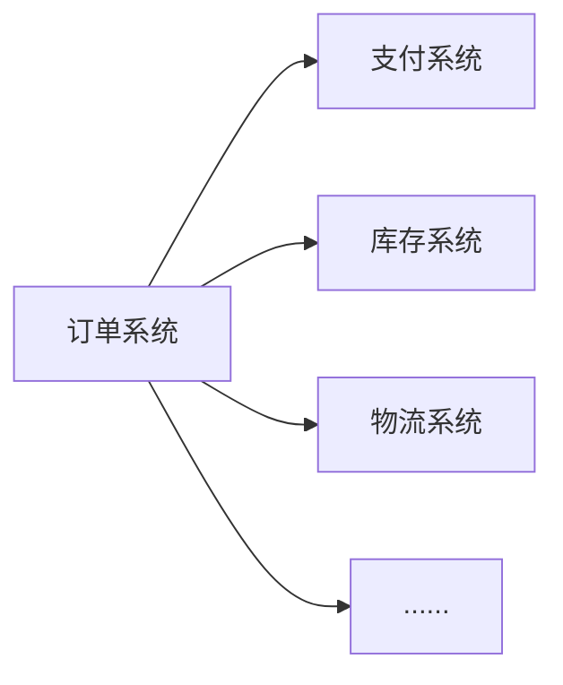

如果由订单系统直接调用这些子系统，那么如果任何一个子系统处理出现异常，都会影响订单系统的执行

现在使用消息队列来转发请求

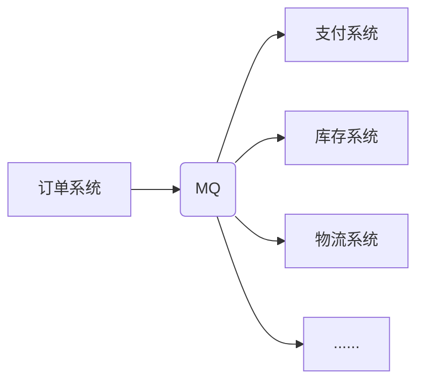

这样系统间调用的问题就会减少，当支付系统出现异常需要进行修复，那么物流系统需要处理的请求会被缓存到消息队列中，用户的下单操作可以正常完成，当物流系统修复之后，从消息队列中取出请求继续进行处理，中途用户感受不到物流系统的故障，提升系统的可用性

#### 1.2.3 异步处理

订单系统需要调用物流系统，但用户又需要快速知道自己是否下单成功，如果使用同步方式进行，订单系统需要在物流系统处理完毕之后再给用户返回信息，使用消息队列之后：

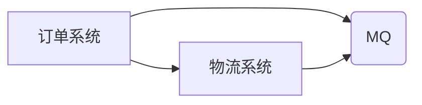

在将请求发送至物流系统之后，订单系统可以监听消息队列中是否有物流系统的完成消息即可


> 同步与异步：
>
> + **同步**：同步通信有点像两者相互打电话，同一时间，你只能给一个人打电话
> + **异步**：异步通信有点像社交软件聊天，比如QQ和微信，同一时间可以和多个人聊天
>
> **同步调用存在的问题**
>
> 微服务间的Fegin远程调用就是一种同步调用，最大的特点就是调用方需要等待被调用方的回复之后才能进行下一步的处理，吞吐量比较低
>
> 还有扩展性比较差，如果需要增加其他服务，需要修改调用者的代码，增加调用被调用服务的代码
>
> 在等待其他服务响应的同时，调用者会占用CPU和内存，严重浪费资源
>
> 并且如果某个被调用服务宕机了，请求处理就会阻塞，随着请求的积压，会导致调用者也崩溃，从而导致服务的雪崩
>
> **异步调用方案**
>
> 异步调用常见的方案就是事件驱动，以支付服务为例
>
> + 支付服务收到用户支付请求之后，向代理器发布消息，确认消息发送成功之后立即给用户返回响应支付成功
> + 后续的服务只需要订阅代理器中的消息，当收到消息之后，进行后续的处理
> + 这就解决了服务耦合问题，后续一系列的服务与支付服务都没有关系
> + 也解决了同步调用中的响应慢问题
> + 同时解决了服务雪崩的问题，如果后续某个服务挂了，支付服务并不关心，后续重启一遍实现最终一致性即可
>
> 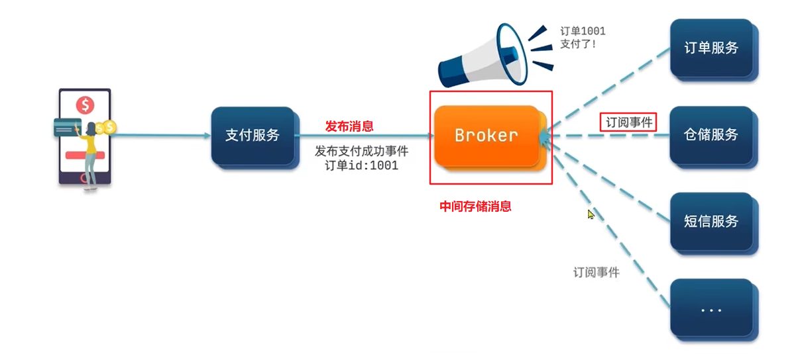
>
> 但是异步调用也有一定的问题：
>
> + 整个架构极度依赖于Broker的可靠性、安全性和并发能力，如果Broker挂了，整个服务也就崩了
> + 架构复杂了，业务没有明显的流程线，不好追踪管理

### 1.3 MQ的分类

#### 1.3.1 ActiveMQ

优点：单机吞吐量万级，时效毫秒级，可用性高，基于主从架构实现高可用

现在用的不多，高吞吐量场景较少使用

#### 1.3.2 kafka

为大数据服务的消息中间件

百万级TPS（每秒事务处理量）的吞吐量，性能卓越，可用性非常高

kafka是分布式的，一个数据多个副本，少数机器宕机不会丢失数据

有优秀的第三方Kafka Web界面管理工具，对硬件要求比较高

#### 1.3.3 RocketMQ

阿里巴巴的开源产品，使用Java实现

单机吞吐量十万级，可用性非常高，分布式架构，消息可以做到0丢失，支持10亿级别的消息堆积


几种消息队列的对比：

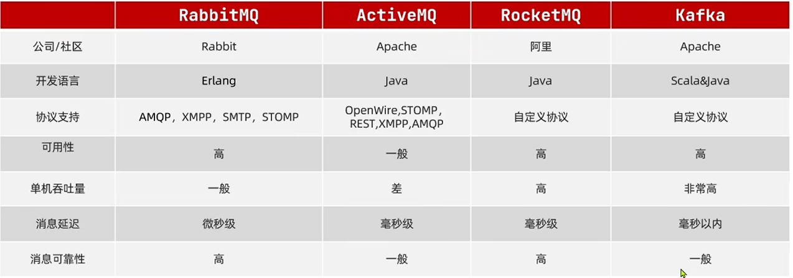

## 二、RabbitMQ

### 2.1 RabbitMQ的基本概念

RabbitMQ是一个消息中间件，它的基本功能就是接收并转发消息

以快递站作为类比，当商家需要将快递发送给用户时，先把快递放到快递站中，然后快递员会将快递从快递站中取出，送到收件人手里，RabbitMQ就相当于一个快递站

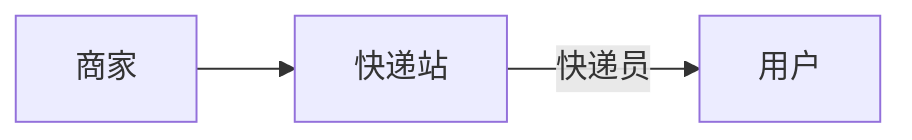

RabbitMQ并不处理消息，只是接收，存储和转发消息数据


#### RabbitMQ的工作流程

（1）生产者与消费者首先与消息队列的消息代理建立连接，并开辟多个信道

（2）生产者发送消息给消息代理中指定虚拟主机的交换机，消息由消息头和消息体组成

（3）交换机接收到消息之后根据消息的路由键决定将消息发送给哪个消息队列

（4）消费者通过信道监听各个消息队列，随时从消息队列中获取自己想要的消息

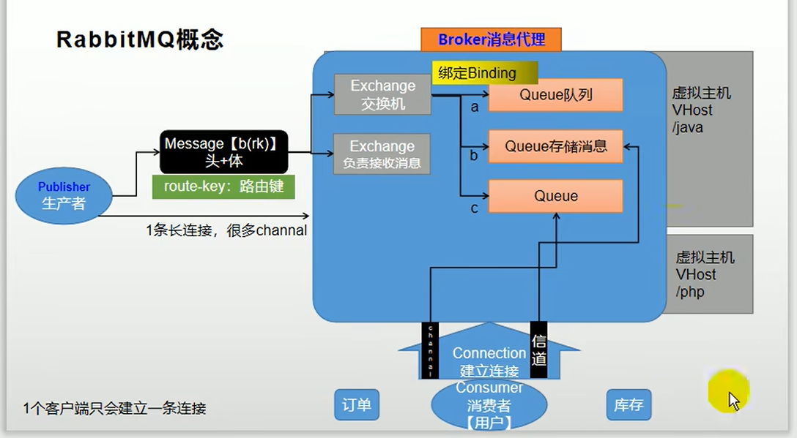

**几个基本概念**

+ Connection：网络连接，比如TCP连接
+ Binding：绑定关系，用于消息队列和交换机之间的关联，一个绑定就是基于路由键将交换机和消息队列连接起来的路由规则，通俗来理解可以将交换机看作一张路由表，交换机和队列之间的绑定可以是多对多关系
+ 信道：channel，多路复用连接中的一条独立的双向数据流通道，信道是建立在真实的TCP连接内的虚拟连接，AMQP命令都是通过信道发送出去的，不管是发布消息、订阅队列还是接收消息，这些动作都是通过信道完成的
+ 虚拟主机：表示一批交换机和消息队列，可以简单理解为就是一个mini版的RabbitMQ，拥有自己的队列，交换机，绑定和权限机制，有点类似于操作系统中的虚拟机，一个RabbitMQ可以划分多个虚拟主机，各个主机之间相互隔离，互不影响


### 2.2 四大核心概念

先用一幅图表示这四大核心概念的关系

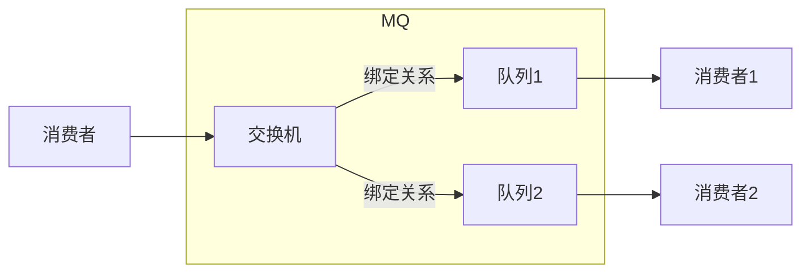

#### 2.1 生产者

产生数据发送消息的程序就是生产者

**消息 --- Message**

消息由消息头和消息体组成，消息是不透明的

+ 消息头有一系列的可选属性组成，这些属性包括routing key（路由键），priority（相对于其他消息的优先级）等
+ 消息体是消息的具体信息

#### 2.2 交换机

交换机是RabbitMQ中非常重要的一个部件，一方面接收来自生产者的消息，另一方面将消息推送到各个队列中

交换机必须确切知道如何处理它接收到的消息，是将消息推送到特定队列还是推送到多个队列

MQ中，一个交换机对应多个队列

**Binding绑定**

用于消息队列和交换机之间的关联，一个绑定就是基于路由键将交换机和消息队列连接起来的路由规则

可以将交换机理解为由一个绑定构成的路由表

> **交换机的类型**
>
> （1）直接交换机，是指路由键的完全匹配，只有当消息的routing key和绑定关系的键完全一致才能匹配，所以是点对点的，direct交换机只能将消息发送给完全匹配的队列
>
> （2）fanout交换机，广播类型交换机，不关心路由键是什么，直接将消息转发给与它绑定的所有队列中
>
> （3）topic交换机，将队列的绑定关系和某个模式进行匹配，如果路由键符合队列的绑定关系，就将消息发送给路由键所匹配的所有队列中
>
> 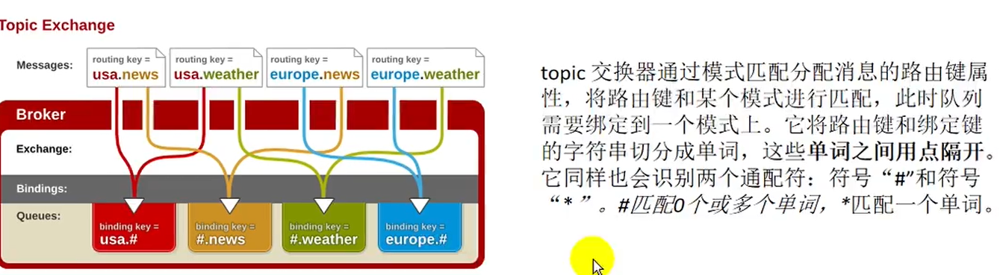

#### 2.3 队列

队列是RabbitMQ内部使用的一种数据结构，尽管消息流经RabbitMQ和应用程序，但消息只能存储在队列中

队列本质上是一个很大的消息缓冲区，生产者可以将消息发送到一个队列，消费者可以尝试从一个队列中接收数据

#### 2.4 消费者

消费者在大多数情况下是一个等待接收消息的程序，在实际生产环境上，生产者，消费者和消息中间件很多时候并不在一台机器上，同一个应用程序既可以是生产者同时又可以是消费者

### 2.3 RabbitMQ的模式

RabbitMQ的工作原理

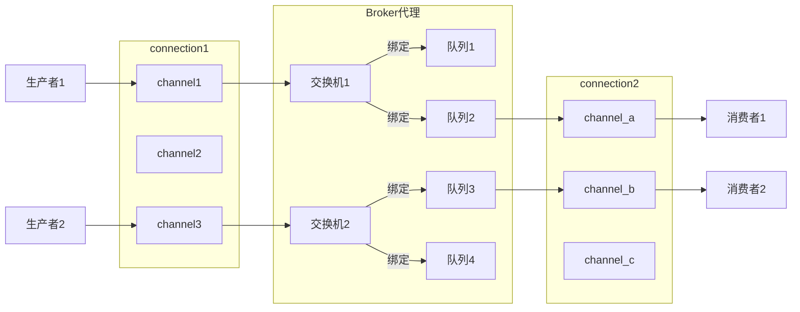

+ Connection：TCP连接，生产者发送消息或者消费者接收消息，都必须跟Broker建立连接才能通信
  + 一个客户端只需要建立一条连接
  + 连接为长连接，一直保持的连接
+ Channel：是建立在真实TCP连接中的虚拟连接，消息都是通过信道发送或者接收的，建立信道是为了复用TCP连接
  + 在一条连接中建立多条信道
  + 信道负责数据的传输
+ 虚拟主机：指一批交换机和队列，主要目的是为了系统的隔离

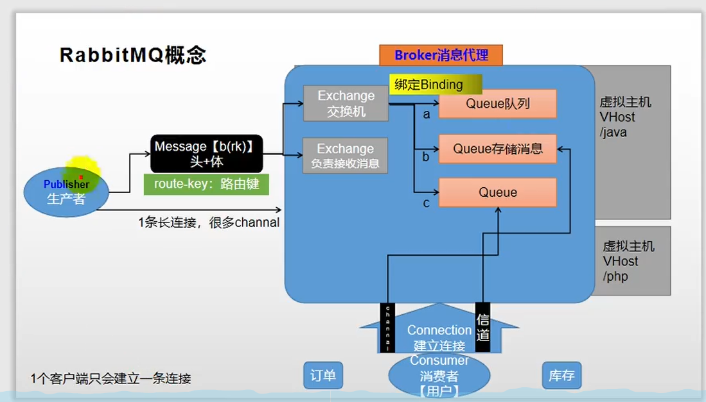

#### 2.3.1 简单模式

一个生产者对应一个消费者

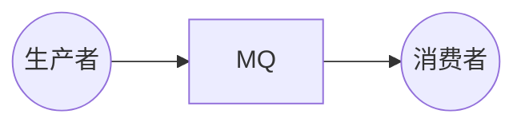

**简单模式的演示**

新建一个springboot工程，加上rabbitMQ的依赖

```xml
<dependency>
    <groupId>org.springframework.amqp</groupId>
    <artifactId>spring-rabbit-test</artifactId>
    <scope>test</scope>
</dependency>

<dependency>
            <groupId>commons-io</groupId>
            <artifactId>commons-io</artifactId>
            <version>2.6</version>
</dependency>
```

主要编写两个类：Producer生产者和Consumer消费者

生产者向rabbitMQ发送消息

```java
/** 消息生产者
 * @author ProgZhou
 * @createTime 2022/04/14
 */
public class Producer {

    //消息队列的名称
    public static final String QUEUE_NAME = "hello";

    public static void main(String[] args) {
        //创建一个连接工厂
        ConnectionFactory factory = new ConnectionFactory();
        //工厂IP，即需要连接的MQ的IP
        factory.setHost("127.0.0.1");

        //连接用户名
        factory.setUsername("admin");

        //连接密码
        factory.setPassword("123456");

        //获取连接
        try {
            Connection connection = factory.newConnection();
            //获取信道
            Channel channel = connection.createChannel();
            /*
            * 生成一个队列：
            * 1. String queue：队列名称
            * 2. boolean durable：队列中的消息是否持久化，默认情况消息存储在内存中
            * 3. boolean exclusive：队列是否只供一个消费者进行消费，即是否进行消息共享
            *       true代表队列中的消息仅供一个消费者接收
            *       false代表消息可供多个消费者共享
            * 4. boolean autoDelete：是否自动删除，当所有消费者都与这个队列断开连接时，这个队列会自动删除
            * 5. Map<String, Object> argument
            * */
            channel.queueDeclare(QUEUE_NAME, false, false,false,null);

            //发送消息
            String message = "hello world";
            /*
            * 发送消息
            * 1. String exchange：交换机名称
            * 2. String routingKey：路由key
            * 3. BasicProperties props：一些基本的消息配置
            * 4. byte[] body：发送的消息
            * */
            channel.basicPublish("", QUEUE_NAME, null, message.getBytes());
            System.out.println("message publish successfully");
        } catch (Exception e) {
            e.printStackTrace();
        }
    }

}
```

消费者从MQ中接收消息

```java
/** 消费者，接收消息
 * @author ProgZhou
 * @createTime 2022/04/14
 */
public class Consumer {

    //消息队列的名称
    public static final String QUEUE_NAME = "hello";

    //接收消息
    public static void main(String[] args) {
        ConnectionFactory factory = new ConnectionFactory();

        factory.setHost("127.0.0.1");

        factory.setUsername("admin");

        factory.setPassword("123456");

        try {
            Connection connection = factory.newConnection();

            Channel channel = connection.createChannel();
            /*
            * 消费者接收消息
            * 1. String queue：队列的名称
            * 2. DeliverCallback deliverCallback：当消息被分配时回调
            * 3. CancelCallback cancelCallback：当消费者取消时，回调
            * */
            //接收消息的接口
            DeliverCallback dc = (consumerTag, message) ->{
                //输出消息
                System.out.println(new String(message.getBody()));
            };
            //当取消消息后的回调
            CancelCallback cc = (consumerTag) ->{
                System.out.println("consumer is interrupted");
            };
            channel.basicConsume(QUEUE_NAME, dc, cc);
        } catch (Exception e) {
            e.printStackTrace();
        }
    }

}
```

效果：

当生产者向MQ中发送消息后：RabbitMQ会时刻监视消息的状态


当消费者从MQ中接收消息之后


#### 2.3.2 工作模式

在高并发的情况下，如果只采用一个生产者对应一个消费者的模式，会导致消费者不能够及时处理消息队列中的过多的消息导致消息堆积，这时，可以采用多个消费者，使用轮询的方式将消息分发给不同的消费者

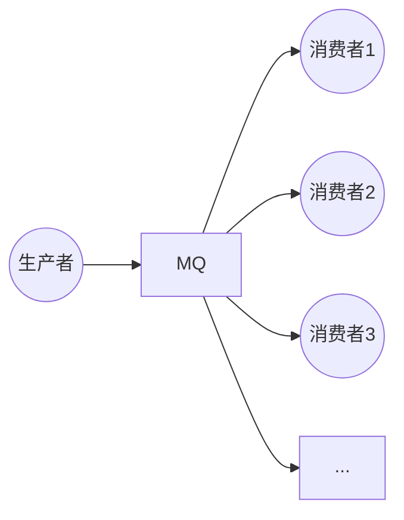

一个消息只能被一个消费者接收，可以采用轮询的方式，第一个消息发送给消费者1，第二个消息发送给消费者2以此类推

工作模式示例：

```java
/** 连接工厂创建信道的工具类
 * @author ProgZhou
 * @createTime 2022/04/14
 */
public abstract class RabbitMqUtil {
    public static final String QUEUE_NAME = "hello";

    public static Channel getChannel() throws Exception{
        ConnectionFactory factory = new ConnectionFactory();

        factory.setHost("127.0.0.1");

        factory.setUsername("admin");

        factory.setPassword("123456");

        Connection connection = factory.newConnection();
        return connection.createChannel();
    }
}
```

Producer.java

```java
/** 消息生产者
 * @author ProgZhou
 * @createTime 2022/04/15
 */
public class Provider {
    public static void main(String[] args) throws Exception {
        Channel channel = RabbitMqUtil.getChannel();

        //声明一个队列
        channel.queueDeclare(RabbitMqUtil.QUEUE_NAME, false, false, false, null);

        //发送消息，从控制台接收消息并推送至MQ
        Scanner scanner = new Scanner(System.in);
        while (scanner.hasNext()){
            String msg = scanner.next();
            channel.basicPublish("", RabbitMqUtil.QUEUE_NAME, null, msg.getBytes());
            System.out.println("provider send message: " + msg);
        }
    }
}
```

Consumer.java，由于需要模拟多个消费者的场景，需要写成多线程的形式

```java
/** 消费者，写两个一样的类充当多个消费者
 * @author ProgZhou
 * @createTime 2022/04/15
 */
public class Consumer01 {
    public static void main(String[] args) throws Exception {
        Channel channel = RabbitMqUtil.getChannel();

        System.out.println("consumer01 waiting to get message...");

        //消费者接收到消息之后如何处理消息
        DeliverCallback dc = (consumerTag, message) -> {
            String msg = new String(message.getBody());

            System.out.println("consumer01 receive: " + msg);

        channel.basicConsume(RabbitMqUtil.QUEUE_NAME, false, dc, (consumerTag) ->{});
    }
}
```

视图：


输出结果：


消费者2接收到的消息：


消费者是轮流接收到消息的，即第一条消息发送给消费者1，第二条消息发送给消费者2...

**不公平分发**

从上面的例子可以发现，消费者1的处理能力很强，消费者2的处理能力很弱，但这两者处理消息的总数是一样的，这就导致了消费者1在很长一部分的时间里是空闲的，浪费了资源

为了解决这样的问题，RabbitMQ支持不公平分发的制度，可以简单的理解为能者多劳，就是处理能力强的消费者可以多接收消息处理，处理能力弱的消费者就少接收消息

```java
//设置消费者的不公平分发，需要注意的是，不公平分发制度只有在手动应答的时候才生效
channel.basicQos(1);
```

效果如下：消费者1接收到的消息会比消费者2多


**预取值**

不公平分发允许用户设置每个消费者的预取值，意思是规定某个消费者接收多少消息

比如现在MQ中有7条消息，现在规定消费者1接收2条，消费者2接收5条

当队列中的7条消息未处理完时，消费者1只能处理两条消息，尽管已经处理完成，也不能接收新的消息

#### 2.3.3 发布订阅模式

**交换机**：之前示例中，生产者都是直接将消息发送给队列，但实际上，生产者的消息不会直接发送到队列上，而是将消息发送给交换机，交换机接收生产者发送的消息，并将其推送到指定的队列

> 如果生产者有特殊的需求，比如生产者希望自己发送的消息被多个消费者消费，队列是不能完成这样的工作的，因为一个队列中的每个消息只能被消费一次

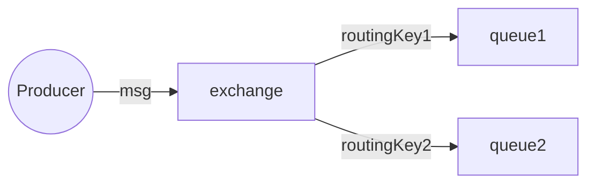

加入交换机之后，RabbitMQ中各个组件的功能为：

- **生产者**：发送消息
- **交换机**：将收到的消息根据路由规则路由到特定队列
- **队列**：用于存储消息
- **消费者**：收到消息并消费

**交换机与队列绑定**：交换机通过routingKey与队列进行绑定，routingKey可以自己随意指定，当消息发送到交换机，交换机根据消息指定的routingKey将消息发送给指定的队列

**交换机的类型**

+ 直接交换机（direct exchange）
+ 扇形交换机（fanout exchange）
+ 主题交换机（topic exchange）
+ 头交换机（header exchange）

> 还有一种无名交换机，就是RabbitMQ默认的交换机，之前的示例中，channel.basicPublish("", RabbitMqUtil.QUEUE_NAME, null, msg.getBytes());第一个参数为交换机的类型，当为空串的时候，默认分配的就是无名交换机


**扇形交换机**

将接收到的消息广播到它所绑定的所有队列中，也就是只要和交换机绑定的队列都可以收到生产者发送的消息

```java
//fanout交换机生产者
public class EmitLog {
    public static void main(String[] args) throws Exception {
        Channel channel = RabbitMqUtil.getChannel();

        //声明一个交换机，交换机名字 + 交换机类型
        channel.exchangeDeclare("Logs", "fanout");

        Scanner scanner = new Scanner(System.in);

        while (scanner.hasNext()){
            String string = scanner.next();

            channel.basicPublish("Logs", "", null, string.getBytes(StandardCharsets.UTF_8));

            System.out.println("send message: " + string);
        }
    }

}
```

```java
//fanout交换机消费者
public class ReceiveLogs1 {
    public static void main(String[] args) throws Exception {
        Channel channel = RabbitMqUtil.getChannel();

        //声明一个交换机
        channel.exchangeDeclare("Logs", "fanout");

        //声明一个队列，临时队列，当消费者断开与队列的连接时，队列就会删除
        String queue1 = channel.queueDeclare().getQueue();

        //绑定交换机，队列名 + 交换机名 + routingKey，routingKey = ""的话消息队列可以自动生成
        channel.queueBind(queue1, "Logs", "");
        System.out.println("ReceiveLogs01 waiting to receive message...");

        DeliverCallback dc = (consumerTag, message) -> {
            String msg = Arrays.toString(message.getBody());
            System.out.println("ReceiveLogs01 message: " + msg);
        };

        CancelCallback cc = consumerTag -> {};
        //消息接收
        channel.basicConsume(queue1, true, dc,cc);

    }
}
```

结果：

生产者发送消息


消费者接收消息，可以看到两个消费者都收到了相同的消息


fanout队列与队列的保证


**直接交换机**（待修改）

direct交换机会将消息推送到指定的routKey所绑定的队列中

```java
//direct交换机生产者
public class DirectLogs {
    public static void main(String[] args) throws Exception {
        Channel channel = RabbitMqUtil.getChannel();

        //声明一个交换机，direct类型
        channel.exchangeDeclare("direct_logs", BuiltinExchangeType.DIRECT);

        Scanner scanner = new Scanner(System.in);

        while (scanner.hasNext()){
            String string = scanner.next();
            //使用随机数生成，对应发送给哪个routingKey绑定的交换机
            int i = (int)(Math.random() * 3 + 1);
            if(i == 1){
                System.out.print("routingKey: info ");
                channel.basicPublish("direct_logs", "info", null, string.getBytes(StandardCharsets.UTF_8));
            } else if(i == 2){
                System.out.print("routingKey: warning ");
                channel.basicPublish("direct_logs", "warning", null, string.getBytes(StandardCharsets.UTF_8));
            } else{
                System.out.print("routingKey: error ");
                channel.basicPublish("direct_logs", "error", null, string.getBytes(StandardCharsets.UTF_8));
            }


            System.out.println("send message: " + string);
        }
    }
}
```

```java
//direct交换机消费者
public class ReceiveLogDirect01 {
    public static void main(String[] args) throws Exception {
        Channel channel = RabbitMqUtil.getChannel();

        //声明一个队列
        channel.queueDeclare("console", false, false, false, null);

        //绑定交换机，一个队列可以使用多个routingKey绑定同一个交换机
        channel.queueBind("console", "direct_logs", "info");
        channel.queueBind("console", "direct_logs", "warning");

        System.out.println("ReceiveLogDirect01 waiting to receive message...");
        //接收消息
        DeliverCallback dc = (consumerTag, message) -> {
            System.out.println("ReceiveLogs01 consume message: " + new String(message.getBody() ));
        };

        CancelCallback cc = consumerTag ->{
            System.out.println("failed to received message: " + consumerTag);
        };

        //接收消息
        channel.basicConsume("console", true, dc, cc);

    }
}

//另一个队列不同的部分：队列名以及绑定规则不同
        channel.queueDeclare("disk", false, false, false, null);

        channel.queueBind("disk", "direct_logs", "error");
```

结果：

生产者发送消息


消费者接收消息：


**主题交换机**

直接交换机只能定向对routingKey匹配的队列进行转发消息，如果现在想消息发送到多个队列但不是全部队列，假设现在发送的消息的routingKey为info.base，info.advantage，但某个队列现在只想接收info.base这个消息这时候，direct交换机就办不到了

Topic交换机所绑定队列的routingKey有一定的规则：

+ 必须是一个单词列表，单词与单词之间使用"."隔开

  > 比如info.base，info.advantage，stock.usd.nys等

+ 在匹配中*可以代替一个单词

+ #可以代替零个或多个单词

  > 比如\*.\*.rabbit可以匹配三个单词的routingKey，并且以rabbit结尾


### 2.4 RabbitMQ消息应答机制

**RabbitMQ可能存在的问题**

+ 消息可靠性问题：如何确保发送的消息至少被消费一次
+ 延迟消息的问题：如何实现消息的延迟投递
+ 消息堆积问题：如何解决数百万消息堆积，无法及时处理消息的问题
+ 如何避免单点的MQ故障而导致的不可用问题


**RabbitMQ消息确认机制**

消息丢失：

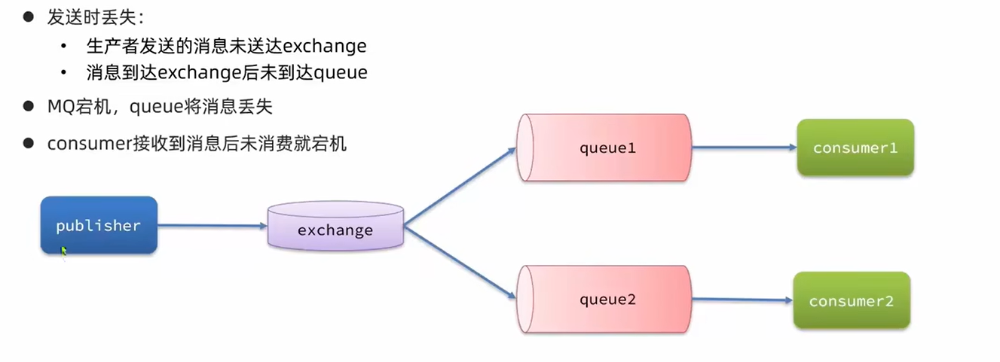

在分布式环境中避免不了网络问题，生产者发送消息或者消费者接收消息都有可能产生消息丢失的问题，有些消息丢失的问题会产生严重的利润损失，为保证消息的可靠传输，rabbitMQ引入了消息确认机制

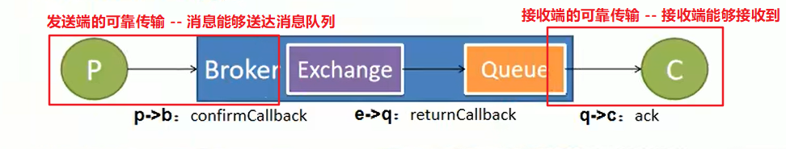


图中的一些概念：

+ `publisher confirmCallback`：当消息队列broker正确收到生产者发送的消息时，即会调用这个确认回调，但不保证消息能够正确到达队列中
  + 消息只要被broker接收到就会执行confirmCallback，如果是集群模式，需要所有集群中的所有broker接收到才会调用confirmCallback
  + 被broker接收到的消息只能表示message已经到达rabbitMQ的服务器，并不能保证消息一定会被投递到目标queue里，还需要用到接下来的returnCallback
  + 在创建rabbitmq的connectionFactory时设置PublishConfirms(true)选项开启confirmCallback
+ `publisher returnCallback`：当消息投递失败，交换机将消息发送给队列时出错，就会触发这个退回模式
  + 在有些业务下，需要保证消息一定要投递到目标队列中，此时就需要用到return模式
  + 如果消息未能投递到目标queue中，将调用returnCallback，可以记录下详细的投递数据，定时重发或者自动纠错都需要这些数据
+ `consumer ack`：消费者端的消息确认机制，让消息队列的broker知道，哪些消息被消费者接收到了
  + 如果消费者正确接收了消息，消息会被删除或者做其他处理
  + 如果消费者没有接收到消息，消息会被重新投递

> consumer ack在默认情况下是自动确认，意思是只要消费者端接收到消息，即自动给服务器回复ack，消息就会被删除
>
> 但这种方式有一个比较大的问题，消费者端一次性接收到了很多消息，但还没来得及处理，就出现了故障，导致消息并没有处理完，那么这样就会导致大量的消息丢失
>
> 所以一般情况下都使用手动确认模式，即消费者端处理完成一个消息给rabbitmq回复，当rabbitmq收到这个ack确认之后，才会将消息从消息队列中删除
>
> rabbitmq队列中的消息有两种状态：
>
> + ready：消费者端没有启动连接，队列中消息的状态就是ready
> + unack：消息发送出去了，正在被消费者处理，但没有返回处理完成的ack时的状态
>
> 没有收到ack的消息都是unack状态，并不会被队列删除，所以，即使consumer宕机，消息也不会丢失，会重新变为ready状态，下次有新的consumer连接进来的时候，就会把消息发送给新的consumer，发送出去的消息重新转换为unack状态

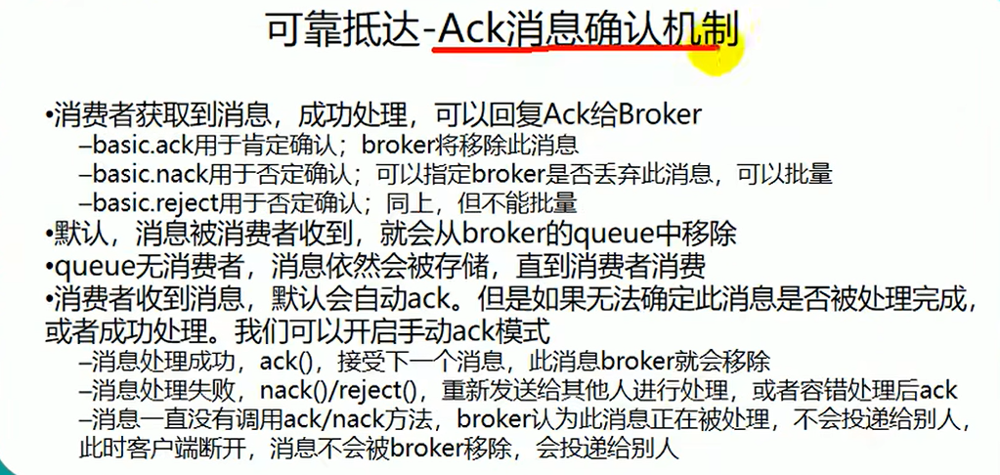

#### 2.4.1 自动应答方式

RabbitMQ将消息传送给消费者后，默认消息处理成功，会将这个消息从内存中删除，并不在乎消费者是否真的处理完这个消息

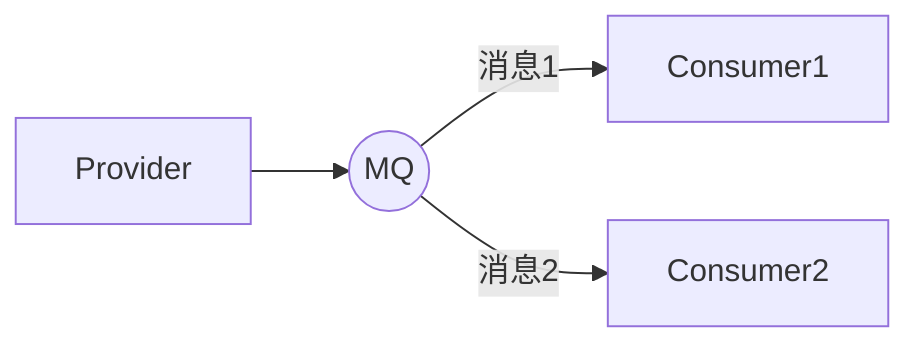

> 当消息发送给消费者1之后便立即删除消息，如果消费者1宕机，那么应用就丢失了消息1

#### 2.4.2 手动应答方式

RabbitMQ在将消息传递给消费者后，并不会立即将消息从队列中删除，而是等待消费者处理是否成功，当消费者处理完消息后，向MQ发送应答，RabbitMQ接收到应答之后，认为消息处理成功，这时才将消息从MQ中删除

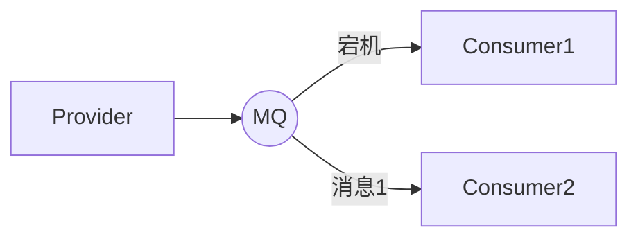

> 当MQ发送消息之后，并不会立即删除消息，等待消费者的应答，如果消费者1宕机，那么MQ可以将消息1发送给消费者2进行处理，并继续等待应答

#### 2.4.3 消息自动重新入队

如果消费者由于某些原因失去连接（消费者通道关闭，连接关闭或TCP连接丢失），导致消费者未发送ACK确认帧，RabbitMQ了解到消息并未完全处理，将消息重新排队，如果此时其他消费者可处理消息，便将这个未处理完的消息发送给另一个消费者，这样，即使某个消费者偶尔死亡，也可以确保不会丢失任何消息


演示：

消费者：有两个消费者，消费者01睡眠时间为1s，消费者02睡眠时间为30s

```java
/** 消息应答 -- 消费者01
 * @author ProgZhou
 * @createTime 2022/04/15
 */
public class Consumer01 {
    public static void main(String[] args) throws Exception {
        Channel channel = RabbitMqUtil.getChannel();

        System.out.println("consumer01 waiting to get message...");

        //消费者接收到消息之后如何处理消息
        DeliverCallback dc = (consumerTag, message) -> {
            String msg = new String(message.getBody());

            //消费者02只有睡眠的时间与消费者01不同
            try {
                Thread.sleep(1000);
            } catch (InterruptedException e) {
                e.printStackTrace();
            }
            System.out.println("consumer01 receive: " + msg);
            /*
            * 消息处理完之后的手动应答
            * 1. long deliveryTag: 消息的标号
            * 2. boolean multiple: 是否批量应答
            * */
            channel.basicAck(message.getEnvelope().getDeliveryTag(), false);
        };

        channel.basicConsume(RabbitMqUtil.QUEUE_NAME, false, dc, (consumerTag) ->{});
    }
}
```

当生产者发送消息之后，关闭消费者2，就可以看到原本应该被消费者2接收的dd消息重新发送给消费者1了


### 2.5 RabbitMQ持久化

在RabbitMQ中，如果遇到RabbitMQ服务停止或者挂掉，那么其中的消息将会出现丢失的情况，为了保证在RabbitMQ服务重启的情况下不丢失消息，可以将MQ中的交换机，队列和消息都设置为可持久化的，这样能够保证在大部分情况下消息不被丢失

#### 2.5.1 队列持久化

在声明队列的时候，将boolean durable参数设置为true，表示队列持久化

```java
//声明一个队列，支持队列持久化
channel.queueDeclare(RabbitMqUtil.QUEUE_NAME, true, false, false, null);
```

队列持久化之后，在RabbitMQ的界面会有显示


> 如果原先这个队列存在并且没有设置持久化，在代码中修改持久化参数之后重新连接的话会报错，需要先将之前的队列删除后再创建

效果：关闭RabbitMQ再重启，可以发现这个队列仍然存在

#### 2.5.2 消息持久化

如果想要在MQ重启之后查看队列中的消息，需要将消息也设置为持久化，只设置队列持久化是不够的

设置消息持久化需要在生产者发布消息时，将prop属性设置为MessageProperties.PERSISTENT_TEXT_PLAIN

```java
//设置消息持久化
channel.basicPublish("", RabbitMqUtil.QUEUE_NAME, MessageProperties.PERSISTENT_TEXT_PLAIN, msg.getBytes());
```

让生产者先发送几条消息，然后关闭RabbitMQ，再重启，可以发现消息仍然在队列中


#### 2.5.3 交换机持久化

目前还没有用到交换机，交换机的持久化可以在声明交换机的时候进行

```java
//前两个参数分别为交换机的名字和交换机的类型，true表示进行交换机持久化
channel.exchangeDeclare("exchange", "topic", true);
```


**设置了交换机，队列，消息持久化后，能保证数据不丢失吗？**

不能

其一消息丢失并不仅仅是RabbitMQ宕机的原因引起的，像之前提到过的，如果不设置消费者手动应答的话，当消费者没有处理完消息，那么这个消息也就找不到了

其二，消息在存入RabbitMQ中，还需要有一段时间才能将消息持久化到磁盘中，这就像Redis的两种持久化方式一样，如果在持久化的过程中RabbitMQ宕机，那么消息仍然会丢失

#### 2.5.4 发布确认

上面提到了，尽管RabbitMQ设置了交换机持久化、队列持久化和消息持久化，但这三者还是不能保证消息百分之百不丢失，这是由于，生产者发送消息之后，是不知道RabbitMQ是否收到，或者说是否保存下来，由此引出了这个发布确认模式

**基本介绍**

发布确认模式就是将生产者与MQ连接的信道设置为confirm模式，一旦进入confirm模式，所有生产者发送的消息就会先被保存到一个map中，并分配一个唯一的序列号

当MQ确认收到消息之后，就会给生产者发送一个确认（包含消息的序列号，表示收到了哪条消息），这就使得生产者就明确知道哪条消息被MQ收到了，对于没有收到确认的消息，生产者可以选择重发，或者做其他操作

对于发布确认模式，总共有三种形式：

+ 单个确认，指的是每个消费者发送一条消息后进入等待状态，收到MQ发送来的确认之后再发送下一条消息；如果在规定的时间内没有收到确认，则认为该消息发送失败，重发该消息，代码如下：

  ```java
  //单个确认 发送完成耗时 --- 220ms
  public static void publishMessageSingle() throws Exception{
      Channel channel = RabbitMqUtil.getChannel();
  
      //队列名称
      String queueName = "single_confirm";
      channel.queueDeclare(queueName, true, false, false, null);
  
      //开启发布确认
      channel.confirmSelect();
  
      //记录开始时间
      long begin = System.currentTimeMillis();
  
      //批量发送消息
      for (int i = 0; i < 100; i++) {
          String message = String.valueOf(i);
          channel.basicPublish("", queueName, MessageProperties.PERSISTENT_TEXT_PLAIN, message.getBytes());
          //调用waitForConfirms，等待MQ确认
          boolean b = channel.waitForConfirms();
          if(b){
              System.out.println("Message published successfully.");
          }
      }
  
      long end = System.currentTimeMillis();
      System.out.println("time: " + (end - begin));
  }
  ```

  > 单个确认的优点就是简单，并且当消息发送失败时，可以明确的知道哪个消息发送失败，快速重发
  >
  > 缺点就是效率很低，因为每发送一个消息就需要等待MQ的确认

+ 批量确认，和sql中的批量操作相似，指定一个消息确认数，比如10，表示发送10条消息之后再统一进行确认，代码如下：

  ```java
  //批量发布确认  发布完成耗时 --- 70ms
  public static void publishMessageBatch() throws Exception{
      Channel channel = RabbitMqUtil.getChannel();
  
      //队列名称
      String queueName = "batch_confirm";
      channel.queueDeclare(queueName, true, false, false, null);
  
      //开启发布确认
      channel.confirmSelect();
  
      //记录开始时间
      long begin = System.currentTimeMillis();
  
      //批量确认消息的大小，即发布多少条以后确认一次
      int batchSize = 10;
  
      //批量发送消息
      for (int i = 1; i <= 100; i++) {
          String message = String.valueOf(i);
          channel.basicPublish("", queueName, MessageProperties.PERSISTENT_TEXT_PLAIN, message.getBytes());
          if(i % batchSize == 0){
              boolean b = channel.waitForConfirms();
              if(b){
                  System.out.println("batch confirm successfully.");
              }
          }
      }
  
      long end = System.currentTimeMillis();
      System.out.println("time: " + (end - begin));
  }
  ```

  > 批量确认的优点就是效率得到了很大的提高，从发布完成耗费时间就能看出来，提高了2倍多
  >
  > 缺点就是，如果出现了消息发送失败的情况，无法确认哪一条消息发布失败，一个解决方法就是生产者将整个批量的消息重发

+ 异步确认，以上两种发布确认模式都或多或少优点缺陷，异步发布模式就很好地综合了两种发布模式的优点。生产者只管发布消息，所发布的消息会全部存储在信道的一个map中，并分配一个序列号，当MQ收到消息之后，向生产者发送确认，确认需要携带消息的序列号，这就解决了批量发布分不清哪些消息发布成功，哪些消息发布失败的问题，代码如下：

  ```java
  //异步发布确认   发布完成耗时 --- 10ms
  public static void publishMessageAsyn() throws Exception{
      Channel channel = RabbitMqUtil.getChannel();
  
      //队列名称
      String queueName = "asyn_confirm";
      channel.queueDeclare(queueName, true, false, false, null);
  
      //使用处理并发的有序map来存储发送的消息
          // ConcurrentSkipListMap<Long, String> skipListMap = new ConcurrentSkipListMap<>();
      
      //开启发布确认
      channel.confirmSelect();
  
      //消息确认成功回调函数
      ConfirmCallback ackConfirm = (deliveryTag, multiple) -> {
          //可以将发送成功的消息从存储的skipListMap中删除，这样当消息发送完毕之后，map中剩余的消息就是发送失败的消息
  //            if(multiple){
  //                //如果是批量发布的话，可以一次性确认多条消息
  //                ConcurrentNavigableMap<Long, String> navigableMap = skipListMap.headMap(deliveryTag, true);
  //                navigableMap.clear();
  //            }
          //具体逻辑具体分析
          System.out.println("message publish successfully: " + deliveryTag);
      };
      //消息确认失败回调函数
      ConfirmCallback nackConfirm = (deliveryTag, multiple) -> {
          //具体逻辑具体分析
          System.out.println("message publish failed: " + deliveryTag);
      };
  
  
      //准备消息监听器，判断哪些消息发送成功，哪些消息发送失败，也可以只监听发送成功的消息
      channel.addConfirmListener(ackConfirm, nackConfirm);
  
      //记录开始时间
      long begin = System.currentTimeMillis();
      //批量发送消息
      for (int i = 1; i <= 100; i++) {
          String message = String.valueOf(i);
          channel.basicPublish("", queueName, MessageProperties.PERSISTENT_TEXT_PLAIN, message.getBytes());
          // channel.getNextPublishSeqNo()获得的是下一个发布的序列号，当前序列号需要减一
          // skipListMap.put(channel.getNextPublishSeqNo() - 1, message);
      }
  
  
      //记录结束时间
      long end = System.currentTimeMillis();
      System.out.println("time: " + (end - begin));
  
  }
  ```
  
  
  
  
  
  
  
  
  
  

### 2.6 死信队列

#### 2.6.1 死信的概念

死信，即无法被消费的消息，一般来说，由生产者发送的消息会直接投递到rabbitmq中的队列中，然后消费者从队列中取出消息并进行消费，但某些时候由于特定的原因导致queue中的某些消息无法被消费而一直堆积在队列中，这就是死信

应用场景：为了保证订单业务的消息数据不丢失，需要使用RabbitMQ的死信队列机制，当消费发生异常时，将消息投入死信队列中；用户在商城下单成功并点击支付后在指定时间内未支付，支付将失效


**什么时候会产生死信**

+ 消息过期，即在消息在队列中未被消费的时间已经到达了TTL
+ 队列达到最大长度，先进入队列的消息会被丢弃或者扔到死信路由上
+ 一个消息被消费者拒绝了

**死信交换机**

死信交换机实际上是一个普通交换机，只是在某一个设置dead letter exchange的队列中有消息过期了，会自动触发消息的转发，发送到dead letter exchange中去

#### 2.6.2 死信代码架构

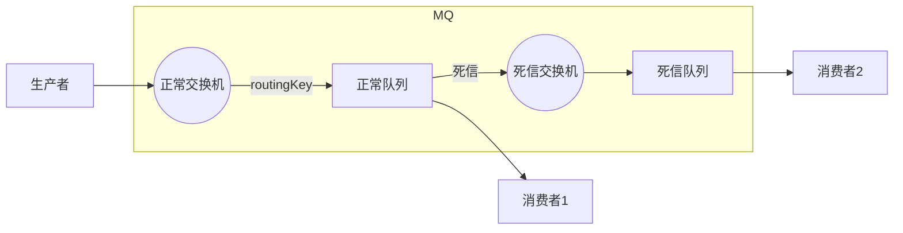


```java
//死信 --- 消费者1
public class ReceiveLogs01 {
    //声明正常交换机名
    public static final String NORMAL_EXCHANE = "normal_exchange";
    //声明正常队列的名称
    public static final String NORMAL_QUEUE = "normal_queue";
    //声明死信交换机的名称
    public static final String DEAD_EXCHANGE = "dead_exchange";
    //声明死信队列的名称
    public static final String DEAD_QUEUE = "dead_queue";

    public static void main(String[] args) throws Exception {
        Channel channel = RabbitMqUtil.getChannel();

        //声明普通交换机，直接交换机
        channel.exchangeDeclare(NORMAL_EXCHANE, BuiltinExchangeType.DIRECT);
        Map<String, Object> arguments = new HashMap<>();
        //key的值是固定的
        arguments.put("x-dead-letter-exchange", DEAD_EXCHANGE);
        //设置死信队列的routingKey
        arguments.put("x-dead-letter-routing-key", "lisi");
        //声明普通队列,需要参数与死信交换机建立联系
        channel.queueDeclare(NORMAL_QUEUE, false, false, false, arguments);


        //声明死信交换机
        channel.exchangeDeclare(DEAD_EXCHANGE, BuiltinExchangeType.DIRECT);
        //声明死信队列

        channel.queueDeclare(DEAD_QUEUE, false, false, false, null);

        //绑定普通队列和普通交换机
        channel.queueBind(NORMAL_QUEUE, NORMAL_EXCHANE, "zhangsan");

        //绑定死信队列和死信交换机
        channel.queueBind(DEAD_QUEUE, DEAD_EXCHANGE, "lisi");


        System.out.println("Consumer01 waiting to receive message...");
        //消费者接收消息
        DeliverCallback dc = (consumerTag, message) -> {
            String msg = new String(message.getBody());
            System.out.println("Consumer01 receive message: " + msg);
        };

        CancelCallback cc = consumerTag -> {
            System.out.println("failed to receive message: " + consumerTag);
        };

        channel.basicConsume(NORMAL_QUEUE, true, dc, cc);


    }
}
```


```java
//死信 --- 生产者，将消息发送给普通交换机
public class Provider {
    //声明正常交换机名
    public static final String NORMAL_EXCHANE = "normal_exchange";

    public static void main(String[] args) throws Exception {
        Channel channel = RabbitMqUtil.getChannel();

        channel.exchangeDeclare(NORMAL_EXCHANE, BuiltinExchangeType.DIRECT);

        AMQP.BasicProperties properties = new AMQP.BasicProperties().builder().expiration("10000").build();
        //发消息
        for (int i = 0; i < 10; i++) {

            String message = "info" + i;

            System.out.println("Provider send message: " + message);

            channel.basicPublish(NORMAL_EXCHANE, "zhangsan", properties, message.getBytes());
        }
    }
}

```

效果：发送消息十秒钟之后，过期的消息会全部进入死信队列


#### 2.6.3 延迟队列

延迟队列，队列内部是有序的，用来存储需要在指定时间里被处理的消息

延时队列，最重要的特性就体现在它的延时属性上，跟普通的队列不一样的是，普通队列中的元素总是等着希望被早点取出处理，而延时队列中的元素则是希望被在指定时间得到取出和处理，所以延时队列中的元素是都是带时间属性的，通常来说是需要被处理的消息或者任务。

如果将过期的消息（死信）路由到死信交换机，再转发到死信队列中，然后再由需要的消费者去监听这个死信队列，其实就实现了一个**延时队列**

**延迟队列的应用场景**

+ 订单在十分钟之内未支付则自动取消
+ 用户在注册之后，如果三天内没有进行登录则进行提醒
+ 预定会议之后，需要在预定的时间点前十分钟通知各个参与会议的人员

> 这些场景都有一个特点，需要在某个事件发生之后或者之前的指定时间点完成某一项任务，如：发生订单生成事件，在十分钟之后检查该订单支付状态，然后将未支付的订单进行关闭

**RabbitMQ中的TTL**

`TTL`是RabbitMQ中一个消息或者队列的属性，简单来说就是消息的存活时间，单位是毫秒。RabbitMQ可以对队列和消息分别设置TTL

+ 对队列设置就是队列中所有消息的TTL都是这个值，也可以对每个单独的消息做单独的设置，超过了这个时间，就认为消息已经“死了”，称为死信
+ 如果队列设置了TTL，消息也设置了TTL，那么RabbitMQ会选取一个较小的值作为某一个消息的TTL

**延时队列的两种实现方式**

（1）给正常的消息队列配置一些基础设置，比如x-message-ttl队列中消息的TTL，这是比较推荐的方式

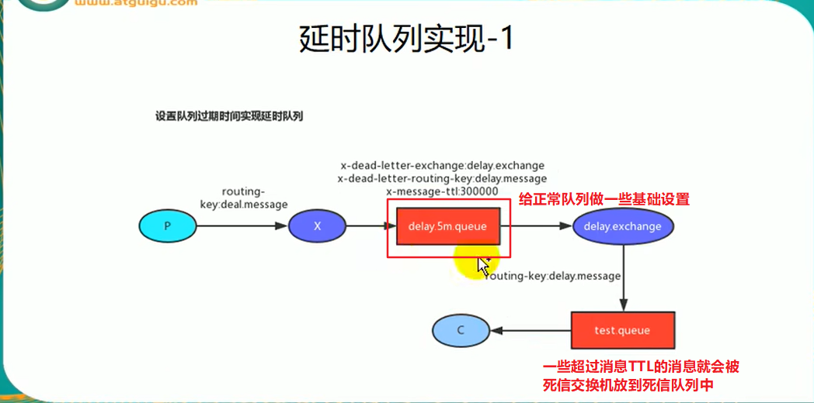

（2）在生产者发送消息的时候，给每条消息单独设置ttl，由于RabbitMQ使用一种懒处理的方式，这样的设置会有比较大的时间误差

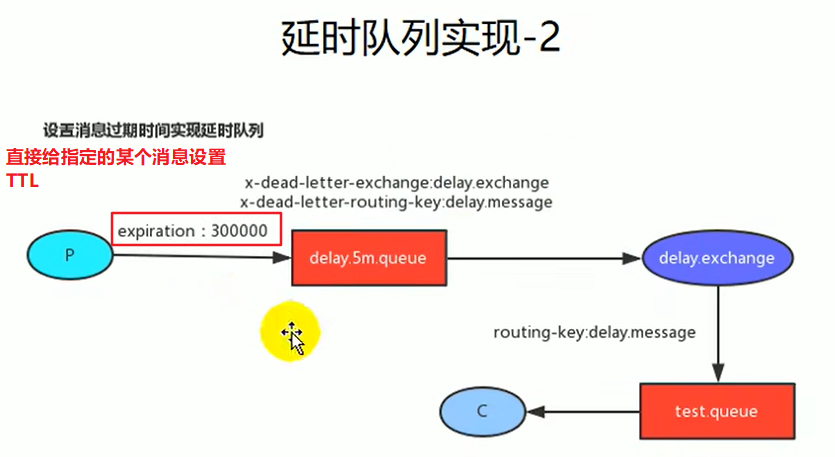

## 三、SpringBoot整合RabbitMQ


Spring对RabbitMQ的支持

+ Spring-rabbit提供了对遵循AMQP协议消息中间件的支持
+ 需要ConnectionFactory的实现来连接消息代理
+ 提供RabbitTemplate来发送消息
+ @RabbitListener注解在方法上监听消息代理发布的消息
+ @EnableRabbit开启支持

Springboot自动配置

+ RabbitAutoConfiguration
+ 这个自动配置类会为容器种注入RabbitTemplate，AmqpAdmin，CachingConnectionFactory（RabbitMQ的连接工厂）等

AmqpAdmin的使用：

```java
@Autowired   
AmqpAdmin amqpAdmin;

@Test
public void createExchange() {
	//创建一个直接类型的交换机
    /*
    需要的参数：
    	String name: 交换机的名字
    	boolean durable: 交换机是否持久化
    	boolean autoDelete: 是否自动删除
    	Map<String, Object> arguments: 需要的一些参数
    */
    DirectExchange directExchange = new DirectExchange("hello.java.exchange", true, false, null);
    amqpAdmin.declareExchange(directExchange) //声明一个交换机，需要传入一个Exchange接口
}

@Test
public void createQueue() {
    //创建一个队列
    /*
    需要参数：
    	String name: 队列的名字
    	boolean durable: 是否持久化
    	boolean exclusive: 是否是连接独占的，也就是是不是一条连接只能连接一个队列，一般都不是
    	boolean autoDelete: 是否自动删除
    	Map<String, Object> arguments: 携带的参数
    */
    Queue queue = new Queue("hello.java.queue", true, false, true, null);
    amqpAdmin.declareQueue(queue);
}

@Test
public void createBinding() {
    //创建队列和交换机的绑定关系
    /*
    需要参数：
    	String destination: 目的地
    	DestinationType destinationType: 目的地类型
    	String exchange: 待绑定的交换机
    	String routingKey: 路由键
    	Map<String, Object> arguments: 携带的参数
    将exchange(交换机的名称)指定的交换机与destination目的地(交换机或者队列的名称)进行绑定，目的地可以是交换机也可以是队列
    */
    Binding bind = new Binding("hello.java.queue", DestinationType.QUEUE, "hello.java.exchange", "hello.java", null);
    amqpAdmin.declareBinding(bind);
}
```

RabbitTemplate的使用

```java
@Autowired
RabbitTemplate rabbitTemplate;

@Test
public void sendMessage() {
    //测试发送消息
    /*
    需要参数：
    	String exchange: 发送给的交换机名称
    	String routingKey: 消息携带的路由键
    	Object message: 发送的消息，发送的消息需要实现Serializable接口，也可以转成json数据传送
    如果想要消息能够接收或者发送json数据，就需要给容器中放一个json数据的转换器
    可以在配置类中直接添加一个
    @Bean
    public MessageConvert messageConvert(){
 		return new Jackson2JsonMessageConvert();
 	}    
 */
    rabbitTemplate.convertAndSend("hello.java.exchange", "hello.java", "hello world!");   //这个方法可以发送任何类型的消息
}
```


### 3.1 pom.xml

```xml
<?xml version="1.0" encoding="UTF-8"?>
<project xmlns="http://maven.apache.org/POM/4.0.0" xmlns:xsi="http://www.w3.org/2001/XMLSchema-instance"
         xsi:schemaLocation="http://maven.apache.org/POM/4.0.0 https://maven.apache.org/xsd/maven-4.0.0.xsd">
    <modelVersion>4.0.0</modelVersion>
    <groupId>com.rabbitmq</groupId>
    <artifactId>demo02</artifactId>
    <version>0.0.1-SNAPSHOT</version>
    <name>demo02</name>
    <description>demo02</description>

    <properties>
        <java.version>1.8</java.version>
        <project.build.sourceEncoding>UTF-8</project.build.sourceEncoding>
        <project.reporting.outputEncoding>UTF-8</project.reporting.outputEncoding>
        <spring-boot.version>2.3.7.RELEASE</spring-boot.version>
    </properties>

    <dependencies>
        <dependency>
            <groupId>org.springframework.boot</groupId>
            <artifactId>spring-boot-starter-amqp</artifactId>
        </dependency>
        <dependency>
            <groupId>org.springframework.boot</groupId>
            <artifactId>spring-boot-starter-web</artifactId>
        </dependency>
        <dependency>
            <groupId>com.alibaba</groupId>
            <artifactId>fastjson</artifactId>
            <version>1.2.72</version>
        </dependency>

        <dependency>
            <groupId>org.springframework.boot</groupId>
            <artifactId>spring-boot-devtools</artifactId>
            <scope>runtime</scope>
            <optional>true</optional>
        </dependency>
        <dependency>
            <groupId>org.projectlombok</groupId>
            <artifactId>lombok</artifactId>
            <optional>true</optional>
        </dependency>

        <dependency>
            <groupId>io.springfox</groupId>
            <artifactId>springfox-swagger2</artifactId>
            <version>2.10.5</version>
        </dependency>

        <dependency>
            <groupId>org.springframework.boot</groupId>
            <artifactId>spring-boot-starter-test</artifactId>
            <scope>test</scope>
            <exclusions>
                <exclusion>
                    <groupId>org.junit.vintage</groupId>
                    <artifactId>junit-vintage-engine</artifactId>
                </exclusion>
            </exclusions>
        </dependency>
        <dependency>
            <groupId>org.springframework.amqp</groupId>
            <artifactId>spring-rabbit-test</artifactId>
            <scope>test</scope>
        </dependency>
    </dependencies>

    <dependencyManagement>
        <dependencies>
            <dependency>
                <groupId>org.springframework.boot</groupId>
                <artifactId>spring-boot-dependencies</artifactId>
                <version>${spring-boot.version}</version>
                <type>pom</type>
                <scope>import</scope>
            </dependency>
        </dependencies>
    </dependencyManagement>

    <build>
        <plugins>
            <plugin>
                <groupId>org.apache.maven.plugins</groupId>
                <artifactId>maven-compiler-plugin</artifactId>
                <version>3.8.1</version>
                <configuration>
                    <source>1.8</source>
                    <target>1.8</target>
                    <encoding>UTF-8</encoding>
                </configuration>
            </plugin>
            <plugin>
                <groupId>org.springframework.boot</groupId>
                <artifactId>spring-boot-maven-plugin</artifactId>
                <version>2.3.7.RELEASE</version>
                <configuration>
                    <mainClass>com.rabbitmq.demo02.Demo02Application</mainClass>
                </configuration>
                <executions>
                    <execution>
                        <id>repackage</id>
                        <goals>
                            <goal>repackage</goal>
                        </goals>
                    </execution>
                </executions>
            </plugin>
        </plugins>
    </build>

</project>

```

### 3.2 application.yml

```yml
spring:
  rabbitmq:
    host: 127.0.0.1
    port: 5672
    username: admin
    password: 123456
```

### 3.3 代码

队列示例：

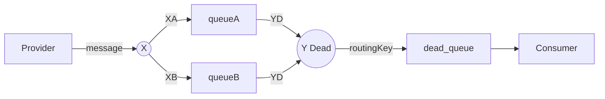


**配置类**

```java
/** RabbitMq延迟队列配置
 * @author ProgZhou
 * @createTime 2022/04/21
 */
@Configuration
public class RabbitMqTtlQueueConfig {

    //普通交换机的名称
    public static final String NORMAL_EXCHANGE = "X_normal_exchange";
    //死信交换机的名称
    public static final String DEAD_EXCHANGE = "Y_dead_exchange";

    //普通队列名称
    public static final String NORMAL_QUEUE_1 = "Qa_normal_queue";
    public static final String NORMAL_QUEUE_2 = "Qb_normal_queue";

    //死信队列名称
    public static final String DEAD_QUEUE = "Qd_dead_queue";

    //声明普通交换机
    @Bean("xExchange")
    public DirectExchange getExchange_x(){
        return new DirectExchange(NORMAL_EXCHANGE);
    }

    //声明死信交换机
    @Bean("yExchange")
    public DirectExchange getExchange_y(){
        return new DirectExchange(DEAD_EXCHANGE);
    }

    //声明普通队列
    @Bean("normalQueue_a")
    public Queue normalQueue_a(){
        Map<String, Object> map = new HashMap<>();
        //设置死信交换机
        map.put("x-dead-letter-exchange", DEAD_EXCHANGE);
        //设置死信routingKey
        map.put("x-dead-letter-routing-key", "YD");
        //设置TTL
        map.put("x-message-ttl", 10000);

        return QueueBuilder.durable(NORMAL_QUEUE_1).withArguments(map).build();
    }
    //声明普通队列
    @Bean("normalQueue_b")
    public Queue normalQueue_b(){
        Map<String, Object> map = new HashMap<>();
        //设置死信交换机
        map.put("x-dead-letter-exchange", DEAD_EXCHANGE);
        //设置死信routingKey
        map.put("x-dead-letter-routing-key", "YD");
        //设置TTL
        map.put("x-message-ttl", 40000);

        return QueueBuilder.durable(NORMAL_QUEUE_2).withArguments(map).build();
    }

    //声明死信队列
    @Bean("deadQueue")
    public Queue deadQueue(){
        return QueueBuilder.durable(DEAD_QUEUE).build();
    }

    //交换机与队列绑定
    @Bean
    public Binding queueBindAX(@Qualifier("normalQueue_a") Queue Qa,
                               @Qualifier("xExchange") DirectExchange x){
        return BindingBuilder.bind(Qa).to(x).with("XA");
    }
    @Bean
    public Binding queueBindBX(@Qualifier("normalQueue_b") Queue Qb,
                               @Qualifier("xExchange") DirectExchange x){
        return BindingBuilder.bind(Qb).to(x).with("XB");
    }

    //绑定死信交换机与死信队列
    @Bean
    public Binding queueBindDY(@Qualifier("deadQueue") Queue Qd,
                               @Qualifier("yExchange") DirectExchange y){
        return BindingBuilder.bind(Qd).to(y).with("YD");
    }


}
```

消费者

```java
/** 消费者
 * @author ProgZhou
 * @createTime 2022/04/21
 */
@Component
@Slf4j
public class DeadLetterQueueConsumer {

    @RabbitListener(queues = "Qd_dead_queue")
    public void receiveD(Message message, Channel channel){
        String msg = new String(message.getBody());
        log.info("当前时间: {}, 收到死信队列的消息: {}", new Date(), msg);
    }

}
```

生产者  --- Controller

```java
/** 在一般情况下，生产者由web发送消息
 * @author ProgZhou
 * @createTime 2022/04/21
 */
@Slf4j
@RestController
@RequestMapping("/ttl")
public class SendMessageController {

    @Autowired
    RabbitTemplate rabbitTemplate;


    //发消息
    @GetMapping("/send/{message}")
    public void sendMessage(@PathVariable("message") String message){
        log.info("当前时间：{}, 发送一个消息给两个TTL队列:{}", new Date(), message);

        rabbitTemplate.convertAndSend("X_normal_exchange", "XA", "10s " + message);
        rabbitTemplate.convertAndSend("X_normal_exchange", "XB", "40s " + message);

    }

}
```

测试结果：消息为abcd


### 3.4 springboot整合RabbitMQ总结

**AmqpAdmin**

AmqpAdmin是springboot提供的一个操作rabbitmq的组件

+ 可以创建交换机，队列，绑定关系等
+ 可以发送消息

```java
@Autowired
private AmqpAdmin amqpAdmin;

@Test
void createExchange() {
    //创建一个直接交换机
    //参数：name, durable(是否持久化，一般为true), autoDelete(是否自动删除，一般为false), Map<String, Object>(携带参数，可以没有)
    DirectExchange directExchange = new DirectExchange("hello-java-exchange", true, false, null);
    amqpAdmin.declareExchange(directExchange);
    log.info("Exchange[{}]创建成功", directExchange.getName());
}

@Test
void createQueue() {
    //创建一个队列
    //参数：name, durable(是否持久化), exclusive(是否排他，如果是，只有当前连接能够获取队列中的消息，一般为false), autoDelete(是否自动删除), argument(携带参数)
    Queue queue = new Queue("hello-java-queue", true, false, true, null);
    amqpAdmin.declareQueue(queue);
    log.info("Queue[{}]创建成功", queue.getName());
}

@Test
void createBinding() {
    //创建队列与交换机的绑定关系
    //参数：destination(目的地)
    //destinationType(目的地类型)，可以是队列和交换机
    //exchange(交换机名称)
    //routingKey(路由键)
    //argument(参数)
    Binding binding = new Binding("hello-java-queue", Binding.DestinationType.QUEUE,
            "hello-java-exchange", "hello.java", null);  //将exchange交换机与指定的目的地进行绑定，使用routingKey作为路由键
    amqpAdmin.declareBinding(binding);
    log.info("Binding[{}]创建成功", binding.getRoutingKey());
}
```

**RabbitTemplate**

用于发送消息，一般需要配置一个消息转换器，默认采用Java序列化机制进行消息转换，可以在配置类中配置json的消息转换器

如果用于发送对象，对象所属的类必须实现Serializable接口

```java
@Test
    void sendMessage() {
        //发送消息
        //exchange: 交换机名称
        //routingKey: 消息携带的路由键
        //object: 消息内容，可以是任意对象
//        rabbitTemplate.convertAndSend("hello-java-exchange", "hello.java", "hello world!");
//        log.info("消息{}发送成功", "hello world!");     //发送字符串

        Student student = new Student();  //如果要发送对象，对象需要实现Serializable接口
        student.setName("Lucy");
        student.setNumber("123456");
        student.setGrade("86.5");
        rabbitTemplate.convertAndSend("hello-java-exchange", "hello.java", student);
        log.info("消息{}发送成功", student);   //发送任意对象
    }
```

**@RabbitListener和@RabbitHandler**

这两个注解通常用来接收消息

+ `@RabbitListener`注解可以标在类和方法上
  + `queues`：表示方法或者类监听的队列，可以监听多个队列
+ `@RabbitHandler`只能标在方法上

```java
/*
* 使用@RabbitListener注解接收消息
* @RabbitListener能标在类上和方法上
* 收到的消息类型为org.springframework.amqp.core.Message
* 可以只写这个类型，直接接收消息
* 如果确定消息的类型，也可以直接在方法的参数中添加，接收到的消息会自动转换为指定的类型
* 还能够写一个参数，Channel(amqp核心包下)，即连接建立后的通道
*
* 消息队列中的队列可以有多个服务监听，但最终接收到消息的服务只有一个
* 场景：微服务下，某一个服务肯定会启动多个，比如商城项目中的订单服务
* 现在，订单服务被部署在了三台服务器上，这三台服务器同时监听rabbitmq
* 结果：(1). 消息会分配到三个订单服务中去，但每一个消息只会被一个服务接收
*      (2). 并且每一个服务，只有把刚刚接收到的消息处理完之后，才能够接收下一个消息
*
*
* 接收消息还有一个注解：@RabbitHandler
* 这个注解只能标在方法上，可以配合@RabbitListener
* 使得一个类下的不同方法接收不同消息类型的消息
* 比如：
* @RabbitListener(queues = {"hello-java-queue"})   //整个类下的方法监听hello-java-queue的队列中的消息
* public class OrderService {
*
*       @RabbitHandler   //这个方法接收消息体类型为OrderEntity的消息
*       public void receiveMessage1(OrderEntity orderEntity) {
*           ....
*       }
*
*       @RabbitHandler   //这个方法接收消息体类型为OrderRefund的消息
*       public void receiveMessage2(OrderRefund orderFund) {
*           ...
*       }
*
* }
* */
@RabbitListener(queues = {"hello-java-queue"})    //监听队列接收消息
//@RabbitHandler
public void receive(Object object, Student student, Channel channel) {
    //接收到的消息是amqp核心包下的Message
    Message message = (Message) object;
    byte[] body = message.getBody();   //消息体，即消息的内容
    MessageProperties messageProperties = message.getMessageProperties();  //消息的属性，即消息头
    log.info("接收到消息的内容: {}", object);
    log.info("消息的内容: {}", student);
    
    log.info("处理消息...");
    
    try {
        long deliveryTag = messageProperties.getDeliveryTag();  //确认消息的分配标志 
        //消息处理完成之后需要向消息队列发送确认
        channel.basicAck(deliveryTag, false);
        log.info("消息已处理完成...");
    } catch (Exception e) {
        
    }
}
```


## 总结：RabbitMQ相关总结

### MQ的常见问题

+ 消息可靠性问题：由于网络的原因，消息不能保证百分之百到达目的地，如何确保消费者发送的消息至少被消费一次
+ 延迟消息问题：有些业务需要消息在指定时间发送和消费，如何实现消息的延迟投递
+ 消息堆积问题：当消费者处理消息的效率不高，在一些高并发的情况下，如何解决消息对接问题
+ 高可用问题：服务之间的通信高度依赖消息队列，如何避免单点的MQ故障而导致的不可用问题

### 消息可靠性问题

消息丢失的情况：

+ 发送时丢失：
  + 生产者发送的消息未送达交换机，即发送阶段一出现消息丢失的情况
  + 消息到达交换机，交换机在转发的过程中消息丢失，即发送阶段二出现消息丢失的情况
+ MQ宕机导致的消息丢失：消息成功到达队列中，但消息队列宕机，消息丢失（RabbitMQ基于内存存储）
+ 消费者接收到消息后未处理完成即宕机，即消费阶段的消息丢失

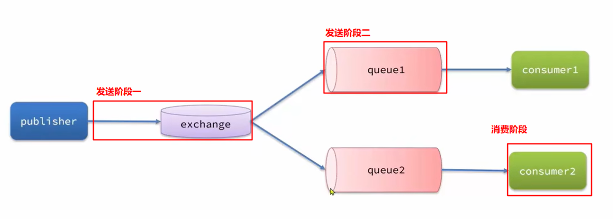

**生产者消息确认**

RabbitMQ提供了publisher confirm机制来避免消息发送到MQ过程中丢失，消息发送到MQ以后，会返回一个结果给发送者，表示消息是否投递成功：

+ `publisher-confirm`发送者确认
  + 消息成功投递到队列时，发送ack确认
  + 消息未投递到交换机，发送nack
+ `publisher-return`发送者回执
  + 消息投递到交换机了，向生产者发送ack，如果后续没有到达队列，则会返回消息失败投递失败的原因

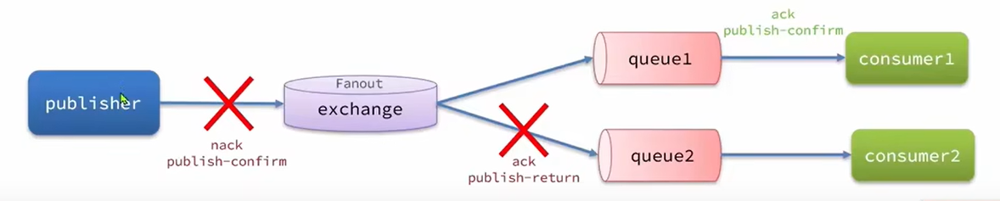

消息队列在给生产者返回回执的时候，会携带一个消息的唯一标识，表示哪条消息投递成功或者失败了，方便生产者后续的处理

**SpringAMQP对消息确认机制的实现**

（1）首先要在项目配置文件中添加确认机制

```yml
spring:
  rabbitmq:
    host: localhost
    port: 5672
    virtual-host: /demo2
    username: guest
    password: guest
    publisher-confirm-type: correlated
    publisher-returns: true    #开启消息的returnCallback，默认关闭
    template:
      mandatory: true
```

+ `publish-confirm-type`开启publisher-confirm，支持两种类型：
  + simple：同步等待确认结果，直到超时
  + correlated：异步回调，定义ConfirmCallback，MQ返回结果时会回调这个ConfirmCallback
+ `publish-returns`开启publish-return功能，同样是基于回调机制，ReturnCallback
+ `template.mandatory`定义消息路由失败时的策略，true调用ReturnCallback；false直接将消息丢弃

（2）ReturnCallback，每个RabbitTemplate只能配置一个ReturnCallback，可以在项目加载的时候配置

```java
@Configuration
@Slf4j
public class CommonConfig implements ApplicationContextAware {  //在项目启动时运行

    //returnCallback一个RabbitTemplate只能有一个
    @Override
    public void setApplicationContext(ApplicationContext applicationContext) throws BeansException {
        RabbitTemplate rabbitTemplate = applicationContext.getBean(RabbitTemplate.class);
        rabbitTemplate.setReturnCallback((message, replyCode, replyText, exchange, routingKey) ->
                log.debug("消息未成功到达队列，响应码: {}, 原因: {}, 交换机: {}, 路由键: {}, 消息: {}",
                replyCode, replyText, exchange, routingKey, message));
        //后续步骤，如果有需要可以进行消息的重发
    }
}
```

（3）ConfirmCallback，确认，如果消息平安到达目标队列中，即返回ack，如果消息从生产者发送到交换机时出错，则返回nack

ConfirmCallback可以在消息发送的时候配置

```java
@Test
public void testSendMessage2SimpleQueue() throws InterruptedException {
    String routingKey = "csimple.test";
    String message = "hello, spring amqp!";
    //uuid为消息的唯一标识
    CorrelationData correlationData = new CorrelationData(UUID.randomUUID().toString());
    //添加回调函数，两个回调，一个发送成功的回调，一个发送失败的回调
    correlationData.getFuture().addCallback(confirm -> {
        if(confirm.isAck()) {
            log.info("消息成功投递到交换机，消息id: {}", correlationData.getId());
        } else {
            log.debug("消息投递到交换机失败，消息id: {}", correlationData.getId());
        }
    }, throwable -> log.debug("消息发送失败: {}", throwable.toString()));
    rabbitTemplate.convertAndSend("amq.topic", routingKey, message, correlationData);
}
```

> 另一种配置的方式，在配置类中配置：
>
> ```java
> @Autowired
> private RabbitTemplate rabbitTemplate;
> 
> //定制RabbitTemplate，配置confirmCallback和returnCallback
> @PostConstruct
> public void initRabbitTemplate() {
>     rabbitTemplate.setConfirmCallback(new RabbitTemplate.ConfirmCallback() {
>         /**
>          * 设置生产者端消息回调，只要消息成功投递到交换机就回调
>          * @param correlationData 消息的唯一id
>          * @param ack 消息发送是否成功
>          * @param cause  消息发送失败的原因
>          */
>         @Override
>         public void confirm(CorrelationData correlationData, boolean ack, String cause) {
>             if(ack) {
>                 log.info("消息发送成功！消息唯一id: {}", correlationData);
>             } else {
>                 log.info("消息发送失败，消息唯一id: {}, 消息发送失败的原因: {}", correlationData, cause);
>             }
>         }
>     });
> 
>     //如果消息没有投递到指定的队列，就触发此回调
>     rabbitTemplate.setReturnCallback(new RabbitTemplate.ReturnCallback() {
>         /**
>          *
>          * @param message 投递失败的消息
>          * @param replyCode 回复的状态码
>          * @param replyText 回复的文本内容
>          * @param exchange 消息发给了哪个交换机
>          * @param routingKey 指定的路由键
>          */
>         @Override
>         public void returnedMessage(Message message, int replyCode, String replyText, String exchange, String routingKey) {
>             log.info("投递失败的消息: {}, 状态码: {}, 失败原因: {}, 目标交换机: {}, 消息的routing key: {}",
>                     message, replyCode, replyText, exchange, routingKey);
>         }
>     });
> }
> ```


**消息持久化**

消息丢失的另一个重要原因是，RabbitMQ是基于内存存储的，如果重启的话就会导致消息的丢失，一个好的办法就是将消息和队列设置为可持久化的，类似于Redis的持久化机制，等到RabbitMQ重启的时候，消息可以恢复到队列中

（1）交换机持久化：在声明交换机的时候，添加一个参数即可

```java
@Bean  //创建一个持久化队列
public Exchange directExchange() {
    //第二个参数即表示是否持久化
    //第三个参数是是否自动删除，如果与这个交换机绑定的队列全部被删除了，这个交换机是否需要自动删除，一般都为false
    return new DirectExchange( "durable.simple.exchange", true, false);
}
```

（2）队列持久化：在声明队列的时候也添加一个持久化参数

```java
@Bean
public Queue durableQueue() {
    return new Queue("durable.queue", true);
}
```

默认情况下，一般声明的交换机和队列都是持久化的

（3）消息持久化：在发送消息的时候，指定消息为持久化消息

```java
@Test
    public void testDurableMessage() {
        String routingKey = "durable.test";
        String message = "test durable message";
        Message msg = MessageBuilder.withBody(message.getBytes(StandardCharsets.UTF_8))
                .setDeliveryMode(MessageDeliveryMode.PERSISTENT)
                .build();
        rabbitTemplate.convertAndSend("durable.simple.exchange", routingKey, msg);
    }
```

**消费者消息确认**

消息最终会被消费者消费，但也不能保证消费者一定能够正常消费消息，如果不做任何处理，消费者在处理消息的时候发生异常，消息就会被丢弃，这显然是一种不安全的方案，所以RabbitMQ支持消费者确认机制，即消费者处理消息后可以向MQ发送ack确认，MQ收到ack确认之后才会将消息从队列中删除，SpringAMQP允许配置三种确认模式：

+ manaul：手动ack，需要在业务代码执行结束之后，调用自己编写的api发送ack
+ auto：自动ack，由spring监测listener代码是否出现异常，没有异常则返回ack，抛出异常则返回nack（由AOP完成）
+ none：关闭ack，MQ将消息投递给消费者之后直接删除

如果想要使用SpringAMQP的消费者确认机制，需要在配置文件（消费者端）中开启消费者确认机制

```yml
spring:
  rabbitmq:
    host: localhost   
    port: 5672
    virtual-host: /demo2
    username: guest
    password: guest
    listener:
      simple:
        prefetch: 1   #消息预取的处理
        acknowledge-mode: auto
```

**消费者失败重试**

消费者消息处理失败，默认情况下MQ会将消息重新入队，也就是说消费者仍然可以从队列中获取消息并处理，然后又失败又入队，陷入一个死循环，这会导致MQ的消息处理飙升，给MQ带来巨大的压力

所以Spring也提供了消息失败的重试机制，当消费者出现异常时，利用本地重试而不是无限制的重新入队到MQ中，也需要对配置文件进行一定的修改

```yml
spring:
  rabbitmq:
    host: localhost
    port: 5672
    virtual-host: /demo2
    username: guest
    password: guest
    listener:
      simple:
        prefetch: 1.
        acknowledge-mode: auto
      direct:
        retry:   #重试机制
          enabled: true   #开启消费者失败重试
          initial-interval: 1000   #初次失败之后等待多少ms之后进行重试
          multiplier: 3   #下次失败的等待时长的倍数，比如第一次失败等待1s重试，下次就需要等待3s，再下次需要等待9s以此类推
          max-attempts: 4  #最大重试次数，如果重试了这么多次还没成功，默认会直接丢弃消息
```

在SpringAMQP中还能够配置消息消费失败之后的策略，默认是丢弃消息：

+ `RejectAndDontRequeueRecoverer`重试耗尽之后，直接拒绝消息，丢弃
+ `ImmediateRequeueMessageRecoverer`重试耗尽后，返回nack，消息重新入队
+ `RepublishMessageRecoverer`重试耗尽之后，将消息投递到指定的交换机

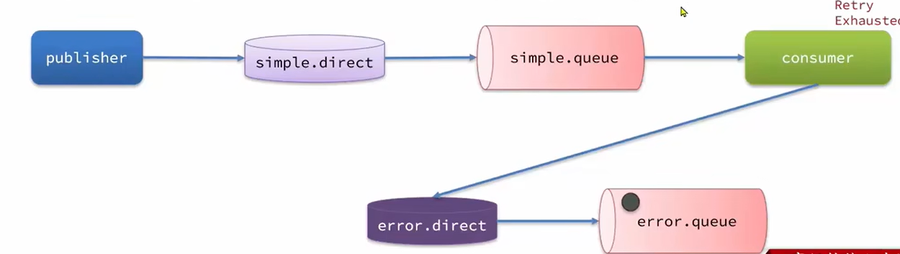

一般可以采用最后一种，在消息队列中声明专门用于转发处理失败消息的交换机和存放消息的队列

```java
//声明专门转发处理失败消息的交换机
@Bean
public Exchange errorExchange() {
	return new DirectExchange("error.message.exchange", true, false);
}

//声明专门存放错误消息的队列
@Bean
public Queue errorQueue() {
    return new Queue("error.queue", true);
}

//绑定关系
@Bean
public Binding errorQueueBinding() {
    return new Binding("error.queue", Binding.DestinationType.QUEUE,
            "error.message.exchange", "error.msg", null);
}

//消费者消息处理失败之后的策略
@Bean
public MessageRecoverer messageRecoverer(RabbitTemplate rabbitTemplate) {
    return new RepublishMessageRecoverer(rabbitTemplate, "error.message.exchange", "error.msg");
}
```

### 延迟消息

死信：当一个队列中的消息满足下列情况之一时，就称为死信

+ 消费者处理消息失败，并且消息的requeue参数设置为false
+ 消息是一个过期消息，超时无人消费
+ 要投递的队列消息堆积满了，最早的消息可能成为死信

如果队列配置了dead-letter-exchange属性，指定了一个交换机，那么队列中的死信就会投递到这个交换机中，而这个交换机就称为死信交换机

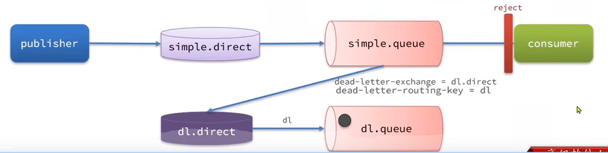

TTL，即消息的存活时间，如果队列中的消息在TTL结束时仍未被消费，则会变为死信，ttl超时分为两种情况：

+ 消息所在的队列设置了存活时间
+ 消息本身设置了存活时间
+ 如果两者都由，取小的那个

利用延迟队列结合死信交换机，就可以实现消息发出之后，消费者延迟收到消息的效果，这种消息模式就称为延迟队列模式

延迟队列的使用场景包括：

+ 延迟发送短信
+ 用户下单，在几分钟内未支付，则自动取消

（1）创建普通交换机和普通队列

```java
@Configuration
public class TTLMessageConfig {

    @Bean
    public Exchange ttlExchange() {
        return new DirectExchange("ttl.direct", true, false);
    }

    @Bean
    public Queue ttlQueue() {
        return QueueBuilder.durable("ttl.queue")
                .ttl(10000)   //延迟时间10s
                .deadLetterExchange("dl.direct")
                .deadLetterRoutingKey("dl")
                .build();
    }

    @Bean
    public Binding ttlBinding() {
        return new Binding("ttl.queue", Binding.DestinationType.QUEUE,
                "ttl.direct", "ttl",null);
    }

}
```

（2）创建延迟交换机和延迟队列，可以直接在消费者中创建

```java
@RabbitListener(bindings = @QueueBinding(
        value = @Queue(name = "dl.queue", durable = "true"),
        exchange = @Exchange(name = "dl.direct"),
        key = "dl"
))   //这种方式编写的RabbitListener注解也可以有创建队列和交换机的功能
public void listenTTLQueue(String message) {
    log.info("消费者收到了延迟消息: {}", message);
}
```

> 本质上，延迟队列和延迟交换机是普通的交换机和队列

### 消息堆积问题

当生产者发送消息的速度超过了消费者处理消息的速度，就会导致队列中的消息堆积，直到队列存储消息达到上限，最早接收到的消息可能就会成为死信，默认会被丢弃，在一些消息比较重要的场合是不允许出现的

一般解决消息堆积有三种主要思路：

+ 增加更多的消费者，提高消息消费的速度
+ 在消费者内开启线程池，多线程加快消息处理速度
+ 扩大队列的容积，提高堆积上限

**惰性队列**

从RabbitMQ3.6.0版本开始，就增加了惰性队列的概念，特征有：

+ 接收到的消息直接存入磁盘而非内存
+ 消费者要接收消息时才会从磁盘中读取并加载到内存（时间就会消耗的比较多）
+ 支持数百万消息的存储（取决于磁盘大小）
