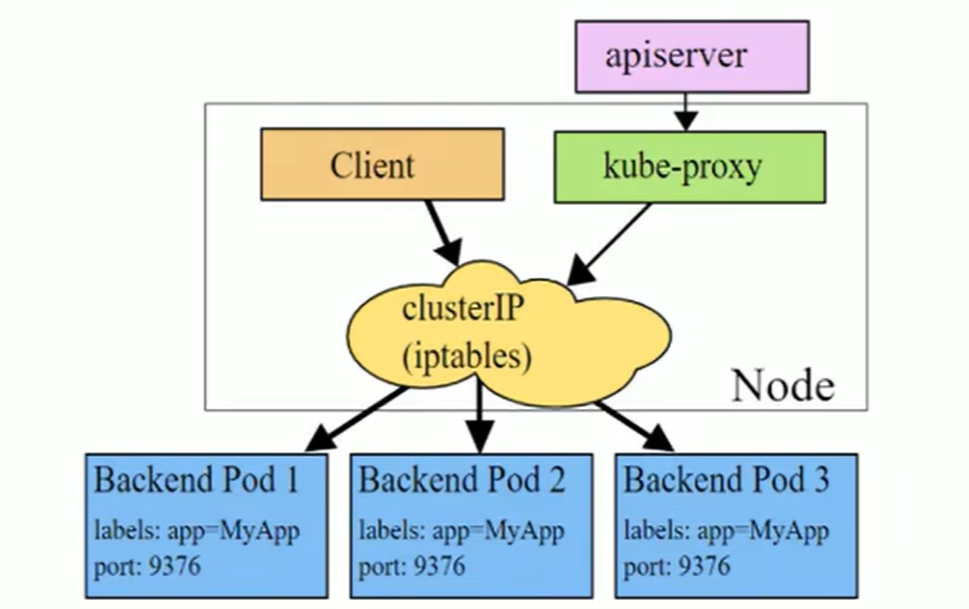

# K8s

## 一、基本概念-K8s简介

### 1. 应用部署方式


+ 传统部署方式：所有应用都部署在一台服务器上
+ 虚拟机部署方式：在一套硬件设备上模拟多个虚拟机，分别部署不同的应用服务
+ 容器化部署方式：将应用打成一个个容器镜像(docker)，以容器的形式部署

当部署的服务很大，比如由几百个容器组成，这就需要有一个对大量容器的统一的管理系统，即容器编排系统，k8s即是这样的作用

### 2. k8s的特性

k8s具有以下特性：

+ **服务发现和负载均衡**：k8s可以使用DNS名称或自己的IP地址公开容器，如果进入容器的流量很大，k8s可以负载均衡并分配网络流量，从而使部署稳定
+ **存储编排**：k8s允许自动挂载选择的存储系统，如本地存储，公有云提供商等
+ **自动部署和回滚**：可以使用k8s描述已部署容器的所需状态，它可以以受控的速率将实际状态更新为期望状态。比如容器上部署的服务为A版本，现在即将部署B版本，但是B版本本身有bug，现网不可用，k8s支持服务的回滚，将服务重置为A版本
+ **自动完成装箱计算**：k8s允许部署者指定每个容器所需的CPU和内存，当容器指定了资源请求时，k8s可以做出更好的决策来管理容器的资源
+ **自我修复**：k8s可以重新启动失败的容器，替换容器，杀死不响应用户定义的运行状况检查的容器
+ **弹性伸缩**：可以根据需要，自动对集群中正在运行的容器数量进行调整

k8s提供了一个可弹性运行分布式系统的框架，满足用户的扩展需求、故障转移、部署模式等

### 3. k8s的组件架构

一个k8s集群主要是由控制节点(master) 和工作节点(node)构成，每个几点上都会安装不同的组件

控制节点负责集群的决策

工作节点负责为容器提供运行环境


结构介绍：

+ **API Server: **资源操作的唯一入口，接受用户输入的命令，提供认证，授权，API注册和发现等机制
+ **Controller Manager: **集群的决策者，负责维护集群的状态，比如程序部署安排，故障检测，自动扩展，滚动更新等
+ **ETCD: **k-v数据存储结构，存储整个集群的工作数据，负责存储集群中各种资源对象的信息
+ **Kubelet: **负责维护容器的生命周期，即通过控制容器化组件，来创建，更新，销毁容器
+ **Kube-proxy: **所有工作节点的访问入口，负责提供集群内部的服务发现和负载均衡
+ **Scheduler: **调度者，将服务分配给具体的工作节点，负责集群资源调度，按照预定的调度策略将pod调度到相应的node节点上

### 4. 部署k8s集群

> 每个机器的集群需要有docker的环境

+ 每个节点机器需要2G或者更多的内存
+ 每台机器需要至少2核CPU
+ 集群中的所有机器的网络彼此均能相互连通

前置操作

```powershell
#各个机器设置自己的主机名称
hostnamectl set-hostname master
#重启生效
reboot
#每台机器设置公网ip对应的主机名称
cat >> /etc/hosts << EOF
公网ip hostname
EOF
#重启网络
systemctl restart NetworkManager.service

# 开启ip转发
echo "1" >> /proc/sys/net/ipv4/ip_forward 
# 将 SELinux 设置为 permissive 模式（相当于将其禁用）
sudo setenforce 0
sudo sed -i 's/^SELINUX=enforcing$/SELINUX=permissive/' /etc/selinux/config

#关闭swap
swapoff -a  
sed -ri 's/.*swap.*/#&/' /etc/fstab

#允许 iptables 检查桥接流量
cat <<EOF | sudo tee /etc/modules-load.d/k8s.conf
br_netfilter
EOF
	
cat <<EOF | sudo tee /etc/sysctl.d/k8s.conf
net.bridge.bridge-nf-call-ip6tables = 1
net.bridge.bridge-nf-call-iptables = 1
EOF
sudo sysctl --system
	
# 开启内核支持
cat >> /etc/sysctl.conf << EOF
net.ipv4.ip_forward = 1
net.bridge.bridge-nf-call-iptables = 1
net.bridge.bridge-nf-call-ip6tables = 1
EOF
	
sysctl -p
	
# 开启ipvs支持
yum -y install ipvsadm  ipset

#永久生效
cat > /etc/sysconfig/modules/ipvs.modules <<EOF
modprobe -- ip_vs
modprobe -- ip_vs_rr
modprobe -- ip_vs_wrr
modprobe -- ip_vs_sh
modprobe -- nf_conntrack_ipv4
EOF
```


在每台机器上配置k8s的yum源地址 安装 kubelet、kebeadm、kubectl

```powershell
# 配置 k8s 的 yum 源地址
cat <<EOF | sudo tee /etc/yum.repos.d/kubernetes.repo
[kubernetes]
name=Kubernetes
baseurl=http://mirrors.aliyun.com/kubernetes/yum/repos/kubernetes-el7-x86_64
enabled=1
gpgcheck=0
repo_gpgcheck=0
gpgkey=http://mirrors.aliyun.com/kubernetes/yum/doc/yum-key.gpg
   http://mirrors.aliyun.com/kubernetes/yum/doc/rpm-package-key.gpg
EOF
```

在每个节点的机器上执行yum install下载kubelet

```powershell
# 安装 kubelet、kubeadm、kubectl
yum install -y kubelet-1.20.9 kubeadm-1.20.9 kubectl-1.20.9 --disableexcludes=kubernetes

# 启动kubelet
systemctl enable --now kubelet

# 查看 kubelet 状态：一会停止 一会运行。 这个状态是对的，kubelet 等待 kubeadm 发号指令。
systemctl status kubelet
```

配置镜像

```powershell
# 配置镜像，生成 images.sh
sudo tee ./images.sh <<-'EOF'
#!/bin/bash
images=(
kube-apiserver:v1.20.9
kube-proxy:v1.20.9
kube-controller-manager:v1.20.9
kube-scheduler:v1.20.9
coredns:1.7.0
etcd:3.4.13-0
pause:3.2
)
for imageName in ${images[@]} ; do
docker pull registry.cn-hangzhou.aliyuncs.com/lfy_k8s_images/$imageName
done
EOF

# 拉取镜像
chmod +x ./images.sh && ./images.sh
```


云服务器搭建集群的重点：设置虚拟网卡

```powershell
cat > /etc/sysconfig/network-scripts/ifcfg-eth0:1 <<EOF
BOOTPROTO=static
DEVICE=eth0:1
IPADDR=各个节点的公网ip
PREFIX=32
TYPE=Ethernet
USERCTL=no
ONBOOT=yes
EOF
```

修改`kubelet`启动参数(每个节点执行)

```
# 此文件安装kubeadm后就存在了
vim /usr/lib/systemd/system/kubelet.service.d/10-kubeadm.conf

# 注意，这步很重要，如果不做，节点仍然会使用内网IP注册进集群
# 在末尾添加参数 --node-ip=公网IP

# Note: This dropin only works with kubeadm and kubelet v1.11+
[Service]
Environment="KUBELET_KUBECONFIG_ARGS=--bootstrap-kubeconfig=/etc/kubernetes/bootstrap-kubelet.conf --kubeconfig=/etc/kubernetes/kubelet.conf"
Environment="KUBELET_CONFIG_ARGS=--config=/var/lib/kubelet/config.yaml"
# This is a file that "kubeadm init" and "kubeadm join" generates at runtime, populating the KUBELET_KUBEADM_ARGS variable dynamically
EnvironmentFile=-/var/lib/kubelet/kubeadm-flags.env
# This is a file that the user can use for overrides of the kubelet args as a last resort. Preferably, the user should use
# the .NodeRegistration.KubeletExtraArgs object in the configuration files instead. KUBELET_EXTRA_ARGS should be sourced from this file.
EnvironmentFile=-/etc/sysconfig/kubelet
ExecStart=
ExecStart=/usr/bin/kubelet $KUBELET_KUBECONFIG_ARGS $KUBELET_CONFIG_ARGS $KUBELET_KUBEADM_ARGS $KUBELET_EXTRA_ARGS --node-ip=各个节点的公网ip
```

主节点初始化

```powershell
kubeadm init \
--apiserver-advertise-address=主节点公网ip \
--control-plane-endpoint=cluster-endpoint \
--image-repository registry.cn-hangzhou.aliyuncs.com/lfy_k8s_images \
--kubernetes-version v1.20.9 \
--service-cidr=10.96.0.0/16 \
--pod-network-cidr=192.168.0.0/16
```

```
##主节点初始化成功
Your Kubernetes control-plane has initialized successfully!

To start using your cluster, you need to run the following as a regular user:

  mkdir -p $HOME/.kube
  sudo cp -i /etc/kubernetes/admin.conf $HOME/.kube/config
  sudo chown $(id -u):$(id -g) $HOME/.kube/config

Alternatively, if you are the root user, you can run:

  export KUBECONFIG=/etc/kubernetes/admin.conf

You should now deploy a pod network to the cluster.
Run "kubectl apply -f [podnetwork].yaml" with one of the options listed at:
  https://kubernetes.io/docs/concepts/cluster-administration/addons/

You can now join any number of control-plane nodes by copying certificate authorities
and service account keys on each node and then running the following as root:

  kubeadm join k8s-master:6443 --token elkum0.ghbv2b4i2vmuzjl0 \
    --discovery-token-ca-cert-hash sha256:b17cf51f51bc0a7fd4e9442618487201816d5edf79d3272d1526744a02ebe29b \
    --control-plane 

Then you can join any number of worker nodes by running the following on each as root:

kubeadm join k8s-master:6443 --token elkum0.ghbv2b4i2vmuzjl0 \
    --discovery-token-ca-cert-hash sha256:b17cf51f51bc0a7fd4e9442618487201816d5edf79d3272d1526744a02ebe29b 
```


## 二、资源管理

### 2.1 基本介绍

在k8s中，所有内容都抽象都称为资源，用户需要通过操作资源来管理k8s

> k8s本质上就是一个集群系统，用户可以在集群中部署各种服务，所谓的部署服务，气质就是在k8s集群中运行一个个容器，并将指定的程序跑在容器中
>
> k8s的**最小管理单元是pod**而不是容器，所以只能将容器放在pod中，而k8s一般也不会直接管理pod，而是通过pod控制器来管理pod
>
> pod可以提供服务之后，就要考虑如何访问pod中的服务，k8s提供了service资源实现这个功能
>
> 当然，如果pod中程序的数据需要持久化，k8s还提供了各种存储系统

### 2.2 资源管理方式

**命令式对象管理：**直接使用命令取操作k8s的资源

```
#启动一个pod 用于运行nginx镜像
kubectl run nginx-pod --image=nginx:1.17.1 --port 
```

**命令式对象配置：**通过命令配置和配置文件去操作k8s的资源

```
#pod的配置编写在nginx-pod.yml中
kubectl create/patch -f nginx-pod.yml
```

**声明式对象配置：**通过apply命令和配置文件去操作k8s资源

```
kubectl apply -f nginx-pod.yml
```

### 2.3 命令式对象管理

kubectl是k8s集群的命令行工具，通过它能够对集群本身进行管理，并能够在集群上进行容器化应用的安装部署

```
kubectl [command] [resource-type] [resource-name] [flags]
```

+ **command：**指定要对资源执行的操作，例如：create，get，delete
+ **type：**指定资源类型，比如deployment，pod，service
+ **name：**指定资源的名称，名称大小写敏感
+ **flags：**指定额外的可选参数

例如：

```
#查看集群中所有的pod信息
kubectl get pod

#查看指定pod的信息
kubectl get pod [pod name]

#将信息以json或者yaml的格式展示
kubectl get pod [pod name] -o [yaml/json]
```

#### 2.3.1 command

k8s允许对资源进行多种操作，可以通过`kubectl --help`查看所有的命令操作

常用命令如下：

**基本命令**

| 命令    | 翻译 | 命令作用     |
| ------- | ---- | ------------ |
| create  | 创建 | 创建一个资源 |
| edit    | 编辑 | 编辑一个资源 |
| get     | 获取 | 获取一个资源 |
| patch   | 更新 | 更新一个资源 |
| delete  | 删除 | 删除一个资源 |
| explain | 解释 | 展示资源文档 |

**运行和调试命令**
| 命令      | 翻译     | 命令作用                   |
| --------- | -------- | -------------------------- |
| run       | 运行     | 在集群中运行一个指定的镜像 |
| expose    | 暴露     | 暴露资源为Service          |
| describe  | 描述     | 显示资源内部信息           |
| logs      | 日志     | 输出容器在Pod中的日志      |
| attach    | 缠绕     | 进入运行中的容器           |
| exec      | 执行     | 执行容器中的一个命令       |
| cp        | 复制     | 在Pod内外复制文件          |
| rollout   | 首次展示 | 管理资源的发布             |
| scale     | 规模     | 扩（缩）容Pod的数量        |
| autoscale | 自动调整 | 自动调整Pod的数量          |

**高级命令**
| 命令  | 翻译 | 命令作用               |
| ----- | ---- | ---------------------- |
| apply | 应用 | 通过文件对资源进行配置 |
| label | 标签 | 更新资源上的标签       |

**其他命令**
| 命令         | 翻译     | 命令作用                     |
| :----------- | -------- | ---------------------------- |
| cluster-info | 集群信息 | 显示集群信息                 |
| version      | 版本     | 显示当前Client和Server的版本 |

#### 2.3.2 type

kubernetes中所有的内容都抽象为资源，可以通过`kubectl api-resources`进行查看：

常用资源如下：

**集群级别的资源**
| 资源名称   | 缩写 | 资源作用     |
| ---------- | ---- | ------------ |
| nodes      | no   | 集群组成部分 |
| namespaces | ns   | 隔离Pod      |

**pod资源**
| 资源名称 | 缩写 | 资源作用 |
| -------- | ---- | -------- |
| Pods     | po   | 装载容器 |

**pod控制器资源**
| 资源名称                 | 缩写   | 资源作用    |
| ------------------------ | ------ | ----------- |
| replicationcontrollers   | rc     | 控制Pod资源 |
| replicasets              | rs     | 控制Pod资源 |
| deployments              | deploy | 控制Pod资源 |
| daemonsets               | ds     | 控制Pod资源 |
| jobs                     |        | 控制Pod资源 |
| cronjobs                 | cj     | 控制Pod资源 |
| horizontalpodautoscalers | hpa    | 控制Pod资源 |
| statefulsets             | sts    | 控制Pod资源 |

**服务发现资源**
| 资源名称 | 缩写 | 资源作用        |
| -------- | ---- | --------------- |
| services | svc  | 统一Pod对外接口 |
| ingress  | ing  | 统一Pod对外接口 |

**存储资源**
| 资源名称               | 缩写 | 资源作用 |
| ---------------------- | ---- | -------- |
| volumeattachments      |      | 存储     |
| persistentvolumes      | pv   | 存储     |
| persistentvolumeclaims | pvc  | 存储     |

**配置资源**
| 资源名称   | 缩写 | 资源作用 |
| ---------- | ---- | -------- |
| configmaps | cm   | 配置     |
| secrets    |      | 配置     |

### 2.4 命令式对象配置

命令式对象配置就是使用命令配合配置文件一起来操作k8s

(1). 创建一个yaml文件，以启动nginx为例

```yaml
apiVersion: v1
kind: namespace
metadata: 
  name: dev
  
---

apiVersion: v1
kind: pod
metadata: 
  name: nginxPod
  namespace: dev
spec:
  containers:
  - name: nginx-containers
  image: nginx:1.17.1
```

(2). 执行create命令，创建资源：

```powershell
[root@master ~]# kubectl create -f ngincpod.yaml
namespace/dev created
pod/nginxpod created
```

此命令创建了两个资源对象，分别是namespace和pod

(3). 执行get命令，查看资源

```powershell
[root@master ~]# kubectl get -f ngincpod.yaml
NAME            STATUS     AGE
namespace/dev   Active     18s

NAME            READY      STATUS        RESTARTS     AGE
pod/nginxPod    1/1        Running        0            17s      
```

> 命令式对象配置的方式操作资源，可以简单的认为：命令 + yaml配置文件  
>
> yaml文件中是命令需要的各种参数


### 2.5 声明式对象配置

声明式对象配置跟命令式对象配置很相似，但是它只有一个命令apply

```powershell
#首先执行一次kubectl apply -f yaml文件，创建资源
[root@master ~]# kubectl apply -f ngincpod.yaml
namespace/dev created
pod/nginxpod created

#再执行一次kubectl apply -f yaml文件，发现资源没有变动
[root@master ~]# kubectl apply -f ngincpod.yaml
namespace/dev unchanged
pod/nginxpod unchangesd
```

> 声明式对象配置就是使用apply描述一个资源最终的状态，使用apply操作资源：
>
> + 如果资源不存在，就创建，执行`kubectl create`
> + 如果资源已存在，则更新，执行`kubectl patch`


## 三、k8s资源

### 3.1 Namespace

namespace是k8s系统中一种非常重要的资源，主要作用是用来实现多套环境的资源隔离，或者多租户的资源隔离

在默认情况下，k8s集群中的所有pod都是可以相互访问的，但在实际中，可能不想让两个pod之间进行相互访问，那此时就可以将两个pod划分到不同的namespace下。k8s通过将集群内部的资源分配到不同的namespace中，可以形成逻辑上的组，以方便不同的组的资源进行隔离使用和管理

可以通过k8s的授权机制，将不同的namespace交给不同的租户进行管理，这样就实现了多租户的资源隔离，此时还能结合k8s的资源配额机制，限定不同租户能占用的资源，例如cpu使用量，内存使用量等


k8s集群启动之后会默认创建几个namespace，可以通过`kubectl get ns`命令查看

+ `default`: 所有未指定Namespace的对象都会被分配到default的命名空间
+ `kube-node-lease`: 集群节点之间的心跳维护
+ `kube-public`: 此命名空间下的资源可以被所有人访问
+ `kube-system`: 所有由k8s系统创建的资源都处于这个命名空间 (集群组件pod都在这个namespace下，包括kube-apiservice，kube-controller等)

**namespace的具体操作**


### 3.2 pod

Pod是k8s集群进行管理的最小单元，程序要运行必须部署在容器中，而容器必须存在于Pod中

Pod可以认为是容器的封装，一个Pod中可以存在一个或者多个容器


k8s集群在启动之后，集群中的各个组件也都是以pod方式运行的，可以通过命令`kubectl get pod -n kube-system`查看

```powershell
[root@k8s-master ~]# kubectl get pod -n kube-system
NAME                                       READY   STATUS                  RESTARTS   AGE
calico-kube-controllers-577f77cb5c-86mz2   0/1     Pending                 0          61m
calico-node-2kw8k                          0/1     Init:ImagePullBackOff   0          20m
coredns-5897cd56c4-4dm2b                   0/1     Pending                 0          18h
coredns-5897cd56c4-55ggx                   0/1     Pending                 0          18h
etcd-k8s-master                            1/1     Running                 1          18h
kube-apiserver-k8s-master                  1/1     Running                 1          18h
kube-controller-manager-k8s-master         1/1     Running                 2          18h
kube-proxy-nq84s                           1/1     Running                 1          18h
kube-scheduler-k8s-master                  1/1     Running                 2          18h
```

k8s没有提供单独运行Pod的命令，都是通过Pod控制器来实现的

```powershell
#命令格式：kubectl run (pod控制器名称) [参数]
# --image  指定pod的镜像
# --port   指定端口
# --namespace  指定namespace
[root@k8s-master ~]# kubectl run nginx --image=nginx:1.17.1 --port=80 --namespace dev
deployment.apps/nginx created
```

查看pod的信息

```powershell
#kubectl get pods -n [namespace] -o wide
[root@k8s-master ~]# kubectl get pod -n default
NAME    READY   STATUS    RESTARTS   AGE
nginx   0/1     Pending   0          2m31s

#查看pod的详细信息
[root@k8s-master ~]# kubectl describe pod/nginx -n default
```

访问Pod

```powershell
#获取pod ip
[root@k8s-master ~]# kubectl get pods -n default -o wide
NAME    READY   STATUS    RESTARTS   AGE     IP       NODE     NOMINATED NODE   READINESS GATES
nginx   0/1     Pending   0          8m15s   <none>   <none>   <none>           <none>
#访问pod
[root@k8s-master ~]# curl http://ip:port
```

删除pod

```powershell
#删除pod
[root@k8s-master ~]# kubectl get pod -n default
No resources found in default namespace.
```

### 3.3 Deployment

在k8s中，pod是最小的控制单元，但是k8s很少直接控制pod，一般都是通过pod控制器来完成的，pod控制器用于pod的管理，确保pod资源符合预期的状态，当pod的资源出现故障时，会尝试进行重启或者重建pod

在k8s中，pod控制器的种类有很多，deployment就是其中的一种


deployment的基本命令

```powershell
#kubectl run deployment名称 [参数]   新版本k8s可以使用kubectl create deployment创建
# --image   指定pod镜像
# --port    指定端口
# --replicas指定创建pod的数量
# --namespace指定命名空间
[root@k8s-master ~]# kubectl run nginx --image=nginx:1.17.1 --port=80 --replicas=3 -n dev
deployment.apps/nginx created

#查看deployment信息
[root@k8s-master ~]# kubectl get deploy -n namspace
```


### 3.4 Label

Label是k8s系统中的一个重要概念，它的作用就是在资源上添加标识，用来对它们进行区分和选择

Label的特点: 

+ 一个Label会以key/value键值对的形式附加到各种对象上，如Node，Pod，Service等
+ 一个资源对象可以定义任意数量的Label，同一个Label也可以被添加到任意数量的资源对象上去
+ Label通常在资源对象定义时确定，当然也可以在对象创建后动态添加或者删除

可以通过Label实现资源的多维度分组，以便灵活，方便地进行资源分配，调度，配置，部署等管理工作

> 一些常用的Label：
>
> + 版本标签："version": "release"，"version": "stable"
> + 环境标签: "enviroment": "dev"，"env": "test"

标签定义完毕之后，还要考虑到标签的选择，这就要使用到Label Selector，Label Selector用于查询和筛选拥有某些标签的资源对象

当前有两种Label Selector：

+ 基于等式的Label Selector
  + name=slave：选择所有包含Label中key="name"且value="slave"的对象
  + env!=prod：选择所有包括Label中的key="env"且value!="prod"的对象
+ 基于集合的Label Selector
  + name in (master, slave)：选择所有包含Label中的key="name"且value="master"或者"slave"的对象
  + name not in(front)：选择所有包含Label中的key="name"且value!="front"的对象

标签基本命令

```powershell
#为pod资源打标签
[root@k8s-master ~]# kubectl label pod nginx-pod version=1.0 -n default
pod/nginx-pod labeled

#为pod资源更新标签
[root@k8s-master ~]# kubectl label pod nginx-pod verison=2.0 -n defalut --overwrite
pod/nginx-pod labeled

#查看标签
[root@k8s-master ~]# kubectl get pod -n default [-l version=2.0] --show-labels

#删除标签
[root@k8s-master ~]# kubectl label pod nginx-pod version- -n default
```

### 3.5 Service

k8s会为每个pod都分配一个单独的pod ip

+ pod ip会随着pod的重建产生变化
+ pod ip 仅仅是集群内可见的虚拟ip，外部无法访问

这样对于访问这个服务带来了难度，因此，k8s设计了service来解决这个问题

service可以看作是一组同类pod对外的访问接口，借助service，应用可以方便地实现服务发现和负载均衡


创建集群内部可访问的service

```powershell
#暴露service
[root@k8s-master ~]# kubectl expose pod podName --name=service-name --type=ClusterIP --port=80 --target-port=80 -n namespace
service/service-name exposed

#查看service
[root@k8s-master ~]# kubectl get service -n namespace -o wide
NAME         TYPE        CLUSTER-IP   EXTERNAL-IP   PORT(S)   AGE   SELECTOR
kubernetes   ClusterIP   10.96.0.1    <none>        443/TCP   19h   <none>


#在service的详细信息中有一个CLUSTER-IP，这就是service的ip，在service的生命周期中，这个地址不会改变
#可以通过访问这个ip访问当前service对应的pod
```

创建集群外部也可访问的service

```powershell
#上面创建的service的type类型为ClusterIP，这个ip地址只能在k8s集群内部访问
#如果需要创建外部也可以访问的Service，需要修改type为NodePort
[root@k8s-master ~]# kubectl expose pod podName --name=service-name --type=NodePort --port=80 --target-port=80 -n namespace
service/service-name exposed

#此时查看，会发现出现了NodePort类型的service，而且有一对Port clusterPort:publicPort
[root@k8s-master ~]# kubectl get service service-name -n namespace -o wide

##接下来就可以通过集群外的主机访问节点ip:publicPort访问服务了
```

## 四、Pod详解

### 4.1 Pod结构

每个Pod中都可以包含一个或者多个容器


这些容器可以分为两类：

+ 用户程序所在的容器，数量可多可少
+ Pause容器，这是每个Pod都会有的一个根容器，作用有两个：
  + 可以以此容器为依据，评估整个pod的健康状态
  + 可以在根容器上设置ip地址，其他容器都使用这个ip，以实现pod内部的网络通信

### 4.2 Pod定义

一个相对完整的pod配置如下：

```yaml
apiVersion: v1     #必选，版本号，例如v1
kind: Pod       　 #必选，资源类型，例如 Pod
metadata:       　 #必选，元数据
  name: string     #必选，Pod名称
  namespace: string  #Pod所属的命名空间,默认为"default"
  labels:       　　  #自定义标签列表
    - name: string      　          
spec:  #必选，Pod中容器的详细定义
  containers:  #必选，Pod中容器列表
  - name: string   #必选，容器名称
    image: string  #必选，容器的镜像名称
    imagePullPolicy: [ Always|Never|IfNotPresent ]  #获取镜像的策略 
    command: [string]   #容器的启动命令列表，如不指定，使用打包时使用的启动命令
    args: [string]      #容器的启动命令参数列表
    workingDir: string  #容器的工作目录
    volumeMounts:       #挂载到容器内部的存储卷配置
    - name: string      #引用pod定义的共享存储卷的名称，需用volumes[]部分定义的的卷名
      mountPath: string #存储卷在容器内mount的绝对路径，应少于512字符
      readOnly: boolean #是否为只读模式
    ports: #需要暴露的端口库号列表
    - name: string        #端口的名称
      containerPort: int  #容器需要监听的端口号
      hostPort: int       #容器所在主机需要监听的端口号，默认与Container相同
      protocol: string    #端口协议，支持TCP和UDP，默认TCP
    env:   #容器运行前需设置的环境变量列表
    - name: string  #环境变量名称
      value: string #环境变量的值
    resources: #资源限制和请求的设置
      limits:  #资源限制的设置
        cpu: string     #Cpu的限制，单位为core数，将用于docker run --cpu-shares参数
        memory: string  #内存限制，单位可以为Mib/Gib，将用于docker run --memory参数
      requests: #资源请求的设置
        cpu: string    #Cpu请求，容器启动的初始可用数量
        memory: string #内存请求,容器启动的初始可用数量
    lifecycle: #生命周期钩子
		postStart: #容器启动后立即执行此钩子,如果执行失败,会根据重启策略进行重启
		preStop: #容器终止前执行此钩子,无论结果如何,容器都会终止
    livenessProbe:  #对Pod内各容器健康检查的设置，当探测无响应几次后将自动重启该容器
      exec:       　 #对Pod容器内检查方式设置为exec方式
        command: [string]  #exec方式需要制定的命令或脚本
      httpGet:       #对Pod内个容器健康检查方法设置为HttpGet，需要制定Path、port
        path: string
        port: number
        host: string
        scheme: string
        HttpHeaders:
        - name: string
          value: string
      tcpSocket:     #对Pod内个容器健康检查方式设置为tcpSocket方式
         port: number
       initialDelaySeconds: 0       #容器启动完成后首次探测的时间，单位为秒
       timeoutSeconds: 0    　　    #对容器健康检查探测等待响应的超时时间，单位秒，默认1秒
       periodSeconds: 0     　　    #对容器监控检查的定期探测时间设置，单位秒，默认10秒一次
       successThreshold: 0
       failureThreshold: 0
       securityContext:
         privileged: false
  restartPolicy: [Always | Never | OnFailure]  #Pod的重启策略
  nodeName: <string> #设置NodeName表示将该Pod调度到指定到名称的node节点上
  nodeSelector: obeject #设置NodeSelector表示将该Pod调度到包含这个label的node上
  imagePullSecrets: #Pull镜像时使用的secret名称，以key：secretkey格式指定
  - name: string
  hostNetwork: false   #是否使用主机网络模式，默认为false，如果设置为true，表示使用宿主机网络
  volumes:   #在该pod上定义共享存储卷列表
  - name: string    #共享存储卷名称 （volumes类型有很多种）
    emptyDir: {}       #类型为emtyDir的存储卷，与Pod同生命周期的一个临时目录。为空值
    hostPath: string   #类型为hostPath的存储卷，表示挂载Pod所在宿主机的目录
      path: string      　　        #Pod所在宿主机的目录，将被用于同期中mount的目录
    secret:       　　　#类型为secret的存储卷，挂载集群与定义的secret对象到容器内部
      scretname: string  
      items:     
      - key: string
        path: string
    configMap:         #类型为configMap的存储卷，挂载预定义的configMap对象到容器内部
      name: string
      items:
      - key: string
        path: string
```

可以通过如下命令查看每种资源的可配置项 

```powershell
# kubectl explain 资源类型   查看资源可配置的一级属性
# kubectl explain 资源类型.属性  查看属性的子属性
[root@k8s-master ~]# kubectl explain pod
KIND:     Pod
VERSION:  v1

DESCRIPTION:
     Pod is a collection of containers that can run on a host. This resource is
     created by clients and scheduled onto hosts.

FIELDS:
   apiVersion	<string>
     APIVersion defines the versioned schema of this representation of an
     object. Servers should convert recognized schemas to the latest internal
     value, and may reject unrecognized values. More info:
     https://git.k8s.io/community/contributors/devel/sig-architecture/api-conventions.md#resources

   kind	<string>
     Kind is a string value representing the REST resource this object
     represents. Servers may infer this from the endpoint the client submits
     requests to. Cannot be updated. In CamelCase. More info:
     https://git.k8s.io/community/contributors/devel/sig-architecture/api-conventions.md#types-kinds

   metadata	<Object>
     Standard object's metadata. More info:
     https://git.k8s.io/community/contributors/devel/sig-architecture/api-conventions.md#metadata

   spec	<Object>
     Specification of the desired behavior of the pod. More info:
     https://git.k8s.io/community/contributors/devel/sig-architecture/api-conventions.md#spec-and-status

   status	<Object>
     Most recently observed status of the pod. This data may not be up to date.
     Populated by the system. Read-only. More info:
     https://git.k8s.io/community/contributors/devel/sig-architecture/api-conventions.md#spec-and-status

```

在k8s中基本所有资源的一级属性都是一样的，主要包含5部分：

+ apiVersion  <string>  版本，由k8s内部定义，版本号的取值范围可以通过`kubectl api-versions`查询
+ kind  <string>  类型，由k8s内部定义，类型的取值范围可以用`kubectl api-resources`查询
+ metadata  <Object>  元数据，主要是资源标识和说明，常用的有: name(资源名称)，namespace(资源所属的命名空间)，labels(资源的标签)等
+ spec  <Object>  资源描述，这是配置中最重要的一部分，里面是对各种资源配置的详细描述
+ status  <Object>  状态信息，里面的内容不需要定义，由k8s自动生成

其中spec属性是配置的重点，会有以下常见的子属性：

+ containers  <[]Object> 容器列表，用于定义容器的详细信息
+ nodeName  <string> 根据nodeName的值将pod调度到指定的Node节点上
+ nodeSelector  <map> 根据nodeSelector中定义的信息选择将该pod调度到包含这些label的Node上
+ hostNetWork <bool> 是否使用宿主机的网络模式，默认为false
+ volumes  <[]Object>  存储卷，用于定义Pod上面挂载的存储信息
+ restartPolicy  <string> 重启策略，表示在pod遇到故障时的处理策略  

### 4.3 Pod配置

查看`spec.containers`中的相关配置

```powershell
[root@k8s-master ~]# kubectl explain pod.spec.containers
KIND:     Pod
VERSION:  v1
RESOURCE: containers <[]Object>   # 数组，代表可以有多个容器FIELDS:
  name  <string>     # 容器名称
  image <string>     # 容器需要的镜像地址
  imagePullPolicy  <string> # 镜像拉取策略 
  command  <[]string> # 容器的启动命令列表，如不指定，使用打包时使用的启动命令
  args   <[]string> # 容器的启动命令需要的参数列表 
  env    <[]Object> # 容器环境变量的配置
  ports  <[]Object>  # 容器需要暴露的端口号列表
  resources <Object> # 资源限制和资源请求的设置
```

#### 4.3.1 基本配置

创建一个`pod-base.yml`文件，内容如下：

```yaml
apiVersion: v1
kind: pod
metadata:
  name: pod-base
  namespace: dev
  labels:
    user: progZhou
spec:
  containers:
    - name: nginx
      image: nginx:1.17.1
    - name: busybox
      image: busybox:1.30
```

上面定义了一个比较简单的pod配置，里面有两个容器：

+ nginx：用1.17.1版本的nginx镜像创建
+ busybox：用1.30版本的busybox镜像创建 (busybox是一个小巧的linux命令集合)

```powershell
#创建pod
[root@k8s-master ~]# kubectl apply -f pod-base.yml
pod/pod-base created

#查看pod状况
# READY m/n  表示当前pod中有n个容器，已经就绪了m个
# RESTARTS   重启次数
[root@k8s-master ~]# kubectl get pod -n dev
NAME                                 READY   STATUS                  RESTARTS   AGE
pod-base                             1/2     Running                 4          84m

#通过kubectl describe查看pod内部的详情
[root@k8s-master ~]# kubectl describe pod pod-base -n dev
```

#### 4.3.2 镜像拉取策略

imagePullPolicy 用于设置镜像拉取策略，k8s支持配置三种拉取策略：

+ `Always`：总是从远程仓库拉取镜像
+ `IfNotPresent`：本地有则使用本地镜像，本地没有则从远程仓库拉取镜像
+ `Never`：只使用本地镜像，从不去远程仓库拉取，本地没有就报错

> 默认值：
>
> + 如果镜像tag为具体的版本号，默认策略是IfNotPresent
> + 如果镜像tag为latest，默认策略是always

```powershell
[root@k8s-master ~]# kubectl explain pod.spec.containers
...
imagePullPolicy	<string>
     Image pull policy. One of Always, Never, IfNotPresent. Defaults to Always
     if :latest tag is specified, or IfNotPresent otherwise. Cannot be updated.
     More info:
     https://kubernetes.io/docs/concepts/containers/images#updating-images
...
```

#### 4.3.3 启动命令

busybox并不是一个程序，而是类似与一个工具类的集合，k8s集群启动管理后，它会自动关闭，所以会导致pod启动不成功

这就需要指定busybox的启动方式，解决方法就是让其一直运行，这就需要用到containers的command配置

```powershell
[root@k8s-master ~]# kubectl explain pod.spec.containers.command
KIND:     Pod
VERSION:  v1

FIELD:    command <[]string>

DESCRIPTION:
     Entrypoint array. Not executed within a shell. The docker image's
     ENTRYPOINT is used if this is not provided. Variable references $(VAR_NAME)
     are expanded using the container's environment. If a variable cannot be
     resolved, the reference in the input string will be unchanged. The
     $(VAR_NAME) syntax can be escaped with a double $$, ie: $$(VAR_NAME).
     Escaped references will never be expanded, regardless of whether the
     variable exists or not. Cannot be updated. More info:
     https://kubernetes.io/docs/tasks/inject-data-application/define-command-argument-container/#running-a-command-in-a-shell
```

创建一个pod-command.yml文件

```yaml
apiVersion: v1
kind: pod
metadata:
  name: pod-command
  namespace: dev
  labels:
    user: progZhou
spec:
  containers:
    - name: nginx
      image: nginx:1.17.1
    - name: busybox
      image: busybox:1.30
      command: ["/bin/sh", "-c", "touch /tmp/hello.txt;while true; do /bin/echo $(date +%T) >> /tmp/hello.txt; sleep 3; done;"]
```

command用于在pod中的容器初始化完毕之后运行一个命令

```powershell
#创建pod
[root@k8s-master ~]# kubectl create -f pod-command.yml
pod/pod-command created

#进入pod容器  
#命令格式：kubectl exec pod名称 -n 命名空间 -it -c 容器名称 /bin/sh   高版本k8s kubectl exec pod名称 --COMMAND参数
[root@k8s-master ~]# kubectl exec pod-command -n dev -it -c busybox /bin/sh
```

#### 4.3.4 环境变量

```powershell
[root@k8s-master manifests]# kubectl explain pod.spec.containers.env
KIND:     Pod
VERSION:  v1

RESOURCE: env <[]Object>

DESCRIPTION:
     List of environment variables to set in the container. Cannot be updated.

     EnvVar represents an environment variable present in a Container.

FIELDS:
   name	<string> -required-
     Name of the environment variable. Must be a C_IDENTIFIER.

   value	<string>
     Variable references $(VAR_NAME) are expanded using the previous defined
     environment variables in the container and any service environment
     variables. If a variable cannot be resolved, the reference in the input
     string will be unchanged. The $(VAR_NAME) syntax can be escaped with a
     double $$, ie: $$(VAR_NAME). Escaped references will never be expanded,
     regardless of whether the variable exists or not. Defaults to "".

   valueFrom	<Object>
     Source for the environment variable's value. Cannot be used if value is not
     empty.
```

创建pod-env.yaml

```yaml
apiVersion: v1
kind: pod
metadata:
  name: pod-command
  namespace: dev
  labels:
    user: progZhou
spec:
  containers:
    - name: nginx
      image: nginx:1.17.1
    - name: busybox
      image: busybox:1.30
      command: ["/bin/sh", "-c", "touch /tmp/hello.txt;while true; do /bin/echo $(date +%T) >> /tmp/hello.txt; sleep 3; done;"]
      env:  #环境变量实际就是一组键值对
      - name: "username"
        value: "prog"
      - name: "password"
        value: "123456"
```

env用于在pod中配置环境变量


#### 4.3.5 端口设置

```powershell
[root@k8s-master manifests]# kubectl explain pod.spec.containers.ports
KIND:     Pod
VERSION:  v1

RESOURCE: ports <[]Object>

DESCRIPTION:
     List of ports to expose from the container. Exposing a port here gives the
     system additional information about the network connections a container
     uses, but is primarily informational. Not specifying a port here DOES NOT
     prevent that port from being exposed. Any port which is listening on the
     default "0.0.0.0" address inside a container will be accessible from the
     network. Cannot be updated.

     ContainerPort represents a network port in a single container.

FIELDS:
   containerPort	<integer> -required-  #容器要监听的端口
     Number of port to expose on the pod's IP address. This must be a valid port
     number, 0 < x < 65536.

   hostIP	<string>  #要将外部端口绑定到主机ip 一般不做配置
     What host IP to bind the external port to.

   hostPort	<integer> #容器要在主机上公开的端口，为防止端口冲突，如果设置了此项，则主机上只能运行一个副本
     Number of port to expose on the host. If specified, this must be a valid
     port number, 0 < x < 65536. If HostNetwork is specified, this must match
     ContainerPort. Most containers do not need this.

   name	<string>   #端口号的名称，如果要指定名称，需要保证这个名称在pod中是唯一的
     If specified, this must be an IANA_SVC_NAME and unique within the pod. Each
     named port in a pod must have a unique name. Name for the port that can be
     referred to by services.

   protocol	<string>  #端口协议，必须是UDP TCP或者STCP 默认为TCP
     Protocol for port. Must be UDP, TCP, or SCTP. Defaults to "TCP".

```

创建pod-ports.yaml

```yaml
apiVersion: v1
kind: pod
metadata:
  name: pod-base
  namespace: dev
  labels:
    user: progZhou
spec:
  containers:
    - name: nginx
      image: nginx:1.17.1
      ports:
      - containerPort: 80
        name: nginx-port
        protocol: TCP
```

如果要访问容器中的程序，需要通过`podId:containerPort`进行访问


#### 4.3.6 资源配额

容器中的程序要运行，需要占用一定的资源，比如CPU和内存等，如果不对某个容器的资源做限制，那么在程序运行异常或者需要大量资源程序的运行过程中会吃掉大量的机器资源，导致其他容器无法运行，针对这种情况，k8s提供了对内存和cpu资源进行配额的机制，这种机制主要通过resources配置项实现

+ `limits`：用于限制运行时容器的最大占用资源，当容器占用资源超过limits设置的值时会被终止，并进行重启
+ `requests`：用于设置容器需要的最小资源，如果环境资源不够，容器将无法启动

```powershell
[root@k8s-master manifests]# kubectl explain pod.spec.containers.resources
KIND:     Pod
VERSION:  v1

RESOURCE: resources <Object>

DESCRIPTION:
     Compute Resources required by this container. Cannot be updated. More info:
     https://kubernetes.io/docs/concepts/configuration/manage-compute-resources-container/

     ResourceRequirements describes the compute resource requirements.

FIELDS:
   limits	<map[string]string>
     Limits describes the maximum amount of compute resources allowed. More
     info:
     https://kubernetes.io/docs/concepts/configuration/manage-compute-resources-container/

   requests	<map[string]string>
     Requests describes the minimum amount of compute resources required. If
     Requests is omitted for a container, it defaults to Limits if that is
     explicitly specified, otherwise to an implementation-defined value. More
     info:
     https://kubernetes.io/docs/concepts/configuration/manage-compute-resources-container/
```

创建pod-resources.yaml

```yaml
apiVersion: v1
kind: pod
metadata:
  name: pod-base
  namespace: dev
  labels:
    user: progZhou
spec:
  containers:
    - name: nginx
      image: nginx:1.17.1
      ports:
      - containerPort: 80
        name: nginx-port
        protocol: TCP
      resoueces:
        limits:  #需要资源的上限，不能超过这个值
          cpu: "2"
          memory: "10Gi"
        requests: #需要资源的下限，不能小于这个值
          cpu: "1"
          memory: "10Mi"
```

> 当前k8s只支持对cpu核数和内存大小进行限制

### 4.4 Pod生命周期

pod的生命周期指的是pod对象从创建到终止的这段时间范围，主要包含几个过程：

+ pod创建过程
+ 运行【初始化容器】的过程
+ 运行【主容器】的过程
  + 容器启动后钩子(post start)、容器终止前钩子(pre stop)
  + 容器存活性探测(liveness probe)、就绪性探测(readiness probe)
+ pod终止过程


在pod的生命周期中，会出现5种状态：

+ 挂起(Pending)：apiserver已经创建了pod资源对象，但它尚未被调度完成或者仍处于下载镜像的过程中
+ 运行中(Running)：pod已经被调度至某节点，并且所有容器都已经被kubelet创建完成
+ 成功(Succeeded)：pod中的所有容器都已经成功终止并且不会被重启
+ 失败(Failed)：所有容器都已经终止，但至少有一个容器终止失败，即容器返回了非0值的退出状态
+ 未知(Unkonwn)：apiserver无法正常获取到pod对象的状态信息，通常由网络通信失败所致

#### 4.4.1 Pod创建和终止

**Pod创建过程**


+ (1). 用户通过kubectl或其他api客户端提交需要创建的pod信息给apiserver (`kubectl apply -f / kubectl run xxx`)
+ (2). apiserver开始生成pod对象的信息，并将信息存入etcd，然后返回确认信息至客户端
+ (3). apiserver开始反映etcd中的pod对象的变化，其他组件使用watch机制来跟踪检查apiserver上的变动
+ (4). scheduler发现有新的pod对象要创建，开始为pod分配主机并将结果信息更新至apiserver
+ (5). node节点上的kubelet发现有pod调度过来，尝试调用docker启动容器，并将结果返回给apiserver
+ (6). apiserver将接收到的pod状态信息存入etcd中

**Pod终止过程**

+ (1). 用户向apiserver发送删除pod的指令 (`kubectl delete pod xxx`)
+ (2). apiserver中的pod对象信息会随着时间的推移而更新，在宽限期内(一般为30s)，pod被视为dead状态
+ (3). 将pod标记为terminating状态(正在删除)
+ (4). kubelet在监控到pod对象转为terminating状态的同时启动pod关闭过程
+ (5). 端点控制器监控到pod对象的关闭行为时将其从所有匹配到此端点的service资源的端点列表中移除
+ (6). 如果当前pod对象定义了preStop钩子处理器，则在其标记为terminating后即会以同步的方式启动执行
+ (7). pod对象中的容器进程收到停止信号
+ (8). 宽限期结束后，若pod中还存在仍在运行的进程，那么pod对象会收到立即终止的信号
+ (9). kubelet请求apiserver将此pod资源的宽限期设置为0从而完成删除操作

#### 4.4.2 初始化容器

初始化容器是在pod的主容器启动之前要运行的容器，主要是做一些主容器的前置工作，它具有两大特征：

+ 初始化容器必须运行完成直至结束，如果某个初始化容器运行失败，那么k8s需要重启它直到成功完成
+ 初始化容器必须按照定义的顺序执行，当且仅当前一个成功之后，后面的一个才能运行

初始化容器有很多的应用场景：

+ 提供主容器镜像中不具备的工具程序或自定义代码
+ 初始化容器要先于应用容器串行启动并运行完成，因此可用于延后应用容器的启动直至其依赖的条件得到满足

```powershell
#查看初始化容器的定义项
[root@k8s-master ~]# kubectl explain pod.spec.initContainers
```

创建一个带有初始化容器的yaml

```yaml
apiVersion: v1
kind: pod
metadata:
  name: pod-base
  namespace: dev
  labels:
    user: progZhou
spec:
  containers:
    - name: nginx
      image: nginx:1.17.1
      ports:
      - containerPort: 80
        name: nginx-port
        protocol: TCP
  initContainers:
    - name: test-mysql
      image: busybox:1.30
      command: ['sh', '-c', 'until ping ip:port -c 1; do echo waiting for mysql...; sleep 2; done;']
    - name: test-redis
      image: busybox:1.30
      command: ['sh', '-c', 'until ping ip:port -c 1; do echo waiting for redis...; sleep 2; done;']
```

#### 4.4.3 钩子函数

钩子函数能够感知自身生命周期中的事件，并在相应的时刻到来时运行用户指定的程序代码

k8s在主容器的启动之后和停止之前提供了两个钩子函数：

+ postStart：主容器创建之后执行，如果失败了会重启容器
+ preStop：容器终止之前执行，执行完成之后容器将成功终止，在其完成之前会阻塞删除容器的操作

```powershell
[root@k8s-master ~]# kubectl explain pod.spec.containers.lifecycle
KIND:     Pod
VERSION:  v1

RESOURCE: lifecycle <Object>

DESCRIPTION:
     Actions that the management system should take in response to container
     lifecycle events. Cannot be updated.

     Lifecycle describes actions that the management system should take in
     response to container lifecycle events. For the PostStart and PreStop
     lifecycle handlers, management of the container blocks until the action is
     complete, unless the container process fails, in which case the handler is
     aborted.

FIELDS:
   postStart	<Object>
     PostStart is called immediately after a container is created. If the
     handler fails, the container is terminated and restarted according to its
     restart policy. Other management of the container blocks until the hook
     completes. More info:
     https://kubernetes.io/docs/concepts/containers/container-lifecycle-hooks/#container-hooks

   preStop	<Object>
     PreStop is called immediately before a container is terminated due to an
     API request or management event such as liveness/startup probe failure,
     preemption, resource contention, etc. The handler is not called if the
     container crashes or exits. The reason for termination is passed to the
     handler. The Pod's termination grace period countdown begins before the
     PreStop hooked is executed. Regardless of the outcome of the handler, the
     container will eventually terminate within the Pod's termination grace
     period. Other management of the container blocks until the hook completes
     or until the termination grace period is reached. More info:
     https://kubernetes.io/docs/concepts/containers/container-lifecycle-hooks/#container-hooks

##钩子函数处理器支持使用三种方式定义动作：
[root@k8s-master ~]# kubectl explain pod.spec.containers.lifecycle.postStart
KIND:     Pod
VERSION:  v1

RESOURCE: postStart <Object>

DESCRIPTION:
     PostStart is called immediately after a container is created. If the
     handler fails, the container is terminated and restarted according to its
     restart policy. Other management of the container blocks until the hook
     completes. More info:
     https://kubernetes.io/docs/concepts/containers/container-lifecycle-hooks/#container-hooks

     Handler defines a specific action that should be taken

FIELDS:
   exec	<Object>    ##在容器内执行一次命令
     One and only one of the following should be specified. Exec specifies the
     action to take.

   httpGet	<Object>     ##在当前容器中向某url发起http请求
     HTTPGet specifies the http request to perform.

   tcpSocket	<Object>  ##在当前容器尝试访问指定的socket
     TCPSocket specifies an action involving a TCP port. TCP hooks not yet
     supported
```

创建一个带有钩子函数的容器

```yaml
apiVersion: v1
kind: pod
metadata:
  name: pod-base
  namespace: dev
  labels:
    user: progZhou
spec:
  containers:
    - name: nginx
      image: nginx:1.17.1
      ports:
      - containerPort: 80
        name: nginx-port
        protocol: TCP
      lifecycle:
        postStart:
          exec: 
            command: ["/bin/sh", "-c", "echo post start nginx container... > /usr/share/nginx/html/index.html"]
```

启动容器

```powershell
[root@k8s-master kubernetes]# kubectl create -f nginx-lifecycle.yaml 
pod/pod-base created
[root@k8s-master kubernetes]# kubectl get pod -n dev -o wide
NAME       READY   STATUS    RESTARTS   AGE   IP                NODE         NOMINATED NODE   READINESS GATES
pod-base   1/1     Running   0          67s   192.168.235.197   k8s-master   <none>           <none>
[root@k8s-master kubernetes]# curl 192.168.235.197:80
post start nginx container...
```

#### 4.4.4 容器探测

容器探测用于检测容器中的应用实例是否正常工作，是保障业务可用性的一种传统机制，如果经过探测，实例的状态不符合预期，那么k8s就会把实例摘除，不承担业务流量


k8s提供了两种探针来实现容器探测，分别是：

+ liveness probes：存活性探针，用于检测应用实例当前是否处于正常运行状态，如果不是，k8s会重启容器
+ readiness probes：就绪性探针，用于检测应用实例当前是否可以接收请求，如果不能，k8s不会转发流量

> livenessProbe决定是否重启容器，readinessProbe决定是否将请求转发给容器

```powershell
#readinessProbe相同
[root@k8s-master kubernetes]# kubectl explain pod.spec.containers.livenessProbe
KIND:     Pod
VERSION:  v1

RESOURCE: livenessProbe <Object>

DESCRIPTION:
     Periodic probe of container liveness. Container will be restarted if the
     probe fails. Cannot be updated. More info:
     https://kubernetes.io/docs/concepts/workloads/pods/pod-lifecycle#container-probes

     Probe describes a health check to be performed against a container to
     determine whether it is alive or ready to receive traffic.

FIELDS:
   exec	<Object>
     One and only one of the following should be specified. Exec specifies the
     action to take.

   failureThreshold	<integer>
     Minimum consecutive failures for the probe to be considered failed after
     having succeeded. Defaults to 3. Minimum value is 1.

   httpGet	<Object>
     HTTPGet specifies the http request to perform.

   initialDelaySeconds	<integer>
     Number of seconds after the container has started before liveness probes
     are initiated. More info:
     https://kubernetes.io/docs/concepts/workloads/pods/pod-lifecycle#container-probes

   periodSeconds	<integer>
     How often (in seconds) to perform the probe. Default to 10 seconds. Minimum
     value is 1.

   successThreshold	<integer>
     Minimum consecutive successes for the probe to be considered successful
     after having failed. Defaults to 1. Must be 1 for liveness and startup.
     Minimum value is 1.

   tcpSocket	<Object>
     TCPSocket specifies an action involving a TCP port. TCP hooks not yet
     supported

   timeoutSeconds	<integer>
     Number of seconds after which the probe times out. Defaults to 1 second.
     Minimum value is 1. More info:
     https://kubernetes.io/docs/concepts/workloads/pods/pod-lifecycle#container-probes

```

存活性探针示例：

```yaml
apiVersion: v1
kind: pod
metadata:
  name: pod-base
  namespace: dev
  labels:
    user: progZhou
spec:
  containers:
    - name: nginx
      image: nginx:1.17.1
      ports:
      - containerPort: 80
        name: nginx-port
        protocol: TCP
      livenessProbe:
        exec: 
          command: ["/bin/cat", "/tmp/hello.txt"]  
```

#### 4.4.5 重启策略

当存活性探针检测失败，k8s就会对容器所在的pod进行重启，重启策略有3种：

+ Always：容器失效时，自动重启该容器，默认值
+ OnFaliure：容器终止运行且退出码不为0时重启
+ Never：不论状态是什么，都不重启容器

重启策略适用于pod对象中的所有容器，首次需要重启的容器，将在其需要时立即进行重启，随后再次需要重启的操作将由kubelet延迟一段时间后进行，且反复的重启操作的延迟时常依次为10s，20s，40s，80s，160s和300s

```powershell
[root@k8s-master kubernetes]# kubectl explain pod.spec.restartPolicy
KIND:     Pod
VERSION:  v1

FIELD:    restartPolicy <string>

DESCRIPTION:
     Restart policy for all containers within the pod. One of Always, OnFailure,
     Never. Default to Always. More info:
     https://kubernetes.io/docs/concepts/workloads/pods/pod-lifecycle/#restart-policy
```

### 4.5 Pod调度

在默认情况下，一个pod在哪个Node节点上运行，是由Schedule组件采用相应的算法计算出来的，这个过程是不受人工控制的，但在实际使用过程中，这并不满足需求，很多情况下，用户需要控制某些pod到达指定的Node上，k8s提供了四大类调度方式：

+ **自动调度**：运行在哪个节点上完全由Schedule经过一系列算法计算得出
+ **定向调度**：指定NodeName或者通过NodeSelector调度
+ **亲和性掉地**：NodeAffinity，PodAffinity，PodAntiAffinity
+ **污点，容忍调度**：Taints，Toleration

#### 4.5.1 定向调度

定向调度，指的是利用在pod上声明nodeName或者nodeSelector，以此将Pod调度到指定的node节点上

> 这是强制调度，即使nodeName节点不存在，也会向上面进行调度，只不过pod会运行失败

**NodeName**

nodeName用于强制约束将pod调度到指定的Name的Node上

```yaml
apiVersion: v1
kind: Pod
metadata:
  name: nginx-pod
  namespace: dev
spec:
  containers:
    - name: nginx-container
      image: nginx:1.18.0
      ports:
      - name: nginx-port
        containerPort: 80
        protocol: TCP
  nodeName: k8s-master    #指定调度到master节点上
```

**NodeSelector**

nodeSelector用于将pod调度到添加了指定标签的node节点上，它是通过k8s的label-selector机制实现的，也就是说，在pod创建之前，会由schedule使用MatchNodeSelector调度策略进行label匹配，找出目标node，然后将pod调度到目标节点，匹配也是强制的

```powershell
#给节点打上标签
[root@k8s-master kubernetes]# kubectl label nodes k8s-master env=test
node/k8s-master labeled
```

将node调度到有指定标签的node上

```yaml
apiVersion: v1
kind: Pod
metadata:
  name: nginx-pod
  namespace: dev
spec:
  containers:
    - name: nginx-container
      image: nginx:1.18.0
      ports:
      - name: nginx-port
        containerPort: 80
        protocol: TCP
  nodeSelector:
    env: test    ##将pod调度到标签env=test的节点上
```

#### 4.5.2 亲和性调度

k8s还提供了一种亲和性调度(Affinity)，在NodeSelector的基础上进行了扩展，可以通过配置的形式，实现优先选择满足条件的Node进行调度，如果没有，也可以调度到不满足条件的节点上，使得调度更加灵活

Affinity主要分为三类：

+ `nodeAffinity`：node亲和性，以node为目标，解决pod可以调度到哪些node的问题
+ `podAffinity`：pod亲和性，以pod为目标，解决pod可以和哪些已经存在的pod部署在同一个拓扑域中的问题
+ `podAffinity`：pod反亲和性，以pod为目标，解决pod不能和哪些已经存在的pod部署在同一个拓扑域中的问题

> **亲和性**：如果两个应用交互频繁，那就有必要利用亲和性将两个应用尽量部署在同一个节点上，比如pod1是一个应用，需要频繁的访问数据库，而pod2上正是部署的数据库应用，则pod1需要尽量和pod2在同一个node上
>
> **反亲和性**：当应用采用多副本部署时(集群)，有必要采用反亲和性让各个应用实例打散分布在各个node上，比如pod1和pod2是相同的两个应用的副本，需要尽可能将这两个pod分布到不同的node上保证服务的高可用


**nodeAffinity**

```powershell
[root@k8s-master ~]# kubectl explain pod.spec.affinity.nodeAffinity
...
FIELDS:
   preferredDuringSchedulingIgnoredDuringExecution	<[]Object>
     The scheduler will prefer to schedule pods to nodes that satisfy the
     affinity expressions specified by this field, but it may choose a node that
     violates one or more of the expressions. The node that is most preferred is
     the one with the greatest sum of weights, i.e. for each node that meets all
     of the scheduling requirements (resource request, requiredDuringScheduling
     affinity expressions, etc.), compute a sum by iterating through the
     elements of this field and adding "weight" to the sum if the node matches
     the corresponding matchExpressions; the node(s) with the highest sum are
     the most preferred.

   requiredDuringSchedulingIgnoredDuringExecution	<Object>
     If the affinity requirements specified by this field are not met at
     scheduling time, the pod will not be scheduled onto the node. If the
     affinity requirements specified by this field cease to be met at some point
     during pod execution (e.g. due to an update), the system may or may not try
     to eventually evict the pod from its node.
```

+ `requiredDuringSchedulingIgnoredDuringExecution`: node节点必须满足指定的所有规则才可以调度，硬限制；如果找不到符合条件的node，则调度失败

  ```
  #属性：
  nodeSelectorTerms    节点选择列表
    matchFields        按节点字段列出条件
    matchExpressions   按节点标签列出的节点选择器要求列表
      key
      values
      operator         关系符  支持Exists, DoesNotExists, In, NotIn, Gt, Lt
  
  #示例：
  - matchExpressions:
    - key: nodeenv        匹配打有key=nodeenv标签的节点
      operator: Exists
    - key: nodeenv        匹配打有key=nodeenv标签，并且value值是"test"或者"dev"的节点
      operator: In
      values: ["test", "dev"]   
    - key: nodeenv        匹配打有key=nodeenv标签，并且value值大于"xx"的节点
      operator: Gt
      values: "xx" 
  ```

+ `preferredDuringSchedulingIgnoredDuringExecution`: 优先调度到满足指定规则的节点上，如果没有找到，则选择集群中的一个node进行调度

  ```
  #属性
  preference         节点选择器与相应的权重相关联
    matchFields        按节点字段列出条件
    matchExpressions   按节点标签列出的节点选择器要求列表
      key
      values
      operator         关系符  支持Exists, DoesNotExists, In, NotIn, Gt, Lt
  weight     倾向权重，取值范围为1-100
  ```

yaml文件编写示例：

```yaml
apiVersion: v1
kind: Pod
metadata:
  name: nginx-pod
  namespace: dev
spec:
  containers:
    - name: nginx-container
      image: nginx:1.18.0
      ports:
      - name: nginx-port
        containerPort: 80
        protocol: TCP
  nodeName: k8s-master
  affinity:
    nodeAffinity:
      preferredDuringSchedulingIgnoredDuringExecution:
        preference:
          - matchExpressions:
            - key: nodeenv
              operator: In
              values: ["test", "dev"]
        weight: 10
```


> **NodeAffinity**规则设置的注意事项
>
> + 如果同时定义了nodeSelector和nodeAffinity，那么必须两个条件都满足，pod才能运行在指定的node上
> + 如果nodeAffinity指定了多个nodeSelectorTerms，那么只需要满足其中一个term即可
> + 如果一个nodeSelectorTerms中有多个matchExpressions，则一个节点必须满足所有matchExpression中的条件才能匹配成功
> + 如果一个pod所在的node在pod运行期间发生了变化，不再符合pod原先定义的要求，则系统会忽略该变化


**podAffinity**

```powershell
[root@k8s-master kubernetes]# kubectl explain pod.spec.affinity.podAffinity

FIELDS:
   preferredDuringSchedulingIgnoredDuringExecution	<[]Object>
     The scheduler will prefer to schedule pods to nodes that satisfy the
     affinity expressions specified by this field, but it may choose a node that
     violates one or more of the expressions. The node that is most preferred is
     the one with the greatest sum of weights, i.e. for each node that meets all
     of the scheduling requirements (resource request, requiredDuringScheduling
     affinity expressions, etc.), compute a sum by iterating through the
     elements of this field and adding "weight" to the sum if the node has pods
     which matches the corresponding podAffinityTerm; the node(s) with the
     highest sum are the most preferred.

   requiredDuringSchedulingIgnoredDuringExecution	<[]Object>
     If the affinity requirements specified by this field are not met at
     scheduling time, the pod will not be scheduled onto the node. If the
     affinity requirements specified by this field cease to be met at some point
     during pod execution (e.g. due to a pod label update), the system may or
     may not try to eventually evict the pod from its node. When there are
     multiple elements, the lists of nodes corresponding to each podAffinityTerm
     are intersected, i.e. all terms must be satisfied.
```

+ `requiredDuringSchedulingIgnoredDuringExecution`: 硬限制

  ```
  #属性
  namespace            指定参照pod的namespace
  topologyKey          指定调度作用域
  labelSelector        pod标签选择器        
    matchExpressions   
      key
      values
      operator         
    matchLabels
  ```

+ `preferredDuringSchedulingIgnoredDuringExecution`: 软限制

  ```
  #属性
  podAffinityTerm
      namespace            指定参照pod的namespace
      topologyKey          指定调度作用域
      labelSelector        pod标签选择器        
        matchExpressions   
          key
          values
          operator         
        matchLabels
  weight
  ```

  

> `topologyKey`用于指定调度时作用域，例如：
>
> + 如果指定为`kubernetes.io/hostname`，就是以node节点为区分范围
> + 如果指定为`beta.kubernetes.io/os`，则以node节点的操作系统类型来区分


#### 4.5.3 污点和容忍

当集群中的节点被设置上污点之后，就和pod之前存在了一种相斥关系，进而拒绝pod调度进来，甚至可以将已经存在的pod驱逐出去

污点的格式：`key=value:effect`，key和value是污点的标签，effect描述污点的作用，当前支持三种选项：

+ `PreNoSchedule`：k8s将尽量避免把pod调度到具有该污点的node上，除非没有其他节点可调度
+ `NoSchedule`：k8s将不会把pod调度到具有该污点的node上，但不会影响当前node上已经存在的pod
+ `NoExecute`：k8s将不会把pod调度到具有该污点的node上，同时也会将node上已经存在的pod驱离


> 搭建k8s集群的时候，会默认给master节点设置一个污点，可以通过`kubectl describe node master`命令查看
>
> ```
> Taints:             node-role.kubernetes.io/master:NoSchedule
> ```
>
> 所以，每次调度的时候都只会向从节点上部署pod


污点命令：

```powershell
#设置污点  kubectl taint nodes nodeName key=value:effect
[root@k8s-master kubernetes]# kubectl taint nodes node1 tag=test:NoSchedule

#删除污点 kubectl taint nodes nodeName key:effect-
[root@k8s-master kubernetes]# kubectl taint nodes node1 tag:NoSchedule-

#删除所有污点 kubectl taint nodes nodeName key-
[root@k8s-master kubernetes]# kubectl taint nodes node1 tag-
```

**容忍**

如果一个节点上有污点，但是pod仍然希望被调度到该node上，这就需要使用到容忍


> 污点就是拒绝，容忍就是忽略，node通过污点拒绝pod调度上去，pod通过容忍忽略拒绝


```powershell
[root@k8s-master kubernetes]# kubectl explain pod.spec.tolerations

FIELDS:
   effect	<string>      #污点的规则，必须与标签的污点规则相同
     Effect indicates the taint effect to match. Empty means match all taint
     effects. When specified, allowed values are NoSchedule, PreferNoSchedule
     and NoExecute.

   key	<string>          #要容忍的污点的key
     Key is the taint key that the toleration applies to. Empty means match all
     taint keys. If the key is empty, operator must be Exists; this combination
     means to match all values and all keys.

   operator	<string>      #操作符
     Operator represents a key's relationship to the value. Valid operators are
     Exists and Equal. Defaults to Equal. Exists is equivalent to wildcard for
     value, so that a pod can tolerate all taints of a particular category.

   tolerationSeconds	<integer>     #当设置为NoExecute时pod在当前节点上停留的时间 
     TolerationSeconds represents the period of time the toleration (which must
     be of effect NoExecute, otherwise this field is ignored) tolerates the
     taint. By default, it is not set, which means tolerate the taint forever
     (do not evict). Zero and negative values will be treated as 0 (evict
     immediately) by the system.

   value	<string>     # 容忍污点的value
     Value is the taint value the toleration matches to. If the operator is
     Exists, the value should be empty, otherwise just a regular string.
```


### 4.6 Pod控制器

在k8s中，按照pod的创建方式可以将其分为两类：

+ **自主式pod**：k8s直接创建出来的pod，这种pod删除后就没有了，不会自动重建
+ **控制器创建的pod**：通过控制器创建的pod，这种pod删除了之后还会自动重建

> pod控制器是管理pod的中间层，使用了pod控制器之后，只需要告诉pod控制器想要多少的pod，它就会创建出满足条件的pod并确保每一个pod处于用户期望的状态，如果pod在运行中出现故障，控制器会基于指定策略重启或重建pod

一些常见的pod控制器：

- `ReplicationController`：比较原始的Pod控制器，已经被废弃，由ReplicaSet替代。

- `ReplicaSet`：保证指定数量的Pod运行，并支持Pod数量变更，镜像版本变更。

- `Deployment`：通过控制ReplicaSet来控制Pod，并支持滚动升级、版本回退。

- `Horizontal Pod Autoscaler`：可以根据集群负载自动调整Pod的数量，实现削峰填谷。

- `DaemonSet`：在集群中的指定Node上都运行一个副本，一般用于守护进程类的任务。

- `Job`：它创建出来的Pod只要完成任务就立即退出，用于执行一次性任务。

- `CronJob`：它创建的Pod会周期性的执行，用于执行周期性的任务。

- `StatefulSet`：管理有状态的应用。

#### 4.6.1 ReplicaSet

ReplicaSet控制器的主要作用是保证一定数量的pod能够正常运行，它会持续监听这些pod的运行状态，一旦pod发生故障，就会重启或重建，同时它还支持对pod数量的扩缩容和版本镜像的升级


RS配置结构：

```yaml
apiVersion: apps/v1 # 版本号 
kind: ReplicaSet # 类型 
metadata: # 元数据 
  name: # rs名称
  namespace: # 所属命名空间 
  labels: #标签 
    controller: rs 
spec: # 详情描述 
  replicas: 3 # 副本数量 
  selector: # 选择器，通过它指定该控制器管理哪些pod
    matchLabels: # Labels匹配规则   与template中的labels对应
      app: nginx-pod 
    matchExpressions: # Expressions匹配规则 
      - {key: app, operator: In, values: [nginx-pod]} 
template: # 模板，当副本数量不足时，会根据下面的模板创建pod副本 
  metadata: 
    labels: 
      app: nginx-pod 
  spec:     #定义的pod
    containers: 
      - name: nginx 
        image: nginx:1.17.1 
        ports: 
        - containerPort: 80
```

- replicas：指定副本数量，其实就是当然rs创建出来的Pod的数量，默认为1.

- selector：选择器，它的作用是建立Pod控制器和Pod之间的关联关系，采用了Label Selector机制（在Pod模块上定义Label，在控制器上定义选择器，就可以表明当前控制器能管理哪些Pod了）。

- template：模板，就是当前控制器创建Pod所使用的模板，里面其实就是前面学过的Pod的定义。

**创建rs控制器**

```yaml
apiVersion: apps/v1 # 版本号
kind: ReplicaSet # 类型
metadata: # 元数据
  name: pc-replicaset # rs名称
  namespace: dev # 命名类型
spec: # 详细描述
  replicas: 3 # 副本数量
  selector: # 选择器，通过它指定该控制器可以管理哪些Pod
    matchLabels: # Labels匹配规则
      app: nginx-pod
  template: # 模块 当副本数据不足的时候，会根据下面的模板创建Pod副本
    metadata:
      labels:
        app: nginx-pod
    spec:
      containers:
        - name: nginx # 容器名称
          image: nginx:1.17.1 # 容器需要的镜像地址
          ports:
            - containerPort: 80 # 容器所监听的端口
```

```powershell
[root@k8s-master kubernetes]# kubectl create -f pc-replicaset.yaml 
replicaset.apps/pc-replicaset created

#查看创建的replicaSet
# DESIRED   期望的pod数量
# CURRENT   当前的pod数量
# READY     已经就绪的pod数量
[root@k8s-master kubernetes]# kubectl get rs -n dev -o wide
NAME            DESIRED   CURRENT   READY   AGE   CONTAINERS   IMAGES         SELECTOR
pc-replicaset   3         3         3       33s   nginx        nginx:1.17.1   app=nginx-pod

#查看控制器创建的pod
[root@k8s-master kubernetes]# kubectl get pod -n dev
NAME                  READY   STATUS    RESTARTS   AGE
pc-replicaset-2ww2k   1/1     Running   0          114s
pc-replicaset-rm58k   1/1     Running   0          114s
pc-replicaset-v7wlt   1/1     Running   0          114s
```

**pod的扩缩容**

```powershell
#编辑rs副本数量，修改spec.replicas即可
[root@k8s-master kubernetes]# kubectl edit rs pc-replicaset -n dev
replicaset.apps/pc-replicaset edited

[root@k8s-master kubernetes]# kubectl get rs -n dev -o wide
NAME            DESIRED   CURRENT   READY   AGE     CONTAINERS   IMAGES         SELECTOR
pc-replicaset   5         5         5       4m37s   nginx        nginx:1.17.1   app=nginx-pod

[root@k8s-master kubernetes]# kubectl get pod -n dev
NAME                  READY   STATUS    RESTARTS   AGE
pc-replicaset-2ww2k   1/1     Running   0          4m51s
pc-replicaset-mqfxw   1/1     Running   0          56s
pc-replicaset-rm58k   1/1     Running   0          4m51s
pc-replicaset-v7wlt   1/1     Running   0          4m51s
pc-replicaset-ztfx7   1/1     Running   0          56s


#也可以通过命令实现
[root@k8s-master kubernetes]# kubectl scale rs pc-replicaset --replicas=2 -n dev
replicaset.apps/pc-replicaset scaled

[root@k8s-master kubernetes]# kubectl get pod -n dev
NAME                  READY   STATUS    RESTARTS   AGE
pc-replicaset-2ww2k   1/1     Running   0          6m11s
pc-replicaset-rm58k   1/1     Running   0          6m11s
```

**镜像升降级**

```powershell
#编辑rs的容器镜像版本
[root@k8s-master kubernetes]# kubectl edit rs pc-replicaset -n dev
replicaset.apps/pc-replicaset edited

[root@k8s-master kubernetes]# kubectl get rs -n dev -o wide
NAME            DESIRED   CURRENT   READY   AGE     CONTAINERS   IMAGES         SELECTOR
pc-replicaset   2         2         2       8m53s   nginx        nginx:1.18.0   app=nginx-pod

#也可以通过命令完成
[root@k8s-master kubernetes]# kubectl set image rs pc-replicaset nginx=nginx:1.17.1 -n dev
replicaset.apps/pc-replicaset image updated

[root@k8s-master kubernetes]# kubectl get rs -n dev -o wide
NAME            DESIRED   CURRENT   READY   AGE   CONTAINERS   IMAGES         SELECTOR
pc-replicaset   2         2         2       10m   nginx        nginx:1.17.1   app=nginx-pod
```

**删除ReplicaSet**

```powershell
[root@k8s-master kubernetes]# kubectl delete -f pc-replicaset.yaml 
replicaset.apps "pc-replicaset" deleted

[root@k8s-master kubernetes]# kubectl get rs -n dev -o wide
No resources found in dev namespace.
```

#### 4.6.2 Deployment

为了更好的解决服务编排问题，k8s在v1.2版本开始，引入了Deployment控制器，这种控制器并不直接管理pod，而是通过管理replicaSet来间接管理pod


Deployment主要功能有下面几个：

+ 支持ReplicaSet的所有功能
+ 支持发布的停止，继续
+ 支持版本滚动更新和版本回退

```powershell
[root@k8s-master ~]# kubectl explain deploy.spec
KIND:     Deployment
VERSION:  apps/v1

RESOURCE: spec <Object>

DESCRIPTION:
     Specification of the desired behavior of the Deployment.

     DeploymentSpec is the specification of the desired behavior of the
     Deployment.

FIELDS:
   minReadySeconds	<integer>
     Minimum number of seconds for which a newly created pod should be ready
     without any of its container crashing, for it to be considered available.
     Defaults to 0 (pod will be considered available as soon as it is ready)

   paused	<boolean>
     Indicates that the deployment is paused.

   progressDeadlineSeconds	<integer>
     The maximum time in seconds for a deployment to make progress before it is
     considered to be failed. The deployment controller will continue to process
     failed deployments and a condition with a ProgressDeadlineExceeded reason
     will be surfaced in the deployment status. Note that progress will not be
     estimated during the time a deployment is paused. Defaults to 600s.

   replicas	<integer>
     Number of desired pods. This is a pointer to distinguish between explicit
     zero and not specified. Defaults to 1.

   revisionHistoryLimit	<integer>
     The number of old ReplicaSets to retain to allow rollback. This is a
     pointer to distinguish between explicit zero and not specified. Defaults to
     10.

   selector	<Object> -required-
     Label selector for pods. Existing ReplicaSets whose pods are selected by
     this will be the ones affected by this deployment. It must match the pod
     template's labels.

   strategy	<Object>
     The deployment strategy to use to replace existing pods with new ones.

   template	<Object> -required-
     Template describes the pods that will be created.
```

Deployment的yaml配置结构：

```yaml
apiVersion: apps/v1 # 版本号 
kind: Deployment # 类型 
metadata: # 元数据 
  name: # rs名称 
  namespace: # 所属命名空间 
  labels: #标签 
    controller: deploy 
spec: # 详情描述 
  replicas: 3 # 副本数量 
  revisionHistoryLimit: 3 # 保留历史版本，默认为10 
  paused: false # 暂停部署，默认是false 
  progressDeadlineSeconds: 600 # 部署超时时间（s），默认是600 
  strategy: # 策略 
    type: RollingUpdate # 滚动更新策略 
    rollingUpdate: # 滚动更新 
      maxSurge: 30% # 最大额外可以存在的副本数，可以为百分比，也可以为整数 maxUnavailable: 30% # 最大不可用状态的    Pod 的最大值，可以为百分比，也可以为整数 
  selector: # 选择器，通过它指定该控制器管理哪些pod 
    matchLabels: # Labels匹配规则 
      app: nginx-pod 
    matchExpressions: # Expressions匹配规则 
      - {key: app, operator: In, values: [nginx-pod]} 
  template: # 模板，当副本数量不足时，会根据下面的模板创建pod副本 
    metadata: 
      labels: 
        app: nginx-pod 
    spec: 
      containers: 
      - name: nginx 
        image: nginx:1.17.1 
        ports: 
        - containerPort: 80
```

创建一个deployment

```yaml
apiVersion: apps/v1 # 版本号 
kind: Deployment # 类型 
metadata: # 元数据 
  name: pc-deployment # rs名称 
  namespace: dev # 所属命名空间 
spec: # 详情描述 
  replicas: 3 # 副本数量 
  selector: # 选择器，通过它指定该控制器管理哪些pod 
    matchLabels: # Labels匹配规则 
      app: nginx-pod 
  template: # 模板，当副本数量不足时，会根据下面的模板创建pod副本 
    metadata: 
      labels: 
        app: nginx-pod 
    spec: 
      containers: 
      - name: nginx 
        image: nginx:1.17.1 
        ports: 
        - containerPort: 80
```

```powershell
[root@k8s-master kubernetes]# kubectl create -f pc-deployment.yaml 
deployment.apps/pc-deployment created

#查看deployment
# UP-TO-DATE  最新版本的pod数量
# AVAILABLE   当前可用的pod数量
[root@k8s-master kubernetes]# kubectl get deploy -n dev -o wide
NAME            READY   UP-TO-DATE   AVAILABLE   AGE     CONTAINERS   IMAGES         SELECTOR
pc-deployment   3/3     3            3           4m10s   nginx        nginx:1.17.1   app=nginx-pod

#查看deployment管理的rs
[root@k8s-master kubernetes]# kubectl get rs -n dev -o wide
NAME                       DESIRED   CURRENT   READY   AGE     CONTAINERS   IMAGES         SELECTOR
pc-deployment-5ffc5bf56c   0         0         0       6m12s   nginx        nginx:1.17.1   app=nginx-pod,pod-template-hash=5ffc5bf56c
pc-deployment-85455f8b64   3         3         3       2m23s   nginx        nginx:1.17.1   app=nginx-pod,pod-template-hash=85455f8b64
```

deployment的扩缩容

```powershell
#命令扩容
[root@k8s-master kubernetes]# kubectl scale deploy pc-deployment --replicas=5 -n dev
deployment.apps/pc-deployment scaled
[root@k8s-master kubernetes]# kubectl get pod -n dev
NAME                             READY   STATUS              RESTARTS   AGE
pc-deployment-85455f8b64-6skpk   1/1     Running             0          4m34s
pc-deployment-85455f8b64-6sspq   0/1     ContainerCreating   0          3s
pc-deployment-85455f8b64-s6p8b   1/1     Running             0          4m41s
pc-deployment-85455f8b64-tzv7z   0/1     ContainerCreating   0          3s
pc-deployment-85455f8b64-vv2q6   1/1     Running             0          4m27s

#edit命令扩缩容
[root@k8s-master kubernetes]# kubectl edit deploy -n dev
deployment.apps/pc-deployment edited
[root@k8s-master kubernetes]# kubectl get pod -n dev
NAME                             READY   STATUS    RESTARTS   AGE
pc-deployment-85455f8b64-6skpk   1/1     Running   0          6m3s
pc-deployment-85455f8b64-s6p8b   1/1     Running   0          6m10s
```

deployment更新策略

deployment支持两种镜像更新策略：`重建更新`和`滚动更新(默认)`，可以通过strategy选项进行配置

 ```yaml
 strategy:   #指定新的pod替换策略，支持两个属性：
   type:   #指定策略类型
     Recreate    #在创建出新的pod之前会先停止已经存在的所有pod
     RollingUpdate   #滚动更新，停止一部分pod，启动一部分新pod，在更新过程中，存在两个版本的pod
   rollingUpdate:  #当type=RollingUpdate时生效，用于为RollingUpdate设置参数
     maxUnavailable    #用来指定在升级过程中不可用pod的最大占比，默认为25%
     maxSurge          #用来指定在升级过程中可以超过期望的pod的最大数量，默认为25%
 ```


```yaml
apiVersion: apps/v1 # 版本号 
kind: Deployment # 类型 
metadata: # 元数据 
  name: pc-deployment # rs名称 
  namespace: dev # 所属命名空间 
spec: # 详情描述 
  replicas: 4 # 副本数量 
  selector: # 选择器，通过它指定该控制器管理哪些pod 
    matchLabels: # Labels匹配规则 
      app: nginx-pod
  strategy:
    type: RollingUpdate     #设置镜像更新策略为滚动更新
    rollingUpdate:
      maxUnavailable: 25%
  template: # 模板，当副本数量不足时，会根据下面的模板创建pod副本 
    metadata:
      labels:
        app: nginx-pod
    spec:
      containers:
      - name: nginx
        image: nginx:1.17.1
        ports:
        - containerPort: 80
      nodeName: k8s-master
```

```powershell
#更新镜像，观察pod状态
[root@k8s-master kubernetes]# kubectl set image deploy pc-deployment nginx=nginx:1.18.0 -n dev
deployment.apps/pc-deployment image updated

[root@k8s-master ~]# kubectl get pod -n dev -w
NAME                             READY   STATUS    RESTARTS   AGE
pc-deployment-85455f8b64-66w97   1/1     Running   0          3m49s
pc-deployment-85455f8b64-6skpk   1/1     Running   0          37m
pc-deployment-85455f8b64-ptjj4   1/1     Running   0          3m49s
pc-deployment-85455f8b64-s6p8b   1/1     Running   0          38m
pc-deployment-7847b6bf58-8ff4s   0/1     Pending   0          0s
pc-deployment-85455f8b64-66w97   1/1     Terminating   0          3m55s     #先停止一个
pc-deployment-7847b6bf58-2r45j   0/1     Pending       0          0s
pc-deployment-7847b6bf58-8ff4s   0/1     ContainerCreating   0          0s   #再创建一个
pc-deployment-7847b6bf58-2r45j   0/1     ContainerCreating   0          0s
pc-deployment-85455f8b64-66w97   1/1     Terminating         0          3m55s
pc-deployment-85455f8b64-66w97   0/1     Terminating         0          3m58s
pc-deployment-7847b6bf58-8ff4s   0/1     ContainerCreating   0          5s
pc-deployment-85455f8b64-66w97   0/1     Terminating         0          4m
pc-deployment-85455f8b64-66w97   0/1     Terminating         0          4m
pc-deployment-7847b6bf58-2r45j   0/1     ContainerCreating   0          7s
pc-deployment-7847b6bf58-8ff4s   1/1     Running             0          8s
pc-deployment-7847b6bf58-2r45j   1/1     Running             0          9s
pc-deployment-85455f8b64-6skpk   1/1     Terminating         0          38m
pc-deployment-85455f8b64-ptjj4   1/1     Terminating         0          4m4s
pc-deployment-7847b6bf58-b7h57   0/1     Pending             0          0s
pc-deployment-7847b6bf58-thfjl   0/1     Pending             0          0s
pc-deployment-7847b6bf58-b7h57   0/1     ContainerCreating   0          1s
pc-deployment-7847b6bf58-thfjl   0/1     ContainerCreating   0          1s
pc-deployment-85455f8b64-6skpk   1/1     Terminating         0          38m
pc-deployment-85455f8b64-ptjj4   1/1     Terminating         0          4m6s
pc-deployment-7847b6bf58-b7h57   0/1     ContainerCreating   0          7s
pc-deployment-7847b6bf58-thfjl   0/1     ContainerCreating   0          7s
pc-deployment-85455f8b64-ptjj4   0/1     Terminating         0          4m12s
pc-deployment-7847b6bf58-thfjl   1/1     Running             0          9s
pc-deployment-85455f8b64-6skpk   0/1     Terminating         0          38m
pc-deployment-7847b6bf58-b7h57   1/1     Running             0          9s
pc-deployment-85455f8b64-s6p8b   1/1     Terminating         0          38m
pc-deployment-85455f8b64-s6p8b   1/1     Terminating         0          38m
pc-deployment-85455f8b64-s6p8b   0/1     Terminating         0          38m
pc-deployment-85455f8b64-s6p8b   0/1     Terminating         0          38m
pc-deployment-85455f8b64-s6p8b   0/1     Terminating         0          38m
pc-deployment-85455f8b64-6skpk   0/1     Terminating         0          38m
pc-deployment-85455f8b64-6skpk   0/1     Terminating         0          38m
pc-deployment-85455f8b64-ptjj4   0/1     Terminating         0          4m17s
pc-deployment-85455f8b64-ptjj4   0/1     Terminating         0          4m17s

#最终四个镜像全部启动，并且为最新版本的镜像
[root@k8s-master ~]# kubectl get pod -n dev 
NAME                             READY   STATUS    RESTARTS   AGE
pc-deployment-7847b6bf58-2r45j   1/1     Running   0          3m2s
pc-deployment-7847b6bf58-8ff4s   1/1     Running   0          3m2s
pc-deployment-7847b6bf58-b7h57   1/1     Running   0          2m53s
pc-deployment-7847b6bf58-thfjl   1/1     Running   0          2m53s
```

deployment滚动更新过程


deployment版本回退

```powershell
#镜像更新时rs的变化，原来的RS仍然存在，pod的数量变为0，产生了一个新的rs，pod数量为3
[root@k8s-master kubernetes]# kubectl set image deploy pc-deployment nginx=nginx:1.18.0 -n dev
deployment.apps/pc-deployment image updated
[root@k8s-master kubernetes]# kubectl get rs -n dev
NAME                       DESIRED   CURRENT   READY   AGE
pc-deployment-7847b6bf58   4         4         4       12s
pc-deployment-85455f8b64   0         0         0       86s
```

deployment支持版本升级过程中的暂停，继续功能以及版本回退等诸多功能

命令：`kubectl rollout`   版本升级相关功能，支持如下选项

+ `status`：显示当前升级状态
+ `history`：显示升级历史记录
+ `pause`：暂停版本升级过程
+ `resume`：继续已经暂停的版本升级过程
+ `restart`：重启版本升级过程
+ `undo`：回滚到上一级版本(可以使用`--to-revision`回滚到指定版本)

```powershell
[root@k8s-master kubernetes]# kubectl rollout status deploy pc-deployment -n dev
deployment "pc-deployment" successfully rolled out
#如果在CHANGE-CAUSE无历史记录，需要在deploy启动的时候加上--record参数
[root@k8s-master kubernetes]# kubectl rollout history deploy pc-deployment -n dev
deployment.apps/pc-deployment 
REVISION  CHANGE-CAUSE
1         <none>
2         <none>

#正常显示
[root@k8s-master kubernetes]# kubectl rollout history deploy pc-deployment -n dev
deployment.apps/pc-deployment 
REVISION  CHANGE-CAUSE
1         kubectl create --filename=pc-deployment.yaml --record=true
2         kubectl create --filename=pc-deployment.yaml --record=true

#版本回退
[root@k8s-master kubernetes]# kubectl rollout undo deploy pc-deployment -n dev
deployment.apps/pc-deployment rolled back


#查看rs和deployment
[root@k8s-master kubernetes]# kubectl get deploy,rs -n dev -o wide
NAME                            READY   UP-TO-DATE   AVAILABLE   AGE     CONTAINERS   IMAGES         SELECTOR
deployment.apps/pc-deployment   4/4     4            4           2m14s   nginx        nginx:1.17.1   app=nginx-pod

NAME                                       DESIRED   CURRENT   READY   AGE     CONTAINERS   IMAGES         SELECTOR
replicaset.apps/pc-deployment-7847b6bf58   0         0         0       119s    nginx        nginx:1.18.0   app=nginx-pod,pod-template-hash=7847b6bf58
replicaset.apps/pc-deployment-85455f8b64   4         4         4       2m14s   nginx        nginx:1.17.1   app=nginx-pod,pod-template-hash=85455f8b64

#查看历史，1版本已经不存在了
[root@k8s-master kubernetes]# kubectl rollout history deploy pc-deployment -n dev
deployment.apps/pc-deployment 
REVISION  CHANGE-CAUSE
2         kubectl create --filename=pc-deployment.yaml --record=true
3         kubectl create --filename=pc-deployment.yaml --record=true
```

**金丝雀发布**

deployment支持更新过程中的控制，如暂停或继续更新

比如有一批新的pod资源创建完成后立即暂停更新过程，此时，仅存在一部分新版本的应用，主题部分还是旧的版本，然后，再筛选一小部分的用户请求路由到新版本的pod应用，继续观察能否稳定地按期望的方式运行，确定没问题之后再继续完成余下的pod资源滚动更新，否则立即回滚更新操作，这就是金丝雀发布


#### 4.6.3 HPA

HPA(Horizontal Pod Autoscaler) 可以获取每个pod的资源利用率，然后和HPA中定义的指标进行对比，同时计算出需要伸缩的具体值，最后实现pod数量的调整，HPA与deployment一样，也属于k8s的资源对象，通过追踪分析目标pod的负载变化情况，来确定是否需要针对性地调整目标pod的副本数


#### 4.6.4 DaemonSet

DaemonSet类型的控制器可以保证集群中的每一台(或指定)节点上都运行一个副本，一般适用于日志收集，节点监控的场景，也就是说，如果一个pod提供的功能是节点级别的(每个node都需要且只需要一个)，那么这类pod就是和使用Daemon类型的控制器创建


DaemonSet控制器的特点：

+ 每当向集群中添加一个节点时，指定的pod副本也将添加到该节点上
+ 当节点从集群中移除，pod也就会被回收

#### 4.6.5 Job

Job主要用于负责批量处理(一次要处理指定数量的任务)短暂的一次性(每个任务仅运行一次就结束)任务

+ 当Job创建的pod执行成功结束时，Job将记录成功结束的pod数量
+ 当成功结束的pod达到指定的数量时，Job完成执行


Job配置文件

```yaml
apiVersion: batch/v1 # 版本号
kind: Job # 类型
metadata: # 元数据
  name:  # 名称
  namespace:  #命名空间
  labels: # 标签
    controller: job
spec: # 详情描述
  completions: 1 # 指定Job需要成功运行Pod的总次数，默认为1
  parallelism: 1 # 指定Job在任一时刻应该并发运行Pod的数量，默认为1
  activeDeadlineSeconds: 30 # 指定Job可以运行的时间期限，超过时间还没结束，系统将会尝试进行终止
  backoffLimit: 6 # 指定Job失败后进行重试的次数，默认为6
  manualSelector: true # 是否可以使用selector选择器选择Pod，默认为false
  selector: # 选择器，通过它指定该控制器管理那些Pod
    matchLabels: # Labels匹配规则
      app: counter-pod
    matchExpressions: # Expressions匹配规则
      - key: app
        operator: In
        values:
          - counter-pod
  template: # 模板，当副本数量不足时，会根据下面的模板创建Pod模板
     metadata:
       labels:
         app: counter-pod
     spec:
       restartPolicy: Never # 重启策略只能设置为Never或OnFailure
       containers:
         - name: counter
           image: busybox:1.30
           command: ["/bin/sh","-c","for i in 9 8 7 6 5 4 3 2 1;do echo $i;sleep 20;done"]
```

> 关于模板中的重启策略的说明：
>
> - 如果设置为OnFailure，则Job会在Pod出现故障的时候重启容器，而不是创建Pod，failed次数不变。
>
> - 如果设置为Never，则Job会在Pod出现故障的时候创建新的Pod，并且故障Pod不会消失，也不会重启，failed次数+1。
>
> - 如果指定为Always的话，就意味着一直重启，意味着Pod任务会重复执行，这和Job的定义冲突，所以不能设置为Always。

## 五、Service

### 5.1 Service介绍

在k8s中，pod是应用程序的载体，可以通过pod的ip来访问应用程序，但是pod的ip地址是不固定的，所以不方便直接采用pod的ip对服务进行访问

为了解决这个问题，k8s提供了service资源，service会对提供同一个服务的多个pod进行聚合，并且提供一个统一的入口地址，通过访问service的入口地址就能访问到后面的pod服务


service在很多情况下只是一个概念，真正起作用的是kube-proxy服务，每个node节点上都运行着一个kube-proxy服务，当创建service时，会通过api-server向etcd写入创建的service信息，而kube-proxy会基于监听的机制发现这种service的变动，然后它会将最新的service信息转换成对应的访问规则


```powershell
[root@k8s-master ~]# ipvsadm -Ln
# 10.97.97.97:80 是service提供的访问入口
# 当访问这个入口的时候，可以发现后面有三个pod的服务在等待调用，
# kube-proxy会基于rr（轮询）的策略，将请求分发到其中一个pod上去
# 这个规则会同时在集群内的所有节点上都生成，所以在任何一个节点上访问都可以。
IP Virtual Server version 1.2.1 (size=4096)
Prot LocalAddress:Port Scheduler Flags
 -> RemoteAddress:Port  Forward Weight ActiveConn InActConn
 TCP 10.97.97.97:80 rr
  -> 10.244.1.39:80   Masq  1  0  0
  -> 10.244.1.40:80   Masq  1  0  0
  -> 10.244.2.33:80   Masq  1  0  0
```

**kube-proxy工作模式**

+ `userspace模式`：kube-proxy会为每一个service创建一个监听端口，发向Cluster Ip的请求被iptables规则重定向到kube-proxy监听的端口上，kube-proxy根据LB算法选择一个提供服务的pod并和其建立链接，以将请求转发到pod上

  该模式下，kube-proxy充当了一个四层负载均衡器的角色，由于kube-proxy运行在用户空间下，在进行转发处理时，会增加内核和用户空间之间的数据拷贝，虽然比较稳定，但是效率较低

  

+ `iptables模式`：iptables模式下，kube-proxy为service后端的每个pod创建对应的iptables规则，直接将发向Cluster IP的请求重定向到一个pod ip

  该模式下kube-proxy只负责创建iptables规则，相较于userspace模式效率更高，但不能提供灵活的LB策略，当后端pod不可用时，无法进行重试

  

+ `ipvs模式`：ipvs模式和iptables类似，kube-proxy监控Pod的变化并创建相应的ipvs规则。ipvs相对iptables转发效率更高，除此之外，ipvs支持更多的LB算法

  

```powershell
#开启ipvs模式
[root@k8s-master ~]# kubectl edit cm kube-proxy -n kube-system
##将配置文件中的mode修改为ipvs
configmap/kube-proxy edited
#删除kube-proxy重启
[root@k8s-master ~]# kubectl delete pod -l k8s-app=kube-proxy -n kube-system
pod "kube-proxy-nq84s" deleted
#查看规则
[root@k8s-master ~]# ipvsadm -Ln
IP Virtual Server version 1.2.1 (size=4096)
Prot LocalAddress:Port Scheduler Flags
  -> RemoteAddress:Port           Forward Weight ActiveConn InActConn
TCP  10.96.0.1:443 rr
  -> 8.149.130.133:6443           Masq    1      0          0         
TCP  10.96.0.10:53 rr
  -> 192.168.235.193:53           Masq    1      0          0         
  -> 192.168.235.194:53           Masq    1      0          0         
TCP  10.96.0.10:9153 rr
  -> 192.168.235.193:9153         Masq    1      0          0         
  -> 192.168.235.194:9153         Masq    1      0          0         
UDP  10.96.0.10:53 rr
  -> 192.168.235.193:53           Masq    1      0          0         
  -> 192.168.235.194:53           Masq    1      0          0
```

### 5.2 Service资源文件

```yaml
apiVersion: v1 # 版本
kind: Service # 类型
metadata: # 元数据
  name: # 资源名称
  namespace: # 命名空间
spec:
  selector: # 标签选择器，用于确定当前Service代理那些Pod
    app: nginx
  type: NodePort # Service的类型，指定Service的访问方式
  clusterIP: # 虚拟服务的IP地址
  sessionAffinity: # session亲和性，支持ClientIP、None两个选项，默认值为None
  ports: # 端口信息
    - port: 8080 # Service端口
      protocol: TCP # 协议
      targetPort : # Pod端口
      nodePort:  # 主机端口
```

> `spec.type`:
>
> + `ClusterIP`: 默认值，是k8s系统自动分配的虚拟ip，只能在集群内部访问
> + `NodePort`: 将Service通过指定的Node上的端口暴露给外部，通过此方法，就可以在集群外部访问服务
> + `LoadBalancer`: 使用外接负载均衡器完成到服务的负载分发，注意此模式需要外部云环境支持
> + `ExternalName`: 把集群外部的服务引入集群内部，直接使用

### 5.3 Service的使用

使用deployment创建pod

```yaml
apiVersion: apps/v1 # 版本号 
kind: Deployment # 类型 
metadata: # 元数据 
  name: pc-deployment # rs名称 
  namespace: dev # 所属命名空间 
spec: # 详情描述 
  replicas: 3 # 副本数量 
  selector: # 选择器，通过它指定该控制器管理哪些pod 
    matchLabels: # Labels匹配规则 
      app: nginx-pod
  strategy:
    type: RollingUpdate
    rollingUpdate:
      maxUnavailable: 25%
  template: # 模板，当副本数量不足时，会根据下面的模板创建pod副本 
    metadata:
      labels:
        app: nginx-pod
    spec:
      containers:
      - name: nginx
        image: nginx:1.17.1
        ports:
        - containerPort: 80
      nodeName: k8s-master
```

```powershell
#创建deployment
[root@k8s-master kubernetes]# kubectl create -f deployment.yaml 
deployment.apps/pc-deployment created

#查看pod
[root@k8s-master kubernetes]# kubectl get pod -n dev -o wide
NAME                             READY   STATUS    RESTARTS   AGE   IP                NODE         NOMINATED NODE   READINESS GATES
pc-deployment-85455f8b64-72d6j   1/1     Running   0          9s    192.168.235.235   k8s-master   <none>           <none>
pc-deployment-85455f8b64-njd7p   1/1     Running   0          9s    192.168.235.236   k8s-master   <none>           <none>
pc-deployment-85455f8b64-vx8rp   1/1     Running   0          9s    192.168.235.237   k8s-master   <none>           <none>

#通过pod ip访问nginx服务
[root@k8s-master kubernetes]# curl 192.168.235.235:80
<!DOCTYPE html>
<html>
<head>
<title>Welcome to nginx!</title>
<style>
    body {
        width: 35em;
        margin: 0 auto;
        font-family: Tahoma, Verdana, Arial, sans-serif;
    }
</style>
</head>
<body>
<h1>Welcome to nginx!</h1>
<p>If you see this page, the nginx web server is successfully installed and
working. Further configuration is required.</p>

<p>For online documentation and support please refer to
<a href="http://nginx.org/">nginx.org</a>.<br/>
Commercial support is available at
<a href="http://nginx.com/">nginx.com</a>.</p>

<p><em>Thank you for using nginx.</em></p>
</body>
</html>

##为了能清晰看出访问的是哪个pod，可以修改nginx的index.html
[root@k8s-master kubernetes]# kubectl exec -it pc-deployment-85455f8b64-72d6j -n dev /bin/bash
kubectl exec [POD] [COMMAND] is DEPRECATED and will be removed in a future version. Use kubectl exec [POD] -- [COMMAND] instead.
root@pc-deployment-85455f8b64-72d6j:/# echo "192.168.235.235" > /usr/share/nginx/html/index.html 
root@pc-deployment-85455f8b64-72d6j:/# exit
exit
[root@k8s-master kubernetes]# curl 192.168.235.235:80
192.168.235.235
[root@k8s-master kubernetes]# kubectl exec -it pc-deployment-85455f8b64-njd7p -n dev /bin/bash
kubectl exec [POD] [COMMAND] is DEPRECATED and will be removed in a future version. Use kubectl exec [POD] -- [COMMAND] instead.
root@pc-deployment-85455f8b64-njd7p:/# echo "192.168.235.236" > /usr/share/nginx/html/index.html
root@pc-deployment-85455f8b64-njd7p:/# exit
exit
[root@k8s-master kubernetes]# kubectl exec -it pc-deployment-85455f8b64-vx8rp -n dev /bin/bash
kubectl exec [POD] [COMMAND] is DEPRECATED and will be removed in a future version. Use kubectl exec [POD] -- [COMMAND] instead.
root@pc-deployment-85455f8b64-vx8rp:/# echo "192.168.235.237" > /usr/share/nginx/html/index.html
root@pc-deployment-85455f8b64-vx8rp:/# exit
exit
[root@k8s-master kubernetes]# curl 192.168.235.236:80
192.168.235.236
[root@k8s-master kubernetes]# curl 192.168.235.237:80
192.168.235.237
```

#### 5.3.1 ClusterIP类型

创建service-clusterIp.yaml

```yaml
apiVersion: v1
kind: Service
metadata:
  name: service-clusterip
  namespace: dev
spec:
  selector:
    app: nginx-pod
  #clusterIP: 10.97.97.97 # service的IP地址，如果不写，默认会生成一个
  type: ClusterIP
  ports:
    - port: 80 # Service的端口
      targetPort: 80 # Pod中服务的端口
```

```powershell
#创建service
[root@k8s-master kubernetes]# vim service-clusterip.yaml
[root@k8s-master kubernetes]# kubectl create -f service-clusterip.yaml 
service/service-clusterip created

#查看service
[root@k8s-master kubernetes]# kubectl get service -n dev
NAME                TYPE        CLUSTER-IP     EXTERNAL-IP   PORT(S)   AGE
service-clusterip   ClusterIP   10.96.194.82   <none>        80/TCP    42s
#查看service的详细信息
[root@k8s-master kubernetes]# kubectl describe service service-clusterip -n dev
Name:              service-clusterip
Namespace:         dev
Labels:            <none>
Annotations:       <none>
Selector:          app=nginx-pod
Type:              ClusterIP
IP Families:       <none>
IP:                10.96.194.82
IPs:               10.96.194.82
Port:              <unset>  80/TCP
TargetPort:        80/TCP
Endpoints:         192.168.235.235:80,192.168.235.236:80,192.168.235.237:80   #对应pod服务的端口
Session Affinity:  None
Events:            <none>

#查看ipvs规则
[root@k8s-master kubernetes]# ipvsadm -Ln
IP Virtual Server version 1.2.1 (size=4096)
Prot LocalAddress:Port Scheduler Flags
  -> RemoteAddress:Port           Forward Weight ActiveConn InActConn
...
TCP  10.96.194.82:80 rr
  -> 192.168.235.235:80           Masq    1      0          0         
  -> 192.168.235.236:80           Masq    1      0          0         
  -> 192.168.235.237:80           Masq    1      0          0         
...
```

> EndPoint：
>
> EndPoint是k8s中的一个资源对象，存储在etcd中，用来记录一个service对应的所有pod的访问地址，它是根据service配置文件中selector描述产生的
>
> 一个service由一组pod组成，这些pod通过endpoint暴露出来，endpoint是实现实际服务的端点集合，换句话说，service和pod之间的联系是通过endpoint实现的
>
> 

```powershell
#轮询访问查看效果
[root@k8s-master kubernetes]# while true; do curl 10.96.194.82:80; sleep 5; done;
192.168.235.237
192.168.235.236
192.168.235.235
192.168.235.237
192.168.235.236
192.168.235.235
...
```

> 负载分发策略：对service的访问被分发到了后端的pod上去，目前k8s提供了两种负载分发策略：
>
> + 如果不定义，默认使用kube-proxy的策略，如轮询，随机
> + 基于客户端地址的会话保持模式，即来自同一个客户端发起的所有请求都会转发到固定的一个pod上，此模式可以使在spec中添加`sessionAffinity: ClientIP`进行配置

#### 5.3.2 HeadLess类型

在某些场景下，需要使用特定的负载均衡策略，k8s提供了headless service，这类service不会分配cluster ip，如果想要访问service，只能通过service的域名进行查询访问

**创建headless service**

```yaml
apiVersion: v1
kind: Service
metadata:
  name: service-headless
  namespace: dev
spec:
  selector:
    app: nginx-pod
  clusterIP: None   #将clusterIp设置为none，即可创建headless service
  type: ClusterIP
  ports: 
  - port: 80
    targetPort: 80
```

```powershell
[root@k8s-master kubernetes]# kubectl create -f service-headless.yaml 
service/service-headless created
[root@k8s-master kubernetes]# kubectl get svc -n dev
NAME               TYPE        CLUSTER-IP   EXTERNAL-IP   PORT(S)   AGE
service-headless   ClusterIP   None         <none>        80/TCP    6s

##查看service关联的pod
[root@k8s-master kubernetes]# kubectl describe svc service-headless -n dev
Name:              service-headless
Namespace:         dev
Labels:            <none>
Annotations:       <none>
Selector:          app=nginx-pod
Type:              ClusterIP
IP Families:       <none>
IP:                None
IPs:               None
Port:              <unset>  80/TCP
TargetPort:        80/TCP
Endpoints:         192.168.235.245:80,192.168.235.246:80,192.168.235.247:80
Session Affinity:  None
Events:            <none>

#查看service域名
[root@k8s-master kubernetes]# dig @10.96.0.10 service-headless.dev.svc.cluster.local

; <<>> DiG 9.11.36-RedHat-9.11.36-14.0.1.al8 <<>> @10.96.0.10 service-headless.dev.svc.cluster.local
; (1 server found)
;; global options: +cmd
;; Got answer:
;; WARNING: .local is reserved for Multicast DNS
;; You are currently testing what happens when an mDNS query is leaked to DNS
;; ->>HEADER<<- opcode: QUERY, status: NOERROR, id: 25816
;; flags: qr aa rd; QUERY: 1, ANSWER: 3, AUTHORITY: 0, ADDITIONAL: 1
;; WARNING: recursion requested but not available

;; OPT PSEUDOSECTION:
; EDNS: version: 0, flags:; udp: 4096
; COOKIE: 69d512e84e69861b (echoed)
;; QUESTION SECTION:
;service-headless.dev.svc.cluster.local.	IN A

;; ANSWER SECTION:
service-headless.dev.svc.cluster.local.	30 IN A	192.168.235.245
service-headless.dev.svc.cluster.local.	30 IN A	192.168.235.247
service-headless.dev.svc.cluster.local.	30 IN A	192.168.235.246

;; Query time: 28 msec
;; SERVER: 10.96.0.10#53(10.96.0.10)
;; WHEN: Sat Aug 03 09:34:56 CST 2024
;; MSG SIZE  rcvd: 241

```

#### 5.3.3 NodePort类型

之前的两个类型service只有在集群内部可以访问，如果希望将service暴露给集群外部使用，就要使用到另外一种类型的service，称为NodePort类型

NodePort类型的工作原理就是将service端口映射到Node的一个端口上，然后就可以通过NodeIp:NodePort来访问service了


**创建NodePort类型service**

```yaml
apiVersion: v1
kind: Service
metadata:
  name: service-headless
  namespace: dev
spec:
  selector:
    app: nginx-pod
  type: NodePort
  ports: 
  - port: 80
    targetPort: 80
    nodePort: 30002    # 指定绑定的node端口，默认范围是30000-32767，如果不指定会在这个范围内随机分配
```

```powershell
##查看nodeport类型service信息
[root@k8s-master kubernetes]# kubectl apply -f service-nodeport.yaml 
service/service-nodeport created
[root@k8s-master kubernetes]# kubectl get svc -n dev
NAME               TYPE       CLUSTER-IP    EXTERNAL-IP   PORT(S)        AGE
service-nodeport   NodePort   10.96.218.9   <none>        80:30002/TCP   16s
[root@k8s-master kubernetes]# kubectl describe service service-nodeport -n dev
Name:                     service-nodeport
Namespace:                dev
Labels:                   <none>
Annotations:              <none>
Selector:                 app=nginx-pod
Type:                     NodePort
IP Families:              <none>
IP:                       10.96.218.9
IPs:                      10.96.218.9
Port:                     <unset>  80/TCP
TargetPort:               80/TCP
NodePort:                 <unset>  30002/TCP
Endpoints:                192.168.235.245:80,192.168.235.246:80,192.168.235.247:80
Session Affinity:         None
External Traffic Policy:  Cluster
Events:                   <none>
```

可以在浏览器中通过node ip:port的方式访问服务

## 六、Ingress

如果想要将service对集群之外的服务暴露，主要有两种方式：NodePort类型的service和LB类型的service，这两种方式都有一定的缺点：

+ NodePort方式的缺点是会占用很多集群机器的端口，那么当集群服务变多的时候，这个缺点就会愈发明显
+ LB方式的缺点就是每个Service需要一个LB，浪费，麻烦，并且需要k8s之外的设备支持

基于这种现状，k8s提供了Ingress资源对象，只需要一个NodePort或者一个LB就可以满足暴露多个service的需求


实际上，Ingress相当与一个7层的负载均衡器，是k8s对反向代理的一个抽象，它的工作原理类似于Nginx，可以理解成在Ingress里建立诸多映射规则，Ingress Controller通过监听这些配置规则并转换成Nginx的反向代理配置，然后对外部提供服务

+ `Ingress`：是k8s中的一个资源对象，作用是定义请求如何转发到service的规则
+ `Ingress Controller`：具体实现反向代理及负载均衡的程序，对ingress定义的规则进行解析，根据配置的规则来实现请求转发，实现方式有很多，比如Nginx，Contour，Haproxy等等

Ingress的工作原理：

+ 用户编写Ingress规则，说明哪个域名对应k8s集群中的哪个service
+ Ingress控制器动态感知Ingress服务规则的变化，然后生成一段对应的反向代理配置(比如Nginx配置)
+ Ingress控制器会将生成的nginx配置写入到一个运行着的Nginx服务中，并动态更新
+ 到此为止，其实真正在工作的就是一个nginx，内部配置了用户定义的请求转发规则


**前置准备，安装Ingress Controller**

```powershell
##获取mandatory.yaml和service-nodeport.yaml
[root@k8s-master kubernetes]# kubectl apply -f mandatory.yaml

[root@k8s-master kubernetes]# kubectl apply -f service-nodeport.yaml

##查看ingress-nginx
[root@k8s-master kubernetes]# kubectl get pod -n ingress-nginx

```

**Http代理**


**Https代理**

## 七、数据存储

k8s中容器的生命周期可能很短，会被频繁的创建和销毁，那么容器在销毁时，保存在容器中的数据也会被清除，这种结果对用户来说是不愿意被看到的，为了持久化保存容器的数据，k8s引入了Volume的概念

Volume是pod中能够被多个容器访问的共享目录，它被定义在Pod上，然后被一个Pod里的多个容器挂载到具体的文件目录下，k8s通过Volume实现同一个Pod中不同容器之间的数据共享以及数据的持久化存储。Volume的生命周期可以不与Pod中单个容器的生命周期相关，当容器终止或者重启时，Volume中的数据也不会丢失

k8s的Volume支持多种类型，比较常见的有几个：

+ 简单存储：`EmptyDir`，`HostPath`，`NFS`
+ 高级存储：`PV`，`PVC`
+ 配置存储：`ConfigMap`，`Secret`

### 7.1 EmptyDir

EmptyDir是最基础的Volume类型，一个EmptyDir就是Host上的一个空目录

EmptyDir是在Pod被分配到Node时创建的，它的初始内容为空，并且无须指定宿主机上对应的目录文件，因为k8s会自动分配一个目录，当Pod销毁时，EmptyDir中的数据也会被永久删除，EmptyDir用途如下：

+ 临时空间，例如用于某些应用程序运行时所需的临时目录，且无须永久保留
+ 一个容器需要从另一个容器中获取数据的目录

EmptyDir示例：

在一个Pod中启动两个容器：nginx和busybox，然后声明一个Volume分别挂载到两个容器的目录中，然后nginx容器负责向Volume写日志，busybox中通过命令将日志内容读到控制台


**创建pod**

```yaml
apiVersion: v1
kind: Pod
metadata:
  name: volume-emptydir
  namespace: dev
spec:
  containers:
  - name: nginx
    image: nginx:1.18.0
    ports:
    - containerPort: 80
    volumeMounts:   #将logs-volume挂载到nginx容器中，对应的目录为/var/log/nginx
    - name: logs-volume
      mountPath: /var/log/nginx
  - name: buxybox
    image: busybox:1.30
    command: ["/bin/sh", "-c", "tail -f /logs/access.log"]   #初始命令，动态读取指定文件中的内容
    volumeMounts:
    - name: logs-volume
      mountPath: /logs
  volumes:     #声明volume，name为logs-volume，类型为emptyDir
  - name: logs-volume
    emptyDir: {}
```

```powershell
[root@k8s-master kubernetes]# kubectl apply -f volume-emptydir.yaml 
pod/volume-emptydir created

[root@k8s-master kubernetes]# kubectl get pod -n dev -o wide
NAME              READY   STATUS    RESTARTS   AGE     IP                NODE       NOMINATED NODE   READINESS GATES
volume-emptydir   2/2     Running   0          2m30s   192.168.113.129   k8s-node   <none>           <none>

##通过podIp访问一下nginx
[root@k8s-master kubernetes]# curl 192.168.235.248
<!DOCTYPE html>
<html>
<head>
<title>Welcome to nginx!</title>
<style>
    body {
        width: 35em;
        margin: 0 auto;
        font-family: Tahoma, Verdana, Arial, sans-serif;
    }
</style>
</head>
<body>
<h1>Welcome to nginx!</h1>
<p>If you see this page, the nginx web server is successfully installed and
working. Further configuration is required.</p>

<p>For online documentation and support please refer to
<a href="http://nginx.org/">nginx.org</a>.<br/>
Commercial support is available at
<a href="http://nginx.com/">nginx.com</a>.</p>

<p><em>Thank you for using nginx.</em></p>
</body>
</html>
#查看挂载的目录日志
[root@k8s-master kubernetes]# kubectl logs -f volume-emptydir -n dev -c busybox
8.149.130.133 - - [04/Aug/2024:01:18:55 +0000] "GET / HTTP/1.1" 200 612 "-" "curl/7.61.1" "-"

```


### 7.2 HostPath

EmptyDir中的数据不会被持久化，会随着Pod的结束而销毁，如果想简单的将数据持久化到主机中，可以选择HostPath

HostPath就是将Node主机中一个实际目录挂载到Pod中，以供容器使用，这样的设计就可以保证Pod销毁了，但是数据依然可以存在与Node主机上


**创建pod**

```yaml
apiVersion: v1
kind: Pod
metadata:
  name: volume-emptydir
  namespace: dev
spec:
  containers:
  - name: nginx
    image: nginx:1.18.0
    ports:
    - containerPort: 80
    volumeMounts:   #将logs-volume挂载到nginx容器中，对应的目录为/var/log/nginx
    - name: logs-volume
      mountPath: /var/log/nginx
  - name: buxybox
    image: busybox:1.30
    command: ["/bin/sh", "-c", "tail -f /logs/access.log"]   #初始命令，动态读取指定文件中的内容
    volumeMounts:
    - name: logs-volume
      mountPath: /logs
  volumes:     #声明volume，name为logs-volume，类型为emptyDir
  - name: logs-volume
    hostPath:
      path: /root/logs
      type: DirectoryOrCreate   #目录存在则使用，不存在则创建
```

> `type`:
>
> + `DirectoryOrCreate`： 目录存在则使用，不存在则创建
> + `Directory`：目录存在，不存在则报错
> + `FileOrCreate`：文件存在就使用，不存在则创建
> + `File`：文件必须存在
> + `Socket`：unix套接字
> + `CharDevice`：字符设备
> + `BlockDevice`：块设备


```powershell
[root@k8s-master kubernetes]# kubectl create -f volume-hostpath.yaml 
pod/volume-emptydir created

[root@k8s-master kubernetes]# kubectl get pod -n dev -o wide
NAME              READY   STATUS    RESTARTS   AGE   IP                NODE         NOMINATED NODE   READINESS GATES
volume-emptydir   2/2     Running   1          31s   192.168.235.249   k8s-master   <none>           <none>

#查看在节点上挂载的目录
[root@k8s-master kubernetes]# cd /root/logs
[root@k8s-master logs]# ls
access.log  error.log
##另起一个终端多次访问nginx
[root@k8s-master ~]# curl 192.168.235.249
...
[root@k8s-master ~]# curl 192.168.235.249
...

[root@k8s-master logs]# tail -f access.log 
8.149.130.133 - - [04/Aug/2024:01:26:14 +0000] "GET / HTTP/1.1" 200 612 "-" "curl/7.61.1" "-"
8.149.130.133 - - [04/Aug/2024:01:26:43 +0000] "GET / HTTP/1.1" 200 612 "-" "curl/7.61.1" "-"

#删除pod
[root@k8s-master kubernetes]# kubectl delete -f volume-hostpath.yaml 
pod "volume-emptydir" deleted

#再次查看挂载的目录 文件和内容仍然存在
[root@k8s-master kubernetes]# tail -f /root/logs/access.log 
8.149.130.133 - - [04/Aug/2024:01:26:14 +0000] "GET / HTTP/1.1" 200 612 "-" "curl/7.61.1" "-"
8.149.130.133 - - [04/Aug/2024:01:26:43 +0000] "GET / HTTP/1.1" 200 612 "-" "curl/7.61.1" "-"
```

### 7.3 NFS

HostPath可以解决数据持久化的问题，但是一旦Node节点故障了，Pod转移到了别的节点，之前存储的数据在新的Node仍然找不到，则又会出现问题，此时需要准备单独的网络存储系统，比较常用的时NFS和CIFS等

NFS时一个网络文件存储系统，可以搭建一台NFS服务器，然后将Pod中的存储直接连接到NFS系统上，这样的话，无论Pod在节点上怎么转移，只要Node跟NFS的对接没有问题，数据就可以成功访问


**创建pod**

```yaml
apiVersion: v1
kind: Pod
metadata:
  name: volume-emptydir
  namespace: dev
spec:
  containers:
  - name: nginx
    image: nginx:1.18.0
    ports:
    - containerPort: 80
    volumeMounts:   #将logs-volume挂载到nginx容器中，对应的目录为/var/log/nginx
    - name: logs-volume
      mountPath: /var/log/nginx
  - name: buxybox
    image: busybox:1.30
    command: ["/bin/sh", "-c", "tail -f /logs/access.log"]   #初始命令，动态读取指定文件中的内容
    volumeMounts:
    - name: logs-volume
      mountPath: /logs
  volumes:     #声明volume，name为logs-volume，类型为emptyDir
  - name: logs-volume
    nfs:
      server: xx.xx.xx.xx    #nfs服务器的地址
      path: /data/nfs   #nfs共享文件的目录
```

### 7.4 PV和PVC

PV(`Persistent Volume`)是持久化卷的意思，是对**底层的共享存储的一种抽象**，一般情况下PV由k8s管理员进行创建和配置，它与底层具体的共享存储技术有关，并通过插件完成与共享存储的对接


PVC(`Persistent Volume Claim`)是持久卷声明的意思，是用户对于存储需求的一种声明，PVC其实就是用户向k8s系统发出的一种资源需求的申请


## 附录

### k8s部署springboot项目

将开发完成的springboot项目打成jar包，并编写一个Dockerfile

```dockerfile
FROM openjdk:11-jre
MAINTAINER progZhou
ADD ./chinese-valentine.jar  /app.jar
ENTRYPOINT ["java", "-jar", "app.jar"]
EXPOSE 8080
```

将打包好的docker镜像上传到阿里云镜像仓库中

```powershell
docker login xxx xxx

docker tag 刚打好的镜像id registry.cn-hangzhou.aliyuncs.com/镜像目录:version

docker push registry.cn-hangzhou.aliyuncs.com/镜像目录:version
```

编写yaml文件

```yaml
apiVersion: apps/v1
kind: Deployment #部署
metadata:
  name: springboot-app
  namespace: dev
spec:
  replicas: 2 #2个副本
  selector:
    matchLabels:
      app: springboot-app
  template:
    metadata:
      labels:
        app: springboot-app
    spec:
      containers:
      - name: springboot-app
        image: registry.cn-hangzhou.aliyuncs.com/progzhou/chinesevalentine:1.0 #刚刚push到阿里云上的镜像地址
        imagePullPolicy: IfNotPresent
        ports:
        - containerPort: 8080 #默认springboot端口
      nodeName: k8s-master
---
apiVersion: v1
kind: Service
metadata:
  name: springboot-service
  namespace: dev
spec:
  selector:
    app: springboot-app #选中上面的 Deployment
  ports:
  - port: 8080 #对外暴露的端口
    targetPort: 8080
---
#如果想要在浏览器访问，需要ingress-nginx配置
```

创建pod

```powershell
kubectl apply -f xxx.yaml
```


### Helm

**1. 为什么使用Helm**

- Kubernetes 上的应用对象，都是由特定的资源描述组成，包括 Deployment、Service 等，都保存在各自的文件中或者集中写在一个配置文件(xxx.yaml)，然后通过 `kubectl apply -f` 部署。 

-  如果应用只由一个或几个这样的服务组成，上面的部署方式就足够了。 

-  但是对于一个复杂的应用，会有很多类似上面的资源描述文件，如：微服务架构应用，组成应用的服务可能多达几十、上百个，如果有更新或回滚应用的需求，可能要修改和维护所涉及到大量的资源文件，而这种组织和管理应用的方式就显得力不从心了。并且由于缺少对发布过的应用进行版本管理和控制，使得 Kubernetes 上的应用维护和更新面临诸多的挑战，主要面临以下的问题： 

  ① 如何将这些服务作为一个整体管理？

  ② 这些资源文件如何高效复用？

  ③ 应用级别的版本如何管理？

**2. 什么是Helm**

Helm是 Kubernetes 的包管理工具，就像 Linux 下的包管理器，如：yum、apt 等，可以很方便的将之前打包好的 yaml 文件部署到 Kubernetes 上。

> https://helm.sh/zh/  helm中文官网

**3. Helm的基本操作**

当安装好helm之后，可以添加一个chart仓库；可以从[Artifact Hub](https://artifacthub.io/packages/search?kind=0)中查找有效的Helm Chart仓库

```powershell
[root@k8s-master ~]# helm repo add bitnami https://charts.bitnami.com/bitnami
"bitnami" has been added to your repositories
#查看添加的所有chart仓库
[root@k8s-master ~]# helm repo list
NAME   	URL                                                   
apisix 	https://charts.apiseven.com                           
aliyun 	https://kubernetes.oss-cn-hangzhou.aliyuncs.com/charts
bitnami	https://charts.bitnami.com/bitnami 
#查看可安装下载的chart列表
[root@k8s-master ~]# helm search repo aliyun
NAME                          	CHART VERSION	APP VERSION  	DESCRIPTION                                       
aliyun/acs-engine-autoscaler  	2.1.3        	2.1.1        	Scales worker nodes within agent pools            
aliyun/aerospike              	0.1.7        	v3.14.1.2    	A Helm chart for Aerospike in Kubernetes          
aliyun/anchore-engine         	0.1.3        	0.1.6        	Anchore container analysis and policy evaluatio...
aliyun/artifactory            	7.0.3        	5.8.4        	Universal Repository Manager supporting all maj...
aliyun/artifactory-ha         	0.1.0        	5.8.4        	Universal Repository Manager supporting all maj...
...
```

安装chart示例：可以通过`helm install`命令安装chart，Helm可以通过多种途径查找和安装chart

```powershell
#更新各个chart仓库  确保可以拿到最新的chart列表
[root@k8s-master ~]# helm repo update
Hang tight while we grab the latest from your chart repositories...
...Successfully got an update from the "aliyun" chart repository
...Successfully got an update from the "apisix" chart repository
...Successfully got an update from the "bitnami" chart repository
Update Complete. ⎈Happy Helming!⎈
[root@k8s-master ~]# helm install bitnami/mysql --generate-name
NAME: mysql-1724547140
LAST DEPLOYED: Sun Aug 25 08:52:24 2024
NAMESPACE: default
STATUS: deployed
REVISION: 1
TEST SUITE: None
NOTES:
CHART NAME: mysql
CHART VERSION: 11.1.15
APP VERSION: 8.4.2
...
```

每当执行`helm install`的时候，都会创建一个新的发布版本，所以，一个chart在同一个集群中可以被安装多次，每一个都可以被独立的管理和升级

可以使用`helm show chart chartname`简单浏览这个chart的基本信息；或者可以执行`helm show all chartname`获取chart的所有信息

可以使用`helm uninstall `命令卸载一个版本的chart

```powershell
[root@k8s-master ~]# helm list
NAME            	NAMESPACE	REVISION	UPDATED                                	STATUS  	CHART        	APP VERSION
mysql-1724547140	default  	1       	2024-08-25 08:52:24.344082626 +0800 CST	deployed	mysql-11.1.15	8.4.2      
[root@k8s-master ~]# helm uninstall mysql-1724547140
release "mysql-1724547140" uninstalled
```

该命令会从Kubernetes卸载 `mysql-1724547140`， 它将删除和该版本相关的所有相关资源（service、deployment、 pod等等）甚至版本历史。

**4. Helm的三大概念**

+ `Chart`：*Chart* 代表着 Helm 包。它包含在 Kubernetes 集群内部运行应用程序，工具或服务所需的所有资源定义。你可以把它看作是 Homebrew formula，Apt dpkg，或 Yum RPM 在Kubernetes 中的等价物
+ `Repository`：*Repository（仓库）* 是用来存放和共享 charts 的地方。它就像 Perl 的 [CPAN 档案库网络](https://www.cpan.org/) 或是 Fedora 的 [软件包仓库](https://src.fedoraproject.org/)，只不过它是供 Kubernetes 包所使用的
+ `Release`：*Release* 是运行在 Kubernetes 集群中的 chart 的实例。一个 chart 通常可以在同一个集群中安装多次。每一次安装都会创建一个新的 *release*。以 MySQL chart为例，如果你想在你的集群中运行两个数据库，你可以安装该chart两次。每一个数据库都会拥有它自己的 *release* 和 *release name*

> Helm 安装 *charts* 到 Kubernetes 集群中，每次安装都会创建一个新的 *release*。你可以在 Helm 的 chart *repositories* 中寻找新的 chart

Helm自带一个搜索命令，可以从两种来源中进行搜索：

- `helm search hub` 从 [Artifact Hub](https://artifacthub.io/) 中查找并列出 helm charts。 Artifact Hub中存放了大量不同的仓库。
- `helm search repo` 从添加（使用 `helm repo add`）到本地 helm 客户端中的仓库中进行查找。该命令基于本地数据进行搜索，无需连接互联网。

默认会展示仓库中的所有chart

**5. Helm基本命令**

`helm install [release name] [chart name] [--generate-name]`命令：安装一个新的 helm 包

> --generate-name指让Helm自动生成一个release名称

在安装过程中，`helm` 客户端会打印一些有用的信息，其中包括：哪些资源已经被创建，release当前的状态，以及你是否还需要执行额外的配置步骤


`helm status`命令：追踪 release 的状态，或是重新读取配置信息

**自定义chart**

使用`helm install`命令只会使用chart的默认配置项，很多时候，需要自定义chart来指定需要的配置

使用 `helm show values` 可以查看 chart 中的可配置选项

**更新chart**

当想升级到 chart 的新版本，或是修改 release 的配置，可以使用 `helm upgrade` 命令。

一次升级操作会使用已有的 release 并根据你提供的信息对其进行升级。由于 Kubernetes 的 chart 可能会很大而且很复杂，Helm 会尝试执行最小侵入式升级。即它只会更新自上次发布以来发生了更改的内容

现在，假如在一次发布过程中，发生了不符合预期的事情，也很容易通过 `helm rollback [RELEASE] [REVISION]` 命令回滚到之前的发布版本

```powershell
helm rollback happy-panda 1
```

上面这条命令将我们的 `happy-panda` 回滚到了它最初的版本。release 版本其实是一个增量修订（revision）。 每当发生了一次安装、升级或回滚操作，revision 的值就会加1。第一次 revision 的值永远是1。我们可以使用 `helm history [RELEASE]` 命令来查看一个特定 release 的修订版本号

**Helm的一般操作**

- `helm search`:   搜索chart
- `helm pull`:    下载chart到本地目录查看
- `helm install`:   上传chart到Kubernetes
- `helm list`:     列出已发布的chart

### APISIX

**什么是APISIX**

Apache APISIX 是一个动态、实时、高性能的云原生 API 网关。它构建于 NGINX + ngx_lua 的技术基础之上，充分利用了 LuaJIT 所提供的强大性能

APISIX 主要分为两个部分：

+ APISIX 核心：包括 Lua 插件、多语言插件运行时（Plugin Runner）、Wasm 插件运行时等；
+ 功能丰富的各种内置插件：包括可观测性、安全、流量控制等。

APISIX 在其核心中，提供了`路由匹配、负载均衡、服务发现、API 管理`等重要功能，以及配置管理等基础性模块。除此之外，APISIX 插件运行时也包含其中，提供原生 Lua 插件的运行框架和多语言插件的运行框架，以及实验性的 Wasm 插件运行时等。APISIX 多语言插件运行时提供多种开发语言的支持，比如 Golang、Java、Python、JS 等。

APISIX 目前也内置了各类插件，覆盖了 API 网关的各种领域，如认证鉴权、安全、可观测性、流量管理、多协议接入等。当前 APISIX 内置的插件使用原生 Lua 实现


**APISIX的部署**

本次使用Helm部署

```powershell
#添加helm仓库
helm repo add apisix https://charts.apiseven.com
helm repo update   #获取更新
helm pull apisix/apisix   #下载apisix、包

#解压
tar -zxvf apisix-2.8.1.tgz

#创建PV、PVC、storageClass资源
vim pv-local.yaml

vim pvc-local.yaml   #pvc需要创建在指定的namespace下

vim storageClass.yaml

#使用kubectl创建资源
kubectl create ns apisix  #创建apisix命名空间
kubectl apply -f pv-local.yaml,pvc-local.yaml,storageClass.yaml
kubectl get pv,sc  #查看创建的资源
kubectl get pvc -n apisix

#编写覆写的yaml
vim values.override.yaml


#安装
helm -n apisix install apisix -f ./apisix/values.override.yaml ./apisix

#查看apisix状态
```

